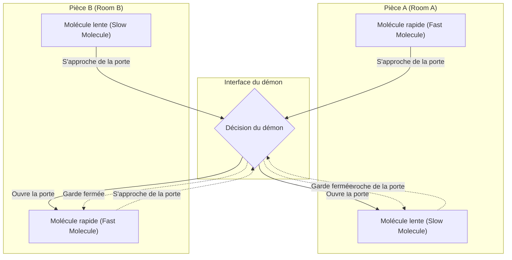
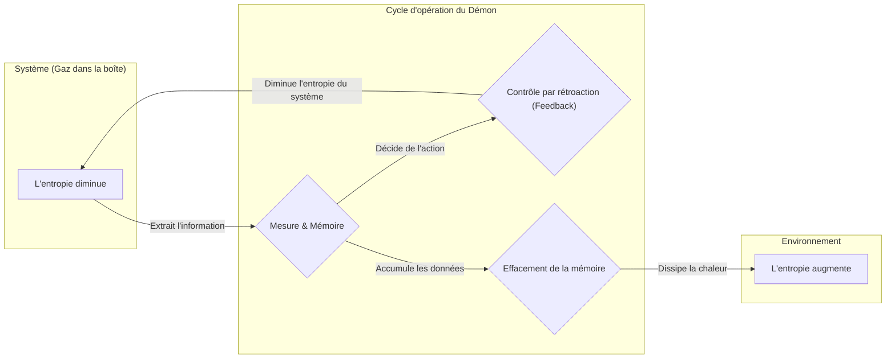

## Introduction

Dans l'histoire de la physique, l'une des expériences de pensée les plus célèbres, et celle qui a suscité le plus de débats, est le **démon de Maxwell**. Ce « démon », proposé par le physicien du 19ème siècle James Clerk Maxwell en 1867, a longtemps causé de profonds maux de tête aux physiciens du monde entier. La raison ? L'existence même de ce démon semblait violer de front la **deuxième loi de la thermodynamique**, l'une des lois les plus solides de la physique qui régit l'irréversibilité de l'univers.

Si ce démon existait réellement, nous serions capables d'extraire une énergie thermique infinie de l'air ambiant pour la transformer en travail utile, créant ainsi une « machine à mouvement perpétuel de deuxième espèce ». Cela signifierait la résolution définitive de nos problèmes énergétiques, mais aussi l'effondrement total de toutes les bases des lois de la physique telles que nous les connaissons.

Dans cet article, nous utiliserons de nombreux schémas et formules mathématiques pour expliquer en détail le paradoxe présenté par ce démon de Maxwell. Nous verrons également comment, après environ un siècle de recherches, ce mystère a finalement été élucidé grâce au concept de l'« information », qui semblait à première vue n'avoir aucun lien avec la physique matérielle.

## La deuxième loi de la thermodynamique et la loi de l'augmentation de l'entropie

Pour comprendre correctement la menace que représente le démon de Maxwell, il convient tout d'abord de rappeler les bases de la **deuxième loi de la thermodynamique** (loi de l'augmentation de l'entropie).

La deuxième loi de la thermodynamique est une règle absolue de la nature énonçant que « dans un système isolé, l'entropie (le degré de désordre) augmente toujours, ou tout au moins reste constante ». Cela peut s'exprimer par la formule suivante :

$$
\Delta S \ge 0
$$

Où $S$ représente l'entropie et $\Delta S$ la variation de l'entropie. L'entropie est interprétée comme une mesure de l'« état de désordre » ou du « chaos » d'un système.

Ludwig Boltzmann a lié l'entropie au nombre d'états microscopiques (le nombre de configurations possibles) $W$, formulant ainsi le célèbre principe de Boltzmann :

$$
S = k_B \ln W
$$

Ici, $k_B$ est la constante de Boltzmann ($1.38 \times 10^{-23} \ \mathrm{J/K}$). Cette équation montre que plus le nombre d'états microscopiques possibles est élevé (plus c'est désordonné), plus l'entropie est grande.

Prenons un exemple familier : du café chaud et du lait froid versés dans une même tasse. Avec le temps, les deux se mélangent naturellement pour donner un café au lait tiède. Au cours de ce processus, le système devient plus désordonné et l'entropie augmente. Cependant, l'inverse — c'est-à-dire qu'un café au lait tiède se sépare spontanément en café très chaud et en lait froid — ne se produira jamais. Ainsi, les phénomènes naturels ont une direction irréversible, qui s'exprime sous la forme de l'augmentation de l'entropie.

## L'expérience de pensée du démon de Maxwell

Face à cette loi fondamentale de la physique, Maxwell a proposé l'ingénieuse expérience de pensée suivante :

1. Imaginez un récipient isolé contenant un gaz. Ce récipient est divisé en deux compartiments (A et B) par une paroi centrale.
2. Au départ, les deux compartiments sont à la même température. L'énergie cinétique moyenne des molécules de gaz y est identique.
3. La paroi comporte un trou minuscule, doté d'une « porte » pouvant s'ouvrir et se fermer sans friction.
4. Devant cette porte se trouve une entité intelligente capable d'observer le mouvement individuel de chaque molécule de gaz : c'est le **démon**.
5. Le démon ouvre rapidement la porte *uniquement* lorsqu'une molécule rapide (à haute énergie) se dirige de A vers B, ou lorsqu'une molécule lente (à faible énergie) se dirige de B vers A. Le reste du temps, il maintient la porte fermée.

Le schéma ci-dessous illustre ce processus d'intervention ingénieux de la part du démon.

Que se passera-t-il après un certain temps ?

Suite aux ouvertures et fermetures sélectives de la porte par le démon, le compartiment B finira par ne contenir que des molécules rapides, tandis que le compartiment A n'accumulera que des molécules lentes. La température d'un gaz étant proportionnelle à l'énergie cinétique moyenne de ses molécules, la température du compartiment B finira par augmenter, et celle du compartiment A par baisser.

Cela signifie que sans avoir fourni aucun travail mécanique (aucune énergie) de l'extérieur, une différence de température a été créée dans un système où la température était initialement uniforme. S'il y a une différence de température, nous pouvons utiliser un moteur thermique pour en extraire un travail utile.

En d'autres termes, l'entropie globale dans ce système isolé aurait diminué :

$$
\Delta S < 0
$$

À travers cette expérience de pensée, Maxwell essayait de démontrer que la deuxième loi de la thermodynamique n'est pas une loi mécanique absolue, mais plutôt une « loi probabiliste, valable seulement lorsque l'on traite statistiquement un grand nombre de molécules ». Cependant, si l'on parvenait à recréer artificiellement une entité similaire à ce démon, on pourrait construire une « machine à mouvement perpétuel de deuxième espèce ». [Le démon de Maxwell](https://kenji.blog/fr/p/maxwells-demon/) exposait ainsi une contradiction flagrante vis-à-vis de la deuxième loi de la thermodynamique.

## Le moteur de Szilárd : Acquisition d'information et conversion en travail

Ce paradoxe démoniaque a plongé les physiciens dans de profonds tourments pendant un siècle entier. Le démon se contentait d'ouvrir et de fermer la porte en fonction de certaines informations (en théorie, si la porte n'a pas de masse, cela ne requiert aucune énergie), et il était totalement impossible de déterminer *où*, dans ce système, l'entropie pouvait bien augmenter.

Le physicien Leó Szilárd a fait le premier pas vers la résolution de ce casse-tête en 1929. Szilárd a conçu une expérience de pensée simplifiée à l'extrême, le **moteur de Szilárd**, qui extrayait l'essence même du démon de Maxwell.

Le moteur de Szilárd consiste en un cylindre contenant une *unique* molécule de gaz, et une séparation (un piston) que l'on peut insérer au milieu. La procédure est la suivante :

1. On insère une séparation au milieu du cylindre contenant une molécule de gaz.
2. Le démon acquiert 1 bit d'**information** : savoir si la molécule se trouve du côté droit ou du côté gauche de la séparation.
3. Si la molécule se trouve du côté gauche, le démon déplace la séparation vers la droite, permettant à la molécule d'effectuer un travail par expansion. Si elle se trouve à droite, il déplace la séparation vers la gauche.
4. Lors du déplacement du piston, la molécule absorbe de la chaleur du bain thermique environnant et la convertit en travail mécanique $W$.

Lors de l'expansion isotherme, le travail $W$ que la molécule fournit au milieu extérieur peut se calculer selon l'équation d'état des gaz parfaits :

$$
W = \int_{V/2}^{V} p \, dV = \int_{V/2}^{V} \frac{k_B T}{V} \, dV = k_B T \ln 2
$$

Szilárd a eu l'intuition que c'est dans le processus même où le démon « observe » et « mémorise » l'état du système que se cache la relation profonde entre l'entropie et l'information. Il a suggéré que l'acte même d'obtenir une information entraîne une augmentation de l'entropie.

## L'entropie de Shannon et la fusion avec la thermodynamique

En 1948, Claude Shannon a fondé la théorie de l'information et a défini l'**entropie de l'information** (ou entropie de Shannon) comme une mesure de l'incertitude de l'information. L'entropie $H$ d'une source d'information suivant une distribution de probabilité $P(x)$ s'exprime ainsi :

$$
H = - \sum_{x} P(x) \log_2 P(x) \quad \mathrm{(bits)}
$$

Étonnamment, la formule de l'entropie de l'information de Shannon avait exactement la même forme mathématique que la formule de l'entropie thermodynamique de Boltzmann, à une constante multiplicative près. C'est à partir de ce point que la véritable « fusion » entre l'« information » et la « thermodynamique » a commencé.

## Le principe de Landauer : L'information est physique

Poursuivant les intuitions de Szilárd et la théorie de l'information de Shannon, ce sont les travaux de Rolf Landauer en 1961, puis de Charles Bennett, qui ont finalement permis de résoudre complètement le paradoxe.

Landauer a affirmé fermement que « l'information est physique ». Le stockage, la transmission et la manipulation d'informations ne se déroulent pas dans un espace abstrait, mais dépendent nécessairement d'une entité physique (du matériel) et sont donc soumis aux lois de la physique.

Le principe extrêmement important découvert par Landauer, le **principe de Landauer**, stipule que « l'**effacement** d'une information s'accompagne toujours d'une dissipation de chaleur dans l'environnement, augmentant ainsi l'entropie de celui-ci ».

L'énergie minimale requise (la chaleur dissipée) $Q$ pour effacer complètement 1 bit d'information est donnée par l'équation suivante :

$$
Q \ge k_B T \ln 2
$$

L'augmentation d'entropie $\Delta S_{erase}$ correspondante dans l'environnement est :

$$
\Delta S_{erase} \ge k_B \ln 2
$$

Écrire ou « calculer » des informations peut théoriquement se faire sans consommation d'énergie. En revanche, pour les opérations irréversibles que sont l'« effacement » ou l'« oubli » de l'information, on doit obligatoirement s'acquitter d'un coût thermodynamique.

## La mort du démon de Maxwell et la fin du paradoxe

En 1982, Charles Bennett a finalement porté le coup de grâce au paradoxe du démon de Maxwell en appliquant le principe de Landauer.

Le raisonnement de Bennett est le suivant :

1. Le démon observe la vitesse et la position des molécules de gaz et les enregistre dans son propre cerveau (ou dans une mémoire physique).
2. Sur la base des informations enregistrées, il ouvre ou ferme la porte. Si toutes ces étapes sont réversibles, elles peuvent, en théorie, s'effectuer sans aucune augmentation de l'entropie.
3. Cependant, la capacité de mémoire du démon est limitée. Pour continuer indéfiniment à trier des molécules, il doit, à un moment donné, **effacer** ses anciennes mémoires afin de réinitialiser son espace de stockage.
4. Selon le principe de Landauer, au moment précis où le démon efface 1 bit de son information, une chaleur d'au moins $k_B T \ln 2$ est obligatoirement dissipée dans l'environnement externe, augmentant l'entropie globale.

Par conséquent, même si les agissements astucieux du démon entraînent une diminution de l'entropie *à l'intérieur* de la boîte, l'action du démon visant à effacer sa propre mémoire pour maintenir le système en marche va inéluctablement générer une augmentation d'entropie *à l'extérieur* (dans l'environnement) bien supérieure.

Si l'on considère le système dans sa globalité, le bilan total de la variation d'entropie sera toujours supérieur ou égal à zéro.

$$
\Delta S_{total} = \Delta S_{gas} + \Delta S_{memory\_erasure} \ge 0
$$

Plus le démon se montre intelligent pour réduire le désordre à l'intérieur de la boîte, plus le désordre, sous la forme d'« informations », s'accumule dans sa tête. Et au moment où il tente de ranger (effacer) ce fouillis mental, ce désordre est rejeté dans l'univers sous forme de chaleur.

## La thermodynamique de l'information et son développement vers l'avenir

Le paradoxe du démon de Maxwell a permis de clarifier que le concept abstrait de l'« information » et les notions physiques d'« énergie » ou d'« entropie » sont, en fin de compte, équivalents et intimement liés.

Cette immense découverte est en train d'ouvrir de nouvelles frontières en physique, en tant que domaines en pleine expansion sous les noms de **thermodynamique de l'information** et de **mécanique statistique hors équilibre**.

Récemment, la recherche s'est penchée sur la façon dont des machines moléculaires biologiques, telles que l'ADN polymérase ou la kinésine agissant à l'intérieur des cellules, utilisent l'information pour convertir efficacement l'énergie et produire un mouvement unidirectionnel, un peu à l'image du démon de Maxwell. Les lois de la thermodynamique de l'information sont profondément ancrées jusque dans les mécanismes mêmes du vivant.

Par ailleurs, la limite de Landauer, qui représente la barrière énergétique ultime pour le traitement de l'information, est devenue la base théorique la plus importante lorsqu'il s'agit d'envisager la réduction de la consommation électrique des futurs ordinateurs. Afin de surmonter la barrière physique que constitue la dissipation fondamentale de chaleur lors de l'effacement des données, des recherches sont en cours sur l'« informatique réversible », un concept où les informations ne seraient pas effacées.

## Conclusion

Le petit démon lâché par Maxwell au 19ème siècle est devenu l'une des expériences de pensée les plus belles et les plus profondes de la physique. Ce qui avait commencé comme un défi audacieux tentant de détruire la deuxième loi de la thermodynamique a fini par apporter une percée inattendue en dévoilant « la réalité physique de l'information ».

« Apprendre », et puis « oublier ».

Derrière le traitement de l'information que nous effectuons quotidiennement, la thermodynamique, loi fondamentale de l'univers, veille en permanence. **Information** et **énergie** sont les deux faces d'une même pièce. Il ne fait aucun doute que ce lien très profond continuera à susciter de nouvelles révolutions dans de nombreux domaines à l'avenir. Même longtemps après sa mort théorique, le démon de Maxwell continue à nous ouvrir de nouvelles portes vers la connaissance.
