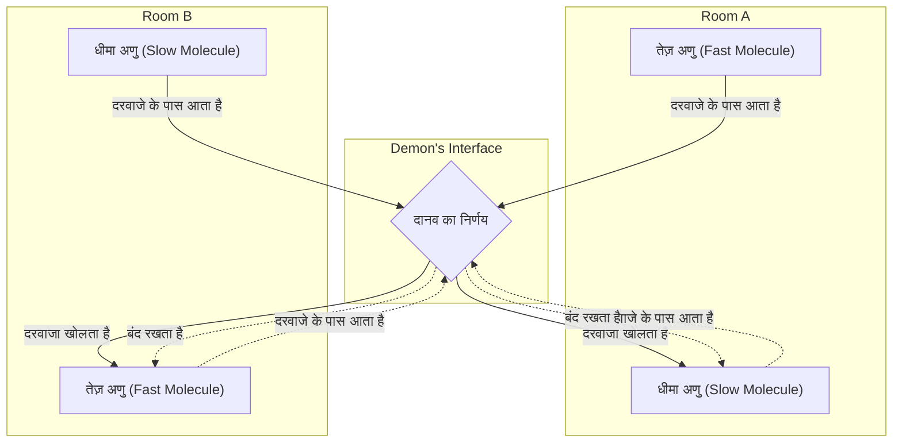
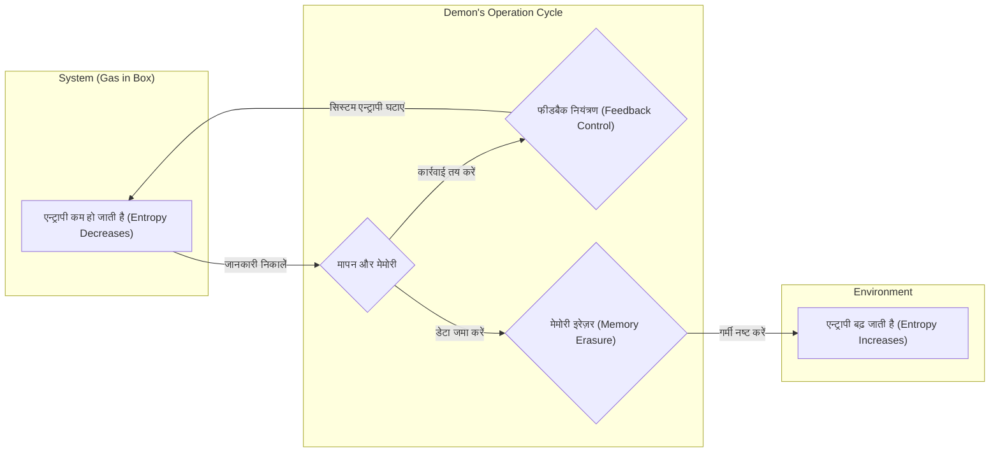

## परिचय

भौतिकी के इतिहास में सबसे प्रसिद्ध और चर्चित विचार प्रयोगों (thought experiments) में से एक **[मैक्सवेल का दानव ([Maxwell's Demon](https://kenji.blog/hi/p/maxwells-demon/))](https://kenji.blog/p/maxwells-demon/)** है। 1867 में 19वीं सदी के भौतिक विज्ञानी जेम्स क्लर्क मैक्सवेल द्वारा प्रस्तावित इस "दानव" ने कई वर्षों तक दुनिया भर के भौतिक विज्ञानियों को बहुत परेशान किया है। ऐसा इसलिए है क्योंकि इस दानव का अस्तित्व भौतिकी के सबसे मजबूत नियमों में से एक को सीधे तौर पर तोड़ता हुआ प्रतीत होता था, **ऊष्मप्रवैगिकी का दूसरा नियम (Second Law of Thermodynamics)**, जो ब्रह्मांड की अपरिवर्तनीयता (irreversibility) को नियंत्रित करता है।

यदि यह दानव वास्तव में मौजूद होता, तो हम हवा से असीमित ताप ऊर्जा (heat energy) निकालने और इसे काम (work) में बदलने के लिए "दूसरी तरह की एक सतत गति मशीन (perpetual motion machine of the second kind)" बनाने में सक्षम होते। इसका अर्थ यह होगा कि ऊर्जा की समस्या हमेशा के लिए हल हो जाएगी, लेकिन साथ ही, इसका अर्थ यह होगा कि हमारे द्वारा ज्ञात भौतिक नियमों की नींव ढह जाएगी।

इस लेख में, हम गणितीय सूत्रों और आरेखों का उपयोग करते हुए विस्तार से बताएंगे कि मैक्सवेल के दानव ने किस तरह का विरोधाभास प्रस्तुत किया, और कैसे, लगभग एक सदी बाद, इसे "सूचना (information)" की अवधारणा द्वारा हल किया गया था, जो पहली नज़र में भौतिकी से असंबंधित लगती है।

## ऊष्मप्रवैगिकी का दूसरा नियम और एन्ट्रापी वृद्धि का नियम

मैक्सवेल के दानव के खतरे को ठीक से समझने के लिए, आइए पहले **ऊष्मप्रवैगिकी के दूसरे नियम (Second Law of Thermodynamics)** (एन्ट्रापी वृद्धि का नियम / law of increase of entropy) की मूल बातों की समीक्षा करें।

ऊष्मप्रवैगिकी का दूसरा नियम प्राकृतिक दुनिया में एक पूर्ण नियम है जो बताता है कि "एक पृथक प्रणाली (isolated system) में एन्ट्रापी (विकार की डिग्री / degree of disorder) हमेशा बढ़ती है या स्थिर रहती है।" इसे गणितीय रूप से इस प्रकार व्यक्त किया जा सकता है:

$$
\Delta S \ge 0
$$

यहाँ, $S$ एन्ट्रापी का प्रतिनिधित्व करता है, और $\Delta S$ एन्ट्रापी में परिवर्तन का प्रतिनिधित्व करता है। एन्ट्रापी को किसी प्रणाली के "विकार (disorder)" या "बेतरतीबपन (randomness)" के उपाय के रूप में समझा जाता है।

लुडविग बोल्ट्जमैन (Ludwig Boltzmann) ने एन्ट्रापी को सूक्ष्म अवस्थाओं (microscopic states) (संभावित व्यवस्थाओं की संख्या) की संख्या $W$ से जोड़ा और प्रसिद्ध बोल्ट्जमैन के सिद्धांत को तैयार किया।

$$
S = k_B \ln W
$$

यहाँ, $k_B$ बोल्ट्जमैन स्थिरांक ($1.38 \times 10^{-23} \ \mathrm{J/K}$) है। यह समीकरण दर्शाता है कि संभावित सूक्ष्म अवस्थाओं की संख्या जितनी अधिक होगी (प्रणाली जितनी अधिक अव्यवस्थित होगी), एन्ट्रापी उतनी ही अधिक होगी।

एक परिचित उदाहरण के रूप में, एक ही कप में गर्म कॉफी और ठंडा दूध डालने पर विचार करें। समय के साथ, दोनों स्वाभाविक रूप से मिल जाएंगे और गुनगुना कैफे औ लेट बन जाएंगे। इस प्रक्रिया में, सिस्टम अधिक अव्यवस्थित हो जाता है और एन्ट्रापी बढ़ जाती है। हालाँकि, इसके विपरीत - यानी, गुनगुना कैफे औ लेट अनायास गर्म कॉफी और ठंडे दूध में अलग हो जाता है - कभी नहीं होगा। इस तरह, प्राकृतिक दुनिया की घटनाओं में एक अपरिवर्तनीय दिशा होती है, और इसे एन्ट्रापी में वृद्धि के रूप में व्यक्त किया जाता है।

## मैक्सवेल के दानव का विचार प्रयोग

भौतिकी की नींव बनाने वाले इस नियम की प्रतिक्रिया में, मैक्सवेल ने निम्नलिखित सरल विचार प्रयोग का प्रस्ताव रखा।

1. गैस एक ऊष्मारोधी (thermally insulated) कंटेनर में निहित है और इसे केंद्रीय दीवार से दो कमरों (A और B) में विभाजित किया गया है।
2. प्रारंभ में, दोनों कमरे एक ही तापमान पर होते हैं, जिसका अर्थ है कि गैस के अणुओं की औसत गतिज ऊर्जा समान होती है।
3. दीवार में एक बहुत छोटा छेद होता है, जिसमें एक "दरवाजा" होता है जिसे बिना घर्षण के खोला और बंद किया जा सकता है।
4. इस दरवाजे के सामने एक बुद्धिमान इकाई है जो व्यक्तिगत गैस अणुओं की गति को देख सकती है; यह **दानव** है।
5. दानव दरवाजे को केवल तभी जल्दी खोलता है जब तेजी से चलने वाला (उच्च-ऊर्जा) अणु A से B की ओर बढ़ता है, या जब धीमी गति से चलने वाला (कम-ऊर्जा) अणु B से A की ओर बढ़ता है। वह अन्य समय में दरवाज़ा बंद रखता है।

दानव की यह सरल कार्य प्रक्रिया नीचे दिए गए चित्र में दिखाई गई है।

समय बीतने पर क्या होता है?

दानव द्वारा दरवाजे के चयनात्मक रूप से खुलने और बंद होने के कारण, कमरे B में केवल तेज अणु एकत्र होंगे, और कमरे A में केवल धीमे अणु एकत्र होंगे। चूंकि गैस का तापमान अणुओं की औसत गतिज ऊर्जा के समानुपाती होता है, इसलिए परिणाम यह होता है कि कक्ष B का तापमान बढ़ जाता है और कक्ष A का तापमान कम हो जाता है।

इसका अर्थ यह है कि बिना किसी बाहरी यांत्रिक कार्य (ऊर्जा) को जोड़े, एक प्रणाली के भीतर एक तापमान अंतर बनाया गया था जो समान तापमान पर था। यदि तापमान में अंतर है, तो उससे उपयोगी कार्य निकालने के लिए हीट इंजन (heat engine) का उपयोग किया जा सकता है।

दूसरे शब्दों में, एक पृथक प्रणाली में समग्र एन्ट्रापी कम हो गई है।

$$
\Delta S < 0
$$

इस विचार प्रयोग के माध्यम से, स्वयं मैक्सवेल यह दिखाना चाहते थे कि ऊष्मप्रवैगिकी का दूसरा नियम कोई पूर्ण यांत्रिक नियम (absolute mechanical law) नहीं है, बल्कि केवल एक "संभाव्य नियम (probabilistic law) है जो केवल बड़ी संख्या में अणुओं से सांख्यिकीय रूप से निपटते समय ही सही होता है।" हालाँकि, यदि इस दानव जैसी इकाई को कृत्रिम रूप से बनाया जा सकता है, तो "दूसरी तरह की एक सतत गति मशीन" पूरी हो जाएगी। मैक्सवेल के दानव ने ऊष्मप्रवैगिकी के दूसरे नियम के समक्ष स्पष्ट विरोधाभास प्रस्तुत किया।

## स्ज़िलार्ड का इंजन: जानकारी प्राप्त करना और कार्य रूपांतरण

दानव के इस विरोधाभास ने भौतिक विज्ञानियों को एक सदी तक गहरी परेशानी में डाल दिया। ऐसा इसलिए था क्योंकि दानव केवल जानकारी के आधार पर दरवाजे को खोल और बंद कर रहा था (सैद्धांतिक रूप से, यदि दरवाजा द्रव्यमान रहित हो तो किसी ऊर्जा की आवश्यकता नहीं है), और यह पूरी तरह से अज्ञात था कि सिस्टम में एन्ट्रापी कहां बढ़ रही थी।

इस पहेली को सुलझाने की दिशा में पहला कदम 1929 में भौतिक विज्ञानी लियो स्ज़िलार्ड (Leo Szilard) ने उठाया था। स्ज़िलार्ड ने **स्ज़िलार्ड का इंजन (Szilard's engine)** तैयार किया, जो एक अत्यंत सरलीकृत विचार प्रयोग है जिसने मैक्सवेल के दानव के सार को निकाला।

स्ज़िलार्ड के इंजन में गैस के केवल एक अणु वाला एक सिलेंडर और बीच में डाला जा सकने वाला एक विभाजन (पिस्टन) होता है। प्रक्रिया इस प्रकार है।

1. गैस के 1 अणु वाले सिलेंडर के केंद्र में एक विभाजन डाला जाता है।
2. दानव यह 1 बिट **जानकारी** प्राप्त करता है कि अणु विभाजन के दाईं ओर है या बाईं ओर।
3. यदि अणु बाईं ओर है, तो विभाजन को दाईं ओर ले जाएँ ताकि अणु फैल सके। यदि यह दाईं ओर है, तो इसे बाईं ओर ले जाएं।
4. पिस्टन की गति के कारण, अणु आसपास के ताप स्नान (heat bath) से गर्मी को अवशोषित करता है और इसे यांत्रिक कार्य $W$ में परिवर्तित करता है।

इस समय, आइसोथर्मल विस्तार (isothermal expansion) द्वारा अणु द्वारा बाहरी रूप से किया गया कार्य $W$, आदर्श गैस अवस्था समीकरण (ideal gas equation of state) से निम्नानुसार गणना की जाती है।

$$
W = \int_{V/2}^{V} p \, dV = \int_{V/2}^{V} \frac{k_B T}{V} \, dV = k_B T \ln 2
$$

स्ज़िलार्ड ने देखा कि दानव द्वारा सिस्टम की स्थिति को "देखने" और उसे "याद रखने" की प्रक्रिया में ही एन्ट्रापी और सूचना के बीच गहरा संबंध छिपा था। उनका मानना ​​था कि जानकारी प्राप्त करने से ही एन्ट्रापी बढ़ जाती है।

## शैनन एन्ट्रापी और ऊष्मप्रवैगिकी का संलयन

1948 में, क्लाउड शैनन (Claude Shannon) ने सूचना सिद्धांत (information theory) की स्थापना की और **सूचना एन्ट्रापी (Information Entropy)** (शैनन एन्ट्रापी) को परिभाषित किया, जो सूचना की अनिश्चितता का प्रतिनिधित्व करता है। संभाव्यता वितरण $P(x)$ का पालन करने वाले सूचना स्रोत की एन्ट्रापी $H$ इस प्रकार व्यक्त की जाती है:

$$
H = - \sum_{x} P(x) \log_2 P(x) \quad \mathrm{(bits)}
$$

आश्चर्यजनक रूप से, शैनन के सूचना एन्ट्रापी सूत्र का आकार बोल्ट्जमैन के ऊष्मप्रवैगिक एन्ट्रापी सूत्र के बिल्कुल समान था, सिवाय एक स्थिरांक गुणांक (constant coefficient) के। इस बिंदु से "सूचना" और "ऊष्मप्रवैगिकी (thermodynamics)" का पूर्ण संलयन शुरू हुआ।

## लैंडौअर का सिद्धांत: सूचना भौतिक है

जिन्होंने स्ज़िलार्ड की अंतर्दृष्टि और शैनन के सूचना सिद्धांत को आगे बढ़ाया और अंततः विरोधाभास के पूर्ण समाधान का नेतृत्व किया, वे 1961 में रॉल्फ लैंडौअर (Rolf Landauer) और बाद में चार्ल्स बेनेट (Charles Bennett) के शोध थे।

लैंडौअर ने दृढ़ता से तर्क दिया कि "सूचना भौतिक है।" जानकारी का भंडारण, संचरण और हेरफेर किसी अमूर्त स्थान में नहीं होता है, बल्कि हमेशा भौतिक संस्थाओं (हार्डवेयर) पर निर्भर करता है और भौतिकी के नियमों द्वारा शासित होता है।

लैंडौअर द्वारा खोजा गया अत्यंत महत्वपूर्ण सिद्धांत, अर्थात् **लैंडौअर का सिद्धांत (Landauer's principle)** है, "जब जानकारी **मिटा दी जाती है (erased)**, तो गर्मी हमेशा पर्यावरण में छोड़ी जाती है, और पर्यावरण की एन्ट्रापी बढ़ जाती है।"

1 बिट जानकारी को पूरी तरह से मिटाने के लिए आवश्यक न्यूनतम ऊर्जा (निकाली गई ऊष्मा) $Q$ निम्नलिखित सूत्र द्वारा दी गई है।

$$
Q \ge k_B T \ln 2
$$

पर्यावरण की एन्ट्रापी $\Delta S_{erase}$ में परिणामी वृद्धि इस प्रकार है:

$$
\Delta S_{erase} \ge k_B \ln 2
$$

सिद्धांत रूप में, ऊर्जा की खपत के बिना जानकारी "लिखना" या "गणना करना" संभव है। हालाँकि, "भूलने (forgetting)" या "मिटाने (erasing)" के अपरिवर्तनीय संचालन के लिए हमेशा ऊष्मप्रवैगिक कीमत (thermodynamic price) का भुगतान किया जाना चाहिए।

## मैक्सवेल के दानव की मृत्यु और विरोधाभास का अंत

1982 में, चार्ल्स बेनेट ने लैंडौअर के सिद्धांत का उपयोग अंततः मैक्सवेल के दानव विरोधाभास को हमेशा के लिए शांत करने के लिए किया।

बेनेट का तर्क इस प्रकार है।

1. दानव गैस के अणुओं के वेग और स्थिति को देखता है और उन्हें अपने मस्तिष्क (या भौतिक स्मृति) में दर्ज करता है।
2. दर्ज की गई जानकारी के आधार पर, यह दरवाजा खोलता और बंद करता है। यहां तक ​​कि संचालन सिद्धांत रूप में एन्ट्रापी में वृद्धि के बिना किया जा सकता है यदि यह प्रतिवर्ती (reversible) है।
3. हालाँकि, दानव की याददाश्त क्षमता की एक सीमा होती है। अणुओं को हमेशा के लिए छांटते रहने के लिए, इसे किसी बिंदु पर पुरानी यादों को **मिटाना** होगा और मेमोरी को रीसेट करना होगा।
4. लैंडौअर के सिद्धांत के अनुसार, जिस क्षण दानव 1 बिट जानकारी मिटाता है, पर्यावरण में $k_B T \ln 2$ या अधिक गर्मी अनिवार्य रूप से छोड़ी जाती है, और पर्यावरण की एन्ट्रापी बढ़ जाती है।

दूसरे शब्दों में, भले ही बॉक्स के अंदर एन्ट्रापी अणुओं को छांटने वाले दानव के कारण कम हो जाती है, जब दानव सिस्टम को चालू रखने के लिए अपनी खुद की मेमोरी को मिटाता है, तो बाहरी वातावरण में इससे भी बड़ी एन्ट्रापी वृद्धि अवश्य होती है।

यदि हम समग्र रूप से सिस्टम को देखें, तो कुल एन्ट्रापी में परिवर्तन हमेशा शून्य या अधिक होता है।

$$
\Delta S_{total} = \Delta S_{gas} + \Delta S_{memory\_erasure} \ge 0
$$

जितना अधिक दानव बुद्धिमानी से कार्य करता है और बॉक्स के अंदर विकार को कम करता है, उतना ही अधिक विकार "सूचना" नामक दानव के सिर में जमा होता है। और जिस क्षण वह अपने सिर (मिटाने) को व्यवस्थित करने की कोशिश करता है, वह विकार गर्मी बन जाता है और पूरे ब्रह्मांड में बिखर जाता है।

## सूचना ऊष्मप्रवैगिकी और भविष्य के विकास

मैक्सवेल के दानव विरोधाभास ने यह स्पष्ट कर दिया कि "सूचना" की अमूर्त अवधारणा और "ऊर्जा" और "एन्ट्रापी" की भौतिक अवधारणाएँ अंततः समतुल्य हैं और आपस में निकटता से जुड़ी हुई हैं।

यह भव्य खोज अब **सूचना ऊष्मप्रवैगिकी (Information Thermodynamics)** और **गैर-संतुलन सांख्यिकीय यांत्रिकी (Non-equilibrium Statistical Mechanics)** नामक भौतिकी में एक नई सीमा के रूप में तेजी से विकसित हो रही है।

हाल के वर्षों में, इस तंत्र पर शोध किया गया है कि कैसे बायोमोलेक्यूलर मशीनें (biomolecular machines) जैसे डीएनए पोलीमरेज़ (DNA polymerase) और किनेसिन (kinesin) जो जीवित कोशिकाओं के भीतर काम करते हैं, मैक्सवेल के दानव की तरह कुशलतापूर्वक ऊर्जा में जानकारी परिवर्तित करते हैं और एक दिशा में गति पैदा करते हैं। सूचना ऊष्मप्रवैगिकी के नियम भी जीवन की घटनाओं की जड़ों में गहराई से शामिल हैं।

इसके अलावा, लैंडौअर सीमा, जो सूचना प्रसंस्करण की अंतिम ऊर्जा सीमा है, भविष्य के कंप्यूटरों की बिजली बचत पर विचार करने के लिए सबसे महत्वपूर्ण सैद्धांतिक आधार बन गई है। सूचना को मिटाने के साथ होने वाले मौलिक ताप सृजन की भौतिक दीवार को तोड़ने के लिए "प्रतिवर्ती कंप्यूटिंग (reversible computing)" पर भी शोध किया जा रहा है जो सूचना को नहीं मिटाता है।

## निष्कर्ष

19वीं सदी में मैक्सवेल द्वारा छोड़ा गया छोटा सा दानव भौतिकी में सबसे सुंदर और गहन विचार प्रयोगों में से एक बन गया। इसकी शुरुआत ऊष्मप्रवैगिकी के दूसरे नियम को नष्ट करने की एक साहसिक चुनौती के रूप में हुई, और इसके परिणामस्वरूप "सूचना की भौतिक वास्तविकता" को स्पष्ट करने की अप्रत्याशित सफलता मिली।

"जानना (Knowing)" और "भूलना (Forgetting)"।

हम जिस सूचना प्रसंस्करण को रोज़ाना करते हैं, उसके पीछे ऊष्मप्रवैगिकी (thermodynamics), ब्रह्मांड का मौलिक नियम, हमेशा नजर रख रही है। **सूचना (Information)** और **ऊर्जा (Energy)** एक ही सिक्के के दो पहलू हैं। इस गहरे संबंध से भविष्य में भी विभिन्न क्षेत्रों में नई क्रांतियाँ आती रहेंगी। मृत्यु के बाद भी, मैक्सवेल का दानव हमारे लिए ज्ञान के नए द्वार खोलता रहता है।
