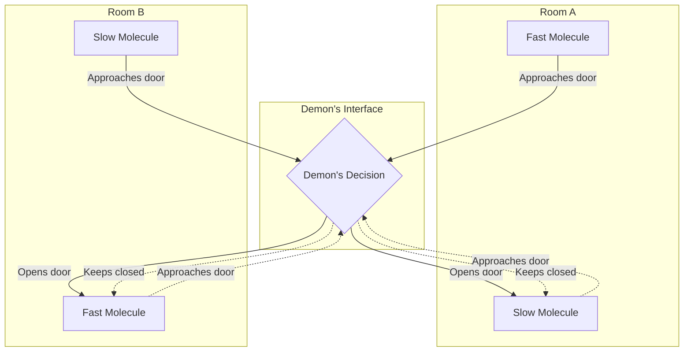
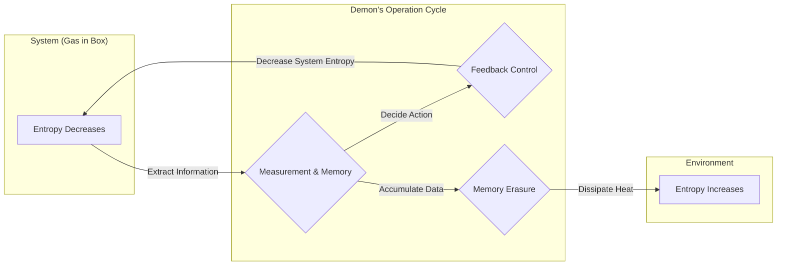

## Pendahuluan

Dalam sejarah fisika, salah satu eksperimen pikiran yang paling terkenal dan banyak diperdebatkan adalah **[Iblis Maxwell](https://kenji.blog/p/maxwells-demon/)**. Iblis ini, yang diusulkan oleh fisikawan abad ke-19 James Clerk Maxwell pada tahun 1867, telah membingungkan para fisikawan di seluruh dunia selama bertahun-tahun. Pasalnya, keberadaan iblis ini tampaknya secara langsung melanggar **Hukum Kedua Termodinamika**, salah satu hukum fisika yang paling kokoh dan mengatur ireversibilitas (ketidakbalikan) alam semesta.

Jika iblis ini benar-benar ada, kita akan mampu mengekstraksi energi panas tak terbatas dari udara dan mengubahnya menjadi kerja, menciptakan "mesin abadi jenis kedua". Hal ini berarti masalah energi akan terselesaikan selamanya, tetapi pada saat yang sama, ini berarti runtuhnya premis hukum fisika yang kita kenal.

Dalam artikel ini, kita akan membahas secara rinci paradoks apa yang disajikan oleh [Iblis Maxwell](https://kenji.blog/p/maxwells-demon/) ini, dan bagaimana, setelah sekitar satu abad, ia dipecahkan oleh konsep yang tampaknya tidak berhubungan dengan fisika, yaitu "informasi", dengan menggunakan banyak rumus matematika dan ilustrasi.

## Hukum Kedua Termodinamika dan Hukum Peningkatan Entropi

Untuk memahami dengan benar ancaman dari [Iblis Maxwell](https://kenji.blog/p/maxwells-demon/), mari kita tinjau kembali dasar-dasar **Hukum Kedua Termodinamika** (Hukum Peningkatan Entropi).

Hukum Kedua Termodinamika adalah aturan mutlak di alam yang menyatakan, "Entropi (tingkat ketidakteraturan) dalam sistem terisolasi selalu meningkat atau tetap konstan". Jika dinyatakan dalam rumus matematika, bentuknya adalah sebagai berikut:

$$
\Delta S \ge 0
$$

Di sini, $S$ adalah entropi dan $\Delta S$ adalah perubahan entropi. Entropi ditafsirkan sebagai ukuran "ketidakteraturan" atau "kekacauan" suatu sistem.

Ludwig Boltzmann mengaitkan entropi dengan jumlah keadaan mikroskopis (jumlah kemungkinan) $W$, dan merumuskan prinsip Boltzmann yang terkenal:

$$
S = k_B \ln W
$$

Di sini, $k_B$ adalah konstanta Boltzmann ($1.38 \times 10^{-23} \ \mathrm{J/K}$). Persamaan ini menunjukkan bahwa semakin banyak keadaan mikroskopis yang mungkin (semakin acak), semakin besar entropinya.

Sebagai contoh sehari-hari, mari kita pertimbangkan secangkir kopi panas dan susu dingin yang dituangkan ke dalam cangkir yang sama. Seiring berjalannya waktu, keduanya akan bercampur secara alami menjadi kafe au lait yang hangat. Dalam proses ini, sistem menjadi lebih tidak teratur dan entropi meningkat. Namun sebaliknya, tidak akan pernah terjadi bahwa kafe au lait yang hangat secara spontan terpisah kembali menjadi kopi panas dan susu dingin. Dengan demikian, fenomena di alam memiliki arah yang ireversibel, dan hal ini diekspresikan dalam bentuk peningkatan entropi.

## Eksperimen Pikiran [Iblis Maxwell](https://kenji.blog/p/maxwells-demon/)

Terhadap hukum yang menjadi landasan fisika ini, Maxwell mengusulkan eksperimen pikiran yang cerdik sebagai berikut:

1. Sebuah wadah berinsulasi panas berisi gas, yang dibagi menjadi dua ruangan (A dan B) oleh dinding di tengahnya.
2. Pada awalnya, kedua ruangan memiliki suhu yang sama, yang berarti energi kinetik rata-rata molekul gasnya sama.
3. Terdapat sebuah lubang sangat kecil di dinding tersebut, dilengkapi dengan sebuah "pintu" yang dapat dibuka dan ditutup tanpa gesekan.
4. Di depan pintu ini terdapat entitas cerdas yang mampu mengamati pergerakan setiap molekul gas, inilah sang **Iblis**.
5. Iblis tersebut dengan cepat membuka pintu hanya ketika molekul yang bergerak cepat (berenergi tinggi) menuju dari A ke B, atau ketika molekul yang bergerak lambat (berenergi rendah) menuju dari B ke A. Selain itu, pintu tetap dibiarkan tertutup.

Proses kerja cerdik iblis ini diilustrasikan pada diagram berikut.

Apa yang akan terjadi setelah beberapa waktu?

Akibat pembukaan dan penutupan pintu secara selektif oleh si iblis, ruangan B hanya akan dipenuhi molekul-molekul cepat, sedangkan ruangan A hanya akan berisi molekul-molekul lambat. Karena suhu gas sebanding dengan energi kinetik rata-rata molekulnya, akibatnya suhu di ruangan B akan naik dan suhu di ruangan A akan turun.

Hal ini berarti suatu perbedaan suhu telah tercipta di dalam sistem yang awalnya bersuhu seragam tanpa adanya usaha (energi) mekanik sedikit pun dari luar. Jika terdapat perbedaan suhu, kita dapat menggunakan mesin kalor untuk mengekstraksi kerja yang berguna darinya.

Dengan kata lain, entropi keseluruhan dalam sistem yang terisolasi telah berkurang.

$$
\Delta S < 0
$$

Maxwell sendiri bermaksud menggunakan eksperimen pikiran ini untuk menunjukkan bahwa Hukum Kedua Termodinamika bukanlah hukum mekanika absolut, melainkan "hukum probabilistik yang hanya berlaku secara statistik ketika berhadapan dengan molekul dalam jumlah besar". Namun, jika entitas seperti iblis ini dapat diciptakan secara buatan, sebuah "mesin abadi jenis kedua" akan tercipta. [Iblis Maxwell](https://kenji.blog/p/maxwells-demon/) menghadirkan kontradiksi yang jelas terhadap Hukum Kedua Termodinamika.

## Mesin Szilard: Pemerolehan Informasi dan Konversi Kerja

Paradoks iblis ini menenggelamkan para fisikawan dalam jurang kebingungan selama satu abad penuh. Pasalnya, sang iblis hanyalah mengoperasikan pembukaan dan penutupan pintu berdasarkan informasi (secara teoritis, jika pintunya bermassa nol, maka tidak diperlukan energi), dan sama sekali tidak diketahui di bagian sistem mana entropi meningkat.

Langkah pertama menuju pemecahan teka-teki ini diambil pada tahun 1929 oleh fisikawan Leo Szilard. Szilard merancang **Mesin Szilard**, sebuah eksperimen pikiran yang sangat disederhanakan yang mengekstraksi esensi dari [Iblis Maxwell](https://kenji.blog/p/maxwells-demon/).

Mesin Szilard terdiri dari sebuah silinder yang hanya berisi 1 molekul gas, dan sebuah sekat (piston) yang dapat disisipkan di tengahnya. Prosedurnya adalah sebagai berikut:

1. Sebuah sekat disisipkan di tengah silinder yang berisi 1 molekul gas.
2. Iblis memperoleh 1 bit **informasi**, yaitu apakah molekul tersebut berada di sisi kanan atau kiri sekat.
3. Jika molekul berada di sebelah kiri, sekat dipindahkan ke kanan agar molekul melakukan kerja ekspansi (pemuaian). Jika berada di sebelah kanan, sekat dipindahkan ke kiri.
4. Dengan pergerakan piston, molekul menyerap panas dari penangas panas di sekitarnya, dan mengubahnya menjadi kerja mekanik $W$.

Pada saat ini, kerja $W$ yang dilakukan molekul terhadap lingkungan luarnya melalui ekspansi isotermal dihitung dari persamaan keadaan gas ideal sebagai berikut:

$$
W = \int_{V/2}^{V} p \, dV = \int_{V/2}^{V} \frac{k_B T}{V} \, dV = k_B T \ln 2
$$

Szilard menyadari bahwa ada hubungan mendalam antara entropi dan informasi yang tersembunyi dalam proses itu sendiri saat iblis "mengamati" dan kemudian "mengingat" keadaan sistem. Ia berpikir bahwa memperoleh informasi itu sendiri akan meningkatkan entropi.

## Penggabungan Entropi Shannon dan Termodinamika

Pada tahun 1948, Claude Shannon mendirikan teori informasi dan mendefinisikan **entropi informasi** (entropi Shannon) untuk menyatakan ketidakpastian informasi. Entropi $H$ dari suatu sumber informasi yang mengikuti distribusi probabilitas $P(x)$ dinyatakan sebagai berikut:

$$
H = - \sum_{x} P(x) \log_2 P(x) \quad \mathrm{(bits)}
$$

Hebatnya, rumus entropi informasi Shannon memiliki bentuk yang persis sama dengan rumus entropi termodinamika Boltzmann, kecuali pada koefisien konstantanya. Mulai dari titik ini, penggabungan "informasi" dan "termodinamika" dimulai secara sungguh-sungguh.

## Prinsip Landauer: Informasi Bersifat Fisik

Penelitian oleh Rolf Landauer pada tahun 1961, dan kemudian Charles Bennett, lebih jauh memajukan wawasan Szilard dan teori informasi Shannon, hingga pada akhirnya memecahkan paradoks ini secara utuh.

Landauer dengan tegas menyatakan bahwa "informasi bersifat fisik". Penyimpanan, transmisi, dan manipulasi informasi tidak terjadi di ruang yang abstrak, melainkan selalu bergantung pada entitas fisik (perangkat keras), dan tunduk pada hukum fisika.

Prinsip yang sangat penting yang ditemukan oleh Landauer, yaitu **Prinsip Landauer**, menyatakan bahwa "ketika **menghapus** informasi, panas pasti dilepaskan ke lingkungan, sehingga meningkatkan entropi lingkungan".

Energi minimum (panas yang dilepaskan) $Q$ yang diperlukan untuk sepenuhnya menghapus 1 bit informasi diberikan oleh rumus berikut:

$$
Q \ge k_B T \ln 2
$$

Peningkatan entropi lingkungan yang menyertainya $\Delta S_{erase}$ adalah sebagai berikut:

$$
\Delta S_{erase} \ge k_B \ln 2
$$

"Menuliskan" atau "menghitung" informasi pada prinsipnya dapat dilakukan tanpa menghabiskan energi. Namun, dalam operasi ireversibel berupa "melupakan" atau "menghapus" informasi, harga termodinamika mutlak harus dibayar.

## Kematian [Iblis Maxwell](https://kenji.blog/p/maxwells-demon/) dan Akhir dari Paradoks

Pada tahun 1982, Charles Bennett menggunakan Prinsip Landauer untuk akhirnya memukul palu pada paradoks [Iblis Maxwell](https://kenji.blog/p/maxwells-demon/) secara utuh.

Logika Bennett adalah sebagai berikut:

1. Iblis mengamati kecepatan dan posisi molekul gas dan mencatatnya di dalam otaknya (atau memori fisiknya).
2. Ia membuka dan menutup pintu berdasarkan informasi yang tercatat. Selama proses ini reversibel (dapat dibalik), secara prinsip, operasi ini dapat dilakukan tanpa meningkatkan entropi.
3. Namun, kapasitas memori iblis memiliki batasan. Untuk terus memilah molekul selamanya, ia harus **menghapus** memori lama di suatu tempat dan menyetel ulang memorinya.
4. Menurut Prinsip Landauer, tepat pada saat iblis menghapus 1 bit informasi, mau tidak mau panas sebesar $k_B T \ln 2$ atau lebih dilepaskan ke lingkungan, dan entropi lingkungan meningkat.

Dengan kata lain, sekalipun entropi di dalam kotak berkurang karena iblis memilah molekul, ketika si iblis menghapus memorinya untuk menjaga sistem tetap beroperasi, peningkatan entropi yang lebih besar dari pengurangan tersebut pasti terjadi di lingkungan luar.

Jika melihat keseluruhan sistem, total perubahan entropi akan selalu bernilai nol atau lebih.

$$
\Delta S_{total} = \Delta S_{gas} + \Delta S_{memory\_erasure} \ge 0
$$

Semakin pintar iblis tersebut bertindak dan mengurangi ketidakteraturan di dalam kotak, semakin banyak ketidakteraturan bernama informasi menumpuk di otak iblis. Lalu, pada saat ia mencoba mengatur (menghapus) isi pikirannya, ketidakteraturan itu akan tersebar ke alam semesta dalam bentuk panas.

## Termodinamika Informasi dan Perkembangannya di Masa Depan

Paradoks [Iblis Maxwell](https://kenji.blog/p/maxwells-demon/) mengungkapkan bahwa konsep abstrak "informasi" pada akhirnya setara dengan dan berkaitan erat dengan konsep fisik "energi" dan "entropi".

Penemuan epik ini saat ini berkembang pesat sebagai garda depan baru dalam fisika, yaitu **Termodinamika Informasi** dan **Mekanika Statistik Non-Ekuilibrium**.

Baru-baru ini, studi telah dilakukan tentang bagaimana mesin-mesin molekul biologis yang beroperasi di dalam sel hidup, seperti DNA polimerase dan kinesin, menggunakan informasi untuk secara efisien mengubah energi dan menciptakan gerakan searah layaknya [Iblis Maxwell](https://kenji.blog/p/maxwells-demon/). Prinsip-prinsip termodinamika informasi juga sangat terlibat dalam akar fenomena kehidupan.

Selain itu, batas Landauer, yang merupakan batas energi absolut yang diperlukan untuk pemrosesan informasi, telah menjadi landasan teoretis paling penting dalam mempertimbangkan komputer hemat energi di masa mendatang. Untuk menembus dinding penghalang fisik berupa timbulnya panas secara mendasar karena penghapusan informasi, penelitian tentang "komputasi reversibel" yang tidak menghapus informasi juga terus digalakkan.

## Penutup

Iblis kecil yang dilepaskan oleh Maxwell pada abad ke-19 ini telah menjadi eksperimen pikiran yang paling indah dan mendalam di bidang fisika. Dimulai dengan tantangan berani untuk menghancurkan Hukum Kedua Termodinamika, pada akhirnya hal itu mendatangkan terobosan yang tak terduga, yaitu mengungkapkan "kenyataan fisik dari sebuah informasi".

"Mengetahui", dan kemudian "melupakan".

Di balik pemrosesan informasi yang selalu kita lakukan sehari-hari, termodinamika—hukum fundamental alam semesta—selalu mengawasi. **Informasi** dan **energi** adalah dua sisi mata uang yang sama. Keterkaitan mendalam ini niscaya akan terus menciptakan revolusi-revolusi baru dalam berbagai bidang di masa depan. Meskipun [Iblis Maxwell](https://kenji.blog/p/maxwells-demon/) telah tiada, ia akan terus membukakan pintu pengetahuan yang baru bagi kita.
