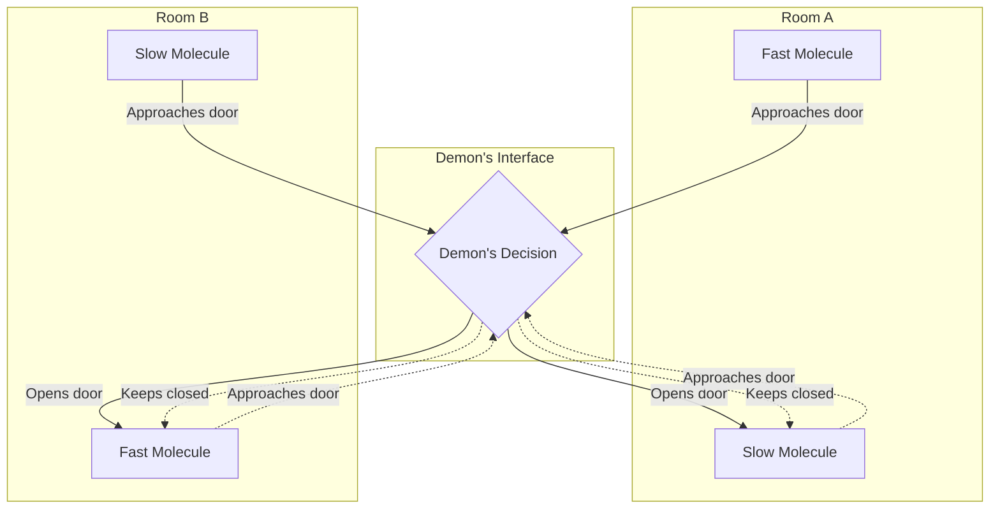
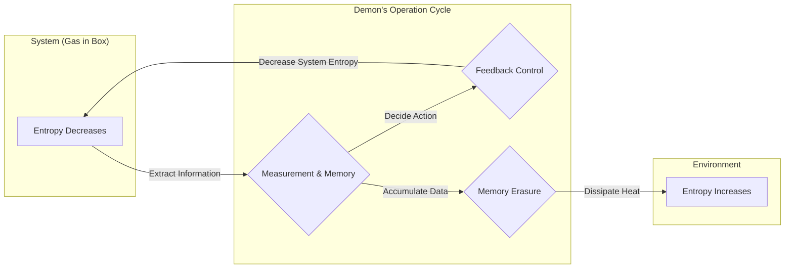

## 시작하며

물리학 역사에 있어 가장 유명하고, 또한 가장 많은 논란을 불러일으킨 사고 실험 중 하나가 ** [맥스웰의 악마](https://kenji.blog/ko/p/maxwells-demon/) ** 입니다. 19세기 물리학자 제임스 클러크 맥스웰이 1867년에 제창한 이 '악마'는 오랜 세월 전 세계의 물리학자들을 크게 괴롭혀 왔습니다. 왜냐하면 이 악마의 존재는 물리학에서 가장 견고한 법칙 중 하나이자 우주의 비가역성을 규정하는 ** 열역학 제2법칙 ** 을 정면으로 깨뜨리는 것처럼 보였기 때문입니다.

만약 이 악마가 실재한다면 우리는 공기 중에서 무한히 열에너지를 꺼내 그것을 일로 변환하는 '제2종 영구기관'을 만들어낼 수 있게 됩니다. 그것은 에너지 문제가 영원히 해결됨을 의미하지만, 동시에 우리가 아는 물리 법칙의 전제가 붕괴함을 의미합니다.

본 기사에서는 이 [맥스웰의 악마](https://kenji.blog/ko/p/maxwells-demon/)가 어떤 역설을 제시했는지, 그리고 그것이 약 1세기의 시간이 흘러 '정보'라는 언뜻 보기에 물리와는 무관해 보이는 개념에 의해 어떻게 해결되었는지를 수식이나 도해를 풍부하게 사용하여 자세히 해설해 나가겠습니다.

## 열역학 제2법칙과 엔트로피 증가의 법칙

[맥스웰의 악마](https://kenji.blog/ko/p/maxwells-demon/)의 위협을 올바르게 이해하기 위해 우선 ** 열역학 제2법칙 ** (엔트로피 증가의 법칙)의 기초에 대해 되짚어 봅시다.

열역학 제2법칙은 "고립계에서의 엔트로피(무질서한 정도)는 항상 증가하거나 일정하게 유지된다"는 자연계의 절대적인 규칙입니다. 이를 수식으로 나타내면 다음과 같습니다.

$$
\Delta S \ge 0
$$

여기서 $S$ 는 엔트로피, $\Delta S$ 는 엔트로피의 변화량을 나타냅니다. 엔트로피는 계의 '무질서함'이나 '혼란스러움'을 측정하는 척도로 해석됩니다.

루트비히 볼츠만은 엔트로피를 미시적인 상태의 수(경우의 수) $W$ 와 결부시켜 유명한 볼츠만 원리를 정식화했습니다.

$$
S = k_B \ln W
$$

여기서 $k_B$ 는 볼츠만 상수($1.38 \times 10^{-23} \ \mathrm{J/K}$)입니다. 이 식은 취할 수 있는 미시적 상태의 수가 많을수록(무질서할수록) 엔트로피가 커짐을 보여줍니다.

주변의 예시로서 뜨거운 커피와 차가운 우유를 같은 컵에 넣었을 경우를 생각해 봅시다. 시간이 지나면 양자는 자연스럽게 섞여 미지근한 카페오레가 됩니다. 이 과정에서 계는 더 무질서해지고 엔트로피는 증가합니다. 그러나 그 반대, 즉 미지근한 카페오레가 자발적으로 뜨거운 커피와 차가운 우유로 분리되는 일은 절대로 일어나지 않습니다. 이처럼 자연계의 현상에는 비가역적인 방향성이 있으며, 그것이 엔트로피의 증가라는 형태로 표현되는 것입니다.

## [맥스웰의 악마](https://kenji.blog/ko/p/maxwells-demon/) 사고 실험

물리학의 근간을 이루는 이 법칙에 대해 맥스웰은 다음과 같은 교묘한 사고 실험을 제안했습니다.

1. 단열된 용기 안에 기체가 들어 있고 중앙의 벽으로 좌우 2개의 방(A와 B)으로 나뉘어 있습니다.
2. 처음에 양쪽 방은 같은 온도, 즉 기체 분자의 평균 운동 에너지가 같은 상태에 있습니다.
3. 벽에는 아주 작은 구멍이 있고 그곳에는 마찰 없이 여닫을 수 있는 '문'이 달려 있습니다.
4. 이 문 앞에 개별 기체 분자의 움직임을 관측할 수 있는 지적인 존재, 이것이 ** 악마 ** 입니다.
5. 악마는 빠르게 움직이는(에너지가 높은) 분자가 A에서 B로 향할 때, 또는 느리게 움직이는(에너지가 낮은) 분자가 B에서 A로 향할 때만 문을 재빨리 엽니다. 그 이외의 경우에는 문을 닫아 둡니다.

이 악마의 교묘한 작업 프로세스를 다음 그림에 나타냅니다.

시간이 지나면 대체 무슨 일이 일어날까요?

악마의 선택적인 문 여닫기로 인해 방 B에는 빠른 분자들만 모이게 되고, 방 A에는 느린 분자들만 모이게 됩니다. 기체의 온도는 분자의 평균 운동 에너지에 비례하므로 결과적으로 방 B의 온도는 상승하고 방 A의 온도는 하강합니다.

이것은 외부에서 역학적인 일(에너지)을 전혀 가하지 않고 균일한 온도였던 계 안에 온도 차이를 만들어 냈음을 의미합니다. 온도 차이가 있으면 열기관을 사용하여 거기서 유용한 일을 꺼낼 수 있습니다.

즉 고립계에서 전체 엔트로피가 감소해 버린 것입니다.

$$
\Delta S < 0
$$

맥스웰 자신은 이 사고 실험을 통해 열역학 제2법칙이 절대적인 역학 법칙이 아니라 어디까지나 '다수의 분자를 통계적으로 다룰 때에만 성립하는 확률적인 법칙'임을 보여주려 했습니다. 그러나 만약 이 악마와 같은 존재를 인공적으로 만들어낼 수 있다면 '제2종 영구기관'이 완성되고 맙니다. [맥스웰의 악마](https://kenji.blog/ko/p/maxwells-demon/)는 열역학 제2법칙에 명확한 모순을 들이밀었던 것입니다.

## 실라르드의 엔진: 정보의 취득과 일의 변환

이 악마의 역설은 무려 1세기 동안이나 물리학자들을 깊은 고민의 늪에 빠뜨렸습니다. 악마는 단순히 정보에 기반하여 문을 여닫는(이론상 질량 제로의 문이라면 에너지 불필요) 조작을 하고 있을 뿐이며 계의 어디에서 엔트로피가 증가하고 있는지 전혀 알 수 없었기 때문입니다.

이 난제에 대해 해결을 향한 첫걸음을 내디딘 것은 1929년 물리학자 레오 실라르드입니다. 실라르드는 [맥스웰의 악마](https://kenji.blog/ko/p/maxwells-demon/)의 본질을 추출한 극도로 단순화된 사고 실험인 ** 실라르드의 엔진 ** 을 고안했습니다.

실라르드의 엔진은 단 1개의 기체 분자가 들어 있는 실린더와 그 중앙에 삽입할 수 있는 칸막이(피스톤)로 이루어집니다. 절차는 다음과 같습니다.

1. 1분자의 기체가 들어 있는 실린더 중앙에 칸막이를 삽입합니다.
2. 악마는 분자가 칸막이의 오른쪽과 왼쪽 중 어디에 있는지 하는 1비트의 ** 정보 ** 를 취득합니다.
3. 만약 분자가 왼쪽에 있다면 칸막이를 오른쪽 방향으로 움직여 분자에게 팽창하는 일을 시킵니다. 오른쪽에 있다면 왼쪽 방향으로 움직입니다.
4. 피스톤의 이동에 의해 분자는 주위의 열욕(열원)으로부터 열을 흡수하고 그것을 역학적인 일 $W$ 로 변환합니다.

이때 등온 팽창에 의해 분자가 외부에 하는 일 $W$ 는 이상 기체 상태 방정식에서 다음과 같이 계산됩니다.

$$
W = \int_{V/2}^{V} p \, dV = \int_{V/2}^{V} \frac{k_B T}{V} \, dV = k_B T \ln 2
$$

실라르드는 악마가 계의 상태를 '관측'하고 그것을 '기억'하는 프로세스 그 자체에 엔트로피와 정보의 깊은 관계가 숨어 있음을 간파한 것입니다. 그는 정보를 얻는 것 자체가 엔트로피를 증가시킨다고 생각했습니다.

## 섀넌 엔트로피와 열역학의 융합

1948년 클로드 섀넌이 정보 이론을 창시하고 정보의 불확실성을 나타내는 ** 정보 엔트로피 ** (섀넌 엔트로피)를 정의했습니다. 확률 분포 $P(x)$ 를 따르는 정보원의 엔트로피 $H$ 는 다음과 같이 표현됩니다.

$$
H = - \sum_{x} P(x) \log_2 P(x) \quad \mathrm{(bits)}
$$

놀랍게도 섀넌의 정보 엔트로피 수식은 볼츠만의 열역학 엔트로피 수식과 상수 계수를 제외하고 완전히 같은 형태를 하고 있었습니다. 이 시점부터 '정보'와 '열역학'의 융합이 본격적으로 시작되었습니다.

## 란다우어의 원리: 정보는 물리적이다

실라르드의 통찰과 섀넌의 정보 이론을 더욱 밀고 나가 최종적으로 역설을 완전한 해결로 이끈 것이 1961년 롤프 란다우어와 그 후의 찰스 베넷의 연구입니다.

란다우어는 "정보는 물리적이다"라고 강력하게 주장했습니다. 정보의 저장, 전달, 조작은 추상적인 공간에서 이루어지는 것이 아니라 반드시 물리적인 실체(하드웨어)에 의존하고 있으며 물리 법칙의 지배를 받습니다.

란다우어가 발견한 극히 중요한 원리, 즉 ** 란다우어의 원리 ** 는 "정보를 ** 지울 ** 때 반드시 환경으로 열이 방출되고 환경의 엔트로피가 증가한다"는 것입니다.

1비트의 정보를 완전히 지우기 위해 필요한 최소한의 에너지(방출되는 열) $Q$ 는 다음 수식으로 주어집니다.

$$
Q \ge k_B T \ln 2
$$

그에 수반되는 환경 엔트로피의 증가 $\Delta S_{erase}$ 는 다음과 같습니다.

$$
\Delta S_{erase} \ge k_B \ln 2
$$

정보를 '기록하는' 일이나 '계산하는' 일은 원리적으로는 에너지를 소비하지 않고 수행하는 것이 가능합니다. 그러나 정보를 '잊는', '지우는' 불가역적인 조작에 있어서는 열역학적인 대가를 반드시 치러야만 하는 것입니다.

## [맥스웰의 악마](https://kenji.blog/ko/p/maxwells-demon/)의 죽음과 역설의 종언

1982년 찰스 베넷은 란다우어의 원리를 사용하여 마침내 [맥스웰의 악마](https://kenji.blog/ko/p/maxwells-demon/)의 역설에 완전한 마침표를 찍었습니다.

베넷의 논리는 다음과 같습니다.

1. 악마는 기체 분자의 속도와 위치를 관측하고 자신의 뇌 속(또는 물리적인 메모리)에 기록합니다.
2. 기록한 정보에 기반하여 문을 여닫습니다. 여기까지의 조작은 가역적이라면 원리적으로 엔트로피를 증가시키지 않고 수행할 수 있습니다.
3. 그러나 악마의 메모리 용량에는 한계가 있습니다. 영원히 분자를 분류해 나가기 위해서는 어딘가에서 오래된 기억을 ** 지우고 ** 메모리를 리셋해야 합니다.
4. 란다우어의 원리에 따르면 악마가 1비트의 정보를 지우는 순간 필연적으로 $k_B T \ln 2$ 이상의 열이 환경으로 방출되어 환경의 엔트로피가 증가합니다.

즉 악마가 분자를 분류함으로써 상자 안의 엔트로피가 감소했다고 하더라도, 악마가 시스템을 계속 가동하기 위해 자신의 메모리를 지울 때 그 이상의 엔트로피 증가가 반드시 외부 환경에서 발생하고 있는 것입니다.

계 전체로 보면 토털 엔트로피의 변화는 반드시 제로 이상이 됩니다.

$$
\Delta S_{total} = \Delta S_{gas} + \Delta S_{memory\_erasure} \ge 0
$$

악마가 똑똑하게 행동하여 상자 안의 무질서를 줄이면 줄일수록 악마의 머릿속에는 정보라는 이름의 무질서가 축적되어 갑니다. 그리고 그 머릿속을 정리(소거)하려고 한 순간 그 무질서는 열이 되어 우주로 뿌려지는 것입니다.

## 정보 열역학과 미래를 향한 전개

[맥스웰의 악마](https://kenji.blog/ko/p/maxwells-demon/)의 역설은 '정보'라는 추상적인 개념과 '에너지'나 '엔트로피'라는 물리적인 개념이 궁극적으로는 등가이며 밀접하게 연결되어 있음을 밝혀냈습니다.

이 장대한 발견은 현재 ** 정보 열역학 ** 이나 ** 비평형 통계역학 ** 이라는 새로운 물리학의 프런티어로서 급속히 발전하고 있습니다.

최근에는 생물의 세포 내에서 일하는 DNA 폴리머라아제나 키네신 등의 생체 분자 기계가 [맥스웰의 악마](https://kenji.blog/ko/p/maxwells-demon/)처럼 정보를 이용하여 에너지를 효율적으로 변환하고 한 방향으로의 운동을 만들어 내는 메커니즘이 연구되고 있습니다. 생명 현상의 근간에도 정보 열역학의 법칙이 깊이 관여하고 있는 것입니다.

또한 정보 처리에 드는 궁극의 에너지 한계인 란다우어 한계는 향후 컴퓨터의 절전화를 생각하는 데 있어 가장 중요한 이론적 기반이 되고 있습니다. 정보 소거에 수반되는 근원적인 열 발생이라는 물리적인 벽을 돌파하기 위해 정보를 지우지 않는 '가역 컴퓨팅(Reversible Computing)'의 연구도 진행되고 있습니다.

## 맺음말

맥스웰이 19세기에 풀어놓은 작은 악마는 물리학에서 가장 아름답고 심오한 사고 실험이 되었습니다. 그것은 열역학 제2법칙을 파괴하려는 대담한 도전에서 시작되었고, 결과적으로 '정보의 물리적인 실체'를 밝혀낸다는 예상치 못한 돌파구를 가져왔습니다.

'안다'는 것, 그리고 '잊는다'는 것.

우리가 일상적으로 하고 있는 정보 처리의 배후에는 우주의 근원적인 법칙인 열역학이 항상 눈을 번뜩이고 있습니다. ** 정보 ** 와 ** 에너지 ** 는 동전의 양면입니다. 이 심오한 연결고리는 앞으로도 다양한 분야에서 새로운 혁명을 일으켜 나갈 것입니다. [맥스웰의 악마](https://kenji.blog/ko/p/maxwells-demon/)는 죽어서도 여전히 우리에게 새로운 지식의 문을 계속 열어주고 있는 것입니다.
