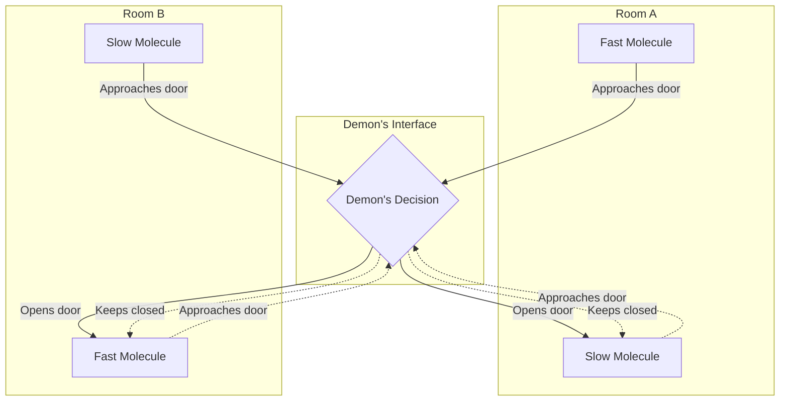
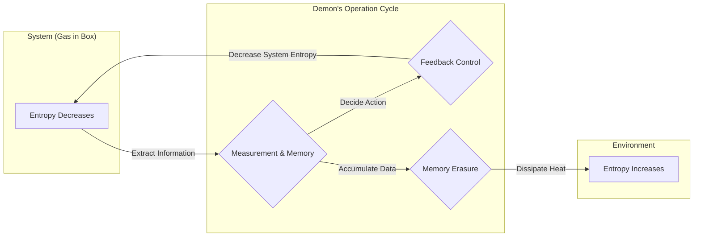

## はじめに

物理学の歴史において、最も有名で、かつ最も多くの議論を呼んだ思考実験の一つが **[マクスウェルの悪魔](https://kenji.blog/p/maxwells-demon/)** です。19世紀の物理学者ジェームズ・クラーク・マクスウェルが1867年に提唱したこの「悪魔」は、長年にわたり世界中の物理学者たちを大いに悩ませてきました。なぜなら、この悪魔の存在は、物理学における最も強固な法則の一つであり、宇宙の不可逆性を規定する **熱力学第二法則** を真っ向から破るように見えたからです。

もしこの悪魔が実在すれば、私たちは空気中から無限に熱エネルギーを取り出し、それを仕事に変換する「第二種永久機関」を作り出すことができるようになります。それはエネルギー問題が永遠に解決することを意味しますが、同時に私たちが知る物理法則の前提が崩壊することを意味します。

本記事では、この[マクスウェルの悪魔](https://kenji.blog/p/maxwells-demon/)がどのようなパラドックスを提示したのか、そしてそれが約1世紀の時を経て、「情報」という一見すると物理とは無関係に思える概念によっていかに解決されたのかを、数式や図解を豊富に用いて詳しく解説していきます。

## 熱力学第二法則とエントロピー増大の法則

[マクスウェルの悪魔](https://kenji.blog/p/maxwells-demon/)の脅威を正しく理解するために、まずは **熱力学第二法則** （エントロピー増大の法則）の基礎について振り返りましょう。

熱力学第二法則は、「孤立系におけるエントロピー（乱雑さの度合い）は常に増大するか、あるいは一定に保たれる」という自然界の絶対的なルールです。これを数式で表すと以下のようになります。

$$
\Delta S \ge 0
$$

ここで、$S$ はエントロピー、$\Delta S$ はエントロピーの変化量を表します。エントロピーは、系の「乱雑さ」や「無秩序さ」を測る尺度として解釈されます。

ルートヴィッヒ・ボルツマンは、エントロピーを微視的な状態の数（場合の数）$W$ と結びつけ、有名なボルツマンの原理を定式化しました。

$$
S = k_B \ln W
$$

ここで、$k_B$ はボルツマン定数（$1.38 \times 10^{-23} \ \mathrm{J/K}$）です。この式は、取り得る微視的状態の数が多い（乱雑である）ほど、エントロピーが大きくなることを示しています。

身近な例として、熱いコーヒーと冷たいミルクを同じカップに入れた場合を考えてみましょう。時間が経つと両者は自然に混ざり合い、ぬるいカフェオレになります。この過程で系はより無秩序になり、エントロピーは増大します。しかし、その逆、つまりぬるいカフェオレが自発的に熱いコーヒーと冷たいミルクに分離することは絶対に起こりません。このように、自然界の現象には不可逆な方向性があり、それがエントロピーの増大という形で表現されるのです。

## [マクスウェルの悪魔](https://kenji.blog/p/maxwells-demon/)の思考実験

物理学の根幹を成すこの法則に対して、マクスウェルは以下のような巧妙な思考実験を提案しました。

1. 断熱された容器の中に気体が入っており、中央の壁で左右2つの部屋（AとB）に分割されています。
2. 最初、両方の部屋は同じ温度、つまり気体分子の平均運動エネルギーは等しい状態にあります。
3. 壁にはごく小さな穴があり、そこには摩擦なしで開閉できる「ドア」がついています。
4. このドアの前に、個々の気体分子の動きを観測できる知的な存在、これが **悪魔** です。
5. 悪魔は、速く動く（エネルギーが高い）分子がAからBへ向かうとき、または遅く動く（エネルギーが低い）分子がBからAへ向かうときだけドアを素早く開けます。それ以外の時はドアを閉めたままにします。

この悪魔の巧妙な作業プロセスを以下の図に示します。

時間が経過すると一体何が起こるでしょうか？

悪魔の選択的なドア開閉により、部屋Bには速い分子ばかりが集まり、部屋Aには遅い分子ばかりが集まるようになります。気体の温度は分子の平均運動エネルギーに比例するため、結果として部屋Bの温度は上昇し、部屋Aの温度は下降します。

これは、外部から力学的な仕事（エネルギー）を一切加えることなく、一様な温度だった系の中に温度差を作り出したことを意味します。温度差があれば、熱機関を用いてそこから有用な仕事を取り出すことができます。

つまり、孤立系において全体のエントロピーが減少してしまったのです。

$$
\Delta S < 0
$$

マクスウェル自身は、この思考実験を通じて、熱力学第二法則が絶対的な力学法則ではなく、あくまで「多数の分子を統計的に扱う際にのみ成り立つ確率的な法則」であることを示そうとしました。しかし、もしこの悪魔のような存在を人工的に作り出せれば「第二種永久機関」が完成してしまいます。[マクスウェルの悪魔](https://kenji.blog/p/maxwells-demon/)は、熱力学第二法則に明確な矛盾を突きつけたのです。

## シラードのエンジン：情報の取得と仕事の変換

この悪魔のパラドックスは、実に1世紀もの間、物理学者たちを深い悩みの淵に沈めました。悪魔は単に情報に基づいてドアの開閉（理論上、質量ゼロのドアであればエネルギー不要）という操作を行っているだけであり、系のどこでエントロピーが増大しているのかが全く分からなかったからです。

この難問に対する解決への第一歩を踏み出したのは、1929年の物理学者レオ・シラードです。シラードは、[マクスウェルの悪魔](https://kenji.blog/p/maxwells-demon/)の本質を抽出した、極めて単純化された思考実験である **シラードのエンジン** を考案しました。

シラードのエンジンは、たった1つの気体分子が入ったシリンダーと、その中央に挿入できる仕切り（ピストン）からなります。手順は以下の通りです。

1. 1分子の気体が入ったシリンダーの中央に、仕切りを挿入します。
2. 悪魔は、分子が仕切りの右側と左側のどちらにいるかという1ビットの **情報** を取得します。
3. もし分子が左側にいるなら、仕切りを右方向に動かして分子に膨張仕事をさせます。右側にいるなら左方向に動かします。
4. ピストンの移動により、分子は周囲の熱浴から熱を吸収し、それを力学的な仕事 $W$ に変換します。

このとき、等温膨張によって分子が外部にする仕事 $W$ は、理想気体の状態方程式から以下のように計算されます。

$$
W = \int_{V/2}^{V} p \, dV = \int_{V/2}^{V} \frac{k_B T}{V} \, dV = k_B T \ln 2
$$

シラードは、悪魔が系の状態を「観測」し、それを「記憶」するプロセスそのものに、エントロピーと情報の深い関係が潜んでいることを見抜いたのです。彼は、情報を得ること自体がエントロピーを増大させると考えました。

## [シャノンエントロピー](https://kenji.blog/p/information-theory-shannon-entropy/)と熱力学の融合

1948年、クロード・シャノンが[情報理論](https://kenji.blog/p/information-theory-shannon-entropy/)を創始し、情報の不確実性を表す **情報エントロピー** （シャノンエントロピー）を定義しました。確率分布 $P(x)$ に従う情報源のエントロピー $H$ は次のように表されます。

$$
H = - \sum_{x} P(x) \log_2 P(x) \quad \mathrm{(bits)}
$$

驚くべきことに、シャノンの情報エントロピーの数式は、ボルツマンの熱力学エントロピーの数式と定数係数を除いて全く同じ形をしていました。この時点から、「情報」と「熱力学」の融合が本格的に始まりました。

## ランダウアーの原理：情報は物理的である

シラードの洞察とシャノンの情報理論をさらに推し進め、最終的にパラドックスを完全解決に導いたのが、1961年のロルフ・ランダウアーと、その後のチャールズ・ベネットの研究です。

ランダウアーは、「情報は物理的である」と強く主張しました。情報の保存、伝達、操作は、抽象的な空間で行われるわけではなく、必ず物理的な実体（ハードウェア）に依存しており、物理法則の支配を受けます。

ランダウアーが発見した極めて重要な原理、すなわち **ランダウアーの原理** は、「情報を **消去** するとき、必ず環境へ熱が放出され、環境のエントロピーが増大する」というものです。

1ビットの情報を完全に消去するために必要な最小のエネルギー（放出される熱）$Q$ は、以下の数式で与えられます。

$$
Q \ge k_B T \ln 2
$$

それに伴う環境のエントロピーの増大 $\Delta S_{erase}$ は以下のようになります。

$$
\Delta S_{erase} \ge k_B \ln 2
$$

情報を「書き込む」ことや「計算する」ことは、原理的にはエネルギーを消費せずに行うことが可能です。しかし、情報を「忘れる」「消去する」という不可逆な操作においては、熱力学的な代償を必ず払わなければならないのです。

## [マクスウェルの悪魔](https://kenji.blog/p/maxwells-demon/)の死とパラドックスの終焉

1982年、チャールズ・ベネットはランダウアーの原理を用いて、ついに[マクスウェルの悪魔](https://kenji.blog/p/maxwells-demon/)のパラドックスに完全な引導を渡しました。

ベネットの論理は以下の通りです。

1. 悪魔は、気体分子の速度と位置を観測し、自身の脳内（あるいは物理的なメモリ）に記録します。
2. 記録した情報に基づいて、ドアの開閉を行います。ここまでの操作は、可逆的であれば原理的にエントロピーを増大させずに行うことができます。
3. しかし、悪魔のメモリ容量には限界があります。永遠に分子を仕分けし続けるためには、どこかで古い記憶を **消去** し、メモリをリセットしなければなりません。
4. ランダウアーの原理によれば、悪魔が1ビットの情報を消去する瞬間に、必然的に $k_B T \ln 2$ 以上の熱が環境に放出され、環境のエントロピーが増大します。

つまり、悪魔が分子を仕分けすることによって箱の中のエントロピーが減少したとしても、悪魔がシステムを継続稼働させるために自身のメモリを消去する際、それ以上のエントロピー増大が必ず外部の環境で発生しているのです。

系全体で見れば、トータルのエントロピーの変化は必ずゼロ以上になります。

$$
\Delta S_{total} = \Delta S_{gas} + \Delta S_{memory\_erasure} \ge 0
$$

悪魔が賢く振る舞って箱の中の無秩序を減らせば減らすほど、悪魔の頭の中には情報という名の無秩序が蓄積していきます。そして、その頭の中を整理（消去）しようとした瞬間、その無秩序は熱となって宇宙にばらまかれるのです。

## 情報熱力学と未来への展開

[マクスウェルの悪魔](https://kenji.blog/p/maxwells-demon/)のパラドックスは、「情報」という抽象的な概念と、「エネルギー」や「エントロピー」という物理的な概念が、究極的には等価であり、密接に結びついていることを明らかにしました。

この壮大な発見は、現在 **情報熱力学** や **非平衡統計力学** という新しい物理学のフロンティアとして急速に発展しています。

近年では、生物の細胞内で働くDNAポリメラーゼやキネシンなどの生体分子機械が、[マクスウェルの悪魔](https://kenji.blog/p/maxwells-demon/)のように情報を用いてエネルギーを効率よく変換し、一方向への運動を作り出している仕組みが研究されています。生命現象の根幹にも、情報熱力学の法則が深く関わっているのです。

また、情報処理にかかる究極のエネルギー限界であるランダウアー限界は、今後のコンピュータの省電力化を考える上で最も重要な理論的基盤となっています。情報の消去に伴う根源的な熱の発生という物理的な壁を突破するために、情報を消去しない「可逆コンピューティング」の研究も進められています。

## おわりに

マクスウェルが19世紀に放った小さな悪魔は、物理学における最も美しく、深遠な思考実験となりました。それは、熱力学第二法則を破壊しようとする大胆な挑戦から始まり、結果として「情報の物理的な実態」を明らかにするという思いもよらないブレイクスルーをもたらしました。

「知る」こと、そして「忘れる」こと。

私たちが日常的に行っている情報処理の背後には、宇宙の根源的な法則である熱力学が常に目を光らせています。 **情報** と **エネルギー** はコインの裏表なのです。この深遠な結びつきは、今後も様々な分野で新たな革命を起こしていくことでしょう。[マクスウェルの悪魔](https://kenji.blog/p/maxwells-demon/)は死してなお、私たちに新たな知の扉を開き続けているのです。

