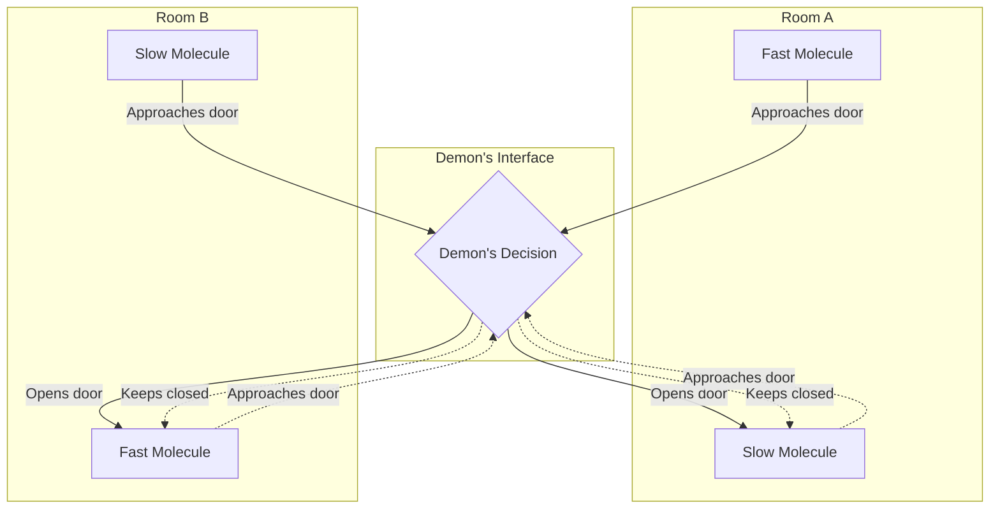
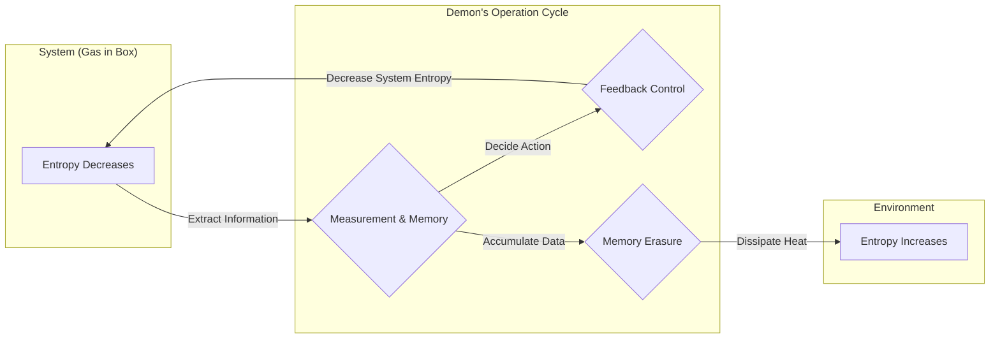

## Introdução

Na história da física, uma das experiências mentais mais famosas e debatidas é o **Demónio de Maxwell**. Proposto pelo físico James Clerk Maxwell em 1867, este "demónio" tem atormentado físicos em todo o mundo há muitos anos. Isto porque a existência deste demónio parecia quebrar diretamente uma das leis mais fortes da física, que define a irreversibilidade do universo: a **Segunda Lei da Termodinâmica**.

Se este demónio existisse na realidade, poderíamos extrair energia térmica do ar infinitamente e convertê-la em trabalho, criando uma "máquina de movimento perpétuo de segunda espécie". Isso significaria que os problemas de energia seriam resolvidos para sempre, mas ao mesmo tempo significaria o colapso das premissas das leis da física como as conhecemos.

Neste artigo, explicaremos detalhadamente que tipo de paradoxo o Demónio de Maxwell apresentou e como ele foi resolvido, cerca de um século depois, pelo conceito de "informação" — que à primeira vista parece não ter relação com a física —, utilizando abundantemente fórmulas e diagramas.

## A Segunda Lei da Termodinâmica e a Lei do Aumento da Entropia

Para compreender corretamente a ameaça do Demónio de Maxwell, vamos primeiro rever os fundamentos da **Segunda Lei da Termodinâmica** (a lei do aumento da entropia).

A Segunda Lei da Termodinâmica é uma regra absoluta do mundo natural que diz que "a entropia (o grau de desordem) num sistema isolado aumenta sempre ou permanece constante". Representando isto através de uma fórmula:

$$
\Delta S \ge 0
$$

Aqui, $S$ representa a entropia e $\Delta S$ a variação da entropia. A entropia é interpretada como uma medida da "desordem" ou "caos" de um sistema.

Ludwig Boltzmann relacionou a entropia ao número de estados microscópicos (o número de casos possíveis) $W$, formulando o famoso Princípio de Boltzmann:

$$
S = k_B \ln W
$$

Aqui, $k_B$ é a constante de Boltzmann ( $1.38 \times 10^{-23} \ \mathrm{J/K}$ ). Esta fórmula mostra que quanto maior for o número de estados microscópicos possíveis (mais desordenado), maior será a entropia.

Como exemplo simples, imagine colocar café quente e leite frio na mesma chávena. Com o passar do tempo, os dois misturam-se naturalmente, tornando-se num café com leite morno. Neste processo, o sistema torna-se mais desordenado e a entropia aumenta. No entanto, o inverso, isto é, o café com leite morno separar-se espontaneamente em café quente e leite frio, nunca acontecerá. Assim, os fenómenos na natureza têm uma direção irreversível, expressa sob a forma do aumento da entropia.

## A Experiência Mental do Demónio de Maxwell

Contra esta lei que forma o pilar da física, Maxwell propôs a seguinte engenhosa experiência mental:

1. Um gás encontra-se no interior de um recipiente isolado termicamente, dividido em duas câmaras (A e B) por uma parede central.
2. Inicialmente, ambas as câmaras estão à mesma temperatura, ou seja, a energia cinética média das moléculas do gás é igual.
3. Na parede existe um buraco minúsculo com uma "porta" que pode ser aberta e fechada sem atrito.
4. Em frente a esta porta encontra-se uma entidade inteligente capaz de observar o movimento das moléculas de gás individuais, este é o **demónio**.
5. O demónio abre rapidamente a porta apenas quando uma molécula rápida (alta energia) se move de A para B, ou quando uma molécula lenta (baixa energia) se move de B para A. Nos restantes casos, mantém a porta fechada.

O engenhoso processo de trabalho deste demónio é ilustrado no diagrama abaixo.

O que acontecerá com o passar do tempo?

Através da abertura e fecho seletivos da porta pelo demónio, apenas moléculas rápidas se acumularão na câmara B, e apenas moléculas lentas se acumularão na câmara A. Como a temperatura de um gás é proporcional à energia cinética média das suas moléculas, o resultado é que a temperatura da câmara B aumenta e a temperatura da câmara A diminui.

Isto significa que, sem a adição de qualquer trabalho mecânico (energia) do exterior, criou-se uma diferença de temperatura dentro de um sistema que inicialmente tinha uma temperatura uniforme. Com uma diferença de temperatura, podemos usar um motor térmico para extrair trabalho útil dela.

Ou seja, a entropia total num sistema isolado diminuiu.

$$
\Delta S < 0
$$

O próprio Maxwell, através desta experiência mental, tentou demonstrar que a Segunda Lei da Termodinâmica não era uma lei mecânica absoluta, mas sim uma "lei probabilística que só se aplica estatisticamente a um grande número de moléculas". No entanto, se um ser como este demónio pudesse ser criado artificialmente, uma "máquina de movimento perpétuo de segunda espécie" estaria concluída. [O Demónio de Maxwell](https://kenji.blog/p/maxwells-demon/) apresentou uma clara contradição à Segunda Lei da Termodinâmica.

## O Motor de Szilárd: Obtenção de Informação e Conversão de Trabalho

O paradoxo do demónio mergulhou os físicos num poço profundo de inquietação durante um século. Como o demónio estava simplesmente a operar a porta (teoricamente, se a porta tivesse massa zero, não seria necessária energia) com base em informações, era impossível descobrir onde no sistema a entropia estava a aumentar.

O primeiro passo para resolver este problema difícil foi dado em 1929 pelo físico Leo Szilárd. Szilárd idealizou o **Motor de Szilárd**, uma experiência mental extremamente simplificada que extraiu a essência do Demónio de Maxwell.

O motor de Szilárd consiste num cilindro que contém apenas uma molécula de gás e uma divisória (pistão) que pode ser inserida no meio. O procedimento é o seguinte:

1. Uma divisória é inserida no meio de um cilindro contendo uma molécula de gás.
2. O demónio adquire 1 bit de **informação**: se a molécula se encontra do lado esquerdo ou direito da divisória.
3. Se a molécula estiver do lado esquerdo, ele move a divisória para a direita, permitindo que a molécula realize trabalho de expansão. Se estiver do lado direito, ele move-a para a esquerda.
4. Através do movimento do pistão, a molécula absorve calor do banho térmico circundante e converte-o em trabalho mecânico $W$.

Neste momento, o trabalho externo $W$ realizado pela molécula através da expansão isotérmica é calculado a partir da equação de estado do gás ideal da seguinte forma:

$$
W = \int_{V/2}^{V} p \, dV = \int_{V/2}^{V} \frac{k_B T}{V} \, dV = k_B T \ln 2
$$

Szilárd percebeu que uma relação profunda entre entropia e informação estava oculta no próprio processo de "observar" e "memorizar" o estado do sistema por parte do demónio. Ele considerou que o ato de obter informação, por si só, causava um aumento de entropia.

## A Fusão da Entropia de Shannon com a Termodinâmica

Em 1948, Claude Shannon fundou a Teoria da Informação e definiu a **Entropia da Informação** (Entropia de Shannon) para representar a incerteza da informação. A entropia $H$ de uma fonte de informação regida por uma distribuição de probabilidade $P(x)$ é expressa como:

$$
H = - \sum_{x} P(x) \log_2 P(x) \quad \mathrm{(bits)}
$$

Surpreendentemente, a fórmula da entropia da informação de Shannon tinha exatamente a mesma forma da fórmula da entropia termodinâmica de Boltzmann, à exceção de um coeficiente constante. A partir deste ponto, a fusão entre "informação" e "termodinâmica" começou em força.

## O Princípio de Landauer: A Informação é Física

O passo que impulsionou a intuição de Szilárd e a teoria da informação de Shannon e levou, por fim, à resolução completa do paradoxo foi a investigação de Rolf Landauer em 1961 e, mais tarde, de Charles Bennett.

Landauer defendeu veementemente que "a informação é física". O armazenamento, a transmissão e a manipulação da informação não ocorrem num espaço abstrato, mas dependem sempre de uma entidade física (hardware) e estão sujeitos às leis da física.

O princípio de extrema importância que Landauer descobriu, o **Princípio de Landauer**, afirma que "quando se **apaga** informação, é necessariamente libertado calor para o ambiente, e a entropia do ambiente aumenta".

A energia mínima (calor libertado) $Q$ necessária para apagar completamente 1 bit de informação é dada pela seguinte fórmula:

$$
Q \ge k_B T \ln 2
$$

O consequente aumento de entropia do ambiente $\Delta S_{erase}$ é:

$$
\Delta S_{erase} \ge k_B \ln 2
$$

O ato de "escrever" ou "calcular" informação pode, em princípio, ser feito sem consumir energia. Contudo, na operação irreversível de "esquecer" ou "apagar" informação, deve-se sempre pagar um preço termodinâmico.

## A Morte do Demónio de Maxwell e o Fim do Paradoxo

Em 1982, Charles Bennett usou o Princípio de Landauer para finalmente pôr fim ao paradoxo do Demónio de Maxwell.

A lógica de Bennett é a seguinte:

1. O demónio observa a velocidade e a posição da molécula de gás e regista-a no seu cérebro (ou numa memória física).
2. Com base na informação registada, ele abre e fecha a porta. Todas as operações até este ponto podem, em princípio, ser realizadas sem aumentar a entropia, desde que sejam reversíveis.
3. No entanto, a capacidade de memória do demónio é limitada. Para continuar a separar as moléculas para sempre, ele tem, em algum momento, que **apagar** memórias antigas para redefinir a memória.
4. De acordo com o Princípio de Landauer, no momento em que o demónio apaga 1 bit de informação, inevitavelmente liberta no ambiente calor igual ou superior a $k_B T \ln 2$, aumentando a entropia do ambiente.

Ou seja, mesmo que a entropia no interior da caixa diminua com o comportamento inteligente do demónio na separação das moléculas, no momento em que ele apaga a sua memória para manter o sistema em funcionamento contínuo, ocorrerá necessariamente um aumento de entropia ainda maior no ambiente externo.

Ao nível de todo o sistema, a variação total de entropia será sempre maior ou igual a zero.

$$
\Delta S_{total} = \Delta S_{gas} + \Delta S_{memory\_erasure} \ge 0
$$

Por mais que o demónio atue de forma inteligente para reduzir a desordem na caixa, acumula-se no seu cérebro uma desordem sob a forma de informação. No momento em que ele tenta organizar (apagar) a sua mente, essa desordem é dispersada pelo universo sob a forma de calor.

## A Termodinâmica da Informação e o Desenvolvimento Futuro

O paradoxo do Demónio de Maxwell revelou que o conceito abstrato de "informação" e os conceitos físicos de "energia" e "entropia" são, em última análise, equivalentes e estão intimamente ligados.

Esta descoberta monumental está agora a desenvolver-se rapidamente como uma nova fronteira da física: a **Termodinâmica da Informação** e a **Mecânica Estatística de Não-equilíbrio**.

Nos últimos anos, os investigadores têm estudado as máquinas moleculares biológicas (como a ADN polimerase e a cinesina, que operam dentro das células) que utilizam informação, assim como o Demónio de Maxwell, para converter energia de forma eficiente, criando movimento num único sentido. As leis da termodinâmica da informação estão profundamente envolvidas na essência dos fenómenos vitais.

Além disso, o Limite de Landauer, o limite máximo de eficiência energética para o processamento de informação, é o pilar teórico mais importante no desenvolvimento de computadores mais eficientes no futuro. De forma a superar a barreira física da geração fundamental de calor associada à eliminação de dados, a investigação na "Computação Reversível", que não apaga dados, está a progredir.

## Conclusão

O pequeno demónio concebido por Maxwell no século XIX tornou-se numa das mais belas e profundas experiências mentais da física. Começou com o ousado desafio de tentar destruir a Segunda Lei da Termodinâmica e acabou por trazer a descoberta inesperada da "natureza física da informação".

"Aprender", e também "esquecer".

Por detrás do processamento de informação que realizamos no nosso quotidiano, a Termodinâmica — a lei primordial do universo — está sempre atenta. **Informação** e **Energia** são dois lados da mesma moeda. Sem dúvida, essa profunda conexão causará novas revoluções em vários domínios no futuro. Mesmo após a sua morte, o Demónio de Maxwell continua a abrir-nos as portas a um novo conhecimento.
