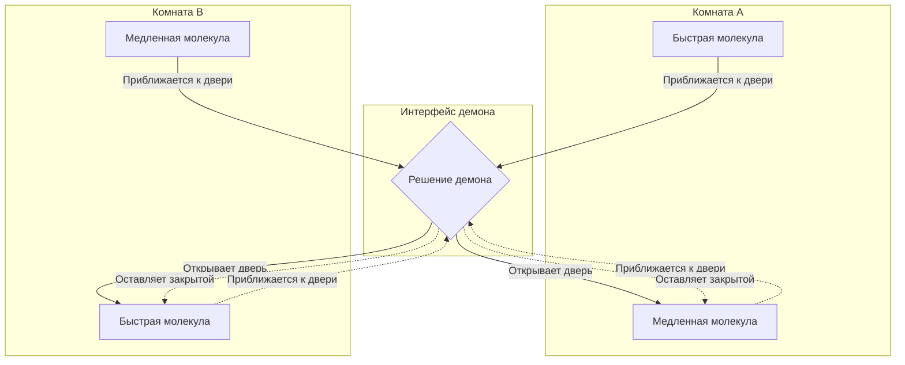
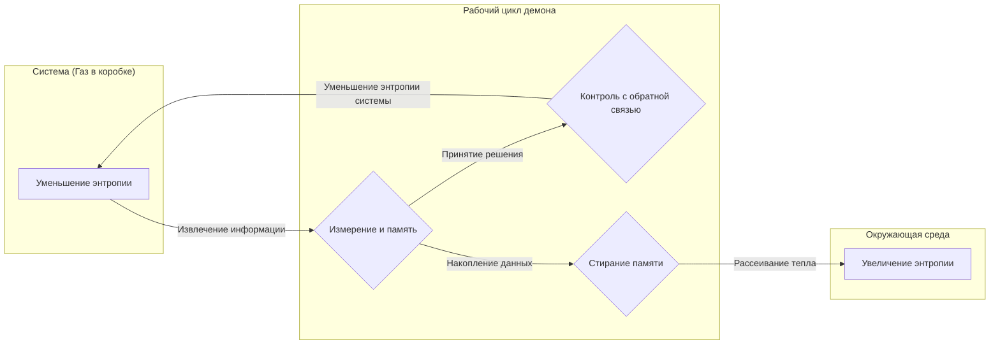

## Введение

В истории физики одним из самых известных и вызывающих наибольшие дискуссии мысленных экспериментов является **Демон Максвелла**. Этот «демон», предложенный физиком Джеймсом Клерком Максвеллом в 1867 году, на долгие годы стал огромной головной болью для физиков всего мира. Причина заключалась в том, что существование этого демона, казалось, прямо нарушало **Второй закон термодинамики** — один из самых незыблемых законов физики, определяющий необратимость Вселенной.

Если бы этот демон существовал в реальности, мы могли бы извлекать из воздуха бесконечную тепловую энергию и превращать ее в полезную работу, создав «вечный двигатель второго рода». Это означало бы вечное решение энергетической проблемы, но в то же время — крах основ физических законов, какими мы их знаем.

В этой статье мы подробно объясним, в чем заключался парадокс, представленный демоном Максвелла, и как он был разрешен почти век спустя с помощью концепции «информации», которая, на первый взгляд, не имеет ничего общего с физикой, используя математические формулы и диаграммы.

## Второй закон термодинамики и закон возрастания энтропии

Чтобы правильно понять угрозу, исходящую от демона Максвелла, давайте сначала вспомним основы **второго закона термодинамики** (закона возрастания энтропии).

Второй закон термодинамики — это абсолютное правило природы: «Энтропия (степень беспорядка) в изолированной системе всегда возрастает или остается постоянной». Математически это выражается так:

$$
\Delta S \ge 0
$$

Здесь $S$ — энтропия, а $\Delta S$ — изменение энтропии. Энтропия интерпретируется как мера «беспорядка» или «хаоса» в системе.

Людвиг Больцман связал энтропию с числом микроскопических состояний (количеством возможных вариантов) $W$ и сформулировал знаменитый принцип Больцмана:

$$
S = k_B \ln W
$$

Где $k_B$ — постоянная Больцмана ($1,38 \times 10^{-23} \ \mathrm{J/K}$). Эта формула показывает, что чем больше число возможных микроскопических состояний (чем больше беспорядок), тем выше энтропия.

Возьмем простой пример: смешивание горячего кофе и холодного молока в одной чашке. Со временем они естественным образом перемешиваются, превращаясь в теплый кофе с молоком. В этом процессе система становится более неупорядоченной, и энтропия возрастает. Однако обратный процесс — когда теплый кофе с молоком самопроизвольно разделяется на горячий кофе и холодное молоко — абсолютно невозможен. Таким образом, явления в природе имеют необратимое направление, что выражается через возрастание энтропии.

## Мысленный эксперимент демона Максвелла

В противовес этому фундаментальному физическому закону Максвелл предложил следующий хитроумный мысленный эксперимент:

1. Представьте изолированный сосуд с газом, разделенный пополам стенкой на две комнаты (A и B).
2. Изначально обе комнаты имеют одинаковую температуру, то есть средняя кинетическая энергия молекул газа равна.
3. В стенке есть крошечное отверстие, снабженное «дверцей», которая может открываться и закрываться без трения.
4. Перед этой дверцей находится разумное существо, способное наблюдать за движением отдельных молекул газа, — это и есть **демон**.
5. Демон быстро открывает дверцу только тогда, когда быстрая (с высокой энергией) молекула летит из A в B, или когда медленная (с низкой энергией) молекула летит из B в A. В остальное время он держит дверцу закрытой.

Процесс хитрой работы этого демона показан на диаграмме ниже.

Что произойдет со временем?

Благодаря избирательному открыванию и закрыванию дверцы демоном, в комнате B соберутся только быстрые молекулы, а в комнате A — только медленные. Поскольку температура газа пропорциональна средней кинетической энергии молекул, в результате температура в комнате B повысится, а в комнате A — понизится.

Это означает, что без совершения какой-либо механической работы (затрат энергии) извне, в системе с однородной температурой была создана разность температур. Используя эту разность температур в тепловой машине, можно было бы извлекать полезную работу.

То есть, общая энтропия изолированной системы уменьшилась.

$$
\Delta S < 0
$$

Сам Максвелл с помощью этого мысленного эксперимента пытался показать, что второй закон термодинамики не является абсолютным динамическим законом, а лишь «вероятностным законом, который выполняется только при статистическом рассмотрении большого числа молекул». Однако, если бы мы могли искусственно создать такое демоническое существо, мы бы получили «вечный двигатель второго рода». Демон Максвелла бросил явный вызов второму закону термодинамики.

## Двигатель Силарда: Получение информации и преобразование в работу

Этот демонический парадокс погрузил физиков в глубокое отчаяние на целый век. Было совершенно непонятно, где в системе увеличивается энтропия, ведь демон, казалось, просто открывал и закрывал дверцу на основе информации (теоретически, для дверцы с нулевой массой энергия не требуется).

Первый шаг к решению этой сложной задачи сделал физик Лео Силард в 1929 году. Силард разработал **Двигатель Силарда** — чрезвычайно упрощенный мысленный эксперимент, выделяющий саму суть демона Максвелла.

Двигатель Силарда состоит из цилиндра, содержащего всего одну молекулу газа, и перегородки (поршня), которую можно вставить в середину. Процедура следующая:

1. В середину цилиндра, содержащего 1 молекулу газа, вставляется перегородка.
2. Демон получает 1 бит **информации** о том, находится ли молекула в правой или левой половине от перегородки.
3. Если молекула находится слева, перегородка двигается вправо, позволяя молекуле совершать работу расширения. Если она справа, перегородка двигается влево.
4. За счет движения поршня молекула поглощает тепло от окружающей тепловой бани и превращает его в механическую работу $W$.

При этом работа $W$, совершаемая молекулой при изотермическом расширении, вычисляется из уравнения состояния идеального газа следующим образом:

$$
W = \int_{V/2}^{V} p \, dV = \int_{V/2}^{V} \frac{k_B T}{V} \, dV = k_B T \ln 2
$$

Силард осознал, что сам процесс «наблюдения» демоном за состоянием системы и его «запоминания» таит в себе глубокую связь между энтропией и информацией. Он предположил, что само получение информации увеличивает энтропию.

## Слияние энтропии Шеннона и термодинамики

В 1948 году Клод Шеннон основал теорию информации и определил **информационную энтропию** (энтропию Шеннона), выражающую неопределенность информации. Энтропия $H$ источника информации, подчиняющегося распределению вероятностей $P(x)$, выражается так:

$$
H = - \sum_{x} P(x) \log_2 P(x) \quad \mathrm{(bits)}
$$

Удивительно, но формула информационной энтропии Шеннона имела в точности ту же форму, что и формула термодинамической энтропии Больцмана, за исключением постоянного коэффициента. С этого момента началось полномасштабное слияние «информации» и «термодинамики».

## Принцип Ландауэра: Информация физична

Развивая идеи Силарда и теорию информации Шеннона, к окончательному разрешению парадокса привели исследования Рольфа Ландауэра в 1961 году, а затем и Чарльза Беннетта.

Ландауэр решительно настаивал: «Информация физична». Сохранение, передача и обработка информации происходят не в абстрактном пространстве, а обязательно зависят от физической сущности (оборудования) и подчиняются законам физики.

Ландауэр открыл чрезвычайно важный принцип, известный как **принцип Ландауэра**: «При **стирании** информации обязательно выделяется тепло в окружающую среду, и энтропия окружающей среды возрастает».

Минимальная энергия (выделяемое тепло) $Q$, необходимая для полного стирания 1 бита информации, задается следующей формулой:

$$
Q \ge k_B T \ln 2
$$

Соответствующее увеличение энтропии окружающей среды $\Delta S_{erase}$ составляет:

$$
\Delta S_{erase} \ge k_B \ln 2
$$

«Запись» или «вычисление» информации в принципе может осуществляться без потребления энергии. Однако за необратимую операцию «забывания» или «стирания» информации обязательно приходится платить термодинамическую цену.

## Смерть демона Максвелла и конец парадокса

В 1982 году Чарльз Беннетт, используя принцип Ландауэра, наконец-то поставил точку в парадоксе демона Максвелла.

Логика Беннетта такова:

1. Демон наблюдает за скоростью и положением молекул газа и записывает их в свой мозг (или физическую память).
2. На основе записанной информации он открывает или закрывает дверцу. Эти операции, если они обратимы, в принципе могут быть выполнены без увеличения энтропии.
3. Однако объем памяти демона ограничен. Чтобы продолжать сортировать молекулы вечно, он должен в какой-то момент **стереть** старые воспоминания и сбросить память.
4. Согласно принципу Ландауэра, в тот момент, когда демон стирает 1 бит информации, в окружающую среду неизбежно выделяется тепло в количестве не менее $k_B T \ln 2$, и энтропия окружающей среды увеличивается.

То есть, даже если энтропия внутри коробки уменьшится из-за того, что демон сортирует молекулы, в тот момент, когда демон стирает свою память, чтобы система продолжала работать, в окружающей среде обязательно происходит еще большее увеличение энтропии.

Если рассматривать систему в целом, общее изменение энтропии всегда будет больше или равно нулю.

$$
\Delta S_{total} = \Delta S_{gas} + \Delta S_{memory\_erasure} \ge 0
$$

Чем умнее действует демон, уменьшая беспорядок в коробке, тем больше беспорядка накапливается в его голове в виде информации. И в тот момент, когда он пытается навести порядок в голове (стереть информацию), этот беспорядок превращается в тепло и рассеивается во Вселенной.

## Информационная термодинамика и развитие в будущем

Парадокс демона Максвелла прояснил, что абстрактная концепция «информации» и физические концепции «энергии» и «энтропии» в конечном итоге эквивалентны и тесно связаны.

Это грандиозное открытие в настоящее время стремительно развивается как новый рубеж физики, называемый **информационной термодинамикой** или **неравновесной статистической механикой**.

В последние годы активно изучается, как биомолекулярные машины, работающие в клетках живых организмов, такие как ДНК-полимераза или кинезин, подобно демону Максвелла, используют информацию для эффективного преобразования энергии и создания однонаправленного движения. Законы информационной термодинамики глубоко связаны даже с основами жизненных явлений.

Кроме того, предел Ландауэра, являющийся предельным энергетическим барьером для обработки информации, стал важнейшей теоретической основой для рассмотрения вопросов энергосбережения будущих компьютеров. Чтобы преодолеть физический барьер в виде выделения тепла при стирании информации, ведутся исследования в области «обратимых вычислений» (reversible computing), где информация не стирается.

## Заключение

Маленький демон, выпущенный Максвеллом в 19 веке, стал одним из самых красивых и глубоких мысленных экспериментов в физике. Он начался как дерзкий вызов, попытка разрушить второй закон термодинамики, а в итоге привел к неожиданному прорыву, открывшему «физическую природу информации».

«Знать» и «забывать».

За обработкой информации, которую мы осуществляем ежедневно, всегда наблюдает термодинамика — фундаментальный закон Вселенной. **Информация** и **Энергия** — это две стороны одной медали. Эта глубокая связь, несомненно, приведет к новым революциям в различных областях в будущем. Демон Максвелла, даже после своей смерти, продолжает открывать нам новые двери к знаниям.
