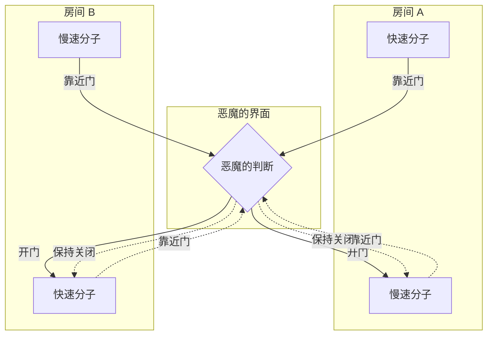
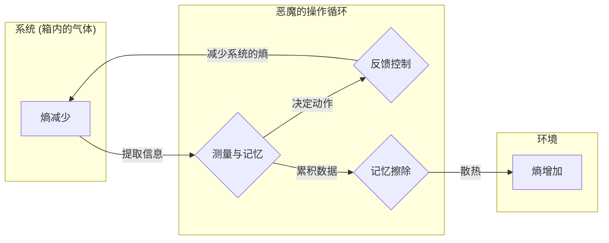

## 前言

在物理学的历史中，最著名且引起最多争论的思考实验之一就是 **[麦克斯韦妖](https://kenji.blog/zh-cn/p/maxwells-demon/)** 。19世纪的物理学家詹姆斯·克拉克·麦克斯韦在1867年提出的这个“恶魔”，在漫长的岁月中让全世界的物理学家们大伤脑筋。因为这个恶魔的存在，看起来似乎正面打破了物理学中最坚不可摧的定律之一、规定了宇宙不可逆性的 **热力学第二定律** 。

如果这个恶魔真实存在，我们就能从空气中无限提取热能，并将其转化为功，制造出“第二类永动机”。那意味着能源问题将永远得到解决，但同时也就意味着我们所知的物理法则的崩溃。

本文将详细解说这个[麦克斯韦妖](https://kenji.blog/zh-cn/p/maxwells-demon/)到底提出了怎样的悖论，以及在大约一个世纪后，它又是如何通过“信息”这个乍看与物理无关的概念被解决的，期间将使用丰富的数学公式和图解。

## 热力学第二定律与熵增定律

为了正确理解[麦克斯韦妖](https://kenji.blog/zh-cn/p/maxwells-demon/)的威胁，我们首先来回顾一下 **热力学第二定律** （熵增定律）的基础。

热力学第二定律是自然界绝对的规则：“在孤立系统中，熵（混乱程度）总是增加，或者保持不变”。用公式表示如下：

$$
\Delta S \ge 0
$$

这里，$S$ 代表熵， $\Delta S$ 代表熵的变化量。熵被解释为衡量系统“混乱程度”或“无序度”的尺度。

路德维希·玻尔兹曼将熵与微观状态数（情况的数量） $W$ 联系起来，公式化了著名的玻尔兹曼原理。

$$
S = k_B \ln W
$$

这里，$k_B$ 是玻尔兹曼常数（ $1.38 \times 10^{-23} \ \mathrm{J/K}$ ）。这个公式表明，可能采取的微观状态数越多（越混乱），熵就越大。

作为身边的例子，可以想象一下把热咖啡和冷牛奶倒进同一个杯子里的情况。随着时间的推移，两者会自然混合，变成温热的咖啡牛奶。在这个过程中，系统变得更加无序，熵增加了。但是反过来，温热的咖啡牛奶自发地分离成热咖啡和冷牛奶，是绝对不会发生的。像这样，自然界的现象有着不可逆的方向性，这被表达为熵的增加。

## [麦克斯韦妖](https://kenji.blog/zh-cn/p/maxwells-demon/)的思考实验

针对构成物理学根基的这一定律，麦克斯韦提出了以下巧妙的思考实验。

1. 在一个绝热容器中装有气体，中央用一堵墙将其分为左右两个房间（A和B）。
2. 最初，两个房间的温度相同，即气体分子的平均动能处于相等的状态。
3. 墙上有一个极小的洞，上面装有一扇无摩擦开闭的“门”。
4. 在这扇门前，有一个能观测到单个气体分子运动的智能存在，这就是 **恶魔** 。
5. 恶魔只在运动快的（能量高的）分子从A跑向B时，或者运动慢的（能量低的）分子从B跑向A时，才迅速把门打开。其他时候门都保持关闭。

这个恶魔巧妙的操作过程如下图所示。

时间流逝之后到底会发生什么呢？

由于恶魔选择性地开闭门，房间B里聚集的全是快速分子，而房间A里聚集的全是慢速分子。因为气体的温度与分子的平均动能成正比，结果房间B的温度上升，房间A的温度下降。

这意味着，在没有从外部施加任何力学功（能量）的情况下，在一个原本温度均匀的系统中制造出了温度差。有了温度差，就可以使用热机从中提取有用的功。

也就是说，在孤立系统中整体的熵减少了。

$$
\Delta S < 0
$$

麦克斯韦自己想通过这个思考实验证明，热力学第二定律并不是绝对的力学定律，而只是在“统计地处理大量分子时才成立的概率性定律”。然而，如果能人工制造出这种类似恶魔的存在，那么“第二类永动机”就完成了。[麦克斯韦妖](https://kenji.blog/zh-cn/p/maxwells-demon/)，向热力学第二定律提出了明确的矛盾。

## 西拉德引擎：信息的获取与功的转换

这个恶魔的悖论，实实在在地让物理学家们深陷烦恼的深渊长达一个世纪。因为恶魔仅仅只是基于信息进行开闭门（理论上，如果门没有质量则不需要能量）的操作，完全不知道在系统的哪个环节熵增加了。

迈出解决这道难题第一步的，是1929年的物理学家利奥·西拉德。西拉德提取了[麦克斯韦妖](https://kenji.blog/zh-cn/p/maxwells-demon/)的本质，设计出了一个极度简化的思考实验，即 **西拉德引擎** 。

西拉德引擎由一个仅装有1个气体分子的气缸，以及一个可插入其中央的隔板（活塞）组成。步骤如下：

1. 在装有1个分子的气缸中央，插入隔板。
2. 恶魔获取分子在隔板的右侧还是左侧这个1比特的 **信息** 。
3. 如果分子在左侧，就把隔板向右移动，让分子做膨胀功。如果在右侧就向左移动。
4. 随着活塞的移动，分子从周围的热浴吸收热量，并将其转化为力学功 $W$ 。

此时，通过等温膨胀，分子对外做的功 $W$ 可以从理想气体状态方程计算如下：

$$
W = \int_{V/2}^{V} p \, dV = \int_{V/2}^{V} \frac{k_B T}{V} \, dV = k_B T \ln 2
$$

西拉德敏锐地察觉到，恶魔“观测”系统状态并将其“记忆”的过程本身，隐藏着熵与信息的深刻联系。他认为，获取信息本身就会让熵增加。

## 香农熵与热力学的融合

1948年，克劳德·香农创立了信息论，定义了表示信息不确定性的 **信息熵** （香农熵）。服从概率分布 $P(x)$ 的信息源的熵 $H$ 表示如下。

$$
H = - \sum_{x} P(x) \log_2 P(x) \quad \mathrm{(bits)}
$$

令人惊讶的是，香农信息熵的公式，除了常数系数外，与玻尔兹曼的热力学熵公式具有完全相同的形式。从这时起，“信息”与“热力学”的融合真正开始了。

## 兰道尔原理：信息是物理的

进一步推进西拉德的洞察和香农的信息论，最终将悖论彻底解决的，是1961年罗尔夫·兰道尔及其后查尔斯·本内特的研究。

兰道尔强烈主张“信息是物理的”。信息的存储、传递和操作并不是在抽象空间中进行的，而是必然依赖于物理实体（硬件），并受到物理法则的支配。

兰道尔发现了一个极其重要的原理，即 **兰道尔原理** ，指出“在 **擦除** 信息时，必然会向环境释放热量，使环境的熵增加”。

为了完全擦除1比特的信息所需的最小能量（释放的热量） $Q$ ，由以下公式给出。

$$
Q \ge k_B T \ln 2
$$

随之而来的环境熵增 $\Delta S_{erase}$ 如下。

$$
\Delta S_{erase} \ge k_B \ln 2
$$

信息的“写入”或“计算”，原理上是可以不消耗能量就进行的。但是，在“遗忘”或“擦除”信息的不可逆操作中，必须付出热力学的代价。

## [麦克斯韦妖](https://kenji.blog/zh-cn/p/maxwells-demon/)的死亡与悖论的终结

1982年，查尔斯·本内特运用兰道尔原理，终于给[麦克斯韦妖](https://kenji.blog/zh-cn/p/maxwells-demon/)的悖论画上了完全的句号。

本内特的逻辑如下：

1. 恶魔观测气体分子的速度和位置，记录在自己的大脑（或是物理内存）中。
2. 基于记录的信息，进行开闭门的操作。如果是可逆的，到此为止的操作原理上可以在不增加熵的情况下进行。
3. 但是，恶魔的内存容量是有限的。为了永远持续分类分子，必须在某个时候 **擦除** 旧记忆，重置内存。
4. 根据兰道尔原理，在恶魔擦除1比特信息的瞬间，必然有 $k_B T \ln 2$ 以上的热量释放到环境中，使环境的熵增加。

也就是说，即便恶魔通过分类分子减少了箱子里的熵，当恶魔为了使系统持续运转而擦除自身内存时，外部环境必然发生了超过那个量级的熵增。

从整个系统来看，总熵的变化量绝对会大于等于零。

$$
\Delta S_{total} = \Delta S_{gas} + \Delta S_{memory\_erasure} \ge 0
$$

恶魔表现得越聪明、让箱子里的无序减少得越多，在恶魔的脑袋里就会积攒下越多名为“信息”的无序。而在试图整理（擦除）脑袋里的东西的那一刻，这种无序就会化作热量散播到宇宙中去。

## 信息热力学与向未来的发展

[麦克斯韦妖](https://kenji.blog/zh-cn/p/maxwells-demon/)的悖论，揭示了“信息”这个抽象概念与“能量”或“熵”等物理概念，在终极意义上是等价且密切相连的。

这一宏大的发现，目前作为 **信息热力学** 和 **非平衡态统计力学** 这一新的物理学前沿领域，正在快速发展。

近年来，人们正在研究在生物细胞内运作的DNA聚合酶或驱动蛋白等生物分子机器，是如何像[麦克斯韦妖](https://kenji.blog/zh-cn/p/maxwells-demon/)那样，利用信息高效地转换能量并制造出单向运动的机制。在生命现象的根源上，信息热力学的定律也深切相关。

此外，信息处理所需的终极能量极限即兰道尔极限，在思考未来计算机省电问题上，已成为最重要的理论基础。为了突破擦除信息时伴随根本性发热的物理壁垒，不擦除信息的“可逆计算”的研究也在推进中。

## 结语

麦克斯韦在19世纪放出的这个小恶魔，成为了物理学中最优美、也最深奥的思考实验。它起初是一个试图打破热力学第二定律的大胆挑战，结果却带来了阐明“信息的物理实质”这一意想不到的突破。

“知”与“忘”。

在我们日常进行的信息处理背后，宇宙最根本的定律即热力学时刻在注视着。 **信息** 与 **能量** 是一枚硬币的两面。这种深远的联系，今后必将在各个领域引发新的革命。[麦克斯韦妖](https://kenji.blog/zh-cn/p/maxwells-demon/)虽死犹生，它将继续为我们打开新的知识大门。
