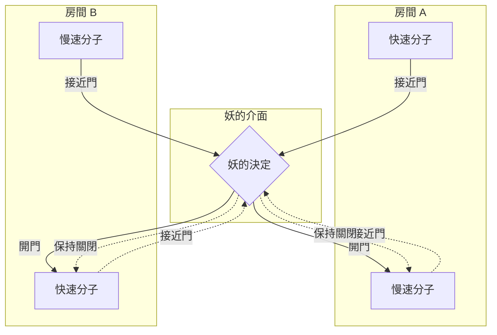
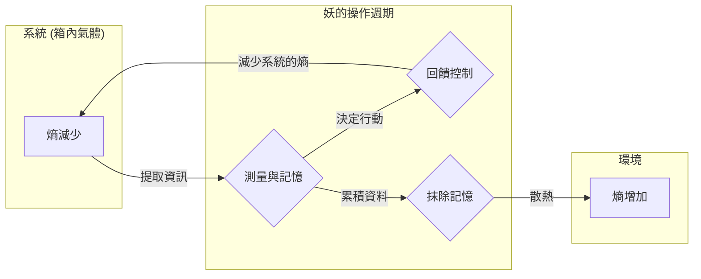

## 前言

在物理學史上，最著名且引發最多討論的思想實驗之一就是 **[馬克士威妖](https://kenji.blog/zh-tw/p/maxwells-demon/)** 。19世紀物理學家詹姆斯·克拉克·馬克士威（James Clerk Maxwell）於1867年提出的這隻「妖」，長年以來讓全世界的物理學家們大傷腦筋。因為這隻妖的存在，似乎公然打破了物理學中最堅固的定律之一，即規定宇宙不可逆性的 **熱力學第二定律** 。

如果這隻妖真的存在，我們將能從空氣中無限提取熱能，並將其轉化為功，製造出「第二類永動機」。這意味著能源問題將被永久解決，但同時也意味著我們所熟知的物理定律前提將會崩潰。

本篇文章將詳細解說[馬克士威妖](https://kenji.blog/zh-tw/p/maxwells-demon/)提出了什麼樣的悖論，以及在經過約一世紀後，它是如何透過「資訊」這個看似與物理毫無關聯的概念被解決的，並豐富地運用數學公式與圖解來進行說明。

## 熱力學第二定律與熵增定律

為了正確理解[馬克士威妖](https://kenji.blog/zh-tw/p/maxwells-demon/)的威脅，首先讓我們回顧 **熱力學第二定律** （熵增定律）的基礎。

熱力學第二定律是自然界絕對的規則：「孤立系統中的熵（混亂程度）總是增加，或者保持不變」。用數學公式表示如下：

$$
\Delta S \ge 0
$$

這裡，$S$ 代表熵，$\Delta S$ 代表熵的變化量。熵被解釋為衡量系統「混亂」或「無序」程度的尺度。

路德維希·波茲曼（Ludwig Boltzmann）將熵與微觀狀態的數量（情況數量）$W$ 結合，推導出了著名的波茲曼原理：

$$
S = k_B \ln W
$$

這裡，$k_B$ 是波茲曼常數（$1.38 \times 10^{-23} \ \mathrm{J/K}$）。這個公式表明，可能出現的微觀狀態數量越多（越混亂），熵就越大。

舉個生活中的例子，想像把熱咖啡和冷牛奶倒進同一個杯子裡。隨著時間過去，兩者會自然混合，變成溫熱的咖啡牛奶。在這個過程中，系統變得更無序，熵增加了。然而，相反的情況，也就是溫熱的咖啡牛奶自發地分離成熱咖啡和冷牛奶，是絕對不可能發生的。像這樣，自然界的現象具有不可逆的方向性，這就以熵增的形式表現出來。

## [馬克士威妖](https://kenji.blog/zh-tw/p/maxwells-demon/)的思想實驗

針對這項構成物理學根基的定律，馬克士威提出了一個巧妙的思想實驗，如下所述：

1. 絕熱容器中裝有氣體，並被中央的牆壁分為左右兩個房間（A 和 B）。
2. 最初，兩個房間的溫度相同，也就是氣體分子的平均動能處於相等狀態。
3. 牆壁上有一個非常小的洞，那裡裝有一扇可以無摩擦開關的「門」。
4. 這扇門前，存在著一個能觀測個別氣體分子運動的智慧存在，這就是 **妖** 。
5. 妖只有在移動快（能量高）的分子從 A 飛向 B 時，或者移動慢（能量低）的分子從 B 飛向 A 時，才會迅速打開門。在其他時候，門都會保持關閉。

這隻妖巧妙的操作過程如下圖所示。

隨著時間過去，到底會發生什麼事呢？

由於妖選擇性地開關門，房間 B 將只聚集快速分子，而房間 A 將只聚集慢速分子。因為氣體的溫度與分子的平均動能成正比，結果導致房間 B 的溫度上升，而房間 A 的溫度下降。

這意味著在完全沒有從外部施加力學功（能量）的情況下，在原本溫度均勻的系統中創造出了溫差。只要有溫差，就可以使用熱機從中提取有用的功。

換句話說，在孤立系統中整體的熵竟然減少了。

$$
\Delta S < 0
$$

馬克士威本人想透過這個思想實驗證明，熱力學第二定律並非絕對的力學定律，而僅僅是「在統計上處理大量分子時才成立的機率定律」。然而，如果能人為地創造出這種像妖一樣的存在，「第二類永動機」就會完成。[馬克士威妖](https://kenji.blog/zh-tw/p/maxwells-demon/)對熱力學第二定律提出了明確的矛盾。

## 齊拉引擎：資訊的取得與功的轉換

這隻妖的悖論，在長達一個世紀的時間裡，讓物理學家們陷入了深深的苦惱之中。因為妖只是根據資訊進行開關門的操作（理論上，如果是一扇質量為零的門，就不需要能量），完全不知道系統中哪裡的熵增加了。

對於這個難題，邁出解決第一步的是1929年的物理學家雷奧·齊拉（Leo Szilard）。齊拉構想出了 **齊拉引擎** ，這是一個萃取了[馬克士威妖](https://kenji.blog/zh-tw/p/maxwells-demon/)本質的、極度簡化的思想實驗。

齊拉引擎由一個只裝有1個氣體分子的圓筒，以及可以插入其正中央的隔板（活塞）組成。步驟如下：

1. 在裝有 1 分子氣體的圓筒中央，插入隔板。
2. 妖取得分子在隔板右側還是左側的 1 位元 **資訊** 。
3. 如果分子在左側，就向右移動隔板，讓分子做膨脹功。如果在右側，就向左移動。
4. 透過活塞的移動，分子從周圍的熱浴吸收熱量，並將其轉換為力學功 $W$。

此時，透過等溫膨脹分子對外所作的功 $W$，可以從理想氣體狀態方程式計算如下：

$$
W = \int_{V/2}^{V} p \, dV = \int_{V/2}^{V} \frac{k_B T}{V} \, dV = k_B T \ln 2
$$

齊拉看穿了，妖「觀測」系統狀態，並將其「記憶」的這個過程本身，隱藏著熵與資訊的深層關係。他認為，取得資訊本身就會增加熵。

## 夏農熵與熱力學的融合

1948年，克勞德·夏農（Claude Shannon）創立了資訊理論，並定義了表示資訊不確定性的 **資訊熵** （夏農熵）。服從機率分布 $P(x)$ 的資訊源其熵 $H$ 表示如下：

$$
H = - \sum_{x} P(x) \log_2 P(x) \quad \mathrm{(bits)}
$$

令人驚訝的是，夏農的資訊熵公式，與波茲曼的熱力學熵公式除了常數係數之外，形狀完全相同。從這時開始，「資訊」與「熱力學」的融合正式展開。

## 蘭道爾原理：資訊是物理的

進一步推動齊拉的洞察與夏農的資訊理論，最終將悖論導向完全解決的，是1961年羅夫·蘭道爾（Rolf Landauer）與其後查爾斯·班奈特（Charles Bennett）的研究。

蘭道爾強烈主張「資訊是物理的」。資訊的儲存、傳遞與操作，並非在抽象的空間中進行，而是必定依賴於物理實體（硬體），並受物理定律的支配。

蘭道爾發現的一個極其重要的原理，即 **蘭道爾原理** ，是指「當 **抹除** 資訊時，必然會向環境釋放熱量，並增加環境的熵」。

為完全抹除 1 位元資訊所需的最小能量（釋放出的熱量）$Q$，由以下公式給出：

$$
Q \ge k_B T \ln 2
$$

伴隨而來的環境熵增加 $\Delta S_{erase}$ 如下：

$$
\Delta S_{erase} \ge k_B \ln 2
$$

將資訊「寫入」或進行「計算」，在原理上是可以在不消耗能量的情況下進行的。然而，在「遺忘」或「抹除」資訊這種不可逆的操作中，就必然必須付出熱力學上的代價。

## [馬克士威妖](https://kenji.blog/zh-tw/p/maxwells-demon/)的死亡與悖論的終結

1982年，查爾斯·班奈特利用蘭道爾原理，終於為[馬克士威妖](https://kenji.blog/zh-tw/p/maxwells-demon/)的悖論畫下了完全的休止符。

班奈特的邏輯如下：

1. 妖觀測氣體分子的速度與位置，並記錄在自己的大腦中（或是物理性的記憶體中）。
2. 根據記錄的資訊，進行門的開關。到這裡為止的操作，如果是可逆的，在原理上可以在不增加熵的情況下進行。
3. 然而，妖的記憶體容量是有限的。為了能永遠持續分類分子，必須在某個時刻 **抹除** 舊的記憶，重置記憶體。
4. 根據蘭道爾原理，在妖抹除 1 位元資訊的瞬間，必然會向環境釋放 $k_B T \ln 2$ 以上的熱量，使得環境的熵增加。

也就是說，即使妖透過分類分子減少了箱子內的熵，但當妖為了讓系統持續運作而抹除自身記憶體時，必然會在外部環境中產生大於此數值的熵增加。

從整體系統來看，總熵的變化必定大於或等於零。

$$
\Delta S_{total} = \Delta S_{gas} + \Delta S_{memory\_erasure} \ge 0
$$

妖表現得越聰明，將箱子內的無序減少得越多，妖的腦海中就會累積越多名為資訊的無序。然後，就在試圖整理（抹除）腦海的瞬間，那些無序就會化為熱量散佈到宇宙中。

## 資訊熱力學與未來的發展

[馬克士威妖](https://kenji.blog/zh-tw/p/maxwells-demon/)的悖論，闡明了「資訊」這個抽象概念，與「能量」及「熵」這些物理概念，在終極意義上是等價且密切相關的。

這項宏大的發現，目前正作為 **資訊熱力學** 與 **非平衡統計力學** 這些新物理學的前沿領域，在迅速發展中。

近年來，科學家們正在研究生物細胞內運作的 DNA 聚合酶和驅動蛋白等生物分子機械，是如何像[馬克士威妖](https://kenji.blog/zh-tw/p/maxwells-demon/)一樣利用資訊有效轉換能量，並創造出單向運動的機制。在生命現象的根源，也深深牽涉到資訊熱力學的定律。

此外，資訊處理所需的終極能量極限「蘭道爾極限」，已成為思考未來電腦省電化最重要的理論基礎。為了突破資訊抹除伴隨根本性生熱的物理障礙，不抹除資訊的「可逆運算」研究也在持續進行中。

## 結語

馬克士威在19世紀放出的這隻小妖，成為了物理學中最美麗且深奧的思想實驗。這一切始於試圖破壞熱力學第二定律的大膽挑戰，結果卻帶來了揭示「資訊的物理實體」這意想不到的重大突破。

「知道」與「遺忘」。

在我們日常進行的資訊處理背後，宇宙的根本定律——熱力學始終緊盯著。 **資訊** 與 **能量** 是一體兩面。這種深奧的連結，未來也必將在各個領域掀起新的革命。[馬克士威妖](https://kenji.blog/zh-tw/p/maxwells-demon/)即便死亡，依然持續為我們開啟新的知識之門。
