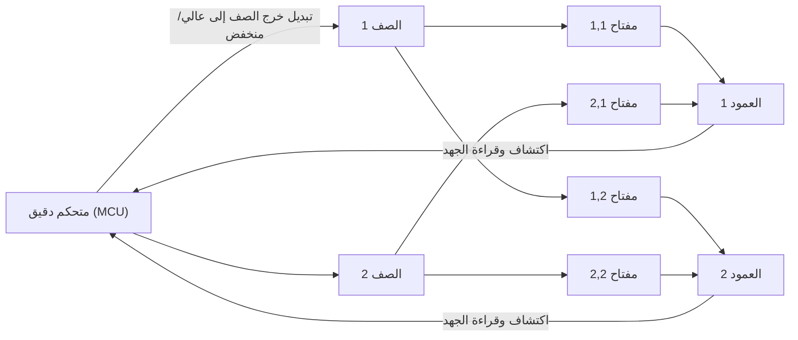
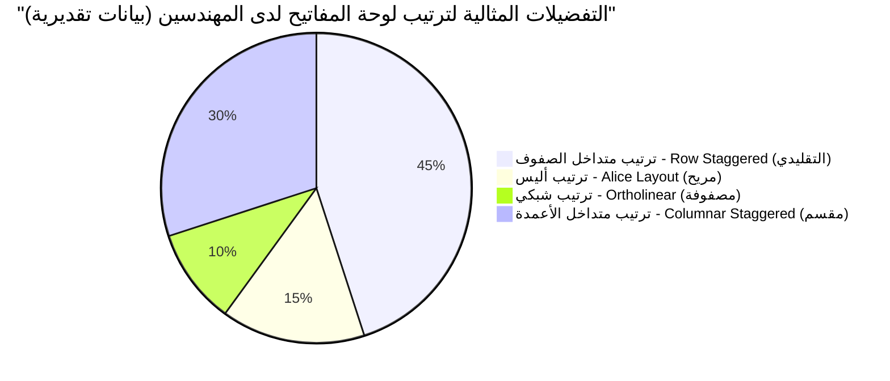

# لجلسات البرمجة الطويلة! 5 لوحات مفاتيح ميكانيكية موصى بها للمهندسين

بالنسبة للمحترفين العاملين في مجال تكنولوجيا المعلومات مثل المبرمجين، ومهندسي النظم، وعلماء البيانات، فإن لوحة المفاتيح ليست مجرد جهاز إدخال. إنها "الواجهة لتحويل الأفكار إلى شكل من أشكال الكود"، وهي أداة العمل الأكثر أهمية التي تتصل بها بشكل مباشر لساعات طويلة كل يوم.

إن الاستمرار في استخدام لوحة مفاتيح رديئة لا يؤدي فقط إلى انخفاض سرعة الكتابة، بل يزيد أيضًا من خطر الإجهاد المفرط على مفاصل المعصم والأصابع، مما قد يؤدي في النهاية إلى التهاب الأوتار (مثل متلازمة النفق الرسغي). وعلى العكس من ذلك، فإن الحصول على لوحة مفاتيح تناسب يديك، وتوفر شعورًا جيدًا عند الكتابة، وقابلة للتخصيص بدرجة عالية، يعتبر "أفضل استثمار" يحسن بشكل كبير من كل من الإنتاجية والصحة.

في هذه المقالة، نتجاوز مجرد "التوصيات" للمهندسين، ونشرح بدقة كل شيء بدءًا من فيزياء لوحات المفاتيح إلى الدوائر الإلكترونية الداخلية، وأحدث تقنيات البرامج الثابتة. وبناءً على ذلك، سنقدم 5 من أفضل لوحات المفاتيح المطلقة التي يمكنها تحمل الاستخدام العملي حقًا.

## 1. فيزياء وآليات مفاتيح لوحة المفاتيح

العامل الأكثر أهمية الذي يحدد شعور الكتابة على لوحة المفاتيح هو "المفتاح" (Key Switch). تتكون مفاتيح لوحات المفاتيح الميكانيكية من زنبرك (Spring) وآلية تلامس، وتنتقل خصائصها الفيزيائية كردود فعل إلى أطراف أصابعنا.

### 1.1 قانون هوك وثابت الزنبرك

يتم تحديد قوة الضغط (Actuation Force) للمفتاح الميكانيكي بشكل أساسي بواسطة خصائص الزنبرك الموجود بداخله. يمكن التعبير عن سلوك هذا الزنبرك بشكل تقريبي باستخدام "قانون هوك" (Hooke's Law) في الميكانيكا الكلاسيكية.

$$ F = -k x $$

حيث $F$ هي قوة الاسترجاع (قوة التنافر التي يشعر بها الإصبع)، و $k$ هو ثابت الزنبرك، و $x$ هي مسافة الضغط (الاستطالة).
في حالة المفاتيح الخطية (مثل المفاتيح الحمراء والسوداء)، فإنها تتبع قانون هوك بشكل شبه دقيق، وتتميز بخاصية خطية (Linear) حيث تزداد قوة التنافر بشكل متناسب كلما تم الضغط أكثر.

### 1.2 الحساب التكاملي لطاقة التشغيل

يُطلق على النقطة التي يتم عندها التعرف على أن المفتاح قد تم "إدخاله" نقطة التشغيل (Actuation Point). يمكن التعبير عن الطاقة (الشغل) $E$ التي يستهلكها الإصبع من بداية ضغط المفتاح حتى الوصول إلى نقطة التشغيل $x_a$ بواسطة تكامل القوة بالنسبة للمسافة.

$$ E = \int_{0}^{x_a} F(x) \, dx $$

في حالة المفاتيح اللمسية (Tactile، مثل المفاتيح البنية) والمفاتيح النقرية (Clicky، مثل المفاتيح الزرقاء)، يوجد مقاومة فيزيائية (نتوء لمسي - Tactile Bump) ناتجة عن احتكاك نقاط التلامس، وبالتالي فإن $F(x)$ ليست دالة خطية بسيطة، بل تصبح دالة تصل إلى ذروة غير خطية في موضع استطالة محدد.

```mermaid
flowchart TD
    A["بداية الضغط بواسطة الإصبع"] --> B{"نوع المفتاح"}
    B -->|خطي| C["تزداد المقاومة بشكل خطي"]
    B -->|لمسي| D["مقاومة فيزيائية في المنتصف (نتوء)"]
    B -->|نقري| E["تعمل آلية إصدار الصوت بالتزامن مع النتوء"]
    C --> F["الوصول إلى نقطة التشغيل (Actuation Point)"]
    D --> F
    E --> F
    F --> G["تلامس القاع (Bottom Out)"]
```

عندما يقوم المهندسون بالبرمجة لفترات طويلة، إذا كانت هذه الطاقة $E$ (طاقة التشغيل) كبيرة جدًا، فإن الأصابع تتعب بسهولة، وإذا كانت صغيرة جدًا، تزداد أخطاء الكتابة (الضغطات الخاطئة). وبشكل عام، تعتبر المفاتيح التي تتراوح قوة تشغيلها بين 45 جرام و 55 جرام متوازنة بين تقليل التعب والدقة، وهي مفضلة لدى العديد من المهندسين.

### 1.3 أحدث تقنيات المفاتيح: السعة الكهربائية بدون تلامس وتأثير هول

هناك أيضًا تقنيات مفاتيح أكثر تقدمًا لا تحتوي على نقاط تلامس معدنية فيزيائية.

**نظام السعة الكهربائية بدون تلامس (Topre)**
يستخدم زنبركًا مخروطي الشكل وقبة مطاطية (Rubber Dome)، ويكتشف تغير السعة الكهربائية الناتج عن الضغط لتحديد الإدخال. نظرًا لعدم وجود نقاط تلامس فيزيائية، فإن التآكل منخفض للغاية، ولا يحدث "ارتداد المفاتيح" (الثرثرة - Chattering، وهي ظاهرة يتم فيها إدخال أحرف متعددة بضغطة واحدة). إن شعور الكتابة الفريد "سكوكوكو" (Skokoko) الذي توفره القبة المطاطية له جاذبية لا يمكن الاستغناء عنها بمجرد تجربته.

**المفاتيح المغناطيسية (Hall Effect)**
باستخدام تأثير هول، يقرأ المستشعر التغير في كثافة الفيض المغناطيسي كجهد كهربائي عندما يقترب المغناطيس المدمج في الجذع (Stem) من مستشعر هول على اللوحة.
يتم التعبير عن القوة الدافعة الكهربائية $V_H$ الناتجة عن تأثير هول بالمعادلة التالية.

$$ V_H = R_H \left( \frac{I \cdot B}{t} \right) $$

حيث $R_H$ هو معامل هول، و $I$ هو التيار، و $B$ هي كثافة الفيض المغناطيسي، و $t$ هو سمك الموصل. بفضل هذه التقنية، يمكن الحصول على عمق ضغطة المفتاح كقيمة تناظرية مستمرة، مما يتيح تحكمًا مذهلًا مثل "تغيير نقطة التشغيل بوحدات 0.1 مم (Actuation Point Adjustment)" أو "إيقاف تشغيل المفتاح في اللحظة التي يبدأ فيها بالعودة (Rapid Trigger)".

## 2. الدوائر الإلكترونية للوحة المفاتيح ومؤشرات الأداء

حتى لو كانت المفاتيح ممتازة، لا يمكن تحقيق أفضل أداء إذا كانت الدوائر الإلكترونية أو المتحكم الدقيق (Microcontroller) الذي يعالجها منخفض الأداء.

### 2.1 مسح المصفوفة ومعدل الاستقصاء

يوجد داخل لوحة المفاتيح عشرات إلى أكثر من 100 مفتاح، ولكن نظرًا لمحدودية عدد دبابيس (Pins) المتحكم الدقيق، لا يمكن توصيل جميع المفاتيح بدبابيس منفصلة. لذلك، يتم ترتيب المفاتيح في شبكة (مصفوفة) من الصفوف (Rows) والأعمدة (Columns)، ويتم تحديد المفتاح المضغوط عن طريق مسحها بسرعة عالية.

**معدل الاستقصاء (Polling Rate)** هو التردد الذي تبلغ به لوحة المفاتيح جهاز الكمبيوتر "بحالة المفاتيح الحالية". لوحات المفاتيح القياسية تكون 125 هرتز (مرة كل 8 مللي ثانية)، ولكن الموديلات المتطورة تتواصل بسرعات فائقة تصل إلى 1000 هرتز (مرة كل 1 مللي ثانية)، ومؤخرًا 8000 هرتز (مرة كل 0.125 مللي ثانية).
بالنسبة للبرمجة، يعتبر 1000 هرتز أداءً كافيًا جدًا، ولكنه يوفر شعورًا بالأمان ويمنع فقدان أي ضغطة عند الكتابة بسرعات عالية للغاية.

### 2.2 تجاوز عدد المفاتيح (NKRO) ومكافحة الظلال

**تجاوز عدد المفاتيح (N-Key Rollover أو NKRO)** هي ميزة تضمن التعرف بدقة على جميع المفاتيح عند الضغط عليها معًا في نفس الوقت. في الماضي، كانت هناك قيود مثل "حتى 6 مفاتيح" بسبب قيود اتصال USB، ولكن لوحات المفاتيح المتطورة الحالية تحقق ضغطًا متزامنًا غير محدود فعليًا (Full NKRO) من خلال ابتكارات في تقرير USB HID.

بالنسبة للمهندسين الذين يستخدمون اختصارات معقدة بكثرة في محررات مثل Vim أو Emacs (على سبيل المثال: `Ctrl + Shift + Alt + أي مفتاح`)، فإن NKRO الكامل يعتبر شرطًا أساسيًا.

### 2.3 تأخير الارتداد (Debounce Delay)

تتسبب المفاتيح الميكانيكية ذات التلامس المعدني في حدوث "ظاهرة الارتداد" (Bounce) حيث ترتد نقاط التلامس بشكل طفيف عند الضغط أو التحرير. وقت المعالجة الذي يتجاهل فيه المتحكم الدقيق هذا الارتداد يسمى **تأخير الارتداد**. عادةً ما يتم تعيين تأخير مقصود يتراوح من 5 إلى 20 مللي ثانية، ولكن في المفاتيح التناظرية أو المغناطيسية المذكورة سابقًا، نظرًا لعدم وجود ضوضاء تلامس فيزيائية، يمكن تعيين تأخير الارتداد إلى الصفر (أو الحد الأدنى)، مما يوفر استجابة ساحقة.

## 3. البرامج الثابتة وقابلية التخصيص (QMK / VIA)

إذا كانت الأجهزة (الهاردوير) هي "الجسم"، فإن البرامج الثابتة (الفيرموير) هي "دماغ" لوحة المفاتيح. لوحات المفاتيح المتطورة الحديثة الموجهة للمهندسين لا ترسل رموز المفاتيح فحسب، بل تمتلك القدرة على تنفيذ برامج معقدة.

### 3.1 QMK Firmware

**QMK (Quantum Mechanical Keyboard)** هي برامج ثابتة مفتوحة المصدر للوحات المفاتيح. وهي مكتوبة بلغة C، وتتيح حرفيًا "القيام بأي شيء"، بدءًا من تغيير تخطيط المفاتيح إلى إنشاء وحدات الماكرو والتحكم في الرسوم المتحركة لمصابيح LED.

### 3.2 ميزات تعيين المفاتيح المتقدمة

من بين الميزات التي توفرها QMK، فإن الميزات التالية تزيد بشكل هائل من إنتاجية المهندسين.

- **وظيفة الطبقات (Layers):** تمامًا مثل التبديل بين "الحروف" و"الأرقام" على لوحة مفاتيح الهاتف الذكي، يتم تبديل تخطيط لوحة المفاتيح بالكامل إلى تخطيط آخر فقط أثناء الضغط على مفتاح معين (مثل مفتاح Fn). هذا يتيح لك إدخال مفاتيح الأسهم أو وحدات الماكرو أو الرموز دون تحريك يديك من وضعية الارتكاز (Home Position).
- **Mod-Tap:** يعطي دورين مختلفين لمفتاح واحد بناءً على ما إذا كان قد تم "النقر عليه لفترة قصيرة" أو "الضغط عليه باستمرار". على سبيل المثال، إعداد مفتاح المسافة ليكون "مسافة عند النقر، وShift عند الاستمرار" (Space Cadet Shift) يتيح الاستخدام الفعال للإبهام.
- **Home Row Mods:** هي تقنية يتم فيها تعيين مفاتيح التعديل (Ctrl, Shift, Alt, GUI) عند الضغط المستمر عليها إلى مفاتيح صف الارتكاز (مثل ASDF و JKL;). هذا يلغي الحاجة إلى إرهاق الإصبع الخنصر لتمديده وضغط مفتاح Ctrl، مما يقلل بشكل كبير من إجهاد المعصم لمستخدمي Vim و Emacs.

### 3.3 الإعداد في الوقت الفعلي عبر VIA / VIAL

كان العيب في QMK هو "الحاجة إلى تجميع كود المصدر وفلش (كتابة) البرامج الثابتة في كل مرة يتم فيها تغيير الإعدادات". ما حل هذه المشكلة هو **VIA** و **VIAL**. تتيح لك هذه التطبيقات (أو من خلال متصفح الويب) الوصول إلى لوحة المفاتيح وإعادة كتابة تخطيط المفاتيح في الوقت الفعلي دون الحاجة إلى إعادة التشغيل.

## 4. بيئة العمل وعلم ترتيب المفاتيح

إن الترتيب العام المتمثل في "Row Staggered" (حيث تكون المفاتيح متداخلة أو مزاحة حسب الصفوف) هو من بقايا تصميم الآلة الكاتبة لمنع تشابك الأذرع المادية، ولا يعتمد على التركيب التشريحي ليد الإنسان.

هناك الترتيبات التالية التي تأخذ بعين الاعتبار بيئة العمل (الإرجونوميكس) بشكل أفضل.

- **الترتيب الشبكي (Ortholinear):** ترتيب تصطف فيه المفاتيح في خط مستقيم تمامًا عموديًا وأفقيًا في شكل شبكة. يصبح ثني الأصابع ومطها في خط مستقيم، مما يقلل من الحركات المهدرة.
- **الترتيب متداخل الأعمدة (Columnar Stagger):** ترتيب تتداخل فيه الأعمدة الرأسية لتتناسب مع طول أصابع الإنسان (الإصبع الأوسط طويل، والخنصر قصير). يمكنك الكتابة بشكل يد طبيعي.
- **النوع المقسم (Split):** نظرًا لأنه يمكن وضع اليدين اليمنى واليسرى بشكل منفصل تمامًا، يمكنك الكتابة في وضعية طبيعية حيث تفتح كتفيك وتفرد صدرك، مما يكون له تأثير هائل في منع تيبس الكتفين وحالة الرقبة المستقيمة (Straight Neck).

## 5. 5 لوحات مفاتيح ميكانيكية مطلقة موصى بها للمهندسين

بناءً على اعتبارات الفيزياء، والدوائر الإلكترونية، والبرامج الثابتة، وبيئة العمل، اخترنا بعناية 5 لوحات مفاتيح للمحترفين الحقيقيين التي يمكنها تحمل جلسات البرمجة الطويلة.

---

### 1. سلسلة Keychron Q (مثل Q1 Pro / Q8) - بوابة إلى عالم لوحات المفاتيح المخصصة

شركة Keychron ومقرها في هونغ كونغ هي الرائدة في طفرة لوحات المفاتيح المخصصة الأخيرة. وتتميز "سلسلة Q" على وجه الخصوص بهيكل من الألومنيوم الكامل والثقيل وهيكل "Gasket Mount" الذي يضبط صوت الكتابة إلى أقصى حد.

- **المفاتيح:** ميكانيكية (تدعم التبديل السريع Hotswap. يمكنك تغيير المفاتيح بحرية)
- **البرامج الثابتة:** متوافقة تمامًا مع QMK/VIA
- **الميزات:** مفتاح تبديل متوافق مع نظامي macOS و Windows. يمكنك اختيار الترتيب المفضل لديك، مثل ترتيب أليس Q8، أو الترتيب بحجم 75% Q1.
- **الفوائد للمهندسين:** على الرغم من كونها منتجًا جاهزًا، يمكنك الاستمتاع بشعور كتابة ممتاز وقابلية تخصيص تنافس لوحات المفاتيح المجمعة يدويًا بمجرد إخراجها من الصندوق. إنها مثالية لإعداد طبقة أسهم على طراز Vim باستخدام VIA.

---

### 2. HHKB Studio - جهاز تأشير متكامل للقراصنة

"Happy Hacking Keyboard (HHKB)" هي لوحة مفاتيح أسطورية تم إنشاؤها لمبرمجي UNIX. تعتمد أحدث لوحاتها "HHKB Studio" على مفاتيح ميكانيكية صامتة مطورة خصيصًا بدلًا من نظام السعة الكهربائية بدون تلامس التقليدي، محققةً تطورًا إضافيًا.

- **المفاتيح:** مفاتيح ميكانيكية خطية صامتة (من صنع Kailh، تدعم التبديل السريع Hotswap)
- **الميزات:** عصا تأشير (Trackpoint) في وسط لوحة المفاتيح، و4 منصات إيماءات.
- **الفوائد للمهندسين:** يمكنك إكمال تشغيل مؤشر الماوس والتمرير وتبديل النوافذ دون رفع يديك عن وضعية الارتكاز. بمجرد أن تجرب هذه التجربة حيث "يكتمل كل شيء بأطراف أصابعك"، لن تتمكن أبدًا من العودة إلى العمل الذي يتطلب مد يدك اليمنى إلى الماوس.

---

### 3. ZSA Moonlander / ErgoDox EZ - أقصى درجات بيئة العمل المقسمة

هذه هي قمة لوحات المفاتيح المقسمة التي طورتها شركة ZSA الكندية. يتم فصل الجانبين الأيمن والأيسر بشكل مستقل، ويمكن وضعهما بما يتناسب مع عرض كتفيك، مما يقلل بشكل مذهل من العبء على رقبتك وكتفيك حتى أثناء جلسات الكتابة الطويلة.

- **المفاتيح:** ميكانيكية (متوافقة مع Cherry MX، تدعم التبديل السريع Hotswap)
- **البرامج الثابتة:** مبنية على QMK (تستخدم أداة واجهة مستخدم رسومية قوية وخاصة بها تسمى "Oryx")
- **الميزات:** ترتيب متداخل الأعمدة، مجموعة مفاتيح مخصصة للإبهام، وتأتي قياسيًا بأرجل لتحديد الزاوية (الخيمة - Tenting).
- **الفوائد للمهندسين:** من خلال تعيين مفاتيح Enter و Space و Backspace وتبديل الطبقات (Layer) للإبهام، فإنها تقلل بشكل كبير من العبء على إصبع الخنصر وهو الأضعف. إنها جهاز يعمل كمنقذ للمهندسين الذين يعانون من متلازمة النفق الرسغي.

---

### 4. REALFORCE R3 - الموثوقية اليابانية وشعور الكتابة الأسمى (نظام السعة الكهربائية بدون تلامس)

تحفة يابانية تفتخر بها شركة Topre. سجلها الحافل بالاستخدام في البيئات المهنية مثل المؤسسات المالية لسنوات عديدة ليس من فراغ. بدءًا من الجيل R3، أصبحت تدعم أيضًا اتصال Bluetooth.

- **المفاتيح:** نظام السعة الكهربائية بدون تلامس (Topre)
- **الميزات:** من خلال وظيفة APC (مغير نقطة التشغيل)، يمكن تعيين نقطة التشغيل لكل مفتاح بشكل فردي من بين 0.8 مم و 1.5 مم و 2.2 مم و 3.0 مم.
- **الفوائد للمهندسين:** يُطلق على لمسة المفتاح السلسة الناتجة عن عدم وجود نقاط تلامس فيزيائية اسم "لمسة الريشة" (Feather Touch)، وتقلل بشكل كبير من ضغط الارتداد على الأصابع حتى أثناء البرمجة لفترات طويلة. يمكن تخصيصها بحيث يتم تعيين نقطة تشغيل ضحلة (0.8 مم) للمفاتيح التي يتم الضغط عليها بواسطة الخنصر (مثل حرف A ومفتاح Enter) لتستجيب بمجرد لمسها بخفة.

---

### 5. Wooting 60HE - الاستجابة الثورية التي توفرها المفاتيح المغناطيسية

تم تطويرها في الأصل للاعبي الرياضات الإلكترونية (e-sports)، ولكن تقنيتها المبتكرة تحظى بتقدير كبير بين المهندسين الذين يسعون للحصول على أسرع كتابة واستجابة.

- **المفاتيح:** مفتاح Lekker (مفتاح مغناطيسي يعمل بتأثير هول)
- **الميزات:** ميزة التشغيل السريع (Rapid Trigger)، ونقطة تشغيل قابلة للتعديل بوحدات 0.1 مم من 0.1 مم إلى 4.0 مم.
- **الفوائد للمهندسين:** من خلال الاستفادة من الإدخال التناظري، أصبح من الممكن إعداد إعدادات استثنائية (Dynamic Keystroke) مثل "إذا ضغطت قليلًا تُدخل حرفًا صغيرًا، وإذا ضغطت بعمق تُدخل حرفًا كبيرًا (مدمجًا مع Shift)". بالإضافة إلى ذلك، نظرًا لأنه يتم إيقاف تشغيل المفتاح في اللحظة التي يتم فيها رفع الإصبع ولو قليلاً، فإنه يمنع الإدخال المستمر غير المقصود للمفاتيح أثناء الكتابة السريعة، مما يوفر تجربة إدخال دقيقة لا مثيل لها.

## خاتمة

إن اختيار لوحة المفاتيح هو عملية "تحسين واجهتك الخاصة" طوال حياتك المهنية كمهندس. إن العمق الذي يجب السعي وراءه لا حدود له، بدءًا من الإحساس المادي بالزنبرك الذي يتبع قانون هوك، إلى طاقة التشغيل المحسوبة بواسطة التكامل، وبناء وحدات الماكرو بواسطة QMK، وصولاً إلى أقصى درجات بيئة العمل.

لوحات المفاتيح الخمس التي قدمناها هذه المرة (Keychron و HHKB Studio و Moonlander و REALFORCE و Wooting) هي جميعها روائع تهدف إلى "أفضل تجربة إدخال" بمناهج مختلفة. نأمل أن تجد أفضل شريك لك يناسب أسلوبك في الكتابة والمشاكل الجسدية التي قد تواجهها.

إن الاستثمار في لوحة المفاتيح سيعود عليك بالتأكيد بـ "ملايين الأسطر من الأكواد الخالية من الأخطاء".
