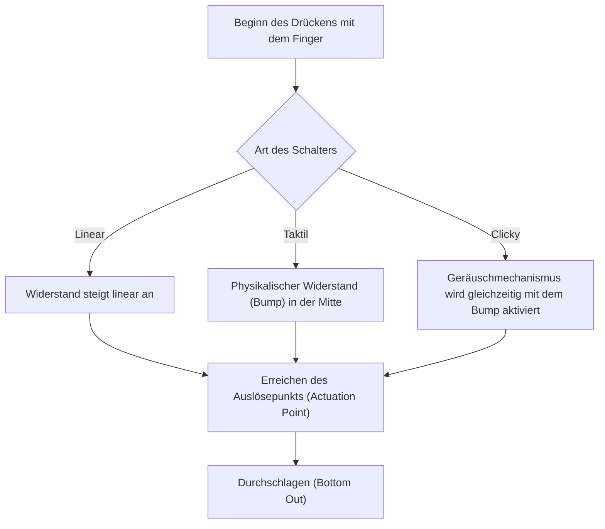
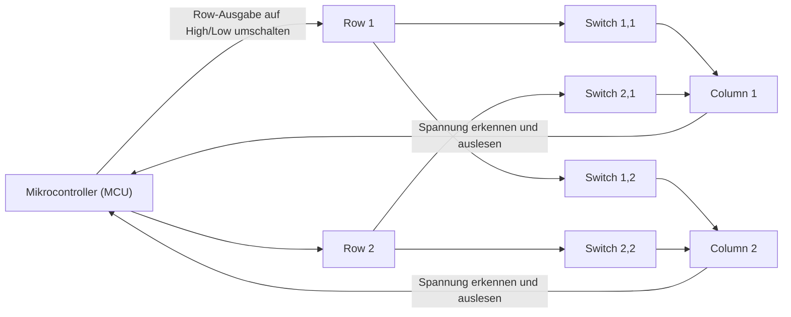
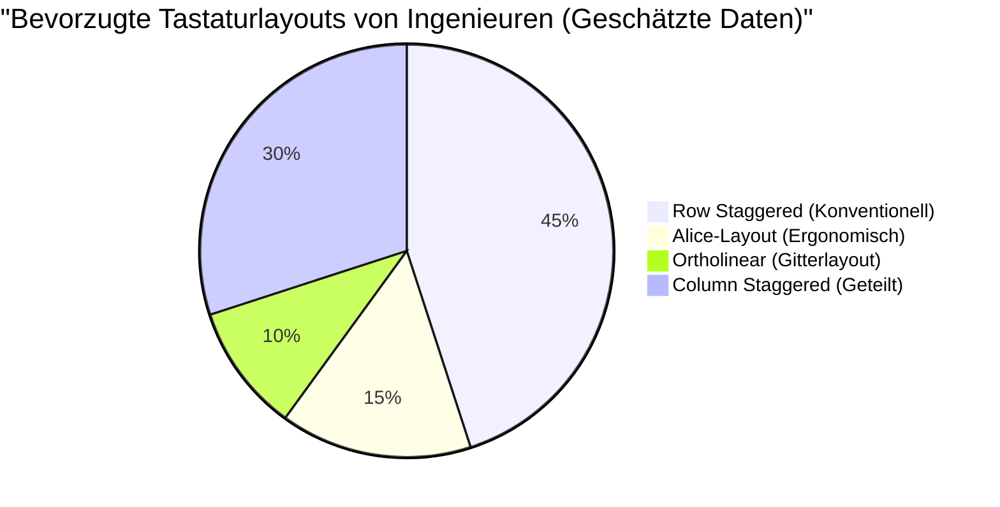

# Für langes Programmieren! 5 empfehlenswerte mechanische Tastaturen für Ingenieure

Für Profis in der IT-Branche wie Programmierer, Systemingenieure und Datenwissenschaftler ist die Tastatur nicht einfach nur ein Eingabegerät. Sie ist die "Schnittstelle, um Gedanken in Code zu übersetzen" und das wichtigste Arbeitswerkzeug, das man jeden Tag stundenlang direkt berührt.

Die fortgesetzte Nutzung einer minderwertigen Tastatur führt nicht nur zu einer Verringerung der Tippgeschwindigkeit, sondern auch zu einer übermäßigen Belastung der Handgelenke und Fingergelenke und erhöht das Risiko von Sehnenscheidenentzündungen (wie dem Karpaltunnelsyndrom). Im Gegenteil, der Kauf einer Tastatur, die gut in der Hand liegt, ein gutes Tippgefühl bietet und hochgradig anpassbar ist, ist die "beste Investition", die sowohl die Produktivität als auch die Gesundheit erheblich verbessert.

In diesem Artikel werden wir für Ingenieure weit über bloße "Empfehlungen" hinausgehen und alles von der Physik der Tastaturen über die internen elektronischen Schaltungen bis hin zu den neuesten Firmware-Technologien gründlich erklären. Auf dieser Grundlage stellen wir 5 ultimative Tastaturen vor, die dem echten Praxiseinsatz standhalten.

## 1. Die Physik und Mechanismen der Tastenschalter

Das wichtigste Element, das das Tippgefühl einer Tastatur bestimmt, ist der "Tastenschalter" (Switch). Die Schalter von mechanischen Tastaturen bestehen aus Federn und einem Kontaktmechanismus, und ihre physikalischen Eigenschaften werden als Feedback an unsere Fingerspitzen weitergegeben.

### 1.1 Das Hookesche Gesetz und die Federkonstante

Die Betätigungskraft (Actuation Force) eines mechanischen Schalters wird hauptsächlich durch die Eigenschaften der eingebauten Feder bestimmt. Das Verhalten dieser Feder lässt sich in der klassischen Mechanik annähernd durch das "Hookesche Gesetz" (Hooke's Law) beschreiben.

$$ F = -k x $$

Hierbei ist $F$ die Rückstellkraft (die von den Fingern gespürte Reaktionskraft), $k$ die Federkonstante und $x$ die zurückgelegte Strecke (Hub).
Bei linearen Schaltern (wie Red- oder Black-Switches) folgen sie diesem Hookeschen Gesetz fast exakt und haben die lineare Eigenschaft (Linear), dass die Reaktionskraft proportional zur Eindrücktiefe zunimmt.

### 1.2 Integralberechnung der Betätigungsenergie

Der Punkt, an dem eine Taste als "gedrückt" erkannt wird, wird als Auslösepunkt (Actuation Point) bezeichnet. Die Energie (Arbeit) $E$, die der Finger aufwendet, vom Beginn des Drückens der Taste bis zum Erreichen des Auslösepunkts $x_a$, wird durch das Integral der Kraft über die Strecke ausgedrückt.

$$ E = \int_{0}^{x_a} F(x) \, dx $$

Bei taktilen Schaltern (Brown-Switches) und Clicky-Schaltern (Blue-Switches) gibt es einen physikalischen Widerstand, an dem die Kontakte reiben (taktiler Bump). Daher ist $F(x)$ keine einfache lineare Funktion, sondern eine Funktion, die an einer bestimmten Hubposition nichtlinear einen Höhepunkt erreicht.

Wenn Ingenieure über lange Zeiträume programmieren, werden die Finger leicht müde, wenn diese Betätigungsenergie $E$ zu groß ist; ist sie jedoch zu klein, nehmen Tippfehler (Fehleingaben) zu. Im Allgemeinen gelten Schalter mit einer Betätigungskraft von etwa 45 g bis 55 g als eine gute Balance zwischen Ermüdungsreduzierung und Genauigkeit und werden von vielen Ingenieuren bevorzugt.

### 1.3 Modernste Schaltertechnologien: Kapazitiv kontaktlos und Hall-Effekt

Es gibt auch fortschrittlichere Schaltertechnologien, die keine physischen Metallkontakte haben.

**Kapazitive kontaktlose Schalter (Topre)**
Sie verwenden konische Federn und Gummidome und erkennen Eingaben durch die Veränderung der elektrischen Kapazität beim Drücken. Da es keine physischen Kontakte gibt, ist der Verschleiß extrem gering und es tritt kein Chattering (ein Phänomen, bei dem ein Tastendruck mehrmals registriert wird) auf. Das einzigartige Tippgefühl ("Thock"), das durch die Gummidome entsteht, hat einen Charme, von dem man sich kaum noch trennen kann, sobald man es einmal erlebt hat.

**Magnetische Schalter (Hall-Effekt)**
Unter Ausnutzung des Hall-Effekts wird die Änderung der magnetischen Flussdichte, die dadurch entsteht, dass sich ein in den Schaft (Stem) eingebetteter Magnet einem Hall-Sensor auf der Platine nähert, als Spannung gelesen.
Die durch den Hall-Effekt erzeugte elektromotorische Kraft $V_H$ wird durch die folgende Gleichung ausgedrückt:

$$ V_H = R_H \left( \frac{I \cdot B}{t} \right) $$

Hier ist $R_H$ der Hall-Koeffizient, $I$ der Strom, $B$ die magnetische Flussdichte und $t$ die Dicke des Leiters. Durch diese Technologie kann die Tiefe des Tastenanschlags kontinuierlich als analoger Wert erfasst werden, was erstaunliche Kontrollmöglichkeiten bietet, wie z.B. "den Auslösepunkt in 0,1-mm-Schritten zu ändern (Actuation Point Adjustment)" oder "die Taste in dem Moment auszuschalten, in dem sie wieder losgelassen wird (Rapid Trigger)".

## 2. Elektronische Schaltungen und Leistungsindikatoren von Tastaturen

Selbst wenn die Schalter hervorragend sind, kann die beste Leistung nicht erreicht werden, wenn die verarbeitenden elektronischen Schaltungen oder der Mikrocontroller (MCU) minderwertig sind.

### 2.1 Matrix-Scanning und Polling-Rate

Im Inneren einer Tastatur befinden sich Dutzende bis über hundert Schalter, aber da die Anzahl der Pins am Mikrocontroller begrenzt ist, können nicht alle Schalter an einzelne Pins angeschlossen werden. Daher werden die Schalter in einem Gitter (Matrix) aus Zeilen (Rows) und Spalten (Columns) verdrahtet, und durch schnelles Scannen wird ermittelt, welche Taste gedrückt wurde.

Die **Polling-Rate (Polling Rate)** gibt an, wie oft die Tastatur dem PC "den aktuellen Zustand der Tasten" meldet. Standardtastaturen haben eine Rate von 125 Hz (einmal alle 8 ms), aber bei High-End-Modellen gibt es auch solche mit 1000 Hz (einmal alle 1 ms) oder in jüngerer Zeit sogar mit ultraschnellen 8000 Hz (einmal alle 0,125 ms).
Für das Programmieren ist eine Leistung von 1000 Hz mehr als ausreichend, aber sie bietet die Sicherheit, bei extrem schnellem Tippen keine Anschläge zu verpassen.

### 2.2 N-Key Rollover (NKRO) und Anti-Ghosting

**N-Key Rollover (NKRO)** ist eine Funktion, die sicherstellt, dass beim gleichzeitigen Drücken mehrerer Tasten alle genau erkannt werden. In der Vergangenheit gab es aufgrund von Einschränkungen der USB-Verbindung Limits wie "bis zu 6 Tasten", aber aktuelle High-End-Tastaturen erreichen durch Anpassungen der USB-HID-Reports ein quasi unbegrenztes gleichzeitiges Drücken (Full NKRO).

Für Ingenieure, die häufig komplexe Tastenkombinationen (z. B. `Ctrl + Shift + Alt + beliebige Taste`) in Editoren wie Vim oder Emacs verwenden, ist vollständiges NKRO eine absolute Notwendigkeit.

### 2.3 Entprellverzögerung (Debounce Delay)

Bei mechanischen Schaltern mit Metallkontakten tritt ein "Bounce-Phänomen" auf, bei dem die Kontakte beim Drücken oder Loslassen leicht abprallen (prellen). Die Verarbeitungszeit, die der Mikrocontroller benötigt, um dies zu ignorieren, wird als **Entprellverzögerung (Debounce Delay)** bezeichnet. Normalerweise wird bewusst eine Verzögerung von etwa 5 ms bis 20 ms eingebaut, aber bei den zuvor erwähnten kapazitiven kontaktlosen Systemen und magnetischen Schaltern gibt es kein physisches Kontaktrauschen, sodass die Entprellverzögerung auf null (oder auf ein Minimum) eingestellt werden kann, was zu einer überwältigenden Reaktionsfähigkeit führt.

## 3. Firmware und Anpassbarkeit (QMK / VIA)

Wenn die Hardware der "Körper" ist, dann ist die Firmware das "Gehirn" der Tastatur. Moderne High-End-Tastaturen für Ingenieure senden nicht nur Keycodes, sondern besitzen die Fähigkeit, fortschrittliche Programme auszuführen.

### 3.1 QMK Firmware

**QMK (Quantum Mechanical Keyboard)** ist eine Open-Source-Tastatur-Firmware. Sie ist in C geschrieben und ermöglicht buchstäblich "alles", vom Ändern des Tastenlayouts über das Erstellen von Makros bis hin zur Steuerung von LED-Animationen.

### 3.2 Fortgeschrittene Tastenzuweisungsfunktionen

Unter den von QMK gebotenen Funktionen sind es insbesondere die folgenden, die die Produktivität von Ingenieuren explosionsartig steigern:

- **Ebenenfunktionen (Layers):** Ähnlich wie man auf einer Smartphone-Tastatur zwischen "Buchstaben" und "Zahlen" wechselt, wird das Layout der gesamten Tastatur umgeschaltet, solange eine bestimmte Taste (wie die Fn-Taste) gedrückt gehalten wird. Dies ermöglicht die Eingabe von Pfeiltasten, Makros oder Symbolen, ohne die Hände aus der Grundstellung (Home Position) bewegen zu müssen.
- **Mod-Tap:** Einer einzelnen Taste werden unterschiedliche Funktionen zugewiesen, je nachdem, ob sie "kurz angetippt" oder "lang gedrückt gehalten" wird. Wenn man beispielsweise die Leertaste auf "Tippen für Space, Halten für Shift" (Space Cadet Shift) einstellt, kann der Daumen effektiver genutzt werden.
- **Home Row Mods:** Eine Methode, bei der den Tasten in der Grundstellung (ASDF, JKL; usw.) beim Gedrückthalten Modifikatoren (Ctrl, Shift, Alt, GUI) zugewiesen werden. Dadurch entfällt die Notwendigkeit, den kleinen Finger zu überlasten, um nach der Ctrl-Taste zu greifen, was die Belastung der Handgelenke von Vim- und Emacs-Nutzern drastisch reduziert.

### 3.3 Echtzeit-Konfiguration über VIA / VIAL

Der Nachteil von QMK war, dass "bei jeder Einstellungsänderung der Quellcode kompiliert und die Firmware geflasht (geschrieben) werden musste". Dies wurde durch **VIA** und **VIAL** gelöst. Diese ermöglichen den Zugriff auf die Tastatur über eine GUI-Anwendung (oder im Webbrowser) und das Ändern des Tastenlayouts in Echtzeit, ohne Neustart.

## 4. Ergonomie und die Wissenschaft der Layouts

Das übliche "Row Staggered" (zeilenversetzte Layout) ist ein Überbleibsel, das verhindern sollte, dass sich die physischen Typenhebel von Schreibmaschinen verheddern, und basiert nicht auf der Anatomie der menschlichen Hand.

Zu den Layouts, die mehr auf Ergonomie (Ergonomics) ausgelegt sind, gehören die folgenden:

- **Ortholinear:** Ein Layout, bei dem die Tasten in einem vollkommen geraden, vertikalen und horizontalen Gitter angeordnet sind. Die Beugung und Streckung der Finger erfolgt geradlinig, wodurch unnötige Fingerbewegungen reduziert werden.
- **Column Staggered:** Ein Layout, bei dem die vertikalen Spalten (Columns) entsprechend der Länge der menschlichen Finger (Mittelfinger ist lang, kleiner Finger ist kurz) versetzt sind. Dies ermöglicht das Tippen in einer natürlichen Handhaltung.
- **Geteiltes Layout (Split):** Da die linke und rechte Hand vollständig getrennt positioniert werden können, kann man mit geöffneten Schultern und aufrechter Brust in einer natürlichen Haltung tippen. Dies ist äußerst effektiv zur Vorbeugung von steifen Schultern und dem "Straight Neck" (Handynacken).

## 5. 5 ultimative mechanische Tastaturen, die Ingenieuren empfohlen werden

Unter Berücksichtigung von Physik, elektronischen Schaltungen, Firmware und Ergonomie haben wir sorgfältig 5 Tastaturen für echte Profis ausgewählt, die auch bei langem Programmieren standhalten.

---

### 1. Keychron Q-Serie (Q1 Pro / Q8 usw.) - Das Tor zur Welt der Custom-Tastaturen

Keychron aus Hongkong ist eine treibende Kraft hinter dem jüngsten Boom bei Custom-Tastaturen. Insbesondere die "Q-Serie" verfügt über ein schweres Vollaluminiumgehäuse und eine "Gasket Mount"-Struktur, die den Tippklang bis aufs Äußerste optimiert.

- **Schalter:** Mechanisch (Hot-Swap-fähig. Schalter können frei ausgetauscht werden)
- **Firmware:** Vollständig QMK/VIA-kompatibel
- **Eigenschaften:** Umschalter für macOS/Windows-Kompatibilität. Man kann das bevorzugte Layout wählen, wie das Alice-Layout Q8 oder das 75%-Layout Q1.
- **Vorteile für Ingenieure:** Obwohl es sich um ein fertiges Produkt handelt, kann man sofort nach dem Auspacken das exquisite Tippgefühl und die Anpassbarkeit einer selbstgebauten Tastatur genießen. Es ist ideal, um über VIA eine Pfeiltasten-Ebene im Vim-Stil einzurichten.

---

### 2. HHKB Studio - Das All-in-One-Zeigegerät für Hacker

Das "Happy Hacking Keyboard (HHKB)" ist eine legendäre Tastatur, die für UNIX-Programmierer entwickelt wurde. Das neueste "HHKB Studio" hat sich weiterentwickelt, indem es ein speziell entwickeltes, leises mechanisches Schaltersystem anstelle des herkömmlichen kapazitiven kontaktlosen Systems verwendet.

- **Schalter:** Lineare, leise mechanische Schalter (von Kailh, Hot-Swap-fähig)
- **Eigenschaften:** Ein Pointing Stick (TrackPoint) in der Mitte der Tastatur, vier Gesten-Pads.
- **Vorteile für Ingenieure:** Mauszeigersteuerung, Scrollen und Fensterwechsel können durchgeführt werden, ohne die Hände aus der Grundstellung zu nehmen. Wenn man diese Erfahrung, "alles nur mit den Fingerspitzen erledigen zu können", einmal gemacht hat, wird man nie wieder für die Arbeit mit der rechten Hand zur Maus greifen wollen.

---

### 3. ZSA Moonlander / ErgoDox EZ - Die ultimative geteilte Ergonomie

Der Höhepunkt der geteilten Tastaturen, entwickelt von ZSA aus Kanada. Da die linke und rechte Seite unabhängig sind und entsprechend der Schulterbreite positioniert werden können, wird die Belastung auf Schultern und Nacken selbst nach langem Tippen erstaunlich reduziert.

- **Schalter:** Mechanisch (Cherry MX-kompatibel, Hot-Swap-fähig)
- **Firmware:** QMK-basiert (verwendet ein eigenes, leistungsstarkes GUI-Tool "Oryx")
- **Eigenschaften:** Column-Staggered-Layout, dedizierte Cluster-Tasten für den Daumen, standardmäßig mit Beinen zum Neigen (Tenting) ausgestattet.
- **Vorteile für Ingenieure:** Durch die Zuweisung von Enter, Space, Backspace und Layer-Wechsel an die Daumen wird die Belastung der schwächsten kleinen Finger drastisch verringert. Es ist ein lebensrettendes Gerät für Ingenieure, die unter dem Karpaltunnelsyndrom leiden.

---

### 4. REALFORCE R3 - Japanische Zuverlässigkeit und höchstes Tippgefühl (Kapazitiv kontaktlos)

Ein japanisches Meisterwerk, auf das Topre stolz ist. Seine Erfolgsbilanz, über viele Jahre hinweg an professionellen Arbeitsplätzen wie Finanzinstituten eingesetzt worden zu sein, spricht Bände. Ab der R3-Generation wird auch eine Bluetooth-Verbindung unterstützt.

- **Schalter:** Kapazitiv kontaktlos (Topre)
- **Eigenschaften:** Die APC-Funktion (Actuation Point Changer) ermöglicht es, den Auslösepunkt für jede Taste individuell auf 0,8 mm, 1,5 mm, 2,2 mm oder 3,0 mm einzustellen.
- **Vorteile für Ingenieure:** Der sanfte Tastenanschlag ohne physischen Kontakt wird "Feather Touch" genannt und minimiert den Rückstoßstress auf die Finger, selbst bei stundenlangem Programmieren. Man kann sie so anpassen, dass nur die Tasten, die mit dem kleinen Finger gedrückt werden (wie A oder Enter), auf einen flachen Auslösepunkt (0,8 mm) eingestellt werden und bereits auf eine leichte Berührung reagieren.

---

### 5. Wooting 60HE - Die revolutionäre Reaktionsfähigkeit von magnetischen Schaltern

Ursprünglich für E-Sports-Gamer entwickelt, wird diese Tastatur für ihre innovative Technologie auch von Ingenieuren hoch geschätzt, die das schnellste Tippen und die beste Reaktionsfähigkeit fordern.

- **Schalter:** Lekker Switch (Magnetischer Hall-Effekt-Schalter)
- **Eigenschaften:** Rapid-Trigger-Funktion, der Auslösepunkt ist von 0,1 mm bis 4,0 mm in 0,1-mm-Schritten einstellbar.
- **Vorteile für Ingenieure:** Unter Ausnutzung der analogen Eingabe sind verrückte Konfigurationen (Dynamic Keystroke) möglich, wie z.B. "leichtes Drücken ergibt einen Kleinbuchstaben, tiefes Drücken ergibt einen Großbuchstaben (in Kombination mit Shift)". Außerdem schaltet sich die Taste in dem Moment ab, in dem der Finger auch nur leicht angehoben wird, was unbeabsichtigte wiederholte Tasteneingaben beim schnellen Tippen verhindert und ein beispiellos genaues Eingabeerlebnis bietet.

## Fazit

Die Wahl einer Tastatur ist ein Prozess der "Optimierung der eigenen Schnittstelle" während der gesamten Karriere als Ingenieur. Vom Gefühl einer physikalischen Feder, die dem Hookeschen Gesetz folgt, über die durch Integrale berechnete Betätigungsenergie, die Makro-Erstellung mit QMK bis hin zur ultimativen Ergonomie – die Tiefe, die es zu erforschen gilt, ist grenzenlos.

Die 5 hier vorgestellten Tastaturen (Keychron, HHKB Studio, Moonlander, REALFORCE, Wooting) sind allesamt Meisterwerke, die auf unterschiedlichen Wegen auf das "beste Eingabeerlebnis" abzielen. Bitte finden Sie den besten Begleiter passend zu Ihrem eigenen Tippstil und Ihren körperlichen Beschwerden.

Ihre Investition in eine Tastatur wird sich definitiv auszahlen, in Form von "Millionen Zeilen fehlerfreien Codes".
