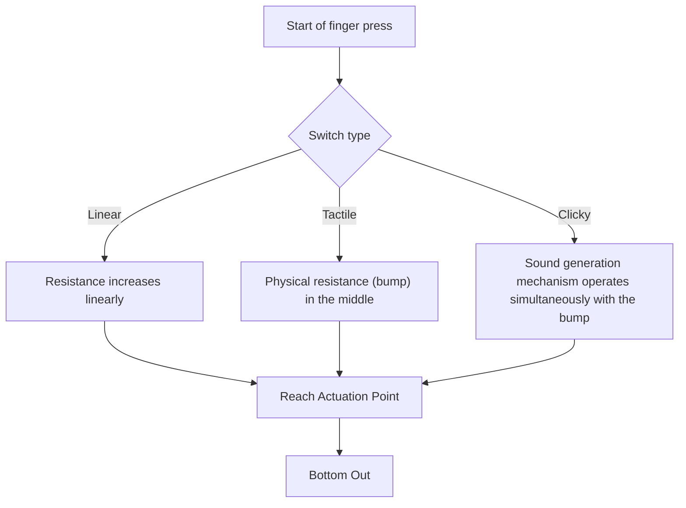
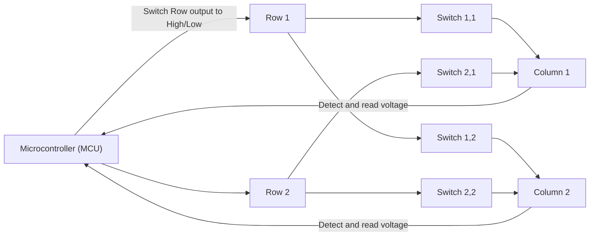
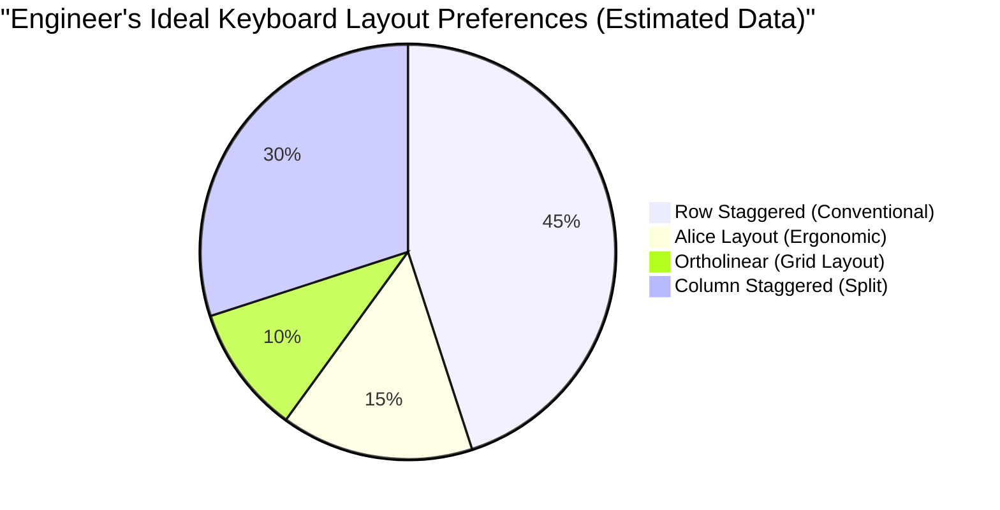

# For Long Coding Sessions! 5 Recommended Mechanical Keyboards for Engineers

For professionals working in the IT industry, such as programmers, system engineers, and data scientists, a keyboard is not merely an input device. It is an "interface for converting thoughts into code," and the most important work tool that they directly touch for hours every day.

Continuing to use a poor quality keyboard not only causes a decrease in typing speed, but also increases excessive strain on the wrists and finger joints, and consequently, the risk of tendonitis (such as carpal tunnel syndrome). Conversely, obtaining a highly customizable keyboard that fits well in your hand and has a good typing feel is the "best investment" that greatly improves both productivity and health.

In this article, aimed at engineers, we will go beyond mere "recommendations" and thoroughly explain everything from the physics of keyboards to internal electronic circuits, and the latest firmware technology. Based on that, we will introduce 5 ultimate keyboards that truly withstand practical use.

## 1. Physics and Mechanisms of Key Switches

The most important element that determines the typing feel of a keyboard is the "key switch". Mechanical keyboard switches consist of a spring and a contact mechanism, and their physical characteristics are transmitted to our fingertips as feedback.

### 1.1 Hooke's Law and Spring Constant

The actuation force of a mechanical switch is mainly determined by the characteristics of the spring installed inside. The behavior of this spring can be approximately represented by "Hooke's Law" in classical mechanics.

$$ F = -k x $$

Here, $F$ is the restoring force (the repulsive force felt by the finger), $k$ is the spring constant, and $x$ is the pushed distance (stroke).
In the case of linear switches (such as red or black switches), they follow this Hooke's Law almost faithfully, having a linear characteristic where the repulsive force increases proportionally the more you push down.

### 1.2 Integral Calculation of Actuation Energy

The point at which a key is recognized as "input" is called the Actuation Point. The energy (amount of work) $E$ spent by a finger from the start of pushing the key until reaching the actuation point $x_a$ is expressed by the integral of force over distance.

$$ E = \int_{0}^{x_a} F(x) \, dx $$

In the case of tactile switches (brown switches) or clicky switches (blue switches), there is physical resistance where the contacts rub against each other (tactile bump), so $F(x)$ is not a simple linear function, but a function that peaks non-linearly at a specific stroke position.

When an engineer codes for a long time, if this $E$ (actuation energy) is too large, the fingers get tired easily, and if it is too small, mistypes (accidental hits) increase. Generally, a switch with an actuation force of about 45g to 55g is considered to have a good balance of fatigue reduction and accuracy, and is preferred by many engineers.

### 1.3 State-of-the-Art Switch Technology: Electrostatic Capacitive Non-Contact and Hall Effect

There are also more advanced switch technologies that do not have physical metal contacts.

**Electrostatic Capacitive Non-Contact (Topre)**
Using a conical spring and a rubber dome, it determines input by detecting the change in electrostatic capacity caused by pushing down. Because there is no physical contact, wear is extremely low, and chattering (the phenomenon of multiple inputs being registered with a single press) does not occur. The unique "thock" typing feel provided by the rubber dome has a charm that you cannot leave once you experience it.

**Magnetic Switch (Hall Effect)**
Using the Hall effect, it reads the change in magnetic flux density as voltage when a magnet embedded in the stem (axis) approaches a Hall sensor on the circuit board.
The electromotive force $V_H$ due to the Hall effect is expressed by the following equation.

$$ V_H = R_H \left( \frac{I \cdot B}{t} \right) $$

Here, $R_H$ is the Hall coefficient, $I$ is the current, $B$ is the magnetic flux density, and $t$ is the thickness of the conductor. With this technology, the depth of the keystroke can be continuously obtained as an analog value, enabling incredible control such as "Actuation Point Adjustment" (changing the actuation point in units of 0.1mm) and "Rapid Trigger" (turning off the key the moment you start to release it).

## 2. Keyboard Electronic Circuits and Performance Metrics

Even if the switches are excellent, if the performance of the electronic circuits and microcontroller (MCU) that process them is low, the best performance cannot be demonstrated.

### 2.1 Matrix Scanning and Polling Rate

Inside a keyboard, there are anywhere from dozens to over 100 switches, but since the number of pins on a microcontroller is limited, it is impossible to connect every switch to an individual pin. Therefore, switches are wired in a grid (matrix) of Rows and Columns, and by scanning them at high speed, it determines which key was pressed.

**Polling Rate** is the frequency at which the keyboard reports its "current key status" to the PC. Standard keyboards are 125Hz (once every 8ms), but high-end models have ultra-high-speed communication such as 1000Hz (once every 1ms) or recently 8000Hz (once every 0.125ms).
For coding, 1000Hz is more than enough performance, but it leads to a sense of security that prevents missed keystrokes during ultra-high-speed typing.

### 2.2 N-Key Rollover (NKRO) and Anti-Ghosting

**N-Key Rollover (NKRO)** is a feature where, when multiple keys are pressed simultaneously, all of them are accurately recognized. In the past, due to USB connection restrictions, there were limits like "up to 6 keys," but modern high-end keyboards have achieved virtually unlimited simultaneous presses (Full NKRO) by cleverly utilizing USB HID reports.

For engineers who heavily use complex shortcuts in editors like Vim or Emacs (e.g., `Ctrl + Shift + Alt + any key`), a complete NKRO is a prerequisite.

### 2.3 Debounce Delay

Mechanical switches with metal contacts experience a "bounce phenomenon" where the contacts slightly bounce when pressed or released. The processing time for the microcontroller to ignore this is the **Debounce Delay**. Normally, an intentional delay of about 5ms to 20ms is provided, but in the aforementioned electrostatic capacitive non-contact systems and magnetic switches, since there is no physical contact noise, the debounce delay can be set to zero (or minimal), achieving overwhelming response.

## 3. Firmware and Customizability (QMK / VIA)

If the hardware is the "body", the firmware is the "brain" of the keyboard. Modern high-end keyboards for engineers have the ability not just to send keycodes, but to execute advanced programs.

### 3.1 QMK Firmware

**QMK (Quantum Mechanical Keyboard)** is an open-source keyboard firmware. Written in C, it literally allows you to do "anything," from changing keymaps to creating macros and controlling LED animations.

### 3.2 Advanced Key Assignment Features

Among the features provided by QMK, the following in particular explosively increase engineer productivity.

- **Layers:** Just like switching between "letters" and "numbers" on a smartphone keyboard, the entire layout of the keyboard is switched to a different one only while a specific key (such as the Fn key) is pressed. This makes it possible to input arrow keys, macros, and symbols without moving your hands from the home row.
- **Mod-Tap:** Assigns different roles to a single key for "when tapped briefly" and "when held down." For example, setting the space bar to "Space on tap, Shift on hold" (Space Cadet Shift) enables effective use of the thumbs.
- **Home Row Mods:** A technique of assigning modifiers (Ctrl, Shift, Alt, GUI) on hold to keys on the home row (ASDF, JKL;, etc.). This eliminates the need to overwork your pinky to reach the Ctrl key, dramatically reducing wrist fatigue for Vim and Emacs users.

### 3.3 Real-time Configuration with VIA / VIAL

The drawback of QMK was that "every time you change settings, you have to compile the source code and flash (write) the firmware." **VIA** and **VIAL** solved this. These allow you to access the keyboard from a GUI application (or a web browser) and rewrite the keymap in real-time without rebooting.

## 4. Ergonomics and the Science of Layouts

The typical "row-staggered (keys are staggered by row)" layout is a remnant to prevent the physical arms of typewriters from tangling, and is not based on the structure of the human hand.

There are layouts that are more ergonomically considerate, such as the following.

- **Ortholinear:** A layout where keys are arranged in a perfectly straight grid vertically and horizontally. The bending and stretching of fingers becomes linear, reducing wasted finger movement.
- **Columnar Stagger:** A layout where vertical columns are staggered according to the length of human fingers (middle finger is long, pinky is short). You can type with a natural hand shape.
- **Split:** Since the left and right hands can be placed completely apart, you can type in a natural posture with your chest open and shoulders relaxed, demonstrating immense effectiveness in preventing stiff shoulders and straight neck.

## 5. 5 Ultimate Mechanical Keyboards Recommended for Engineers

Based on physics, electronic circuits, firmware, and ergonomics, we have carefully selected 5 keyboards for true professionals that can withstand long hours of coding.

---

### 1. Keychron Q Series (Q1 Pro / Q8, etc.) - The Gateway to the World of Custom Keyboards

Keychron, originating from Hong Kong, is driving the recent custom keyboard boom. Among them, the "Q Series" features a heavy full aluminum body and a "Gasket Mount" structure that tunes the typing sound to the utmost limit.

- **Switches:** Mechanical (Hot-swappable. Switches can be freely exchanged)
- **Firmware:** Fully compatible with QMK/VIA
- **Features:** A toggle switch for both macOS and Windows compatibility. You can choose your preferred layout, such as the Q8 with an Alice layout or the Q1 with a 75% layout.
- **Benefits for Engineers:** Despite being a pre-built product, you can immediately experience superb typing feel and customizability comparable to a custom-built keyboard right out of the box. It is ideal for setting up a Vim-like arrow layer using VIA.

---

### 2. HHKB Studio - The All-in-One Pointing Device for Hackers

The "Happy Hacking Keyboard (HHKB)" is a legendary keyboard born for UNIX programmers. The latest "HHKB Studio" has evolved further by adopting specially developed silent mechanical switches instead of the conventional electrostatic capacitive non-contact method.

- **Switches:** Linear silent mechanical switches (manufactured by Kailh, hot-swappable)
- **Features:** A pointing stick (TrackPoint) in the center of the keyboard, 4 gesture pads.
- **Benefits for Engineers:** You can complete mouse cursor operations, scrolling, and window switching without ever taking your hands off the home row. Once you experience this "everything is completed at your fingertips" experience, you can never go back to reaching for a mouse with your right hand.

---

### 3. ZSA Moonlander / ErgoDox EZ - Ultimate Split Ergonomics

The pinnacle of split keyboards developed by Canada's ZSA. The left and right sides are independent and can be placed according to your shoulder width, surprisingly reducing the burden on your shoulders and neck even during long hours of typing.

- **Switches:** Mechanical (Cherry MX compatible, hot-swappable)
- **Firmware:** QMK based (using its own powerful GUI tool "Oryx")
- **Features:** Columnar staggered layout, dedicated thumb cluster keys, and legs for tenting (tilting) come standard.
- **Benefits for Engineers:** By assigning Enter, Space, Backspace, and Layer switching to your thumbs, the burden on the weakest pinky fingers is drastically reduced. It is a savior device for engineers suffering from carpal tunnel syndrome.

---

### 4. REALFORCE R3 - Domestic Reliability and Supreme Typing Feel (Electrostatic Capacitive Non-Contact)

A Japanese masterpiece boasted by Topre. The track record of being used for many years in professional fields such as financial institutions is not just for show. From the R3 generation, it also supports Bluetooth connection.

- **Switches:** Electrostatic Capacitive Non-Contact (Topre)
- **Features:** With the APC (Actuation Point Changer) function, the actuation point can be set per key from 0.8mm, 1.5mm, 2.2mm, and 3.0mm.
- **Benefits for Engineers:** The smooth key touch due to the absence of physical contacts is called "feather touch", and the repulsive stress on the fingers is kept to a minimum even during long coding sessions. It is possible to customize it so that only keys pressed by the pinky (like A or Enter) have a shallow actuation point (0.8mm), allowing them to react with just a light touch.

---

### 5. Wooting 60HE - Revolutionary Response Brought by Magnetic Switches

Originally developed for e-sports gamers, its innovative technology is also highly evaluated by engineers seeking the fastest typing and response.

- **Switches:** Lekker Switch (Hall effect magnetic switch)
- **Features:** Rapid trigger function, actuation point adjustable in 0.1mm increments from 0.1mm to 4.0mm.
- **Benefits for Engineers:** Utilizing analog input, eccentric settings (Dynamic Keystroke) like "lowercase if pushed slightly, uppercase if pushed deeply (in combination with Shift)" are possible. In addition, since the key turns off the moment the finger is lifted even slightly, it prevents unintended continuous key inputs during high-speed typing, providing an unparalleled accurate input experience.

## Conclusion

Choosing a keyboard is a process of "optimizing your own interface" throughout your career as an engineer. From the feel of physical springs that obey Hooke's Law, to actuation energy calculated by integration, macro building by QMK, and ultimate ergonomics, the depth to be pursued is bottomless.

The 5 keyboards introduced this time (Keychron, HHKB Studio, Moonlander, REALFORCE, Wooting) are all masterpieces aiming for the "best input experience" with different approaches. By all means, please find your best partner according to your typing style and the physical troubles you have.

An investment in a keyboard will surely bring returns to you as "millions of lines of bug-free code".
