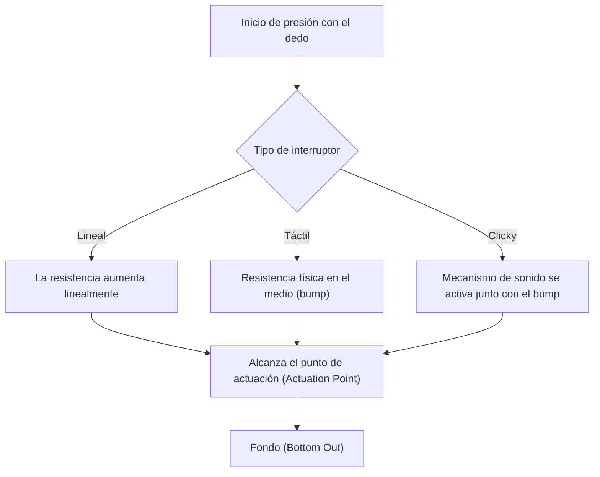
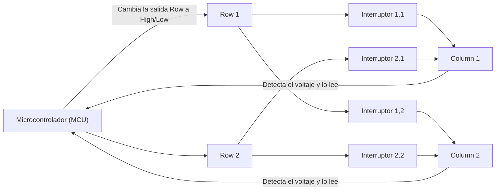
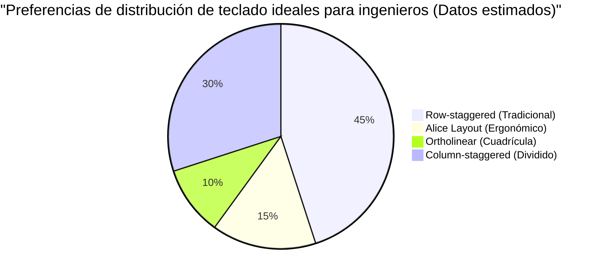

# ¡Para largas sesiones de codificación! 5 teclados mecánicos recomendados para ingenieros

Para los profesionales que trabajan en la industria de TI, como programadores, ingenieros de sistemas o científicos de datos, el teclado no es solo un dispositivo de entrada. Es "una interfaz para convertir pensamientos en código" y la herramienta de trabajo más importante que tocan directamente durante muchas horas todos los días.

Continuar usando un teclado de mala calidad no solo reduce la velocidad de escritura, sino que también aumenta excesivamente la carga en las articulaciones de la muñeca y los dedos, lo que a su vez incrementa el riesgo de tendinitis (como el síndrome del túnel carpiano). Por el contrario, adquirir un teclado que se adapte a tus manos, tenga una buena sensación al teclear y sea altamente personalizable, es la "mejor inversión" que mejorará enormemente tanto tu productividad como tu salud.

En este artículo, dirigido a los ingenieros, iremos más allá de simples "recomendaciones" y explicaremos exhaustivamente desde la física del teclado hasta los circuitos electrónicos internos y las últimas tecnologías de firmware. A partir de ahí, presentaremos 5 teclados definitivos que verdaderamente soportan el uso práctico.

## 1. La física y el mecanismo de los interruptores de teclas

El factor más importante que determina la sensación de escritura de un teclado es el "interruptor de tecla" (Key Switch). Los interruptores de los teclados mecánicos están compuestos por un resorte y un mecanismo de contacto, y sus características físicas se transmiten como retroalimentación a las yemas de nuestros dedos.

### 1.1 Ley de Hooke y constante del resorte

La fuerza de actuación (Actuation Force) de un interruptor mecánico está determinada principalmente por las características del resorte incorporado en su interior. El comportamiento de este resorte se puede aproximar por la "Ley de Hooke" de la mecánica clásica.

$$ F = -k x $$

Donde $F$ es la fuerza de restauración (la fuerza de repulsión que siente el dedo), $k$ es la constante elástica del resorte y $x$ es la distancia presionada (recorrido).
En el caso de los interruptores lineales (como el Red o Black), siguen casi fielmente esta ley de Hooke, teniendo una característica lineal donde la fuerza de repulsión aumenta proporcionalmente a medida que se presiona.

### 1.2 Cálculo integral de la energía de actuación

El punto donde se reconoce que la tecla ha sido "ingresada" se llama punto de actuación (Actuation Point). La energía (trabajo) $E$ que el dedo gasta desde que comienza a presionar la tecla hasta alcanzar el punto de actuación $x_a$ se expresa como la integral de la fuerza con respecto a la distancia.

$$ E = \int_{0}^{x_a} F(x) \, dx $$

En el caso de los interruptores táctiles (Brown) o clicleantes (Blue), debido a que existe una resistencia física por el roce de los contactos (tactile bump), $F(x)$ no es una simple función lineal, sino que se convierte en una función que alcanza un pico no lineal en una posición específica del recorrido.

Cuando un ingeniero pasa muchas horas codificando, si esta $E$ (energía de actuación) es demasiado grande, los dedos se cansarán fácilmente; si es demasiado pequeña, aumentarán los errores de escritura (typos accidentales). En general, se considera que los interruptores con una fuerza de actuación de alrededor de 45g a 55g equilibran la reducción de la fatiga con la precisión, y son preferidos por muchos ingenieros.

### 1.3 Tecnologías de interruptores de vanguardia: Capacitivo sin contacto y Efecto Hall

También existen tecnologías de interruptores más avanzadas que no tienen contactos metálicos físicos.

**Capacitivo sin contacto (Topre)**
Utiliza un resorte cónico y una cúpula de goma (rubber dome), y determina la entrada detectando el cambio en la capacitancia al ser presionado. Dado que no hay contacto físico, el desgaste es extremadamente bajo y no se produce "chattering" (fenómeno donde una sola presión resulta en múltiples entradas). El sonido y la sensación táctil única producida por la cúpula de goma tiene un encanto del que es difícil separarse una vez que se prueba.

**Interruptor magnético (Hall Effect)**
Aprovechando el efecto Hall, un imán incrustado en el vástago (stem) se acerca a un sensor Hall en la placa base, y el cambio en la densidad del flujo magnético se lee como voltaje.
La fuerza electromotriz $V_H$ por el efecto Hall se expresa mediante la siguiente fórmula.

$$ V_H = R_H \left( \frac{I \cdot B}{t} \right) $$

Donde $R_H$ es el coeficiente de Hall, $I$ es la corriente, $B$ es la densidad de flujo magnético y $t$ es el grosor del conductor. Con esta tecnología, la profundidad de la pulsación de la tecla se puede adquirir continuamente como un valor analógico, lo que permite un control asombroso como "cambiar el punto de actuación en unidades de 0.1 mm" (Actuation Point Adjustment) o "apagar en el instante en que comienza a soltar la tecla" (Rapid Trigger).

## 2. Circuitos electrónicos del teclado y métricas de rendimiento

Incluso si los interruptores son excelentes, si el circuito electrónico y el microcontrolador (Microcontroller) que los procesan tienen un rendimiento bajo, no se puede lograr el mejor rendimiento.

### 2.1 Escaneo de matriz y Polling Rate

Dentro de un teclado, existen desde decenas hasta más de 100 interruptores, pero el número de pines del microcontrolador es limitado, por lo que es imposible conectar todos los interruptores a pines individuales. Por lo tanto, los interruptores se cablean en una cuadrícula (matriz) de filas (Row) y columnas (Column), y al escanear a alta velocidad, se determina qué tecla se ha presionado.

**Polling Rate (Tasa de sondeo)** es la frecuencia con la que el teclado informa a la PC "el estado actual de las teclas". Un teclado estándar es de 125Hz (una vez cada 8ms), pero los modelos de alta gama realizan comunicaciones ultrarrápidas de 1000Hz (una vez cada 1ms), y recientemente hay modelos que llegan a 8000Hz (una vez cada 0.125ms).
Para la codificación, 1000Hz es un rendimiento más que suficiente, pero brinda la tranquilidad de evitar pérdidas al escribir a velocidades ultrarrápidas.

### 2.2 N-Key Rollover (NKRO) y Anti-Ghosting

**N-Key Rollover (NKRO)** es la capacidad de reconocer con precisión todas las teclas cuando se presionan múltiples teclas al mismo tiempo. En el pasado, debido a las restricciones de las conexiones USB, había límites como "hasta 6 teclas", pero los teclados de alta gama actuales logran una presión simultánea virtualmente ilimitada (Full NKRO) al optimizar los reportes HID de USB.

Para los ingenieros que usan muchos atajos de teclado complejos en editores como Vim o Emacs (ej. `Ctrl + Shift + Alt + cualquier tecla`), el NKRO completo es un requisito indispensable.

### 2.3 Retardo de Debounce (Debounce Delay)

En los interruptores mecánicos con contactos metálicos, ocurre un "fenómeno de rebote" (bounce) en el cual el contacto rebota microscópicamente cuando se presiona o se suelta. El tiempo de procesamiento para que el microcontrolador ignore esto es el **retardo de debounce**. Normalmente, se establece un retraso intencional de aproximadamente 5ms a 20ms. Sin embargo, en el sistema capacitivo sin contacto y los interruptores magnéticos mencionados anteriormente, dado que no existe ruido de contacto físico, el retardo de debounce se puede ajustar a cero (o un valor mínimo), logrando una respuesta abrumadora.

## 3. Firmware y personalización (QMK / VIA)

Si el hardware es el "cuerpo", el firmware es el "cerebro" del teclado. Los teclados modernos de alta gama para ingenieros no solo envían códigos de teclas, sino que tienen la capacidad de ejecutar programas avanzados.

### 3.1 QMK Firmware

**QMK (Quantum Mechanical Keyboard)** es un firmware de teclado de código abierto. Está escrito en C y literalmente "todo" es posible, desde cambiar la asignación de teclas hasta crear macros y controlar animaciones LED.

### 3.2 Funciones avanzadas de asignación de teclas

Entre las características que ofrece QMK, las siguientes funciones aumentan explosivamente la productividad de los ingenieros:

- **Función de capas (Layers):** Al igual que al cambiar entre "letras" y "números" en el teclado de un teléfono inteligente, todo el diseño del teclado cambia a otro diferente solo mientras mantienes presionada una tecla específica (como la tecla Fn). Permite introducir flechas, macros y símbolos sin alejar las manos de la posición base.
- **Mod-Tap:** Asigna diferentes roles a una sola tecla dependiendo de si se hace un "toque corto" o una "pulsación prolongada". Por ejemplo, al configurar la tecla de espacio como "Espacio al tocar, Shift al mantener presionado" (Space Cadet Shift), es posible un uso efectivo de los pulgares.
- **Home Row Mods:** Un método para asignar modificadores al mantener presionado (Ctrl, Shift, Alt, GUI) a las teclas de la posición base (ASDF, JKL;, etc.). Elimina la necesidad de sobrecargar el dedo meñique al estirarlo para presionar la tecla Ctrl, reduciendo drásticamente la fatiga de la muñeca para los usuarios de Vim y Emacs.

### 3.3 Configuración en tiempo real con VIA / VIAL

La desventaja de QMK era que "se necesitaba compilar el código fuente y flashear (escribir) el firmware cada vez que se cambiaba la configuración". Quienes resolvieron esto fueron **VIA** y **VIAL**. Estos permiten acceder al teclado desde una aplicación GUI (o en el navegador web) y reescribir el mapa de teclas en tiempo real sin reiniciar.

## 4. Ergonomía y la ciencia de la distribución del teclado

El diseño general de las teclas "Row-staggered" (con filas escalonadas) es un remanente para evitar que los brazos mecánicos de las máquinas de escribir se enredaran, y no se basa en la estructura de la mano humana.

Existen distribuciones más ergonómicas como las siguientes:

- **Ortholinear (Cuadrícula):** Una distribución donde las teclas están alineadas en una cuadrícula perfecta, horizontal y verticalmente. Flexionar y extender los dedos se vuelve un movimiento en línea recta, reduciendo los movimientos innecesarios.
- **Column-staggered (Escalonado por columnas):** Una distribución en la que las columnas verticales están desplazadas para ajustarse a la longitud de los dedos humanos (dedo medio más largo, meñique más corto). Te permite escribir en una postura natural de la mano.
- **Dividido (Split):** Las manos izquierda y derecha se pueden colocar completamente separadas, permitiéndote escribir en una postura natural con los hombros abiertos y el pecho expandido. Es muy efectivo para prevenir la rigidez en los hombros y la pérdida de la curvatura del cuello.

## 5. 5 Teclados mecánicos definitivos recomendados para ingenieros

Teniendo en cuenta la física, los circuitos electrónicos, el firmware y la ergonomía, hemos seleccionado cuidadosamente 5 teclados para profesionales que pueden soportar largas horas de codificación.

---

### 1. Serie Keychron Q (Q1 Pro / Q8, etc.) - La puerta de entrada al mundo de los teclados personalizados

Keychron, originaria de Hong Kong, es líder en el reciente boom de teclados personalizados. Entre ellos, la "Serie Q" adopta un cuerpo pesado completamente de aluminio y una estructura "Gasket Mount" que ajusta el sonido de escritura al límite.

- **Interruptores:** Mecánicos (Hot-swappable. Los interruptores se pueden cambiar libremente)
- **Firmware:** Totalmente compatible con QMK/VIA
- **Características:** Interruptor para cambiar entre macOS/Windows. Puedes elegir la distribución que prefieras, como el Alice layout Q8 o la distribución 75% Q1.
- **Ventajas para el ingeniero:** A pesar de ser un producto comercial, puedes experimentar directamente desde la caja una sensación de escritura suprema y una personalización comparable a un teclado de fabricación casera. Es ideal para configurar una capa de flechas estilo Vim utilizando VIA.

---

### 2. HHKB Studio - El dispositivo señalador todo en uno para hackers

"Happy Hacking Keyboard (HHKB)" es un teclado legendario nacido para los programadores de UNIX. El último "HHKB Studio" ha evolucionado aún más al adoptar interruptores mecánicos silenciosos desarrollados exclusivamente, en lugar de la tradicional capacitancia sin contacto.

- **Interruptores:** Interruptores mecánicos silenciosos y lineales (Fabricados por Kailh, hot-swappable)
- **Características:** Pointing stick (trackpoint) en el centro del teclado, 4 almohadillas de gestos (gesture pads).
- **Ventajas para el ingeniero:** Las operaciones del cursor del ratón, el desplazamiento y el cambio de ventanas se completan sin levantar las manos de la posición base en ningún momento. Una vez que experimentes esta sensación de "todo se completa en la punta de tus dedos", nunca querrás volver a estirar la mano derecha hacia el ratón.

---

### 3. ZSA Moonlander / ErgoDox EZ - Ergonomía dividida definitiva

La cumbre de los teclados divididos desarrollados por la compañía canadiense ZSA. Como la izquierda y la derecha son independientes y se pueden colocar según el ancho de los hombros, la tensión en los hombros y el cuello se reduce sorprendentemente, incluso durante largas horas de mecanografía.

- **Interruptores:** Mecánicos (Compatibles con Cherry MX, hot-swappable)
- **Firmware:** Basado en QMK (Utiliza su propia y potente herramienta GUI "Oryx")
- **Características:** Distribución Column-staggered, grupo de teclas exclusivo para el pulgar, patas estándar para ajustar la inclinación (tenting).
- **Ventajas para el ingeniero:** Al asignar Enter, Espacio, Retroceso y Cambio de Capa a los pulgares, se reduce drásticamente la carga sobre el dedo meñique, que es el más débil. Es un dispositivo que se convierte en el salvador para los ingenieros que sufren de síndrome del túnel carpiano.

---

### 4. REALFORCE R3 - Confiabilidad nacional y la sensación suprema de teclear (Capacitivo sin contacto)

Una obra maestra japonesa de la que Topre está orgulloso. Su historial de haber sido utilizado durante muchos años en campos profesionales como instituciones financieras no es por nada. A partir de la generación R3, también es compatible con conectividad Bluetooth.

- **Interruptores:** Capacitivo sin contacto (Topre)
- **Características:** Con la función APC (Actuation Point Changer), el punto de actuación se puede configurar tecla por tecla entre 0.8mm, 1.5mm, 2.2mm y 3.0mm.
- **Ventajas para el ingeniero:** El toque suave de las teclas debido a la ausencia de contactos físicos se denomina "toque de pluma" (feather touch), y el estrés por repulsión en los dedos se mantiene al mínimo incluso durante largas sesiones de codificación. Es posible una personalización para que solo las teclas presionadas con el dedo meñique (como la 'A' o el Enter) tengan un punto de actuación superficial (0.8mm), respondiendo con solo tocarlas ligeramente.

---

### 5. Wooting 60HE - Respuesta revolucionaria gracias a los interruptores magnéticos

Originalmente desarrollado para jugadores de e-sports, pero su tecnología innovadora también es muy valorada entre los ingenieros que buscan la escritura y la respuesta más rápidas.

- **Interruptores:** Lekker Switch (Interruptores magnéticos de efecto Hall)
- **Características:** Función Rapid Trigger, punto de actuación ajustable en incrementos de 0.1mm desde 0.1mm hasta 4.0mm.
- **Ventajas para el ingeniero:** Aprovechando la entrada analógica, es posible una configuración extrema (Dynamic Keystroke) como "minúscula si se presiona un poco, mayúscula si se presiona más profundo (combinación con Shift)". Además, como la tecla se apaga en el momento en que se levanta ligeramente el dedo, evita la entrada continua involuntaria durante la escritura a alta velocidad, proporcionando una experiencia de entrada precisa sin igual.

## Conclusión

Elegir un teclado es un proceso de "optimización de tu propia interfaz" a lo largo de tu carrera como ingeniero. Desde la sensación física de los resortes que obedecen la Ley de Hooke, pasando por la energía de actuación calculada por integración, la construcción de macros con QMK, hasta la ergonomía definitiva, la profundidad a explorar no tiene fin.

Los cinco teclados presentados en esta ocasión (Keychron, HHKB Studio, Moonlander, REALFORCE, Wooting) son todos obras maestras que apuntan a "la mejor experiencia de entrada" desde diferentes enfoques. Por favor, encuentra a tu mejor compañero de acuerdo con tu propio estilo de escritura y los problemas físicos que enfrentes.

La inversión en un teclado sin duda te traerá recompensas en forma de "millones de líneas de código sin errores".
