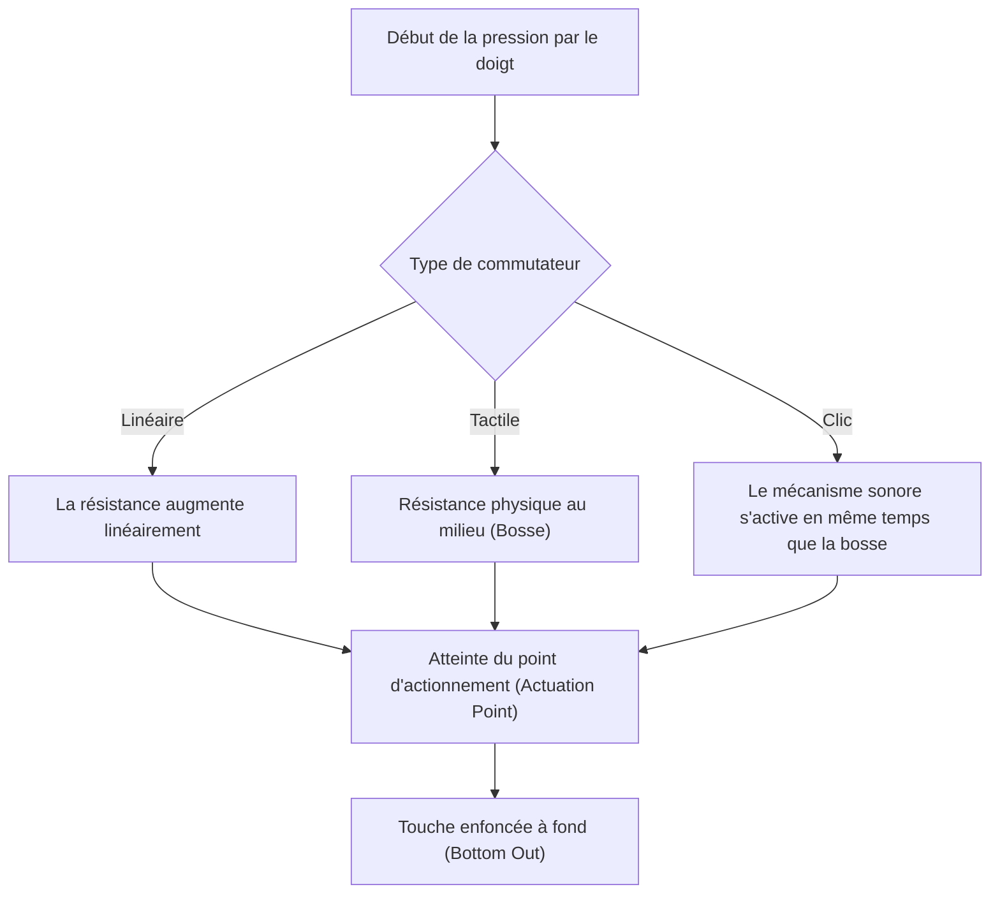
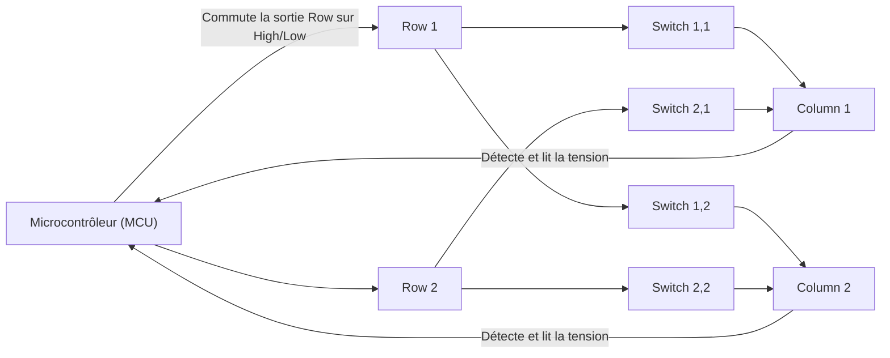
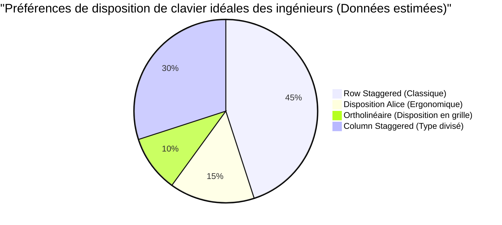

# Pour les longues sessions de codage ! 5 claviers mécaniques recommandés pour les ingénieurs

Pour les professionnels travaillant dans l'industrie informatique, tels que les programmeurs, les ingénieurs système et les data scientists, le clavier n'est pas un simple périphérique de saisie. C'est "l'interface pour traduire les pensées sous forme de code" et c'est l'outil de travail le plus important avec lequel vous êtes en contact direct pendant des heures chaque jour.

Continuer à utiliser un clavier de mauvaise qualité entraîne non seulement une diminution de la vitesse de frappe, mais augmente également le risque de charge excessive sur les poignets et les articulations des doigts, conduisant potentiellement à des tendinites (comme le syndrome du canal carpien). À l'inverse, l'acquisition d'un clavier qui s'adapte bien à vos mains, offre une bonne sensation de frappe et est hautement personnalisable constitue le "meilleur investissement" qui améliorera considérablement à la fois votre productivité et votre santé.

Dans cet article, à l'attention des ingénieurs, nous allons au-delà des simples "recommandations" pour expliquer en profondeur depuis la physique des claviers jusqu'aux circuits électroniques internes et aux dernières technologies de micrologiciels (firmwares). Sur cette base, nous vous présenterons les 5 claviers ultimes capables de résister à une véritable utilisation pratique.

## 1. La physique et le mécanisme des commutateurs de touches

L'élément le plus important qui détermine la sensation de frappe d'un clavier est le "commutateur de touche" (switch). Les commutateurs des claviers mécaniques sont constitués d'un ressort (spring) et d'un mécanisme de contact, et leurs caractéristiques physiques sont transmises comme retour tactile à nos doigts.

### 1.1 La loi de Hooke et la constante de raideur

La force d'actionnement (Actuation Force) d'un commutateur mécanique est principalement déterminée par les caractéristiques du ressort intégré à l'intérieur. Le comportement de ce ressort peut être approximativement décrit par la "loi de Hooke" en mécanique classique.

$$ F = -k x $$

Ici, $F$ est la force de rappel (la force de répulsion ressentie par le doigt), $k$ est la constante de raideur du ressort, et $x$ est la distance d'enfoncement (course).
Dans le cas des commutateurs linéaires (comme les switchs rouges ou noirs), ils suivent assez fidèlement cette loi de Hooke, présentant une caractéristique linéaire où la force de répulsion augmente proportionnellement à l'enfoncement.

### 1.2 Calcul intégral de l'énergie d'actionnement

Le point où la touche est reconnue comme "saisie" est appelé le point d'actionnement (Actuation Point). L'énergie (travail) $E$ dépensée par le doigt depuis le début de la pression sur la touche jusqu'à atteindre le point d'actionnement $x_a$ est exprimée par l'intégrale de la force par rapport à la distance.

$$ E = \int_{0}^{x_a} F(x) \, dx $$

Pour les commutateurs tactiles (switchs marrons) ou les commutateurs à clic (switchs bleus), en raison de la résistance physique (bosse tactile) due au frottement des contacts, $F(x)$ n'est pas une simple fonction linéaire, mais une fonction qui atteint un pic non linéaire à une position de course spécifique.

Lorsqu'un ingénieur code pendant de longues heures, si cette énergie $E$ (énergie d'actionnement) est trop importante, les doigts se fatiguent facilement, et si elle est trop faible, les fautes de frappe augmentent. En général, les commutateurs avec une force d'actionnement d'environ 45g à 55g sont considérés comme offrant un bon équilibre entre la réduction de la fatigue et la précision, et sont préférés par de nombreux ingénieurs.

### 1.3 Technologie de pointe des commutateurs : Capacitif sans contact et effet Hall

Il existe également des technologies de commutateurs plus avancées qui ne possèdent pas de contacts métalliques physiques.

**Capacitif sans contact (Topre)**
Cette méthode utilise un ressort conique et un dôme en caoutchouc pour déterminer la saisie en détectant le changement de capacité électrique dû à l'enfoncement. Comme il n'y a pas de contact physique, l'usure est extrêmement faible et le "chattering" (phénomène où une seule pression entraîne plusieurs saisies) ne se produit pas. La sensation de frappe unique en "thock" produite par le dôme en caoutchouc possède un charme dont il est difficile de se passer une fois essayé.

**Commutateurs magnétiques (Effet Hall)**
En utilisant l'effet Hall, les changements de densité de flux magnétique lorsqu'un aimant intégré dans la tige (stem) s'approche d'un capteur à effet Hall sur le circuit imprimé sont lus comme une tension.
La force électromotrice $V_H$ due à l'effet Hall est exprimée par la formule suivante :

$$ V_H = R_H \left( \frac{I \cdot B}{t} \right) $$

Ici, $R_H$ est le coefficient de Hall, $I$ est le courant, $B$ est la densité de flux magnétique, et $t$ est l'épaisseur du conducteur. Grâce à cette technologie, la profondeur de la frappe peut être acquise en continu en tant que valeur analogique, permettant un contrôle phénoménal tel que "l'ajustement du point d'actionnement par incréments de 0,1 mm (Actuation Point Adjustment)" et la "désactivation instantanée dès que la touche commence à remonter (Rapid Trigger)".

## 2. Circuits électroniques du clavier et indicateurs de performance

Même si les commutateurs sont excellents, si les performances des circuits électroniques ou du microcontrôleur (MCU) qui les gèrent sont faibles, le clavier ne pourra pas fournir ses meilleures performances.

### 2.1 Balayage matriciel et taux de rafraîchissement (Polling Rate)

À l'intérieur d'un clavier, il y a des dizaines voire plus de 100 commutateurs, mais comme le nombre de broches du microcontrôleur est limité, il est impossible de connecter chaque commutateur à une broche individuelle. C'est pourquoi les commutateurs sont câblés sous forme de grille (matrice) en lignes (Row) et en colonnes (Column), et un balayage rapide permet de déterminer quelle touche a été pressée.

Le **taux de rafraîchissement (Polling Rate)** est la fréquence à laquelle le clavier signale à l'ordinateur "l'état actuel des touches". Un clavier standard est à 125Hz (1 fois toutes les 8ms), mais les modèles haut de gamme offrent des communications ultra-rapides à 1000Hz (1 fois par 1ms) ou, plus récemment, à 8000Hz (1 fois toutes les 0,125ms).
Pour le codage, des performances de 1000Hz sont plus que suffisantes, mais cela procure une tranquillité d'esprit en évitant toute frappe manquée lors de saisies ultra-rapides.

### 2.2 N-Key Rollover (NKRO) et Anti-Ghosting

Le **N-Key Rollover (NKRO)** est une fonctionnalité garantissant que lorsque plusieurs touches sont pressées simultanément, toutes sont reconnues avec précision. Dans le passé, en raison des limites de la connexion USB, il y avait des restrictions telles que "jusqu'à 6 touches", mais les claviers haut de gamme actuels permettent une pression simultanée pratiquement illimitée (Full NKRO) en manipulant astucieusement les rapports HID USB.

Pour les ingénieurs qui utilisent beaucoup de raccourcis complexes (ex: `Ctrl + Shift + Alt + une touche quelconque`) dans des éditeurs comme Vim ou Emacs, un NKRO complet est une condition indispensable.

### 2.3 Délai anti-rebond (Debounce Delay)

Les commutateurs mécaniques avec des contacts métalliques subissent un "phénomène de rebond" (bounce) où les contacts rebondissent de manière microscopique lorsqu'ils sont pressés ou relâchés. Le temps de traitement pour que le microcontrôleur ignore cela est le **délai anti-rebond**. Habituellement, un délai d'environ 5ms à 20ms est intentionnellement prévu, mais avec la méthode capacitive sans contact ou les commutateurs magnétiques mentionnés précédemment, comme il n'y a pas de bruit de contact physique, le délai anti-rebond peut être réglé sur zéro (ou très faible), offrant ainsi une réponse fulgurante.

## 3. Micrologiciel et personnalisation (QMK / VIA)

Si le matériel est le "corps", le micrologiciel (firmware) est le "cerveau" du clavier. Les claviers haut de gamme modernes destinés aux ingénieurs ne se contentent pas d'envoyer des codes de touches, ils ont la capacité d'exécuter des programmes complexes.

### 3.1 QMK Firmware

**QMK (Quantum Mechanical Keyboard)** est un micrologiciel open-source pour claviers. Écrit en langage C, il permet littéralement "tout", de la modification de la disposition des touches (keymap) à la création de macros, en passant par le contrôle des animations LED.

### 3.2 Fonctions d'affectation de touches avancées

Parmi les fonctionnalités offertes par QMK, les suivantes augmentent de manière explosive la productivité des ingénieurs :

- **Fonction de couches (Layers) :** Tout comme le passage de "lettres" à "chiffres" sur le clavier d'un smartphone, elle permet de basculer la disposition entière du clavier vers une autre disposition uniquement pendant qu'une touche spécifique (comme la touche Fn) est enfoncée. Cela permet de saisir des touches fléchées, des macros et des symboles sans bouger les mains de la position de repos (home position).
- **Mod-Tap :** Donne deux rôles distincts à une seule touche : un pour "lorsqu'elle est tapée brièvement" et un autre pour "lorsqu'elle est maintenue enfoncée". Par exemple, en réglant la barre d'espace sur "Espace lors de la frappe, Shift lors du maintien" (Space Cadet Shift), l'utilisation efficace des pouces devient possible.
- **Home Row Mods :** Une méthode qui attribue des modificateurs de maintien (Ctrl, Shift, Alt, GUI) aux touches de la rangée de repos (ASDF, JKL;, etc.). Cela élimine le besoin de surutiliser l'auriculaire pour s'étirer et appuyer sur la touche Ctrl, réduisant considérablement la fatigue du poignet pour les utilisateurs de Vim ou Emacs.

### 3.3 Configuration en temps réel avec VIA / VIAL

L'inconvénient de QMK était qu'il fallait "compiler le code source et flasher (écrire) le micrologiciel à chaque changement de configuration". **VIA** et **VIAL** ont résolu ce problème. Ceux-ci permettent d'accéder au clavier via une application GUI (ou dans un navigateur web) et de réécrire la disposition des touches en temps réel sans redémarrage.

## 4. Ergonomie et science des dispositions

La disposition classique en "quinconce par rangée" (Row Staggered) est un vestige conçu pour éviter que les bras physiques des machines à écrire ne s'emmêlent, et n'est pas basée sur la structure de la main humaine.

Voici quelques dispositions plus soucieuses de l'ergonomie :

- **Ortholinéaire (Ortholinear) :** Une disposition où les touches sont parfaitement alignées en grille, verticalement et horizontalement. La flexion et l'extension des doigts deviennent linéaires, réduisant les mouvements inutiles des doigts.
- **Column Staggered (Décalage en colonne) :** Une disposition où les colonnes verticales sont décalées pour s'adapter à la longueur des doigts humains (le majeur est long, l'auriculaire est court). Elle permet de taper avec une forme de main naturelle.
- **Type divisé (Split) :** Étant donné que les mains gauche et droite peuvent être placées de manière complètement indépendante, cela permet de taper dans une posture naturelle avec les épaules ouvertes et la poitrine relevée, offrant un effet immense sur la prévention de la raideur des épaules et de la perte de lordose cervicale (straight neck).

## 5. Les 5 claviers mécaniques ultimes recommandés pour les ingénieurs

Sur la base de la physique, des circuits électroniques, du micrologiciel et de l'ergonomie, nous avons soigneusement sélectionné 5 claviers destinés aux véritables professionnels, capables de résister à de longues sessions de codage.

---

### 1. Série Keychron Q (Q1 Pro / Q8, etc.) - La porte d'entrée dans le monde des claviers personnalisés

Originaire de Hong Kong, Keychron est le moteur du boom récent des claviers personnalisés. En particulier, la "série Q" adopte un corps lourd entièrement en aluminium et une structure "Gasket Mount" qui ajuste le son de frappe à la limite.

- **Commutateurs :** Mécaniques (Compatibles Hot-Swap. Les commutateurs peuvent être changés librement)
- **Micrologiciel :** Entièrement compatible QMK/VIA
- **Caractéristiques :** Commutateur pour basculer entre macOS/Windows. Vous pouvez choisir votre disposition préférée, comme la disposition Alice Q8 ou la disposition 75% Q1.
- **Avantages pour les ingénieurs :** Bien qu'il s'agisse d'un produit prêt à l'emploi, vous pouvez immédiatement profiter d'une sensation de frappe exceptionnelle et d'une personnalisation rivalisant avec les claviers faits maison dès la sortie de la boîte. Idéal pour configurer une couche de touches fléchées de type Vim à l'aide de VIA.

---

### 2. HHKB Studio - Le périphérique de pointage tout-en-un pour les hackers

Le "Happy Hacking Keyboard (HHKB)" est un clavier légendaire né pour les programmeurs UNIX. Le dernier "HHKB Studio" a encore évolué en adoptant des commutateurs mécaniques silencieux développés exclusivement, plutôt que la méthode capacitive sans contact conventionnelle.

- **Commutateurs :** Commutateurs mécaniques linéaires/silencieux (Fabriqués par Kailh, compatibles Hot-Swap)
- **Caractéristiques :** Bâton de pointage (trackpoint) au centre du clavier, 4 pads tactiles pour les gestes.
- **Avantages pour les ingénieurs :** Le contrôle du curseur de la souris, le défilement et le changement de fenêtres peuvent être accomplis sans jamais retirer les mains de la position de repos. Une fois que vous avez goûté à cette "expérience où tout est accompli du bout des doigts", vous ne pourrez plus jamais revenir à la tâche de tendre la main droite vers une souris.

---

### 3. ZSA Moonlander / ErgoDox EZ - L'ergonomie divisée ultime

Le summum des claviers divisés développés par ZSA au Canada. Étant donné que les côtés gauche et droit sont indépendants et peuvent être placés selon la largeur des épaules, la tension sur les épaules et le cou est étonnamment réduite même lors de frappes prolongées.

- **Commutateurs :** Mécaniques (Compatibles Cherry MX, compatibles Hot-Swap)
- **Micrologiciel :** Basé sur QMK (Utilise leur propre outil GUI puissant "Oryx")
- **Caractéristiques :** Disposition Column Staggered, groupe de touches dédié aux pouces, pieds fournis en standard pour ajouter une inclinaison (tente).
- **Avantages pour les ingénieurs :** En attribuant Enter, Space, Backspace et les changements de couche aux pouces, la charge sur l'auriculaire, qui a le moins de force, est considérablement réduite. C'est un appareil qui deviendra le sauveur des ingénieurs souffrant du syndrome du canal carpien.

---

### 4. REALFORCE R3 - Fiabilité japonaise et sensation de frappe suprême (Capacitif sans contact)

Le chef-d'œuvre japonais dont Topre est fier. Son palmarès d'utilisation pendant de nombreuses années dans des environnements professionnels tels que les institutions financières n'est pas un hasard. À partir de la génération R3, il prend également en charge la connexion Bluetooth.

- **Commutateurs :** Méthode capacitive sans contact (Topre)
- **Caractéristiques :** Avec la fonction APC (Actuation Point Changer), le point d'actionnement peut être réglé pour chaque touche à 0,8 mm, 1,5 mm, 2,2 mm, ou 3,0 mm.
- **Avantages pour les ingénieurs :** Le toucher de touche doux, sans contact physique, est appelé "toucher plume", minimisant le stress de répulsion sur les doigts même pendant de longues sessions de codage. Il est possible de personnaliser les touches pressées par l'auriculaire (comme A et Enter) pour avoir un point d'actionnement très superficiel (0,8 mm) afin qu'elles réagissent à un simple contact léger.

---

### 5. Wooting 60HE - La réponse révolutionnaire apportée par les commutateurs magnétiques

Initialement développé pour les joueurs d'e-sport, sa technologie innovante est également très appréciée des ingénieurs qui exigent la frappe et la réponse les plus rapides.

- **Commutateurs :** Lekker Switch (Commutateurs magnétiques à effet Hall)
- **Caractéristiques :** Fonction Rapid Trigger, point d'actionnement réglable par incréments de 0,1 mm de 0,1 mm à 4,0 mm.
- **Avantages pour les ingénieurs :** Tirant parti de l'entrée analogique, il permet des configurations folles (Dynamic Keystroke) telles que "lettre minuscule si pressée légèrement, majuscule si pressée profondément (en combinaison avec Shift)". De plus, étant donné que la touche s'éteint au moment même où le doigt est légèrement levé, cela empêche l'entrée continue involontaire de touches lors de la frappe à grande vitesse, offrant une expérience de saisie précise inégalée.

## En conclusion

Le choix d'un clavier est un processus "d'optimisation de sa propre interface" tout au long de la carrière d'un ingénieur. De la sensation physique du ressort obéissant à la loi de Hooke, à l'énergie d'actionnement calculée par intégrale, la construction de macros par QMK, et l'ergonomie ultime, la profondeur à explorer est sans fin.

Les 5 claviers présentés cette fois (Keychron, HHKB Studio, Moonlander, REALFORCE, Wooting) sont tous des chefs-d'œuvre visant la "meilleure expérience de saisie" avec des approches différentes. Trouvez votre meilleur partenaire en fonction de votre propre style de frappe et des problèmes physiques auxquels vous êtes confronté.

L'investissement dans un clavier se transformera sûrement en "des millions de lignes de code sans bug" et vous apportera des bénéfices.
