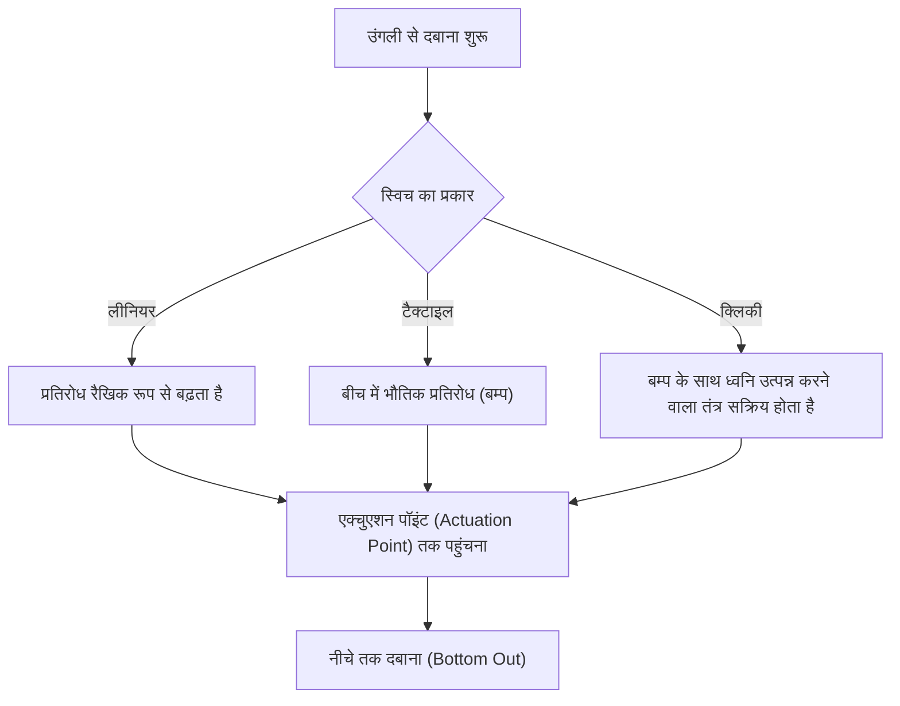
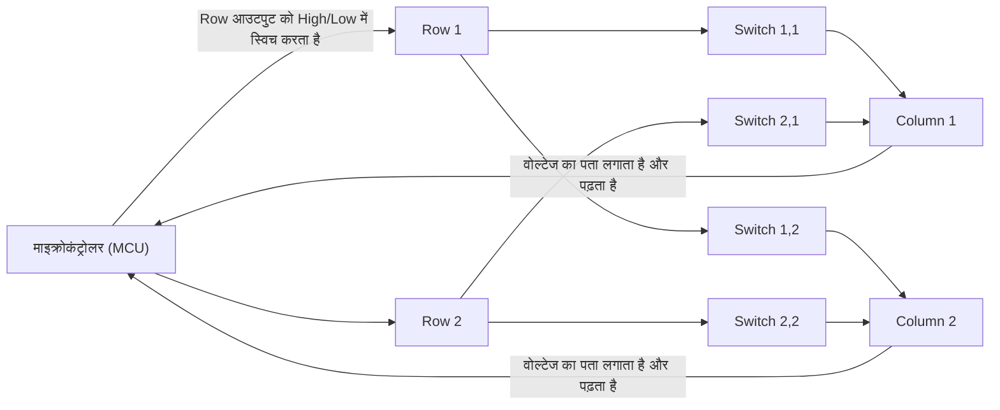
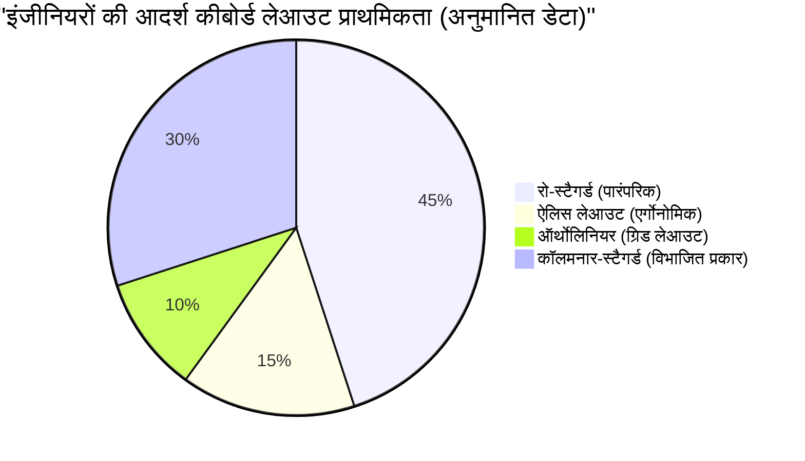

# लंबे समय तक कोडिंग के लिए! इंजीनियरों के लिए 5 अनुशंसित मैकेनिकल कीबोर्ड

प्रोग्रामर, सिस्टम इंजीनियर, डेटा साइंटिस्ट आदि जैसे आईटी उद्योग में काम करने वाले पेशेवरों के लिए, कीबोर्ड केवल एक इनपुट डिवाइस नहीं है। यह "विचारों को कोड के रूप में बदलने का एक इंटरफ़ेस" है, और यह सबसे महत्वपूर्ण उपकरण है जिससे वे हर दिन घंटों सीधे संपर्क में रहते हैं।

खराब कीबोर्ड का उपयोग करते रहने से न केवल टाइपिंग की गति कम होती है, बल्कि कलाई और उंगलियों के जोड़ों पर अत्यधिक तनाव पड़ता है, और टेंडोनाइटिस (जैसे कार्पल टनल सिंड्रोम) का खतरा बढ़ जाता है। इसके विपरीत, एक ऐसा कीबोर्ड प्राप्त करना जो आपके हाथों में अच्छी तरह से फिट बैठता हो, एक अच्छा टाइपिंग अनुभव देता हो, और अत्यधिक अनुकूलन योग्य हो, आपकी उत्पादकता और स्वास्थ्य दोनों में सुधार करने के लिए "सबसे अच्छा निवेश" है।

इस लेख में, हम इंजीनियरों के लिए केवल "सिफारिशों" से परे जाकर, कीबोर्ड की भौतिकी से लेकर आंतरिक इलेक्ट्रॉनिक सर्किट और नवीनतम फर्मवेयर तकनीक तक हर चीज़ का विस्तार से वर्णन करेंगे। इसके बाद, हम वास्तव में व्यावहारिक और बेहतरीन 5 कीबोर्ड पेश करेंगे।

## 1. की-स्विच की भौतिकी और तंत्र

कीबोर्ड की टाइपिंग का अनुभव निर्धारित करने वाला सबसे महत्वपूर्ण तत्व "की-स्विच" है। मैकेनिकल कीबोर्ड के स्विच स्प्रिंग और संपर्क तंत्र (contact mechanism) से बने होते हैं, और उनकी भौतिक विशेषताएं हमारी उंगलियों तक फीडबैक के रूप में पहुंचती हैं।

### 1.1 हुक का नियम और स्प्रिंग स्थिरांक (Spring Constant)

मैकेनिकल स्विच का एक्चुएशन फोर्स (Actuation Force) मुख्य रूप से अंदर मौजूद स्प्रिंग की विशेषताओं से निर्धारित होता है। इस स्प्रिंग के व्यवहार को शास्त्रीय यांत्रिकी में "हुक के नियम (Hooke's Law)" द्वारा अनुमानित किया जा सकता है।

$$ F = -k x $$

यहां, $F$ रीस्टोरिंग फोर्स (उंगली द्वारा महसूस किया जाने वाला रिपल्सिव फोर्स) है, $k$ स्प्रिंग का स्प्रिंग स्थिरांक है, और $x$ दबाई गई दूरी (स्ट्रोक) है।
लीनियर स्विच (जैसे लाल या काले स्विच) के मामले में, यह लगभग हुक के नियम का कड़ाई से पालन करता है, और इसमें एक रैखिक (Linear) विशेषता होती है जहां आप इसे जितना गहरा दबाते हैं, रिपल्सिव फोर्स उसी अनुपात में मजबूत हो जाता है।

### 1.2 एक्चुएशन एनर्जी की इंटीग्रल गणना

उस बिंदु को जहां की (key) को "इनपुट किया गया" माना जाता है, एक्चुएशन पॉइंट (Actuation Point) कहा जाता है। की को दबाना शुरू करने से लेकर एक्चुएशन पॉइंट $x_a$ तक पहुंचने के लिए उंगली द्वारा खर्च की गई ऊर्जा (कार्य) $E$, बल और दूरी के समाकलन (इंटीग्रल) द्वारा व्यक्त की जाती है।

$$ E = \int_{0}^{x_a} F(x) \, dx $$

टैक्टाइल स्विच (ब्राउन स्विच) या क्लिकी स्विच (ब्लू स्विच) के मामले में, चूंकि भौतिक प्रतिरोध (टैक्टाइल बम्प) होता है जहां संपर्क रगड़ते हैं, $F(x)$ एक साधारण रैखिक फ़ंक्शन नहीं होता है, बल्कि एक ऐसा फ़ंक्शन होता है जो एक विशिष्ट स्ट्रोक स्थिति में एक गैर-रैखिक (non-linear) शिखर पर पहुंचता है।

जब इंजीनियर लंबे समय तक कोडिंग करते हैं, तो अगर यह $E$ (एक्चुएशन एनर्जी) बहुत अधिक है, तो उंगलियां आसानी से थक जाएंगी, और यदि यह बहुत कम है, margin-top:0 मिस्टाइप (गलत टाइपिंग) बढ़ जाएगी। आम तौर पर, 45g से 55g के एक्चुएशन फोर्स वाले स्विच को थकान कम करने और सटीकता के बीच संतुलन माना जाता है, और इसे कई इंजीनियरों द्वारा पसंद किया जाता है।

### 1.3 अत्याधुनिक स्विच तकनीक: कैपेसिटिव (Capacitive) और हॉल इफ़ेक्ट (Hall Effect)

बिना भौतिक धातु संपर्क वाले अधिक उन्नत स्विच तकनीकें भी मौजूद हैं।

**इलेक्ट्रोस्टैटिक कैपेसिटिव सिस्टम (Topre)**
शंक्वाकार (conical) स्प्रिंग और रबर डोम का उपयोग करते हुए, यह दबाने से इलेक्ट्रोस्टैटिक कैपेसिटेंस (कैपेसिटी) में होने वाले परिवर्तन का पता लगाकर इनपुट का निर्धारण करता है। चूँकि कोई भौतिक संपर्क नहीं होता है, घर्षण बहुत कम होता है, और चैटरिंग (एक ही प्रेस के साथ कई बार इनपुट दर्ज होने की घटना) नहीं होती है। रबर डोम द्वारा बनाया गया अनूठा टाइपिंग अनुभव इतना आकर्षक है कि एक बार इसका अनुभव करने के बाद इसे छोड़ना मुश्किल हो जाता है।

**मैग्नेटिक स्विच (Hall Effect)**
हॉल इफ़ेक्ट का उपयोग करते हुए, स्टेम (अक्ष) में एम्बेडेड चुंबक जब सर्किट बोर्ड पर हॉल सेंसर के करीब पहुंचता है, तो चुंबकीय प्रवाह घनत्व में परिवर्तन को वोल्टेज के रूप में पढ़ा जाता है।
हॉल प्रभाव के कारण इलेक्ट्रोमोटिव फोर्स $V_H$ निम्नलिखित सूत्र द्वारा व्यक्त किया जाता है।

$$ V_H = R_H \left( \frac{I \cdot B}{t} \right) $$

यहाँ, $R_H$ हॉल गुणांक है, $I$ विद्युत धारा है, $B$ चुंबकीय प्रवाह घनत्व है, और $t$ कंडक्टर की मोटाई है। इस तकनीक के साथ, कीस्ट्रोक की गहराई को एनालॉग मान के रूप में लगातार प्राप्त किया जा सकता है, जिससे "0.1 मिमी की वृद्धि में एक्चुएशन पॉइंट को बदलना (Actuation Point Adjustment)" और "कुंजी को वापस छोड़ना शुरू करते ही इसे बंद कर देना (Rapid Trigger)" जैसे अविश्वसनीय नियंत्रण संभव हो जाते हैं।

## 2. कीबोर्ड के इलेक्ट्रॉनिक सर्किट और प्रदर्शन मेट्रिक्स

भले ही स्विच उत्कृष्ट हो, यदि इसे संसाधित करने वाले इलेक्ट्रॉनिक सर्किट या माइक्रोकंट्रोलर (MCU) का प्रदर्शन कम है, तो यह अपना सर्वश्रेष्ठ प्रदर्शन नहीं दे सकता है।

### 2.1 मैट्रिक्स स्कैनिंग और पोलिंग रेट

कीबोर्ड के अंदर दर्जनों से लेकर 100 से अधिक स्विच होते हैं, लेकिन माइक्रोकंट्रोलर के पिन की संख्या सीमित होती है, इसलिए सभी स्विच को अलग-अलग पिन से नहीं जोड़ा जा सकता है। इसलिए, स्विच को पंक्तियों (Row) और स्तंभों (Column) के ग्रिड (मैट्रिक्स) में तार दिया जाता है, और यह तेज़ी से स्कैन करके निर्धारित किया जाता है कि कौन सी कुंजी दबाई गई है।

**पोलिंग रेट (Polling Rate)** वह आवृत्ति है जिस पर कीबोर्ड पीसी को "कुंजी की वर्तमान स्थिति" रिपोर्ट करता है। मानक कीबोर्ड 125Hz (हर 8ms में 1 बार) पर काम करते हैं, लेकिन हाई-एंड मॉडल 1000Hz (हर 1ms में 1 बार) या हाल ही में 8000Hz (हर 0.125ms में 1 बार) जैसी अल्ट्रा-हाई स्पीड कम्युनिकेशन प्रदान करते हैं।
कोडिंग के लिए 1000Hz पर्याप्त से अधिक है, लेकिन यह अल्ट्रा-हाई स्पीड टाइपिंग के दौरान कीस्ट्रोक छूटने की चिंता को दूर करता है।

### 2.2 एन-की रोलओवर (NKRO) और एंटी-घोस्टिंग

**एन-की रोलओवर (N-Key Rollover)** एक ऐसी सुविधा है जिसमें एक ही समय में कई कुंजियों को दबाए जाने पर सभी कुंजियों को सटीक रूप से पहचाना जाता है। USB कनेक्शन की सीमाओं के कारण अतीत में "6 की तक" जैसी सीमाएँ थीं, लेकिन वर्तमान हाई-एंड कीबोर्ड USB HID रिपोर्ट में सुधार करके व्यावहारिक रूप से असीमित एक साथ प्रेस (Full NKRO) प्राप्त करते हैं।

इंजीनियरों के लिए जो Vim या Emacs जैसे संपादकों में जटिल शॉर्टकट (उदाहरण: `Ctrl + Shift + Alt + कोई कुंजी`) का भारी उपयोग करते हैं, पूर्ण NKRO एक शर्त है।

### 2.3 डिबाउंस डिले (Debounce Delay)

मेटल संपर्कों वाले मैकेनिकल स्विच में एक "बाउंस घटना" होती है जहाँ कुंजियों को दबाने या छोड़ने पर संपर्क थोड़ा उछलते हैं। माइक्रोकंट्रोलर पक्ष पर इसे अनदेखा करने के लिए लगने वाला समय **डिबाउंस डिले** है। आमतौर पर 5ms से 20ms की जानबूझकर देरी निर्धारित की जाती है, लेकिन उपर्युक्त कैपेसिटिव सिस्टम या मैग्नेटिक स्विच में कोई भौतिक संपर्क शोर नहीं होता है, इसलिए डिबाउंस डिले को शून्य (या बहुत कम) पर सेट किया जा सकता है, जो जबरदस्त प्रतिक्रिया प्रदान करता है।

## 3. फर्मवेयर और अनुकूलन क्षमता (QMK / VIA)

यदि हार्डवेयर "शरीर" है, तो फर्मवेयर कीबोर्ड का "दिमाग" है। आज के इंजीनियरों के लिए हाई-एंड कीबोर्ड केवल कीकोड भेजने के अलावा, अत्यधिक उन्नत प्रोग्राम चलाने में सक्षम हैं।

### 3.1 QMK Firmware

**QMK (Quantum Mechanical Keyboard)** एक ओपन-सोर्स कीबोर्ड फर्मवेयर है। यह C भाषा में लिखा गया है, और कीमैप बदलने से लेकर मैक्रो बनाने और एलईडी एनिमेशन को नियंत्रित करने तक, सचमुच "कुछ भी" संभव है।

### 3.2 उन्नत की-असाइनमेंट सुविधाएँ

QMK द्वारा प्रदान की गई सुविधाओं में से, निम्नलिखित विशेषताएं इंजीनियरों की उत्पादकता में नाटकीय रूप से वृद्धि करती हैं:

- **लेयर सुविधा (Layers):** जिस तरह आप स्मार्टफोन कीबोर्ड पर "अक्षर" और "नंबर" के बीच स्विच करते हैं, आप किसी विशिष्ट कुंजी (जैसे Fn कुंजी) को दबाए रखते हुए पूरे कीबोर्ड लेआउट को दूसरे में स्विच कर सकते हैं। यह आपको अपनी उंगलियों को होम पोजिशन से हटाए बिना एरो की, मैक्रोज़ और प्रतीकों को इनपुट करने की अनुमति देता है।
- **Mod-Tap:** एक कुंजी को "छोटा टैप करने पर" और "लंबे समय तक दबाए रखने पर" अलग-अलग भूमिकाएँ देता है। उदाहरण के लिए, स्पेस कुंजी को "टैप करने पर स्पेस, और होल्ड करने पर शिफ्ट" (Space Cadet Shift) के रूप में सेट करके, अंगूठे का प्रभावी ढंग से उपयोग करना संभव हो जाता है।
- **Home Row Mods:** यह होम पोजिशन कुंजियों (ASDF, JKL; आदि) पर होल्ड करते समय मॉडिफायर (Ctrl, Shift, Alt, GUI) असाइन करने की एक विधि है। इससे Ctrl कुंजी को दबाने के लिए छोटी उंगली को खींचने की आवश्यकता समाप्त हो जाती है, जो Vim और Emacs उपयोगकर्ताओं की कलाई की थकान को काफी कम कर देती है।

### 3.3 VIA / VIAL के माध्यम से रीयल-टाइम कॉन्फ़िगरेशन

QMK का नुकसान यह था कि "हर बार सेटिंग बदलने पर, सोर्स कोड को कंपाइल करना और फर्मवेयर को फ्लैश करना (लिखना) पड़ता था।" **VIA** और **VIAL** ने इसका समाधान किया है। ये आपको बिना पुनरारंभ किए रीयल-टाइम में कीमैप को फिर से लिखने के लिए GUI एप्लिकेशन (या वेब ब्राउज़र पर) से कीबोर्ड तक पहुंचने की अनुमति देते हैं।

## 4. एर्गोनॉमिक्स और लेआउट का विज्ञान

सामान्य "रो-स्टैगर्ड (वह लेआउट जहां प्रत्येक पंक्ति के लिए कुंजियों को स्थानांतरित किया जाता है)" केवल इसलिए है ताकि टाइपराइटर के भौतिक आर्म आपस में न उलझें, और यह मानव हाथ की संरचना पर आधारित नहीं है।

अधिक एर्गोनोमिक लेआउट के रूप में, निम्नलिखित विकल्प उपलब्ध हैं:

- **ऑर्थोलिनियर (Ortholinear):** एक लेआउट जहाँ कुंजियाँ पूरी तरह से लंबवत और क्षैतिज रूप से सीधे ग्रिड में व्यवस्थित होती हैं। उंगलियों का झुकना और खिंचाव रैखिक हो जाता है, जिससे उंगलियों की गति का अपव्यय कम होता है।
- **कॉलमनार-स्टैगर्ड (Columnar Stagger):** एक लेआउट जो मानव उंगलियों की लंबाई (मध्यमा उंगली लंबी और छोटी उंगली छोटी होती है) से मेल खाने के लिए लंबवत कॉलम को स्थानांतरित करता है। आप अपने हाथों के प्राकृतिक आकार के साथ टाइप कर सकते हैं।
- **स्प्लिट प्रकार (Split):** चूंकि बाएँ और दाएँ हाथ पूरी तरह से अलग-अलग रखे जा सकते हैं, आप कंधों को खोलकर और छाती को बाहर निकालकर एक प्राकृतिक मुद्रा में टाइप कर सकते हैं, जो कठोर कंधों और सीधे गर्दन को रोकने में अत्यधिक प्रभावी है।

## 5. इंजीनियरों के लिए 5 अनुशंसित अल्टीमेट मैकेनिकल कीबोर्ड

भौतिकी, इलेक्ट्रॉनिक सर्किट, फर्मवेयर और एर्गोनॉमिक्स के दृष्टिकोण के आधार पर, हमने लंबे समय तक कोडिंग को संभालने में सक्षम 5 सच्चे पेशेवर कीबोर्ड का सावधानीपूर्वक चयन किया है।

---

### 1. Keychron Q सीरीज़ (Q1 Pro / Q8 आदि) - कस्टम कीबोर्ड की दुनिया का प्रवेश द्वार

हांगकांग की Keychron हाल के कस्टम कीबोर्ड बूम का नेतृत्व कर रही है। विशेष रूप से, "Q सीरीज़" एक पूर्ण-एल्यूमीनियम भारी-भरकम बॉडी और एक "गैस्केट माउंट (Gasket Mount)" संरचना का उपयोग करती है जो टाइपिंग ध्वनि को अत्यंत अनुकूलित करती है।

- **स्विच:** मैकेनिकल (हॉट-स्वैप संगत। आप स्वतंत्र रूप से स्विच बदल सकते हैं)
- **फर्मवेयर:** QMK/VIA के साथ पूरी तरह से संगत
- **विशेषताएं:** macOS और Windows दोनों के लिए एक स्विच। आप अपनी पसंद का लेआउट चुन सकते हैं, जैसे कि ऐलिस लेआउट Q8 या 75% लेआउट Q1।
- **इंजीनियरों के लिए लाभ:** हालांकि यह एक तैयार उत्पाद है, आप तुरंत बॉक्स से बाहर एक कस्टम कीबोर्ड के समान बेहतरीन टाइपिंग अनुभव और अनुकूलन क्षमता का आनंद ले सकते हैं। VIA का उपयोग करके Vim-शैली की एरो लेयर सेट करने के लिए यह एकदम सही है।

---

### 2. HHKB Studio - हैकर्स के लिए ऑल-इन-वन पॉइंटिंग डिवाइस

"Happy Hacking Keyboard (HHKB)" UNIX प्रोग्रामर्स के लिए पैदा हुआ एक प्रसिद्ध कीबोर्ड है। नवीनतम "HHKB Studio" पारंपरिक कैपेसिटिव सिस्टम के बजाय विशेष रूप से विकसित साइलेंट मैकेनिकल स्विच को अपनाकर और विकसित हुआ है।

- **स्विच:** लीनियर साइलेंट मैकेनिकल स्विच (Kailh द्वारा निर्मित, हॉट-स्वैप संगत)
- **विशेषताएं:** कीबोर्ड के केंद्र में पॉइंटिंग स्टिक (ट्रैकपॉइंट), चार जेस्चर पैड।
- **इंजीनियरों के लिए लाभ:** आप होम पोजिशन से अपने हाथों को हटाए बिना माउस कर्सर ऑपरेशन, स्क्रॉलिंग और विंडो स्विचिंग को पूरा कर सकते हैं। एक बार जब आप इस अनुभव का स्वाद ले लेते हैं कि "सब कुछ उंगलियों पर पूरा हो जाता है", तो आप कभी भी अपने दाहिने हाथ को माउस तक पहुंचाने के काम पर वापस नहीं जा पाएंगे।

---

### 3. ZSA Moonlander / ErgoDox EZ - अल्टीमेट स्प्लिट एर्गोनॉमिक्स

यह कनाडा में ZSA द्वारा विकसित स्प्लिट कीबोर्ड का शिखर है। चूँकि बाएँ और दाएँ भाग स्वतंत्र हैं और इन्हें आपके कंधों की चौड़ाई के अनुसार रखा जा सकता है, इसलिए लंबे समय तक टाइप करने पर भी कंधों और गर्दन पर बोझ आश्चर्यजनक रूप से कम हो जाता है।

- **स्विच:** मैकेनिकल (Cherry MX संगत, हॉट-स्वैप संगत)
- **फर्मवेयर:** QMK आधारित (अपने स्वयं के शक्तिशाली GUI टूल "Oryx" का उपयोग करता है)
- **विशेषताएं:** कॉलमनार-स्टैगर्ड लेआउट, विशेष रूप से अंगूठे के लिए क्लस्टर की (cluster keys), और टेंटिंग (झुकाव) के लिए स्टैंड मानक उपकरण के रूप में शामिल हैं।
- **इंजीनियरों के लिए लाभ:** अंगूठे को Enter, Space, Backspace और Layer स्विचिंग असाइन करके, यह सबसे कमजोर छोटी उंगली पर बोझ को काफी कम कर देता है। यह कार्पल टनल सिंड्रोम से पीड़ित इंजीनियरों के लिए एक रक्षक उपकरण है।

---

### 4. REALFORCE R3 - जापानी विश्वसनीयता और सर्वोच्च टाइपिंग अनुभव (कैपेसिटिव सिस्टम)

Topre द्वारा निर्मित एक जापानी मास्टरपीस। वित्तीय संस्थानों जैसे पेशेवर कार्यस्थलों में कई वर्षों तक उपयोग किए जाने का इसका ट्रैक रिकॉर्ड कोई मजाक नहीं है। R3 पीढ़ी से, यह ब्लूटूथ कनेक्शन का भी समर्थन करता है।

- **स्विच:** इलेक्ट्रोस्टैटिक कैपेसिटिव सिस्टम (Topre)
- **विशेषताएं:** APC (एक्चुएशन पॉइंट चेंजर) फ़ंक्शन के साथ, प्रत्येक कुंजी के लिए एक्चुएशन पॉइंट को 0.8 मिमी, 1.5 मिमी, 2.2 मिमी और 3.0 मिमी पर सेट किया जा सकता है।
- **इंजीनियरों के लिए लाभ:** भौतिक संपर्कों की कमी के कारण चिकनी कीस्ट्रोक को "फेदर टच" कहा जाता है, और लंबे समय तक कोडिंग के दौरान उंगलियों पर तनाव कम हो जाता है। केवल उन कुंजियों (जैसे A और Enter) के लिए जिन्हें छोटी उंगली से दबाया जाता है, एक्चुएशन पॉइंट को कम गहरा (0.8 मिमी) सेट किया जा सकता है, जिससे वे हल्के स्पर्श के साथ प्रतिक्रिया कर सकें।

---

### 5. Wooting 60HE - मैग्नेटिक स्विच द्वारा लाई गई क्रांतिकारी प्रतिक्रिया

मूल रूप से एस्पोर्ट्स गेमर्स के लिए विकसित किया गया एक कीबोर्ड, लेकिन इसकी नवीन तकनीक को उन इंजीनियरों द्वारा भी अत्यधिक मूल्यांकित किया गया है जो सबसे तेज टाइपिंग और प्रतिक्रिया चाहते हैं।

- **स्विच:** Lekker Switch (हॉल-इफ़ेक्ट मैग्नेटिक स्विच)
- **विशेषताएं:** रैपिड ट्रिगर फ़ंक्शन, 0.1 मिमी की वृद्धि में 0.1 मिमी से 4.0 मिमी तक एडजस्टेबल एक्चुएशन पॉइंट।
- **इंजीनियरों के लिए लाभ:** एनालॉग इनपुट का लाभ उठाते हुए, आप "हल्का दबाने पर लोअरकेस, गहरा दबाने पर अपरकेस (Shift के साथ संयोजन)" (Dynamic Keystroke) जैसी अजीब सेटिंग्स कर सकते हैं। इसके अलावा, जैसे ही उंगली थोड़ी भी उठाई जाती है, कुंजी बंद हो जाती है, जो हाई-स्पीड टाइपिंग के दौरान अनपेक्षित निरंतर इनपुट को रोकता है और एक अद्वितीय सटीक इनपुट अनुभव प्रदान करता है।

## निष्कर्ष

कीबोर्ड चुनना एक इंजीनियर के रूप में आपके करियर के दौरान "आपके अपने इंटरफ़ेस को अनुकूलित करने" की प्रक्रिया है। हुक के नियम का पालन करने वाले भौतिक स्प्रिंग के एहसास से लेकर इंटीग्रल द्वारा गणना की गई एक्चुएशन एनर्जी, QMK के साथ मैक्रो निर्माण और बेहतरीन एर्गोनॉमिक्स तक, खोजने के लिए गहराई की कोई सीमा नहीं है।

इस बार पेश किए गए 5 कीबोर्ड (Keychron, HHKB Studio, Moonlander, REALFORCE, Wooting) बेहतरीन मास्टरपीस हैं जो विभिन्न तरीकों से "सर्वश्रेष्ठ टाइपिंग अनुभव" का लक्ष्य रखते हैं। कृपया अपनी टाइपिंग शैली और आपके द्वारा अनुभव की जा रही शारीरिक समस्याओं के अनुसार सबसे अच्छा साथी खोजें।

कीबोर्ड में निवेश निश्चित रूप से आपके लिए "बिना बग के लाखों लाइनों का कोड" बन जाएगा और आपको रिटर्न लाएगा।
