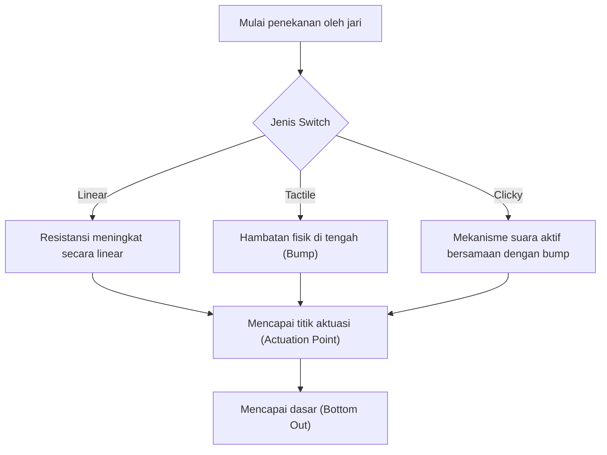
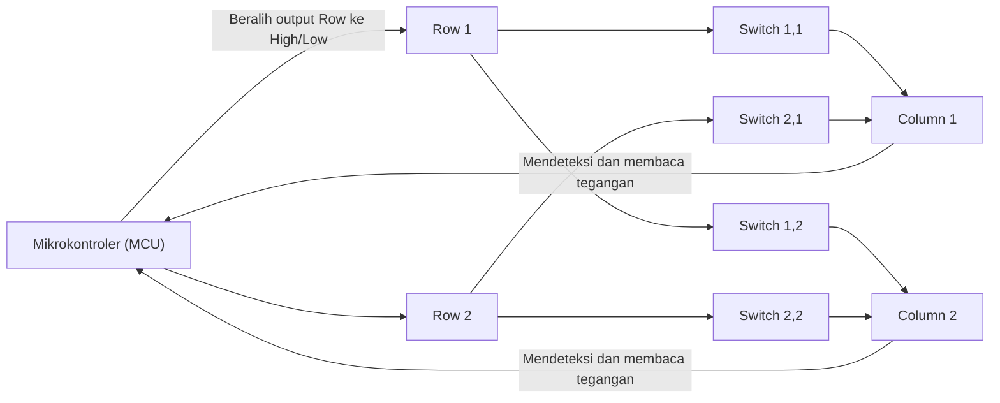
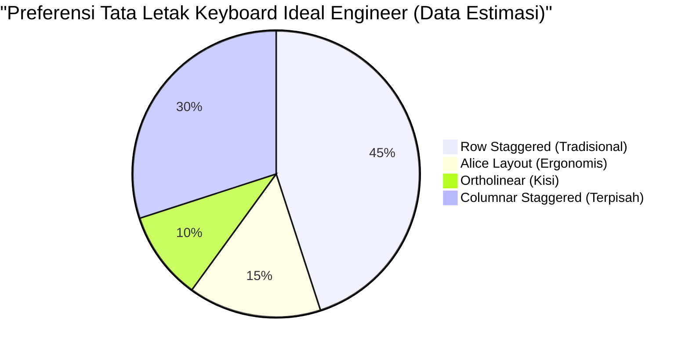

# Untuk Coding Jangka Panjang! 5 Rekomendasi Keyboard Mekanikal untuk Engineer

Bagi profesional yang bekerja di industri IT seperti programmer, system engineer, dan data scientist, keyboard bukanlah sekadar perangkat input biasa. Ia adalah "antarmuka untuk mengubah pikiran menjadi bentuk kode" dan merupakan alat kerja terpenting yang disentuh langsung selama berjam-jam setiap hari.

Terus menggunakan keyboard berkualitas rendah tidak hanya menyebabkan penurunan kecepatan mengetik, tetapi juga memberikan beban berlebihan pada pergelangan tangan dan sendi jari, yang pada gilirannya meningkatkan risiko tendinitis (seperti carpal tunnel syndrome). Sebaliknya, mendapatkan keyboard yang pas di tangan, nyaman digunakan, dan sangat dapat dikustomisasi adalah "investasi terbaik" yang akan sangat meningkatkan produktivitas dan kesehatan Anda.

Dalam artikel ini, khusus bagi Anda para engineer, kami akan memberikan penjelasan mendalam yang lebih dari sekadar "rekomendasi", mulai dari fisika keyboard, sirkuit elektronik internal, hingga teknologi firmware terbaru. Setelah itu, kami akan memperkenalkan 5 pilihan keyboard pamungkas yang benar-benar andal untuk penggunaan praktis.

## 1. Fisika dan Mekanisme Key Switch

Elemen terpenting yang menentukan sensasi mengetik pada keyboard adalah "key switch" (sakelar tombol). Switch pada keyboard mekanikal terdiri dari mekanisme pegas (spring) dan kontak, di mana karakteristik fisiknya diteruskan sebagai umpan balik ke ujung jari kita.

### 1.1 Hukum Hooke dan Konstanta Pegas

Gaya tekan (Actuation Force) dari switch mekanikal sebagian besar ditentukan oleh karakteristik pegas di dalamnya. Perilaku pegas ini dapat didekati dengan "Hukum Hooke" dalam mekanika klasik.

$$ F = -k x $$

Di sini, $F$ adalah gaya pemulih (gaya tolak yang dirasakan jari), $k$ adalah konstanta pegas, dan $x$ adalah jarak penekanan (stroke).
Pada switch linear (seperti red switch atau black switch), mereka hampir sepenuhnya mengikuti Hukum Hooke ini, memiliki karakteristik linier (Linear) di mana gaya tolak meningkat secara proporsional semakin dalam tombol ditekan.

### 1.2 Perhitungan Integral Energi Aktuasi

Titik di mana tombol dikenali telah "ditekan" disebut titik aktuasi (Actuation Point). Energi (usaha) $E$ yang dihabiskan oleh jari sejak mulai menekan tombol hingga mencapai titik aktuasi $x_a$ dinyatakan dengan integral gaya terhadap jarak.

$$ E = \int_{0}^{x_a} F(x) \, dx $$

Pada tactile switch (brown switch) atau clicky switch (blue switch), terdapat hambatan fisik saat kontak bergesekan (tactile bump), sehingga $F(x)$ bukanlah fungsi linear sederhana, melainkan fungsi yang mencapai puncaknya secara non-linear pada posisi stroke tertentu.

Ketika engineer melakukan coding untuk waktu yang lama, jika energi aktuasi $E$ ini terlalu besar, jari akan mudah lelah, dan jika terlalu kecil, kesalahan ketik (typo) akan meningkat. Umumnya, switch dengan gaya aktuasi sekitar 45g hingga 55g dianggap memiliki keseimbangan yang baik antara mengurangi kelelahan dan akurasi, sehingga disukai oleh banyak engineer.

### 1.3 Teknologi Switch Mutakhir: Capacitive (Tanpa Kontak) dan Hall Effect

Terdapat juga teknologi switch yang lebih canggih yang tidak memiliki kontak fisik logam.

**Capacitive Switch (Topre)**
Menggunakan pegas berbentuk kerucut dan kubah karet (rubber dome), switch ini mendeteksi penekanan berdasarkan perubahan kapasitansi. Karena tidak ada kontak fisik, keausan sangat minim dan tidak ada pantulan ganda (chattering - di mana satu tekanan dikenali sebagai beberapa input). Sensasi mengetik unik "thock" dari rubber dome memiliki daya tarik tersendiri yang membuat Anda sulit berpaling setelah mencobanya.

**Magnetic Switch (Hall Effect)**
Memanfaatkan efek Hall, perubahan kepadatan fluks magnetik saat magnet yang tertanam di batang (stem) mendekati sensor Hall di PCB dibaca sebagai tegangan.
Gaya gerak listrik (tegangan) efek Hall $V_H$ dinyatakan dengan rumus berikut:

$$ V_H = R_H \left( \frac{I \cdot B}{t} \right) $$

Di mana $R_H$ adalah koefisien Hall, $I$ adalah arus, $B$ adalah kepadatan fluks magnetik, dan $t$ adalah ketebalan konduktor. Dengan teknologi ini, kedalaman keystroke dapat diperoleh secara kontinu sebagai nilai analog. Hal ini memungkinkan kontrol luar biasa seperti "mengubah titik aktuasi dalam satuan 0.1mm" (Actuation Point Adjustment) atau "menonaktifkan tombol seketika saat jari mulai diangkat" (Rapid Trigger).

## 2. Sirkuit Elektronik Keyboard dan Indikator Kinerja

Meskipun switch-nya bagus, performa maksimal tidak akan tercapai jika kinerja sirkuit elektronik dan mikrokontroler (MCU) yang memprosesnya rendah.

### 2.1 Matrix Scan dan Polling Rate

Di dalam keyboard, terdapat puluhan hingga lebih dari 100 switch, tetapi karena jumlah pin pada mikrokontroler terbatas, tidak mungkin menghubungkan setiap switch ke pin individual. Oleh karena itu, switch dihubungkan dalam bentuk kisi (matriks) yang terdiri dari baris (Row) dan kolom (Column), dan dipindai (scan) dengan kecepatan tinggi untuk menentukan tombol mana yang ditekan.

**Polling Rate (Tingkat Polling)** adalah frekuensi di mana keyboard melaporkan "status tombol saat ini" ke PC. Keyboard standar biasanya memiliki 125Hz (1 kali per 8ms), tetapi model high-end dapat memiliki 1000Hz (1 kali per 1ms), dan akhir-akhir ini bahkan ada yang berkecepatan sangat tinggi seperti 8000Hz (1 kali per 0.125ms).
Untuk keperluan coding, 1000Hz sudah lebih dari cukup, namun ini memberikan rasa aman untuk mencegah input terlewat saat mengetik dengan kecepatan sangat tinggi.

### 2.2 N-Key Rollover (NKRO) dan Anti-Ghosting

**N-Key Rollover (NKRO)** adalah fitur di mana saat beberapa tombol ditekan secara bersamaan, semuanya dapat dikenali dengan akurat. Di masa lalu, ada batasan "hingga 6 tombol" karena kendala koneksi USB, tetapi keyboard high-end saat ini mencapai penekanan bersamaan yang praktis tak terbatas (Full NKRO) dengan memodifikasi laporan HID USB.

Bagi engineer yang sering menggunakan pintasan (shortcut) rumit di editor seperti Vim atau Emacs (contoh: `Ctrl + Shift + Alt + tombol apa saja`), NKRO penuh adalah syarat mutlak.

### 2.3 Debounce Delay

Pada switch mekanikal yang memiliki kontak logam, terdapat "efek pantulan" (bounce) di mana kontak bergetar sedikit saat ditekan atau dilepas. Waktu pemrosesan yang ditetapkan oleh mikrokontroler untuk mengabaikan getaran ini disebut **debounce delay**. Biasanya, penundaan sekitar 5ms hingga 20ms sengaja diberikan. Namun, pada capacitive switch atau magnetic switch yang disebutkan sebelumnya, karena tidak ada noise kontak fisik, debounce delay dapat diatur menjadi nol (atau sangat kecil), menghasilkan respons yang luar biasa.

## 3. Firmware dan Kustomisasi (QMK / VIA)

Jika perangkat keras (hardware) adalah "tubuh", maka firmware adalah "otak" dari keyboard. Keyboard high-end modern untuk engineer tidak hanya sekadar mengirimkan kode tombol, tetapi memiliki kemampuan untuk mengeksekusi program yang kompleks.

### 3.1 QMK Firmware

**QMK (Quantum Mechanical Keyboard)** adalah firmware keyboard open-source. Ditulis dalam bahasa C, ini secara harfiah memungkinkan "segala hal", mulai dari mengubah keymap, membuat makro, hingga mengontrol animasi LED.

### 3.2 Fitur Penempatan Tombol Tingkat Lanjut

Di antara fitur-fitur yang disediakan oleh QMK, berikut ini adalah fitur yang dapat secara eksplosif meningkatkan produktivitas engineer:

- **Fitur Layer (Layers):** Mirip dengan beralih antara "huruf" dan "angka" di keyboard smartphone, tata letak seluruh keyboard beralih ke tata letak lain hanya selama tombol tertentu (seperti tombol Fn) ditekan. Ini memungkinkan input tombol panah, makro, dan simbol tanpa harus memindahkan tangan dari home position.
- **Mod-Tap:** Memberikan dua fungsi berbeda pada satu tombol tergantung apakah "diketuk singkat" atau "ditahan lama". Misalnya, dengan mengatur spasi menjadi "Space saat diketuk, Shift saat ditahan" (Space Cadet Shift), ibu jari dapat dimanfaatkan dengan lebih efektif.
- **Home Row Mods:** Ini adalah teknik untuk menempatkan modifier (Ctrl, Shift, Alt, GUI) saat ditahan pada tombol di home position (ASDF, JKL;, dll). Ini menghilangkan kebutuhan untuk meregangkan jari kelingking guna menekan tombol Ctrl, secara dramatis mengurangi kelelahan pergelangan tangan bagi pengguna Vim atau Emacs.

### 3.3 Pengaturan Real-Time dengan VIA / VIAL

Kelemahan QMK adalah "Anda harus mengkompilasi kode sumber dan melakukan flash (menulis) firmware setiap kali mengubah pengaturan". Masalah ini dipecahkan oleh **VIA** dan **VIAL**. Ini memungkinkan Anda mengakses keyboard dari aplikasi GUI (atau melalui browser web) dan menulis ulang keymap secara real-time tanpa perlu melakukan reboot.

## 4. Ergonomi dan Sains Tata Letak

Tata letak "Row Staggered" (baris yang miring) yang umum digunakan sebenarnya adalah peninggalan dari mesin tik agar lengan fisiknya tidak saling tersangkut, dan tidak didasarkan pada struktur tangan manusia.

Berikut adalah beberapa tata letak yang lebih mempertimbangkan faktor ergonomi:

- **Ortholinear:** Tata letak di mana tombol disusun sejajar lurus secara vertikal dan horizontal seperti kisi. Menekuk dan meluruskan jari menjadi lebih linier, mengurangi pergerakan jari yang sia-sia.
- **Columnar Staggered:** Tata letak yang menggeser kolom vertikal agar sesuai dengan panjang jari manusia (jari tengah panjang, jari kelingking pendek). Memungkinkan Anda mengetik dengan bentuk tangan yang alami.
- **Split (Terpisah):** Karena tangan kiri dan kanan dapat diposisikan terpisah sepenuhnya, Anda dapat mengetik dengan postur alami, dada terbuka lebar dan bahu rileks. Ini memiliki efek luar biasa dalam mencegah bahu kaku dan leher lurus (straight neck).

## 5. 5 Rekomendasi Keyboard Mekanikal Pamungkas untuk Engineer

Mempertimbangkan aspek fisika, sirkuit elektronik, firmware, dan ergonomi, kami telah memilih secara ketat 5 keyboard kelas profesional sejati yang mampu bertahan untuk sesi coding yang panjang.

---

### 1. Keychron Q Series (Q1 Pro / Q8 dll) - Pintu Gerbang ke Dunia Custom Keyboard

Keychron yang berbasis di Hong Kong adalah pelopor di balik tren custom keyboard akhir-akhir ini. Di antaranya, "Q Series" mengadopsi bodi kokoh full-aluminium dan struktur "Gasket Mount" yang disetel untuk memaksimalkan profil suara pengetikan.

- **Switch:** Mekanikal (Hot-swappable. Anda dapat dengan bebas mengganti switch)
- **Firmware:** Didukung penuh oleh QMK/VIA
- **Fitur:** Tombol sakelar untuk berpindah antara macOS/Windows. Anda dapat memilih layout sesuai preferensi, seperti Alice layout pada Q8, atau layout 75% pada Q1.
- **Manfaat untuk Engineer:** Meskipun ini adalah produk jadi, Anda dapat segera merasakan sensasi mengetik yang sangat baik dan kemampuan penyesuaian yang setara dengan custom keyboard rakitan sejak dikeluarkan dari kotaknya. Sangat ideal untuk membuat layer panah ala Vim menggunakan VIA.

---

### 2. HHKB Studio - Perangkat Input All-in-One untuk Hacker

"Happy Hacking Keyboard (HHKB)" adalah keyboard legendaris yang lahir untuk para programmer UNIX. "HHKB Studio" terbaru menggunakan switch mekanikal senyap (silent) yang dikembangkan secara khusus, alih-alih capacitive switch tradisional, menandai evolusi yang lebih jauh lagi.

- **Switch:** Linear / Silent Mechanical Switch (Buatan Kailh, Hot-swappable)
- **Fitur:** Pointing stick (trackpoint) di tengah keyboard, dan 4 pad gestur.
- **Manfaat untuk Engineer:** Operasi kursor mouse, scrolling, dan pergantian jendela dapat diselesaikan tanpa perlu mengangkat tangan dari home position. Begitu Anda merasakan "pengalaman di mana semuanya diselesaikan dengan ujung jari" ini, Anda tidak akan pernah bisa kembali meraih mouse dengan tangan kanan Anda.

---

### 3. ZSA Moonlander / ErgoDox EZ - Ergonomi Split yang Pamungkas

Inilah puncak dari split keyboard yang dikembangkan oleh ZSA dari Kanada. Sisi kiri dan kanan saling terpisah, dan karena Anda dapat memposisikannya sejajar dengan lebar bahu, beban pada bahu dan leher berkurang drastis bahkan saat mengetik dalam waktu yang lama.

- **Switch:** Mekanikal (Kompatibel dengan Cherry MX, Hot-swappable)
- **Firmware:** Berbasis QMK (Menggunakan alat GUI canggih milik mereka sendiri, "Oryx")
- **Fitur:** Tata letak Columnar Staggered, cluster tombol khusus untuk ibu jari, dan penyangga kaki untuk mengatur sudut kemiringan (tenting) disertakan sebagai standar.
- **Manfaat untuk Engineer:** Dengan menempatkan Enter, Space, Backspace, dan Layer Toggle di ibu jari, ini secara dramatis mengurangi beban pada jari kelingking yang paling lemah. Ini adalah perangkat penyelamat bagi engineer yang menderita carpal tunnel syndrome.

---

### 4. REALFORCE R3 - Keandalan Jepang dan Sensasi Mengetik Terbaik (Capacitive Switch)

Mahakarya Jepang yang dibanggakan oleh Topre. Rekam jejaknya yang telah lama digunakan di lingkungan profesional seperti institusi keuangan membuktikan kualitasnya. Mulai dari generasi R3, ia juga telah mendukung koneksi Bluetooth.

- **Switch:** Capacitive Switch (Tanpa Kontak / Topre)
- **Fitur:** Dengan fitur APC (Actuation Point Changer), titik aktuasi dapat diatur secara individual untuk setiap tombol pada 0.8mm, 1.5mm, 2.2mm, dan 3.0mm.
- **Manfaat untuk Engineer:** Sentuhan tombol mulus karena tidak adanya kontak fisik disebut "Feather Touch", yang meminimalkan stres tolakan pada jari bahkan selama sesi coding yang panjang. Anda bisa mengatur titik aktuasi hanya untuk tombol yang ditekan dengan jari kelingking (seperti A atau Enter) menjadi dangkal (0.8mm) agar bereaksi hanya dengan sentuhan ringan.

---

### 5. Wooting 60HE - Respons Revolusioner yang Dibawa oleh Magnetic Switch

Awalnya dikembangkan untuk gamer e-sports, teknologi inovatif dari keyboard ini juga sangat diapresiasi oleh para engineer yang mencari kecepatan mengetik dan responsivitas terbaik.

- **Switch:** Lekker Switch (Magnetic Switch berbasis efek Hall)
- **Fitur:** Fitur Rapid Trigger, dan titik aktuasi yang dapat disesuaikan dalam peningkatan 0.1mm mulai dari 0.1mm hingga 4.0mm.
- **Manfaat untuk Engineer:** Memanfaatkan input analog, Anda dapat membuat pengaturan tidak lazim (Dynamic Keystroke) seperti "huruf kecil jika ditekan sedikit, huruf besar jika ditekan dalam (gabungan dengan Shift)". Selain itu, karena input tombol dimatikan sesaat setelah Anda sedikit saja mengangkat jari, ini mencegah input berulang yang tidak disengaja selama mengetik cepat, menawarkan pengalaman mengetik yang tak tertandingi dan akurat.

## Penutup

Memilih keyboard adalah proses "mengoptimalkan antarmuka diri sendiri" sepanjang karier Anda sebagai engineer. Dari sensasi fisik pegas yang mematuhi hukum Hooke, energi aktuasi yang dihitung menggunakan integral, pembuatan makro dengan QMK, hingga ergonomi tertinggi, kedalaman yang bisa dijelajahi seolah tanpa batas.

Kelima keyboard yang diperkenalkan kali ini (Keychron, HHKB Studio, Moonlander, REALFORCE, Wooting) semuanya adalah mahakarya yang bertujuan untuk memberikan "pengalaman input terbaik" dengan pendekatan yang berbeda-beda. Kami harap Anda dapat menemukan partner terbaik yang sesuai dengan gaya mengetik dan masalah fisik yang Anda hadapi.

Investasi pada keyboard ini pasti akan memberikan pengembalian berupa "jutaan baris kode tanpa bug" kepada Anda.
