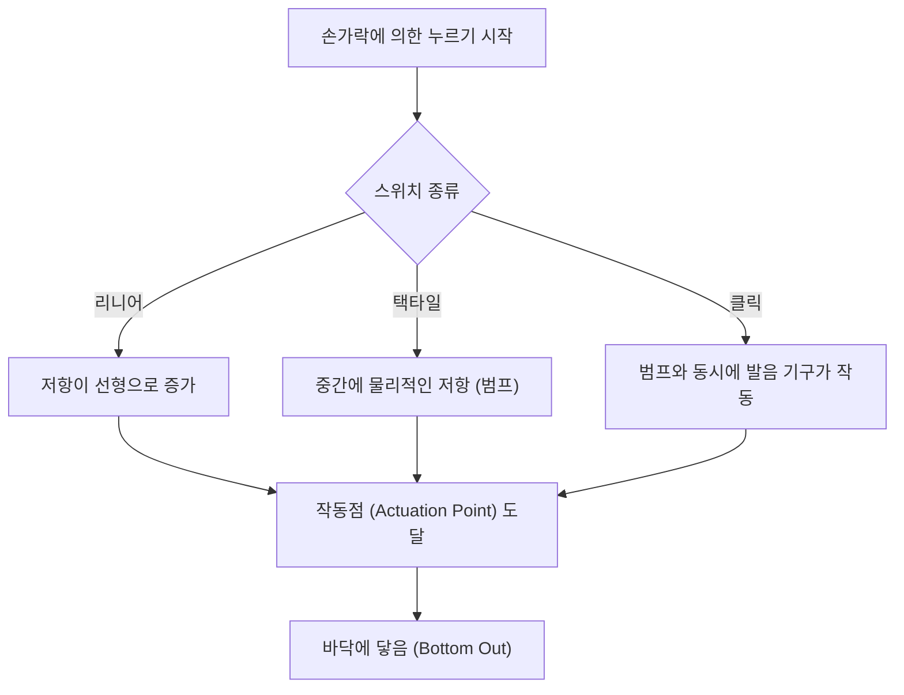
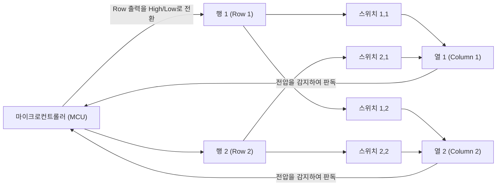
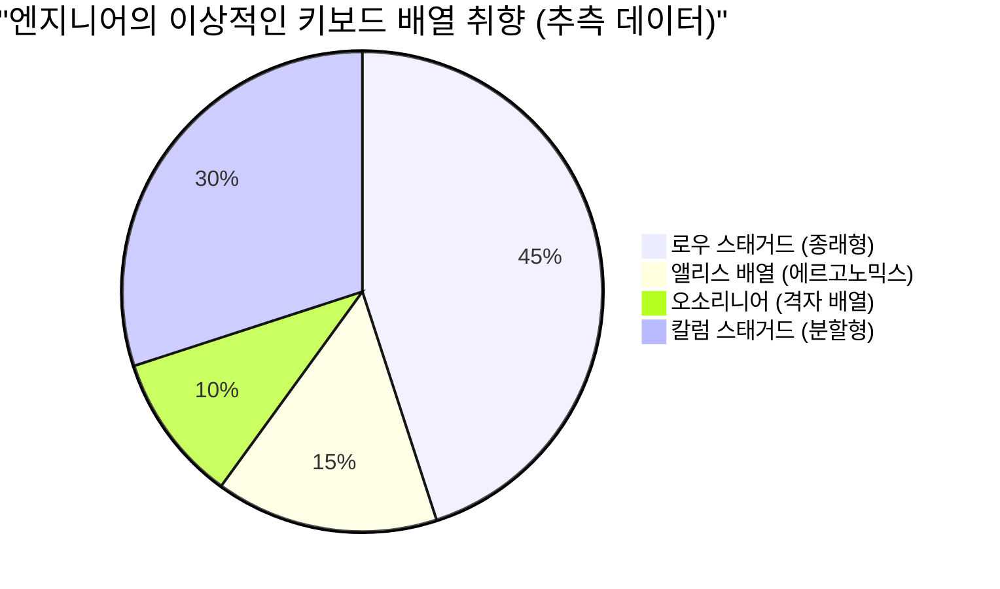

# 장시간 코딩에! 엔지니어에게 추천하는 기계식 키보드 5선

프로그래머, 시스템 엔지니어, 데이터 사이언티스트 등, IT 업계에서 일하는 프로페셔널에게 있어, 키보드는 단순한 입력 기기가 아닙니다. 그것은 '사고를 코드라는 형태로 변환하기 위한 인터페이스'이며, 매일 몇 시간이고 직접 계속 만지는 가장 중요한 업무 도구입니다.

조악한 키보드를 계속 사용하는 것은, 타이핑 속도의 저하를 초래할 뿐만 아니라, 손목이나 손가락 관절에 과도한 부담, 나아가서는 건초염(수근관 증후군 등)의 리스크를 증대시킵니다. 반대로, 자신의 손에 익숙해지고, 타건감이 좋으며, 게다가 고도로 커스터마이즈 가능한 키보드를 손에 넣는 것은, 생산성과 건강 양쪽을 크게 향상시키는 '최고의 투자'가 됩니다.

본 기사에서는, 엔지니어 여러분을 향해, 단순한 '추천'을 넘은, 키보드의 물리학에서 내부의 전자 회로, 그리고 최신 펌웨어 기술에 이르기까지를 철저하게 해설합니다. 그 위에서, 진정으로 실용에 견딜 수 있는 궁극의 키보드 5선을 소개합니다.

## 1. 키 스위치의 물리학과 메커니즘

키보드의 타건감을 결정짓는 가장 중요한 요소가 '키 스위치'입니다. 기계식 키보드의 스위치는, 스프링(용수철)과 접점 기구에 의해 구성되어 있으며, 그 물리적인 특성이 우리의 손끝에 피드백으로서 전해집니다.

### 1.1 훅의 법칙과 용수철 상수

기계식 스위치의 압하압(Actuation Force)은, 주로 내부에 장착된 스프링의 특성에 따라 정해집니다. 이 스프링의 거동은, 고전 역학에서의 '훅의 법칙(Hooke's Law)'으로 근사적으로 나타낼 수 있습니다.

$$ F = -k x $$

여기서, $F$ 는 복원력(손가락이 느끼는 반발력), $k$ 는 스프링의 용수철 상수, $x$ 는 밀어 넣은 거리(스트로크)입니다.
리니어 스위치(적축이나 흑축 등)의 경우, 이 훅의 법칙을 거의 충실히 따르며, 밀어 넣을수록 비례해서 반발력이 강해진다는 직선적인(Linear) 특성을 가집니다.

### 1.2 작동 에너지의 적분 계산

키를 '입력되었다'고 인식하는 점을 작동점(Actuation Point)이라고 부릅니다. 키를 누르기 시작해서 작동점 $x_a$ 에 도달할 때까지 손가락이 소비하는 에너지(일의 양) $E$ 는, 힘의 거리에 의한 적분으로 나타냅니다.

$$ E = \int_{0}^{x_a} F(x) \, dx $$

택타일 스위치(갈축)나 클릭 스위치(청축)의 경우, 접점이 마찰하는 물리적인 저항(택타일 범프)이 존재하기 때문에, $F(x)$ 는 단순한 일차 함수가 아니라, 특정 스트로크 위치에서 비선형적으로 피크를 맞이하는 함수가 됩니다.

엔지니어가 장시간 코딩을 실시할 경우, 이 $E$(작동 에너지)가 너무 크면 손가락이 피로해지기 쉽고, 너무 작으면 미스 타이핑(오폭)이 증가합니다. 일반적으로, 45g~55g 정도의 작동력을 가지는 스위치가, 피로 경감과 정확성의 밸런스가 잡혀 있다고 여겨져, 많은 엔지니어에게 선호됩니다.

### 1.3 최첨단 스위치 기술: 정전용량 무접점과 홀 효과

물리적인 금속 접점을 가지지 않는, 보다 고도화된 스위치 기술도 존재합니다.

**정전용량 무접점 방식 (Topre)**
원뿔형의 스프링과 러버 돔을 사용하여, 누름에 의한 정전용량의 변화를 감지해 입력을 판정합니다. 물리적인 접점이 없기 때문에 마모가 극히 적으며, 채터링(1회의 누름으로 여러 번 입력되어 버리는 현상)이 발생하지 않습니다. 러버 돔에 의한 독특한 '도각도각'하는 타건감은, 한 번 맛보면 헤어 나올 수 없는 매력이 있습니다.

**자기 스위치 (Hall Effect)**
홀 효과를 이용하여, 스템(축)에 파묻힌 자석이 기판 상의 홀 센서에 다가감에 따른 자속 밀도의 변화를 전압으로서 읽어냅니다.
홀 효과에 의한 기전력 $V_H$ 는 이하의 식으로 나타냅니다.

$$ V_H = R_H \left( \frac{I \cdot B}{t} \right) $$

여기서, $R_H$ 는 홀 계수, $I$ 는 전류, $B$ 는 자속 밀도, $t$ 는 도체의 두께입니다. 이 기술에 의해, 키 스트로크의 깊이를 아날로그 값으로서 연속적으로 취득할 수 있어, '작동점을 0.1mm 단위로 변경하는 것(Actuation Point Adjustment)'이나, '키를 되돌리기 시작한 순간에 오프(Off)로 하는 것(Rapid Trigger)'과 같은 경이적인 제어가 가능해집니다.

## 2. 키보드의 전자 회로와 퍼포먼스 지표

스위치가 뛰어나더라도, 그것을 처리하는 전자 회로나 마이컴(Microcontroller)의 성능이 낮으면, 최고의 퍼포먼스는 발휘할 수 없습니다.

### 2.1 매트릭스 스캔과 폴링 레이트

키보드 내부에는, 수십에서 100 이상의 스위치가 존재합니다만, 마이컴의 핀 수는 한정되어 있기 때문에, 모든 스위치를 개별 핀에 접속하는 것은 불가능합니다. 그 때문에, 스위치를 행(Row)과 열(Column)의 격자상(매트릭스)으로 배선하고, 고속으로 스캔하는 것으로 어느 키가 눌렸는지를 판정하고 있습니다.

**폴링 레이트 (Polling Rate)** 는, 키보드가 PC에 대해 '현재 키의 상태'를 보고하는 빈도입니다. 표준적인 키보드는 125Hz(8ms에 1회)입니다만, 하이엔드 모델에서는 1000Hz(1ms에 1회)나, 최근에는 8000Hz(0.125ms에 1회)와 같은 초고속 통신을 실시하는 것도 있습니다.
코딩에 있어서는 1000Hz면 충분하고도 남는 성능입니다만, 초고속 타이핑 시의 누락을 방지하는 안심감으로 이어집니다.

### 2.2 N키 롤오버 (NKRO) 와 안티 고스트

**N키 롤오버 (N-Key Rollover)** 란, 복수의 키를 동시에 눌렀을 때에, 그 모두가 정확하게 인식되는 기능입니다. USB 접속의 제약으로 인해 과거에는 '6키까지'와 같은 제한이 있었습니다만, 현재의 하이엔드 키보드는 USB의 HID 리포트를 연구하는 것으로, 실질 무제한의 동시 누름(Full NKRO)을 실현하고 있습니다.

Vim이나 Emacs와 같은 에디터에서 복잡한 숏컷(예: `Ctrl + Shift + Alt + 임의의 키` 등)을 다용하는 엔지니어에게 있어, 완전한 NKRO는 필수 조건입니다.

### 2.3 디바운스 지연 (Debounce Delay)

금속 접점을 가지는 기계식 스위치는, 누를 때나 뗄 때에 접점이 미소하게 튀는 '바운스 현상'이 발생합니다. 이것을 마이컴 측에서 무시하기 위한 처리 시간이 **디바운스 지연**입니다. 통상은 5ms~20ms 정도의 지연이 의도적으로 설정됩니다만, 전술한 정전용량 무접점 방식이나 자기 스위치에서는, 물리적인 접점 노이즈가 존재하지 않기 때문에, 디바운스 지연을 제로(또는 극소)로 설정할 수 있어, 압도적인 리스폰스를 실현합니다.

## 3. 펌웨어와 커스터마이즈성 (QMK / VIA)

하드웨어가 '육체'라고 한다면, 펌웨어는 키보드의 '두뇌'입니다. 현대의 엔지니어용 하이엔드 키보드는, 단순히 키 코드를 보내는 것만이 아니라, 고도의 프로그램을 실행할 능력을 가지고 있습니다.

### 3.1 QMK Firmware

**QMK (Quantum Mechanical Keyboard)** 는, 오픈 소스인 키보드 펌웨어입니다. C언어로 기술되어 있으며, 키맵의 변경부터, 매크로의 작성, LED 애니메이션의 제어까지, 문자 그대로 '모든 것'이 가능합니다.

### 3.2 고도의 키 어사인 기능

QMK가 제공하는 기능 중에서, 특히 엔지니어의 생산성을 폭발적으로 높이는 것이 이하의 기능입니다.

- **레이어 기능 (Layers):** 스마트폰의 키보드에서 '문자'와 '숫자'를 전환하듯이, 특정 키(Fn 키 등)를 누르고 있는 동안에만, 키보드 전체의 배열을 다른 것으로 전환합니다. 홈 포지션에서 손을 움직이지 않고, 화살표 키나 매크로, 기호를 입력 가능하게 합니다.
- **Mod-Tap:** 1개의 키에 '짧게 탭했을 때'와 '길게 홀드했을 때'로 다른 역할을 가지게 합니다. 예를 들어, 스페이스 키를 '탭으로 Space, 홀드로 Shift'로 설정하는(Space Cadet Shift) 것으로, 엄지손가락의 유효 활용이 가능해집니다.
- **Home Row Mods:** 홈 포지션의 키(ASDF, JKL; 등)에, 홀드 시의 모디파이어(Ctrl, Shift, Alt, GUI)를 할당하는 수법입니다. 새끼손가락을 혹사하여 Ctrl 키를 뻗어서 누를 필요가 없어지며, Vim이나 Emacs 유저의 손목 피로를 극적으로 경감합니다.

### 3.3 VIA / VIAL 에 의한 실시간 설정

QMK의 결점은 '설정 변경 때마다 소스 코드를 컴파일하고, 펌웨어를 플래시(쓰기)할 필요가 있다'는 것이었습니다. 이것을 해결한 것이 **VIA** 나 **VIAL** 입니다. 이들은 GUI 애플리케이션(또는 Web 브라우저 상)에서 키보드에 액세스하여, 재기동 없이 실시간으로 키맵을 다시 쓸 수 있습니다.

## 4. 에르고노믹스와 배열의 과학

일반적인 '로우 스태거드 (행마다 키가 어긋나 있는 배열)'는, 타자기의 물리적인 암(Arm)이 얽히지 않도록 하기 위한 잔재이며, 인간의 손 구조에 기초한 것은 아닙니다.

보다 인간 공학(에르고노믹스)을 배려한 배열로서, 이하와 같은 것이 있습니다.

- **오소리니어 (Ortholinear):** 키가 가로세로 완전히 일직선의 격자상으로 늘어선 배열. 손가락의 굽히고 펴기가 직선적이 되어, 운지의 낭비가 줄어듭니다.
- **칼럼 스태거드 (Columnar Stagger):** 인간의 손가락 길이(중지가 길고, 새끼손가락이 짧음)에 맞추어, 세로의 열(칼럼)을 어긋나게 한 배열. 자연스러운 손의 형태로 타이핑할 수 있습니다.
- **분할형 (Split):** 좌우의 손을 완전히 떨어뜨려 배치할 수 있기 때문에, 어깨를 열고, 가슴을 편 자연스러운 자세로 타이핑할 수 있어, 어깨 결림이나 거북목 예방에 절대적인 효과를 발휘합니다.

## 5. 엔지니어에게 추천하는 궁극의 기계식 키보드 5선

물리학, 전자 회로, 펌웨어, 그리고 에르고노믹스의 관점을 바탕으로, 장시간의 코딩에 견딜 수 있는 진정한 프로페셔널용 키보드를 5개 엄선했습니다.

---

### 1. Keychron Q 시리즈 (Q1 Pro / Q8 등) - 커스텀 키보드 세계로의 입구

홍콩 발의 Keychron은, 요즈음의 커스텀 키보드 붐을 견인하는 존재입니다. 그중에서도 'Q 시리즈'는 풀 알루미늄의 중후한 바디와, 타건음을 극한까지 튜닝하는 '가스켓 마운트(Gasket Mount)' 구조를 채용하고 있습니다.

- **스위치:** 기계식 (핫스왑 대응. 자유롭게 스위치를 교환 가능)
- **펌웨어:** QMK/VIA 완전 대응
- **특징:** macOS/Windows 양 대응의 전환 스위치. 앨리스 배열의 Q8이나, 75% 배열의 Q1 등, 취향에 맞는 배열을 선택 가능.
- **엔지니어에게의 메리트:** 기성품이면서도, 자작 키보드에 필적하는 극상의 타건감과 커스터마이즈성을 상자에서 꺼내자마자 바로 맛볼 수 있습니다. VIA를 사용하여 Vim풍의 화살표 레이어를 짜는 데에 최적입니다.

---

### 2. HHKB Studio - 해커를 위한 올인원 포인팅 디바이스

'Happy Hacking Keyboard (HHKB)'는, UNIX 프로그래머를 위해 태어난 전설적인 키보드입니다. 최신 'HHKB Studio'는, 종래의 정전용량 무접점 방식이 아니라, 전용 개발의 정음 기계식 스위치를 채용하여, 한층 더한 진화를 이룩했습니다.

- **스위치:** 리니어·정음 기계식 스위치 (Kailh제, 핫스왑 대응)
- **특징:** 키보드 중앙의 포인팅 스틱 (트랙 포인트), 4개의 제스처 패드.
- **엔지니어에게의 메리트:** 홈 포지션에서 일절 손을 떼지 않고, 마우스 커서의 조작, 스크롤, 윈도우의 전환이 완결됩니다. 한 번 이 '모든 것이 손끝에서 완결되는 체험'을 맛보면, 두 번 다시 오른손을 마우스로 뻗는 작업으로는 돌아갈 수 없습니다.

---

### 3. ZSA Moonlander / ErgoDox EZ - 궁극의 분할 에르고노믹스

캐나다의 ZSA가 개발하는 분할 키보드의 최고봉입니다. 좌우가 독립되어 있어, 어깨폭에 맞추어 배치할 수 있기 때문에, 장시간의 타이핑에서도 어깨나 목으로의 부담이 놀라울 정도로 경감됩니다.

- **스위치:** 기계식 (Cherry MX 호환, 핫스왑 대응)
- **펌웨어:** QMK 기반 (독자적인 강력한 GUI 툴 'Oryx'를 사용)
- **특징:** 칼럼 스태거드 배열, 엄지 전용 클러스터 키, 텐트(경사)를 주기 위한 다리가 표준 장비.
- **엔지니어에게의 메리트:** 엄지에 Enter, Space, Backspace, Layer 전환을 할당하는 것으로, 가장 힘이 약한 새끼손가락의 부담을 격감시킵니다. 수근관 증후군으로 고민하는 엔지니어에게 있어서 구세주가 되는 디바이스입니다.

---

### 4. REALFORCE R3 - 국산의 신뢰와 지고의 타건감 (정전용량 무접점 방식)

토프레가 자랑하는 일본의 마스터피스. 금융 기관 등의 프로페셔널한 현장에서 오랜 세월 사용되어 온 실적은 폼이 아닙니다. R3 세대부터는 Bluetooth 접속에도 대응했습니다.

- **스위치:** 정전용량 무접점 방식 (Topre)
- **특징:** APC(액추에이션 포인트 체인저) 기능에 의해, 작동점을 0.8mm, 1.5mm, 2.2mm, 3.0mm에서 키마다 설정 가능.
- **엔지니어에게의 메리트:** 물리 접점이 없는 것에 의한 매끄러운 키 터치는 '페더 터치'라고 불리며, 장시간의 코딩에서도 손가락으로의 반발 스트레스가 최소한으로 억제됩니다. 새끼손가락으로 누르는 키(A나 Enter 등)만 작동점을 얕게(0.8mm) 설정하고, 가볍게 닿기만 해도 반응시키는 것 같은 커스터마이즈가 가능합니다.

---

### 5. Wooting 60HE - 자기 스위치가 가져오는 혁명적 리스폰스

원래는 e스포츠 게이머용으로 개발된 키보드입니다만, 그 혁신적인 테크놀로지는, 가장 빠른 타이핑과 리스폰스를 요구하는 엔지니어들 사이에서도 높게 평가되고 있습니다.

- **스위치:** Lekker Switch (홀 효과 자기 스위치)
- **특징:** 래피드 트리거 기능, 0.1mm에서 4.0mm까지 0.1mm 단위로 조정 가능한 작동점.
- **엔지니어에게의 메리트:** 아날로그 입력을 살려, '조금 밀어 넣으면 소문자, 깊게 밀어 넣으면 대문자(Shift와의 조합)'라는 변태적인 설정(Dynamic Keystroke)이 가능합니다. 또한, 손가락을 조금이라도 띄운 순간에 키 오프가 되기 때문에, 고속 타이핑 시의 의도하지 않은 키의 연속 입력을 방지하고, 비할 데 없는 정확한 입력 체험을 제공합니다.

## 마치며

키보드 선택은, 엔지니어로서의 커리어를 통한 '자기 자신의 인터페이스의 최적화' 프로세스입니다. 훅의 법칙을 따르는 물리적인 스프링의 감촉부터, 적분에 의해 계산되는 작동 에너지, QMK에 의한 매크로 구축, 그리고 궁극의 에르고노믹스까지, 추구해야 할 심오함은 끝이 없습니다.

이번에 소개한 5개의 키보드(Keychron, HHKB Studio, Moonlander, REALFORCE, Wooting)는, 각각 다른 어프로치로 '최고의 입력 체험'을 지향한 걸작들뿐입니다. 부디, 자신의 타이핑 스타일이나 안고 있는 신체의 고민에 맞추어, 최고의 파트너를 찾아 주십시오.

키보드로의 투자는, 반드시 '수백만 행의 버그 없는 코드'가 되어, 당신에게 리턴을 가져다줄 것입니다.
