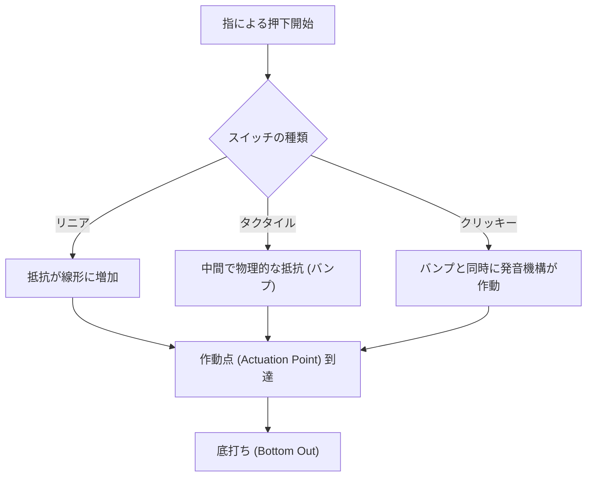
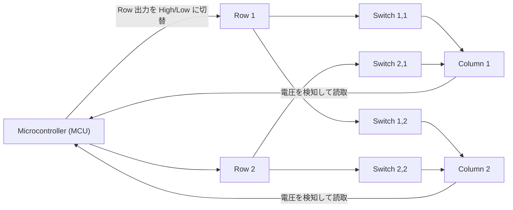
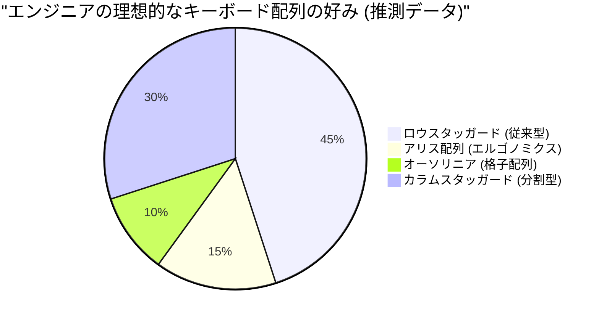

# 長時間のコーディングに！エンジニアにおすすめのメカニカルキーボード5選

プログラマー、システムエンジニア、データサイエンティストなど、IT業界で働くプロフェッショナルにとって、キーボードは単なる入力機器ではありません。それは「思考をコードという形に変換するためのインターフェース」であり、毎日何時間も直接触れ続ける最も重要な仕事道具です。

粗悪なキーボードを使い続けることは、タイピング速度の低下を招くだけでなく、手首や指の関節への過度な負担、ひいては腱鞘炎（手根管症候群など）のリスクを増大させます。逆に、自分の手に馴染み、打鍵感が良く、かつ高度にカスタマイズ可能なキーボードを手に入れることは、生産性と健康の両方を大きく向上させる「最高の投資」となります。

本記事では、エンジニアの皆様に向けて、単なる「おすすめ」を超えた、キーボードの物理学から内部の電子回路、そして最新のファームウェア技術に至るまでを徹底的に解説します。その上で、真に実用に耐えうる究極のキーボード5選をご紹介します。

## 1. キースイッチの物理学とメカニズム

キーボードの打鍵感を決定づける最も重要な要素が「キースイッチ」です。メカニカルキーボードのスイッチは、スプリング（ばね）と接点機構によって構成されており、その物理的な特性が私たちの指先にフィードバックとして伝わります。

### 1.1 フックの法則とばね定数

メカニカルスイッチの押下圧（Actuation Force）は、主に内部に仕込まれたスプリングの特性によって決まります。このスプリングの挙動は、古典力学における「フックの法則（Hooke's Law）」で近似的に表すことができます。

$$ F = -k x $$

ここで、$F$ は復元力（指が感じる反発力）、$k$ はスプリングのばね定数、$x$ は押し込んだ距離（ストローク）です。
リニアスイッチ（赤軸や黒軸など）の場合、このフックの法則にほぼ忠実に従い、押し込むほどに比例して反発力が強くなるという直線的な（Linear）特性を持ちます。

### 1.2 作動エネルギーの積分計算

キーを「入力された」と認識する点を作動点（Actuation Point）と呼びます。キーを押し始めてから作動点 $x_a$ に到達するまでに指が費やすエネルギー（仕事量） $E$ は、力の距離による積分で表されます。

$$ E = \int_{0}^{x_a} F(x) \, dx $$

タクタイルスイッチ（茶軸）やクリッキースイッチ（青軸）の場合、接点が擦れる物理的な抵抗（タクタイルバンプ）が存在するため、$F(x)$ は単純な一次関数ではなく、特定のストローク位置で非線形にピークを迎える関数となります。

エンジニアが長時間コーディングを行う場合、この $E$（作動エネルギー）が大きすぎると指が疲れやすくなり、小さすぎるとミスタイプ（誤爆）が増加します。一般的に、45g〜55g程度の作動力を持つスイッチが、疲労軽減と正確性のバランスが取れているとされ、多くのエンジニアに好まれます。

### 1.3 最先端のスイッチ技術：静電容量無接点とホール効果

物理的な金属接点を持たない、より高度なスイッチ技術も存在します。

**静電容量無接点方式（Topre）**
円錐形のスプリングとラバードームを用い、押し込むことによる静電容量の変化を検知して入力を判定します。物理的な接点がないため摩耗が極めて少なく、チャタリング（1回の押下で複数回入力されてしまう現象）が発生しません。ラバードームによる独特の「スコココ」という打鍵感は、一度味わうと離れられない魅力があります。

**磁気スイッチ（Hall Effect）**
ホール効果を利用し、ステム（軸）に埋め込まれた磁石が基板上のホールセンサーに近づくことによる磁束密度の変化を電圧として読み取ります。
ホール効果による起電力 $V_H$ は以下の式で表されます。

$$ V_H = R_H \left( \frac{I \cdot B}{t} \right) $$

ここで、$R_H$ はホール係数、$I$ は電流、$B$ は磁束密度、$t$ は導体の厚さです。この技術により、キーストロークの深さをアナログ値として連続的に取得でき、「作動点を0.1mm単位で変更する（Actuation Point Adjustment）」ことや、「キーを戻し始めた瞬間にオフにする（Rapid Trigger）」といった驚異的な制御が可能になります。

## 2. キーボードの電子回路とパフォーマンス指標

スイッチが優れていても、それを処理する電子回路やマイコン（Microcontroller）の性能が低ければ、最高のパフォーマンスは発揮できません。

### 2.1 マトリックススキャンとポーリングレート

キーボード内部には、数十から100以上のスイッチが存在しますが、マイコンのピン数は限られているため、全てのスイッチを個別のピンに接続することはできません。そのため、スイッチを行（Row）と列（Column）の格子状（マトリックス）に配線し、高速にスキャンすることでどのキーが押されたかを判定しています。

**ポーリングレート（Polling Rate）** は、キーボードがPCに対して「現在のキーの状態」を報告する頻度です。標準的なキーボードは 125Hz（8msに1回）ですが、ハイエンドモデルでは 1000Hz（1msに1回）や、最近では 8000Hz（0.125msに1回）といった超高速な通信を行うものもあります。
コーディングにおいては1000Hzあれば十分すぎる性能ですが、超高速タイピング時の取りこぼしを防ぐ安心感に繋がります。

### 2.2 Nキーロールオーバー (NKRO) とアンチゴースト

**Nキーロールオーバー（N-Key Rollover）** とは、複数のキーを同時に押した際に、そのすべてが正確に認識される機能です。USB接続の制約から過去には「6キーまで」といった制限がありましたが、現在のハイエンドキーボードはUSBのHIDレポートを工夫することで、実質無制限の同時押し（Full NKRO）を実現しています。

VimやEmacsといったエディタで複雑なショートカット（例: `Ctrl + Shift + Alt + 任意のキー` など）を多用するエンジニアにとって、完全なNKROは必須条件です。

### 2.3 デバウンス遅延 (Debounce Delay)

金属接点を持つメカニカルスイッチは、押下時や離上時に接点が微小に跳ねる「バウンス現象」が発生します。これをマイコン側で無視するための処理時間が**デバウンス遅延**です。通常は5ms〜20ms程度の遅延が意図的に設けられますが、前述の静電容量無接点方式や磁気スイッチでは、物理的な接点ノイズが存在しないため、デバウンス遅延をゼロ（または極小）に設定することができ、圧倒的なレスポンスを実現します。

## 3. ファームウェアとカスタマイズ性（QMK / VIA）

ハードウェアが「肉体」だとすれば、ファームウェアはキーボードの「頭脳」です。現代のエンジニア向けハイエンドキーボードは、単にキーコードを送るだけでなく、高度なプログラムを実行する能力を持っています。

### 3.1 QMK Firmware

**QMK (Quantum Mechanical Keyboard)** は、オープンソースのキーボードファームウェアです。C言語で記述されており、キーマップの変更から、マクロの作成、LEDアニメーションの制御まで、文字通り「あらゆること」が可能です。

### 3.2 高度なキーアサイン機能

QMKが提供する機能の中で、特にエンジニアの生産性を爆発的に高めるのが以下の機能です。

- **レイヤー機能 (Layers):** スマホのキーボードで「文字」と「数字」を切り替えるように、特定のキー（Fnキーなど）を押している間だけ、キーボード全体の配列を別のものに切り替えます。ホームポジションから手を動かさずに、矢印キーやマクロ、記号を入力可能にします。
- **Mod-Tap:** 1つのキーに「短くタップしたとき」と「長くホールドしたとき」で別の役割を持たせます。例えば、スペースキーを「タップでSpace、ホールドでShift」に設定する（Space Cadet Shift）ことで、親指の有効活用が可能になります。
- **Home Row Mods:** ホームポジションのキー（ASDF, JKL;など）に、ホールド時のモディファイア（Ctrl, Shift, Alt, GUI）を割り当てる手法です。小指を酷使してCtrlキーを伸ばして押す必要がなくなり、VimやEmacsユーザーの手首の疲労を劇的に軽減します。

### 3.3 VIA / VIAL によるリアルタイム設定

QMKの欠点は「設定変更のたびにソースコードをコンパイルし、ファームウェアをフラッシュ（書き込み）する必要がある」ことでした。これを解決したのが **VIA** や **VIAL** です。これらはGUIアプリケーション（またはWebブラウザ上）からキーボードにアクセスし、再起動なしでリアルタイムにキーマップを書き換えることができます。

## 4. エルゴノミクスと配列の科学

一般的な「ロウスタッガード（行ごとにキーがずれている配列）」は、タイプライターの物理的なアームが絡まないようにするための名残であり、人間の手の構造に基づいたものではありません。

より人間工学（エルゴノミクス）に配慮した配列として、以下のようなものがあります。

- **オーソリニア (Ortholinear):** キーが縦横完全に一直線の格子状に並んだ配列。指の曲げ伸ばしが直線的になり、運指の無駄が減ります。
- **カラムスタッガード (Columnar Stagger):** 人間の指の長さ（中指が長く、小指が短い）に合わせて、縦の列（カラム）をずらした配列。自然な手の形でタイピングできます。
- **分割型 (Split):** 左右の手を完全に離して配置できるため、肩を開き、胸を張った自然な姿勢でタイピングでき、肩こりやストレートネックの予防に絶大な効果を発揮します。

## 5. エンジニアにおすすめの究極メカニカルキーボード5選

物理学、電子回路、ファームウェア、そしてエルゴノミクスの観点を踏まえ、長時間のコーディングに耐えうる真のプロフェッショナル向けキーボードを5つ厳選しました。

---

### 1. Keychron Qシリーズ (Q1 Pro / Q8 等) - カスタムキーボードの世界への入り口

香港発のKeychronは、昨今のカスタムキーボードブームを牽引する存在です。中でも「Qシリーズ」はフルアルミニウムの重厚なボディと、打鍵音を極限までチューニングする「ガスケットマウント（Gasket Mount）」構造を採用しています。

- **スイッチ:** メカニカル（ホットスワップ対応。自由にスイッチを交換可能）
- **ファームウェア:** QMK/VIA 完全対応
- **特徴:** macOS/Windows両対応の切り替えスイッチ。アリス配列のQ8や、75%配列のQ1など、好みの配列を選択可能。
- **エンジニアへのメリット:** 既製品でありながら、自作キーボードに匹敵する極上の打鍵感とカスタマイズ性を箱出しですぐに味わえます。VIAを使ってVim風の矢印レイヤーを組むのに最適です。

---

### 2. HHKB Studio - ハッカーのためのオールインワン・ポインティングデバイス

「Happy Hacking Keyboard (HHKB)」は、UNIXプログラマーのために生まれた伝説的なキーボードです。最新の「HHKB Studio」は、従来の静電容量無接点方式ではなく、専用開発の静音メカニカルスイッチを採用し、さらなる進化を遂げました。

- **スイッチ:** リニア・静音メカニカルスイッチ（Kailh製、ホットスワップ対応）
- **特徴:** キーボード中央のポインティングスティック（トラックポイント）、4つのジェスチャーパッド。
- **エンジニアへのメリット:** ホームポジションから一切手を離さずに、マウスカーソルの操作、スクロール、ウィンドウの切り替えが完結します。一度この「全てが指先で完結する体験」を味わうと、二度と右手をマウスに伸ばす作業には戻れません。

---

### 3. ZSA Moonlander / ErgoDox EZ - 究極の分割エルゴノミクス

カナダのZSAが開発する分割キーボードの最高峰です。左右が独立しており、肩幅に合わせて配置できるため、長時間のタイピングでも肩や首への負担が驚くほど軽減されます。

- **スイッチ:** メカニカル（Cherry MX互換、ホットスワップ対応）
- **ファームウェア:** QMKベース（独自の強力なGUIツール「Oryx」を使用）
- **特徴:** カラムスタッガード配列、親指専用のクラスターキー、テント（傾斜）をつけるための脚が標準装備。
- **エンジニアへのメリット:** 親指にEnter, Space, Backspace, Layer切り替えを割り当てることで、最も力の弱い小指の負担を激減させます。手根管症候群に悩むエンジニアにとっての救世主となるデバイスです。

---

### 4. REALFORCE R3 - 国産の信頼と至高の打鍵感（静電容量無接点方式）

東プレが誇る日本のマスターピース。金融機関などのプロフェッショナルな現場で長年使われてきた実績はダテではありません。R3世代からはBluetooth接続にも対応しました。

- **スイッチ:** 静電容量無接点方式 (Topre)
- **特徴:** APC（アクチュエーションポイントチェンジャー）機能により、作動点を0.8mm, 1.5mm, 2.2mm, 3.0mmからキーごとに設定可能。
- **エンジニアへのメリット:** 物理接点がないことによる滑らかなキータッチは「フェザータッチ」と呼ばれ、長時間のコーディングでも指への反発ストレスが最小限に抑えられます。小指で押すキー（AやEnterなど）だけ作動点を浅く（0.8mm）設定し、軽く触れるだけで反応させるようなカスタマイズが可能です。

---

### 5. Wooting 60HE - 磁気スイッチがもたらす革命的レスポンス

元々はeスポーツ・ゲーマー向けに開発されたキーボードですが、その革新的なテクノロジーは、最速のタイピングとレスポンスを求めるエンジニアの間でも高く評価されています。

- **スイッチ:** Lekker Switch（ホール効果磁気スイッチ）
- **特徴:** ラピッドトリガー機能、0.1mmから4.0mmまで0.1mm単位で調整可能な作動点。
- **エンジニアへのメリット:** アナログ入力を活かし、「少し押し込んだら小文字、深く押し込んだら大文字（Shiftとの組み合わせ）」といった変態的な設定（Dynamic Keystroke）が可能です。また、指を少しでも浮かせた瞬間にキーオフになるため、高速タイピング時の意図しないキーの連続入力を防ぎ、比類なき正確な入力体験を提供します。

## おわりに

キーボード選びは、エンジニアとしてのキャリアを通じた「自分自身のインターフェースの最適化」プロセスです。フックの法則に従う物理的なスプリングの感触から、積分によって計算される作動エネルギー、QMKによるマクロ構築、そして究極のエルゴノミクスまで、追求すべき奥深さは底なしです。

今回紹介した5つのキーボード（Keychron, HHKB Studio, Moonlander, REALFORCE, Wooting）は、それぞれ異なるアプローチで「最高の入力体験」を目指した傑作ばかりです。ぜひ、ご自身のタイピングスタイルや抱えている身体の悩みに合わせて、最高の相棒を見つけてください。

キーボードへの投資は、必ずや「数百万行のバグのないコード」となって、あなたにリターンをもたらしてくれるはずです。
