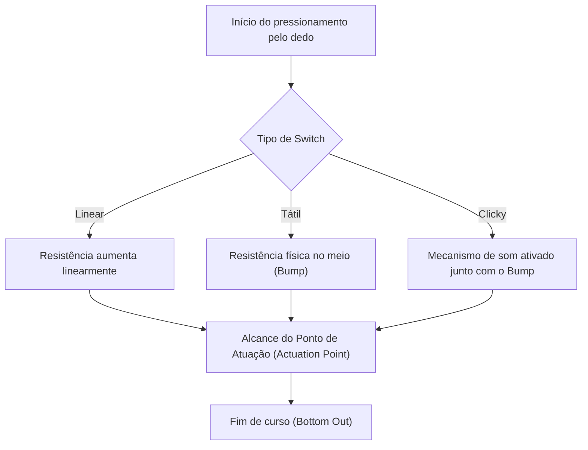
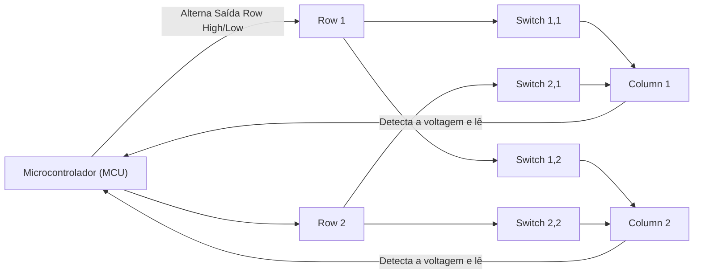
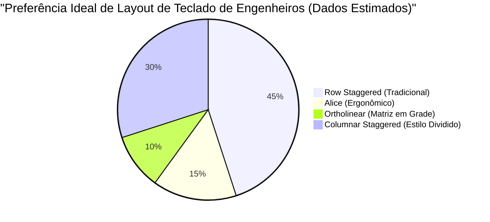

# Para longas horas de código! 5 teclados mecânicos recomendados para engenheiros

Para programadores, engenheiros de sistemas, cientistas de dados e outros profissionais que trabalham na indústria de TI, o teclado não é apenas um dispositivo de entrada. É a "interface para transformar pensamentos em código", e a ferramenta de trabalho mais importante com a qual você interage diretamente por horas todos os dias.

Continuar usando um teclado de baixa qualidade não apenas causa uma diminuição na velocidade de digitação, mas também sobrecarrega os pulsos e as articulações dos dedos, aumentando o risco de tendinite (como a síndrome do túnel do carpo). Por outro lado, adquirir um teclado que se adapta bem às suas mãos, tem uma boa sensação tátil e é altamente personalizável é o "melhor investimento" que melhorará significativamente tanto a sua produtividade quanto a sua saúde.

Neste artigo, explicaremos detalhadamente aos engenheiros, indo muito além de uma simples "recomendação", desde a física do teclado, passando pelos circuitos eletrônicos internos, até a mais recente tecnologia de firmware. Em seguida, apresentaremos os 5 teclados definitivos que são verdadeiramente práticos para o uso profissional.

## 1. A Física e o Mecanismo dos Key Switches (Interruptores)

O elemento mais importante que determina a sensação tátil de um teclado é o "switch" (interruptor). Os switches dos teclados mecânicos são compostos por uma mola e um mecanismo de contato, e as suas características físicas são transmitidas como feedback para a ponta dos nossos dedos.

### 1.1 Lei de Hooke e a Constante da Mola

A força de atuação (Actuation Force) de um switch mecânico é determinada principalmente pelas características da mola alojada em seu interior. O comportamento desta mola pode ser expresso de forma aproximada através da "Lei de Hooke" da mecânica clássica.

$$ F = -k x $$

Aqui, $F$ é a força de restauração (força de repulsão sentida pelo dedo), $k$ é a constante da mola, e $x$ é a distância pressionada (curso/stroke).
No caso dos switches lineares (como switches Red e Black), eles seguem esta Lei de Hooke quase fielmente, tendo uma característica linear (Linear) em que a força de repulsão aumenta proporcionalmente à medida que são pressionados.

### 1.2 Cálculo Integral da Energia de Atuação

O ponto em que a tecla é reconhecida como "pressionada" é chamado de Ponto de Atuação (Actuation Point). A energia (trabalho) $E$ despendida pelo dedo desde o início da pressão até atingir o ponto de atuação $x_a$ é expressa pela integral da força pela distância.

$$ E = \int_{0}^{x_a} F(x) \, dx $$

No caso de switches táteis (switch Brown) ou clicky (switch Blue), devido à presença de resistência física do contato (bump tátil), a função $F(x)$ não é uma função linear simples, mas uma função não linear que atinge um pico em um ponto específico do curso.

Quando engenheiros programam por longas horas, se esta $E$ (energia de atuação) for muito grande, os dedos cansam facilmente, e se for muito pequena, aumentam os erros de digitação (typos). Geralmente, considera-se que switches com uma força de atuação de cerca de 45g a 55g têm um bom equilíbrio entre redução da fadiga e precisão, sendo preferidos por muitos engenheiros.

### 1.3 Tecnologia de Switch de Ponta: Capacitivo Sem Contato e Efeito Hall

Também existem tecnologias de switches mais avançadas que não possuem contatos físicos de metal.

**Capacitivo Sem Contato (Topre)**
Utiliza uma mola cônica e uma cúpula de borracha (rubber dome) para detectar a alteração da capacitância eletrostática ao ser pressionada, registrando a entrada. Como não há contatos físicos, o desgaste é extremamente baixo e não ocorre chattering (o fenômeno de múltiplas entradas sendo registradas com apenas um toque). A sensação tátil única do rubber dome, descrita frequentemente como um som suave, tem um charme que, depois de experimentada, é difícil de abandonar.

**Switch Magnético (Hall Effect)**
Utilizando o Efeito Hall, as mudanças na densidade do fluxo magnético quando o ímã embutido na haste (stem) se aproxima do sensor Hall na placa de circuito são lidas como tensão elétrica.
A força eletromotriz do Efeito Hall $V_H$ é dada pela seguinte fórmula.

$$ V_H = R_H \left( \frac{I \cdot B}{t} \right) $$

Aqui, $R_H$ é o coeficiente de Hall, $I$ é a corrente, $B$ é a densidade do fluxo magnético, e $t$ é a espessura do condutor. Com essa tecnologia, a profundidade do pressionamento da tecla pode ser obtida continuamente como um valor analógico, permitindo controles impressionantes, como "alterar o ponto de atuação em passos de 0,1 mm (Actuation Point Adjustment)" e "desativar a tecla no instante em que começa a voltar (Rapid Trigger)".

## 2. Circuitos Eletrônicos do Teclado e Métricas de Desempenho

Mesmo que o switch seja excelente, se o circuito eletrônico e o microcontrolador (MCU) que o processam tiverem baixo desempenho, o máximo de performance não será alcançado.

### 2.1 Varredura de Matriz (Matrix Scan) e Polling Rate

Dentro de um teclado existem dezenas a mais de 100 switches, mas como o número de pinos do microcontrolador é limitado, não é possível conectar todos os switches a pinos individuais. Por isso, os switches são organizados numa grade (matriz) de linhas (Rows) e colunas (Columns) e varridos em alta velocidade para determinar qual tecla foi pressionada.

**Polling Rate (Taxa de Atualização)** é a frequência com que o teclado informa ao PC o "estado atual das teclas". Um teclado padrão opera em 125Hz (1 vez a cada 8ms), mas modelos high-end podem realizar comunicação ultra-rápida de 1000Hz (1 vez a cada 1ms) ou, mais recentemente, 8000Hz (1 vez a cada 0.125ms).
Para programação, 1000Hz é mais do que suficiente, e traz a tranquilidade de evitar perda de entradas durante digitação ultra-rápida.

### 2.2 N-Key Rollover (NKRO) e Anti-Ghosting

**N-Key Rollover (NKRO)** é o recurso que permite que várias teclas sejam reconhecidas corretamente quando pressionadas simultaneamente. No passado, restrições na conexão USB impunham limites como "até 6 teclas", mas os teclados de alta qualidade atuais implementam truques no relatório HID do USB para alcançar o reconhecimento simultâneo praticamente ilimitado (Full NKRO).

Para engenheiros que usam muitos atalhos complexos (ex: `Ctrl + Shift + Alt + Qualquer Tecla`) em editores como Vim ou Emacs, o NKRO completo é um requisito fundamental.

### 2.3 Atraso de Debounce (Debounce Delay)

Switches mecânicos com contatos de metal sofrem o "fenômeno de bounce (ressalto)", onde os contatos vibram microscopicamente ao serem pressionados ou soltos. O tempo de processamento necessário no microcontrolador para ignorar esse efeito é o **Atraso de Debounce**. Normalmente um atraso de 5ms a 20ms é configurado intencionalmente, mas nos switches magnéticos ou capacitivos mencionados anteriormente, por não existir ruído de contato físico, o debounce pode ser configurado para zero (ou quase zero), proporcionando uma resposta avassaladora.

## 3. Firmware e Personalização (QMK / VIA)

Se o hardware é o "corpo", o firmware é o "cérebro" do teclado. Os modernos teclados premium para engenheiros não se limitam a enviar códigos de teclas, eles possuem a capacidade de executar programas avançados.

### 3.1 Firmware QMK

O **QMK (Quantum Mechanical Keyboard)** é um firmware de código aberto para teclados. Ele é escrito em C e permite literalmente "qualquer coisa", desde alterar o mapeamento das teclas, criar macros, até controlar animações de LEDs.

### 3.2 Funções Avançadas de Atribuição de Teclas

Dentre as funções que o QMK oferece, as seguintes aumentam explosivamente a produtividade de engenheiros:

- **Camadas (Layers):** Assim como alternar entre "letras" e "números" num teclado de celular, você pode mudar o layout de todo o teclado enquanto pressiona uma tecla específica (como a tecla Fn). Permite inserir teclas de setas, macros e símbolos sem mover as mãos da posição inicial.
- **Mod-Tap:** Permite que uma única tecla tenha funções diferentes "quando tocada rapidamente" e "quando segurada". Por exemplo, configurar a barra de espaço para "Espaço num toque, e Shift se segurada" (Space Cadet Shift), possibilita o uso eficiente do polegar.
- **Home Row Mods:** Uma técnica de atribuir modificadores (Ctrl, Shift, Alt, GUI) para serem ativados quando segurados nas teclas da posição de descanso (Home Row, como ASDF, JKL;). Elimina a necessidade de esticar o dedo mínimo para pressionar a tecla Ctrl, reduzindo drasticamente o cansaço no pulso dos utilizadores de Vim e Emacs.

### 3.3 Configuração em Tempo Real com VIA / VIAL

A desvantagem do QMK era a necessidade de "compilar o código-fonte e regravar (fazer flash) o firmware toda vez que uma configuração fosse alterada". Isso foi resolvido pelo **VIA** e **VIAL**. Eles permitem acessar o teclado por um aplicativo GUI (ou direto no navegador web) e reescrever o mapa de teclas em tempo real sem precisar reiniciar o dispositivo.

## 4. Ergonomia e a Ciência dos Layouts

O "Row Staggered" (layout em que as teclas são deslocadas diagonalmente por linha) comum é um resquício da necessidade de evitar que as hastes mecânicas das máquinas de escrever se cruzassem, não sendo baseado na anatomia da mão humana.

Para uma melhor ergonomia (ergonomics), existem arranjos como os seguintes:

- **Ortholinear (Matriz em Grade):** Um layout onde as teclas estão dispostas em uma grade perfeitamente alinhada horizontal e verticalmente. O movimento dos dedos torna-se retilíneo, minimizando o desperdício no percurso.
- **Columnar Staggered (Coluna Deslocada):** Um layout que desloca as colunas verticais para corresponder ao comprimento dos dedos humanos (o dedo médio é o mais longo e o mínimo é o mais curto). Permite digitar com a forma natural da mão.
- **Dividido (Split):** Como as mãos direita e esquerda podem ser colocadas completamente separadas, permite a digitação com uma postura mais natural, com os ombros abertos e peito erguido, sendo altamente eficaz na prevenção de dores nos ombros e pescoço rígido (text neck).

## 5. 5 Teclados Mecânicos Definitivos Recomendados para Engenheiros

Com base na física, circuitos eletrônicos, firmware e ergonomia, selecionamos os 5 teclados voltados para profissionais, capazes de suportar longas sessões de codificação.

---

### 1. Série Keychron Q (Q1 Pro / Q8 etc.) - A Porta de Entrada para Teclados Customizados

Originária de Hong Kong, a Keychron é líder no boom atual dos teclados personalizados. Destaca-se a "Série Q", com corpos robustos totalmente de alumínio e sistema "Gasket Mount" afinado para maximizar a qualidade do som de digitação.

- **Switches:** Mecânicos (Hot-swappable. Possibilita a troca livre de switches)
- **Firmware:** Suporte total para QMK/VIA
- **Características:** Chave de alternância entre macOS/Windows. Escolha do layout preferido, incluindo a série Q8 com layout Alice e Q1 no formato 75%.
- **Vantagens para engenheiros:** Apesar de ser um produto pronto, proporciona direto da caixa uma excelente experiência de digitação e personalização comparável a teclados montados do zero. Ideal para usar VIA e configurar uma camada de setas no estilo Vim.

---

### 2. HHKB Studio - O Dispositivo de Apontamento All-in-one para Hackers

"Happy Hacking Keyboard (HHKB)" é o teclado lendário criado para programadores UNIX. O mais recente "HHKB Studio" evoluiu além do formato capacitivo clássico, utilizando novos switches mecânicos silenciosos desenvolvidos exclusivamente.

- **Switches:** Switches mecânicos silenciosos lineares (fabricados pela Kailh, Hot-swappable)
- **Características:** Pointing stick (Trackpoint) no centro do teclado, e 4 pads de gestos (Gesture Pads).
- **Vantagens para engenheiros:** Você pode controlar o cursor do mouse, fazer scroll e alternar janelas sem remover as mãos da posição base. Uma vez experimentada "a experiência de ter tudo na ponta dos dedos", é difícil querer voltar a levar a mão direita até um mouse.

---

### 3. ZSA Moonlander / ErgoDox EZ - O Definitivo em Ergonomia Dividida

O ápice dos teclados divididos desenvolvidos pela ZSA do Canadá. O lado esquerdo e direito são independentes, permitindo ajustá-los de acordo com a largura dos ombros e reduzindo drasticamente a carga sobre o pescoço e ombros em digitações prolongadas.

- **Switches:** Mecânicos (Compatíveis com Cherry MX, Hot-swappable)
- **Firmware:** Baseado em QMK (com sua própria ferramenta gráfica poderosa, o "Oryx")
- **Características:** Layout Columnar Staggered, botões específicos agrupados para o polegar, pés padrão (tenting legs) para inclinação.
- **Vantagens para engenheiros:** Atribuir as teclas Enter, Space, Backspace, e mudanças de Layer aos polegares alivia extremamente os dedos mínimos que têm menos força. É o dispositivo que salvará engenheiros que sofrem da Síndrome do Túnel do Carpo.

---

### 4. REALFORCE R3 - Confiança Japonesa com Sensação Suprema (Capacitivo sem Contato)

Uma obra-prima japonesa da qual a Topre se orgulha. Seu histórico de ser usado por muitos anos por profissionais, como em instituições financeiras, não é em vão. A geração R3 agora também inclui conectividade Bluetooth.

- **Switches:** Capacitivos Sem Contato (Topre)
- **Características:** A funcionalidade APC (Actuation Point Changer) permite definir o ponto de atuação individual por tecla, entre 0,8 mm, 1,5 mm, 2,2 mm, e 3,0 mm.
- **Vantagens para engenheiros:** A suavidade no toque resultante de não haver contato físico é apelidada de "feather touch", reduzindo o stress e a resistência nos dedos mesmo ao codificar durante muito tempo. Você pode personalizar as teclas usadas com o dedo mínimo (como o "A" ou "Enter") para reagir a uma pressão mais rasa (0,8 mm), acionando-as com o menor toque.

---

### 5. Wooting 60HE - Resposta Revolucionária dos Switches Magnéticos

Originalmente desenvolvido para jogadores de e-sports, a sua tecnologia inovadora é altamente valorizada entre os engenheiros que procuram uma velocidade de digitação e resposta mais rápidas.

- **Switches:** Lekker Switch (Switches magnéticos de efeito Hall)
- **Características:** Recurso de Rapid Trigger, ajustável o ponto de atuação de 0,1 mm a 4,0 mm, num incremento de 0,1 mm.
- **Vantagens para engenheiros:** Graças ao input analógico, é possível fazer configurações não convencionais (Dynamic Keystroke), como "escrever uma letra minúscula num leve toque, e uma letra maiúscula (combinação com Shift) se pressionar mais fundo". Além disso, ele desliga o acionamento (key off) assim que você soltar um pouco o dedo, evitando comandos em sucessão indesejados e provendo uma experiência insuperavelmente precisa para datilógrafos rápidos.

## Conclusão

A escolha de um teclado é um processo de "otimização da sua própria interface" que ocorre ao longo da sua carreira como engenheiro. Desde a sensação física da mola descrita pela lei de Hooke e a energia de atuação determinada pelo cálculo da integral, à construção de macros por QMK e a busca incansável pela ergonomia, há muito no que se aprofundar.

Os 5 teclados apresentados desta vez (Keychron, HHKB Studio, Moonlander, REALFORCE, Wooting) são verdadeiras obras-primas que procuram a "melhor experiência de digitação" usando as suas próprias abordagens. Esperamos que encontre o parceiro ideal com base no seu estilo de digitação ou qualquer restrição de desconforto físico.

O investimento num teclado reverter-se-á em valor em forma de "milhões de linhas de código sem bugs".
