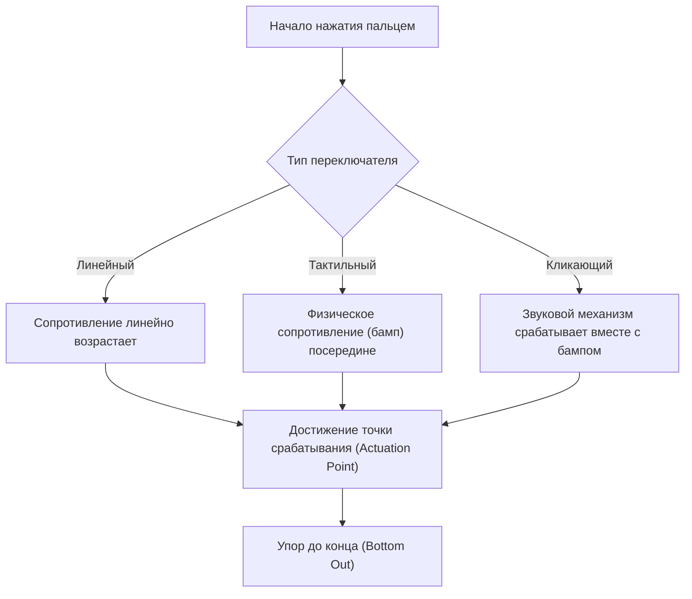
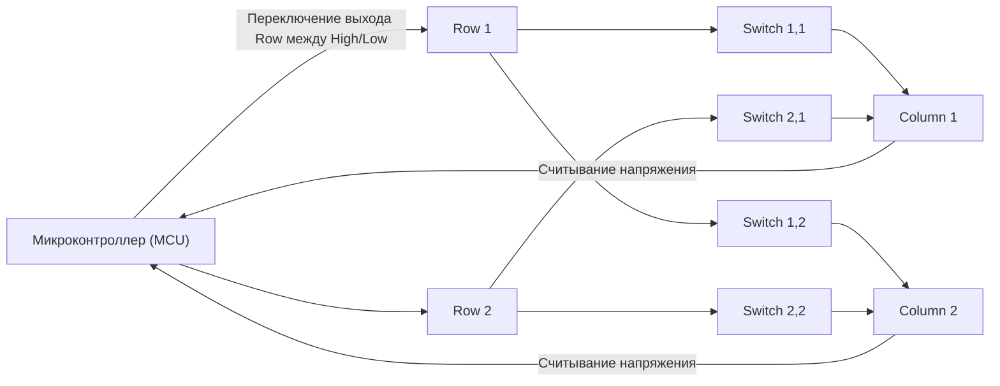
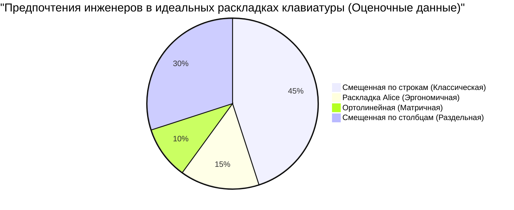

# Для долгих часов кодинга! 5 лучших механических клавиатур для инженеров

Для профессионалов, работающих в IT-индустрии, таких как программисты, системные инженеры и дата-саентисты, клавиатура — это не просто устройство ввода. Это «интерфейс для преобразования мыслей в форму кода» и самый важный рабочий инструмент, с которым они непосредственно контактируют по несколько часов каждый день.

Продолжительное использование некачественной клавиатуры не только приводит к снижению скорости набора текста, но и увеличивает чрезмерную нагрузку на запястья и суставы пальцев, что в свою очередь повышает риск развития тендинита (например, кистевого туннельного синдрома). И наоборот, приобретение клавиатуры, которая идеально ложится под руки, имеет приятный ход клавиш и обладает широкими возможностями кастомизации, является «лучшей инвестицией», значительно улучшающей как продуктивность, так и здоровье.

В этой статье мы не просто дадим «рекомендации» для инженеров, а подробно разберем все аспекты: от физики клавиатур и их внутренних электронных схем до новейших технологий прошивок. На основе этого мы представим 5 бескомпромиссных клавиатур, которые по-настоящему выдерживают испытание практическим использованием.

## 1. Физика и механизмы переключателей клавиш

Самым важным элементом, определяющим тактильные ощущения от клавиатуры, является «переключатель» (свитч). Механические переключатели состоят из пружины и контактного механизма, чьи физические свойства передаются на кончики наших пальцев в виде обратной связи.

### 1.1 Закон Гука и жесткость пружины

Сила нажатия (Actuation Force) механического переключателя в первую очередь определяется характеристиками установленной внутри пружины. Поведение этой пружины можно приблизительно описать «законом Гука (Hooke's Law)» из классической механики.

$$ F = -k x $$

Где $F$ — это возвращающая сила (сила сопротивления, которую чувствует палец), $k$ — коэффициент жесткости пружины, а $x$ — расстояние нажатия (ход клавиши).
В случае линейных переключателей (таких как красные или черные), они почти строго следуют этому закону Гука, обладая линейной (Linear) характеристикой, при которой сила сопротивления возрастает пропорционально глубине нажатия.

### 1.2 Вычисление энергии срабатывания через интеграл

Точка, в которой нажатие клавиши распознается как «введенное», называется точкой срабатывания (Actuation Point). Энергия (работа) $E$, затрачиваемая пальцем с момента начала нажатия до достижения точки срабатывания $x_a$, выражается интегралом силы по расстоянию.

$$ E = \int_{0}^{x_a} F(x) \, dx $$

Для тактильных (коричневых) и кликающих (синих) переключателей существует физическое сопротивление от трения контактов (тактильный бамп), поэтому $F(x)$ не является простой линейной функцией, а имеет нелинейный пик на определенном отрезке хода клавиши.

Когда инженеры занимаются кодингом в течение длительного времени, если эта $E$ (энергия срабатывания) слишком велика, пальцы быстро устают, а если слишком мала — увеличивается количество опечаток (случайных нажатий). В целом считается, что переключатели с силой срабатывания от 45г до 55г обеспечивают идеальный баланс между снижением усталости и точностью, поэтому они предпочитаются многими инженерами.

### 1.3 Передовые технологии переключателей: электроемкостные бесконтактные и на эффекте Холла

Существуют также более продвинутые технологии переключателей, которые не имеют физических металлических контактов.

**Электроемкостные бесконтактные (Topre)**
Используют коническую пружину и резиновый купол (rubber dome). Ввод фиксируется за счет изменения электроемкости при нажатии. Так как физического контакта нет, износ крайне мал, и не возникает дребезга контактов (chattering — явление, при котором одно нажатие регистрируется несколько раз). Уникальные тактильные ощущения «скококо», создаваемые резиновым куполом, обладают таким очарованием, что, попробовав их однажды, от них трудно отказаться.

**Магнитные переключатели (Hall Effect)**
Используют эффект Холла: изменение плотности магнитного потока, возникающее при приближении магнита, встроенного в стержень (стем) переключателя, к датчику Холла на плате, считывается как напряжение.
Электродвижущая сила Холла $V_H$ выражается следующей формулой:

$$ V_H = R_H \left( \frac{I \cdot B}{t} \right) $$

Где $R_H$ — коэффициент Холла, $I$ — сила тока, $B$ — плотность магнитного потока, а $t$ — толщина проводника. Эта технология позволяет непрерывно получать глубину нажатия клавиши в виде аналогового значения. Это делает возможным такие удивительные функции, как «изменение точки срабатывания с шагом 0,1 мм (Actuation Point Adjustment)» и «отключение ввода в тот самый момент, когда клавиша начинает возвращаться назад (Rapid Trigger)».

## 2. Электронные схемы клавиатуры и показатели производительности

Даже если переключатели превосходны, клавиатура не сможет показать максимальную производительность, если электронные схемы и микроконтроллер (MCU), обрабатывающие их, имеют низкие характеристики.

### 2.1 Матричное сканирование и частота опроса

Внутри клавиатуры находится от нескольких десятков до более чем сотни переключателей, но количество выводов микроконтроллера ограничено, поэтому невозможно подключить каждый переключатель к отдельному пину. Из-за этого переключатели соединены в виде сетки (матрицы) из строк (Row) и столбцов (Column), и путем высокоскоростного сканирования определяется, какая клавиша была нажата.

**Частота опроса (Polling Rate)** — это частота, с которой клавиатура сообщает ПК о «текущем состоянии клавиш». У стандартных клавиатур она составляет 125 Гц (1 раз в 8 мс), но высококлассные модели обеспечивают 1000 Гц (1 раз в 1 мс), а в последнее время появляются клавиатуры со сверхбыстрой связью на частоте 8000 Гц (1 раз в 0,125 мс).
Для кодинга частоты 1000 Гц более чем достаточно, но это дает чувство уверенности в том, что ни одно нажатие не будет пропущено при сверхбыстрой печати.

### 2.2 N-Key Rollover (NKRO) и анти-гостинг

**N-Key Rollover (NKRO)** — это функция, при которой все клавиши точно распознаются при одновременном нажатии нескольких клавиш. Из-за ограничений USB-подключения в прошлом был лимит «до 6 клавиш», но современные клавиатуры высокого класса за счет оптимизации HID-отчетов USB реализуют практически неограниченное одновременное нажатие (Full NKRO).

Для инженеров, которые часто используют сложные шорткаты в редакторах вроде Vim или Emacs (например, `Ctrl + Shift + Alt + любая клавиша`), полный NKRO является обязательным условием.

### 2.3 Задержка от дребезга (Debounce Delay)

В механических переключателях с металлическими контактами при нажатии и отпускании возникает «эффект дребезга (баунс)», когда контакты микроскопически отскакивают друг от друга. Время обработки со стороны микроконтроллера, чтобы проигнорировать этот эффект, называется **задержкой дребезга (Debounce Delay)**. Обычно намеренно устанавливается задержка около 5–20 мс, но в упомянутых ранее электроемкостных бесконтактных и магнитных переключателях физический шум контактов отсутствует. Это позволяет установить задержку дребезга на ноль (или сделать её минимальной), обеспечивая феноменальную скорость отклика.

## 3. Прошивка и возможности кастомизации (QMK / VIA)

Если аппаратное обеспечение — это «тело», то прошивка — это «мозг» клавиатуры. Современные высококлассные клавиатуры для инженеров обладают способностью не просто отправлять коды клавиш, но и выполнять сложные программы.

### 3.1 QMK Firmware

**QMK (Quantum Mechanical Keyboard)** — это прошивка для клавиатур с открытым исходным кодом. Она написана на языке C и позволяет делать в буквальном смысле «всё»: от изменения раскладки до создания макросов и управления LED-анимацией.

### 3.2 Продвинутые функции назначения клавиш

Среди функций, предоставляемых QMK, следующие особенно сильно повышают продуктивность инженеров:

- **Слои (Layers):** Подобно переключению между «буквами» и «цифрами» на клавиатуре смартфона, эта функция переключает всю раскладку клавиатуры на другую только во время удержания определенной клавиши (например, Fn). Это позволяет вводить стрелки, макросы и символы, не снимая рук с домашней строки.
- **Mod-Tap:** Присваивает одной клавише разные функции при «коротком нажатии (tap)» и «долгом удержании (hold)». Например, установив пробел как «Space при нажатии и Shift при удержании» (Space Cadet Shift), можно эффективно использовать большие пальцы.
- **Home Row Mods:** Метод, при котором клавишам домашнего ряда (ASDF, JKL; и т. д.) назначаются модификаторы (Ctrl, Shift, Alt, GUI) при удержании. Отпадает необходимость растягивать мизинец для нажатия Ctrl, что кардинально снижает усталость запястий у пользователей Vim и Emacs.

### 3.3 Настройка в реальном времени с помощью VIA / VIAL

Недостатком QMK было то, что «для каждого изменения настроек необходимо компилировать исходный код и прошивать (перезаписывать) память». Эту проблему решили **VIA** и **VIAL**. Эти инструменты позволяют получить доступ к клавиатуре через GUI-приложение (или в веб-браузере) и изменять раскладку в реальном времени без необходимости перезагрузки.

## 4. Эргономика и наука о раскладках

Обычная «смещенная по строкам (Row-staggered)» раскладка, где клавиши сдвинуты в каждом ряду, — это пережиток, созданный для того, чтобы физические рычаги печатной машинки не цеплялись друг за друга. Она не основана на анатомии человеческой руки.

Более эргономичные раскладки включают в себя следующие:

- **Ортолинейная (Ortholinear):** Раскладка, в которой клавиши выстроены в идеальную сетку по вертикали и горизонтали. Сгибание и разгибание пальцев становится прямолинейным, уменьшая лишние движения.
- **Смещенная по столбцам (Columnar Stagger):** Раскладка, в которой вертикальные столбцы сдвинуты в соответствии с длиной человеческих пальцев (средний палец длинный, мизинец короткий). Позволяет печатать с естественным положением рук.
- **Раздельная (Split):** Позволяет полностью разделить клавиатуру для левой и правой руки. Вы можете печатать в естественной позе с расправленными плечами и открытой грудной клеткой, что является крайне эффективным средством для профилактики болей в плечах и синдрома "компьютерной шеи".

## 5. 5 лучших бескомпромиссных механических клавиатур для инженеров

Учитывая аспекты физики, электронных схем, прошивки и эргономики, мы тщательно отобрали 5 клавиатур, предназначенных для настоящих профессионалов и способных выдержать долгие часы кодинга.

---

### 1. Keychron Q Series (Q1 Pro / Q8 и др.) - Вход в мир кастомных клавиатур

Keychron из Гонконга — это бренд, стоящий во главе недавнего бума кастомных клавиатур. В частности, «Серия Q» отличается массивным корпусом из цельного алюминия и конструкцией «Gasket Mount» (прокладочное крепление), которая позволяет максимально точно настроить звук нажатия клавиш.

- **Переключатели:** Механические (с поддержкой горячей замены/Hot-swap. Переключатели можно свободно менять)
- **Прошивка:** Полная поддержка QMK/VIA
- **Особенности:** Переключатель режимов macOS/Windows. Выбор желаемой раскладки, например, Q8 с раскладкой Alice или Q1 с форматом 75%.
- **Преимущества для инженеров:** Будучи готовым продуктом, она "прямо из коробки" предлагает превосходные тактильные ощущения и возможности кастомизации, сравнимые с клавиатурами ручной сборки. Идеально подходит для настройки слоя со стрелками в стиле Vim с помощью VIA.

---

### 2. HHKB Studio - Универсальное указывающее устройство "всё в одном" для хакеров

«Happy Hacking Keyboard (HHKB)» — легендарная клавиатура, созданная для UNIX-программистов. Новейшая модель «HHKB Studio» эволюционировала еще дальше, используя не традиционные электроемкостные бесконтактные переключатели, а специально разработанные бесшумные механические переключатели.

- **Переключатели:** Линейные бесшумные механические переключатели (производства Kailh, поддержка горячей замены)
- **Особенности:** Указывающий джойстик (трекпойнт) в центре клавиатуры, 4 сенсорные панели для жестов.
- **Преимущества для инженеров:** Позволяет управлять курсором мыши, прокруткой и переключением окон, не убирая рук с домашней строки. Ощутив однажды этот опыт, когда «всё делается кончиками пальцев», вы больше никогда не захотите тянуться правой рукой к мыши.

---

### 3. ZSA Moonlander / ErgoDox EZ - Идеальная раздельная эргономика

Вершина раздельных клавиатур, разработанная канадской компанией ZSA. Правая и левая части независимы друг от друга и могут быть размещены на ширине плеч. Это невероятно снижает нагрузку на плечи и шею даже при длительном наборе текста.

- **Переключатели:** Механические (совместимые с Cherry MX, поддержка горячей замены)
- **Прошивка:** На базе QMK (с использованием собственного мощного GUI-инструмента «Oryx»)
- **Особенности:** Раскладка смещенная по столбцам (Columnar Stagger), отдельные блоки клавиш для больших пальцев, ножки для создания наклона (тентинга) в стандартной комплектации.
- **Преимущества для инженеров:** Назначение Enter, Space, Backspace и смены слоев на большие пальцы резко снижает нагрузку на самые слабые мизинцы. Это устройство — настоящее спасение для инженеров, страдающих от кистевого туннельного синдрома.

---

### 4. REALFORCE R3 - Японская надежность и превосходное ощущение от набора текста (Электроемкостная бесконтактная система)

Шедевр из Японии, которым гордится компания Topre. Тот факт, что эти клавиатуры долгие годы использовались в профессиональных сферах, таких как финансовые учреждения, говорит сам за себя. Начиная с поколения R3, появилась поддержка Bluetooth-подключения.

- **Переключатели:** Электроемкостные бесконтактные (Topre)
- **Особенности:** Функция APC (Actuation Point Changer) позволяет устанавливать точку срабатывания индивидуально для каждой клавиши: 0,8 мм, 1,5 мм, 2,2 мм или 3,0 мм.
- **Преимущества для инженеров:** Плавное нажатие клавиш, благодаря отсутствию физических контактов, называют «feather touch» (легкое касание). Оно сводит к минимуму сопротивление на пальцы даже во время долгих сеансов кодинга. Вы можете настроить короткий ход срабатывания (0,8 мм) только для клавиш, нажимаемых мизинцем (например, A и Enter), чтобы они реагировали даже на легкое прикосновение.

---

### 5. Wooting 60HE - Революционный отклик магнитных переключателей

Изначально эта клавиатура была разработана для киберспортсменов, но ее инновационные технологии высоко ценятся и среди инженеров, которым нужна максимальная скорость набора текста и отклик.

- **Переключатели:** Lekker Switch (магнитные переключатели на эффекте Холла)
- **Особенности:** Функция Rapid Trigger, точка срабатывания регулируется от 0,1 мм до 4,0 мм с шагом 0,1 мм.
- **Преимущества для инженеров:** Использование аналогового ввода позволяет делать безумные настройки (Dynamic Keystroke), такие как «ввод строчной буквы при легком нажатии и заглавной буквы (комбинация с Shift) при глубоком нажатии». Кроме того, поскольку ввод отключается в тот момент, когда вы хотя бы слегка приподнимаете палец, это предотвращает нежелательные повторные нажатия при быстром наборе текста и обеспечивает непревзойденно точный ввод.

## Заключение

Выбор клавиатуры — это процесс «оптимизации собственного интерфейса» на протяжении всей вашей карьеры инженера. От физического ощущения пружины, подчиняющейся закону Гука, до энергии срабатывания, вычисляемой с помощью интегралов, создания макросов через QMK и предельной эргономики — глубина поиска здесь поистине бездонна.

Представленные в этот раз 5 клавиатур (Keychron, HHKB Studio, Moonlander, REALFORCE, Wooting) — это шедевры, каждый из которых стремится к «идеальному опыту ввода» с использованием различных подходов. Обязательно найдите своего идеального партнера в соответствии с вашим стилем набора текста и физическими потребностями.

Инвестиции в клавиатуру обязательно окупятся в виде «миллионов строк кода без багов», которые принесут вам немалую отдачу.
