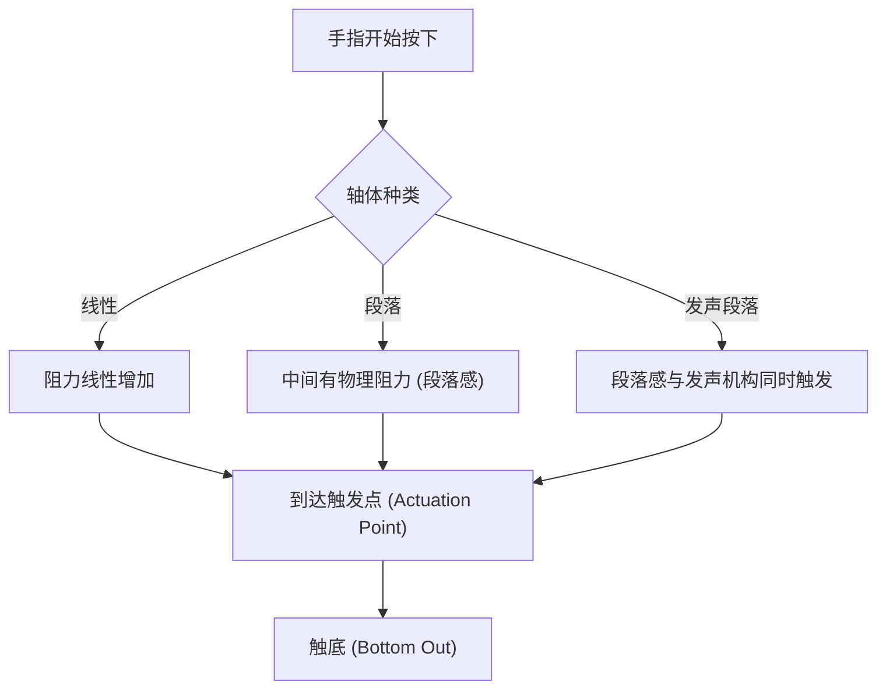
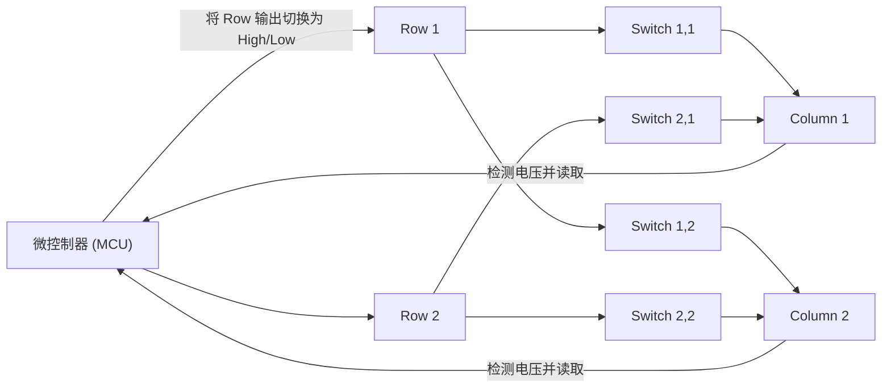
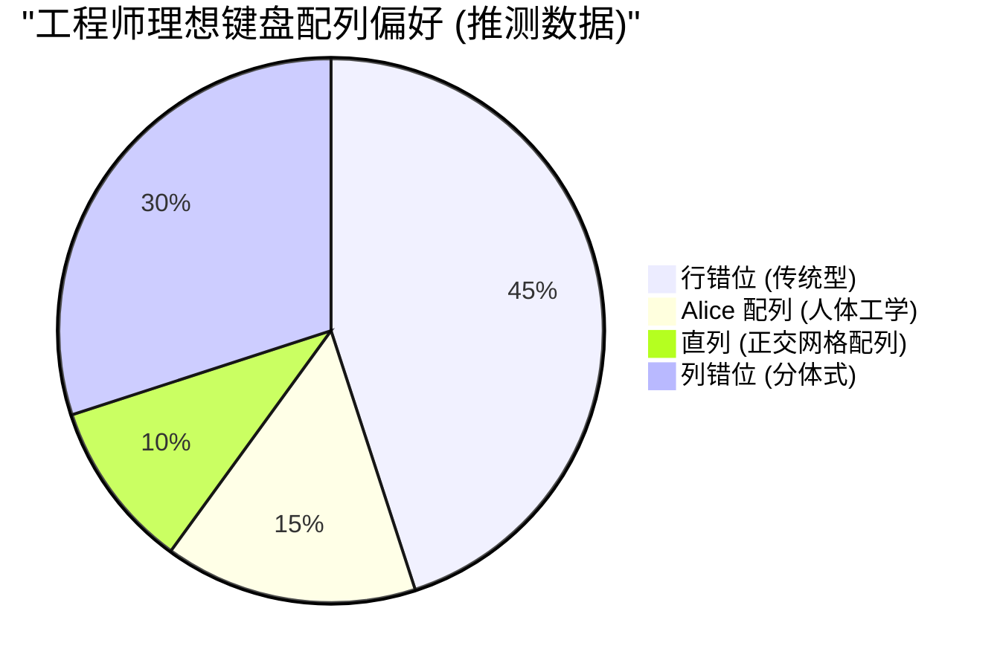

# 专为长时间编程打造！推荐给工程师的 5 款机械键盘

对于程序员、系统工程师、数据科学家等在 IT 行业工作的专业人士来说，键盘不仅仅是一个输入设备。它是“将思想转化为代码形式的接口”，也是每天要连续直接接触好几个小时的最重要的工作工具。

一直使用劣质的键盘不仅会导致打字速度下降，还会对手腕和手指关节造成过度负担，进而增加患腱鞘炎（如腕管综合征）的风险。相反，拥有一款适合自己手型、手感好且高度可定制的键盘，将是极大地提高生产力和健康水平的“最佳投资”。

本文将面向各位工程师，超越单纯的“推荐”，从键盘的物理学到内部电子电路，再到最新的固件技术，为您进行全面彻底的解析。在此基础上，向您介绍 5 款真正经得起实战考验的终极键盘。

## 1. 轴体的物理学与机械结构

决定键盘手感的最重要因素是“轴体（Key Switch）”。机械键盘的轴体由弹簧（Spring）和触点机构组成，其物理特性会作为反馈传达到我们的指尖。

### 1.1 胡克定律与弹性系数

机械轴体的触发压力（Actuation Force）主要由内置弹簧的特性决定。这种弹簧的运动状态，可以近似用经典力学中的“胡克定律（Hooke's Law）”来表示。

$$ F = -k x $$

这里，$F$ 是恢复力（手指感觉到的反弹力），$k$ 是弹簧的弹性系数，$x$ 是按下的距离（键程）。
对于线性轴（如红轴、黑轴等），它几乎完全遵循胡克定律，具有按下越深反弹力成正比增加的线性（Linear）特性。

### 1.2 触发能量的积分计算

将按键识别为“已输入”的点称为触发点（Actuation Point）。从开始按下按键到到达触发点 $x_a$ 手指所消耗的能量（做功） $E$，可以用力随距离的积分来表示。

$$ E = \int_{0}^{x_a} F(x) \, dx $$

对于段落轴（茶轴）或发声段落轴（青轴），由于存在触点摩擦的物理阻力（段落感），$F(x)$ 并不是一个简单的线性函数，而是在特定键程位置非线性达到峰值的函数。

当工程师进行长时间编程时，如果这个 $E$（触发能量）过大，手指就容易疲劳；如果过小，则会增加误触（打错字）的几率。一般来说，触发力在 45g～55g 左右的轴体被认为在减轻疲劳和提高准确性之间取得了平衡，因而受到许多工程师的青睐。

### 1.3 最前沿的轴体技术：静电容无接点与霍尔效应

除了物理金属触点，还存在更高级的轴体技术。

**静电容无接点方式 (Topre)**
使用圆锥形弹簧和橡胶碗，通过检测按下时静电容量的变化来判定输入。因为没有物理触点，所以磨损极小，且不会发生抖动（按一次却被输入多次的现象）。橡胶碗带来的独特“咚咚”手感，有着一旦体验就无法割舍的魅力。

**磁轴 (Hall Effect)**
利用霍尔效应，通过读取嵌入在轴心（Stem）上的磁铁靠近电路板上的霍尔传感器时引起的磁通量密度的变化，将其转化为电压。
由霍尔效应产生的电动势 $V_H$ 可以用以下公式表示：

$$ V_H = R_H \left( \frac{I \cdot B}{t} \right) $$

这里，$R_H$ 是霍尔系数，$I$ 是电流，$B$ 是磁通量密度，$t$ 是导体的厚度。借助这项技术，可以连续获取击键深度的模拟值（Analog），从而实现“以 0.1mm 为单位调整触发点（Actuation Point Adjustment）”以及“在按键开始抬起的瞬间将其关闭（Rapid Trigger）”等惊人的控制。

## 2. 键盘的电子电路与性能指标

即使轴体再优秀，如果处理它的电子电路或微控制器（Microcontroller）性能低下，也无法发挥出最佳表现。

### 2.1 矩阵扫描与回报率

键盘内部存在几十到上百个按键，但由于微控制器的引脚数量有限，无法将所有按键分别连接到独立的引脚上。因此，按键会被布线成由行（Row）和列（Column）组成的网格状（矩阵），通过高速扫描来判定哪个键被按下了。

**回报率（Polling Rate）** 是键盘向 PC 报告“当前按键状态”的频率。标准键盘为 125Hz（每 8ms 一次），而在高端型号中，有 1000Hz（每 1ms 一次），甚至最近出现了进行 8000Hz（每 0.125ms 一次）超高速通信的键盘。
对于编程来说，1000Hz 的性能已经绰绰有余，但它能带来在超高速打字时防止漏键的安全感。

### 2.2 全键无冲 (NKRO) 与防鬼键

**全键无冲（N-Key Rollover）** 是指同时按下多个按键时，所有按键都能被准确识别的功能。过去由于 USB 连接的限制，存在“最多 6 键”等限制，但现在的高端键盘通过优化 USB 的 HID 报告，实现了实际上无限制的组合键（Full NKRO）。

对于经常在 Vim 或 Emacs 等编辑器中使用复杂快捷键（例如：`Ctrl + Shift + Alt + 任意键` 等）的工程师来说，完全的 NKRO 是必备条件。

### 2.3 去抖动延迟 (Debounce Delay)

带有金属触点的机械轴在按下或松开时，触点会发生微小的跳动，产生“抖动现象（Bounce）”。微控制器端为了忽略这种现象而设置的处理时间即为**去抖动延迟**。通常会刻意设置 5ms～20ms 左右的延迟，但在前文提到的静电容无接点方式或磁轴中，由于不存在物理触点噪声，因此可以将去抖动延迟设置为零（或极小），从而实现压倒性的响应速度。

## 3. 固件与可定制性（QMK / VIA）

如果说硬件是“肉体”，那么固件就是键盘的“大脑”。现代面向工程师的高端键盘不仅能发送键码，还具备执行高级程序的能力。

### 3.1 QMK Firmware

**QMK (Quantum Mechanical Keyboard)** 是一款开源的键盘固件。它使用 C 语言编写，从更改键位映射、创建宏到控制 LED 动画，可以说“无所不能”。

### 3.2 高级键位分配功能

在 QMK 提供的功能中，以下功能能够爆发式地提升工程师的生产力：

- **层级功能 (Layers):** 就像在智能手机键盘上切换“字母”和“数字”一样，只有在按下特定键（如 Fn 键）时，才会将整个键盘的布局切换为另一种。在双手不离开基准键位（Home Position）的情况下，即可输入方向键、宏或符号。
- **Mod-Tap:** 让一个键在“短按（Tap）”和“长按（Hold）”时发挥不同的作用。例如，将空格键设置为“短按是 Space，长按是 Shift”（Space Cadet Shift），可以有效利用大拇指。
- **Home Row Mods:** 将长按时的修饰键（Ctrl, Shift, Alt, GUI）分配给基准键位上的按键（ASDF, JKL; 等）的方法。从而无需过度使用小指去够 Ctrl 键，极大地减轻了 Vim 或 Emacs 用户手腕的疲劳。

### 3.3 通过 VIA / VIAL 进行实时设置

QMK 的缺点在于“每次更改设置都需要编译源代码并刷入（Flash）固件”。解决这个问题的是 **VIA** 和 **VIAL**。它们可以通过 GUI 应用程序（或 Web 浏览器）访问键盘，并在不重启的情况下实时重写键位映射。

## 4. 人体工学与配列科学

常见的“行错位（Row Staggered，每行按键错开的配列）”是为了防止打字机物理连杆相互缠绕而留下的残余设计，并非基于人类手部结构。

更符合人体工学（Ergonomics）的配列包括以下几种：

- **直列 (Ortholinear):** 按键呈横竖完全成一条直线的网格状排列。手指的弯曲和伸展变得笔直，减少了运指的浪费。
- **列错位 (Columnar Stagger):** 根据人类手指的长度（中指较长，小指较短）而错开纵列（Column）的配列。能以自然的手型进行打字。
- **分体式 (Split):** 左右手可以完全分开配置，因此可以张开肩膀、挺起胸膛以自然的姿势打字，在预防肩颈酸痛和颈椎变直方面有着绝佳的效果。

## 5. 推荐给工程师的 5 款终极机械键盘

结合物理学、电子电路、固件以及人体工学的观点，我们精选了 5 款能够承受长时间编程、真正面向专业人士的键盘。

---

### 1. Keychron Q 系列 (Q1 Pro / Q8 等) - 定制键盘世界的入口

来自香港的 Keychron 是引领近期定制键盘热潮的存在。其中“Q 系列”采用了全铝的厚重机身，以及将打字音调校到极致的“Gasket 结构（Gasket Mount）”。

- **轴体:** 机械轴（支持热插拔，可自由更换轴体）
- **固件:** 完全支持 QMK/VIA
- **特点:** 兼容 macOS/Windows 的切换开关。可选择 Alice 配列的 Q8 或 75% 配列的 Q1 等自己喜欢的配列。
- **对工程师的优势:** 虽是量产成品，但开箱即可体验到媲美客制化键盘的极致手感和可定制性。非常适合使用 VIA 来设置类似 Vim 的方向键层。

---

### 2. HHKB Studio - 专为黑客打造的 All-in-One 指点设备

“Happy Hacking Keyboard (HHKB)”是为 UNIX 程序员而诞生的传奇键盘。最新的“HHKB Studio”没有采用传统的静电容无接点方式，而是采用了专门开发的静音机械轴，实现了进一步的进化。

- **轴体:** 线性・静音机械轴（Kailh 制造，支持热插拔）
- **特点:** 键盘中央的指点杆（TrackPoint），4 个手势触摸板（Gesture Pad）。
- **对工程师的优势:** 双手完全无需离开基准键位，即可完成鼠标光标操作、滚动和窗口切换。一旦体验过这种“一切都在指尖完成的体验”，就再也回不去伸出右手拿鼠标的时代了。

---

### 3. ZSA Moonlander / ErgoDox EZ - 终极的分体人体工学

加拿大 ZSA 开发的分体键盘的巅峰之作。左右独立，可以根据肩宽进行摆放，因此即使长时间打字，肩颈的负担也会惊人地减轻。

- **轴体:** 机械轴（兼容 Cherry MX，支持热插拔）
- **固件:** 基于 QMK（使用其独特的强大 GUI 工具“Oryx”）
- **特点:** 列错位配列，大拇指专属按键簇，标配用于调整倾斜度（Tent）的支架。
- **对工程师的优势:** 通过将 Enter, Space, Backspace 和 Layer 切换分配给大拇指，大幅降低了力量最弱的小指的负担。对于饱受腕管综合征困扰的工程师来说，它是一款救星般的设备。

---

### 4. REALFORCE R3 - 日本国产的信赖与极致手感（静电容无接点方式）

东普雷（Topre）引以为傲的日本杰作。多年来在金融机构等专业领域被广泛使用的业绩并非浪得虚名。从 R3 世代开始还支持了蓝牙连接。

- **轴体:** 静电容无接点方式 (Topre)
- **特点:** 搭载 APC（Actuation Point Changer）功能，可为每个按键在 0.8mm, 1.5mm, 2.2mm, 3.0mm 中单独设置触发点。
- **对工程师的优势:** 没有物理触点带来的顺滑按键触感被称为“羽毛般轻触（Feather Touch）”，即使长时间编程，也能将对手指的反作用力降到最低。可以只将小指按下的键（如 A 或 Enter 等）的触发点设置得较浅（0.8mm），实现只需轻轻触碰即可反应的定制。

---

### 5. Wooting 60HE - 磁轴带来的革命性响应

原本是为电竞玩家开发的键盘，但其革命性的技术，在追求最快打字和响应的工程师之间也获得了极高的评价。

- **轴体:** Lekker Switch（霍尔效应磁轴）
- **特点:** 快速触发（Rapid Trigger）功能，触发点可在 0.1mm 到 4.0mm 之间以 0.1mm 为单位进行调整。
- **对工程师的优势:** 利用模拟输入，可以实现“轻按是小写，深按是大写（结合 Shift）”这种变态的设置（Dynamic Keystroke）。此外，在手指稍微抬起的瞬间就会断开连接（Key Off），因此可以防止在高速打字时意外的连续输入，提供无与伦比的准确输入体验。

## 结语

选择键盘是工程师在整个职业生涯中“优化自身接口”的过程。从遵循胡克定律的物理弹簧的触感，到通过积分计算的触发能量，通过 QMK 构建宏，再到极致的人体工学，其值得追求的深度是无止境的。

本次介绍的 5 款键盘（Keychron, HHKB Studio, Moonlander, REALFORCE, Wooting），都是通过不同方式追求“最佳输入体验”的杰作。请务必结合您自己的打字风格和身体状况，找到您最好的伙伴。

对键盘的投资，必定会化作“数百万行没有 Bug 的代码”，为您带来回报。
