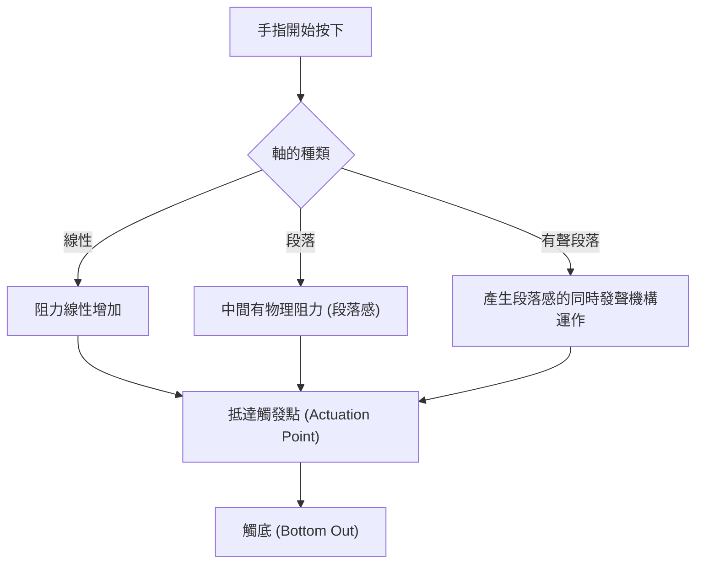
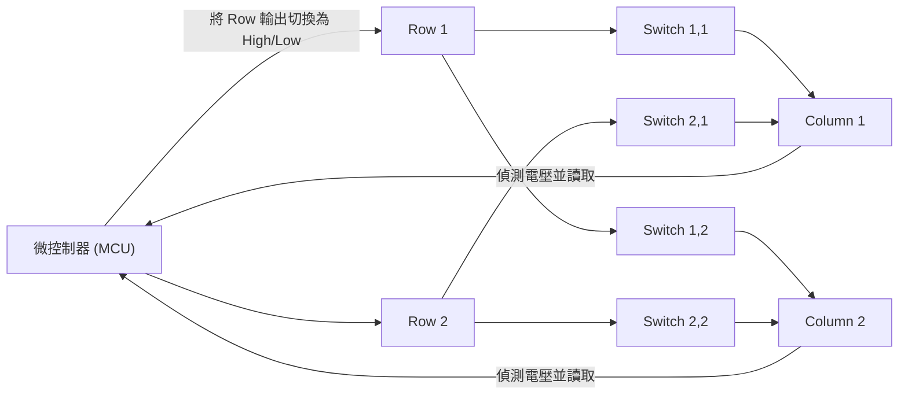
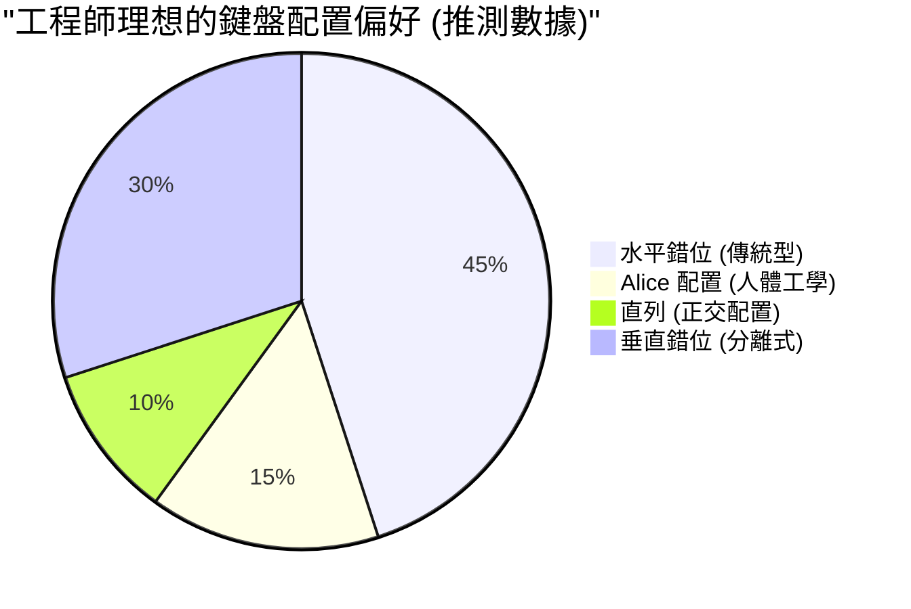

# 適合長時間寫程式！推薦給工程師的 5 款機械式鍵盤

對於程式設計師、系統工程師、資料科學家等在 IT 產業工作的專業人士來說，鍵盤不僅僅是一個輸入設備。它是「將思考轉化為程式碼形式的介面」，更是每天連續直接接觸數小時的最重要工作工具。

持續使用劣質的鍵盤不僅會導致打字速度下降，還會對手腕和手指關節造成過度的負擔，進而增加罹患腱鞘炎（如腕隧道症候群）的風險。相反地，擁有一款順手、敲擊感良好且具備高度客製化能力的鍵盤，將是大幅提升生產力與健康的「最佳投資」。

本文將針對各位工程師，超越單純的「推薦」，從鍵盤的物理學、內部電子電路，一直到最新的韌體技術進行徹底的解說。在此基礎上，為您介紹 5 款真正經得起實用考驗的終極鍵盤。

## 1. 鍵軸的物理學與機制

決定鍵盤敲擊感的最重要因素就是「鍵軸（Key Switch）」。機械式鍵盤的軸體由彈簧和接點機構組成，其物理特性會作為回饋傳達至我們的指尖。

### 1.1 虎克定律與彈簧常數

機械軸的觸發壓力（Actuation Force）主要由內部彈簧的特性決定。這個彈簧的行為可以近似地用古典力學中的「虎克定律（Hooke's Law）」來表示。

$$ F = -k x $$

在這裡，$F$ 是恢復力（手指感覺到的反彈力），$k$ 是彈簧的彈簧常數，$x$ 是按下的距離（行程）。
如果是線性軸（Linear switch，如紅軸或黑軸），幾乎完全遵循這個虎克定律，具有隨著按下深度成比例增加反彈力的線性（Linear）特性。

### 1.2 觸發能量的積分計算

將按鍵識別為「已輸入」的點稱為觸發點（Actuation Point）。從開始按下按鍵到抵達觸發點 $x_a$ 為止，手指所消耗的能量（作功） $E$ 可以用力對距離的積分來表示。

$$ E = \int_{0}^{x_a} F(x) \, dx $$

在段落軸（Tactile switch，茶軸）或有聲段落軸（Clicky switch，青軸）的情況下，由於存在接點摩擦的物理阻力（段落感，Tactile bump），$F(x)$ 不是簡單的一次函數，而是在特定行程位置呈現非線性峰值的函數。

當工程師進行長時間的程式編寫時，如果這個 $E$（觸發能量）過大，手指容易疲勞；如果過小，則容易增加誤觸（Typo）的機率。一般來說，具有 45g～55g 左右觸發力的軸體被認為在減少疲勞和準確性之間取得了平衡，受到許多工程師的喜愛。

### 1.3 最先進的鍵軸技術：靜電容無接點與霍爾效應

還有一些不具有實體金屬接點的更先進的軸體技術。

**靜電容無接點方式（Topre）**
利用圓錐形彈簧和橡膠碗，透過偵測按下時靜電容量的變化來判定輸入。因為沒有實體接點，所以幾乎沒有磨損，也不會發生按鍵連擊（Chattering，按一次卻輸入多次的現象）。橡膠碗帶來獨特的「啵叩叩叩」敲擊感，一旦體驗過便會無法自拔。

**磁軸（Hall Effect）**
利用霍爾效應，將嵌入在軸心（Stem）的磁鐵靠近電路板上的霍爾感測器，讀取磁通量密度的變化作為電壓。
霍爾效應產生的電動勢 $V_H$ 可由以下公式表示：

$$ V_H = R_H \left( \frac{I \cdot B}{t} \right) $$

在這裡，$R_H$ 是霍爾係數，$I$ 是電流，$B$ 是磁通量密度，$t$ 是導體的厚度。透過這項技術，可以將按鍵行程的深度作為類比數值連續取得，從而實現「以 0.1mm 為單位改變觸發點（Actuation Point Adjustment）」或是「在開始放開按鍵的瞬間即關閉（Rapid Trigger）」等驚人的控制。

## 2. 鍵盤的電子電路與效能指標

即使鍵軸再優秀，如果處理它的電子電路或微控制器（Microcontroller, MCU）效能低下，也無法發揮最佳效能。

### 2.1 矩陣掃描與回報率

鍵盤內部存在幾十到一百多個鍵軸，但微控制器的腳位數量有限，無法將所有鍵軸連接到個別的腳位。因此，會將鍵軸佈線成行（Row）和列（Column）的網格狀（矩陣），並透過高速掃描來判定哪個按鍵被按下。

**回報率（Polling Rate）** 是鍵盤向電腦報告「目前按鍵狀態」的頻率。標準的鍵盤是 125Hz（每 8ms 一次），但在高階型號中，也有進行 1000Hz（每 1ms 一次），甚至最近的 8000Hz（每 0.125ms 一次）等超高速通訊的產品。
在寫程式時 1000Hz 已經綽綽有餘，但這能帶來防止在超高速打字時漏鍵的安心感。

### 2.2 N-Key Rollover (NKRO) 與防鬼鍵 (Anti-Ghosting)

**N-Key Rollover（NKRO）** 是指同時按下多個按鍵時，所有按鍵都能被準確識別的功能。過去受到 USB 連接的限制，有著「最多 6 鍵」等限制，但現在的高階鍵盤透過巧妙運用 USB 的 HID 報告，實現了實質上無限制的同時按下（Full NKRO）。

對於在 Vim 或 Emacs 等編輯器中頻繁使用複雜快捷鍵（例如：`Ctrl + Shift + Alt + 任意鍵` 等）的工程師來說，完整的 NKRO 是必備條件。

### 2.3 去抖動延遲 (Debounce Delay)

帶有金屬接點的機械軸，在按下或放開時會發生接點微小彈跳的「彈跳現象 (Bounce)」。為了讓微控制器忽略這個現象的處理時間就是**去抖動延遲 (Debounce Delay)**。通常會刻意設定 5ms～20ms 左右的延遲，但在前面提到的靜電容無接點方式或磁軸中，因為不存在實體的接點雜訊，可以將去抖動延遲設定為零（或極小），實現壓倒性的反應速度。

## 3. 韌體與客製化能力（QMK / VIA）

如果說硬體是「肉體」，那麼韌體就是鍵盤的「大腦」。現代專為工程師設計的高階鍵盤，不僅僅能發送按鍵碼，還具備執行複雜程式的能力。

### 3.1 QMK Firmware

**QMK (Quantum Mechanical Keyboard)** 是一個開源的鍵盤韌體。使用 C 語言編寫，從更改鍵位配置、建立巨集，到控制 LED 動畫，毫不誇張地說「無所不能」。

### 3.2 進階按鍵配置功能

在 QMK 提供的功能中，特別能爆發性提升工程師生產力的功能如下：

- **層級功能 (Layers):** 就像手機鍵盤切換「文字」和「數字」一樣，只有在按下特定按鍵（如 Fn 鍵）時，才會將整個鍵盤的配置切換成另一組。可以讓雙手不離開主鍵盤區（Home Position）就能輸入方向鍵、巨集或符號。
- **Mod-Tap:** 讓一個按鍵在「短按」和「長按」時具有不同的作用。例如，將空白鍵設定為「短按為 Space，長按為 Shift」（Space Cadet Shift），可以有效利用拇指。
- **Home Row Mods:** 這是一種將主鍵盤區的按鍵（ASDF, JKL; 等）在長按時指派為修飾鍵（Ctrl, Shift, Alt, GUI）的方法。不再需要過度使用小指去伸長按 Ctrl 鍵，大幅減輕 Vim 或 Emacs 使用者手腕的疲勞。

### 3.3 透過 VIA / VIAL 即時設定

QMK 的缺點是「每次更改設定都需要編譯原始碼，並刷寫（寫入）韌體」。解決這個問題的就是 **VIA** 或 **VIAL**。它們可以從 GUI 應用程式（或網頁瀏覽器上）存取鍵盤，無需重新啟動即可即時改寫鍵位配置。

## 4. 人體工學與鍵盤配置的科學

一般的「水平錯位（Row-staggered，每一列按鍵錯開的配置）」是為了避免打字機的實體搖臂糾纏在一起而留下的殘餘設計，並非基於人類手的構造。

更符合人體工學（Ergonomics）的配置有以下幾種：

- **直列 (Ortholinear):** 按鍵在水平和垂直方向完全排成一直線的網格狀配置。手指的彎曲和伸展呈直線，減少了運指的浪費。
- **垂直錯位 (Columnar Stagger):** 配合人類手指的長度（中指較長，小指較短），將垂直列（Column）錯開的配置。能以自然的手部姿勢打字。
- **分離式 (Split):** 左右手可以完全分開放置，因此能以展開肩膀、挺胸的自然姿勢打字，對於預防肩膀僵硬和頸椎直化（頸部前傾）有極大的效果。

## 5. 推薦給工程師的 5 款終極機械式鍵盤

綜合物理學、電子電路、韌體以及人體工學的觀點，我們精心挑選了 5 款真正經得起長時間編寫程式考驗、專為專業人士打造的鍵盤。

---

### 1. Keychron Q 系列 (Q1 Pro / Q8 等) - 進入客製化鍵盤世界的入口

來自香港的 Keychron 是引領近期客製化鍵盤風潮的代表。其中「Q 系列」採用了全鋁合金的厚重機身，以及將敲擊音調校至極限的「Gasket Mount (墊片結構)」設計。

- **軸體:** 機械軸（支援熱插拔，可自由更換軸體）
- **韌體:** 完美支援 QMK/VIA
- **特色:** 支援 macOS/Windows 雙系統切換開關。可選擇喜歡的配列，如 Alice 配置的 Q8 或 75% 配置的 Q1。
- **對工程師的優點:** 雖然是量產產品，但開箱即可享受媲美自組鍵盤的極致敲擊感與客製化能力。非常適合使用 VIA 設定出類似 Vim 的方向鍵層級。

---

### 2. HHKB Studio - 專為駭客打造的 All-in-One 指標裝置

「Happy Hacking Keyboard (HHKB)」是為了 UNIX 程式設計師而誕生的傳奇鍵盤。最新的「HHKB Studio」並未採用傳統的靜電容無接點方式，而是採用了專屬開發的靜音機械軸，達到了進一步的進化。

- **軸體:** 線性・靜音機械軸（Kailh 製造，支援熱插拔）
- **特色:** 鍵盤中央的指標桿（TrackPoint），以及 4 個手勢觸控板。
- **對工程師的優點:** 雙手完全不需離開主鍵盤區，即可完成滑鼠游標操作、捲動以及視窗切換。一旦體驗過這種「一切都在指尖完成的體驗」，就再也回不去將右手伸向滑鼠的工作方式了。

---

### 3. ZSA Moonlander / ErgoDox EZ - 終極的分離式人體工學

這是由加拿大 ZSA 公司開發的最高峰分離式鍵盤。由於左右獨立，可以配合肩膀的寬度來配置，即使長時間打字，肩膀和脖子的負擔也會驚人地減輕。

- **軸體:** 機械軸（相容 Cherry MX，支援熱插拔）
- **韌體:** 基於 QMK（使用其獨特的強大 GUI 工具「Oryx」）
- **特色:** 垂直錯位（Columnar Stagger）配置，拇指專用按鍵區，標配可調整傾斜角度（Tent）的支架。
- **對工程師的優點:** 透過將 Enter、Space、Backspace 以及 Layer 切換指派給拇指，能大幅減少力量最弱的小指的負擔。對於深受腕隧道症候群困擾的工程師來說，這是一款救世主般的裝置。

---

### 4. REALFORCE R3 - 國產的信賴與極致的敲擊感（靜電容無接點方式）

東普雷（Topre）引以為傲的日本傑作。長年被金融機構等專業現場使用的實績絕非浪得虛名。從 R3 世代開始也支援了 Bluetooth 藍牙連接。

- **軸體:** 靜電容無接點方式 (Topre)
- **特色:** 具備 APC（Actuation Point Changer，觸發點調整）功能，可為每個按鍵個別設定 0.8mm、1.5mm、2.2mm、3.0mm 的觸發點。
- **對工程師的優點:** 由於沒有實體接點，其滑順的按鍵觸感被稱為「羽毛觸感（Feather Touch）」，即使長時間寫程式，對手指的反彈壓力也能降至最低。可以將小指負責的按鍵（如 A 或 Enter 等）觸發點設定得較淺（0.8mm），輕觸即可反應，實現這樣的客製化。

---

### 5. Wooting 60HE - 磁軸帶來的革命性反應速度

這原本是專為電競玩家開發的鍵盤，但其創新的科技在追求最快打字和反應速度的工程師之間也獲得了極高的評價。

- **軸體:** Lekker Switch（霍爾效應磁軸）
- **特色:** Rapid Trigger（快速觸發）功能，從 0.1mm 到 4.0mm，可以 0.1mm 為單位調整的觸發點。
- **對工程師的優點:** 活用類比輸入，可以實現「淺按是小寫，深按是大寫（結合 Shift）」這樣變態級的設定（Dynamic Keystroke）。此外，只要手指稍微抬起瞬間就會解除按鍵觸發（Key-off），能防止在高速打字時發生意外的按鍵連續輸入，提供無與倫比的精準輸入體驗。

## 結語

選擇鍵盤是工程師職業生涯中「自我介面最佳化」的過程。從遵循虎克定律的物理彈簧觸感，到透過積分計算的觸發能量、使用 QMK 建構的巨集，再到終極的人體工學，值得追求的深度是無止境的。

這次介紹的 5 款鍵盤（Keychron、HHKB Studio、Moonlander、REALFORCE、Wooting），每一款都是透過不同方法追求「最佳輸入體驗」的傑作。請務必配合您自身的打字風格和身體的困擾，找到最棒的夥伴。

對鍵盤的投資，必定會化為「數百萬行沒有 Bug 的程式碼」，為您帶來回報。
