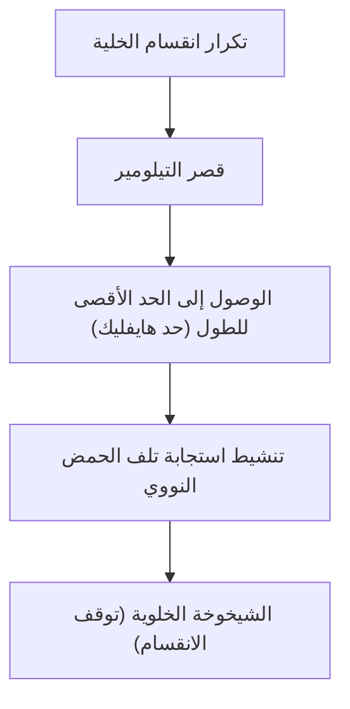

# آلية الشيخوخة: لماذا نشيخ؟

تعتبر "الشيخوخة" واحدة من أكبر الألغاز التي لطالما راودت البشرية منذ فجر التاريخ. لماذا تتدهور أجسامنا مع مرور الوقت ونواجه الموت في النهاية؟ في الماضي، كان يتم التعامل مع الشيخوخة على أنها "حكم طبيعي لا مفر منه"، ولكن عند تقاطع البيولوجيا الجزيئية الحديثة، وعلم الوراثة، والفيزياء، تتم إعادة تعريف الشيخوخة على أنها "مرض قابل للعلاج" أو "عملية يمكن تأخيرها".

في هذا المقال، سنتعمق في الآليات الأساسية للشيخوخة، بدءًا من المستوى الخلوي وقوانين الفيزياء، مرورًا بالخلفية التطورية، وصولاً إلى أحدث علوم مكافحة الشيخوخة.

## 1. الشيخوخة من منظور الفيزياء: قانون زيادة الإنتروبيا والحياة

لفهم الشيخوخة، تكمن النظرة الأساسية في الفيزياء، وتحديداً في القانون الثاني للديناميكا الحرارية (قانون زيادة الإنتروبيا). أي نظام في هذا الكون، إذا تُرك وشأنه، سينتقل من حالة منظمة إلى حالة غير منظمة. تمامًا كما تبرد القهوة الساخنة ويصدأ الحديد، تنهار المادة بينما تتبدد طاقتها.

الكائنات الحية ليست استثناءً. تتكون أجسامنا من حوالي 37 تريليون خلية وتحافظ على مستوى عالٍ من النظام، ولكن للحفاظ على هذا النظام، من الضروري استهلاك الطاقة (ATP) باستمرار وإجراء الإصلاح الذاتي. ومع ذلك، وعلى مدى عقود من عملية الإصلاح، تتراكم الأخطاء الدقيقة (تلف الحمض النووي، وتمسخ البروتينات، وتدهور العضيات الخلوية). هذا هو "الجوهر الفيزيائي للشيخوخة".

الحياة تشبه سفينة تسبح ضد أمواج الإنتروبيا، وعندما تنخفض قدرة هيكل السفينة على الإصلاح عن معدل تراكم الأضرار، تتجلى ظاهرة الشيخوخة.

## 2. ساعة الشيخوخة البيولوجية: التيلومير وحد هايفليك

في الستينيات، اكتشف عالم أحياء الخلية ليونارد هايفليك أن الخلايا الجسدية البشرية لا يمكنها الانقسام إلى ما لا نهاية، بل تتوقف بعد الانقسام لحوالي 50 إلى 70 مرة. هذا هو "حد هايفليك".

المفتاح لهذه الظاهرة هو "التيلومير" الموجود في نهايات الكروموسومات. التيلومير يشبه الغطاء البلاستيكي في نهاية رباط الحذاء، حيث يمنع فقدان المعلومات الجينية الهامة في الحمض النووي. ومع ذلك، في كل مرة تنقسم فيها الخلية وتنسخ الحمض النووي الخاص بها، لا يمكن نسخ الأطراف بالكامل بسبب طبيعة إنزيم بوليميراز الحمض النووي، مما يؤدي إلى قصر التيلومير تدريجياً.

عندما يصل التيلومير إلى قصر معين، تتعرف الخلية على ذلك بشكل خاطئ على أنه "تلف خطير في الحمض النووي" وتوقف انقسامها بشكل دائم لمنع التسرطن. هذه هي "الشيخوخة الخلوية". يمتلك إنزيم يسمى تيلوميراز القدرة على إطالة هذا التيلومير، ولكن في العديد من الخلايا الجسدية البشرية يتم إيقاف نشاط هذا الإنزيم (على العكس من ذلك، تكتسب الخلايا السرطانية الخلود من خلال إعادة تنشيط التيلوميراز).

## 3. ثمن الطاقة: الميتوكوندريا وأنواع الأكسجين التفاعلية (ROS)

يتم إنتاج الطاقة التي نحتاجها للعيش في العضيات الخلوية المعروفة باسم "الميتوكوندريا". تستخدم الميتوكوندريا الأكسجين لحرق العناصر الغذائية وتوليد ATP (أدينوسين ثلاثي الفوسفات). ومع ذلك، هناك ثمن لتشغيل هذا المحرك الحيوي، وهو توليد أنواع الأكسجين التفاعلية (Reactive Oxygen Species: ROS).

حوالي 1 إلى 2٪ من الأكسجين المأخوذ عن طريق التنفس يخضع لاختزال غير كامل أثناء سلسلة نقل الإلكترون ويتحول إلى أنواع أكسجين تفاعلية (ROS) ذات قوة مؤكسدة شديدة. الأنواع التفاعلية المعتدلة ضرورية لنقل الإشارات داخل الخلايا، لكن المستويات المفرطة تؤكسد وتدمر دهون غشاء الخلية والبروتينات والحمض النووي الخاص بالميتوكوندريا نفسها (mtDNA).

على عكس الحمض النووي النووي، يفتقر الحمض النووي للميتوكوندريا (mtDNA) إلى حماية بروتينات الهيستون وآليات إصلاحه ضعيفة. لذلك، عندما يتضرر الحمض النووي للميتوكوندريا بواسطة ROS، تبدأ "دوامة الموت السلبية" حيث تنتج الميتوكوندريا المعطلة المزيد من أنواع الأكسجين التفاعلية. هذا عامل رئيسي في تسريع انخفاض استقلاب الطاقة وتقدم الشيخوخة.

## 4. فقدان الوراثة اللاجينية (الإيبيجينيتكس): انهيار هوية الخلية

في السنوات الأخيرة، كان "الشذوذ اللاجيني (الإيبيجينيتكس)" محط اهتمام في طليعة أبحاث الشيخوخة.
تحتوي جميع الخلايا الجسدية البشرية على نفس الحمض النووي (الجينوم)، لكن خلايا الجلد تعمل كجلد وتعمل الخلايا العصبية كأعصاب. يحدث هذا بسبب وجود علامات لاجينية (مثل مثيلة الحمض النووي وتعديلات الهيستون) التي تتحكم في الأجزاء التي يجب قراءتها من الحمض النووي (تشغيل وإيقاف المفاتيح).

ومع ذلك، مع تقدم العمر، تضطرب هذه العلامات اللاجينية. على سبيل المثال، بينما يتم الحفاظ على النوتة الموسيقية (الحمض النووي) للأوركسترا بشكل جيد، تبدأ تعليمات المايسترو (العوامل اللاجينية) في الانحراف، مما يؤدي إلى عزف الكمان لجزء البوق.

أظهرت دراسات بقيادة الأستاذ ديفيد سينكلير من جامعة هارفارد أنه عند حدوث كسر في الشرائط المزدوجة للحمض النووي، تترك العوامل اللاجينية مواقعها الأصلية لإصلاحه، ولا يمكنها العودة بدقة إلى مواقعها الأصلية بعد الإصلاح، مما يؤدي إلى تراكم "الضوضاء اللاجينية". تدعم نظرية "المعلومات في الشيخوخة"، التي تعتبر هذا التراكم للضوضاء هو السبب الجذري للشيخوخة، حاليًا دعمًا كبيرًا.

## 5. تهديد خلايا الزومبي: الشيخوخة الخلوية والنمط الإفرازي المرتبط بالشيخوخة (SASP)

الخلايا الهرمة التي توقفت عن الانقسام لا تنتظر الموت بهدوء. تُسمى الخلايا الهرمة التي لا يزيلها الجهاز المناعي وتظل في الجسم "خلايا الزومبي"، وتفرز مواد التهابية ضارة (مثل السيتوكينات، والكيموكينات، والإنزيمات المحللة للبروتينات) على الخلايا السليمة المحيطة بها. تسمى هذه الظاهرة بالنمط الإفرازي المرتبط بالشيخوخة (SASP).

يعمل SASP تمامًا مثل التفاحة الفاسدة التي تفسد باقي التفاح في الصندوق، حيث يحول الخلايا الطبيعية المحيطة إلى خلايا هرمة، مسببًا التهابًا مجهريًا مزمنًا. هذا الالتهاب المزمن (Inflammaging: الشيخوخة الالتهابية) هو المحفز لجميع الأمراض المرتبطة بالعمر تقريبًا، مثل مرض الزهايمر، وتصلب الشرايين، والسكري، والسرطان.

## 6. الخلفية التطورية: لماذا سمح الانتقاء الطبيعي بالشيخوخة؟

هنا يطرح سؤال واحد: لماذا لم نكتسب "أجسامًا لا تشيخ" خلال عملية التطور؟

وفقًا "لنظرية تراكم الطفرات" التي اقترحها عالم الأحياء التطوري بيتر مدور، فإن معظم الكائنات الحية في البيئة البرية تموت قبل بلوغها سن الشيخوخة بسبب الحيوانات المفترسة والأمراض والمجاعة وما إلى ذلك. لذلك، لا تعمل قوة الانتقاء الطبيعي على الطفرات الجينية التي تسبب آثارًا ضارة في وقت متأخر من الحياة (بعد تجاوز سن الإنجاب).

علاوة على ذلك، وفقًا لنظرية "تعدد المظاهر المتضاد" لجورج ويليامز، يُعتقد أن الجينات التي تفضل البقاء والتكاثر في فترة الشباب يكون لها تأثير ضار (الشيخوخة) في فترة الشيخوخة. على سبيل المثال، كيناز البروتين المسمى "mTOR" الذي يعزز نمو الخلايا ويحافظ على الشباب يعد أمرًا حيويًا خلال فترة النمو، ولكن إذا ظل نشطًا بشكل مفرط بعد منتصف العمر، فإنه يثبط وظيفة التنظيف الذاتي للخلايا (الالتهام الذاتي) ويسرع الشيخوخة.

بعبارة أخرى، أعطى التطور الأولوية القصوى "لبقاء النوع (التكاثر)"، وتخلى عن "الصيانة الدائمة للفرد".

## 7. أحدث علوم مكافحة الشيخوخة وتطلعات المستقبل

تلوح في الأفق بوادر علمية حديثة لمواجهة عملية الشيخوخة التي قد تبدو ميئوساً منها. فمع كشف النقاب عن آليات الشيخوخة، يتم باستمرار تطوير طرق لتأخيرها أو حتى عكسها.

- **معززات NAD+ (NMN, NR)**:
  يتناقص الإنزيم المساعد NAD+، الضروري لإنتاج الطاقة الخلوية وإصلاح الحمض النووي وتنشيط السيرتوين (جينات طول العمر)، مع تقدم العمر. تتقدم الأبحاث التي تهدف إلى تجديد شباب الخلايا عن طريق توفير السلائف مثل NMN (أحادي نيوكليوتيد النيكوتيناميد).

- **حالات الشيخوخة (أدوية إزالة الخلايا الهرمة - Senolytics)**:
  هي أدوية تعمل على قتل خلايا الزومبي (الخلايا الهرمة) المتراكمة في الجسم بشكل انتقائي. تم إثبات أن تركيبة الداساتينيب والكيرسيتين، من بين أدوية أخرى، تزيد من عمر الفئران وتحسن بشكل كبير من مدى العمر الصحي، والتجارب السريرية على البشر قيد التقدم حاليًا.

- **الراباميسين وتثبيط mTOR**:
  تم اكتشاف الراباميسين كمثبط للمناعة في عمليات زراعة الأعضاء، وهو يثبط مسار mTOR الذي يعزز الشيخوخة وينشط الالتهام الذاتي (وظيفة التخلص من نفايات الخلايا). يلفت الآن الانتباه كواحد من أكثر الأدوية الواعدة لإطالة العمر.

- **إعادة البرمجة الجزئية باستخدام عوامل ياماناكا**:
  عندما يتم إدخال الجينات الأربعة (عوامل ياماناكا)، التي اكتشفها الأستاذ الحائز على جائزة نوبل شينيا ياماناكا، إلى الخلايا، تتجدد الخلايا لتصبح خلايا جذعية مستحثة متعددة القدرات (خلايا iPS). من خلال إجراء ذلك "جزئيًا" في الكائن الحي، تتقدم الأبحاث حول "إعادة البرمجة الجزئية (Partial Reprogramming)" التي تعيد عقارب الساعة اللاجينية إلى الوراء دون فقدان هوية الخلية، في شركات مدعومة بتمويل ضخم مثل مختبرات ألتوس (Altos Labs).

## الاستنتاج

لم تعد الشيخوخة "ظاهرة طبيعية غير مفسرة"، بل خضعت لنقلة نوعية لتصبح "عملية بيولوجية قابلة للتدخل". قصر التيلوميرات، وتدهور الميتوكوندريا، وتراكم الضوضاء اللاجينية، وانتشار خلايا الزومبي. من خلال استهداف كل من "علامات الشيخوخة (Hallmarks of Aging)" هذه واحدة تلو الأخرى، تستعد البشرية لتحدي حدودها البيولوجية لأول مرة في التاريخ.

بالطبع، الإطالة الجذرية لمتوسط العمر قد تثير مشاكل اجتماعية غير مسبوقة، مثل قضايا نظام التقاعد والاقتصاد الطبي والمشاكل الديموغرافية العالمية. ومع ذلك، فإن الهدف الحقيقي لعلم مكافحة الشيخوخة ليس مجرد إطالة العمر (Lifespan)، بل زيادة المدة التي يمكن للفرد أن يعيش فيها بصحة واستقلالية (Healthspan).

السبب في أننا نشيخ، كان نتاج تنازل بين قانون الإنتروبيا الكوني والتطور الذي يعطي الأولوية القصوى للتكاثر. ولكن الآن، أصبحت البشرية، بفضل ذكائها، على وشك التحرر من قيودها الجينية.
