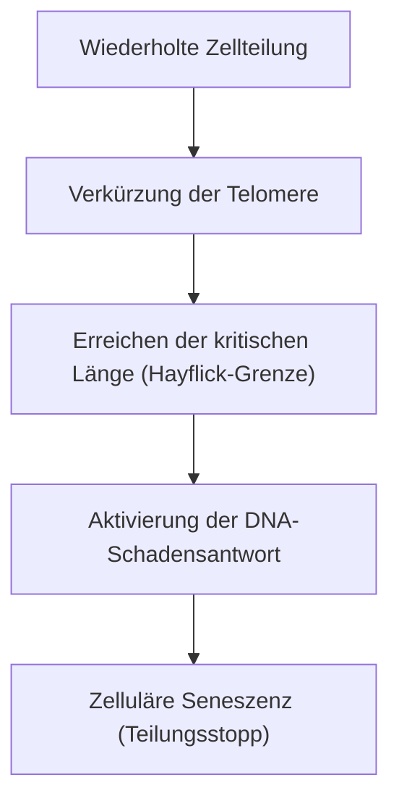

# Der Mechanismus des Alterns: Warum wir altern

Eines der größten Rätsel, das die Menschheit seit Anbeginn der Geschichte beschäftigt, ist das "Altern". Warum verfällt unser Körper im Laufe der Zeit und stirbt schließlich? Früher wurde das Altern als "unvermeidliches Gesetz der Natur" abgetan, aber an der Schnittstelle von moderner Molekularbiologie, Genetik und Physik wird das Altern zunehmend als "behandelbare Krankheit" oder "verzögerbarer Prozess" neu definiert.

In diesem Artikel werden wir die zugrunde liegenden Mechanismen des Alterns gründlich untersuchen, von der zellulären Ebene über die physikalischen Gesetze und den evolutionären Hintergrund bis hin zur neuesten Anti-Aging-Wissenschaft.

## 1. Altern aus physikalischer Sicht: Das Gesetz der Entropiezunahme und das Leben

Um das Altern zu verstehen, liegt die grundlegendste Perspektive in der Physik, insbesondere im zweiten Hauptsatz der Thermodynamik (dem Gesetz der Entropiezunahme). Jedes System in diesem Universum geht, wenn man es sich selbst überlässt, von einem geordneten in einen ungeordneten Zustand über. So wie heißer Kaffee abkühlt und Eisen rostet, zerfällt Materie, während sie Energie ableitet.

Lebende Organismen sind da keine Ausnahme. Unser Körper besteht aus etwa 37 Billionen Zellen und hält ein hohes Maß an Ordnung aufrecht. Um diese Ordnung aufrechtzuerhalten, müssen wir jedoch kontinuierlich Energie (ATP) verbrauchen und uns selbst reparieren. Im Laufe von Jahrzehnten der Reparaturprozesse häufen sich jedoch winzige Fehler (DNA-Schäden, Proteindenaturierung, Verschleiß von Zellorganellen) an. Dies ist die "physikalische Essenz des Alterns".

Das Leben ist wie ein Schiff, das gegen die Wellen der Entropie schwimmt. Wenn die Reparaturkapazität des Rumpfes hinter der Geschwindigkeit der Schadensakkumulation zurückbleibt, wird das Phänomen des Alterns offensichtlich.

## 2. Die biologische Uhr des Alterns: Telomere und die Hayflick-Grenze

In den 1960er Jahren entdeckte der Zellbiologe Leonard Hayflick, dass sich menschliche Körperzellen nicht unendlich oft teilen können, sondern nach etwa 50 bis 70 Teilungen stoppen. Dies ist die "Hayflick-Grenze".

Der Schlüssel zu diesem Phänomen liegt in den "Telomeren", die sich an den Enden der Chromosomen befinden. Telomere sind wie die Plastikkappen an den Enden von Schnürsenkeln und verhindern den Verlust wichtiger genetischer Informationen in der DNA. Bei jeder Zellteilung und DNA-Replikation können die Enden jedoch aufgrund der Beschaffenheit der DNA-Polymerase nicht vollständig repliziert werden, wodurch die Telomere nach und nach kürzer werden.

Wenn Telomere eine bestimmte Kürze erreichen, erkennt die Zelle dies fälschlicherweise als "schweren DNA-Schaden" und stoppt dauerhaft ihre eigene Teilung, um einer Krebsentstehung vorzubeugen. Dies ist die "zelluläre Seneszenz". Ein Enzym namens Telomerase hat die Fähigkeit, diese Telomere zu verlängern, aber in den meisten menschlichen somatischen Zellen ist die Aktivität dieses Enzyms abgeschaltet (umgekehrt erlangen Krebszellen Unsterblichkeit, indem sie die Telomerase reaktivieren).

## 3. Der Preis der Energie: Mitochondrien und reaktive Sauerstoffspezies (ROS)

Die Energie, die wir zum Leben brauchen, wird in den "Mitochondrien", den Organellen in unseren Zellen, produziert. Mitochondrien nutzen Sauerstoff, um Nährstoffe zu verbrennen und ATP (Adenosintriphosphat) zu erzeugen. Der Betrieb dieses biologischen Motors hat jedoch seinen Preis. Dies ist die Entstehung von reaktiven Sauerstoffspezies (ROS).

Etwa 1 bis 2 % des durch die Atmung aufgenommenen Sauerstoffs werden während des Elektronentransportsystems unvollständig reduziert und wandeln sich in ROS mit starker oxidierender Kraft um. Während ein moderates Maß an ROS für die intrazelluläre Signalübertragung notwendig ist, oxidieren und zerstören überschüssige ROS Zellmembranlipide, Proteine und die eigene DNA der Mitochondrien (mtDNA).

Im Gegensatz zur nukleären DNA (kern-DNA) hat die mitochondriale DNA keinen Schutz durch Histonproteine und ihr Reparaturmechanismus ist unzureichend. Wenn also die mtDNA durch ROS beschädigt wird, beginnt ein "Teufelskreis des Todes", in dem die funktionsgestörten Mitochondrien noch mehr ROS produzieren. Dies ist ein wichtiger Faktor, der den Rückgang des Energiestoffwechsels und das Fortschreiten des Alterns beschleunigt.

## 4. Der Verlust der Epigenetik: Der Zusammenbruch der zellulären Identität

In den letzten Jahren hat die Spitze der Alternsforschung die Aufmerksamkeit auf Anomalien in der "Epigenetik" gelenkt.
Alle somatischen Zellen im menschlichen Körper haben die gleiche DNA (das gleiche Genom), aber Hautzellen funktionieren als Haut und Nervenzellen als Nerven. Dies liegt daran, dass es epigenetische Marker (DNA-Methylierung und Histonmodifikation) gibt, die steuern, welche Teile der DNA abgelesen werden (Schalter ein/aus).

Mit zunehmendem Alter geraten diese epigenetischen Markierungen jedoch durcheinander. Um es mit einer Metapher zu sagen: Es ist, als ob die Partitur eines Orchesters (die DNA) intakt gehalten wird, aber die Anweisungen des Dirigenten (die Epigenetik) verrückt spielen und die Violinen anfangen, den Part der Trompeten zu spielen.

Forschungen von Professor David Sinclair von der Harvard University und anderen haben gezeigt, dass bei einem DNA-Doppelstrangbruch epigenetische Faktoren ihren ursprünglichen Ort verlassen, um ihn zu reparieren, und nach der Reparatur nicht mehr genau an ihren ursprünglichen Ort zurückkehren können, wodurch sich "epigenetisches Rauschen" ansammelt. Die "Informationstheorie des Alterns", die besagt, dass diese Ansammlung von Rauschen die Grundursache des Alterns ist, findet derzeit große Unterstützung.

## 5. Die Bedrohung durch Zombie-Zellen: Zelluläre Seneszenz und SASP

Seneszente Zellen (gealterte Zellen), die sich nicht mehr teilen, warten nicht einfach nur still auf den Tod. Seneszente Zellen, die nicht vom Immunsystem beseitigt werden und im Körper verbleiben, werden als "Zombie-Zellen" bezeichnet und setzen schädliche Entzündungsstoffe (Zytokine, Chemokine, proteolytische Enzyme usw.) in die umliegenden gesunden Zellen frei. Dieses Phänomen wird als SASP (Senescence-Associated Secretory Phenotype, seneszenz-assoziierter sekretorischer Phänotyp) bezeichnet.

SASP verwandelt benachbarte normale Zellen in seneszente Zellen, genau wie ein verfaulter Apfel andere Äpfel in einer Kiste verfaulen lässt, und verursacht chronische Mikroentzündungen. Diese chronische Entzündung (Inflammaging: entzündliches Altern) ist der Auslöser für fast alle altersbedingten Krankheiten, einschließlich Alzheimer, Arteriosklerose, Diabetes und Krebs.

## 6. Evolutionärer Hintergrund: Warum hat die natürliche Selektion das Altern zugelassen?

Hier stellt sich eine Frage. Warum haben wir im Laufe der Evolution keinen "Körper, der nicht altert" erworben?

Nach der vom Evolutionsbiologen Peter Medawar vorgeschlagenen "Theorie der Mutationsakkumulation" (Mutation Accumulation Theory) sterben in der Wildnis viele Individuen vor Erreichen des Alters an Raubtieren, Krankheiten, Hunger usw. Daher wirkt die Kraft der natürlichen Selektion nicht auf genetische Mutationen, die sich erst in der späten Lebensphase (nach dem reproduktiven Alter) nachteilig auswirken.

Darüber hinaus wird gemäß George Williams' Theorie der "antagonistischen Pleiotropie" angenommen, dass Gene, die in jungen Jahren vorteilhaft für das Überleben und die Fortpflanzung sind, im Alter schädliche Auswirkungen (Altern) haben. Beispielsweise ist die als "mTOR" bekannte Proteinkinase, die das Zellwachstum fördert und die Jugendlichkeit erhält, während der Wachstumsphase unerlässlich, hemmt jedoch bei übermäßiger Aktivierung im mittleren und höheren Lebensalter die Selbstreinigung der Zellen (Autophagie) und fördert das Altern.

Mit anderen Worten, die Evolution priorisierte das "Überleben der Spezies (Fortpflanzung)" und gab die "dauerhafte Instandhaltung des Individuums" auf.

## 7. Neueste Anti-Aging-Wissenschaft und Zukunftsaussichten

Obwohl der Alterungsprozess aussichtslos erscheinen mag, beginnt die moderne Wissenschaft, Hinweise auf einen Gegenangriff zu finden. Da die Mechanismen des Alterns zunehmend geklärt werden, werden nach und nach Ansätze entwickelt, um diese zu verzögern oder sogar umzukehren.

- **NAD+-Booster (NMN, NR)**:
  Das Coenzym NAD+, das für die zelluläre Energieproduktion, die DNA-Reparatur und die Aktivierung von Sirtuinen (Langlebigkeitsgenen) unerlässlich ist, nimmt mit zunehmendem Alter ab. Die Forschung zur Verjüngung von Zellen durch die Zufuhr von Vorläuferstoffen wie NMN (Nicotinamid-Mononukleotid) schreitet voran.

- **Senolytika (Medikamente zur Beseitigung seneszenter Zellen)**:
  Dies sind Medikamente, die im Körper angesammelte Zombie-Zellen (seneszente Zellen) selektiv abtöten. Die Kombination von Dasatinib und Quercetin hat nachweislich die Lebensdauer von Mäusen verlängert und ihre Gesundheitsspanne dramatisch verbessert, und derzeit laufen klinische Studien am Menschen.

- **Rapamycin und mTOR-Hemmung**:
  Rapamycin, das als Immunsuppressivum für Organtransplantationen entdeckt wurde, hemmt den mTOR-Signalweg, der das Altern fördert, und aktiviert die Autophagie (die zelluläre Müllabfuhr). Es gilt derzeit als eines der vielversprechendsten lebensverlängernden Medikamente.

- **Partielle Reprogrammierung durch Yamanaka-Faktoren**:
  Wenn die vier Gene (Yamanaka-Faktoren), die vom Nobelpreisträger Professor Shinya Yamanaka entdeckt wurden, in Zellen eingebracht werden, verjüngen sich die Zellen zu pluripotenten Stammzellen (iPS-Zellen). Forschungen zur "partiellen Reprogrammierung", bei der dies in vivo (im lebenden Organismus) "teilweise" durchgeführt wird, um nur die epigenetische Uhr zurückzudrehen, ohne die zelluläre Identität zu verlieren, werden von Unternehmen wie Altos Labs, die riesige Summen investieren, vorangetrieben.

## Fazit

Das Altern hat einen Paradigmenwechsel erfahren, von einem "ungeklärten Naturphänomen" zu einem "biologischen Prozess, in den eingegriffen werden kann". Verkürzung der Telomere, Verschlechterung der Mitochondrien, Anhäufung epigenetischen Rauschens und die Ausbreitung von Zombie-Zellen. Indem wir diese "Kennzeichen des Alterns" (Hallmarks of Aging) einzeln ins Visier nehmen, versuchen wir zum ersten Mal in der Geschichte der Menschheit, unsere eigenen biologischen Grenzen herauszufordern.

Natürlich birgt eine drastische Verlängerung der Lebensdauer das Potenzial für beispiellose gesellschaftliche Herausforderungen, wie Rentensysteme, medizinische Ökonomie und globale Bevölkerungsprobleme. Der wahre Zweck der Anti-Aging-Wissenschaft besteht jedoch nicht nur in der Verlängerung der Lebensdauer (Lifespan), sondern in der Maximierung des Zeitraums, in dem Menschen gesund und unabhängig leben können (Healthspan).

Der Grund, warum wir altern. Es war ein Kompromiss zwischen der Entropie als Gesetz des Universums und der Evolution, die der Fortpflanzung höchste Priorität einräumt. Doch heute ist die Menschheit durch ihre eigene Intelligenz im Begriff, sich aus den Fesseln ihrer Gene zu befreien.
