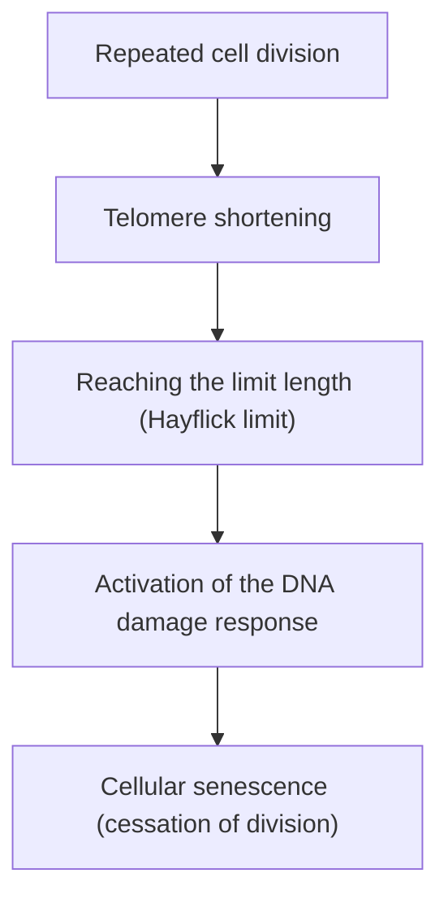

# The Mechanism of Aging: Why Do We Age?

One of the greatest mysteries humanity has harbored since the dawn of history is "aging." Why do our bodies deteriorate over time and ultimately face death? Once dismissed as an "inevitable law of nature," aging is now being redefined at the intersection of modern molecular biology, genetics, and physics as a "treatable disease" or a "delayable process."

In this article, we will thoroughly explore the underlying mechanisms of aging, ranging from the cellular level and physical laws to its evolutionary background, and even the latest anti-aging science.

## 1. Aging from a Physical Perspective: The Law of Increasing Entropy and Life

To understand aging, the most fundamental perspective lies in physics, particularly the Second Law of Thermodynamics (the law of increasing entropy). Every system in this universe, if left alone, transitions from an ordered state to a disordered one. Just as hot coffee cools down and iron rusts, matter decays while dissipating energy.

Living organisms are no exception. Our bodies are composed of approximately 37 trillion cells and maintain a high degree of order, but to sustain this order, they must continuously consume energy (ATP) and perform self-repair. However, over the course of decades of repair processes, microscopic errors (DNA damage, protein denaturation, and the deterioration of organelles) accumulate. This is the "physical essence of aging."

Life is like a ship swimming against the waves of entropy, and when the ship's repair capacity falls below the rate of damage accumulation, the phenomenon of aging becomes apparent.

## 2. The Biological Aging Clock: Telomeres and the Hayflick Limit

In the 1960s, cell biologist Leonard Hayflick discovered that human somatic cells cannot divide indefinitely but stop after about 50 to 70 divisions. This is the "Hayflick limit."

The key to this phenomenon lies in the "telomeres" located at the ends of chromosomes. Telomeres are like the plastic caps on the ends of shoelaces, preventing the loss of important genetic information in DNA. However, every time a cell divides and replicates its DNA, due to the nature of DNA polymerase, the ends cannot be fully replicated, causing the telomeres to shorten little by little.

When telomeres reach a certain shortness, the cell misidentifies it as "severe DNA damage" and permanently halts its own division to prevent cancerization. This is "cellular senescence." An enzyme called telomerase has the ability to elongate these telomeres, but in many human somatic cells, the activity of this enzyme is turned off (conversely, cancer cells acquire immortality by reactivating telomerase).

## 3. The Cost of Energy: Mitochondria and Reactive Oxygen Species (ROS)

The energy we need to live is produced in cellular organelles called "mitochondria." Mitochondria use oxygen to burn nutrients and generate ATP (adenosine triphosphate). However, the operation of this biological engine comes with a cost. That is the generation of Reactive Oxygen Species (ROS).

Approximately 1 to 2% of the oxygen taken in through respiration undergoes incomplete reduction during the electron transport chain process, turning into ROS with strong oxidative power. While moderate ROS is necessary for intracellular signal transduction, excessive ROS oxidizes and destroys cell membrane lipids, proteins, and the mitochondria's own DNA (mtDNA).

Unlike nuclear DNA, mitochondrial DNA lacks protection from histone proteins and has poor repair mechanisms. Therefore, when mtDNA is damaged by ROS, a "negative chain of death" begins, where dysfunctional mitochondria generate even more ROS. This becomes a major factor accelerating the decline in energy metabolism and the progression of aging.

## 4. The Loss of Epigenetics: The Collapse of Cellular Identity

In recent years, abnormalities in "epigenetics" have been attracting attention at the forefront of aging research.
All human somatic cells possess the same DNA (genome), but skin cells function as skin, and nerve cells function as nerves. This is because there are epigenetic marks (DNA methylation and histone modification) that control which parts of the DNA are read (turning switches on or off).

However, as we age, these epigenetic marks become disordered. To use an analogy, it is as if the orchestra's musical score (DNA) is kept perfectly intact, but the conductor's instructions (epigenetics) begin to go awry, causing the violins to start playing the trumpet's part.

Research by Professor David Sinclair of Harvard University and others has shown that when DNA double-strand breaks occur, epigenetic factors leave their original positions to repair them, and their failure to return accurately to their original places afterward leads to the accumulation of "epigenetic noise." The "information theory of aging," which posits that the accumulation of this noise is the root cause of aging, is currently gaining immense support.

## 5. The Threat of Zombie Cells: Cellular Senescence and SASP

Senescent cells that have stopped dividing do not just quietly await death. Senescent cells that remain in the body without being cleared by the immune system are called "zombie cells," and they scatter harmful inflammatory substances (such as cytokines, chemokines, and proteases) to the surrounding healthy cells. This phenomenon is called the Senescence-Associated Secretory Phenotype (SASP).

Just as a rotten apple rots other apples in a box, SASP transforms surrounding normal cells into senescent cells, causing chronic micro-inflammation. This chronic inflammation (Inflammaging) is the trigger for almost all age-related diseases, such as Alzheimer's disease, arteriosclerosis, diabetes, and cancer.

## 6. Evolutionary Background: Why Did Natural Selection Allow Aging?

Here, a question arises: Why did we not acquire a "non-aging body" during the course of evolution?

According to the "mutation accumulation theory" proposed by evolutionary biologist Peter Medawar, in a wild environment, many individuals die from predators, disease, or starvation before reaching old age. Therefore, the force of natural selection does not act upon genetic mutations that exert adverse effects in the later stages of life (after the reproductive age has passed).

Furthermore, according to George Williams's "antagonistic pleiotropy theory," genes that favor survival and reproduction in youth are thought to ironically bring about harmful effects (aging) in old age. For example, a protein kinase called "mTOR," which promotes cell growth and maintains youth, is essential during the growth period, but if it remains excessively active after middle age, it inhibits the cell's self-cleansing action (autophagy) and accelerates aging.

In short, evolution prioritized the "continuation of the species (reproduction)" and abandoned the "permanent maintenance of the individual."

## 7. The Latest Anti-Aging Science and Future Prospects

Although the aging process may seem desperate, modern science is beginning to grasp the threads of a counterattack. As the mechanisms of aging are elucidated, approaches to delay or even reverse it are being developed one after another.

- **NAD+ Boosters (NMN, NR)**:
  NAD+, a coenzyme essential for cellular energy production, DNA repair, and the activation of sirtuins (longevity genes), decreases with age. Research is progressing on rejuvenating cells by supplementing precursors such as NMN (Nicotinamide Mononucleotide).

- **Senolytics (Senescent Cell-Clearing Drugs)**:
  These are drugs that selectively kill zombie cells (senescent cells) that have accumulated in the body. Combinations such as dasatinib and quercetin have been proven to extend the lifespan of mice and dramatically improve their healthspan, and clinical trials in humans are currently underway.

- **Rapamycin and mTOR Inhibition**:
  Discovered as an immunosuppressant for organ transplants, rapamycin inhibits the mTOR pathway, which promotes aging, and activates autophagy (the cell's garbage disposal function). It is currently garnering attention as one of the most reliable life-extending drugs.

- **Partial Reprogramming by Yamanaka Factors**:
  When the four genes (Yamanaka factors) discovered by Nobel laureate Professor Shinya Yamanaka are introduced into cells, the cells are rejuvenated into pluripotent stem cells (iPS cells). Research on "Partial Reprogramming," which does this "partially" in vivo to rewind only the epigenetic clock without losing cellular identity, is being advanced by heavily funded companies like Altos Labs.

## Conclusion

Aging has undergone a paradigm shift from being an "unexplained natural phenomenon" to an "intervenable biological process." The shortening of telomeres, the deterioration of mitochondria, the accumulation of epigenetic noise, and the proliferation of zombie cells. By targeting these "Hallmarks of Aging" one by one, we are attempting to challenge our biological limits for the first time in human history.

Of course, a dramatic extension of lifespan also harbors the potential to cause unprecedented social issues, such as those related to pension systems, medical economics, and global population problems. However, the true goal of anti-aging science is not simply to extend lifespan, but to maximize healthspan—the period during which one can live healthily and independently.

The reason we age. It was a product of a compromise between the universal law of entropy and evolution's prioritization of reproduction. But now, through its own intellect, humanity is about to break free from the spell of its genes.
