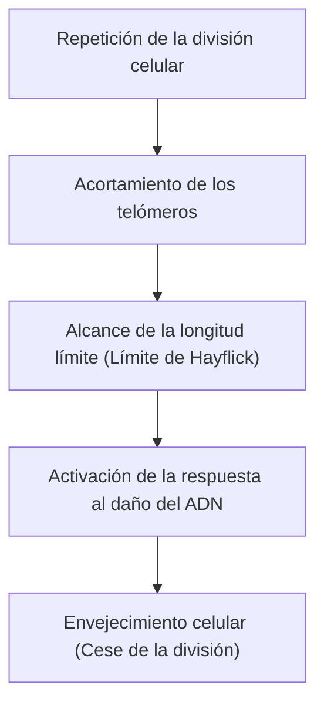

# El mecanismo del envejecimiento: ¿Por qué envejecemos?

Uno de los mayores misterios que la humanidad ha albergado desde los albores de la historia es el "envejecimiento". ¿Por qué nuestros cuerpos se deterioran con el tiempo y finalmente encuentran la muerte? En el pasado, el envejecimiento se descartaba como una "providencia inevitable de la naturaleza", pero en la intersección de la biología molecular, la genética y la física modernas, el envejecimiento se está redefiniendo como una "enfermedad tratable" o un "proceso que se puede retrasar".

En este artículo, profundizaremos en los mecanismos subyacentes del envejecimiento, desde el nivel celular hasta las leyes de la física, los antecedentes evolutivos e incluso la ciencia más reciente contra el envejecimiento (antienvejecimiento).

## 1. El envejecimiento desde la física: La ley del aumento de la entropía y la vida

Para entender el envejecimiento, la perspectiva más fundamental se encuentra en la física, específicamente en la Segunda Ley de la Termodinámica (la ley del aumento de la entropía). Todo sistema en este universo, si se deja a su suerte, pasará de un estado ordenado a un estado desordenado. Así como el café caliente se enfría y el hierro se oxida, la materia se descompone al disipar energía.

Los organismos vivos no son una excepción. Nuestro cuerpo está compuesto por unos 37 billones de células y mantiene un alto grado de orden, pero para mantener este orden, es necesario consumir energía (ATP) constantemente y llevar a cabo la autorreparación. Sin embargo, en el curso de un proceso de reparación de décadas, se acumulan errores minúsculos (daño en el ADN, desnaturalización de proteínas, deterioro de los orgánulos celulares). Esta es la "esencia física del envejecimiento".

La vida es como un barco nadando contra la ola de la entropía, y cuando la capacidad de reparación del casco cae por debajo de la tasa de acumulación de daños, se manifiesta el fenómeno del envejecimiento.

## 2. El reloj biológico del envejecimiento: Los telómeros y el límite de Hayflick

En la década de 1960, el biólogo celular Leonard Hayflick descubrió que las células somáticas humanas no pueden dividirse indefinidamente, sino que se detienen después de dividirse entre 50 y 70 veces. Esto es el "límite de Hayflick".

La clave de este fenómeno son los "telómeros" que se encuentran en los extremos de los cromosomas. Los telómeros son como los capuchones de plástico en las puntas de los cordones de los zapatos, que evitan que se pierda información genética importante en el ADN. Sin embargo, cada vez que una célula se divide y replica su ADN, debido a la naturaleza de la ADN polimerasa, los extremos no se pueden replicar perfectamente, y los telómeros se acortan poco a poco.

Cuando los telómeros alcanzan una cierta brevedad, la célula lo identifica erróneamente como un "daño grave del ADN" y detiene permanentemente su propia división para prevenir la transformación en cáncer. Esto es la "senescencia celular". Una enzima llamada telomerasa tiene la capacidad de extender estos telómeros, pero en muchas células somáticas humanas, la actividad de esta enzima está desactivada (por el contrario, las células cancerosas adquieren la inmortalidad al reactivar la telomerasa).

## 3. El precio de la energía: Las mitocondrias y las especies reactivas de oxígeno (ROS)

La energía que necesitamos para vivir se produce en los orgánulos intracelulares llamados "mitocondrias". Las mitocondrias utilizan oxígeno para quemar nutrientes y generar ATP (trifosfato de adenosina). Sin embargo, el funcionamiento de este motor biológico tiene un precio. Y ese es la generación de especies reactivas de oxígeno (ROS, por sus siglas en inglés).

Aproximadamente del 1 al 2% del oxígeno que ingerimos a través de la respiración sufre una reducción incompleta en el proceso de la cadena de transporte de electrones, transformándose en ROS con un fuerte poder oxidante. Una cantidad moderada de ROS es necesaria para la señalización intracelular, pero el exceso de ROS oxida y destruye los lípidos de las membranas celulares, las proteínas y el propio ADN de las mitocondrias (ADNmt).

A diferencia del ADN nuclear, el ADN mitocondrial carece de la protección de las proteínas histonas y sus mecanismos de reparación son deficientes. Por lo tanto, cuando el ADNmt es dañado por las ROS, comienza un "ciclo negativo de la muerte" en el que las mitocondrias disfuncionales generan aún más ROS. Esto se convierte en un factor importante que acelera la disminución del metabolismo energético y la progresión del envejecimiento.

## 4. Pérdida de la epigenética: Colapso de la identidad celular

En los últimos años, lo que está atrayendo más atención a la vanguardia de la investigación sobre el envejecimiento son las anomalías en la "epigenética".
Todas las células somáticas humanas tienen el mismo ADN (genoma), pero una célula de la piel funciona como piel y una célula nerviosa como nervio. Esto se debe a que existen marcadores epigenéticos (metilación del ADN y modificación de histonas) que controlan qué partes del ADN se leen (interruptores de encendido y apagado).

Sin embargo, a medida que envejecemos, estas marcas epigenéticas se desordenan. Para usar una analogía, es como si la partitura de una orquesta (ADN) se mantuviera limpia, pero las instrucciones del director (epigenética) comenzaran a fallar, y los violines comenzaran a tocar la parte de las trompetas.

La investigación del profesor David Sinclair y sus colegas en la Universidad de Harvard ha demostrado que cuando se produce una rotura de la doble cadena de ADN, los factores epigenéticos abandonan sus posiciones originales para repararla, y al no poder regresar con precisión a sus ubicaciones originales después de la reparación, se acumula un "ruido epigenético". La "teoría de la información del envejecimiento", que postula que esta acumulación de ruido es la causa fundamental del envejecimiento, actualmente está ganando un gran apoyo.

## 5. La amenaza de las células zombis: Senescencia celular y SASP

Las células senescentes que han dejado de dividirse no solo esperan silenciosamente la muerte. Las células senescentes que no son eliminadas por el sistema inmunológico y permanecen en el cuerpo se llaman "células zombis", y esparcen sustancias inflamatorias dañinas (citocinas, quimiocinas, enzimas proteolíticas, etc.) a las células sanas circundantes. Este fenómeno se denomina Fenotipo Secretor Asociado a la Senescencia (SASP, por sus siglas en inglés).

El SASP es como una manzana podrida que pudre a las otras manzanas en la caja; transforma a las células normales circundantes en células senescentes y causa una microinflamación crónica. Esta inflamación crónica (Inflammaging: envejecimiento inflamatorio) es el desencadenante de casi todas las enfermedades asociadas con el envejecimiento, como la enfermedad de Alzheimer, la arteriosclerosis, la diabetes y el cáncer.

## 6. Antecedentes evolutivos: ¿Por qué la selección natural permitió el envejecimiento?

Aquí surge una pregunta. ¿Por qué no adquirimos un "cuerpo que no envejece" durante el proceso de evolución?

Según la "teoría de la acumulación de mutaciones" propuesta por el biólogo evolutivo Peter Medawar, en ambientes salvajes, muchos individuos mueren antes de llegar a la vejez debido a depredadores, enfermedades, inanición, etc. Por lo tanto, la fuerza de la selección natural no actúa sobre las mutaciones genéticas que tienen efectos perjudiciales en las etapas posteriores de la vida (después de pasada la edad reproductiva).

Además, de acuerdo con la "pleiotropía antagónica" de George Williams, se cree que los genes que son beneficiosos para la supervivencia y la reproducción en la juventud tienen, por el contrario, efectos nocivos (envejecimiento) en la vejez. Por ejemplo, la quinasa proteica llamada "mTOR", que promueve el crecimiento celular y mantiene la juventud, es esencial durante el período de crecimiento, pero si permanece excesivamente activada durante la mediana edad y más allá, inhibe el proceso de autolimpieza de las células (autofagia) y promueve el envejecimiento.

En otras palabras, la evolución priorizó la "supervivencia de la especie (reproducción)" y renunció al "mantenimiento permanente del individuo".

## 7. La última ciencia del antienvejecimiento y las perspectivas para el futuro

Aunque el proceso de envejecimiento parece desesperanzador, la ciencia moderna está encontrando formas de contraatacar. A medida que se desvelan los mecanismos del envejecimiento, se desarrollan uno tras otro enfoques para retrasarlo o incluso revertirlo.

- **Potenciadores de NAD+ (NMN, NR)**:
  La coenzima NAD+, que es esencial para la producción de energía celular, la reparación del ADN y la activación de las sirtuinas (genes de la longevidad), disminuye con la edad. Se está avanzando en investigaciones para rejuvenecer las células complementando con precursores como NMN (mononucleótido de nicotinamida).

- **Senolíticos (Fármacos que eliminan las células senescentes)**:
  Estos son fármacos que matan selectivamente las células zombis (células senescentes) acumuladas en el cuerpo. Se ha demostrado que combinaciones como el dasatinib y la quercetina prolongan la vida y mejoran drásticamente la esperanza de vida saludable en ratones, y actualmente se están llevando a cabo ensayos clínicos en humanos.

- **Rapamicina y la inhibición de mTOR**:
  Descubierta como un inmunosupresor para el trasplante de órganos, la rapamicina inhibe la vía mTOR que promueve el envejecimiento y activa la autofagia (la función de limpieza de basura de las células). Actualmente está atrayendo la atención como uno de los fármacos de prolongación de vida más fiables.

- **Reprogramación parcial mediante factores de Yamanaka**:
  Cuando los cuatro genes (factores de Yamanaka) descubiertos por el profesor Shinya Yamanaka, premio Nobel, se introducen en las células, estas se rejuvenecen convirtiéndose en células madre pluripotentes (células iPS). La investigación sobre la "Reprogramación Parcial", que rebobina solo el reloj epigenético sin hacer que las células pierdan su identidad al realizar esto "parcialmente" in vivo, está siendo impulsada por compañías con grandes financiaciones, como Altos Labs.

## Conclusión

El envejecimiento ya no es un "fenómeno natural inexplicado", sino que ha experimentado un cambio de paradigma hacia un "proceso biológico intervenible". El acortamiento de los telómeros, el deterioro de las mitocondrias, la acumulación de ruido epigenético y la propagación de las células zombis. Al enfocarnos en cada una de estas "Características del Envejecimiento" (Hallmarks of Aging), por primera vez en la historia humana estamos a punto de desafiar nuestros propios límites biológicos.

Por supuesto, una prolongación drástica de la esperanza de vida también conlleva la posibilidad de causar problemas sociales sin precedentes, como en el sistema de pensiones, la economía médica y problemas de población a escala global. Sin embargo, el verdadero propósito de la ciencia contra el envejecimiento no es simplemente alargar la vida (Lifespan), sino maximizar el período durante el cual podemos vivir de forma saludable e independiente (Healthspan).

La razón por la que envejecemos fue un producto de un compromiso entre la ley cósmica de la entropía y la evolución que prioriza la reproducción. Sin embargo, ahora, con su propio intelecto, la humanidad está a punto de liberarse de la maldición de sus propios genes.
