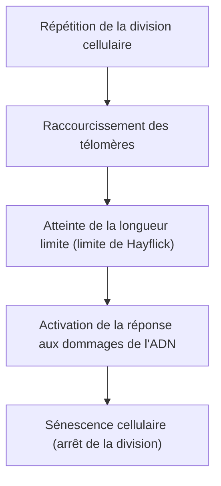

# Le mécanisme du vieillissement : pourquoi vieillissons-nous ?

L'un des plus grands mystères que l'humanité ait entretenu depuis le début de l'histoire est le « vieillissement ». Pourquoi notre corps se détériore-t-il avec le temps et finit-il par mourir ? Autrefois, le vieillissement était considéré comme une « fatalité de la nature inévitable », mais aujourd'hui, à la croisée de la biologie moléculaire moderne, de la génétique et de la physique, le vieillissement est en passe d'être redéfini comme une « maladie traitable » ou un « processus qui peut être retardé ».

Dans cet article, nous allons explorer en profondeur les mécanismes sous-jacents au vieillissement, allant du niveau cellulaire aux lois de la physique, en passant par le contexte évolutionniste et les dernières avancées de la science anti-âge.

## 1. Le vieillissement du point de vue de la physique : la loi de l'augmentation de l'entropie et la vie

Pour comprendre le vieillissement, la perspective la plus fondamentale réside dans la physique, et en particulier dans la deuxième loi de la thermodynamique (la loi de l'augmentation de l'entropie). Tout système dans cet univers, s'il est laissé à lui-même, passe d'un état ordonné à un état désordonné. Tout comme un café chaud se refroidit et le fer rouille, la matière se désintègre en dissipant de l'énergie.

Les organismes vivants ne font pas exception. Notre corps est composé d'environ 37 billions de cellules et maintient un degré d'ordre très élevé, mais pour maintenir cet ordre, il doit consommer constamment de l'énergie (ATP) et s'autoréparer. Cependant, au cours de décennies de processus de réparation, des erreurs microscopiques (lésions de l'ADN, dénaturation des protéines, détérioration des organites cellulaires) s'accumulent. C'est l'« essence physique du vieillissement ».

La vie est comme un navire qui nage à contre-courant des vagues de l'entropie, et lorsque la capacité de réparation de la coque devient inférieure à la vitesse d'accumulation des dommages, le phénomène de vieillissement se manifeste.

## 2. L'horloge biologique du vieillissement : les télomères et la limite de Hayflick

Dans les années 1960, le biologiste cellulaire Leonard Hayflick a découvert que les cellules somatiques humaines ne peuvent pas se diviser indéfiniment, mais qu'elles s'arrêtent après environ 50 à 70 divisions. C'est ce qu'on appelle la « limite de Hayflick ».

La clé de ce phénomène réside dans les « télomères » présents aux extrémités des chromosomes. Les télomères sont comme les embouts en plastique au bout des lacets de chaussures, qui empêchent la perte d'informations génétiques importantes de l'ADN. Cependant, chaque fois que la cellule se divise et que l'ADN se réplique, en raison de la nature de l'ADN polymérase, les extrémités ne peuvent pas être complètement répliquées, et les télomères raccourcissent petit à petit.

Lorsque les télomères atteignent une certaine brièveté, la cellule perçoit cela comme de « graves dommages à l'ADN » et arrête définitivement sa propre division pour prévenir l'oncogenèse. C'est ce qu'on appelle la « sénescence cellulaire ». Une enzyme appelée télomérase a la capacité d'allonger ces télomères, mais chez l'homme, l'activité de cette enzyme est désactivée dans la plupart des cellules somatiques (à l'inverse, les cellules cancéreuses acquièrent l'immortalité en réactivant la télomérase).

## 3. Le coût de l'énergie : les mitochondries et les espèces réactives de l'oxygène (ROS)

L'énergie dont nous avons besoin pour vivre est produite par des organites intracellulaires appelés « mitochondries ». Les mitochondries utilisent l'oxygène pour brûler les nutriments et générer de l'ATP (adénosine triphosphate). Cependant, le fonctionnement de ce moteur biologique a un prix. C'est la production d'espèces réactives de l'oxygène (ROS : Reactive Oxygen Species).

Environ 1 à 2 % de l'oxygène absorbé par la respiration subit une réduction incomplète au cours de la chaîne de transport d'électrons et se transforme en ROS, qui possèdent un fort pouvoir oxydant. Bien qu'une quantité modérée de ROS soit nécessaire pour la signalisation intracellulaire, un excès de ROS oxyde et détruit les lipides des membranes cellulaires, les protéines, ainsi que l'ADN des mitochondries elles-mêmes (ADNmt).

Contrairement à l'ADN nucléaire, l'ADN mitochondrial ne bénéficie pas de la protection des protéines histones et ses mécanismes de réparation sont médiocres. Par conséquent, lorsque l'ADNmt est endommagé par les ROS, les mitochondries dysfonctionnelles génèrent encore plus de ROS, déclenchant ainsi une « spirale négative de la mort ». Cela devient un facteur majeur qui accélère le déclin du métabolisme énergétique et la progression du vieillissement.

## 4. La perte de l'épigénétique : l'effondrement de l'identité cellulaire

Ces dernières années, une attention particulière est portée aux anomalies de l'« épigénétique » à la pointe de la recherche sur le vieillissement.
Bien que toutes les cellules somatiques humaines possèdent le même ADN (génome), une cellule de la peau fonctionne comme de la peau, et une cellule nerveuse comme un nerf. Cela est dû à la présence de marqueurs épigénétiques (méthylation de l'ADN et modification des histones) qui contrôlent quelle partie de l'ADN est lue (activation ou désactivation des commutateurs).

Cependant, avec l'âge, ces marqueurs épigénétiques se dérèglent. Pour utiliser une analogie, c'est comme si la partition de l'orchestre (l'ADN) était maintenue intacte, mais que les instructions du chef d'orchestre (l'épigénétique) commençaient à se brouiller, conduisant les violons à jouer la partition des trompettes.

Des recherches menées par le professeur David Sinclair et son équipe à l'Université d'Harvard ont montré que lorsqu'une cassure double brin de l'ADN se produit, des facteurs épigénétiques quittent leur position initiale pour la réparer, et ne parviennent pas à y retourner précisément après la réparation, entraînant l'accumulation d'un « bruit épigénétique ». La théorie de l'information du vieillissement, selon laquelle cette accumulation de bruit est la cause fondamentale du vieillissement, bénéficie actuellement d'un large soutien.

## 5. La menace des cellules zombies : la sénescence cellulaire et le phénotype SASP

Les cellules sénescentes, qui ont cessé de se diviser, n'attendent pas simplement la mort en silence. Les cellules sénescentes qui ne sont pas éliminées par le système immunitaire et qui subsistent dans le corps sont appelées « cellules zombies ». Elles libèrent des substances inflammatoires nocives (cytokines, chimiokines, protéases, etc.) sur les cellules saines environnantes. Ce phénomène est appelé SASP (phénotype sécrétoire associé à la sénescence).

Le SASP, tout comme une pomme pourrie qui fait pourrir les autres pommes du panier, transforme les cellules normales environnantes en cellules sénescentes et provoque une micro-inflammation chronique. Cette inflammation chronique (Inflammaging : vieillissement inflammatoire) est le déclencheur de presque toutes les maladies liées à l'âge, telles que la maladie d'Alzheimer, l'artériosclérose, le diabète et le cancer.

## 6. Le contexte évolutionniste : pourquoi la sélection naturelle a-t-elle permis le vieillissement ?

Une question se pose alors : pourquoi, au cours de l'évolution, n'avons-nous pas acquis un « corps qui ne vieillit pas » ?

Selon la « théorie de l'accumulation des mutations » proposée par le biologiste de l'évolution Peter Medawar, dans un environnement sauvage, de nombreux individus meurent avant d'atteindre un âge avancé à cause des prédateurs, des maladies, de la famine, etc. Par conséquent, la force de la sélection naturelle ne s'exerce pas sur les mutations génétiques qui ont des effets néfastes tard dans la vie (après l'âge de reproduction).

De plus, selon la « théorie de la pléiotropie antagoniste » de George Williams, les gènes qui favorisent la survie et la reproduction pendant la jeunesse auraient des effets néfastes (vieillissement) à un âge avancé. Par exemple, une protéine kinase appelée « mTOR », qui favorise la croissance cellulaire et préserve la jeunesse, est indispensable pendant la phase de croissance. Cependant, si elle reste excessivement activée au-delà de l'âge moyen, elle inhibe le mécanisme d'auto-nettoyage des cellules (autophagie) et accélère le vieillissement.

En d'autres termes, l'évolution a donné la priorité à la « pérennité de l'espèce (la reproduction) » et a abandonné l'idée d'un « entretien permanent de l'individu ».

## 7. Les dernières sciences anti-âge et les perspectives d'avenir

Bien que le processus de vieillissement semble désespéré, la science moderne commence à trouver des moyens de riposter. À mesure que les mécanismes du vieillissement sont élucidés, des approches pour le retarder, voire l'inverser, sont développées les unes après les autres.

- **Boosters de NAD+ (NMN, NR)** :
  Le NAD+, une coenzyme essentielle à la production d'énergie cellulaire, à la réparation de l'ADN et à l'activation des sirtuines (gènes de longévité), diminue avec l'âge. Des recherches sont en cours pour rajeunir les cellules en complétant des précurseurs tels que le NMN (mononucléotide de nicotinamide).

- **Sénolytiques (médicaments éliminant les cellules sénescentes)** :
  Ce sont des médicaments qui détruisent sélectivement les cellules zombies (cellules sénescentes) accumulées dans le corps. Des associations comme le dasatinib et la quercétine ont prouvé leur capacité à prolonger la durée de vie des souris et à améliorer considérablement leur durée de vie en bonne santé ; des essais cliniques chez l'homme sont actuellement en cours.

- **Rapamycine et inhibition de mTOR** :
  La rapamycine, découverte comme immunosuppresseur pour les transplantations d'organes, inhibe la voie mTOR qui favorise le vieillissement et active l'autophagie (fonction de nettoyage des déchets cellulaires). Elle est actuellement considérée comme l'un des médicaments les plus prometteurs pour prolonger la durée de vie.

- **Reprogrammation partielle par les facteurs de Yamanaka** :
  Lorsque les quatre gènes (facteurs de Yamanaka) découverts par le professeur Shinya Yamanaka, lauréat du prix Nobel, sont introduits dans une cellule, celle-ci rajeunit en une cellule souche pluripotente (cellule iPS). Des entreprises, telles qu'Altos Labs, financées par des capitaux colossaux, mènent des recherches sur la « reprogrammation partielle » (Partial Reprogramming), qui consiste à réaliser cela « partiellement » in vivo, afin de remonter uniquement l'horloge épigénétique sans faire perdre aux cellules leur identité.

## Conclusion

Le vieillissement n'est plus un « phénomène naturel inexpliqué », mais a subi un changement de paradigme pour devenir un « processus biologique sur lequel on peut intervenir ». Le raccourcissement des télomères, la détérioration des mitochondries, l'accumulation de bruit épigénétique et la prolifération de cellules zombies. En ciblant chacune de ces « caractéristiques du vieillissement (Hallmarks of Aging) », nous sommes sur le point de défier nos propres limites biologiques pour la première fois dans l'histoire de l'humanité.

Bien sûr, une prolongation spectaculaire de l'espérance de vie risque d'engendrer des problèmes sociaux sans précédent, touchant au système de retraites, à l'économie de la santé et à la démographie mondiale. Toutefois, le véritable objectif des sciences anti-âge n'est pas simplement de prolonger la durée de vie (Lifespan), mais de maximiser la période pendant laquelle nous pouvons vivre en bonne santé et de manière autonome (Healthspan).

La raison pour laquelle nous vieillissons. Ce fut le produit d'un compromis entre la loi cosmique de l'entropie et l'évolution qui donne la priorité à la reproduction. Cependant, grâce à son intelligence, l'humanité est aujourd'hui sur le point de se libérer de cette malédiction génétique.
