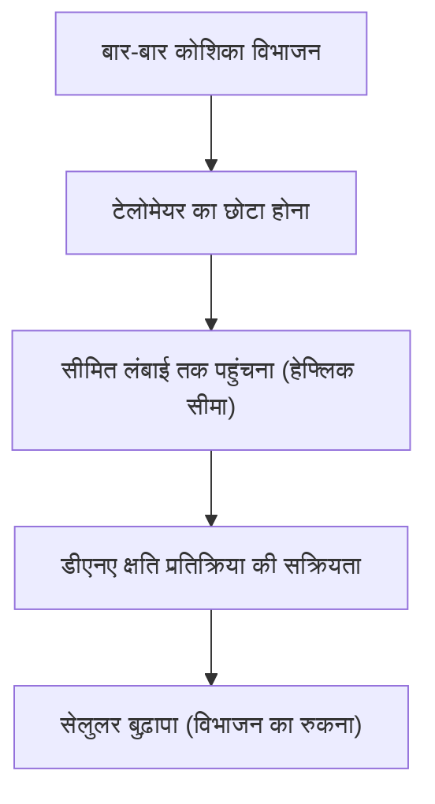

# बुढ़ापे का तंत्र: हम बूढ़े क्यों होते हैं

मानव इतिहास के शुरुआत से ही सबसे बड़े रहस्यों में से एक "बुढ़ापा" (aging) रहा है। समय के साथ हमारा शरीर क्यों कमजोर हो जाता है और अंततः मृत्यु को प्राप्त होता है? अतीत में, बुढ़ापे को "अपरिहार्य प्राकृतिक नियम" मानकर खारिज कर दिया जाता था, लेकिन आधुनिक आणविक जीव विज्ञान (molecular biology), आनुवंशिकी (genetics), और भौतिकी (physics) के चौराहे पर, बुढ़ापे को अब "इलाज योग्य बीमारी" या "देरी की जा सकने वाली प्रक्रिया" के रूप में फिर से परिभाषित किया जा रहा है।

इस लेख में, हम सेलुलर स्तर से लेकर भौतिक नियमों, विकासवादी (evolutionary) पृष्ठभूमि, और नवीनतम एंटी-एजिंग (anti-aging) विज्ञान तक, बुढ़ापे के मूल तंत्रों (mechanisms) की गहराई से पड़ताल करेंगे।

## 1. भौतिकी के दृष्टिकोण से बुढ़ापा: एन्ट्रापी वृद्धि का नियम और जीवन

बुढ़ापे को समझने के लिए सबसे मौलिक दृष्टिकोण भौतिकी (physics), विशेष रूप से ऊष्मप्रवैगिकी के दूसरे नियम (second law of thermodynamics - एन्ट्रापी वृद्धि का नियम) में निहित है। इस ब्रह्मांड की हर प्रणाली, अगर उसे उसके हाल पर छोड़ दिया जाए, तो वह एक व्यवस्थित स्थिति से अव्यवस्थित स्थिति में चली जाती है। जिस प्रकार गर्म कॉफी ठंडी हो जाती है और लोहे में जंग लग जाता है, उसी तरह पदार्थ अपनी ऊर्जा को बिखेरते हुए क्षय (decay) की ओर बढ़ते हैं।

जीवित प्राणी भी इसके अपवाद नहीं हैं। हमारा शरीर लगभग 37 ट्रिलियन कोशिकाओं से बना है और यह उच्च स्तर की व्यवस्था बनाए रखता है, लेकिन इस व्यवस्था को बनाए रखने के लिए, इसे निरंतर ऊर्जा (ATP) की खपत और स्व-मरम्मत (self-repair) करने की आवश्यकता होती है। हालाँकि, दशकों तक चलने वाली मरम्मत प्रक्रियाओं के दौरान, सूक्ष्म त्रुटियाँ (डीएनए क्षति, प्रोटीन विकृतीकरण, और सेलुलर ऑर्गेनेल का क्षरण) जमा होती जाती हैं। यही "बुढ़ापे का भौतिक सार" है।

जीवन एक ऐसे जहाज की तरह है जो एन्ट्रापी की लहरों के खिलाफ तैरता है, और जब पतवार की मरम्मत करने की क्षमता क्षति के संचय दर से कम हो जाती है, तो बुढ़ापे की घटना प्रकट होती है।

## 2. जैविक बुढ़ापे की घड़ी: टेलोमेयर और हेफ्लिक सीमा

1960 के दशक में, सेल बायोलॉजिस्ट लियोनार्ड हेफ्लिक ने खोज की कि मानव दैहिक कोशिकाएं (somatic cells) अनिश्चित काल तक विभाजित नहीं हो सकती हैं, बल्कि लगभग 50 से 70 बार विभाजित होने के बाद रुक जाती हैं। इसे "हेफ्लिक सीमा" (Hayflick limit) कहा जाता है।

इस घटना की कुंजी गुणसूत्रों (chromosomes) के सिरों पर मौजूद "टेलोमेयर" (telomeres) हैं। टेलोमेयर जूतों के फीतों के सिरों पर लगे प्लास्टिक कैप की तरह होते हैं, जो डीएनए की महत्वपूर्ण आनुवंशिक जानकारी को नष्ट होने से बचाते हैं। हालाँकि, हर बार जब कोई कोशिका विभाजित होती है और अपने डीएनए की प्रतिकृति (replicate) बनाती है, तो डीएनए पोलीमरेज़ (DNA polymerase) की प्रकृति के कारण सिरों की पूरी तरह से प्रतिकृति नहीं बन पाती है, जिससे टेलोमेयर धीरे-धीरे छोटे होते जाते हैं।

जब टेलोमेयर एक निश्चित छोटी लंबाई तक पहुंच जाते हैं, तो कोशिका इसे "गंभीर डीएनए क्षति" के रूप में गलत समझ लेती है और कैंसर को रोकने के लिए अपने विभाजन को स्थायी रूप से रोक देती है। इसे "सेलुलर बुढ़ापा" (cellular senescence) कहा जाता है। टेलोमेरेज़ (telomerase) नामक एंजाइम में इस टेलोमेयर को लंबा करने की क्षमता होती है, लेकिन कई मानव दैहिक कोशिकाओं में इस एंजाइम की गतिविधि बंद होती है (इसके विपरीत, कैंसर कोशिकाएं टेलोमेरेज़ को फिर से सक्रिय करके अमरता प्राप्त कर लेती हैं)।

## 3. ऊर्जा की कीमत: माइटोकॉन्ड्रिया और रिएक्टिव ऑक्सीजन प्रजातियां (ROS)

जीवित रहने के लिए हमें जिस ऊर्जा की आवश्यकता होती है, वह कोशिकाओं के अंदर "माइटोकॉन्ड्रिया" (mitochondria) नामक ऑर्गेनेल में उत्पन्न होती है। माइटोकॉन्ड्रिया पोषक तत्वों को जलाने और एटीपी (एडेनोसिन ट्राइफॉस्फेट) उत्पन्न करने के लिए ऑक्सीजन का उपयोग करते हैं। हालाँकि, इस जैविक इंजन के संचालन की एक कीमत चुकानी पड़ती है, जो कि रिएक्टिव ऑक्सीजन प्रजातियों (Reactive Oxygen Species: ROS) का उत्पादन है।

श्वसन के माध्यम से ली जाने वाली ऑक्सीजन का लगभग 1-2% इलेक्ट्रॉन परिवहन श्रृंखला (electron transport chain) के दौरान अपूर्ण रूप से कम (reduced) हो जाता है, जिससे यह शक्तिशाली ऑक्सीकरण शक्ति वाले ROS में बदल जाता है। यद्यपि मध्यम स्तर के ROS सेलुलर सिग्नलिंग के लिए आवश्यक हैं, अतिरिक्त ROS कोशिका झिल्ली के लिपिड, प्रोटीन, और स्वयं माइटोकॉन्ड्रिया के डीएनए (mtDNA) को ऑक्सीकृत और नष्ट कर देते हैं।

परमाणु डीएनए (nuclear DNA) के विपरीत, माइटोकॉन्ड्रियल डीएनए में हिस्टोन प्रोटीन (histone proteins) द्वारा सुरक्षा का अभाव होता है, और इसकी मरम्मत तंत्र भी कमजोर होता है। इसलिए, जब ROS द्वारा mtDNA क्षतिग्रस्त हो जाता है, तो निष्क्रिय माइटोकॉन्ड्रिया और अधिक ROS उत्पन्न करते हैं, जिससे "मृत्यु की नकारात्मक श्रृंखला" शुरू हो जाती है। यह ऊर्जा चयापचय (energy metabolism) में गिरावट और बुढ़ापे की प्रगति को तेज करने वाला एक प्रमुख कारक बन जाता है।

## 4. एपिजेनेटिक्स का नुकसान: सेलुलर पहचान का पतन

हाल के वर्षों में, बुढ़ापे के अनुसंधान में सबसे आगे रहने वाला विषय "एपिजेनेटिक्स" (epigenetics) में असामान्यताएं हैं।
मानव शरीर की सभी दैहिक कोशिकाओं में एक ही डीएनए (जीनोम) होता है, लेकिन त्वचा कोशिकाएं त्वचा के रूप में कार्य करती हैं और तंत्रिका कोशिकाएं तंत्रिकाओं के रूप में कार्य करती हैं। ऐसा इसलिए है क्योंकि एपिजेनेटिक निशान (डीएनए मिथाइलेशन और हिस्टोन संशोधन) मौजूद होते हैं जो नियंत्रित करते हैं कि डीएनए के किन हिस्सों को पढ़ा जाए (स्विच ऑन और ऑफ)।

हालाँकि, उम्र बढ़ने के साथ, ये एपिजेनेटिक निशान अव्यवस्थित हो जाते हैं। एक सादृश्य के रूप में, यह ऐसा है जैसे एक आर्केस्ट्रा का संगीत स्कोर (डीएनए) ठीक से रखा गया है, लेकिन कंडक्टर के निर्देश (एपिजेनेटिक्स) गलत होने लगते हैं, और वायलिन तुरही (trumpet) का हिस्सा बजाना शुरू कर देता है।

हार्वर्ड विश्वविद्यालय के प्रोफेसर डेविड सिंक्लेयर और अन्य के शोध से पता चला है कि जब डीएनए में डबल-स्ट्रैंड ब्रेक (double-strand breaks) होते हैं, तो एपिजेनेटिक कारक इसकी मरम्मत के लिए अपने मूल स्थान छोड़ देते हैं, और मरम्मत के बाद वे अपने मूल स्थान पर ठीक से वापस नहीं आ पाते हैं, जिससे "एपिजेनेटिक शोर" (epigenetic noise) जमा हो जाता है। इस शोर का संचय बुढ़ापे का मूल कारण है, यह "बुढ़ापे का सूचना सिद्धांत" (Information Theory of Aging) वर्तमान में व्यापक समर्थन प्राप्त कर रहा है।

## 5. ज़ोंबी कोशिकाओं का खतरा: सेलुलर बुढ़ापा और SASP

विभाजन बंद कर चुकी बूढ़ी कोशिकाएं चुपचाप मरने का इंतजार नहीं करती हैं। वे बूढ़ी कोशिकाएं जिन्हें प्रतिरक्षा प्रणाली (immune system) द्वारा साफ नहीं किया जाता है और शरीर में बनी रहती हैं, उन्हें "ज़ोंबी कोशिकाएं" (zombie cells) कहा जाता है। ये कोशिकाएं हानिकारक सूजन वाले पदार्थों (साइटोकिन्स, केमोकाइन्स, प्रोटीज़ आदि) को आसपास की स्वस्थ कोशिकाओं में फैलाती हैं। इस घटना को SASP (Senescence-Associated Secretory Phenotype) कहा जाता है।

SASP, ठीक उसी तरह जैसे एक सड़ा हुआ सेब बॉक्स में अन्य सेबों को सड़ा देता है, आसपास की सामान्य कोशिकाओं को भी बूढ़ी कोशिकाओं में बदल देता है, जिससे पुरानी सूक्ष्म-सूजन (chronic micro-inflammation) होती है। यह पुरानी सूजन (Inflammaging) उम्र बढ़ने से जुड़ी लगभग सभी बीमारियों, जैसे कि अल्जाइमर रोग, एथेरोस्क्लेरोसिस, मधुमेह, और कैंसर का कारण बनती है।

## 6. विकासवादी पृष्ठभूमि: प्राकृतिक चयन ने बुढ़ापे की अनुमति क्यों दी?

यहाँ एक सवाल उठता है। विकासवाद (evolution) की प्रक्रिया में, हमने "न बूढ़ा होने वाला शरीर" क्यों प्राप्त नहीं किया?

विकासवादी जीवविज्ञानी पीटर मेडावर द्वारा प्रस्तावित "म्यूटेशन एक्यूमुलेशन थ्योरी" (Mutation Accumulation Theory) के अनुसार, जंगली वातावरण में, अधिकांश व्यक्ति वृद्धावस्था तक पहुंचने से पहले शिकारियों, बीमारी, या भुखमरी से मर जाते हैं। इसलिए, जीवन के बाद के चरणों (प्रजनन आयु के बाद) में नकारात्मक प्रभाव डालने वाले आनुवंशिक उत्परिवर्तनों (genetic mutations) के खिलाफ प्राकृतिक चयन (natural selection) की शक्ति काम नहीं करती है।

इसके अलावा, जॉर्ज विलियम्स के "एंटागोनिस्टिक प्लियोट्रॉपी थ्योरी" (Antagonistic Pleiotropy Theory) के अनुसार, जो जीन युवाओं में अस्तित्व और प्रजनन के लिए फायदेमंद होते हैं, वे बुढ़ापे में हानिकारक प्रभाव (बुढ़ापा) पैदा कर सकते हैं। उदाहरण के लिए, "mTOR" नामक प्रोटीन काइनेज जो कोशिका के विकास को बढ़ावा देता है और जवानी बनाए रखता है, विकास के चरण के दौरान आवश्यक है, लेकिन यदि यह मध्यम आयु और उसके बाद अत्यधिक सक्रिय रहता है, तो यह कोशिका के स्वयं-सफाई तंत्र (ऑटोफैगी - autophagy) को रोकता है और बुढ़ापे को बढ़ावा देता है।

दूसरे शब्दों में, विकासवाद ने "प्रजातियों के अस्तित्व (प्रजनन)" को सर्वोच्च प्राथमिकता दी और "व्यक्तियों के स्थायी रखरखाव" को छोड़ दिया।

## 7. नवीनतम एंटी-एजिंग विज्ञान और भविष्य की संभावनाएं

बुढ़ापे की प्रक्रिया भले ही निराशाजनक लगे, लेकिन आधुनिक विज्ञान जवाबी हमला करने का रास्ता खोज रहा है। जैसे-जैसे बुढ़ापे के तंत्र को समझा जा रहा है, इसे धीमा करने या उलटने के लिए एक के बाद জনপ্রति दृष्टिकोण विकसित किए जा रहे हैं।

- **NAD+ बूस्टर (NMN, NR)**:
  NAD+ एक आवश्यक कोएंजाइम (coenzyme) है जो सेलुलर ऊर्जा उत्पादन, डीएनए मरम्मत, और सिर्टुइन (sirtuins - दीर्घायु जीन) की सक्रियता के लिए महत्वपूर्ण है। उम्र के साथ इसकी मात्रा कम हो जाती है। NMN (निकोटीनैमाइड मोनोन्यूक्लियोटाइड) जैसे अग्रदूतों (precursors) के पूरक के माध्यम से कोशिकाओं को फिर से जीवंत करने के लिए अनुसंधान प्रगति पर है।

- **सेनोलिटिक्स (Senolytics - बूढ़ी कोशिकाओं को हटाने वाली दवाएं)**:
  ये ऐसी दवाएं हैं जो शरीर में जमा हुई ज़ोंबी कोशिकाओं (बूढ़ी कोशिकाओं) को चुनिंदा रूप से मारती हैं। यह साबित हो चुका है कि डायसैटिनिब (dasatinib) और क्वेरसेटिन (quercetin) का संयोजन चूहों के जीवनकाल को बढ़ाता है और नाटकीय रूप से स्वास्थ्य काल (healthspan) में सुधार करता है, और वर्तमान में मानव नैदानिक परीक्षण (human clinical trials) चल रहे हैं।

- **रैपामाइसिन (Rapamycin) और mTOR निषेध**:
  रैपामाइसिन, जिसे मूल रूप से अंग प्रत्यारोपण के लिए एक प्रतिरक्षादमनकारी (immunosuppressant) के रूप में खोजा गया था, mTOR मार्ग को रोकता है जो बुढ़ापे को बढ़ावा देता है, और ऑटोफैगी (कोशिका के कचरा सफाई कार्य) को सक्रिय करता है। वर्तमान में इसे सबसे विश्वसनीय जीवन-विस्तार दवाओं (life-extension drugs) में से एक माना जाता है।

- **यामानाका कारकों (Yamanaka factors) द्वारा आंशिक रिप्रोग्रामिंग**:
  नोबेल पुरस्कार विजेता प्रोफेसर शिन्या यामानाका द्वारा खोजे गए चार जीनों (यामानाका कारकों) को जब कोशिकाओं में पेश किया जाता है, तो कोशिकाएं प्लुरिपोटेंट स्टेम सेल (iPS कोशिकाओं) में फिर से जीवंत हो जाती हैं। विवो (in vivo) में इसे "आंशिक रूप से" (partially) करने से, कोशिकाओं की पहचान खोए बिना केवल एपिजेनेटिक घड़ी को वापस मोड़ने पर शोध, ऑल्टोस लैब्स (Altos Labs) जैसी कंपनियों द्वारा बड़े पैमाने पर वित्त पोषण के साथ आगे बढ़ाया जा रहा है।

## निष्कर्ष

बुढ़ापा अब "अस्पष्टीकृत प्राकृतिक घटना" नहीं है, बल्कि एक "हस्तक्षेप योग्य जैविक प्रक्रिया" (intervenable biological process) में प्रतिमान बदलाव (paradigm shift) से गुजर चुका है। टेलोमेयर का छोटा होना, माइटोकॉन्ड्रियल क्षरण, एपिजेनेटिक शोर का संचय, और ज़ोंबी कोशिकाओं का प्रसार। इन "बुढ़ापे की विशेषताओं" (Hallmarks of Aging) में से प्रत्येक को लक्षित करके, हम मानव इतिहास में पहली बार अपनी जैविक सीमाओं को चुनौती देने वाले हैं।

बेशक, जीवनकाल में नाटकीय वृद्धि से अभूतपूर्व सामाजिक समस्याएं भी पैदा हो सकती हैं, जैसे पेंशन प्रणाली, चिकित्सा अर्थव्यवस्था, और वैश्विक जनसंख्या के मुद्दे। हालाँकि, एंटी-एजिंग विज्ञान का वास्तविक उद्देश्य केवल जीवनकाल (Lifespan) को बढ़ाना नहीं है, बल्कि स्वस्थ और स्वतंत्र रूप से जीने की अवधि, जिसे स्वास्थ्य काल (Healthspan) कहा जाता है, को अधिकतम करना है।

हम बूढ़े क्यों होते हैं। यह ब्रह्मांड के एन्ट्रापी के नियम और विकासवाद के बीच एक समझौता था जो प्रजनन को सर्वोच्च प्राथमिकता देता है। लेकिन अब, अपनी बुद्धिमत्ता के माध्यम से, मानवता अपने जीनों के श्राप से मुक्त होने की कगार पर है。
