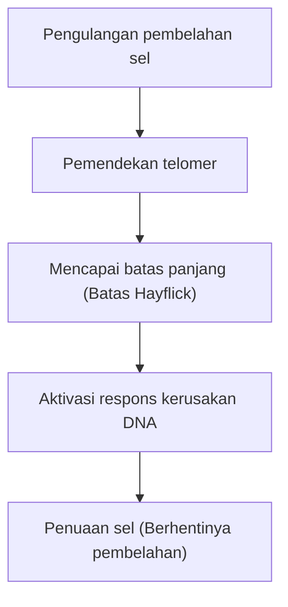

# Mekanisme Penuaan: Mengapa Kita Menua

Salah satu misteri terbesar yang terus menghantui umat manusia sejak awal sejarah adalah "penuaan". Mengapa tubuh kita memburuk seiring berjalannya waktu dan akhirnya mati? Di masa lalu, penuaan dianggap sebagai "hukum alam yang tak terhindarkan", namun di persimpangan biologi molekuler, genetika, dan fisika modern, penuaan mulai didefinisikan ulang sebagai "penyakit yang dapat diobati" atau "proses yang dapat ditunda".

Dalam artikel ini, kita akan menggali lebih dalam mekanisme yang mendasari penuaan, mulai dari tingkat sel hingga hukum fisika, latar belakang evolusioner, dan bahkan ilmu anti-penuaan (anti-aging) terbaru.

## 1. Penuaan dari Sudut Pandang Fisika: Hukum Peningkatan Entropi dan Kehidupan

Untuk memahami penuaan, perspektif yang paling mendasar ada pada fisika, khususnya Hukum Kedua Termodinamika (Hukum Peningkatan Entropi). Setiap sistem di alam semesta ini, jika dibiarkan, akan beralih dari keadaan teratur menjadi tidak teratur. Sama seperti kopi panas yang menjadi dingin dan besi yang berkarat, materi akan meluruh seiring dengan hilangnya energi.

Makhluk hidup tidak terkecuali. Tubuh kita terdiri dari sekitar 37 triliun sel dan mempertahankan tingkat keteraturan yang tinggi, tetapi untuk mempertahankan keteraturan ini, tubuh perlu terus-menerus mengonsumsi energi (ATP) dan melakukan perbaikan diri. Namun, selama beberapa dekade proses perbaikan ini, kesalahan mikroskopis (kerusakan DNA, denaturasi protein, dan degradasi organel seluler) mulai menumpuk. Inilah "esensi fisik dari penuaan".

Kehidupan bagaikan kapal yang berlayar melawan gelombang entropi, dan ketika kemampuan kapal untuk memperbaiki diri turun di bawah tingkat akumulasi kerusakan, fenomena penuaan akan muncul ke permukaan.

## 2. Jam Penuaan Biologis: Telomer dan Batas Hayflick

Pada tahun 1960-an, ahli biologi seluler Leonard Hayflick menemukan bahwa sel somatik manusia tidak dapat membelah tanpa batas, melainkan akan berhenti membelah setelah sekitar 50 hingga 70 kali pembelahan. Inilah yang disebut "Batas Hayflick".

Kunci dari fenomena ini adalah "telomer" yang terletak di ujung kromosom. Telomer bertindak seperti tutup plastik di ujung tali sepatu, mencegah hilangnya informasi genetik penting dalam DNA. Namun, setiap kali sel membelah dan mereplikasi DNA-nya, karena sifat DNA polimerase, ujungnya tidak dapat direplikasi secara sempurna, sehingga telomer menjadi semakin pendek.

Ketika telomer mencapai tingkat kependekan tertentu, sel salah mengartikannya sebagai "kerusakan DNA yang parah" dan secara permanen menghentikan pembelahannya sendiri untuk mencegah pembentukan kanker. Inilah yang disebut "penuaan sel" (cellular senescence). Enzim yang disebut telomerase memiliki kemampuan untuk memperpanjang telomer ini, namun pada sebagian besar sel somatik manusia, aktivitas enzim ini dimatikan (sebaliknya, sel kanker memperoleh keabadian dengan mengaktifkan kembali telomerase).

## 3. Harga dari Energi: Mitokondria dan Spesies Oksigen Reaktif (ROS)

Energi yang kita butuhkan untuk hidup diproduksi oleh organel seluler yang disebut "mitokondria". Mitokondria menggunakan oksigen untuk membakar nutrisi dan menghasilkan ATP (Adenosin Trifosfat). Namun, ada harga yang harus dibayar untuk pengoperasian mesin biologis ini. Itulah pembentukan Spesies Oksigen Reaktif (Reactive Oxygen Species: ROS).

Sekitar 1-2% oksigen yang dihirup mengalami reduksi tidak sempurna selama proses rantai transpor elektron, berubah menjadi ROS yang memiliki daya oksidasi kuat. Jumlah ROS yang moderat diperlukan untuk pensinyalan intraseluler, tetapi ROS yang berlebihan akan mengoksidasi dan menghancurkan lipid membran sel, protein, dan DNA mitokondria itu sendiri (mtDNA).

Berbeda dengan DNA nukleus, DNA mitokondria tidak memiliki perlindungan dari protein histon, dan mekanisme perbaikannya pun buruk. Oleh karena itu, ketika mtDNA rusak oleh ROS, mitokondria yang disfungsional tersebut akan menghasilkan lebih banyak ROS lagi, memulai "lingkaran setan kematian". Hal ini menjadi faktor utama yang mempercepat penurunan metabolisme energi dan laju penuaan.

## 4. Hilangnya Epigenetik: Runtuhnya Identitas Sel

Dalam beberapa tahun terakhir, "epigenetika" (epigenetics) yang abnormal telah menarik banyak perhatian di garis depan penelitian penuaan.
Semua sel somatik pada manusia memiliki DNA (genom) yang sama, namun sel kulit berfungsi sebagai kulit, dan sel saraf berfungsi sebagai saraf. Hal ini disebabkan karena adanya penanda epigenetik (metilasi DNA dan modifikasi histon) yang mengendalikan bagian DNA mana yang akan dibaca (menghidupkan atau mematikan saklar).

Namun seiring bertambahnya usia, penanda epigenetik ini menjadi kacau. Ibaratnya, lembaran partitur orkestra (DNA) tetap terjaga dengan baik, namun instruksi dari konduktor (epigenetik) mulai kacau, sehingga biola mulai memainkan bagian trompet.

Penelitian oleh Profesor David Sinclair dan timnya di Universitas Harvard menunjukkan bahwa ketika pemutusan rantai ganda DNA terjadi, faktor-faktor epigenetik akan meninggalkan lokasi aslinya untuk memperbaikinya, namun kegagalan untuk kembali ke lokasi aslinya secara akurat setelah perbaikan akan menyebabkan penumpukan "kebisingan epigenetik" (epigenetic noise). Teori yang menyatakan bahwa akumulasi kebisingan inilah yang menjadi penyebab mendasar dari penuaan, yang dikenal sebagai "Teori Informasi Penuaan", saat ini mendapatkan banyak dukungan.

## 5. Ancaman Sel Zombie: Penuaan Sel dan SASP

Sel yang menua dan berhenti membelah tidak serta merta menunggu kematian dalam diam. Sel-sel menua yang tidak disingkirkan oleh sistem kekebalan tubuh dan tetap berada di dalam tubuh disebut "sel zombie", dan mereka menyebarkan zat inflamasi berbahaya (seperti sitokin, kemokin, dan enzim proteolitik) ke sel-sel sehat di sekitarnya. Fenomena ini disebut SASP (Senescence-Associated Secretory Phenotype).

SASP, ibarat apel busuk yang membuat apel lain di dalam keranjang ikut membusuk, mengubah sel-sel normal di sekitarnya menjadi sel-sel tua, memicu peradangan mikro kronis. Peradangan kronis ini (Inflammaging: penuaan inflamasi) adalah pemicu hampir semua penyakit terkait usia, seperti penyakit Alzheimer, arteriosklerosis, diabetes, dan kanker.

## 6. Latar Belakang Evolusioner: Mengapa Seleksi Alam Membiarkan Penuaan?

Di sini muncul satu pertanyaan. Mengapa dalam proses evolusi, kita tidak memperoleh "tubuh yang tidak menua"?

Menurut "Teori Akumulasi Mutasi" yang diusulkan oleh ahli biologi evolusi Peter Medawar, di alam liar, banyak individu mati sebelum mencapai usia tua akibat pemangsa, penyakit, atau kelaparan. Oleh karena itu, tekanan seleksi alam tidak bekerja kuat terhadap mutasi genetik yang memberikan efek buruk pada tahap akhir kehidupan (setelah melewati usia reproduksi).

Lebih lanjut, menurut "Teori Pleiotropi Antagonistik" dari George Williams, gen yang menguntungkan untuk kelangsungan hidup dan reproduksi di usia muda diyakini membawa efek berbahaya (penuaan) di usia tua. Sebagai contoh, protein kinase yang disebut "mTOR" yang mendorong pertumbuhan sel dan menjaga keremajaan sangat penting selama masa pertumbuhan, namun jika masih terlalu aktif pada usia paruh baya dan seterusnya, ia akan menghambat mekanisme pembersihan diri sel (autofagi) dan mempercepat penuaan.

Dengan kata lain, evolusi memprioritaskan "kelangsungan spesies (reproduksi)" di atas segalanya, dan mengabaikan "pemeliharaan permanen individu".

## 7. Ilmu Anti-Penuaan Terbaru dan Prospek Masa Depan

Meskipun proses penuaan tampak menyedihkan, ilmu pengetahuan modern mulai menemukan celah untuk melawan balik. Seiring dengan terungkapnya mekanisme penuaan, berbagai pendekatan untuk menunda, atau bahkan membalikkannya, terus dikembangkan satu per satu.

- **Penguat NAD+ (NMN, NR)**:
  NAD+, sebuah koenzim yang penting untuk produksi energi seluler, perbaikan DNA, dan aktivasi sirtuin (gen umur panjang), menurun seiring bertambahnya usia. Penelitian terus dilakukan untuk meremajakan sel dengan memberikan prekursor seperti NMN (Nicotinamide Mononucleotide).

- **Senolitik (Obat Penghilang Sel Tua)**:
  Ini adalah obat yang secara selektif membunuh sel zombie (sel tua) yang terakumulasi di dalam tubuh. Kombinasi Dasatinib dan Quercetin telah terbukti memperpanjang umur dan secara dramatis meningkatkan rentang kesehatan (healthspan) pada tikus, dan uji klinis pada manusia saat ini sedang berlangsung.

- **Rapamycin dan Penghambatan mTOR**:
  Rapamycin, yang awalnya ditemukan sebagai obat imunosupresan untuk transplantasi organ, menghambat jalur mTOR yang mempercepat penuaan dan mengaktifkan autofagi (fungsi pembersihan sel). Saat ini, Rapamycin menarik perhatian sebagai salah satu obat perpanjangan umur yang paling menjanjikan.

- **Pemrograman Ulang Parsial dengan Faktor Yamanaka**:
  Ketika 4 gen (Faktor Yamanaka) yang ditemukan oleh peraih Hadiah Nobel Profesor Shinya Yamanaka dimasukkan ke dalam sel, sel tersebut akan meremaja menjadi sel punca pluripoten (sel iPS). Penelitian tentang "Pemrograman Ulang Parsial" (Partial Reprogramming), yang melakukan hal ini secara "parsial" secara in vivo untuk memutar balik waktu epigenetik tanpa menghilangkan identitas sel, sedang dilakukan oleh perusahaan dengan pendanaan besar seperti Altos Labs.

## Kesimpulan

Penuaan bukan lagi "fenomena alam yang belum terpecahkan", melainkan telah mengalami pergeseran paradigma menjadi "proses biologis yang dapat diintervensi". Pemendekan telomer, degradasi mitokondria, akumulasi kebisingan epigenetik, dan penyebaran sel zombie. Dengan menargetkan satu per satu dari "Ciri-Ciri Penuaan" (Hallmarks of Aging) ini, untuk pertama kalinya dalam sejarah umat manusia, kita mencoba untuk menantang batas biologis kita sendiri.

Tentu saja, perpanjangan umur yang dramatis juga membawa kemungkinan munculnya masalah sosial yang belum pernah terjadi sebelumnya, seperti sistem pensiun, ekonomi medis, dan masalah populasi global. Namun, tujuan sebenarnya dari ilmu anti-penuaan bukanlah sekadar memperpanjang umur (Lifespan), melainkan untuk memaksimalkan periode di mana kita dapat hidup sehat dan mandiri (Healthspan).

Alasan mengapa kita menua. Itu adalah produk kompromi antara hukum entropi alam semesta dan evolusi yang memprioritaskan reproduksi di atas segalanya. Namun sekarang, umat manusia, dengan kecerdasannya sendiri, mencoba melepaskan diri dari kutukan genetik tersebut.
