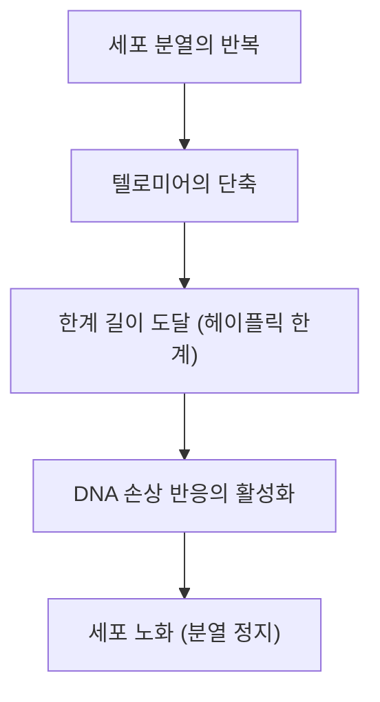

# 노화의 메커니즘: 우리는 왜 늙는가

인류가 유사 이래 계속 품어온 가장 큰 수수께끼 중 하나, 그것이 바로 '노화'입니다. 왜 우리의 몸은 시간이 지남에 따라 쇠약해지고 결국 죽음을 맞이하는 것일까요? 과거에 노화는 '피할 수 없는 자연의 섭리'로 치부되어 왔지만, 현대의 분자 생물학, 유전학, 그리고 물리학의 교차점에서 노화는 '치료 가능한 질환' 또는 '지연 가능한 과정'으로 재정의되고 있습니다.

본 기사에서는 노화의 기저에 있는 메커니즘을 세포 수준에서부터 물리 법칙, 진화론적 배경, 나아가 최신 항노화(안티에이징) 과학에 이르기까지 철저하게 파헤쳐 봅니다.

## 1. 물리학으로 보는 노화: 엔트로피 증가의 법칙과 생명

노화를 이해하는 데 있어 가장 근원적인 시각은 물리학, 특히 열역학 제2법칙(엔트로피 증가의 법칙)에 있습니다. 이 우주에 있는 모든 시스템은 내버려 두면 질서 있는 상태에서 무질서한 상태로 이동합니다. 뜨거운 커피가 식고, 철이 녹슬듯이 물질은 에너지를 소산시키며 붕괴해 갑니다.

생명체도 예외는 아닙니다. 우리의 몸은 약 37조 개의 세포로 구성되어 있으며 고도의 질서를 유지하고 있지만, 이 질서를 유지하기 위해서는 끊임없이 에너지(ATP)를 소비하고 자가 치유를 수행해야 합니다. 그러나 수십 년에 걸친 복구 과정에서 미세한 오류(DNA 손상, 단백질 변성, 세포소기관의 열화)가 축적되어 갑니다. 이것이 '노화의 물리적 본질'입니다.

생명은 엔트로피의 파도에 맞서 헤엄치는 배와 같으며, 선체의 복구 능력이 손상 축적 속도를 밑돌 때 노화라는 현상이 표면화되는 것입니다.

## 2. 생물학적 노화의 시계: 텔로미어와 헤이플릭 한계

1960년대, 세포 생물학자 레너드 헤이플릭은 인간의 체세포가 무한히 분열할 수 있는 것이 아니라 약 50~70회 분열한 후에 정지한다는 것을 발견했습니다. 이것이 '헤이플릭 한계'입니다.

이 현상의 열쇠를 쥐고 있는 것이 염색체 말단에 존재하는 '텔로미어'입니다. 텔로미어는 신발 끈 끝에 달린 플라스틱 캡과 같은 것으로, DNA의 중요한 유전 정보가 손실되는 것을 막아줍니다. 하지만 세포가 분열하여 DNA 복제를 할 때마다 DNA 폴리머라아제의 특성상 말단을 완전히 복제할 수 없어 텔로미어는 조금씩 짧아지게 됩니다.

텔로미어가 일정 수준 짧아지면, 세포는 이를 'DNA의 심각한 손상'으로 오인하고 암화를 막기 위해 자신의 분열을 영구적으로 정지시킵니다. 이것이 '세포 노화'입니다. 텔로머라아제라고 불리는 효소는 이 텔로미어를 연장하는 능력을 가지고 있지만, 인간의 많은 체세포에서는 이 효소의 활성이 꺼져 있습니다(반대로, 암세포는 텔로머라아제를 재활성화하여 불멸성을 획득합니다).

## 3. 에너지의 대가: 미토콘드리아와 활성 산소종 (ROS)

우리가 살아가기 위한 에너지는 세포 내 소기관인 '미토콘드리아'에서 만들어집니다. 미토콘드리아는 산소를 이용하여 영양소를 태우고 ATP(아데노신 삼인산)를 생성합니다. 그러나 이 생체 엔진의 가동에는 대가가 따릅니다. 그것이 바로 활성 산소종(Reactive Oxygen Species: ROS)의 발생입니다.

호흡으로 들이마신 산소의 약 1~2%는 전자 전달계 과정에서 불완전한 환원을 받아 강력한 산화력을 가진 ROS로 변화합니다. 적당한 ROS는 세포 내 신호 전달에 필요하지만, 과도한 ROS는 세포막의 지질, 단백질, 그리고 미토콘드리아 자신의 DNA(mtDNA)를 산화시키고 파괴합니다.

미토콘드리아 DNA는 핵 DNA와 달리 히스톤 단백질에 의한 보호가 없으며 복구 메커니즘도 빈약합니다. 따라서 ROS에 의해 mtDNA가 손상되면 기능 부전에 빠진 미토콘드리아가 더 많은 ROS를 발생시키는 '죽음의 연쇄 반응'이 시작됩니다. 이것이 에너지 대사의 저하와 노화의 진행을 가속화하는 큰 요인이 됩니다.

## 4. 후성유전학의 상실: 세포 정체성 붕괴

최근 노화 연구의 최전선에서 주목을 받고 있는 것이 '후성유전학(Epigenetics)'의 이상입니다.
인간의 모든 체세포는 동일한 DNA(게놈)를 가지고 있지만, 피부 세포는 피부로서, 신경 세포는 신경으로서 기능합니다. 이는 DNA의 어느 부분을 읽을지(스위치의 온/오프)를 제어하는 후성유전학적 표지(DNA 메틸화 및 히스톤 변형)가 존재하기 때문입니다.

그러나 나이가 들면서 이 후성유전학적 표지는 흐트러지게 됩니다. 비유하자면 오케스트라의 악보(DNA)는 깨끗하게 유지되고 있는데 지휘자의 지시(후성유전학)가 어긋나기 시작하여 바이올린이 트럼펫 파트를 연주해 버리는 것과 같은 상태입니다.

하버드 대학교의 데이비드 싱클레어 교수 등의 연구에 따르면, DNA 이중 가닥 절단이 일어나면 이를 복구하기 위해 후성유전학적 인자가 원래 위치를 떠나고, 복구 후 원래 위치로 정확히 돌아가지 못함으로써 '후성유전학적 노이즈'가 축적되는 것으로 나타났습니다. 이 노이즈의 축적이 바로 노화의 근본 원인이라고 하는 '노화의 정보 이론'이 현재 큰 지지를 얻고 있습니다.

## 5. 좀비 세포의 위협: 세포 노화와 SASP

분열을 멈춘 노화 세포는 그저 조용히 죽음을 기다리는 것만이 아닙니다. 면역 체계에 의해 제거되지 않고 체내에 자리 잡은 노화 세포는 '좀비 세포'로 불리며, 주변의 건강한 세포에 유해한 염증성 물질(사이토카인, 케모카인, 단백질 분해 효소 등)을 흩뿌립니다. 이 현상을 SASP(세포 노화 연관 분비 표현형)라고 부릅니다.

SASP는 마치 썩은 사과가 상자 안의 다른 사과를 썩게 만드는 것처럼, 주변의 정상 세포까지 노화 세포로 변모시키고 만성적인 미세 염증을 일으킵니다. 이 만성 염증(Inflammaging: 염증성 노화)은 알츠하이머병, 동맥경화, 당뇨병, 암 등 노화에 따른 거의 모든 질환의 촉발제가 됩니다.

## 6. 진화론적 배경: 왜 자연 선택은 노화를 허락했는가?

여기서 한 가지 의문이 생깁니다. 왜 진화의 과정에서 우리는 '늙지 않는 몸'을 얻지 못한 것일까요?

진화 생물학자 피터 메다워가 제창한 '돌연변이 축적설'에 따르면, 야생 환경에서는 포식자, 질병, 기아 등으로 인해 많은 개체가 노령에 도달하기 전에 죽어 버립니다. 따라서 인생의 후반기(생식 연령을 지난 후)에 악영향을 미치는 유전자 변이에 대해서는 자연 선택의 힘이 작용하지 않습니다.

또한 조지 윌리엄스의 '길항적 다면발현설'에 따르면 젊은 시절에 생존과 생식에 유리하게 작용하는 유전자가 노년기에는 반대로 해로운 작용(노화)을 가져온다고 여겨집니다. 예를 들어, 세포 성장을 촉진하고 젊음을 유지하는 'mTOR(엠토르)'라고 불리는 단백질 인산화효소는 성장기에는 필수적이지만 중장년 이후에도 과도하게 활성화되어 있으면 세포의 자가 정화 작용(오토파지)을 방해하여 노화를 촉진해 버립니다.

즉, 진화는 '종의 존속(생식)'을 최우선으로 여기고, '개체의 영구적인 유지보수'에는 단념을 한 것입니다.

## 7. 최신 항노화 과학과 미래에 대한 전망

절망적으로 보이는 노화 과정이지만, 현대 과학은 반격의 실마리를 잡아가고 있습니다. 노화의 메커니즘이 해명됨에 따라, 이를 지연시키거나 역전시키기 위한 접근법이 속속 개발되고 있습니다.

- **NAD+ 부스터 (NMN, NR)**:
  세포의 에너지 생산 및 DNA 복구, 시르투인(장수 유전자)의 활성화에 필수적인 조효소 NAD+는 나이가 들면서 감소합니다. NMN(니코틴아마이드 모노뉴클레오타이드) 등의 전구체를 보충함으로써 세포의 젊음을 되찾으려는 연구가 진행되고 있습니다.

- **세놀리틱스 (노화 세포 제거제)**:
  체내에 축적된 좀비 세포(노화 세포)를 선택적으로 사멸시키는 약물입니다. 다사티닙과 퀘르세틴의 조합 등이 쥐의 수명을 연장하고 건강 수명을 극적으로 향상시킨다는 것이 입증되었으며, 현재 인간을 대상으로 한 임상 시험이 진행 중입니다.

- **라파마이신과 mTOR 억제**:
  장기 이식의 면역 억제제로 발견된 라파마이신은 노화를 촉진하는 mTOR 경로를 억제하고 오토파지(세포의 쓰레기 청소 기능)를 활성화시킵니다. 현재 가장 확실한 수명 연장 약물 중 하나로 주목받고 있습니다.

- **야마나카 인자에 의한 부분적 재프로그래밍**:
  노벨상을 수상한 야마나카 신야 교수가 발견한 4개의 유전자(야마나카 인자)를 세포에 도입하면, 세포는 만능 줄기세포(iPS 세포)로 젊어집니다. 이것을 생체 내에서 '부분적으로' 수행하여 세포의 정체성을 잃지 않게 하면서 후성유전학적 시계만을 되감는 '부분적 재프로그래밍(Partial Reprogramming)' 연구가 알토스 랩스(Altos Labs) 등 거액의 자금을 투자한 기업에서 진행되고 있습니다.

## 결론

노화는 더 이상 '규명되지 않은 자연 현상'이 아니라 '개입 가능한 생물학적 과정'으로 패러다임 전환을 이루었습니다. 텔로미어의 단축, 미토콘드리아의 열화, 후성유전학적 노이즈의 축적, 그리고 좀비 세포의 만연. 이러한 '노화의 특징(Hallmarks of Aging)'을 하나하나 표적으로 삼음으로써, 우리는 인류 역사상 처음으로 우리 자신의 생물학적 한계에 도전하려고 합니다.

물론 수명의 극적인 연장은 연금 제도나 의료 경제, 전 지구적 인구 문제 등 전례 없는 사회 문제를 야기할 가능성도 내포하고 있습니다. 그러나 항노화 과학의 진정한 목적은 단순히 수명을 연장하는 것(Lifespan)이 아니라 건강하고 자립적으로 살아갈 수 있는 기간(Healthspan)을 극대화하는 데 있습니다.

우리가 늙어가는 이유. 그것은 엔트로피라는 우주의 법칙과 생식을 최우선으로 하는 진화의 타협의 산물이었습니다. 하지만 지금 인류는 스스로의 지성을 통해 그 유전자의 주술에서 벗어나려 하고 있습니다.
