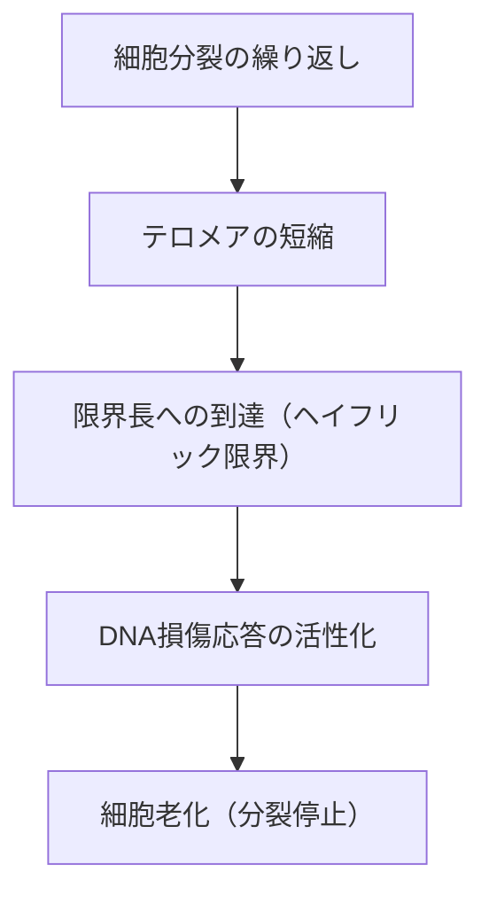

# 老化の仕組み：私たちはなぜ老いるのか

人類が有史以来抱き続けてきた最大の謎の一つ、それが「老化」です。なぜ私たちの体は時間とともに衰え、最終的に死を迎えるのでしょうか。かつて老化は「避けられない自然の摂理」として片付けられてきましたが、現代の分子生物学、遺伝学、そして物理学の交差点において、老化は「治療可能な疾患」あるいは「遅延可能なプロセス」として再定義されつつあります。

本記事では、老化の根底にあるメカニズムを、細胞レベルから物理法則、進化論的な背景、さらには最新の抗老化（アンチエイジング）科学に至るまで、徹底的に掘り下げていきます。

## 1. 物理学から見る老化：エントロピー増大の法則と生命

老化を理解する上で、最も根源的な視点は物理学、特に熱力学第二法則（エントロピー増大の法則）にあります。この宇宙におけるあらゆるシステムは、放っておけば秩序ある状態から無秩序な状態へと移行します。熱いコーヒーが冷め、鉄が錆びるように、物質はエネルギーを散逸させながら崩壊していきます。

生命体も例外ではありません。私たちの体は約37兆個の細胞で構成され、高度な秩序を保っていますが、この秩序を維持するためには絶え間なくエネルギー（ATP）を消費し、自己修復を行う必要があります。しかし、数十年にわたる修復プロセスの過程で、微小なエラー（DNAの損傷、タンパク質の変性、細胞内小器官の劣化）が蓄積していきます。これが「老化の物理的本質」です。

生命はエントロピーの波に抗って泳ぐ船のようなものであり、船体の修復能力がダメージの蓄積速度を下回ったとき、老化という現象が顕在化するのです。

## 2. 生物学的な老化の時計：テロメアとヘイフリック限界

1960年代、細胞生物学者レナード・ヘイフリックは、人間の体細胞が無限に分裂できるわけではなく、約50〜70回分裂した後に停止することを発見しました。これが「ヘイフリック限界」です。

この現象の鍵を握るのが、染色体の末端に存在する「テロメア」です。テロメアは靴紐の先についているプラスチックのキャップのようなもので、DNAの重要な遺伝情報が失われるのを防いでいます。しかし、細胞が分裂してDNAを複製するたびに、DNAポリメラーゼの性質上、末端を完全に複製することができず、テロメアは少しずつ短くなっていきます。

テロメアが一定の短さに達すると、細胞はそれを「DNAの深刻な損傷」と誤認し、ガン化を防ぐために自己の分裂を恒久的に停止させます。これが「細胞老化」です。テロメラーゼと呼ばれる酵素はこのテロメアを延長する能力を持っていますが、人間の多くの体細胞ではこの酵素の活性がオフになっています（逆に、ガン細胞はテロメラーゼを再活性化させることで不死性を獲得しています）。

## 3. エネルギーの代償：ミトコンドリアと活性酸素種（ROS）

私たちが生きるためのエネルギーは、細胞内の小器官「ミトコンドリア」で作られます。ミトコンドリアは酸素を利用して栄養素を燃やし、ATP（アデノシン三リン酸）を生成します。しかし、この生体エンジンの稼働には代償が伴います。それが活性酸素種（Reactive Oxygen Species: ROS）の発生です。

呼吸で取り込んだ酸素の約1〜2%は、電子伝達系の過程で不完全な還元を受け、強力な酸化力を持つROSに変化します。適度なROSは細胞内のシグナル伝達に必要ですが、過剰なROSは細胞膜の脂質、タンパク質、そしてミトコンドリア自身のDNA（mtDNA）を酸化し、破壊します。

ミトコンドリアDNAは核DNAと異なりヒストンタンパク質による保護がなく、修復メカニズムも貧弱です。そのため、ROSによってmtDNAが損傷すると、機能不全に陥ったミトコンドリアがさらに多くのROSを発生させるという「死の負の連鎖」が始まります。これがエネルギー代謝の低下と老化の進行を加速させる大きな要因となります。

## 4. エピジェネティクスの喪失：細胞のアイデンティティ崩壊

近年、老化研究の最前線で注目を集めているのが「エピジェネティクス（後成遺伝学）」の異常です。
人間のすべての体細胞は同じDNA（ゲノム）を持っていますが、皮膚の細胞は皮膚として、神経の細胞は神経として機能します。これは、DNAのどの部分を読み取るか（スイッチのオン・オフ）を制御するエピジェネティックな標識（DNAメチル化やヒストン修飾）が存在するからです。

しかし、加齢とともにこのエピジェネティックな標識は乱れていきます。例えるなら、オーケストラの楽譜（DNA）は綺麗に保たれているのに、指揮者の指示（エピジェネティクス）が狂い始め、バイオリンがトランペットのパートを弾き出してしまうような状態です。

ハーバード大学のデビッド・シンクレア教授らの研究により、DNAの二重鎖切断が起こると、それを修復するためにエピジェネティックな因子が元の場所を離れ、修復後に元の場所に正確に戻れないことで「エピジェネティックなノイズ」が蓄積することが示されました。このノイズの蓄積こそが老化の根本原因であるとする「老化の情報理論」が現在大きな支持を集めています。

## 5. ゾンビ細胞の脅威：細胞老化とSASP

分裂を停止した老化細胞は、ただ静かに死を待つわけではありません。免疫系によって排除されずに体内に居座った老化細胞は「ゾンビ細胞」と呼ばれ、周囲の健康な細胞に有害な炎症性物質（サイトカイン、ケモカイン、タンパク質分解酵素など）をまき散らします。この現象をSASP（細胞老化関連分泌表現型）と呼びます。

SASPは、まるで腐ったリンゴが箱の中の他のリンゴを腐らせるように、周囲の正常な細胞まで老化細胞へと変貌させ、慢性的な微小炎症を引き起こします。この慢性炎症（Inflammaging: 炎症性老化）は、アルツハイマー病、動脈硬化、糖尿病、ガンなど、加齢に伴うほぼすべての疾患の引き金となります。

## 6. 進化論的背景：なぜ自然淘汰は老化を許したのか？

ここで一つの疑問が生じます。なぜ進化の過程で、私たちは「老化しない体」を獲得しなかったのでしょうか？

進化生物学者ピーター・メダワーが提唱した「突然変異蓄積説」によれば、野生環境においては、捕食者、病気、飢餓などにより、多くの個体が老齢に達する前に死んでしまいます。そのため、人生の後期（生殖年齢を過ぎた後）に悪影響を及ぼす遺伝子の変異に対しては、自然淘汰の力が働きません。

さらに、ジョージ・ウィリアムズの「拮抗的多面発現説」によれば、若年期に生存と生殖を有利にする遺伝子が、老年期には逆に有害な作用（老化）をもたらすと考えられています。例えば、細胞の成長を促進し若さを保つ「mTOR（エムトール）」と呼ばれるタンパク質キナーゼは、成長期には不可欠ですが、中高年以降も過剰に活性化していると、細胞の自己浄化作用（オートファジー）を阻害し、老化を促進してしまいます。

つまり、進化は「種の存続（生殖）」を最優先し、「個体の永続的なメンテナンス」には見切りをつけたのです。

## 7. 最新の抗老化サイエンスと未来への展望

絶望的に見える老化プロセスですが、現代科学は反撃の糸口を掴みつつあります。老化のメカニズムが解明されるにつれ、それを遅延、あるいは逆転させるためのアプローチが次々と開発されています。

- **NAD+ブースター（NMN, NR）**:
  細胞のエネルギー産生やDNA修復、サーチュイン（長寿遺伝子）の活性化に不可欠な補酵素NAD+は、加齢とともに減少します。NMN（ニコチンアミドモノヌクレオチド）などの前駆体を補給することで、細胞の若返りを図る研究が進んでいます。

- **セノリティクス（老化細胞除去薬）**:
  体内に蓄積したゾンビ細胞（老化細胞）を選択的に死滅させる薬剤です。ダサチニブとケルセチンの組み合わせなどが、マウスの寿命を延ばし、健康寿命を劇的に改善することが実証されており、現在ヒトでの臨床試験が進行中です。

- **ラパマイシンとmTOR阻害**:
  臓器移植の免疫抑制剤として発見されたラパマイシンは、老化を促進するmTOR経路を阻害し、オートファジー（細胞のゴミ掃除機能）を活性化させます。現在、最も確実な寿命延長薬の一つとして注目されています。

- **山中因子による部分的初期化**:
  ノーベル賞を受賞した山中伸弥教授が発見した4つの遺伝子（山中因子）を細胞に導入すると、細胞は多能性幹細胞（iPS細胞）へと若返ります。これを生体内で「部分的に」行うことで、細胞のアイデンティティを失わせずにエピジェネティックな時計だけを巻き戻す「部分的初期化（Partial Reprogramming）」の研究が、アルトス・ラボなどの巨額資金を投じた企業で進められています。

## 結論

老化はもはや「未解明の自然現象」ではなく、「介入可能な生物学的プロセス」へとパラダイムシフトを遂げました。テロメアの短縮、ミトコンドリアの劣化、エピジェネティックなノイズの蓄積、そしてゾンビ細胞の蔓延。これらの「老化の特質（Hallmarks of Aging）」を一つ一つ標的にすることで、私たちは人類史上初めて、自らの生物学的限界に挑戦しようとしています。

もちろん、寿命の劇的な延長は、年金制度や医療経済、地球規模の人口問題など、未曾有の社会課題を引き起こす可能性も孕んでいます。しかし、抗老化科学の真の目的は、単に寿命を延ばすこと（Lifespan）ではなく、健康で自立して生きられる期間（Healthspan）を最大化することにあります。

私たちが老いる理由。それは、エントロピーという宇宙の法則と、生殖を最優先する進化の妥協の産物でした。しかし今、人類は自らの知性によって、その遺伝子の呪縛から解き放たれようとしています。
