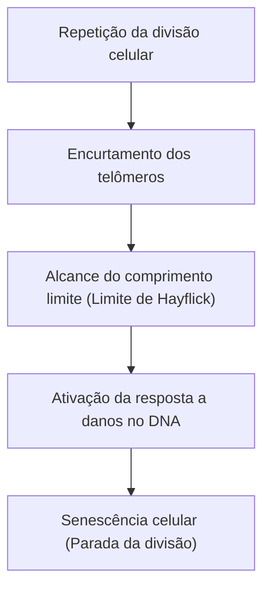

# Mecanismo do envelhecimento: Por que envelhecemos

Um dos maiores mistérios que a humanidade tem abrigado desde o início da história registrada é o "envelhecimento". Por que nossos corpos se deterioram com o tempo e, eventualmente, chegam à morte? No passado, o envelhecimento era descartado como uma "lei inevitável da natureza", mas hoje, na interseção da biologia molecular moderna, genética e física, o envelhecimento está sendo redefinido como uma "doença tratável" ou um "processo que pode ser retardado".

Neste artigo, aprofundaremos os mecanismos subjacentes ao envelhecimento, desde o nível celular até as leis da física, antecedentes evolutivos e, até mesmo, a mais recente ciência antienvelhecimento.

## 1. O envelhecimento pela perspectiva da física: A lei do aumento da entropia e a vida

Para entender o envelhecimento, a perspectiva mais fundamental reside na física, especificamente na segunda lei da termodinâmica (a lei do aumento da entropia). Qualquer sistema neste universo, se não for controlado, transitará de um estado ordenado para um estado desordenado. Assim como o café quente esfria e o ferro enferruja, a matéria decai enquanto dissipa energia.

Os organismos vivos não são exceção. Nossos corpos são compostos por cerca de 37 trilhões de células e mantêm um alto grau de ordem, mas para manter essa ordem, devemos consumir energia (ATP) incessantemente e realizar autorreparos. No entanto, ao longo de décadas de processos de reparo, pequenos erros (danos ao DNA, desnaturação de proteínas, deterioração de organelas intracelulares) se acumulam. Essa é a "essência física do envelhecimento".

A vida é como um navio navegando contra as ondas da entropia, e quando a capacidade do navio de se reparar cai abaixo da taxa de acumulação de danos, o fenômeno do envelhecimento se torna aparente.

## 2. O relógio biológico do envelhecimento: Telômeros e o limite de Hayflick

Na década de 1960, o biólogo celular Leonard Hayflick descobriu que as células somáticas humanas não podem se dividir indefinidamente, mas param após se dividirem cerca de 50 a 70 vezes. Esse é o "limite de Hayflick".

A chave para esse fenômeno são os "telômeros", localizados nas extremidades dos cromossomos. Os telômeros são como as pontas de plástico nas extremidades dos cadarços, evitando a perda de importantes informações genéticas no DNA. No entanto, cada vez que uma célula se divide e replica seu DNA, devido à natureza da DNA polimerase, as extremidades não podem ser completamente replicadas e os telômeros tornam-se um pouco mais curtos a cada vez.

Quando os telômeros atingem um determinado comprimento, a célula percebe isso incorretamente como um "dano grave ao DNA" e interrompe permanentemente sua própria divisão para evitar a transformação cancerígena. Isso é a "senescência celular". Uma enzima chamada telomerase tem a capacidade de alongar esses telômeros, mas em muitas células somáticas humanas, a atividade dessa enzima está desativada (por outro lado, as células cancerígenas adquirem imortalidade ao reativar a telomerase).

## 3. O preço da energia: Mitocôndrias e espécies reativas de oxigênio (ERO)

A energia que precisamos para viver é produzida por organelas dentro da célula chamadas "mitocôndrias". As mitocôndrias usam oxigênio para queimar nutrientes e gerar ATP (trifosfato de adenosina). No entanto, há um preço a pagar pelo funcionamento desse motor biológico. Esse preço é a geração de espécies reativas de oxigênio (ERO).

Cerca de 1 a 2% do oxigênio que inalamos sofre redução incompleta durante o processo da cadeia de transporte de elétrons, transformando-se em ERO com poderoso poder oxidativo. ERO moderadas são necessárias para a sinalização intracelular, mas ERO excessivas oxidam e destroem os lipídios da membrana celular, as proteínas e o próprio DNA da mitocôndria (mtDNA).

O DNA mitocondrial, diferentemente do DNA nuclear, carece da proteção das proteínas histonas e possui mecanismos de reparo deficientes. Portanto, quando o mtDNA é danificado por ERO, inicia-se uma "espiral negativa da morte", na qual mitocôndrias disfuncionais geram ainda mais ERO. Isso se torna um fator importante na aceleração do declínio do metabolismo energético e na progressão do envelhecimento.

## 4. Perda da epigenética: O colapso da identidade celular

Nos últimos anos, as anormalidades na "epigenética" têm atraído atenção na vanguarda da pesquisa sobre o envelhecimento.
Todas as células somáticas humanas possuem o mesmo DNA (genoma), mas as células da pele funcionam como pele, e as células nervosas funcionam como nervos. Isso ocorre porque existem marcadores epigenéticos (metilação do DNA e modificação de histonas) que controlam quais partes do DNA são lidas (ligar/desligar os interruptores).

No entanto, com a idade, esses marcadores epigenéticos tornam-se desregulados. Para fazer uma analogia, é como se a partitura (DNA) de uma orquestra fosse mantida limpa, mas as instruções do maestro (epigenética) começassem a enlouquecer, fazendo com que os violinos tocassem as partes das trombetas.

Pesquisas do Professor David Sinclair e colegas da Universidade de Harvard mostraram que quando ocorrem quebras da fita dupla de DNA, fatores epigenéticos deixam seus locais originais para repará-las, mas falham em retornar precisamente aos seus locais originais após o reparo, levando ao acúmulo de "ruído epigenético". A "teoria da informação do envelhecimento", que postula que o acúmulo desse ruído é a causa raiz do envelhecimento, está ganhando atualmente forte apoio.

## 5. A ameaça das células zumbis: Senescência celular e SASP

As células senescentes que pararam de se dividir não esperam silenciosamente pela morte. As células senescentes que não são eliminadas pelo sistema imunológico e permanecem no corpo são chamadas de "células zumbis", e elas espalham substâncias inflamatórias prejudiciais (citocinas, quimiocinas, enzimas proteolíticas, etc.) para as células saudáveis ao seu redor. Esse fenômeno é chamado de SASP (Fenótipo Secretor Associado à Senescência).

O SASP faz com que células normais vizinhas se transformem em células senescentes, assim como uma maçã podre faz com que outras maçãs na caixa apodreçam, causando microinflamação crônica. Essa inflamação crônica (Inflammaging: inflamação do envelhecimento) é o gatilho para quase todas as doenças associadas à idade, incluindo a doença de Alzheimer, arteriosclerose, diabetes e câncer.

## 6. Antecedentes evolutivos: Por que a seleção natural permitiu o envelhecimento?

Aqui surge uma pergunta. Por que não adquirimos um "corpo que não envelhece" durante o processo de evolução?

De acordo com a "teoria do acúmulo de mutações" proposta pelo biólogo evolucionista Peter Medawar, no ambiente selvagem, a maioria dos indivíduos morre antes de chegar à velhice devido a predadores, doenças ou fome. Como resultado, o poder da seleção natural não atua sobre mutações genéticas que têm efeitos adversos no final da vida (após a idade reprodutiva ter passado).

Além disso, de acordo com a "teoria da pleiotropia antagônica" de George Williams, acredita-se que genes que conferem vantagens à sobrevivência e à reprodução na juventude, por outro lado, causam efeitos prejudiciais (envelhecimento) na velhice. Por exemplo, uma proteína quinase chamada "mTOR", que promove o crescimento celular e mantém a juventude, é essencial durante o período de crescimento; no entanto, se permanecer excessivamente ativa na meia-idade e além, inibe o processo de autolimpeza da célula (autofagia) e promove o envelhecimento.

Em outras palavras, a evolução priorizou a "sobrevivência da espécie (reprodução)" e desistiu da "manutenção perpétua do indivíduo".

## 7. A mais recente ciência antienvelhecimento e perspectivas futuras

O processo de envelhecimento pode parecer desesperador, mas a ciência moderna está começando a encontrar formas de revidar. À medida que os mecanismos do envelhecimento são elucidados, abordagens para retardá-lo ou até mesmo revertê-lo estão sendo desenvolvidas uma após a outra.

- **Potencializadores de NAD+ (NMN, NR)**:
  O NAD+, uma coenzima essencial para a produção de energia celular, o reparo do DNA e a ativação das sirtuínas (genes da longevidade), diminui com a idade. Estão avançando as pesquisas com o objetivo de rejuvenescer as células ao suplementar precursores como o NMN (mononucleotídeo de nicotinamida).

- **Senolíticos (Drogas que eliminam células senescentes)**:
  Estes são medicamentos que matam seletivamente células zumbis (células senescentes) acumuladas no corpo. Foi demonstrado que combinações como dasatinibe e quercetina prolongam o tempo de vida de camundongos e melhoram drasticamente o seu tempo de vida saudável, e ensaios clínicos em humanos estão em andamento.

- **Rapamicina e inibição da mTOR**:
  A rapamicina, descoberta como um imunossupressor para transplantes de órgãos, inibe a via da mTOR que promove o envelhecimento e ativa a autofagia (função de limpeza do lixo celular). Atualmente, atrai a atenção como um dos medicamentos mais confiáveis para a extensão da vida.

- **Reprogramação parcial pelos fatores de Yamanaka**:
  Quando os quatro genes (fatores de Yamanaka) descobertos pelo vencedor do Prêmio Nobel, Professor Shinya Yamanaka, são introduzidos nas células, elas rejuvenescem em células-tronco pluripotentes induzidas (células iPS). Ao fazer isso "parcialmente" in vivo, pesquisas sobre "reprogramação parcial", que retrocede apenas o relógio epigenético sem fazer a célula perder sua identidade, estão sendo conduzidas por empresas apoiadas por fundos maciços, como a Altos Labs.

## Conclusão

O envelhecimento sofreu uma mudança de paradigma, passando de um "fenômeno natural inexplicável" para um "processo biológico que pode sofrer intervenção". O encurtamento dos telômeros, a deterioração das mitocôndrias, o acúmulo de ruído epigenético e a disseminação de células zumbis. Ao visar cada uma dessas "marcas do envelhecimento (Hallmarks of Aging)", estamos, pela primeira vez na história da humanidade, tentando desafiar nossos próprios limites biológicos.

É claro que uma extensão drástica da expectativa de vida também traz consigo o potencial de causar desafios sociais sem precedentes, como os sistemas de pensões, a economia médica e os problemas populacionais globais. No entanto, o verdadeiro objetivo da ciência antienvelhecimento não é simplesmente prolongar o tempo de vida (Lifespan), mas maximizar o período em que podemos viver de forma saudável e independente (Healthspan).

A razão pela qual envelhecemos. Foi o produto de um compromisso entre a lei universal da entropia e a evolução que prioriza a reprodução. Mas agora, através da nossa própria inteligência, a humanidade está prestes a se libertar da maldição de seus próprios genes.
