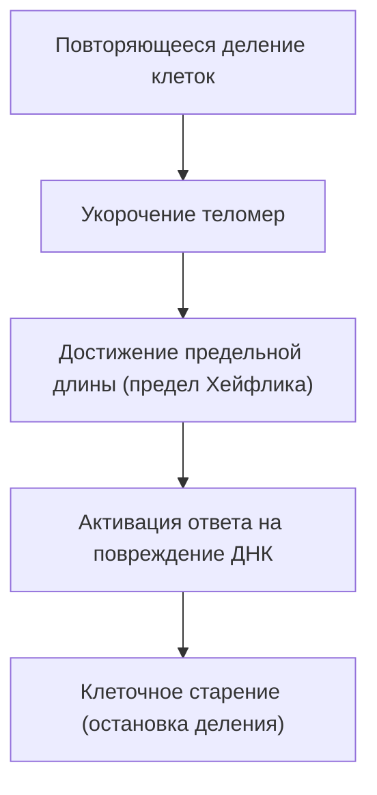

# Механизмы старения: почему мы стареем

Одно из величайших тайн, которое человечество хранило с начала истории, — это «старение». Почему наше тело со временем ослабевает и в конечном итоге встречает смерть? Когда-то старение списывали как «неизбежный закон природы», но сегодня, на стыке современной молекулярной биологии, генетики и физики, старение переопределяется как «излечимое заболевание» или «процесс, который можно замедлить».

В этой статье мы подробно рассмотрим глубинные механизмы старения, начиная с клеточного уровня и законов физики, до эволюционного контекста и новейших достижений науки в области борьбы со старением (антиэйджинг).

## 1. Старение с точки зрения физики: закон возрастания энтропии и жизнь

Для понимания старения наиболее фундаментальной является перспектива физики, в частности второго начала термодинамики (закон возрастания энтропии). Любая система в этой вселенной, если ее предоставить самой себе, переходит от упорядоченного состояния к неупорядоченному. Подобно тому, как остывает горячий кофе или ржавеет железо, материя разрушается, рассеивая энергию.

Живые организмы не исключение. Наше тело состоит примерно из 37 триллионов клеток и поддерживает высокий уровень порядка, но для поддержания этого порядка необходимо непрерывно потреблять энергию (АТФ) и осуществлять самовосстановление. Однако за десятилетия процессов восстановления накапливаются мельчайшие ошибки (повреждения ДНК, денатурация белков, деградация внутриклеточных органелл). В этом и заключается «физическая сущность старения».

Жизнь подобна кораблю, плывущему против волн энтропии, и когда способность корабля к ремонту становится ниже скорости накопления повреждений, феномен старения становится очевидным.

## 2. Биологические часы старения: теломеры и предел Хейфлика

В 1960-х годах клеточный биолог Леонард Хейфлик открыл, что соматические клетки человека не могут делиться бесконечно, а останавливаются примерно после 50–70 делений. Это явление получило название «предел Хейфлика».

Ключ к пониманию этого феномена лежит в «теломерах», расположенных на концах хромосом. Теломеры подобны пластиковым наконечникам на шнурках, они предотвращают потерю важной генетической информации ДНК. Однако каждый раз, когда клетка делится и реплицирует ДНК, из-за свойств ДНК-полимеразы невозможно полностью скопировать концы, и теломеры постепенно укорачиваются.

Когда теломеры достигают определенной длины, клетка ошибочно принимает это за «серьезное повреждение ДНК» и навсегда останавливает собственное деление, чтобы предотвратить превращение в раковую клетку. Это и есть «клеточное старение». Фермент, называемый теломеразой, способен удлинять теломеры, но в большинстве соматических клеток человека активность этого фермента отключена (и наоборот, раковые клетки приобретают бессмертие за счет реактивации теломеразы).

## 3. Цена энергии: митохондрии и активные формы кислорода (АФК)

Энергия, необходимая нам для жизни, вырабатывается во внутриклеточных органеллах — «митохондриях». Митохондрии используют кислород для сжигания питательных веществ и генерации АТФ (аденозинтрифосфата). Однако за работу этого биологического двигателя приходится платить. Речь идет об образовании активных форм кислорода (АФК, Reactive Oxygen Species: ROS).

Около 1–2% кислорода, поглощаемого при дыхании, претерпевает неполное восстановление в процессе работы электрон-транспортной цепи и превращается в АФК, обладающие мощной окислительной способностью. Умеренное количество АФК необходимо для передачи внутриклеточных сигналов, но избыток АФК окисляет и разрушает липиды клеточных мембран, белки, а также собственную ДНК митохондрий (мтДНК).

В отличие от ядерной ДНК, митохондриальная ДНК не защищена гистоновыми белками и обладает слабыми механизмами репарации. Поэтому, когда мтДНК повреждается АФК, дисфункциональные митохондрии начинают вырабатывать еще больше АФК, запуская «смертельную отрицательную спираль». Это становится основным фактором, ускоряющим снижение энергетического метаболизма и прогрессирование старения.

## 4. Утрата эпигенетики: распад клеточной идентичности

В последние годы на переднем крае исследований старения все больше внимания уделяется нарушениям в области «эпигенетики» (эпигенетика).
Все соматические клетки человека имеют одну и ту же ДНК (геном), но клетки кожи функционируют как кожа, а нервные клетки — как нервы. Это происходит потому, что существуют эпигенетические маркеры (метилирование ДНК и модификации гистонов), которые контролируют, какую часть ДНК следует считывать (включать или выключать переключатели).

Однако с возрастом эти эпигенетические маркеры нарушаются. Если использовать аналогию, партитура оркестра (ДНК) поддерживается в идеальном состоянии, но указания дирижера (эпигенетика) начинают сбиваться, и скрипки вдруг начинают играть партию труб.

Исследования, проведенные профессором Гарвардского университета Дэвидом Синклером и его коллегами, показали, что при возникновении двунитевых разрывов ДНК эпигенетические факторы покидают свои первоначальные места для их репарации. Неспособность точно вернуться на свои места после репарации приводит к накоплению «эпигенетического шума». В настоящее время большую поддержку получает «информационная теория старения», согласно которой именно накопление этого шума является первопричиной старения.

## 5. Угроза зомби-клеток: клеточное старение и SASP

Стареющие клетки, прекратившие деление, не просто тихо ждут смерти. Стареющие клетки, которые не были уничтожены иммунной системой и остались в организме, называются «зомби-клетками». Они выделяют в окружающие здоровые клетки вредные воспалительные вещества (цитокины, хемокины, протеолитические ферменты и др.). Это явление называется SASP (секреторный фенотип, ассоциированный со старением).

SASP, подобно гнилому яблоку, от которого гниют другие яблоки в корзине, превращает окружающие нормальные клетки в стареющие, вызывая хроническое микровоспаление. Это хроническое воспаление (Inflammaging: воспалительное старение) служит триггером почти всех возрастных заболеваний, таких как болезнь Альцгеймера, атеросклероз, диабет и рак.

## 6. Эволюционный контекст: почему естественный отбор допустил старение?

Здесь возникает один вопрос. Почему в процессе эволюции мы не обрели «нестареющее тело»?

Согласно «теории накопления мутаций», предложенной биологом-эволюционистом Питером Медаваром, в дикой природе большинство особей погибает от хищников, болезней или голода, не дожив до старости. По этой причине естественный отбор не действует против генетических мутаций, оказывающих пагубное влияние на поздних этапах жизни (после окончания репродуктивного возраста).

Более того, согласно «теории антагонистической плейотропии» Джорджа Уильямса, гены, способствующие выживанию и размножению в молодости, могут оказывать вредное воздействие (старение) в пожилом возрасте. Например, протеинкиназа, называемая «mTOR», которая способствует клеточному росту и сохранению молодости, жизненно важна в период роста, но если она чрезмерно активна в среднем и пожилом возрасте, она подавляет процесс самоочищения клеток (аутофагию) и ускоряет старение.

Иными словами, эволюция отдала приоритет «выживанию вида (размножению)» и отказалась от «постоянного обслуживания особи».

## 7. Новейшая наука о борьбе со старением и перспективы на будущее

Процесс старения может показаться безнадежным, но современная наука начинает находить пути для ответного удара. По мере выяснения механизмов старения один за другим разрабатываются подходы для его замедления или даже обращения вспять.

- **Бустеры NAD+ (NMN, NR)**:
  Кофермент NAD+, необходимый для выработки клеточной энергии, репарации ДНК и активации сиртуинов (генов долголетия), с возрастом уменьшается. В настоящее время ведутся исследования по омоложению клеток путем приема таких предшественников, как NMN (никотинамидмононуклеотид).

- **Сенолитики (препараты для удаления стареющих клеток)**:
  Это препараты, избирательно убивающие накопившиеся в организме зомби-клетки (стареющие клетки). Было доказано, что комбинация таких веществ, как дазатиниб и кверцетин, продлевает жизнь мышам и радикально увеличивает продолжительность здоровой жизни, и в настоящее время проводятся клинические испытания на людях.

- **Рапамицин и ингибирование mTOR**:
  Рапамицин, первоначально открытый как иммунодепрессант для трансплантации органов, ингибирует путь mTOR, способствующий старению, и активирует аутофагию (функцию клеточной очистки от мусора). В настоящее время он привлекает к себе внимание как одно из самых надежных средств для продления жизни.

- **Частичное репрограммирование с помощью факторов Яманаки**:
  Введение в клетки четырех генов (факторов Яманаки), открытых лауреатом Нобелевской премии профессором Синьей Яманакой, позволяет омолодить их до состояния плюрипотентных стволовых клеток (иПС-клеток). Компании, такие как Altos Labs, при огромной финансовой поддержке, ведут исследования по применению этого процесса in vivo «частично», чтобы перемотать назад только эпигенетические часы, не лишая клетки их идентичности (Partial Reprogramming).

## Заключение

Старение больше не является «необъяснимым природным явлением», произошел сдвиг парадигмы в сторону восприятия его как «биологического процесса, поддающегося вмешательству». Укорочение теломер, деградация митохондрий, накопление эпигенетического шума и распространение зомби-клеток. Нацеливаясь на каждый из этих «признаков старения» (Hallmarks of Aging) по отдельности, мы, впервые в истории человечества, пытаемся бросить вызов нашим собственным биологическим пределам.

Конечно, радикальное продление жизни также несет в себе потенциал для возникновения беспрецедентных социальных проблем, касающихся пенсионных систем, экономики здравоохранения и глобальных демографических вопросов. Однако истинная цель науки о борьбе со старением состоит не просто в увеличении продолжительности жизни (Lifespan), а в максимизации периода здоровой и независимой жизни (Healthspan).

Причина, по которой мы стареем. Это был продукт компромисса между универсальным законом энтропии и эволюцией, которая ставит размножение превыше всего. Но сегодня человечество с помощью собственного интеллекта готовится освободиться от этого генетического проклятия.
