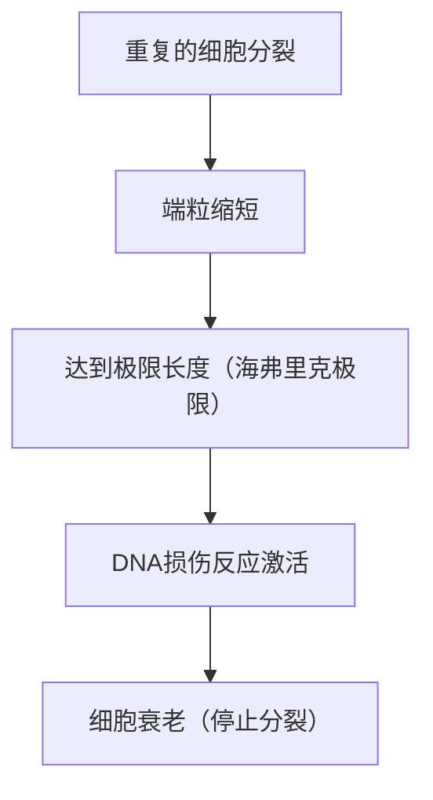

# 衰老的机制：我们为什么会衰老

“衰老”是人类有史以来一直怀有的最大谜团之一。为什么我们的身体会随着时间而衰弱，并最终走向死亡呢？过去，衰老一直被当作“不可避免的自然规律”而搁置，但在现代分子生物学、遗传学和物理学的交汇点上，衰老正被重新定义为“可治疗的疾病”或“可延缓的过程”。

本文将从细胞层面、物理定律、进化论背景，乃至最新的抗衰老（anti-aging）科学，对衰老的根本机制进行彻底的深入探讨。

## 1. 从物理学看衰老：熵增定律与生命

要理解衰老，最根本的视角在于物理学，特别是热力学第二定律（熵增定律）。宇宙中的任何系统，如果任其发展，都会从有序状态向无序状态转变。就像热咖啡会变凉、铁会生锈一样，物质在耗散能量的同时也在走向崩坏。

生命体也不例外。我们的身体由大约37万亿个细胞组成，维持着高度的秩序，但为了维持这种秩序，我们需要不断消耗能量（ATP）并进行自我修复。然而，在长达几十年的修复过程中，微小的错误（DNA损伤、蛋白质变性、细胞器老化）会不断积累。这就是“衰老的物理本质”。

生命就像是一艘在熵的浪潮中逆流而上的船，当船体的修复能力低于损伤的积累速度时，衰老这一现象就会显现出来。

## 2. 生物学的衰老时钟：端粒与海弗里克极限

20世纪60年代，细胞生物学家伦纳德·海弗里克（Leonard Hayflick）发现，人体体细胞并不能无限分裂，而是在分裂约50至70次后就会停止。这就是“海弗里克极限”。

掌握这一现象关键的，是存在于染色体末端的“端粒”。端粒就像鞋带末端的塑料帽一样，可以防止DNA中重要的遗传信息丢失。然而，由于DNA聚合酶的特性，每次细胞分裂复制DNA时，都无法完全复制末端，端粒就会一点点变短。

当端粒短到一定程度时，细胞会将其误认为“严重的DNA损伤”，为了防止癌变，细胞会永久停止自身的分裂。这就是“细胞衰老”。被称为端粒酶的酶具有延长端粒的能力，但在人类的许多体细胞中，这种酶的活性被关闭了（相反，癌细胞通过重新激活端粒酶而获得了永生）。

## 3. 能量的代价：线粒体与活性氧（ROS）

我们生存所需的能量，是由细胞内的细胞器“线粒体”产生的。线粒体利用氧气燃烧营养物质，生成ATP（三磷酸腺苷）。然而，这台生物引擎的运转伴随着代价。那就是活性氧（Reactive Oxygen Species: ROS）的产生。

通过呼吸吸入的氧气中，约有1%到2%在电子传递链的过程中经历不完全还原，转化为具有强氧化力的ROS。适量的ROS是细胞内信号传导所必需的，但过量的ROS会氧化并破坏细胞膜的脂质、蛋白质，以及线粒体自身的DNA（mtDNA）。

与核DNA不同，线粒体DNA没有组蛋白的保护，修复机制也很薄弱。因此，当ROS损伤mtDNA时，功能失调的线粒体又会产生更多的ROS，从而开启“死亡的负面连锁”。这是加速能量代谢下降和衰老进程的重要因素。

## 4. 表观遗传的丧失：细胞身份的崩溃

近年来，在衰老研究的最前沿备受关注的，是“表观遗传学（Epigenetics）”的异常。
人体的所有体细胞都拥有相同的DNA（基因组），但皮肤细胞却作为皮肤发挥作用，神经细胞作为神经发挥作用。这是因为存在控制读取DNA哪部分（开关开启/关闭）的表观遗传标记（DNA甲基化和组蛋白修饰）。

然而，随着年龄的增长，这种表观遗传标记会变得混乱。打个比方，交响乐团的乐谱（DNA）保存得很完好，但指挥的指示（表观遗传学）却开始出错，导致小提琴手拉出了小号的声部。

哈佛大学的大卫·辛克莱（David Sinclair）教授等人的研究表明，当发生DNA双链断裂时，表观遗传因子会离开原位进行修复，修复后由于无法准确回到原位，会导致“表观遗传噪音”的积累。这种噪音的积累正是衰老的根本原因，这一“衰老的信息理论”目前获得了广泛的支持。

## 5. 僵尸细胞的威胁：细胞衰老与SASP

停止分裂的衰老细胞并不会静静地等待死亡。未被免疫系统清除而驻留在体内的衰老细胞被称为“僵尸细胞”，它们会向周围健康的细胞散播有害的炎症物质（细胞因子、趋化因子、蛋白水解酶等）。这种现象被称为SASP（衰老相关分泌表型）。

SASP就像箱子里的一只烂苹果会使其他苹果腐烂一样，将周围的正常细胞也转变为衰老细胞，并引发慢性微炎症。这种慢性炎症（Inflammaging：炎性衰老）是阿尔茨海默病、动脉硬化、糖尿病、癌症等几乎所有伴随年龄增长的疾病的诱因。

## 6. 进化论背景：为什么自然选择允许衰老？

这里产生了一个疑问。为什么在进化的过程中，我们没有获得“不老的身体”呢？

进化生物学家彼得·梅达沃（Peter Medawar）提出的“突变积累假说”认为，在野生环境中，由于捕食者、疾病、饥饿等原因，许多个体在达到老年之前就死了。因此，对于在生命后期（超过生育年龄后）产生不良影响的基因突变，自然选择的力量不起作用。

此外，根据乔治·威廉姆斯（George Williams）的“拮抗基因多效性假说”，人们认为在生命早期有利于生存和繁殖的基因，在老年期反而会产生有害作用（衰老）。例如，促进细胞生长并保持年轻的一种叫做“mTOR”的蛋白激酶，在成长期是不可或缺的，但如果在中老年以后仍然过度激活，就会抑制细胞的自我净化作用（自噬），从而加速衰老。

也就是说，进化将“物种的存续（繁殖）”放在最优先的位置，而放弃了“个体的永久维护”。

## 7. 最新的抗衰老科学与未来展望

虽然衰老过程看似令人绝望，但现代科学正在抓住反击的线索。随着衰老机制被不断阐明，旨在延缓甚至逆转衰老的方法被接连开发出来。

- **NAD+助推器（NMN，NR）**:
  对细胞的能量产生、DNA修复和去乙酰化酶（长寿基因）激活至关重要的辅酶NAD+，会随着年龄的增长而减少。通过补充NMN（烟酰胺单核苷酸）等前体来实现细胞年轻化的研究正在推进。

- **衰老细胞清除剂（Senolytics）**:
  这是一种能选择性杀死体内积累的僵尸细胞（衰老细胞）的药物。达沙替尼和槲皮素的组合等已被证实能延长小鼠的寿命并极大地改善其健康寿命，目前正在人类身上进行临床试验。

- **雷帕霉素与mTOR抑制**:
  作为器官移植的免疫抑制剂被发现的雷帕霉素，能抑制促进衰老的mTOR通路，激活自噬（细胞的垃圾清理功能）。目前，它作为最可靠的延长寿命的药物之一而备受瞩目。

- **基于山中因子的部分重编程**:
  如果将诺贝尔奖得主山中伸弥教授发现的4个基因（山中因子）导入细胞，细胞就会年轻化为多能干细胞（iPS细胞）。在体内“部分地”进行这一过程，即在不失去细胞身份的情况下仅拨回表观遗传时钟的“部分重编程（Partial Reprogramming）”研究，正由Altos Labs等投入巨资的企业推进。

## 结论

衰老已经不再是“未解的自然现象”，而是发生范式转变，成为“可干预的生物学过程”。端粒缩短、线粒体退化、表观遗传噪音积累、以及僵尸细胞蔓延。通过逐一瞄准这些“衰老的标志（Hallmarks of Aging）”，我们正准备在人类历史上首次挑战自身的生物学极限。

当然，寿命的显著延长也可能引发前所未有的社会问题，如养老金制度、医疗经济和全球性人口问题等。然而，抗衰老科学的真正目的，并不单单是延长寿命（Lifespan），而是要使能够健康独立生活的时期（Healthspan）最大化。

我们之所以衰老，是宇宙法则中的熵与优先考虑繁殖的进化相妥协的产物。但是现在，人类正试图凭借自身的智慧，从那基因的束缚中解脱出来。
