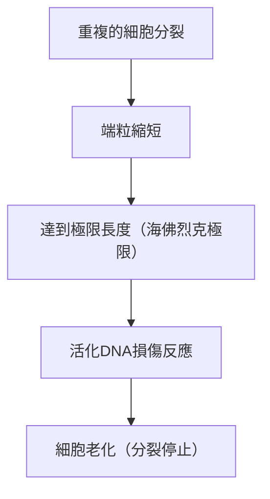

# 老化的機制：我們為什麼會變老

人類自有歷史以來一直懷抱著的最大謎團之一，那就是「老化」。為什麼我們的身體會隨著時間衰退，最終迎來死亡呢？過去，老化一直被當作「無可避免的自然法則」來處理，但在現代分子生物學、遺傳學和物理學的交會處，老化正逐漸被重新定義為「可治療的疾病」或「可延緩的過程」。

本文將從細胞層次到物理法則、演化論的背景，甚至到最新的抗老化（抗衰老）科學，徹底探究老化根本的機制。

## 1. 從物理學看老化：熵增定律與生命

在理解老化的過程中，最根本的視角在於物理學，尤其是熱力學第二定律（熵增定律）。這個宇宙中的所有系統，如果不加干預，都會從有序狀態過渡到無序狀態。就像熱咖啡變涼、鐵生鏽一樣，物質在耗散能量的同時，也會逐漸崩解。

生命體也不例外。我們的身體由約37兆個細胞組成，保持著高度的秩序，但為了維持這種秩序，必須不斷消耗能量（ATP）並進行自我修復。然而，在長達數十年的修復過程中，微小的錯誤（DNA損傷、蛋白質變性、細胞內胞器老化）會不斷累積。這就是「老化的物理本質」。

生命就像是在對抗熵的波浪中逆流而上的船隻，當船體的修復能力低於損傷累積的速度時，老化這種現象就會顯現出來。

## 2. 生物學上的老化時鐘：端粒與海佛烈克極限

1960年代，細胞生物學家李奧納多·海佛烈克（Leonard Hayflick）發現，人類的體細胞並不能無限分裂，大約分裂50到70次後就會停止。這就是「海佛烈克極限（Hayflick limit）」。

掌握這個現象關鍵的，是存在於染色體末端的「端粒（Telomere）」。端粒就像鞋帶末端的塑膠套一樣，防止DNA的重要遺傳資訊流失。然而，每次細胞分裂複製DNA時，由於DNA聚合酶的特性，無法完全複製末端，端粒就會逐漸變短。

當端粒達到一定的短度時，細胞會將其誤認為「DNA的嚴重損傷」，為了防止癌化，會永久停止自我分裂。這就是「細胞老化」。一種稱為端粒酶（Telomerase）的酵素具有延長這個端粒的能力，但在人類的許多體細胞中，這種酵素的活性是被關閉的（相反地，癌細胞透過重新活化端粒酶而獲得了不死性）。

## 3. 能量的代價：粒線體與活性氧類（ROS）

我們賴以生存的能量，是由細胞內的胞器「粒線體（Mitochondrion）」所製造的。粒線體利用氧氣燃燒營養素，產生ATP（三磷酸腺苷）。然而，這個生物引擎的運轉伴隨著代價。那就是活性氧類（Reactive Oxygen Species: ROS）的產生。

藉由呼吸攝入的氧氣中約有1至2%，在電子傳遞鏈的過程中接受了不完全的還原，轉變為具有強大氧化力的ROS。適度的ROS對於細胞內的訊息傳遞是必要的，但過量的ROS會氧化並破壞細胞膜的脂質、蛋白質，以及粒線體自身的DNA（mtDNA）。

粒線體DNA與細胞核DNA不同，沒有組織蛋白（Histone）的保護，修復機制也很薄弱。因此，當mtDNA被ROS損傷時，功能失調的粒線體會產生更多的ROS，這就是所謂的「死亡的負面連鎖」的開始。這成為加速能量代謝下降和老化進程的主要因素。

## 4. 表觀遺傳學的喪失：細胞身份的崩壞

近年來，在老化研究的最前線備受矚目的是「表觀遺傳學（Epigenetics）」的異常。
人類所有的體細胞都擁有相同的DNA（基因組），但是皮膚細胞會發揮皮膚的功能，神經細胞會發揮神經的功能。這是因為存在著控制要讀取DNA哪個部分（開關的開啟和關閉）的表觀遺傳學標記（DNA甲基化和組織蛋白修飾）。

然而，隨著年齡的增長，這種表觀遺傳學標記會變得混亂。打個比方，就像是交響樂團的樂譜（DNA）保持得很漂亮，但指揮家的指示（表觀遺傳學）開始失常，導致小提琴開始拉起小號的聲部一樣的狀態。

根據哈佛大學大衛·辛克萊（David Sinclair）教授等人的研究顯示，當發生DNA雙股斷裂時，為了修復它，表觀遺傳學因子會離開原來的位置，在修復後無法準確回到原來的位置，從而導致「表觀遺傳學雜訊」的累積。這種雜訊的累積正是老化的根本原因，這種「老化的資訊理論」目前獲得了廣泛的支持。

## 5. 殭屍細胞的威脅：細胞老化與SASP

停止分裂的老化細胞並不是只能靜靜地等待死亡。未被免疫系統清除而滯留在體內的老化細胞被稱為「殭屍細胞」，會向周圍健康的細胞散播有害的發炎性物質（細胞激素、趨化因子、蛋白質分解酵素等）。這種現象被稱為SASP（細胞老化相關分泌表型，Senescence-Associated Secretory Phenotype）。

SASP就像箱子裡一顆腐爛的蘋果會讓其他蘋果跟著腐爛一樣，會讓周圍正常的細胞也轉變為老化細胞，並引起慢性的微發炎。這種慢性發炎（Inflammaging：發炎性老化）是阿茲海默症、動脈硬化、糖尿病、癌症等幾乎所有與年齡相關疾病的導火線。

## 6. 演化論的背景：為什麼天擇容許了老化？

這裡產生了一個疑問。為什麼在演化的過程中，我們沒有獲得「不會老化的身體」呢？

根據演化生物學家彼得·梅達沃（Peter Medawar）所提倡的「突變累積假說（Mutation Accumulation Theory）」，在野生環境中，由於掠食者、疾病、飢餓等原因，許多個體在達到老年之前就死亡了。因此，對於在生命後期（過了生育年齡後）產生不良影響的基因突變，天擇的力量起不了作用。

此外，根據喬治·威廉斯（George C. Williams）的「拮抗性多效假說（Antagonistic Pleiotropy Theory）」，在年輕時期有利於生存和繁殖的基因，在老年時期反而會帶來有害的作用（老化）。例如，一種促進細胞生長並保持年輕、稱為「mTOR」的蛋白激酶，在生長期是不可或缺的，但如果到了中老年之後仍然過度活躍，就會阻礙細胞的自我淨化作用（自噬作用），從而促進老化。

也就是說，演化將「物種的延續（繁殖）」放在最優先的位置，而對「個體的永久維護」則放棄了。

## 7. 最新的抗老化科學與對未來的展望

看似令人絕望的老化過程，現代科學正在抓住反擊的線索。隨著老化機制的解明，為了延緩甚至逆轉它，各種方法正陸續被開發出來。

- **NAD+增強劑（NMN, NR）**:
  對於細胞的能量產生、DNA修復和去乙醯酶（Sirtuin，長壽基因）的活化不可或缺的輔酶NAD+，會隨著年齡的增長而減少。透過補充NMN（菸鹼醯胺單核苷酸）等前驅物，來達成細胞年輕化的研究正在進行中。

- **抗衰老藥（Senolytics，老化細胞清除藥物）**:
  這是一種選擇性地殺死體內累積的殭屍細胞（老化細胞）的藥物。達沙替尼（Dasatinib）與槲皮素（Quercetin）的組合等，已被證實能延長小鼠的壽命並顯著改善健康壽命，目前正在進行人體臨床試驗。

- **雷帕黴素（Rapamycin）與mTOR抑制**:
  作為器官移植免疫抑制劑被發現的雷帕黴素，能夠抑制促進老化的mTOR路徑，並活化自噬作用（細胞清除垃圾的功能）。目前，它作為最確實的延長壽命藥物之一而備受矚目。

- **透過山中因子進行的局部重編程（Partial Reprogramming）**:
  將獲得諾貝爾獎的山中伸彌教授發現的四個基因（山中因子）匯入細胞中，細胞就會返老還童為多功能幹細胞（iPS細胞）。在生物體內「局部地」進行這項操作，讓細胞不失去其身份，僅倒轉表觀遺傳學時鐘的「局部重編程（Partial Reprogramming）」研究，正在由Altos Labs等投入鉅資的企業進行中。

## 結論

老化不再是「未解的自然現象」，而是經歷了典範轉移，成為「可介入的生物學過程」。端粒的縮短、粒線體的退化、表觀遺傳學雜訊的累積，以及殭屍細胞的蔓延。透過一一鎖定這些「老化特徵（Hallmarks of Aging）」，我們正準備在人類歷史上首次挑戰自身的生物學極限。

當然，壽命的顯著延長也孕育著可能引發前所未有的社會問題的風險，例如退休金制度、醫療經濟、全球性人口問題等。然而，抗老化科學的真正目的，不僅僅是為了延長壽命（Lifespan），而在於最大化能夠健康且獨立生活的期間（Healthspan）。

我們為什麼會老。那是宇宙定律的熵與最優先考慮繁殖的演化妥協下的產物。但是現在，人類正試圖運用自己的智慧，從那種基因的束縛中解放出來。
