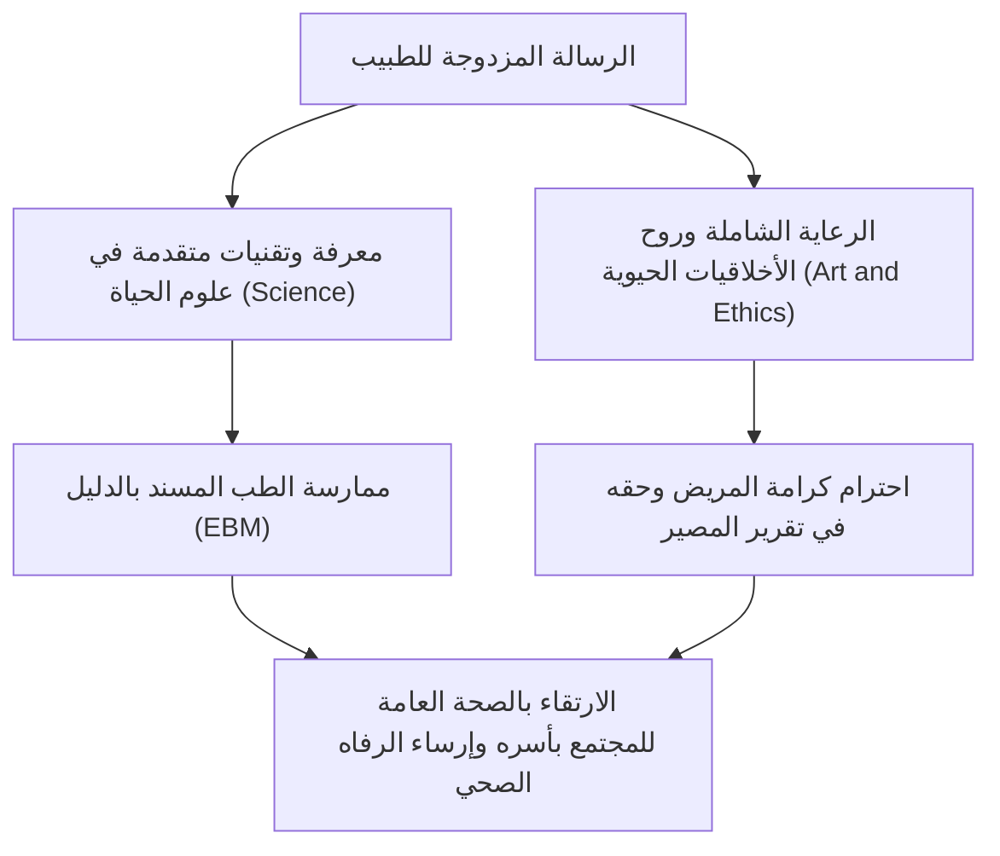
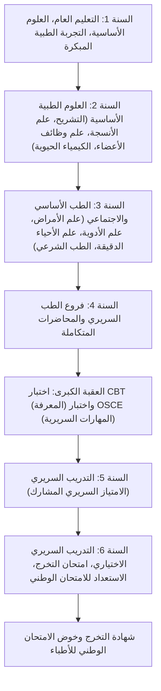
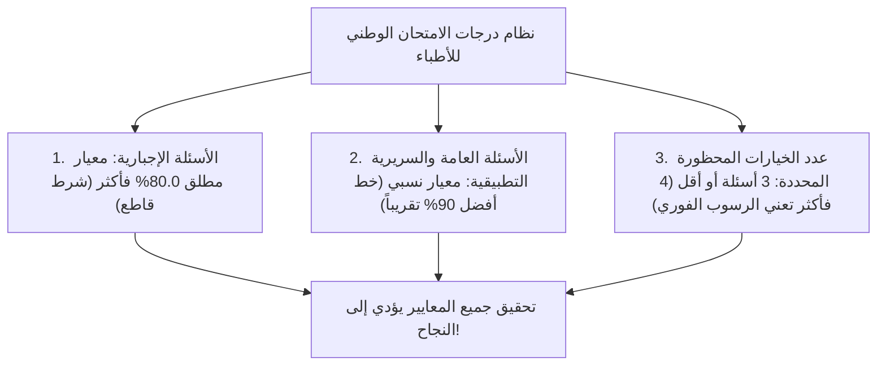
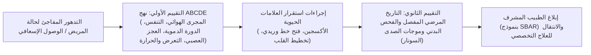
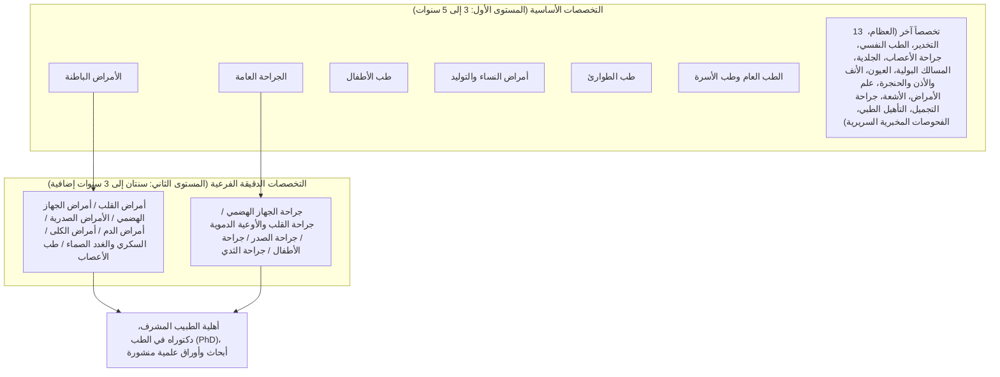
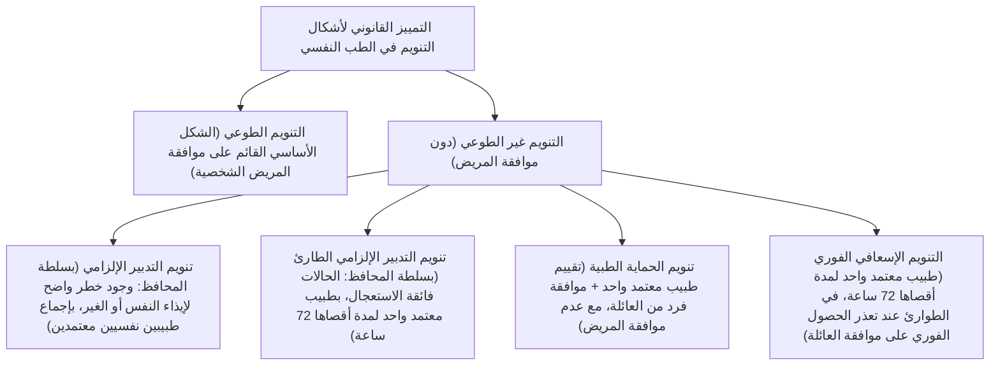
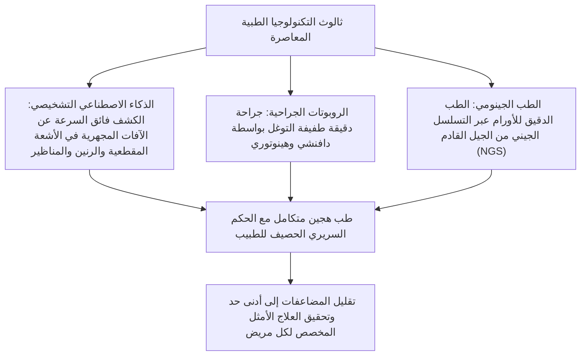

## 1. المقدمة: ملتقى العلم والرسالة المقدسة المؤتمنة على حياة البشر

### 1.1 جوهر رسالة الطبيب: دمج روح "فن الطب" مع العلوم الطبيعية المعاصرة

حظيت مهنة الطب عبر تاريخ البشرية دوماً بمكانة تتسم بأعلى درجات التبجيل والمهابة. فمنذ عهود المعالجين الروحيين والكهنة في العصور السحيقة، ومروراً بالوثبات الهائلة للعلوم الطبيعية الحديثة، بات طبيب اليوم يحمل رسالة مزدوجة تتكامل فيها شخصيتان: "تكنوقراط بارع في علوم الحياة المتقدمة"، و"وجود أخلاقي وإنساني يقف بجوار المريض في معاناته وضعفه ولحظات احتضاره".

إن الإنسان الذي يسقطه المرض في براثنه ويواجه شبح الفناء، يكشف أمام الطبيب عن أشد جوانب جسده وروحه هشاشة وعجزاً. وحين يُعمل الطبيب مبضعه الجراحي، أو يصف أدوية قوية التأثير، أو ينفذ إجراءات غازية لا رجعة فيها داخل أعماق الجسد البشري، فإن هذه الأفعال تكيف قانوناً وفق قانون العقوبات على أنها استيفاء لأركان جريمة الإيذاء الجسدي العمدي. ومع ذلك، تُعفى هذه التدخلات من المسؤولية وتُعد أعمالاً طبية مشروعة (أعمال مهنية مشروعة وفقاً للمادة 35 من قانون العقوبات الياباني)، وتحظى باحترام المجتمع وتقديره الفائق. ويستند هذا الإعفاء حصرياً إلى **عقد ائتمان مطلق بين الدولة والمجتمع المدني مفاده: "أن الطبيب قد أتقن المعارف والمهارات الرفيعة، وأنه سيكرس جهده بكل إخلاص وتجرد لإنقاذ حياة البشر والارتقاء بصحتهم"**.

لا ينحصر واجب الطبيب في مجرد معالجة "المرض" (Disease: بوصفه خللاً حيوياً أو بيولوجياً)، بل يتعدى ذلك إلى مداواة "الإنسان المتألم" (Illness: بوصفه تجربة ذاتية من المعاناة الإنسانية) في إطار كلي شامل؛ إن السعي الدؤوب وراء هذا الجوهر، الذي يُعرف بـ "فن الطب (The Art of Medicine)"، هو ما لا يمكن للذكاء الاصطناعي أو الروبوتات الطبية أن تستبدله أبداً مهما بلغت درجات تطورها.

---

### 1.2 التطور التاريخي: من قسم بقراط وإعلان جنيف إلى إعلان لشبونة

ترجع الأصول الأولى للأخلاقيات الطبية إلى "قسم بقراط (Hippocratic Oath)"، الذي صاغه في اليونان القديمة "أبو الطب" بقراط (نحو 460 ق.م – 370 ق.م) وتلاميذه:
- أداء اليمين أمام آلهة الشفاء (أبولو وأسكليبيوس).
- تحديد سبل العلاج بما ينفع المريض وفق أفضل القدرات والتقديرات الشخصية، والامتناع التام عن إلحاق الأذى أو الإجحاف.
- عدم إعطاء أي عقار مميت حتى لو طُلب ذلك بإلحاح، وعدم تقديم أي مشورة تؤدي إلى الإجهاض.
- التزام الطهارة والتقوى طوال الحياة المهنية، وترك جراحات استئصال الحصوات للمتخصصين المتمرسين في هذا الفن.
- الحفاظ على كتمان أسرار المرضى الشخصية التي يُطلع عليها في أثناء ممارسة العلاج وعدم إفشائها البتة (واجب السرية المهنية).

وفي العصر الحديث، وعلى إثر الفظائع والتجارب اللاإنسانية التي ارتكبها أطباء النظام النازي على أجساد البشر (والتي فُضحت في محاكمات نورمبرغ)، قام الاتحاد الطبي العالمي (WMA) في عام 1948 بإعادة صياغة قسم بقراط في وثيقة عصرية أطلق عليها **"إعلان جنيف (Declaration of Geneva)"**:
- "أتعهد رسمياً بتكريس حياتي لخدمة الإنسانية".
- "سيكون الحفاظ على صحة مريضي أول وأهم اعتباراتي".
- "لن أسمح لأي اعتبارات تتعلق بالعرق أو الدين أو الجنسية أو الانتماء الحزبي أو الوضع الاجتماعي بأن تتدخل بيني وبين واجبي تجاه مريضي".
- "لن أستخدم معارفي الطبية ضد قوانين الإنسانية حتى تحت وطأة التهديد".

ثم في عام 1981، تُوّج هذا المسار بإقرار **"إعلان لشبونة بشأن حقوق المريض (WMA Declaration of Lisbon on the Rights of the Patient)"** كمعيار عالمي ملزم، والذي كرس مبادئ حاسمة مثل: "الحق في رعاية طبية ذات جودة عالية"، و"الحق في الاطلاع على المعلومات وسجلات الفحص السريري"، و"الحق في تقرير المصير بناءً على إفصاح كافٍ ومسبق (الموافقة المستنيرة / Informed Consent)"، و"الموافقة بالوكالة للمرضى فاقدي الوعي"، و"الحق في الموت بكرامة". وبذلك اكتمل التحول الجذري والتاريخي الذي لا رجعة فيه: من الوصاية الطبية الأبوية الاستبدادية (Paternalism) إلى الشراكة الإنسانية المتكافئة المتمحورة حول المريض.

---

### 1.3 الالتزام السامي للمادة الأولى من قانون الأطباء الياباني

في المنظومة القانونية اليابانية، يُعد "قانون الأطباء (القانون رقم 201 لسنة 1948)" التشريع الأساسي الذي يحدد مكانة الطبيب ومسؤولياته. وتنص المادة الأولى منه بعبارات جزلة ورفيعة على غاية مهنة الطب:

> **"يتولى الطبيب مسؤولية تقديم الرعاية الطبية والإرشاد الصحي، مساهماً بذلك في الارتقاء بالصحة العامة وتعزيزها، وضمان تمتع المواطنين بحياة موفورة الصحة والعافية."**

تؤكد هذه المادة بوضوح قاطع أن أفق عمل الطبيب لا يقف عند حدود معالجة المريض الفرد الماثل أمامه (المنظور الجزئي والميكروي)، بل يمتد بمسؤولية وطنية ليشمل مكافحة الأوبئة والأمراض المعدية، والصحة البيئية، والطب الوقائي، والسياسات الصحية المجتمعية، والارتقاء بالصحة العامة ككل (المنظور الكلي والماكروي). فرخصة ممارسة الطب ليست امتيازاً تمنحه الدولة للأفراد، بل هي ميثاق تكليف بمسؤولية عامة جسيمة لحماية أقدس ما يملكه المجتمع: أرواح مواطنيه.

---

## 2. المنهاج التعليمي الشامل والمحطات الحاسمة خلال 6 سنوات في كلية الطب

إن المسار نحو التخرج كطبيب مسار طويل وشديد الوعورة. فللحصول على ترخيص ممارسة الطب في اليابان، يتعين إتمام البرنامج الأكاديمي النظامي الممتد لـ 6 سنوات كاملة في كلية الطب (أو الجامعة الطبية). وتخضع هذه المناهج لمعايير قومية صارمة محددة في "المنهاج النموذجي الأساسي للتعليم الطبي" الصادر عن وزارة التعليم والثقافة والرياضة والعلوم والتكنولوجيا.

---

### 2.1 السنتان الأولى والثانية: التعليم العام وبزوغ فجر العلوم الطبية الأساسية

#### الأخلاقيات والدلالة الطبية العميقة للتدريب العملي على تشريح الجثة البشرية
في السنة الثانية يواجه الطلاب الاختبار النفسي والوجداني الأكبر في مسيرتهم المبكرة: "التدريب العملي على تشريح الجثة البشرية (Gross Anatomy)". يجلس الطلاب على مدار عدة أشهر أمام جثامين أفراد كرام وهبوا أجسادهم طواعية لخدمة العلم وتطوير الطب (ما يعرف بنظام التبرع بالجثمان: كينتاي).
- وسط الرائحة النفاذة للفورمالين المستخدم لحفظ الأنسجة، يقوم الطلاب بفتح الجلد بحذر، وسلخ النسيج الشحمي تحت الجلدي، والتعرف الدقيق خطوة بخطوة على الأوعية الدموية والأعصاب والعضلات والعظام والأحشاء الداخلية.
- قبل أن يلامس المبضع الجثمان، يقف جميع الطلاب دقيقة صمت في خشوع تام، معبرين عن بالغ الامتنان والتقدير للقرار النبيل الذي اتخذه المتبرع وأسرته المفجوعة.
- يهدف هذا التدريب إلى غرس البنية التشريحية ثلاثية الأبعاد المعقدة لجسم الإنسان في أذهان الطلاب عبر الحواس الخمس، كما يمثل في الوقت ذاته طقس عبور وجداني يتلامس فيه الطالب لأول مرة مع "موت إنسان آخر"، متحملين ثقل هذه الأمانة طوال حياتهم المهنية القادمة.

#### علم وظائف الأعضاء، والكيمياء الحيوية، وعلم الأنسجة
- **علم وظائف الأعضاء (Physiology)**: دراسة الآليات الفيزيائية والكيميائية للظواهر الحيوية؛ كآلية توليد جهد الفعل القلبي (مضخة الصوديوم والبوتاسيوم، وإزالة الاستقطاب وإعادة الاستقطاب)، والترشيح الكبيبي الكلوي وإعادة الامتصاص الأنبوبي، وآليات التغذية الراجعة للهرمونات الصماء.
- **الكيمياء الحيوية (Biochemistry)**: الحفظ والفهم المتعمق للمسارات الجزيئية الحيوية؛ كدورة حمض الستريك (دورة كريبس / TCA)، والفسفرة التأكسدية، واستحداث السكر، واستقلاب الدهون، وبناء البروتينات، وتضاعف الحمض النووي (DNA) وعمليات النسخ والترجمة.
- **علم الأنسجة (Histology)**: رسم الهياكل المجهرية الدقيقة للأنسجة الظهارية والضامة والعضلية والعصبية تحت المجاهر الضوئية والإلكترونية، واستيعاب العلاقة الوثيقة بين الشكل المجهري والوظيفة الفسيولوجية.

---

### 2.2 السنتان الثالثة والرابعة: الفسيولوجيا المرضية ومنظومة الطب السريري

ينتقل الطلاب بين السنتين الثالثة والرابعة لدراسة "الطب السريري"، حيث يتعلمون آليات حدوث الأمراض (التطبيق السريري للعلوم الأساسية) وطرق تشخيص وعلاج الاضطرابات في مختلف التخصصات الطبية:

- **علم الأمراض (Pathology)**: قراءة جوهر المرض من خلال التغيرات الشكلية والخلوية في الأنسجة (الالتهاب، والنخر، والتحول الورمي ودرجة اللانمطية الخلوية، والموت الخلوي المبرمج / الأبوبتوزيس).
- **علم الأدوية (Pharmacology)**: ارتباط الأدوية بالمستقبلات، والحركيات الدوائية (الامتصاص، والتوزيع، والاستقلاب، والإفراغ: ADME)، وآليات عمل المضادات الحيوية وظهور السلالات المقاومة، والأدوية الخافضة لضغط الدم، وآليات العلاجات الموجهة جزيئياً للسرطان.
- **فروع الطب الباطني (Internal Medicine)**: أمراض القلب والأوعية (احتشاء عضلة القلب الحاد، واضطرابات النظم، وقصور القلب)، والأمراض الصدرية (سرطان الرئة، والانسداد الرئوي المزمن COPD، والتليف الرئوي الخلالي)، وأمراض الجهاز الهضمي (القرحة الهضمية، وتليف الكبد، وسرطان القولون)، وأمراض الكلى (المتلازمة الكلوية، والفشل الكلوي المزمن)، وأمراض الغدد الصماء والاستقلاب (داء السكري، واضطرابات الغدة الدرقية)، وأمراض الدم (اللوكيميا، والأورام اللمفاوية الخبيثة)، وطب الأعصاب، وأمراض الروماتيزم والمناعة والحساسية.
- **فروع الجراحة (Surgery)**: جراحة الجهاز الهضمي، وجراحة القلب والأوعية الدموية، وجراحة الصدر، وجراحة المخ والأعصاب، وجراحة العظام؛ مع التركيز على استطبابات التدخل الجراحي، والإدارة السريرية قبل وبعد العمليات، والتعامل مع الصدمة الجراحية.
- **طب الأطفال، وأمراض النساء والتوليد، والطب النفسي**: من التشوهات الخلقية واضطرابات النمو لدى حديثي الولادة، مروراً برعاية الفترة المحيطة بالولادة (المخاض وتسمم الحمل)، وصولاً إلى العلاج الدوائي والنفسي للفصام والاكتئاب.
- **الطب الاجتماعي والطب الشرعي والصحة العامة**: الإحصاء الوبائي، وقوانين الأمراض المعدية، والصحة المهنية، وعلم السموم، وتقنيات التحقيق والتشريح الجنائي والإداري لكشف أسباب الوفيات غير الطبيعية.

---

### 2.3 العقبة الكبرى الأولى: اختباري CBT و OSCE (إضفاء الصفة القانونية على الامتحانات المشتركة)

في خريف السنة الرابعة، يخوض طلاب الطب "الامتحان المشترك لتقييم الكفاءة (Common Achievement Test)" على مستوى اليابان كافة، لتحديد أهليتهم لدخول الأقسام السريرية بالمستشفيات. واعتباراً من عام 2023 (السنة الخامسة من عصر ريوا)، وبموجب تعديل قانون الأطباء، أصبحت هذه الاختبارات امتحانات رسمية ملزمة تماثل المؤهلات الوطنية.

1. **اختبار التقييم الحاسوبي المعرفي (CBT - Computer Based Testing)**:
   - اختبار موضوعي متعدد الخيارات يجرى عبر الحاسوب، ويتضمن قرابة 320 سؤالاً تغطي المعارف الطبية.
   - تُطرح الأسئلة عشوائياً من بنك أسئلة ضخم ومؤمن، ويتم تقييم مستوى الصعوبة بنظام صارم يعتمد نظرية الاستجابة للمفردة (IRT).
   - يشمل الاختبار مجمل فروع العلوم الأساسية والسريرية والاجتماعية. وكل من يعجز عن تحقيق نسبة النجاح المحددة (ما بين 65 إلى 70% تقريباً) يرسب فوراً ويعيد سنته الدراسية دون أي استثناء.
2. **اختبار الكفاءة السريرية الموضوعي المنظم (Pre-CC OSCE - Objective Structured Clinical Examination)**:
   - اختبار تطبيقي عملي لا يقيس المعرفة فحسب، بل يختبر المهارات السلوكية والعملية في إجراء المقابلات الطبية (أخذ السيرة المرضية) والفحص السريري البدني.
   - يتنقل الطالب عبر محطات متعددة (المقابلة الطبية، فحص الرأس والرقبة، فحص الصدر، فحص البطن، الفحص العصبي، وإجراءات الإنعاش والطوارئ)، منفذاً مهارات الفحص على مرضى افتراضيّين مدربين أو دمى محاكاة عالية التقنية.
   - يقوم مقيمون وممتحنون منتدبون من جامعات أخرى برصد الدرجات وفق قوائم مراجعة دقيقة وموحدة؛ حيث تخضع للمراقبة الصارمة تفاصيل المظهر الشخصي، وإلقاء التحية، وإظهار التعاطف مع المريض، ونظافة وغسل اليدين، والخطوات الصحيحة للتسمع والجس والقرع.

ولا يُمنح لقب **"طبيب طالب (Student Doctor)"** إلا لمن اجتاز كلا الاختبارين بنجاح، مما يتيح له رسمياً بدء التدريب الميداني داخل أروقة المستشفيات.

---

### 2.4 السنتان الخامسة والسادسة: الامتياز السريري المشارك (Clinical Clerkship)

ابتداءً من السنة الخامسة، ينخرط الطلاب في التدريب السريري المشارك (Clinical Clerkship)، حيث يتناوبون بين مختلف التخصصات والأقسام في المستشفيات الجامعية والمستشفيات المرجعية الإقليمية لفترات تتراوح بين أسبوع إلى أسبوعين لكل قسم.
وعلى النقيض من نمط "التدريب القائم على المشاهدة فقط" قديماً، يُدمج طالب الطب الحديث كعضو فاعل ومسؤول داخل الفريق الطبي المعالج في جناح التنويم:
- يقوم الطالب تحت إشراف الطبيب الموجه بأخذ السيرة المرضية للمريض المسؤول عنه يومياً، وقياس العلامات الحيوية، وتدوين السجلات الطبية (سجل الطالب الطبي)، وتفسير نتائج الفحوصات، وتقديم الحالات السريرية في المؤتمرات والاجتماعات الصباحية.
- في غرف العمليات، يخضع الطالب للتعقيم الجراحي، ويرتدي الرداء الجراحي المعقم ليشارك كمساعد ثانٍ أو ثالث في إبعاد الأنسجة بمباعدات الجراحة (Retractors) وقص خيوط الجراحة.
- يكتسب تحت التدريب المباشر المهارات الإجرائية الأساسية؛ مثل سحب عينات الدم، وتركيب القساطر الوريدية المحيطية (خطوط المحاليل)، وخياطة الجروح البسيطة وربط العقد الجراحية.
- وفي السنة السادسة، تعقد كل جامعة "امتحان التخرج" الصارم والمهيب. وحرصاً على معدلات النجاح في الامتحان الوطني، تطبق الجامعات معايير تصفية شديدة لا تتردد في رسوب الطلاب الذين تظهر درجاتهم قصوراً أكاديمياً؛ والناجون فقط من هذا الغربال الأكاديمي الشاق هم من ينالون بطاقة الترشح لدخول الامتحان الوطني للأطباء.

---

## 3. هيكل الامتحان الوطني للأطباء والمحددات الفاصلة لاجتيازه

يُعقد الامتحان الوطني للأطباء تحت الإشراف المباشر لوزارة الصحة والعمل والرفاه في مطلع شهر فبراير من كل عام على مدار يومين متتاليين، وهو امتحان دولة بالغ التعقيد والصرامة.

### 3.1 بنية الامتحان ومعايير طرح الأسئلة

يتألف الامتحان من 400 سؤال بنظام التظليل (ورقة الإجابة المقروءة بصرياً)، ويتضمن بعض الأسئلة الحسابية واختيار إجابات متعددة.

| الكتلة الامتحانية | عدد الأسئلة | مدة الاختبار | المحتوى التخصصي |
| :--- | :---: | :---: | :--- |
| **المجموعة A** | 75 سؤالاً | 135 دقيقة | المسائل السريرية التطبيقية والأسئلة العامة (فروع تخصصية وعامة) |
| **المجموعة B** | 50 سؤالاً | 80 دقيقة | **الأسئلة الإجبارية الأساسية (عامة وسريرية تطبيقية)** |
| **المجموعة C** | 75 سؤالاً | 135 دقيقة | أسئلة الحالات السريرية المطولة والمعمقة |
| **المجموعة D** | 75 سؤالاً | 135 دقيقة | أسئلة الطب الأساسي والطب الاجتماعي والقوانين الطبية |
| **المجموعة E** | 50 سؤالاً | 80 دقيقة | **الأسئلة الإجبارية الأساسية (سلامة المرضى والصحة العامة)** |
| **المجموعة F** | 75 سؤالاً | 135 دقيقة | الأسئلة السريرية الشاملة والمتكاملة |

---

### 3.2 معايير النجاح الثلاثة الحاسمة ورعب "شرط الإجبارية 80%"

يتطلب اجتياز الامتحان الوطني للأطباء **استيفاء المعايير الثلاثة التالية معاً في آن واحد وبلا استثناء**؛ فالإخفاق في معيار واحد منها يعني الرسوب الفوري:

1. **الشرط المطلق للأسئلة الإجبارية (نسبة 80.0%)**:
   - في الأسئلة الإجبارية (100 سؤال، بمجموع 200 درجة)، **يُشترط الحصول على نسبة 80.0% على الأقل (160 درجة فأكثر) كشرط حتمي قطعي لا يقبل النقاش**.
   - حتى لو أحرز المتقدم الدرجة الكاملة في الأسئلة العامة والسريرية، فإن نقص درجة واحدة فقط دون حد الـ 80% في الأسئلة الإجبارية يودي به إلى الرسوب المباشر. لذا يعيش الطلاب ضغطاً عصبياً هائلاً وترتجف أيديهم وهم يظللون هذه الإجابات.
2. **المعيار النسبي للأسئلة العامة والسريرية التطبيقية**:
   - يتم تصحيح هذه الأسئلة وفق تقييم نسبي (معياري)، حيث يُحدد خط النجاح بناءً على المنحنى العام لدرجات جميع المتقدمين في تلك السنة، مستبعداً أدنى 10% تقريباً (وتتراوح نسبة النجاح المطلوبة عادة بين 68% إلى 72%).
3. **فخ الخيارات المحظورة القاتلة (Contraindications)**:
   - العنصر الأكثر إثارة للرعب بين الممتحنين هو "الخيارات المحظورة طبياً". إذا اختار الممتحن إجابة تنطوي على **"خطأ طبي جسيم يؤدي إلى وفاة المريض"، أو "انتهاك صارخ لحقوق الإنسان"، أو "مخالفة صريحة للقوانين الطبية"**، يُحتسب عليه خيار محظور.
   - في المعتاد، **إذا وقع الطالب في 4 خيارات محظورة (أو 3 خيارات في بعض السنوات)، فإنه يرسب فوراً بقرار إداري قاطع، حتى لو تجاوز مجموع درجاته الكلي عتبة النجاح بكثير**.
   - (أمثلة: إعطاء مضادات التخثر لمريض يُشتبه بإصابته بنزيف داخل المخ، أو الاكتفاء بإعطاء الكورتيزون منفرداً ومراقبة مريض الصدمة التأقية دون حقن الأدرينالين الفوري، أو إعطاء أدوية مضادة للاستطباب في التسمم بالمركبات الفسفورية العضوية بدلاً من الأتروبين، أو اتخاذ قرار التنويم القسري في مستشفى الأمراض النفسية بناءً على رغبة العائلة فقط ودون موافقة المريض ودون استيفاء المسوغات القانونية).

---

## 4. اختبار الإقامة السريرية الأولية (سنتان): نظام التناوب الشامل (سوبر روتيت)

حتى بعد اجتياز الامتحان الوطني وتسجيل الاسم في السجل الطبي الوطني وصدور رخصة ممارسة المهنة، يحظر القانون على الطبيب الشروع فوراً في فتح عيادة أو ممارسة العلاج مستقلاً بمفرده (المادة 16-2 من قانون الأطباء). ويلتزم كل طبيب بقضاء سنتين إجباريتين في "التدريب الإقامي السريري".

### 4.1 زلزال إصلاحات نظام تدريب الأطباء المقيمين لعام 2004

قبل عام 2004 (السنة السادسة عشرة من عصر هيسي)، كان خريجو كليات الطب ينضمون مباشرة إلى الأقسام الإكلينيكية التقليدية لجامعاتهم (ما يعرف بالـ "إيكيوكو": مثل قسم الأمراض الباطنة الأول، وقسم الجراحة الثاني)، حيث يقتصر تدريبهم على التخصص الضيق جداً لذلك القسم. وأسفر هذا النمط عن تشوه هيكلي مؤسف: "طبيب متخصص وخبير في أورام الجهاز الهضمي، لكنه يقف عاجزاً تماماً أمام كسر عظمي بسيط، أو مرض عيني طارئ، أو حالة إنعاش إسعافي أولي".

ولكسر هذه العزلة التخصصية، استُحدث "نظام التناوب الإلزامي الشامل (سوبر روتيت)":
- **إلزامية اكتساب الكفاءات الطبية العامة**: فُرض على جميع الأطباء المقيمين -أياً كان تخصصهم المستقبلي- التناوب الإلزامي على أقسام الباطنة (6 أشهر على الأقل)، وطب الطوارئ (3 أشهر على الأقل)، وطب المجتمع والرعاية الأولية في المناطق النائية (شهر واحد على الأقل)، إلى جانب طب الأطفال، وأمراض النساء والتوليد، والطب النفسي، والجراحة العامة، بهدف اكتساب مهارات الرعاية الأولية الشاملة.
- **تطبيق نظام المطابقة الإلكتروني (Residency Matching)**: لم يعد توزيع الأطباء المقيمين خاضعاً لأوامر رؤساء الأقسام الجامعية، بل أُسس "مجلس مطابقة التدريب السريري للأطباء" الذي يوزع الأطباء آلياً عبر خوارزمية رياضية متقدمة (خوارزمية غيل-شابلي للزواج المستقر) وفق ترتيب رغبات الطلاب والمستشفيات.
- أدى ذلك إلى تدفق هائل لأفضل الخريجين نحو المستشفيات المدنية التعليمية الكبرى المشهورة بقوة تدريبها الإكلينيكي وتنوع حالاتها ومكافآتها العادلة (مثل مستشفيات سانت لوك، وتورانومون، وكوراشيكي سنترال، وكاميدا). وفي المقابل، عانت أقسام الجامعات الإقليمية من تناقص الكوادر، مما فجر مشكلة نقص الأطباء وتراجع المنظومة الصحية في الأقاليم والمحافظات النائية.

---

### 4.2 اليوميات الشاقة للطبيب المقيم واكتساب المهارات الإجرائية الميدانية

تمثل سنتا الإقامة الأولية المرحلة الأكثر كثافة وإرهاقاً وتراكماً للخبرات السريرية في حياة الطبيب.

- **نوبات الحراسة الليلية في الطوارئ**: يتدفق سيل متواصل من الحالات؛ بدءاً من الحالات الخفيفة المترجلة، ووصولاً إلى الحالات الحرجة المحمولة في سيارات الإسعاف المصابة بتوقف القلب والتنفس (CPA). يفرز الطبيب المقيم الحالات تحت إشراف أطباء الطوارئ الاستشاريين بناءً على **"نهج ABCDE"** العالمي (Airway, Breathing, Circulation, Dysfunction of CNS, Exposure) للتعامل الفوري مع مهددات الحياة.
- **إتقان الإجراءات التداخلية الأساسية**:
  - سحب عينات غازات الدم الشرياني (عبر وخز الشريان الكعبري).
  - الفحص بالموجات فوق الصوتية الطارئة (بروتوكول FAST لكشف النزيف الداخلي في تجويف البطن وحول القلب).
  - تركيب القسطرة الوريدية المركزية (CVC) عبر الوريد الوداجي الباطن تحت توجيه السونار.
  - التنبيب الرغامي (معاينة الحبال الصوتية بالمنظار الحنجري وتثبيت الأنبوب الرغامي).
  - البزل القطني (لسحب السائل الدماغي الشوكي لتشخيص التهاب السحايا).
  - تركيب أنابيب النزح الصدري، وبزل السائل الحَبَني من البطن.
- **إعلان الوفاة وإبلاغ الأسرة المفجوعة**: اللحظة التي يؤكد فيها الطبيب المقيم بنفسه توقف النبض والقلب، وغياب المنعكسات الحدقية للضوء، واستواء خط تخطيط القلب الكهربائي، ثم كتابة شهادة الوفاة بيده، والوقوف أمام ذوي المتوفى لإعلان نبأ الرحيل. تلك اللحظات تحفر في وجدان الطبيب ثقل الأمانة وجلال المسؤولية الإنسانية.

---

## 5. المنظومة الشاملة لنظام الأطباء الأخصائيين الجديد: 19 تخصصاً أساسياً والتخصصات الدقيقة

عقب إتمام السنتين الأوليين بنجاح، يرتقي الطبيب إلى رتبة "طبيب مقيم متقدم (طبيب متدرب للاختصاص: Senior Resident)"، ليبدأ تحديد وجهته التخصصية لمدى الحياة. وقد بدأ التطبيق الكامل لـ "نظام الأطباء الأخصائيين الجديد" في عام 2018 (السنة الثلاثين من عصر هيسي) تحت إشراف موحد من "المؤسسة اليابانية للترخيص الطبي التخصصي (JBMPS)" وفق هيكل هرمي من مستويين.

---

### 5.1 منظومة التخصصات الأساسية الـ 19

ينخرط الطبيب في أحد البرامج المعتمدة لـ **التخصصات الأساسية التسعة عشر** لمدة تتراوح بين 3 إلى 5 سنوات:

| التخصص الأساسي | مدة التدريب | الملامح التخصصية وأهم الواجبات |
| :--- | :---: | :--- |
| **الأمراض الباطنة** | 3 سنوات | توثيق هائل للحالات (تسجيل مئات الحالات وتلخيصات مفصلة للسير المرضية في منظومة J-OSLER). المدخل الإجباري لكافة التخصصات الباطنية الدقيقة. |
| **الجراحة العامة** | 3〜4 سنوات | قاعدة شاملة لجراحات البطن والقلب والصدر والأطفال. تسجيل الحالات والعمليات كجراح رئيسي في القاعدة الوطنية للبيانات السريرية (NCD). |
| **طب الأطفال** | 3 سنوات | رعاية حديثي الولادة المركزة (NICU)، طوارئ الأطفال، الأمراض المعدية، اضطرابات النمو، وأمراض الحساسية والمناعة لدى الأطفال. |
| **أمراض النساء والتوليد** | 3 سنوات | طب الفترة المحيطة بالولادة (الولادات الطبيعية والمتعثرة، العمليات القيصرية)، جراحات الأورام النسائية، وطب الإخصاب وعلاج العقم. |
| **طب الطوارئ** | 3 سنوات | الإصابات المتعددة، الصدمة الإنتانية، التسممات الحادة، الحروق البالغة، إدارة العناية المركزة (ICU)، وطب الإسعاف الطائر (طائرات الهليكوبتر الطبية). |
| **الطب العام وطب الأسرة** | 3 سنوات | تخصص مستحدث؛ يركز على الرعاية المجتمعية الشاملة، والتعامل مع المرضى متعددي الأمراض المزمنة (Multimorbidity)، وطب الأسرة. |
| **جراحة العظام** | 3〜4 سنوات | معالجة الكسور، جراحات استبدال المفاصل الصناعية، جراحات العمود الفقري، والطب الرياضي والتأهيل الحركي. |
| **التخدير** | 4 سنوات | التخدير العام، التخدير فوق الجافية (الإبيديورال)، عيادات علاج الألم المزمن، إدارة العناية المركزة، وإدارة الأزمات في أثناء العمليات الجراحية. |
| **الطب النفسي** | 3 سنوات | يتكامل مع متطلبات نيل صفة "الطبيب المعتمد للصحة النفسية". العلاج الدوائي والنفسي للاكتئاب، والاضطراب ثنائي القطب، والفصام، والخرف. |
| **جراحة المخ والأعصاب** | 4 سنوات | جراحة قص أمهات الدم الدماغية (Clipping)، استئصال أورام الدماغ، القسطرة التداخلية للأوعية الدماغية، وجراحات إصابات الرأس الخطيرة. |
| **الأشعة** | 3 سنوات | الأشعة التشخيصية (قراءة وكتابة تقارير CT و MRI و PET)، والأشعة التداخلية (IVR)، والعلاج الإشعاعي للأورام. |
| **علم الأمراض (الباثولوجيا)**| 3 سنوات | التشخيص النسيجي الفوري السريع أثناء الجراحة، وفحص الخزعات المرضية، والتشريح المرضي الجثماني (مؤتمرات CPC الإكلينيكية المرضية). |
| **التخصصات الـ 7 الأخرى** | 3〜4 سنوات | الأمراض الجلدية، جراحة المسالك البولية، طب وجراحة العيون، الأنف والأذن والحنجرة، جراحة التجميل والترميم، الطب الطبيعي والتأهيل، وطب الفحوصات المخبرية. |

---

### 5.2 التعمق في التخصصات الدقيقة ونيل درجة الدكتوراه في الطب (PhD)

عقب نيل شهادة الاختصاص الأساسي، يواصل الأطباء مسيرتهم نحو "التخصصات الدقيقة والفرعية (المستوى الثاني)" كأخصائيين في أمراض القلب التداخلية، أو أمراض الجهاز الهضمي والمناظير المتقدمة، أو جراحة القلب والصدر، أو طب الأورام والعلاج الكيميائي، وغيرها.

كما يلتحق قطاع عريض من الأطباء ببرامج الدراسات العليا في كليات الطب (برنامج الدكتوراه لمدة 4 سنوات)، حيث يجرون أبحاثاً مخبرية وتطبيقية في مجالات البيولوجيا الجزيئية، والمناعة المتقدمة، والتحليل الجينومي، وينشرون أبحاثهم كباحثين رئيسيين في دوريات علمية دولية محكمة تخضع لمراجعة الأقران (Peer-Reviewed Journals)، لينالوا درجة **"دكتوراه الفلسفة في الطب (PhD)"**. وبذلك يجمع الطبيب في شخصه بين الممارس السريري البارع والباحث الأكاديمي الذي يولد الأدلة والبراهين العلمية الجديدة لمكافحة الأمراض المستعصية.

---

## 2.5 الفسيولوجيا المرضية المتقدمة ورياضيات الحركيات والديناميكيات الدوائية (نظرية PK/PD)

لكي يتجاوز طالب الطب مرحلة الحفظ الصم لأسماء الأمراض وأعراضها نحو امتلاك ملكة التقييم السريري الرصين القائم على البيولوجيا الجزيئية وعلم الأدوية الرياضي، تبرز **"نظرية PK/PD (الحركيات الدوائية / الديناميكيات الدوائية)"** كحجر زاوية معرفي لا غنى عنه.

### المعايير الأساسية للحركيات الدوائية (PK)
- **المساحة تحت المنحنى (AUC: Area Under the Curve)**: مؤشر يعبر عن إجمالي التعرض النظامي للدواء في الدورة الدموية العامة للجسم عبر الزمن.
- **التركيز البلازمي الأقصى (Cmax)**: أعلى تركيز يصل إليه الدواء في الدم عقب إعطائه.
- **حجم التوزيع الظاهري (Vd)**: حجم يعكس ميل الدواء للتوزع السريع في الأنسجة المحيطية (للأدوية الذوابة في الدهون) مقارنة ببقائه محصوراً داخل بلازما الدم (للأدوية الذوابة في الماء).

### التصنيفات الثلاثة الكبرى لمعايير PK/PD للمضادات الحيوية
في علاج الأخماج الجرثومية، تُصنف المضادات الحيوية وفق العلاقة الحركية بين التركيز المثبط الأدنى (MIC: Minimum Inhibitory Concentration) وتركيز الدواء في المصل إلى ثلاثة أنماط استراتيجية:

| المعيار الحركي | مؤشر الفعالية العلاجية | المضادات الحيوية النموذجية | استراتيجية تصميم الجرعة السريرية |
| :--- | :--- | :--- | :--- |
| **Time above MIC ($T > MIC$)** | النسبة المئوية للزمن الذي يبقى فيه تركيز الدواء في الدم أعلى من قيمة MIC (%) | **مجموعة البنسلينات، السيفالوسبورينات، الكاربابينيمات** (مضادات $\beta$-لاكتام) | الفعالية لا تعتمد على رفع الجرعة الواحدة بصورة متطرفة، بل على **زيادة تكرار الجرعات (تقسيمها إلى 3-4 مرات يومياً)** أو إعطائها بالتسريب الوريدي الممتد والمستمر لتعظيم زمن بقاء التركيز فوق الـ MIC. |
| **$Cmax / MIC$** | حاصل قسمة أقصى تركيز دموي على قيمة الـ MIC | **مجموعة الأمينوغليكوزيدات** (جنتاميسين، أميكاسين) | تجنب تقسيم الجرعات، والاعتماد على **جرعة يومية واحدة كبيرة** لتكوين ذروة تركيز حادة وعالية؛ مما يعظم القضاء الجرثومي المعتمد على التركيز والتأثير اللاحق للمضاد الحيوي (PAE)، مع تقليل خطر السمية الكلوية والسمية السمعية. |
| **$AUC / MIC$** | النسبة بين إجمالي التعرض التراكمي خلال 24 ساعة وقيمة الـ MIC | **مجموعة الفلوروكينولونات، الفانكومايسين** (الغليكوببتيدات) | ضمان إجمالي الجرعة اليومية التراكمية، مع تطبيق المراقبة الدوائية العلاجية (TDM) للفانكومايسين لضبط تركيز القاع (Trough concentration قبيل الجرعة التالية) بدقة بين $15 \sim 20 \mu g/mL$. |

---

## 3.6 المعضلات القانونية في الامتحان الوطني: تشريعات الصحة العامة وقانون الصحة والرفاه النفسي

تعد موضوعات "قوانين الصحة العامة والتشريعات الطبية" من أكثر المحاور التي تستنزف طاقة الطلاب في الامتحان الوطني، حيث تتطلب دقة فقهية وقانونية تضاهي امتحانات المحامين لحفظ النصوص وتفسير الشروط القانونية الصارمة.

### ① تصنيفات قانون مكافحة الأمراض المعدية وواجبات الطبيب في الإبلاغ
يقسم "قانون الوقاية من الأمراض المعدية والرعاية الطبية للمصابين بها" الأمراض المعدية وفق خطورتها وقدرتها على التفشي إلى فئات من الأولى إلى الخامسة، فضلاً عن الأمراض المعدية المستجدة والمعينة.

- **أمراض الفئة الأولى (حمى إيبولا النزفية، الطاعون، داء فيروس ماربورغ، حمى لاسا، حمى القرم-الكونغو النزفية، الجدري، حمى أمريكا الجنوبية النزفية)**:
  - يتعين على الطبيب **إبلاغ المحافظ فوراً ودون أي إبطاء عبر مدير أقرب مركز للصحة العامة**.
  - تطبيق إجراءات إدارية قسرية استثنائية؛ كالعزل الإلزامي في مستشفيات مخصصة للأمراض المعدية من الفئة الأولى، وتقييد حركة المرور والتنقل لمدة تصل إلى 72 ساعة، وتطهير الممتلكات الملوثة أو إعدامها.
- **أمراض الفئة الثانية (السل الرئوي، سارس SARS، ميرس MERS، إنفلونزا الطيور H5N1 و H7N9، شلل الأطفال)**:
  - إبلاغ فوري. التوصية بالتنويم أو العزل في منشآت مخصصة للفئة الثانية. وفي حالات السل يُطبق نظام الدعم المالي العام لعلاج عدوى السل الكامنة (LTBI).
- **أمراض الفئة الثالثة (الكوليرا، الزحار العصوي، التيفود، نظيرة التيفود، الإشريكية القولونية النزفية O157 وغيرها)**:
  - إبلاغ فوري. لا تتطلب عزلاً إلزامياً بالمستشفى، ولكن يُحظر على المصابين مزاولة المهن المتعلقة بالتعامل مع الأغذية حتى تثبت سلبية الفحص البرازي تماماً.
- **أمراض الفئة الرابعة (التهاب الكبد E، والتهاب الكبد A، والملاريا، وداء الكلب، وحمى الضنك، والحمى الصفراء، والتهاب الدماغ الياباني، وداء الفيالقة / ليجيونيلا، والكزاز)**:
  - أمراض تنتقل عبر الحيوانات أو الأطعمة والمياه الملوثة أو البعوض. إبلاغ فوري. لا يُفرض عزل أو حظر عمل لعدم انتقالها عبر الرذاذ التنفسي بين البشر في المعتاد.
- **أمراض الفئة الخامسة**:
  - **أمراض خاضعة للإحصاء الشامل الكامل (الإبلاغ خلال 7 أيام)**: الحصبة، الحصبة الألمانية (الروبيلا)، الزهري، التهاب الدماغ الحاد، الكزاز، داء المكورات السحائية الغازي، متلازمة نقص المناعة المكتسب (الإيدز / HIV). وتتطلب الحصبة والحصبة الألمانية إبلاغاً فورياً دون انتظار الأيام السبعة.
  - **أمراض المراقبة عبر المراكز الترصدية المحددة (ترسل تقارير أسبوعية أو شهرية)**: الإنفلونزا الموسمية، ومرض اليد والقدم والفم، وفيروس المخلوي التنفسي (RSV)، والتهابات المعدة والأمعاء المعدية.

### ② الضوابط الصارمة لأنماط التنويم في قانون الصحة النفسية ورعاية ذوي الاضطرابات النفسية
يهدف "قانون الصحة النفسية والرفاه للمصابين باضطرابات نفسية" إلى إحداث توازن قانوني دقيق بين حق المريض في تقرير مصيره وحمايته وحماية المجتمع من أخطار إيذاء النفس أو الغير.

في الامتحان الوطني، تتكرر بدقة متناهية الأسئلة المتعلقة بترتيب أصحاب الحق في الموافقة على "تنويم الحماية الطبية" (الزوج/الزوجة، صاحب الولاية الشرعية، الملزم بالنفقة، الوصي، وصولاً إلى رئيس البلدية في حال غياب هؤلاء)، وإجراءات "تنويم التدبير الإلزامي" وإخطارات الشرطة (المادة 24) أو إخطار عامة الناس (المادة 22) والتظلم أمام لجان المراجعة التابعة للمحافظين، حيث لا يُغتفر أي خلط فيها.

---

## 4.5 معارك طوارئ الاستقبال: منظومة التفريق السريري لاضطرابات الوعي "AIUEO TIPS" والبطن الحاد

حين يرن هاتف الطوارئ (PHS) في جيب الطبيب المقيم المناوب معلناً: "رجل سبعيني يعاني من اضطراب مفاجئ في الوعي، سيصل بالإسعاف خلال دقائق!"—في تلك اللحظة بالذات، يجب أن ينطلق في عقل الطبيب المنهاج التشخيصي السريري العالمي **"AIUEO TIPS"**:

| الحرف | الحالات والأمراض التي يجب تفريقها والتحقق منها | التدخل الإسعافي الفوري في قسم الطوارئ |
| :---: | :--- | :--- |
| **A** | **A**lcohol (التسمم الكحولي الحاد) / **A**cidosis (الحماض الأيضي) | فحص رائحة النفس، وإجراء تحليل غازات الدم لقياس الأس الهيدروجيني (pH) واللاكتات وحساب الفجوة الأيونية (Anion Gap). |
| **I** | **I**nsulin (هبوط السكر الحاد / الحماض الكيتوني السكري DKA / غيبوبة فرط الأسمولية HHS) | **الوخز الفوري لطرف الإصبع لقياس سكر الدم دون أي تأخير!** (نقص السكر قد يسبب موتاً دماغياً غير رجعي خلال دقائق؛ لذا يُحقن محلول الغلوكوز 50% وريدياً فوراً عند انخفاضه). |
| **U** | **U**remia (اليوريميا / التسمم البولي الناجم عن الفشل الكلوي الحاد) | فحص الكيمياء الحيوية لتقدير اليوريا، والكرياتينين، والبوتاسيوم، وتقييم الحاجة العاجلة للغسيل الكلوي الإسعافي. |
| **E** | **E**ncephalopathy (اعتلال الدماغ الكبدي أو ارتفاع ضغط الدم الخبيث) / **E**lectrolytes (اضطرابات الكهارل) / **E**ndocrine (عاصفة الغدة الدرقية، غيبوبة الوذمة المخاطية، القصور الكظري الحاد) | قياس مستوى الأمونيا، ومستوى الصوديوم (مع الحذر الشديد من خطر الإصابة بمتلازمة زوال الميالين الأسمولية ODS عند التصحيح فائق السرعة لنقص الصوديوم). |
| **O** | **O**xygen (نقص الأكسجة الحاد) / **O**verdose (جرعة زائدة من الأدوية) / **O**piate (التسمم بالمهدئات والأفيونات) | مقياس التأكسج النبضي، وغازات الدم الشرياني. وإذا لوحظ تضيق الحدقات (Miosis) وتثبيط التنفس يُعطى النالوكسون فوراً كمضاد للتسمم الأفيوني. |
| **T** | **T**rauma (رضوض وإصابات الرأس) / **T**emperature (انخفاض الحرارة الشديد أو ضربة الشمس الحادة) | تصوير الدماغ المقطعي الطارئ (CT) لنفي النزيف الحاد فوق وتحت الجافية، وقياس درجة الحرارة الأساسية عبر المستقيم. |
| **I** | **I**nfection (إنتانات الجهاز العصبي المركزي: التهاب السحايا، التهاب الدماغ، الإنتان الحاد / السيبسيس) | فحص صلابة النقرة وعلامة كيرنيغ وارتجاج الرأس. وسحب عينتين لمزرعة الدم، ثم إعطاء المضادات الحيوية التجريبية العاجلة فوراً (سيفترياكسون + فانكومايسين + أمبيسيلين)، يليه البزل القطني. |
| **P** | **P**sychiatric (الاضطرابات النفسية والانفصامية) / **P**orphyria (البورفيريا) | لا يُوضع هذا التشخيص في الاعتبار إلا بعد استبعاد كافة الأسباب العضوية والجسدية بصورة قطعية ونهائية. |
| **S** | **S**troke (السكتة الدماغية: احتشاء، نزيف مخي، نزيف تحت العنكبوتية) / **S**eizure (الحالة الصرعية المستمرة) / **S**hock (الصدمة بنقص الحجم، القلبية، الانسدادية، والتوزيعية) | فحص العلامات العصبية الموضعية، والرنين المغناطيسي العاجل للدماغ (DWI) أو الأشعة المقطعية، وتقييم إمكانية إذابة الخثرة بـ rt-PA وريدياً (خلال 4.5 ساعة من بدء الأعراض) أو استئصال الخثرة ميكانيكياً بالقسطرة. |

إن اندفاع الطبيب المقيم لنقل مريض اضطراب الوعي مباشرة إلى غرفة الأشعة المقطعية دون فحص أولي يعد الخطأ الساذج والأخطر في طب الطوارئ؛ فإذا أُرسل مريض يعاني من هبوط حاد في السكر أو نقص أكسجة حاد إلى جهاز الأشعة، فقد يتوقف قلبه على طاولة الفحص. لذا تترسخ في وجدان الطبيب القاعدة الذهبية: **"استقرار العلامات الحيوية أولاً، فحص سكر الدم فوراً، ثم نهج استقرار ABCDE!"**.

---

## 5.5 المسار المهني للأطباء، والحقائق الاقتصادية القاسية، واستمرارية التعليم الطبي

### التباين الهيكلي بين أطباء المستشفيات والعيادات الخاصة، وواقع العمل الإضافي في النوبات الليلية
تسود في الأوساط المجتمعية صورة نمطية مسبقة تزعم أن "كل طبيب يحقق ثروات طائلة ودخلاً فلكياً"، لكن الواقع الفعلي يكشف عن تفاوت طبقي وهيكلي حاد يعتمد على المرحلة المهنية وطبيعة جهة العمل.

1. **الواقع الاقتصادي الشاق لأطباء المستشفيات الجامعية**:
   - يبلغ متوسط الدخل السنوي للطبيب المقيم المبتدئ على المستوى الوطني ما بين 3.5 إلى 4.5 مليون ين ياباني تقريباً.
   - وعندما ينتقل كطبيب مقيم متقدم (Senior Resident) تابع لأقسام المستشفيات الجامعية، قد لا يتجاوز راتبه الأساسي الشهري 200 إلى 300 ألف ين. وتحت وطأة العمل المرهق في الأقسام، والاستعداد للمؤتمرات، وكتابة الأوراق البحثية، يضطر للعمل بنظام النوبات الليلية الإضافية (بمقابل يتراوح بين 40 إلى 80 ألف ين للنوبة الواحدة في مستشفيات الطوارئ الخارجية أو دور الرعاية المزمنة) بمعدل مرة أو مرتين أسبوعياً لتغطية نفقات معيشته الأساسية.
   - وحتى بعد نيل درجة الدكتوراه في منتصف الثلاثينيات والترقي إلى رتبة أستاذ مساعد أو محاضر، يظل الدخل الممنوح من المستشفيات الجامعية في حدود 6 إلى 8 ملايين ين سنوياً في كثير من الأحيان.
2. **أطباء المستشفيات المدنية والمراكز الكبرى (الكوادر السريرية الوسطى)**:
   - في أواخر الثلاثينيات والأربعينيات، عندما يتولى الطبيب إدارة قسم كاستشاري ورئيس قسم في المستشفيات الإقليمية الكبرى أو المراكز الطبية الخاصة، يتراوح دخله السنوي بين 12 إلى 18 مليون ين ياباني. بيد أن هذا الدخل يرافقه ضغط الاستدعاءات الهاتفية المستمرة (On-call)، والنداءات الطارئة في أيام العطلات، والمناوبات الليلية المجهدة.
3. **أطباء العيادات والمجمعات الخاصة (Private Practice)**:
   - بعد سن الأربعين، إذا استثمر الطبيب مدخراته واقترض مبالغ طائلة من البنوك (عشرات إلى مئات الملايين من الين) لافتتاح عيادته الخاصة، ونجح في إدارتها، يمكن أن يصل دخله السنوي إلى ما بين 25 إلى أكثر من 40 مليون ين. ومع ذلك، فإنه يتحمل -إلى جانب كفاءته السريرية- أعباء إدارة الموارد البشرية، والتدفقات النقدية، والاستثمارات في الأجهزة الطبية، وخطط الدعاية، مع تحمله لمخاطر الديون والالتزامات المالية غير المحدودة كصاحب عمل.

### مخاطر الدعاوى القضائية والتأمين ضد الأخطاء الطبية
يعمل الطبيب دوماً تحت وطأة الخطر الداهم لـ "دعاوى الأخطاء والمسؤولية الطبية":
- حالات الشلل الدماغي الناجمة عن نقص أكسجة الجنين في أثناء الولادة المتعثرة (ورغم وجود نظام تعويض أخطاء التوليد، إلا أن الدعاوى المدنية قد تسفر عن أحكام بتعويضات تتراوح بين 100 إلى 200 مليون ين).
- الوفيات المفاجئة الناتجة عن الصمة الرئوية الحادة بعد الجراحة (متلازمة الدرجة الاقتصادية)، أو التأخر في السيطرة على الآثار الجانبية للعلاجات الكيماوية، أو إغفال ملاحظة ورم في التقارير الإشعاعية.
- ولذلك، بات الاشتراك في "وثائق التأمين ضد المسؤولية المدنية للأطباء" -التي ترعاها الجمعية الطبية اليابانية ومختلف الجمعيات التخصصية- شرطاً أساسياً لا غنى عنه لكل طبيب سريري لحماية نفسه من هذه المخاطر الكارثية.

---

## 6. القوانين والأنظمة والأخلاقيات الطبية الإلزامية لممارسة المهنة

تخضع الممارسة اليومية لمهنة الطب لشبكة بالغة التعقيد والصرامة من القوانين واللوائح. فالطبيب الذي يستخف بهذه القواعد القانونية يجد نفسه في مواجهة إلغاء ترخيصه أو وقفه عن العمل الطبي (وفقاً للجزاءات الإدارية المنصوص عليها في المادة 7 من قانون الأطباء)، فضلاً عن الملاحقة الجنائية والدعاوى المدنية التي قد تطالبه بتعويضات تصل إلى مئات الملايين من الين.

### 6.1 تفكيك النصوص الجوهرية لقانون الأطباء

#### ① واجب تقديم العلاج وعدم الامتناع (المادة 19، الفقرة 1 من قانون الأطباء)
> "لا يجوز للطبيب الممارس للطب، إذا طُلب منه إجراء فحص أو علاج، أن يمتنع عن ذلك دون سبب مشروع ومبرر قانوناً."

كانت هذه المادة تُفسر قديماً بأن "الطبيب ملزم بعلاج أي مريض يأتيه مهما كانت الظروف دون أي حق في الرفض". لكن في عام 2019 (السنة الأولى من عصر ريوا)، أصدرت وزارة الصحة إشعاراً تنظيمياً حدد بوضوح المعايير العصرية لـ "السبب المشروع":
- في أثناء ساعات العمل الرسمية بالعيادة أو المستشفى، يلتزم الطبيب بتقديم الإسعافات الأولية والتنسيق للإحالة إلى مستشفى آخر مختص حتى لو كان الطبيب الأخصائي غائباً أو كانت الحالة خارج نطاق تخصصه.
- في المقابل، خارج ساعات العمل الرسمية، إذا لم تكن المنشأة مصنفة كطوارئ معتمدة، أو إذا كان المريض يمارس سلوكيات مسيئة مفرطة ومتكررة كالسكر البين، أو ممارسة العنف والاعتداء اللفظي، أو التهرب المزمن من سداد التكاليف، أو إذا كان الطبيب يعاني من إجهاد بدني حاد أو مرض يعوقه عن ضمان سلامة الرعاية، فإن كل ذلك يُعد قانوناً "سبباً مشروعاً" يبرر الامتناع عن تقديم العلاج (تحقيقاً للتوازن مع حماية بيئة عمل الأطباء وصحتهم).

#### ② حظر العلاج دون كشف سريري مباشر (المادة 20 من قانون الأطباء)
> "لا يجوز للطبيب أن يقدم علاجاً، أو يحرر وصفة طبية، دون أن يقوم بنفسه بالكشف السريري على المريض، كما لا يجوز له تحرير شهادة ولادة أو شهادة ولادة جنين ميت دون أن يكون قد شهد عملية الولادة بنفسه."

يُحظر تماماً وصف الأدوية دون فحص المريض فحصاً مباشراً وجهاً لوجه. وما نشهده اليوم من انتشار سريع لـ "التطبيب عن بُعد (Online Telemedicine)"، لا يمارس بشكل قانوني سليم إلا كاستثناء محدد بدقة لهذه المادة، وفق "المبادئ التوجيهية للتنفيذ الملائم للرعاية الطبية عبر الإنترنت" الصادرة عن وزارة الصحة، للأمراض والبروتوكولات التي تثبت سلامتها وفعاليتها السريرية فقط.

#### ③ واجب الإبلاغ عن الوفيات المشتبه بها وغير الطبيعية (المادة 21 من قانون الأطباء)
> "إذا فحص الطبيب جثة أو جنيناً ميتاً جاوز شهره الرابع وتبيّن له وجود شبهة أو حالة غير طبيعية، وجب عليه إبلاغ مركز الشرطة المختص خلال أربع وعشرين ساعة."

أثارت مسألة ما إذا كانت الوفيات غير المتوقعة الناتجة عن أخطاء وحوادث طبية في المستشفيات تندرج تحت "الوفيات غير الطبيعية" نقاشات قانونية محتدمة أمام المحكمة العليا، كما في قضيتي مستشفى جامعة طوكيو للبنات ومستشفى هيرو بالعاصمة. وقد استقرت أحكام المحكمة العليا على أن "الوفيات المرتبطة بالعلاج الطبي، متى ما اقترنت بوجود علامات خارجية شاذة أو شبهة جنائية، فإن واجب الإبلاغ يظل قائماً عليها"، وقد تعرض أطباء حاولوا إخفاء هذه الوقائع للمساءلة والعقوبات الجنائية الصارمة.

---

### 6.2 الموافقة المستنيرة (Informed Consent) وقواعد المسؤولية عن الأخطاء الطبية

في ساحات القضاء المدني، يرتكز إثبات الخطأ الطبي المترتب على الإخلال بالالتزام العقدي أو المسؤولية التقصيرية على ركنين أساسيين: "الإخلال بواجب الحيطة واليقظة (Duty of Care)"، و"الإخلال بواجب التبصير والشرح (Duty to Inform)".

- **معيار الرعاية الطبية (Standard of Care)**: يُقاس واجب الحيطة المفروض على الطبيب بموجب معيار موضوعي دقيق: "ما كان يجب على الطبيب العادي واليقظ والحصيف في عصره أن يمارسه"، مع الأخذ في الحسبان طبيعة المنشأة الطبية (مستشفى جامعي أم عيادة ريفية) والواقع السريري للمنطقة.
- **الموافقة المستنيرة (Informed Consent)**: يلتزم الطبيب بأن يشرح للمريض بعبارات ميسرة ومفهومة: ① التشخيص الدقيق وطبيعة المرض، ② الخطة العلاجية المقترحة وتفاصيلها، ③ المخاطر والمضاعفات والآثار الجانبية المحتملة ونسب وقوعها، ④ الخيارات العلاجية البديلة ومزايا ومآخذ كل منها، ⑤ المآل المتوقع للحالة في حال رفض تلقي العلاج. ويتعين نيل الموافقة الحرة والصريحة للمريض بناءً على هذا الشرح؛ فإذا أجرى الطبيب جراحة دون تقديم الشرح الكافي ووقعت مضاعفات للمريض، فإن المحاكم تقضي بالتعويضات بملايين الين لجبر الضرر عن "انتهاك حق المريض في تقرير مصيره"، حتى لو كانت العملية الجراحية نفسها قد نُفذت بمهارة تقنية فائقة وخالية من أي عيب إجرائي.

---

## 6.5 اتخاذ القرارات في رعاية المحتضرين (ACP) والدقة القانونية لتحديد موت الدماغ

يواجه الطبيب طوال مسيرته المهنية أصعب التحديات الأخلاقية والوجودية عند التعامل مع قرارات حجب أو وقف وسائل الإنعاش ودعم الحياة في "المراحل المتقدمة والنهائية من الحياة"، وعند "تحديد الموت الدماغي".

### ① المبادئ التوجيهية لعملية اتخاذ القرار في الرعاية الطبية بنهاية الحياة
استناداً إلى الدلائل الإرشادية الصادرة عن وزارة الصحة والعمل والرفاه، تحتل منظومة **"التخطيط المسبق للرعاية (ACP: Advance Care Planning، وتعرف في اليابان بـ 'جلسات تخطيط الحياة')"** قلب الممارسة الطبية الحديثة.
- يُحظر تماماً كما كان يحدث قديماً أن ينفرد الطبيب بمفرده بقرار بدء أو وقف أجهزة دعم الحياة (كالتنفس الاصطناعي، أو مقويات الضغط الوريدية، أو الإنعاش القلبي الرئوي).
- إذا كان المريض قادراً على التعبير عن إرادته: تُجرى مشاورات متعمقة ومتكررة بين المريض وفريق الرعاية الطبية متعدد التخصصات، وتُحترم قرارات المريض احتراماً مطلقاً، مع تجديد هذا الحوار كلما تغيرت رغباته أو تقدمت حالته.
- إذا تعذر على المريض التعبير عن إرادته: إذا كان بالإمكان استنباط إرادة المريض المفترضة بمساعدة أسرته، تُحترم تلك الإرادة. وإذا تعذر ذلك، تتشاور الأسرة وفريق الرعاية معاً للوصول إلى قرار توافقي يخدم مصلحة المريض الفضلى.
- **شروط الإعفاء من المسؤولية الجنائية عند وقف أجهزة الإنعاش ودعم الحياة**: تتمثل في أربعة شروط حتمية: أن تكون الحالة ميؤوساً منها طبياً والوفاة وشيكة ولا مفر منها، ووجود رغبة صريحة ومثبتة للمريض بناءً على تقرير المصير (كالوصية الحياتية Living Will)، والعمل على تخفيف وتسكين الآلام إلى أقصى حد، والالتزام الصارم بالإجراءات التوافقية متعددة التخصصات (وفق السوابق القضائية في قضيتي مستشفى كاواساكي التعاوني ومستشفى إيميزو البلدي).

### ② الشروط الستة الإلزامية لتشخيص الموت الدماغي وفق قانون زراعة الأعضاء
بموجب "قانون زراعة الأعضاء البشرية"، لا يُعترف بـ "الموت الدماغي (Brain Death)" كموت قانوني للإنسان بديلاً عن التوقف القلبي إلا بشرط وحيد وهو الاستعداد للتبرع بالأعضاء. ويتم التحقق من موت الدماغ وفق بروتوكول موضوعي بالغ الدقة يُعاد مرتين كاملتين على الأقل.

1. **الغيبوبة العميقة الكاملة (درجة 300 بمقياس كوما الياباني / 3 بمقياس غلاسكو للغيبوبة GCS)**: انعدام تام لأي استجابة لأقوى المنبهات والمؤثرات الخارجية المؤلمة.
2. **اتساع الحدقتين وثباتهما**: اتساع قطر الحدقتين في كلتا العينين إلى $4mm$ أو أكثر، مع اختفاء تام للمنعكس الحدقي للضوء (المباشر وغير المباشر).
3. **الغياب التام لردود الفعل المنعكسة لجذع الدماغ (فحص المنعكسات السبعة الأساسية)**:
   - منعكس الضوء (Pupillary light reflex).
   - منعكس القرنية (عدم الرمش عند لمس القرنية بقطنة معقمة).
   - المنعكس الهدبي النخاعي (عدم اتساع الحدقة عند قرص جلد الرقبة).
   - المنعكس العيني الرأسي (غياب ظاهرة "عيني الدمية" عند تحريك الرأس بسرعة في شتى الاتجاهات).
   - المنعكس الدهليزي العيني (عدم حدوث أي انحراف للعين أو رأرأة عند حقن الماء البارد في مجرى السمع الخارجي / الاختبار الحراري).
   - المنعكس البلعومي (عدم حدوث منعكس التقيؤ عند تنبيه الجدار الخلفي للبلعوم).
   - منعكس السعال (عدم حدوث أي سعال عند إدخال أنبوب الشفط عميقاً داخل القصبة الهوائية).
4. **تخطيط كهربائية الدماغ الخامل تماماً (Flat EEG)**: تسجيل نشاط الدماغ عبر قنوات متعددة وفق منظومة 10-20 الدولية بأقصى درجات الحساسية ($2\mu V/mm$) لمدة لا تقل عن 30 دقيقة مستمرة، والتأكد من انعدام النشاط الكهربائي تماماً (الصمت الكهربائي للدماغ).
5. **الغياب الكامل للتنفس التلقائي (اختبار انقطاع النفس Apnea Test)**: فصل المريض مؤقتاً عن جهاز التنفس الاصطناعي مع تزويد القصبة الهوائية بالأكسجين النقي بنسبة 100% ($100\% O_2$)، والمراقبة حتى يرتفع الضغط الجزئي لثاني أكسيد الكربون في الشريان ($PaCO_2$) إلى $60 mmHg$ أو أكثر، والتأكد القطعي من عدم صدور أي محاولة أو حركة تنفسية ذاتية.
6. **الفاصل الزمني الإلزامي بين التقييمين**: بعد استيفاء كافة الشروط السابقة، يُنتظر مدة **لا تقل عن 6 ساعات كاملة** (أو 24 ساعة للأطفال دون سن السادسة) تحت الملاحظة الدقيقة، ثم تُعاد الفحوصات ذاتها بالكامل للتأكد من عدم رجعة الحالة.

وعندما تتطابق نتائج التقييمين الأول والثاني تطابقاً تاماً، يُعلن رسمياً عن وقت انتهاء التقييم الثاني بوصفه "وقت الوفاة القانوني للمريض". ويقف الطبيب في هذه اللحظات الفاصلة شاهداً على قمة الدقة العلمية والخشوع أمام قدسية الحياة والموت.

---

## 7. التعليم المستمر وتحديات العصر: إصلاح بيئة العمل ومستقبل الذكاء الاصطناعي الطبي

### 7.1 الحراك العاصف لإصلاحات أسلوب عمل الأطباء (المطبقة في أبريل 2024)

على مدى عقود طويلة، استندت المنظومة الصحية اليابانية -المشهورة بريادتها العالمية في سهولة الوصول للرعاية الصحية وطول متوسط العمر- إلى "التضحيات الفردية ونكران الذات" للأطباء وساعات عمل إضافية غير محدودة تجاوزت 100 إلى 200 ساعة شهرياً بين مناوبات ليلية وتأهب مستمر.

ولمعالجة هذه المخاطر البنيوية المسببة للوفاة الناتجة عن فرط العمل (كاروشي)، بدأ اعتباراً من شهر أبريل لعام 2024 (السنة السادسة من عصر ريوا) التطبيق الفعلي لنظام "الحدود القصوى لساعات العمل الإضافي للأطباء":

| المستوى | المستشفيات والأطباء المعنيون | الحد الأقصى السنوي للعمل الإضافي | السقف الشهري والميزات |
| :---: | :--- | :---: | :--- |
| **المستوى A** | أطباء المستشفيات العامة الموظفون (غالبية المشافي) | **960 ساعة** (بمتوسط 80 ساعة شهرياً كحد أقصى) | تنظيم صارم يبقي ساعات العمل دون خط خطر الكاروشي. |
| **المستوى B** | استثناءات انتقالية لضمان الرعاية الإقليمية الطارئة | **1,860 ساعة** (بحد أقصى 155 ساعة شهرياً) | إجراءات تخفيف مرحلية تتطلب اعتمادات وترخيصاً من المحافظة. |
| **المستوى C** | برامج التدريب المكثف لرفع الكفاءات (المقيمون والمتدربون) | **1,860 ساعة** (بحد أقصى 155 ساعة شهرياً) | مخصصة للأطباء الشباب الذين يحتاجون لاكتساب خبرات واسعة في فترات قصيرة. |

وبينما تقدم هذا الإصلاح بصحة الأطباء وفرض إلزامية فترات الراحة البينية بعد النوبات الليلية، فإنه أفرز تحديات مقلقة في وفرة الرعاية الطبية؛ كاضطرار المستشفيات لسحب الأطباء المناوبين من المناطق الريفية، ورفض بعض حالات الإسعاف ليلاً لعدم توفر الكوادر، وتقلص فرص التدريب العملي للأطباء المقيمين.

---

### 7.2 التعايش مع التحول الرقمي الطبي (DX) والذكاء الاصطناعي التشخيصي والروبوتات الجراحية

تتغير ملامح الطب في القرن الحادي والعشرين بوتيرة متسارعة بفضل الاندماج العميق للتكنولوجيا:

- **الذكاء الاصطناعي في الأشعة والمناظير**: باتت خوارزميات التعلم العميق تعمل كـ "عين ثالثة" لأطباء الأشعة والجهاز الهضمي، مستخدمة للكشف فائق الدقة عن العقيدات الرئوية متناهية الصغر، وزوائد القولون اللحمية، واعتلال الشبكية السكري.
- **الروبوتات الجراحية المتقدمة**: نجحت منظومة "دافنشي (da Vinci)"، ومنظومة "هينوتوري (hinotori)" اليابانية في القضاء التام على ارتعاش يد الجراح، ووفرت مفاصل جراحية متعددة تتجاوز المدى الحركي لمعصم اليد البشرية مع رؤية ثلاثية الأبعاد مكبرة وفائقة الدقة؛ مما حقق انخفاضاً هائلاً في النزيف الجراحي لجراحات استئصال البروستاتا وسرطانات المعدة والمستقيم.
- **الطب الدقيق والشخصي (Precision Medicine)**: بفضل "فحوصات اللوحات الجينية للأورام" التي تحلل مئات الطفرات الجينية في عينة الورم، أصبح من الممكن اختيار العلاجات الموجهة ومثبطات نقاط التفتيش المناعية التي تستهدف الخلل الجيني المحدد لذلك المريض بدقة متناهية.

ورغم كل هذه الثورات التكنولوجية، تظل مهام جوهرية مثل **"اتخاذ القرار النهائي للخطة العلاجية"، و"إبلاغ المريض بحقيقة مرضه وخطورته"، و"المعضلات الأخلاقية والمفاضلة بين خيارات الحياة والموت"، و"الرعاية الوجدانية وتطبيب قلوب ذوي المتوفين ومواساتهم في أحزانهم"**—مهام إنسانية لا يمكن أن يضطلع بها سوى طبيب يملك دفء المشاعر والروح الحية للإنسان.

---

## 8. الخاتمة: جوهر الطب الشامل في علاج "الإنسان المتألم" لا مجرد المرض

إن الدرب المؤدي إلى كينونة الطبيب رحلة تعليم وتزكية للنفس لا تنتهي أبداً. تبدأ بدخول كلية الطب، وتمتد عبر الامتحان الوطني، وسنوات الإقامة المرهقة، ونيل شهادات الاختصاص، والاستمرار في مواكبة الأبحاث والمجلات الطبية التي تتدفق يومياً بلا انقطاع.

وقد ترك السير ويليام أوسلر (Sir William Osler, 1849–1919)، أحد أعظم رواد الطب الحديث، لشباب الأطباء حكمته الخالدة:

> **"الطبيب الجيد يعالج المرض، أما الطبيب العظيم فيعالج المريض المصاب بالمرض (The good physician treats the disease; the great physician treats the patient who has the disease)."**

إن استيعاب المسارات الاستقلابية للكيمياء الحيوية، ومعادلات علم وظائف الأعضاء، والتراكيب الجزيئية لعلم الأدوية، ومسارات الأعصاب والعضلات في علم التشريح، والنصوص القانونية الصارمة لتفادي الأخطاء الطبية—وحفظ كل هذه المعارف الموضوعية الهائلة في الذاكرة الحاضرة، لا تكتمل قيمته إلا عندما يُفتح باب العيادة ويدخل إنسان يرتجف خوفاً وألماً، فيستقبله الطبيب بنظرة دافئة تفيض حناناً وبكلمات مفعمة بالصدق والرجاء.

إن الجمع المبدع بين العقل البارد والمنطق الصارم لعالم رفيع المستوى، والقلب النابض بالرحمة والتعاطف لإنسان نبيل؛ وتكريس الحياة لحماية صحة البشر وأرواحهم في ظل هذا الانسجام الخلاق—هو الغاية العظمى والمقصد الأسمى لتلك الرسالة المقدسة المسماة: "الطبيب".
