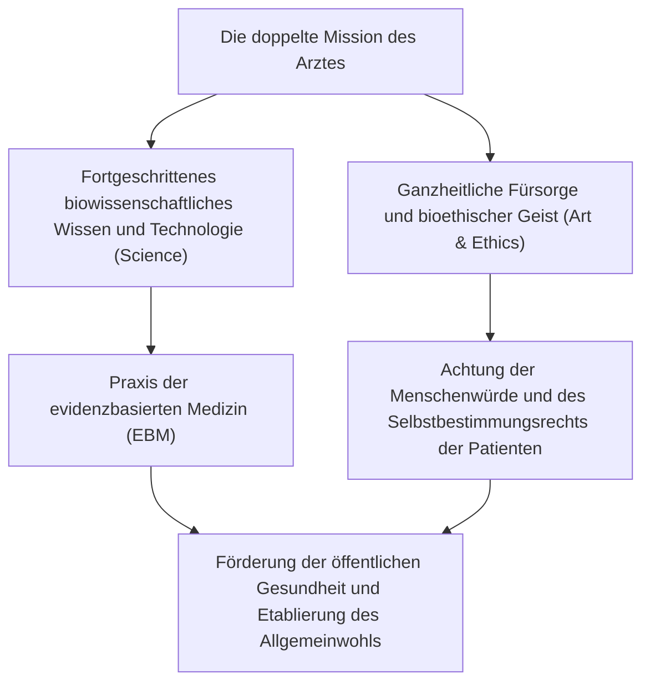
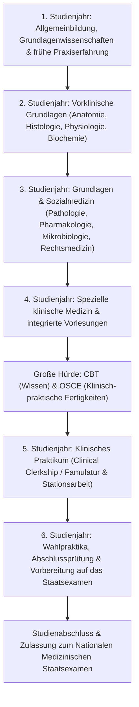
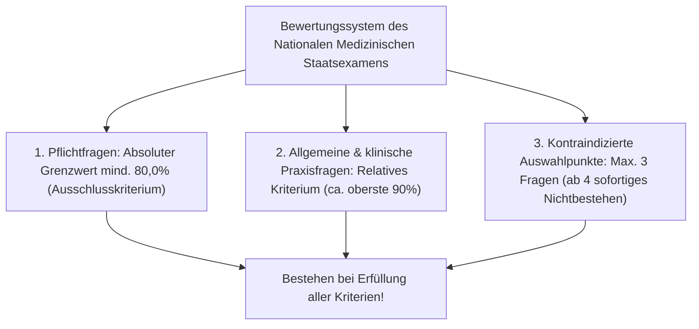
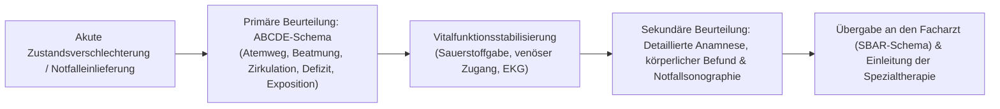
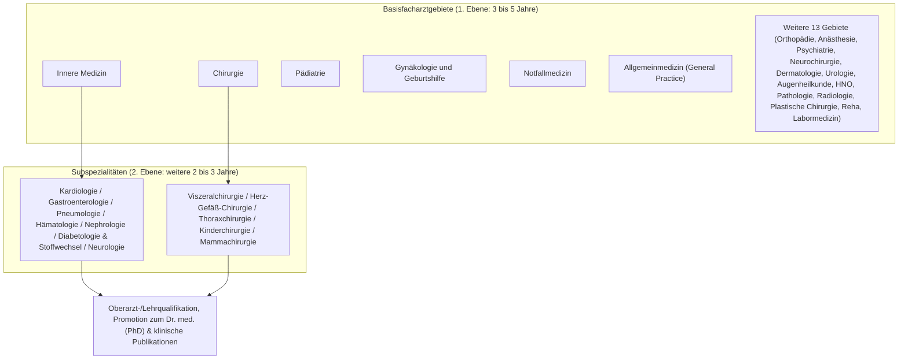
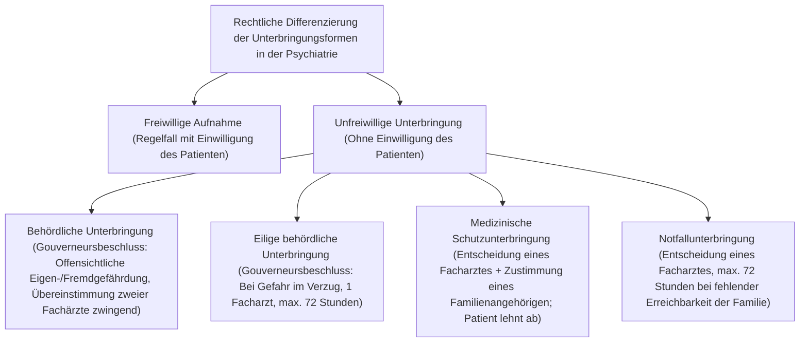
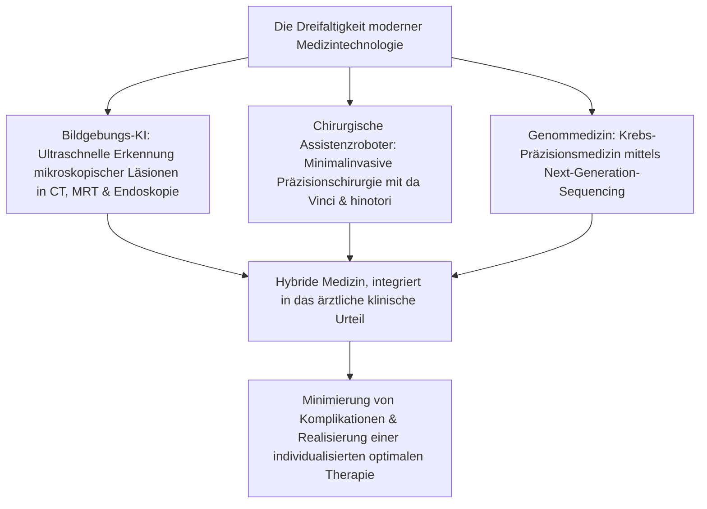

## 1. Einleitung: Schnittpunkt zwischen heiligem Dienst am Menschenleben und Naturwissenschaft

### 1.1 Das Wesen der ärztlichen Profession: Integration des Geistes der „Ars Medica“ und moderner Naturwissenschaft

Der Beruf des Arztes wurde in der Geschichte der Menschheit stets mit besonderer Ehrfurcht und Hochachtung betrachtet. Ausgehend von den Schamanen und religiösen Heilern der Urzeit über die rasanten Entwicklungen der modernen Naturwissenschaften trägt der Arzt von heute eine doppelte Mission: Er ist zugleich „Technokrat hochentwickelter Biowissenschaften“ und eine „ethische Existenz, die dem Leiden und Sterben der Mitmenschen beisteht“.

Ein Mensch, der von Krankheit heimgesucht wird und sich der Todesangst gegenübersieht, offenbart dem Arzt seinen verwundbarsten und schutzlosesten körperlichen wie seelischen Zustand. Wenn ein Arzt das Skalpell ansetzt, hochwirksame Pharmaka verabreicht oder irreversibel in das Innere des menschlichen Körpers eingreift, erfüllt diese Handlung objektiv den Straftatbestand der Körperverletzung nach dem Strafgesetzbuch. Dass ein solcher Eingriff als rechtmäßige Heilbehandlung (Rechtfertigungsgrund der rechtmäßigen Berufsausübung gemäß § 35 des japanischen Strafgesetzbuches) von der Strafbarkeit freigestellt und gesellschaftlich hoch geachtet wird, gründet sich einzig und allein auf den **absoluten Treuhandvertrag zwischen dem Staat und der Zivilgesellschaft: „Der Arzt erwirbt hochentwickeltes Wissen und höchste Fertigkeiten, um sich aufrichtig der Rettung von Menschenleben und der Förderung der Gesundheit zu widmen.“**

Das ärztliche Wirken erschöpft sich keineswegs in der bloßen Behandlung einer biologischen Erkrankung (*Disease*: biologische Anomalie). Das Streben nach der „Heilkunst (*The Art of Medicine*)“, die den durch die Krankheit leidenden Menschen (*Illness*: das subjektive Erleben des Leidens) ganzheitlich heilt, bildet das unverrückbare Wesen des Arztes, das durch keinen noch so weit fortgeschrittenen Fortschritt von künstlicher Intelligenz oder Robotik jemals ersetzt werden kann.

---

### 1.2 Historische Entwicklung vom Eid des Hippokrates über die Deklaration von Genf bis zur Deklaration von Lissabon

Der Ursprung der medizinischen Ethik reicht zurück bis zum „Eid des Hippokrates (*Hippocratic Oath*)“, verfasst im antiken Griechenland durch den „Vater der Heilkunde“ Hippokrates (ca. 460–370 v. Chr.) und seine Schüler.
- Eid bei Apollon dem Arzt, Asklepios, Hygieia und Panakeia.
- Nach bestem Können und Urteil Diät und Behandlung zum Nutzen der Kranken festzulegen, Unrecht und Schaden von ihnen fernzuhalten.
- Selbst auf Bitten niemandem ein tödliches Gift zu verabreichen und keiner Frau ein abtreibendes Mittel zu empfehlen.
- Das Leben und die Kunst rein und fromm zu bewahren und den Steinschnitt den dafür ausgebildeten Fachleuten zu überlassen.
- Verschwiegenheit über alles zu bewahren, was im Rahmen der Behandlung oder außerhalb über das Leben der Menschen gesehen oder gehört wird (ärztliche Schweigepflicht).

In der Moderne verabschiedete der Weltärztebund (World Medical Association, WMA) 1948 – nach der tiefen Erschütterung über die unmenschlichen Menschenversuche durch Ärzte im nationalsozialistischen Deutschland (aufgedeckt im Nürnberger Ärzteprozess) – das **„Genfer Gelöbnis (Declaration of Geneva)“** als zeitgemäße Neufassung des hippokratischen Eides:
- „Ich gelobe feierlich, mein Leben in den Dienst der Menschlichkeit zu stellen.“
- „Die Gesundheit und das Wohlbefinden meines Patienten sollen mein oberstes Anliegen sein.“
- „Ich werde nicht zulassen, dass Erwägungen von Alter, Krankheit oder Behinderung, Glaube, ethnischer Herkunft, Geschlecht, Staatsangehörigkeit, politischer Zugehörigkeit, Rasse, sexueller Orientierung oder sozialer Stellung zwischen meine Pflicht und meine Patienten treten.“
- „Selbst unter Bedrohung werde ich mein medizinisches Wissen nicht zur Verletzung von Menschenrechten und bürgerlichen Freiheiten anwenden.“

Im Jahr 1981 wurde zudem die **„Deklaration von Lissabon über die Rechte des Patienten (WMA Declaration of Lisbon on the Rights of the Patient)“** verabschiedet, die weltweite Standards für Patientenrechte festschrieb: das Recht auf qualitativ hochwertige medizinische Versorgung, das Recht auf Einsicht in die eigene Krankenakte, das Recht auf Selbstbestimmung nach umfassender Aufklärung (*Informed Consent*), die stellvertretende Einwilligung bei bewusstlosen Patienten sowie das Recht auf ein Sterben in Würde. Damit vollzog sich die unumkehrbare Wende vom autoritären ärztlichen Paternalismus hin zu einer partnerschaftlichen, patientenzentrierten Medizin.

---

### 1.3 Die hehre Pflicht nach Artikel 1 des japanischen Ärztegesetzes

Im japanischen Recht bildet das „Ärztegesetz (Gesetz Nr. 201 von 1948)“ die rechtliche Grundlage für Status und Pflichten des Arztes. In Artikel 1 wird die Mission des Arztes in erhabenen Worten niedergelegt:

> **„Der Arzt trägt durch die Ausübung der Heilkunde und der Gesundheitsführung zur Hebung und Förderung der öffentlichen Gesundheit bei und sichert dadurch ein gesundes Leben der Staatsbürger.“**

Dieser Gesetzesartikel bestimmt unmissverständlich, dass der Horizont des Arztes nicht auf die Behandlung des einzelnen, vor ihm stehenden Patienten (Mikroperspektive) beschränkt ist, sondern bis zur Hebung der öffentlichen Gesundheit (Makroperspektive) reicht – einschließlich Maßnahmen gegen Infektionskrankheiten, Umwelthygiene, Präventivmedizin und Gesundheitspolitik der gesamten Gesellschaft. Die ärztliche Approbation ist kein vom Staat verliehenes Privileg für ein Individuum, sondern eine Urkunde über eine außerordentlich schwere öffentliche Verantwortung zum Schutz des Lebens der gesamten Bevölkerung.

---

## 2. Das 6-jährige Medizinstudium: Gigantisches Curriculum und Selektionshürden

Der Weg zur ärztlichen Approbation ist außerordentlich beschwerlich und langwierig. Um in Japan die ärztliche Zulassung zu erlangen, muss das 6-jährige reguläre Studium an einer medizinischen Fakultät (oder medizinischen Universität) erfolgreich absolviert werden. Das universitäre Curriculum ist durch das „Modell-Kerncurriculum für die medizinische Ausbildung“ des Ministeriums für Bildung, Kultur, Sport, Wissenschaft und Technologie (MEXT) streng standardisiert.

---

### 2.1 1. bis 2. Studienjahr: Allgemeinbildung und Beginn der Vorklinik

#### Ethik und medizinische Bedeutung des Präparierkurses der Humananatomie
Im zweiten Studienjahr erwartet die Studierenden die erste und größte psychische Zerreißprobe: der „Präparierkurs der Makroskopischen Anatomie (*Gross Anatomy*)“. Über mehrere Monate hinweg arbeiten die Studierenden an den Leichnamen von Menschen, die ihren Körper uneigennützig der Wissenschaft vermacht haben (Körperspende).
- Inmitten des stechenden Geruchs der Formalinfixierung eröffnen die Studierenden die Haut, lösen das Subkutangewebe ab und identifizieren Blutgefäße, Nerven, Muskeln, Knochen und Eingeweide Schicht für Schicht mit höchster Sorgfalt.
- Vor dem ersten Skalpellschnitt verharren alle Studierenden in einer Schweigeminute, um den Körperspendern und ihren Hinterbliebenen für ihren selbstlosen Entschluss zu danken.
- Dieser Kurs ist das grundlegende Initiationsritual der medizinischen Ausbildung: Hier prägen sich die Studierenden die hochkomplexe dreidimensionale Struktur des menschlichen Körpers mit allen Sinnen ein und entwickeln gleichzeitig die seelische Reife und Entschlossenheit, den Tod anderer Menschen zu berühren und dessen existenzielle Schwere zeitlebens mitzutragen.

#### Physiologie, Biochemie und Histologie
- **Physiologie**: Erforschung der physikochemischen Mechanismen des Lebens – darunter die Entstehung des kardialen Aktionspotenzials (Natrium-Kalium-Pumpe, Depolarisation und Repolarisation), glomeruläre Filtration und tubuläre Rückresorption in den Nieren sowie Rückkopplungsmechanismen endokriner Hormone.
- **Biochemie**: Intensives Lernen und Verstehen molekularer Stoffwechselwege – Citratzyklus (TCA-Zyklus), oxidative Phosphorylierung, Glukoneogenese, Lipidstoffwechsel, Proteinsynthese sowie Replikation, Transkription und Translation der DNA.
- **Histologie**: Mikroskopisches Zeichnen und Analysieren von Epithel-, Binde-, Muskel- und Nervengewebe unter dem Licht- und Elektronenmikroskop zur Erfassung der Korrelation zwischen zellulärer Struktur und biologischer Funktion.

---

### 2.2 3. bis 4. Studienjahr: Pathophysiologie und Systematik der klinischen Medizin

Vom dritten bis zum vierten Studienjahr vertiefen sich die Studierenden in die Krankheitsmechanismen (klinische Anwendung vorklinischer Grundlagen) und treten in die „klinische Medizin“ ein, die Diagnostik und Therapie der einzelnen Fachdisziplinen umfasst.

- **Pathologie**: Entschlüsselung des Wesens von Krankheiten anhand morphologischer Veränderungen von Zellen und Geweben (Entzündung, Nekrose, Neoplasie/Malignitätsgrad, Apopotose).
- **Pharmakologie**: Rezeptorbindung von Arzneimitteln, Pharmakokinetik (Resorption, Verteilung, Metabolismus, Elimination: ADME), Wirkungsmechanismen von Antibiotika und Entstehung von Resistenzen, molekulare Zielstrukturen von Antihypertensiva und Zytostatika.
- **Spezielle Innere Medizin**: Kardiologie (akuter Myokardinfarkt, Arrhythmien, Herzinsuffizienz), Pneumologie (Lungenkarzinom, COPD, interstitielle Pneumonien), Gastroenterologie (Magenulzera, Leberzirrhose, kolorektale Karzinome), Nephrologie (nephrotisches Syndrom, chronische Niereninsuffizienz), Endokrinologie und Diabetologie (Diabetes mellitus, Schilddrüsenfunktionsstörungen), Hämatologie (Leukämien, maligne Lymphome), Neurologie, Rheumatologie und Klinische Immunologie.
- **Spezielle Chirurgie**: Viszeralchirurgie, Herz- und Gefäßchirurgie, Thoraxchirurgie, Neurochirurgie, Orthopädie und Unfallchirurgie; Operationsindikationen, perioperatives Management, Schocktherapie.
- **Pädiatrie, Gynäkologie/Geburtshilfe, Psychiatrie**: Von angeborenen Fehlbildungen des Neugeborenen bis zu Entwicklungsstörungen; perinatales Management (Entbindung, hypertensive Schwangerschaftserkrankungen); Psychopharmakotherapie und Psychotherapie bei Schizophrenie und Depression.
- **Sozialmedizin, Rechtsmedizin, Öffentliche Gesundheit**: Epidemiologische Statistik, Infektionsschutzgesetz, Arbeitsmedizin, Toxikologie, Klärung unklarer Todesursachen sowie Sektionstechniken bei gerichtlichen und behördlichen Obduktionen.

---

### 2.3 Die erste große Barriere: CBT und OSCE (Verstaatlichung der Zwischenprüfungen)

Im Herbst des vierten Studienjahres absolvieren die Medizinstudierenden die landesweit einheitlichen Zwischenprüfungen (*Common Achievement Tests*), die über die Berechtigung zum Eintritt in den klinischen Studienabschnitt (Stationen) entscheiden. Seit der Novellierung des Ärztegesetzes im Jahr 2023 gelten diese Prüfungen offiziell als staatlich verankerte Qualifikationsprüfungen.

1. **CBT (Computer Based Testing)**:
   - Ein computergestützter Multiple-Choice-Test mit rund 320 Fragen zum gesamten medizinischen Wissen.
   - Die Fragen werden randomisiert aus einem riesigen Fragenpool zusammengestellt und anhand der Item-Response-Theorie (IRT) präzise bezüglich ihres Schwierigkeitsgrades kalibriert.
   - Umfasst Vorklinik, klinische Medizin und Sozialmedizin. Wer die Bestehensgrenze (in der Regel ca. 65–70%) verfehlt, fällt unweigerlich durch und muss das Studienjahr wiederholen.
2. **Pre-CC OSCE (Objective Structured Clinical Examination)**:
   - Eine praktische Prüfung zur objektiven Bewertung klinischer Fertigkeiten, ärztlicher Gesprächsführung (Anamneseerhebung) und professioneller Haltung.
   - Die Studierenden durchlaufen mehrere Stationen (ärztliches Gespräch, Kopf-Hals-Untersuchung, Thoraxuntersuchung, Abdomenuntersuchung, neurologische Untersuchung, Notfallreanimation) und demonstrieren ihre Fertigkeiten an Schauspielpatienten oder Simulationsmodellen.
   - Externe Prüfer bewerten anhand standardisierter Checklisten: äußeres Erscheinungsbild, Begrüßung, Empathie gegenüber dem Patienten, Händedesinfektion sowie exakte Auskultations- und Palpationsabläufe werden minutiös kontrolliert.

Nur Studierende, die beide Prüfungen bestehen, erhalten den Status des **„Student Doctor“** und dürfen die klinische Ausbildung am Patientenbett antreten.

---

### 2.4 5. bis 6. Studienjahr: Klinisches Praktikum (Clinical Clerkship)

Ab dem fünften Studienjahr beginnt das „Clinical Clerkship (partizipative klinische Ausbildung)“, bei dem die Studierenden in ein- bis zweiwöchigen Rotationen die Fachabteilungen des Universitätsklinikums und assoziierter Lehrkrankenhäuser durchlaufen.
Im Gegensatz zum früheren, rein passiven „Zuschauer-Praktikum“ werden die Studierenden heute als aktive Mitglieder des Behandlungsteams auf den Stationen integriert.
- Unter Aufsicht von Lehrärzten übernehmen sie tägliche Visiten bei ihren zugeteilten Patienten, erheben Vitalparameter, führen die Patientenakte (Ausbildungsakte), interpretieren Labor- und Bildgebungsbefunde und präsentieren Fälle in klinischen Konferenzen.
- Im Operationssaal führen sie die chirurgische Händedesinfektion durch, legen sterile Kittel an und assistieren als zweite oder dritte Assistenten beim Hakenhalten oder Fadenschneiden im Operationssitus.
- Grundlegende invasive Fertigkeiten wie Blutentnahmen, das Legen peripher-venöser Verweilkanülen und einfache Wundnähte werden unter engmaschiger fachärztlicher Anleitung trainiert.
- Im sechsten Studienjahr folgen schließlich an jeder Universität rigorose universitäre Abschlussprüfungen (*Sotsugyo Shiken*). Um die Erfolgsquote beim staatlichen Examen hochzuhalten, setzen manche Fakultäten gnadenlose Filter an, die leistungsschwächere Studierende nicht zum Staatsexamen zulassen und zur Wiederholung des Jahres zwingen. Nur wer diese letzte universitäre Hürde meistert, erhält die Zulassungskarte zum Nationalen Medizinischen Staatsexamen.

---

## 3. Struktur des Nationalen Medizinischen Staatsexamens und die Wasserscheide zum Bestehen

Das Nationale Medizinische Staatsexamen untersteht dem japanischen Ministerium für Gesundheit, Arbeit und Soziales (MHLW) und wird jährlich Anfang Februar an zwei aufeinanderfolgenden Tagen abgehalten.

### 3.1 Prüfungsaufbau und Kriterien

Die Prüfung umfasst insgesamt 400 Fragen im Antwortbogen-Format (Multiple Choice, teilweise Rechenaufgaben und Mehrfachauswahl).

| Prüfungsblock | Fragenanzahl | Prüfungsdauer | Inhalt |
| :--- | :---: | :---: | :--- |
| **Block A** | 75 Fragen | 135 Min. | Spezielle & allgemeine Medizin (Klinische Praxis- & Einzelfragen) |
| **Block B** | 50 Fragen | 80 Min. | **Pflichtfragen (Allgemeine & klinische Praxisfragen)** |
| **Block C** | 75 Fragen | 135 Min. | Spezielle & allgemeine Medizin (Ausführliche Fallbeispiele etc.) |
| **Block D** | 75 Fragen | 135 Min. | Spezielle & allgemeine Medizin (Vorklinik, Sozialmedizin etc.) |
| **Block E** | 50 Fragen | 80 Min. | **Pflichtfragen (Patientensicherheit, Öffentliche Gesundheit)** |
| **Block F** | 75 Fragen | 135 Min. | Spezielle & allgemeine Medizin (Klinisch-integrative Fragestellungen) |

---

### 3.2 Die 3 Hauptbestehenskriterien und die Furcht vor der „80%-Pflichtgrenze“

Um das Nationale Medizinische Staatsexamen zu bestehen, müssen **alle drei der folgenden Kriterien ausnahmslos und gleichzeitig erfüllt sein**. Wird auch nur ein einziges Kriterium verfehlt, gilt die gesamte Prüfung sofort als nicht bestanden.

1. **Absolutes Ausschlusskriterium bei den Pflichtfragen (80,0%-Schwelle)**:
   - Bei den Pflichtfragen (100 Fragen, maximal 200 Punkte) ist eine **Trefferquote von mindestens 80,0% (mindestens 160 Punkte) zwingende Voraussetzung**.
   - Selbst wenn ein Kandidat bei den allgemeinen und klinischen Praxisfragen nahezu die volle Punktzahl erreicht: Fehlt bei den Pflichtfragen auch nur ein einziger Punkt, ist die Prüfung unweigerlich nicht bestanden. Aus diesem Grund schwärzen die Prüflinge ihre Antwortbögen unter enormem Druck mit zitternden Händen.
2. **Relatives Kriterium bei allgemeinen und klinischen Praxisfragen**:
   - Die allgemeinen und klinischen Praxisfragen werden relativ bewertet. Anhand der Standardabweichung der gesamten Kohorte des Prüfungsjahrgangs wird eine Bestehensgrenze festgelegt, die die leistungsschwächsten rund 10% der Kandidaten eliminiert (liegt meist zwischen 68% und 72%).
3. **Die Falle der Kontraindikationen (*Kinkishi* / Contraindications)**:
   - Am meisten gefürchtet sind die sogenannten „Kontraindikations-Auswahlmöglichkeiten“. Wählt ein Kandidat eine Option, die im ärztlichen Alltag einen **„schweren Behandlungsfehler mit Todesfolge für den Patienten“, eine „schwere Menschenrechtsverletzung“ oder einen „eklatanten Gesetzesverstoß“** darstellen würde, wird ein Fehlpunkt im Kontraindikations-Zähler verbucht.
   - Wählt ein Prüfling **4 oder mehr (in manchen Jahrgängen bereits 3) dieser Kontraindikationen, wird er augenblicklich und bedingungslos disqualifiziert** – selbst wenn seine Gesamtpunktzahl weit über der Bestehensgrenze liegt!
   - (Beispiele: Verabreichung von Antikoagulanzien bei Verdacht auf Hirnblutung; bloßes Zuwarten mit Monotherapie aus Kortikosteroiden statt Adrenalingabe bei anaphylaktischem Schock; Einsatz kontraindizierter Substanzen statt Atropin bei Organophosphatvergiftung; Anordnung einer geschlossenen psychiatrischen Zwangseinweisung allein auf Wunsch der Familie ohne Vorliegen der gesetzlichen Voraussetzungen).

---

## 4. Die Zerreißprobe der 2-jährigen klinischen Basisausbildung: Das Super-Rotate-System

Selbst nach Bestehen des Staatsexamens, Eintragung in das Medizinalregister und Aushändigung der Approbationsurkunde ist es jungen Ärzten gesetzlich untersagt, sofort eigenverantwortlich und unüberwacht Patienten zu behandeln (Artikel 16-2 des Ärztegesetzes). Jeder Arzt muss zwingend eine zweijährige strukturierte „klinische Basisausbildung (*Clinical Residency*)“ absolvieren.

### 4.1 Der Schock der Reform der klinischen Weiterbildung von 2004

Vor der Reform im Jahr 2004 traten Absolventen der medizinischen Fakultäten unmittelbar nach dem Examen in eine bestimmte universitäre Fachklinik („Ikyoku“ bzw. Lehrstuhl, z. B. I. Medizinische Klinik oder II. Chirurgische Klinik) ein und wurden ausschließlich in deren engem Spezialgebiet ausgebildet. Dies führte zu dem gravierenden Missstand, dass Ärzte zwar hochspezialisierte Experten für Gastroenterologie waren, aber elementare Knochenbrüche, banale Augenerkrankungen oder akute Notfälle nicht primär versorgen konnten.

Um diese Fehlentwicklung zu überwinden, wurde das verpflichtende Rotationscurriculum („Super-Rotate-System“) eingeführt:
- **Verpflichtende Vermittlung breiter Primärversorgungskompetenzen**: Unabhängig von der späteren Spezialisierung müssen alle Assistenzärzte Innere Medizin (mindestens 6 Monate), Notfallmedizin (mindestens 3 Monate), Allgemeinmedizin/ländliche Versorgung (mindestens 1 Monat) sowie Pädiatrie, Gynäkologie/Geburtshilfe, Psychiatrie und Chirurgie durchlaufen, um solide allgemeinmedizinische Basiskompetenzen (*Primary Care*) zu erwerben.
- **Einführung des Resident-Matching-Systems**: Die Zuteilung der Ausbildungsplätze erfolgt nicht mehr auf Befehl universitärer Lehrstuhlinhaber, sondern über das „Japanische Resident-Matching-System“, bei dem Studierende und Ausbildungskrankenhäuser Präferenzlisten einreichen, die durch einen stabilen Heiratsalgorithmus (Gale-Shapley-Algorithmus) computergestützt gematcht werden.
- Infolgedessen wanderten Bewerber in Scharen an renommierte städtische Großkliniken ab, die durch exzellente praktische Ausbildungskonzepte und geregelte Bereitschaftsdienstvergütungen glänzten (z. B. St. Luke’s International Hospital, Toranomon Hospital, Kurashiki Central Hospital, Kameda Medical Center). Dies entzog den traditionellen Universitätskliniken den Nachwuchs und trug indirekt zum akuten Ärztemangel in ländlichen Regionen bei.

---

### 4.2 Der harte Alltag des Junior Resident und der Erwerb klinischer Kernkompetenzen

Die zwei Jahre als Assistenzarzt in der Basisausbildung (*Junior Resident*) stellen die intensivste und physisch wie psychisch forderndste Lernphase des gesamten Arztlebens dar.

- **Bereitschaftsdienste in der Notaufnahme**: Vom fußläufigen Patienten mit leichten Beschwerden bis hin zum reanimationspflichtigen Polytrauma oder Herz-Kreislauf-Stillstand (*Cardiopulmonary Arrest, CPA*) strömen Patienten ununterbrochen ein. Unter Aufsicht erfahrener Notärzte triagiert der Resident akute Lebensbedrohungen sekundenschnell nach dem **„ABCDE-Schema“** (*Airway, Breathing, Circulation, Disability, Exposure*).
- **Erlernen invasiver Standardfertigkeiten**:
  - Arterielle Blutgasanalysen (Punktion der Arteria radialis)
  - Notfallsonographie (FAST-Protokoll zur schnellen Detektion freier Flüssigkeit im Abdomen und Perikard)
  - Anlage zentraler Venenkatheter (ZVK-Anlage unter sonographischer Führung via Vena jugularis interna)
  - Endotracheale Intubation (Laryngoskopie, Laryngoskop-Einstellung der Stimmritze und Tubusplatzierung)
  - Lumbalpunktion (Liquorgewinnung zur Meningitisdiagnostik)
  - Thoraxdrainagen und Aszitespunktionen
- **Todesfeststellung und Überbringung der Todesnachricht**: Der Moment, in dem der junge Arzt zum ersten Mal eigenständig den Herzstillstand eines Menschen feststellt, weite, lichtstarre Pupillen sowie eine Nulllinie im EKG dokumentiert und den Totenschein ausstellt. Die anschließende Überbringung der Todesnachricht an die weinenden Angehörigen prägt das ärztliche Verantwortungsbewusstsein bis ins Mark.

---

## 5. Das neue Facharztsystem: 19 Kerngebiete und Subspezialitäten

Nach Abschluss der zweijährigen Basisausbildung tritt der Arzt in die weiterführende Facharztweiterbildung ein (*Senior Resident / Senkō-i*) und legt sein lebenslanges Fachgebiet fest. Das 2018 vollständig in Kraft getretene „Neue Facharztsystem“ wird zentral von der unabhängigen Organisation *Japan Medical Specialty Board* (日本専門医機構) verwaltet und bildet eine zweistufige Pyramidenstruktur.

---

### 5.1 Die Systematik der 19 Basisfacharztgebiete

Weiterbildungsassistenten treten in ein strukturiertes Programm eines der folgenden **19 Basisfachgebiete** ein und absolvieren eine 3- bis 5-jährige Spezialausbildung.

| Fachgebiet | Weiterbildungsdauer | Wesentliche Schwerpunkte & Charakteristika |
| :--- | :---: | :--- |
| **Innere Medizin** | 3 Jahre | Massive Falldokumentation (Pflicht zur Einreichung hunderter dokumentierter Fälle und Epikrisen im J-OSLER-System). Obligatorische Voraussetzung für alle internistischen Subspezialisierungen. |
| **Chirurgie** | 3–4 Jahre | Fundierte Grundausbildung in Viszeral-, Kardiovaskular-, Thorax- und Kinderchirurgie. Erfassung aller operierten Fälle in der *National Clinical Database* (NCD). |
| **Pädiatrie** | 3 Jahre | Umfassende Versorgung: Neonatologie (NICU), pädiatrische Notfälle, Infektionskrankheiten, Entwicklungsneurologie und Allergologie. |
| **Gynäkologie & Geburtshilfe** | 3 Jahre | Perinatalmedizin (Spontan- und Risikogeburten, Sectio caesarea), gynäkologische Onkochirurgie, Reproduktionsmedizin. |
| **Notfallmedizin** | 3 Jahre | Polytraumamanagement, septischer Schock, Intoxikationen, Verbrennungen, Intensivtherapie (ICU), präklinische Notfallmedizin (Rettungshubschrauber). |
| **Allgemeinmedizin** | 3 Jahre | Neu geschaffenes Fachgebiet. Integrierte Primärversorgung im regionalen Umfeld, Betreuung multimorbider Patienten, Familienmedizin. |
| **Orthopädie** | 3–4 Jahre | Frakturversorgung, Endoprothetik (Hüft-/Kniegelenksersatz), Wirbelsäulenchirurgie, Sporttraumatologie, Rehabilitation. |
| **Anästhesiologie** | 4 Jahre | Allgemeinanästhesie, rückenmarksnahe Regionalanästhesie, Schmerztherapie, Intensivmedizin, perioperatives Risikomanagement. |
| **Psychiatrie** | 3 Jahre | Verzahnung mit den Kriterien des Facharztes für psychische Gesundheit (*Seishin Hoken Shitei-i*). Pharmakotherapie und Psychotherapie bei affektiven Störungen, Psychosen und Demenzen. |
| **Neurochirurgie** | 4 Jahre | Klippung zerebraler Aneurysmen, Hirntumorresektionen, endovaskuläre Kathetereingriffe, Schädel-Hirn-Trauma-Operationen. |
| **Radiologie** | 3 Jahre | Diagnostische Radiologie (Befundung von CT, MRT, PET), interventionelle Radiologie (IVR) und Strahlentherapie. |
| **Pathologie** | 3 Jahre | Intraoperative Schnellschnittdiagnostik, Biopsiediagnostik, klinische Obduktionen (CPC: Klinisch-Pathologische Konferenz). |
| **Weitere Gebiete** | 3–4 Jahre | Dermatologie, Urologie, Augenheilkunde, Hals-Nasen-Ohren-Heilkunde, Plastische Chirurgie, Physikalische & Rehabilitative Medizin, Labormedizin. |

---

### 5.2 Vertiefung in Subspezialitäten und die Promotion zum Doktor der Medizin (PhD)

Nach Erlangung des Facharztes im Basisgebiet streben viele Ärzte eine hochdifferenzierte Schwerpunktkompetenz der „zweiten Ebene“ an (z. B. Facharzt für Kardiologie, Gastroenterologie, interventionelle Endoskopie, Herzchirurgie oder medikamentöse Tumortherapie).

Darüber hinaus immatrikulieren sich zahlreiche Ärzte an einer universitären medizinischen Graduiertenschule (4-jähriges Promotionsstudium). Sie forschen in Laboren der Vorklinik oder klinischen Abteilungen auf Gebieten wie Molekularbiologie, Immunologie oder Genomanalytik, publizieren Originalarbeiten als Erstautoren in internationalen, Peer-Review-begutachteten Fachzeitschriften und erwerben den akademischen Grad des **Doktors der Medizin (PhD / *Igaku Hakushi*)**. Sie vereinen somit die klinische Tätigkeit am Patientenbett mit der Rolle des akademischen Forschers, der neues medizinisches Wissen generiert.

---

---

## 2.5 Pathophysiologische Vertiefung und mathematische Modellierung der Pharmakokinetik/Pharmakodynamik (PK/PD-Theorie)

Um klinische Medizin über das bloße Auswendiglernen von Krankheitsbildern hinaus auf der Basis von Molekularbiologie und mathematischer Pharmakologie wissenschaftlich zu begreifen, ist das Verständnis der **„PK/PD-Theorie (Pharmakokinetik / Pharmakodynamik)“** von herausragender Bedeutung.

### Grundlegende Parameter der Pharmakokinetik (PK)
- **Fläche unter der Konzentrations-Zeit-Kurve (AUC: *Area Under the Curve*)**: Maß für die Gesamtexposition des Organismus gegenüber dem verabreichten Wirkstoff im systemischen Kreislauf.
- **Maximale Plasmakonzentration ($C_{max}$)**: Der nach Arzneimittelgabe im Blut gemessene Spitzenwert der Wirkstoffkonzentration.
- **Verteilungsvolumen ($V_d$)**: Fiktives Flüssigkeitsvolumen, das die Relation zwischen Dosis und Plasmakonzentration beschreibt; gibt an, ob ein Arzneistoff bevorzugt in Gewebe penetriert (lipophil) oder im Plasma verbleibt (hydrophil).

### Die 3 Hauptkategorien antimikrobieller PK/PD-Parameter
Bei der Behandlung bakterieller Infektionskrankheiten werden Antibiotika anhand des Zusammenspiels zwischen minimaler Hemmkonzentration (MHK / *MIC: Minimum Inhibitory Concentration*) und Wirkstoffspiegel in drei fundamentale Wirksamkeitsmuster unterteilt:

| Parameter | Wirksamkeitskorrelat | Repräsentative Antibiotika | Dosierungsstrategie |
| :--- | :--- | :--- | :--- |
| **Zeit über der MHK ($T > MIC$)** | Prozentsatz des Dosierungsintervalls, in dem der Wirkstoffspiegel über der MHK liegt (%) | **Penicilline, Cephalosporine, Carbapeneme** ($\beta$-Laktam-Antibiotika) | Statt extremer Einzeldosen wird die Wirkung durch **Erhöhung der Verabreichungsfrequenz (3- bis 4-mal täglich)** oder Verlängerung der Infusionszeit (prolongierte oder kontinuierliche Infusion) maximiert. |
| **$C_{max} / MIC$** | Verhältnis der maximalen Spitzenkonzentration zur MHK | **Aminoglykoside** (Gentamicin, Amikacin) | Vermeidung fraktionierter Gaben zugunsten einer **hohen Einzeldosis einmal täglich (Once-daily dosing)**, um eine steile Peak-Konzentration zu erzielen und die konzentrationsabhängige Bakterizidie sowie den postantibiotischen Effekt (PAE) zu maximieren (senkt zugleich Nephro- und Ototoxizität). |
| **$AUC / MIC$** | Verhältnis der Gesamtexposition über 24 Stunden zur MHK | **Fluorchinolone, Vancomycin** (Glykopeptide) | Sicherstellung einer ausreichenden 24-Stunden-Gesamtexposition; bei Vancomycin ist ein therapeutisches Drug Monitoring (TDM) obligat, um den Talspiegel (*Trough Level*) exakt auf $15 \sim 20\,\mu\mathrm{g/mL}$ einzustellen. |

---

## 3.6 Juristische Hürden im Staatsexamen: Öffentliches Gesundheitsrecht und Unterbringungsrecht nach dem Gesetz für psychische Gesundheit

Ein Prüfungsbereich, der Medizinstudierenden im Staatsexamen traditionell größte Schwierigkeiten bereitet, ist der Bereich „Öffentliche Gesundheit und Medizinrecht“. Hier sind nicht nur medizinische Fakten gefordert, sondern eine präzise juristische Subsumtion und Beherrschung gesetzlicher Tatbestandsmerkmale.

### ① Klassifikation nach dem Infektionsschutzgesetz und Meldepflichten des Arztes
Das japanische Gesetz zur Verhütung von Infektionskrankheiten und zur medizinischen Versorgung von Patienten mit Infektionskrankheiten („Infektionsschutzgesetz“) teilt Erreger je nach Gefährlichkeit und Kontagiosität in die Kategorien 1 bis 5 sowie benannte Infektionskrankheiten und neuartige Influenzainfektionen ein:

- **Kategorie-1-Infektionen (Ebola-Fieber, Pest, Marburg-Fieber, Lassa-Fieber, Krim-Kongo-Fieber, Pocken, südamerikanisches hämorrhagisches Fieber)**:
  - **Pflicht zur unverzüglichen Meldung** an den Präfekturgouverneur über das zuständige Gesundheitsamt.
  - Ermöglicht einschneidende behördliche Zwangsmaßnahmen wie die isolierte Unterbringung in spezialisierten Infektionskliniken, Verkehrsbeschränkungen für bis zu 72 Stunden sowie die Desinfektion und Vernichtung kontaminierter Gegenstände.
- **Kategorie-2-Infektionen (Tuberkulose, SARS, MERS, aviäre Influenza H5N1/H7N9, Poliomyelitis)**:
  - Unverzügliche Meldepflicht. Einweisungsempfehlungen und Isolierungsmaßnahmen in Infektionskrankenhäusern der Stufe 2. Bei Tuberkulose greift die Kostenübernahme durch die öffentliche Hand auch für die latente tuberkulöse Infektion (LTBI).
- **Kategorie-3-Infektionen (Cholera, bakterielle Ruhr, Typhus abdominalis, Paratyphus, enterohämorrhagische E.-coli-Infektionen wie O157)**:
  - Unverzügliche Meldepflicht. Keine Zwangshospitalisierung, jedoch Tätigkeitsverbote für Beschäftigte im Lebensmittelbereich bis zum Nachweis negativer Stuhlkulturen.
- **Kategorie-4-Infektionen (Hepatitis E, Hepatitis A, Malaria, Tollwut, Dengue-Fieber, Gelbfieber, Japanische Enzephalitis, Legionellose, Tetanus etc.)**:
  - Zoonosen und durch Vektoren übertragene Infektionen. Unverzügliche Meldung. Da in der Regel keine Mensch-zu-Mensch-Übertragung über Tröpfchen stattfindet, erfolgen weder Quarantäne noch Tätigkeitsverbote.
- **Kategorie-5-Infektionen**:
  - **Vollständige namentliche Meldepflicht (innerhalb von 7 Tagen)**: Masern, Röteln, Syphilis, akute Enzephalitis, invasive Meningokokkenerkrankung, AIDS/HIV. Masern und Röteln erfordern eine sofortige Vollerfassung.
  - **Sentinel-Erfassung (Meldung im Wochen- oder Monatstakt durch ausgewählte Schwerpunktpraxen)**: Influenza, Hand-Fuß-Mund-Krankheit, RS-Virus-Infektionen, infektiöse Gastroenteritis.

### ② Rechtliche Differenzierung der Unterbringungsformen in der Psychiatrie
Im Spannungsfeld zwischen dem Selbstbestimmungsrecht psychisch erkrankter Menschen und dem Schutz vor Eigen- und Fremdgefährdung normiert das „Gesetz über psychische Gesundheit und das Wohl von Menschen mit psychischen Erkrankungen“ ein striktes juristisches Regime:

Im Staatsexamen entscheiden oft Detailfragen über Bestehen oder Nichtbestehen: etwa die exakte Rangfolge der einwilligungsberechtigten Angehörigen bei der „medizinischen Schutzunterbringung“ (Ehegatte, personensorgeberechtigte Eltern, Unterhaltspflichtige, Vormund bzw. ersatzweise der Bürgermeister) oder die Meldekette bei der „behördlichen Unterbringung“ (Polizeimeldung nach Art. 24, Meldung durch Privatpersonen nach Art. 22 an den Gouverneur).

---

## 4.5 Ausnahmezustand Notaufnahme: Das differenzialdiagnostische Tool „AIUEO TIPS“ bei Bewusstseinsstörungen und das akute Abdomen

Im Bereitschaftsdienst schrillt das Diensttelefon des jungen Assistenzarztes: „Rettungsdienst bringt einen 70-jährigen Mann mit akuter Bewusstseinsstörung!“. In diesem Moment muss im Kopf des Arztes sofort der internationale Standardalgorithmus **„AIUEO TIPS“** ablaufen.

| Buchstabe | Differenzialdiagnosen & Krankheitsbilder | Sofortige klinische Maßnahmen in der Notaufnahme |
| :---: | :--- | :--- |
| **A** | **A**lcohol (akute Alkoholintoxikation) / **A**cidosis (Azidose) | Atemgeruch prüfen; arterielle Blutgasanalyse zur Bestimmung von pH, Laktat und Anionenlücke (*Anion Gap*). |
| **I** | **I**nsulin (Hypoglykämie / diabetische Ketoazidose: DKA / HHS) | **Sofortige Blutzuckermessung per Kapillarblut am Finger!** (Eine Hypoglykämie führt binnen Minuten zu irreversiblen Hirnschäden; bei Bestätigung sofortige Gabe von 50%iger Glukoselösung i.v.). |
| **U** | **U**remia (Urämie) | Blutchemie: Harnstoff-Stickstoff (BUN), Kreatinin, Kalium; Prüfung der Indikation zur Notfalldialyse. |
| **E** | **E**ncephalopathy (hepatische / hypertensive Enzephalopathie) / **E**lectrolytes (Elektrolytstörungen) / **E**ndocrine (Thyreotoxische Krise, Myxödemkoma, Nebennierenrindeninsuffizienz) | Bestimmung von Ammoniak und Serumnatrium (Vorsicht vor osmotischem Demyelinisierungssyndrom [ODS] bei zu rascher Hyponatriämie-Korrektur). |
| **O** | **O**xygen (Hypoxie) / **O**verdose (Medikamentenüberdosierung) / **O**piate (Opioidintoxikation) | Pulsoxymetrie, BGA; bei Miosis und Atemdepression sofortige Gabe des Antidots Naloxon. |
| **T** | **T**rauma (Schädel-Hirn-Trauma) / **T**emperature (Hypothermie / schwerer Hitzschlag) | Notfall-CCT (Ausschluss akutes Subdural-/Epiduralhämatom); Messung der Rektaltemperatur. |
| **I** | **I**nfection (ZNS-Infektionen: Meningitis/Enzephalitis, schwere Sepsis) | Nackensteifigkeit, Kernig-Zeichen, *Jolt accentuation*; Abnahme von 2 Blutkultur-Sets, sofortige empirische Antibiose (Ceftriaxon + Vancomycin + Ampicillin), Lumbalpunktion. |
| **P** | **P**sychiatric (psychogene/dissoziative Störungen) / **P**orphyria (Porphyrie) | Reine Ausschlussdiagnosen; dürfen erst nach vollständigem Ausschluss aller organischen Ursachen erwogen werden. |
| **S** | **S**troke (Schlaganfall: Ischämie, Hirnblutung, SAB) / **S**eizure (Status epilepticus) / **S**hock (hypovolämischer, kardiogener, obstruktiver, distributiver Schock) | Neurologische Herdsymptome erfassen; zügiges Schädel-MRT (DWI) oder CCT; Indikationsprüfung für systemische Thrombolyse mit rt-PA (< 4,5 h) oder mechanische Thrombektomie. |

Ein typischer Anfängerfehler besteht darin, einen komatösen Patienten unreflektiert sofort ins CT zu schicken. Wird eine fatale Hypoglykämie oder schwere Hypoxie übersehen, kann der Patient während des Transports reanimationspflichtig werden. Der Grundsatz **„Vital signs first, then Glucose, ABCDE stabilization!“** muss jedem Arzt in Fleisch und Blut übergehen.

---

## 5.5 Karrierepfade, wirtschaftliche Realität und lebenslange Fortbildung

### Strukturelles Gefälle zwischen Klinikärzten und Praxisinhabern sowie die Realität von Nebentätigkeiten
In der breiten Öffentlichkeit herrscht oft das Klischee des ausnahmslos wohlhabenden Arztes. In Wirklichkeit existiert jedoch eine ausgeprägte Einkommenshierarchie nach Karrierestufe und Versorgungssektor:

1. **Die angespannte wirtschaftliche Lage von Universitätsklinikärzten**:
   - Das Jahresgehalt eines Assistenzarztes in der Basisausbildung liegt im landesweiten Schnitt bei ca. 3,5 bis 4,5 Millionen Yen.
   - Tritt ein Arzt anschließend als weiterzubildender Facharzt (*Senkō-i*) in eine universitäre Klinik ein, liegt das monatliche Grundgehalt oft bei lediglich 200.000 bis 300.000 Yen. Neben immenser Stationsarbeit, Kongressvorbereitungen und wissenschaftlicher Publikationstätigkeit sichern sich viele Ärzte ihren Lebensunterhalt erst durch 1 bis 2 nächtliche Bereitschaftsdienst-Nebentätigkeiten pro Woche in Notfall- oder Pflegekliniken (Vergütung ca. 40.000 bis 80.000 Yen pro Dienst).
   - Selbst nach Erlangung des Doktortitels (*PhD*) und Beförderung zum Assistenzprofessor (*Jokyo*) oder Dozenten (*Kōshi*) im Alter von Mitte 30 stagniert das Festgehalt an Universitätskliniken oft bei 6 bis 8 Millionen Yen.
2. **Klinikärzte an städtischen Schwerpunktkrankenhäusern**:
   - Wer im Alter von Ende 30 bis 40 Jahren als Oberarzt oder Chefarzt an einem regionalen Maximalversorger tätig ist, erreicht ein Jahresgehalt von 12 bis 18 Millionen Yen. Dies wird jedoch mit extremen Rufbereitschaften, unplanmäßigen Notfalleinsätzen am Wochenende und Wochenenddiensten erkauft.
3. **Niedergelassene Ärzte mit eigener Praxis (*Private Practice*)**:
   - Eröffnet ein Arzt ab den 40ern mit Eigenkapital und Bankdarlehen (mehrere zehn bis hunderte Millionen Yen) eine eigene Praxis, kann er bei gutem Verlauf ein Jahresgehalt von 25 bis über 40 Millionen Yen erzielen. Allerdings trägt er neben der ärztlichen Verantwortung das volle unternehmerische Risiko: Personalmanagement, Liquiditätsplanung, Investitionen und unbegrenzte persönliche Haftung.

### Haftungsrisiken bei Behandlungsfehlern und Berufshaftpflichtversicherung
Klinisch tätige Ärzte operieren unter ständiger Bedrohung durch Arzthaftungsprozesse:
- Schwere hypoxisch-ischämische Enzephalopathie und Zerebralparese bei Neugeborenen unter der Geburt (trotz gesetzlicher Entschädigungssysteme drohen bei Zivilklagen Schadensersatzforderungen von 100 bis 200 Millionen Yen).
- Plötzlicher Tod durch fulminante postoperativ aufgetretene Lungenembolie, verzögerte Reaktion auf toxische Zytostatikanebenwirkungen oder übersehene Befunde in der radiologischen Schnittbildgebung.
- Der Abschluss einer ärztlichen Berufshaftpflichtversicherung über die Japanische Ärztekammer (*JMA*) oder Fachgesellschaften stellt für jeden Praktiker eine unverzichtbare Existenzsicherung dar.

---

## 6. Unerlässliche Rechtsnormen, Systeme und Medizinethik für Ärzte

Die tägliche ärztliche Berufsausübung wird von einem dichten Netz gesetzlicher Vorschriften reglementiert. Ein Verstoß gegen elementare Rechtsnormen führt zum Entzug der Approbation, zum Ruhen der ärztlichen Befugnis (§ 7 Ärztegesetz), zu strafrechtlicher Verfolgung sowie zu zivilrechtlichen Schadensersatzansprüchen in Millionenhöhe.

### 6.1 Anatomie der Schlüsselparagrafen des Ärztegesetzes

#### ① Die Behandlungspflicht (Artikel 19 Absatz 1 des Ärztegesetzes)
> „Ein heilkundlich tätiger Arzt darf eine erbetene Untersuchung und Behandlung nicht verweigern, es sei denn, es liegt ein triftiger Grund vor.“

Historisch wurde dies dahingehend interpretiert, dass ein Arzt eine Behandlung unter keinen Umständen verweigern durfte. Ein Runderlass des Ministeriums für Gesundheit, Arbeit und Soziales aus dem Jahr 2019 präzisierte diesen Maßstab jedoch zeitgemäß:
- Während der regulären Sprechstundenzeiten besteht selbst bei Abwesenheit von Spezialisten die Pflicht zur Notfallerstversorgung oder zur geordneten Weiterleitung an geeignete Kliniken.
- Außerhalb der regulären Dienstzeiten – und wenn es sich nicht um eine Notfallklinik handelt – stellen schwere Übergriffe, Gewalt, Trunkenheit oder wiederholte mutwillige Zahlungsverweigerung durch Patienten sowie extreme Erschöpfung oder Erkrankung des Arztes, die die Patientensicherheit gefährden würde, rechtlich anerkannte „triftige Gründe“ zur Behandlungsablehnung dar (Ausgleich mit dem Arbeitsschutz der Ärzte).

#### ② Verbot der Behandlung ohne persönliche Untersuchung (Artikel 20 des Ärztegesetzes)
> „Ein Arzt darf weder eine Behandlung durchführen noch Rezepte ausstellen, ohne den Patienten selbst untersucht zu haben; ebenso darf er keine Geburts- oder Totenscheine ausstellen, ohne der Geburt oder Leichenschau persönlich beigewohnt zu haben.“

Die Verschreibung von Medikamenten ohne vorherige persönliche visuelle und körperliche Untersuchung ist grundsätzlich verboten. Die modernen Formen der Videosprechstunde („Online-Medizin“) sind nur unter strikter Beachtung der Richtlinien des Ministeriums für definierte Krankheitsbilder und unter strengen Sicherheitsstandards als Ausnahme von diesem Paragrafen legalisiert worden.

#### ③ Meldepflicht bei unnatürlichen Todesfällen (Artikel 21 des Ärztegesetzes)
> „Stellt ein Arzt bei der Leichenschau oder bei der Untersuchung einer Totgeburt ab dem vierten Schwangerschaftsmonat einen unnatürlichen Befund fest, so hat er dies binnen 24 Stunden der zuständigen Polizeidienststelle anzuzeigen.“

Ob unerwartete Zwischenfälle bei operativen Eingriffen oder innerklinische Todesfälle unter den Begriff des „unnatürlichen Todes (*Ijō-shi*)“ fallen, war Gegenstand erbitterter Grundsatzurteile vor dem Obersten Gerichtshof Japans (u. a. der Fall des Tokyo Women’s Medical University Hospital und der Fall des Hiroo-Krankenhauses). Die Rechtsprechung stellte klar: Zeigt ein Leichnam äußere Auffälligkeiten oder besteht der Verdacht auf eine Straftat, greift die Anzeigepflicht uneingeschränkt; Ärzte, die versuchten, Behandlungsfehler durch Unterlassung der Meldung zu vertuschen, wurden strafrechtlich verurteilt.

---

### 6.2 Aufklärung und Einwilligung (Informed Consent) und die Dogmatik des Behandlungsfehlers

Im Zivilprozess ruht der Vorwurf eines ärztlichen Behandlungsfehlers (vertragliche Pflichtverletzung oder unerlaubte Handlung) auf zwei zentralen Pfeilern: der Verletzung der Sorgfaltspflicht und der Verletzung der Aufklärungspflicht.

- **Medizinischer Sorgfaltsmaßstab (*Standard of Care*)**: Der Sorgfaltsmaßstab orientiert sich objektiv an dem Niveau, das von einem durchschnittlichen, gewissenhaften Facharzt zum damaligen Zeitpunkt unter Berücksichtigung der Rahmenbedingungen der Einrichtung (Universitätsklinik versus Landpraxis) erwartet werden durfte.
- **Informed Consent (Aufklärung und Einwilligung)**: Der Arzt muss den Patienten in verständlicher Sprache aufklären über: ① die Diagnose und den aktuellen Krankheitsverlauf, ② die geplante therapeutische Intervention, ③ typische und seltene Risiken, Komplikationen und Nebenwirkungen, ④ Behandlungsalternativen samt deren Vor- und Nachteilen sowie ⑤ die Prognose bei Nichtbehandlung. Erst daraufhin kann der Patient eine freie Entscheidung treffen. Erfolgt ein Eingriff ohne ordnungsgemäße Aufklärung und tritt eine Komplikation ein, haftet der Arzt wegen Verletzung des Selbstbestimmungsrechts auf Schmerzensgeld in Millionenhöhe – selbst wenn die Operation technisch vollkommen fehlerfrei durchgeführt wurde.

---

---

## 6.5 Entscheidungsfindung in der End-of-Life-Care (ACP) und die Kriterien der Hirntoddiagnostik

Die schwersten ethischen Konflikte im Leben eines Arztes entstehen in der Sterbephase: beim Verzicht auf oder dem Abbruch lebenserhaltender Maßnahmen sowie bei der Feststellung des Hirntodes.

### ① Richtlinien zur Entscheidungsfindung bei medizinischer Versorgung in der letzten Lebensphase
Auf der Basis der Richtlinien des Ministeriums für Gesundheit, Arbeit und Soziales bildet heute das Konzept des **„ACP (Advance Care Planning / Vorausschauende Versorgungsplanung, in Japan als ‚Jinsei Kaigi‘ bezeichnet)“** das Fundament:
- Ein einseitiger Entschluss des Arztes über Einleitung oder Beendigung intensivmedizinischer Maßnahmen (Beatmung, Katecholamingabe, Reanimation) ist unzulässig.
- Ist der Patientenwille eruierbar: Ausführliche Konsultationen zwischen dem Patienten und dem multiprofessionellen Behandlungsteam; der Wille des Patienten ist handlungsleitend und muss bei Veränderungen im Krankheitsverlauf fortlaufend reevaluiert werden.
- Ist der Patientenwille nicht direkt eruierbar: Ermittlung des mutmaßlichen Patientenwillens über Angehörige; ist auch dieser nicht feststellbar, trifft das Behandlungsteam gemeinsam mit den Angehörigen eine Entscheidung nach dem Prinzip des Patientenwohls.
- **Rechtfertigungsgründe für den Abbruch lebenserhaltender Maßnahmen**: Nach ständiger Rechtsprechung (Präzedenzfälle Kawasaki Kyodo Hospital und Imizu Municipal Hospital) müssen vier Kriterien kumulativ erfüllt sein, um den Vorwurf des Totschlags oder der Aussetzung mit Todesfolge auszuschließen: irreversible terminale Phase (unumkehrbarer Sterbeprozess), freie Willensentscheidung des Patienten (Patientenverfügung etc.), maximale palliative Schmerzlinderung und strikte Einhaltung des multiprofessionellen Konsensverfahrens.

### ② Die 6 Kriterien der gesetzlichen Hirntoddiagnostik nach dem Transplantationsgesetz
Nach dem japanischen Organtransplantationsgesetz wird der Hirntod (*Brain Death*) als rechtlicher Tod des Menschen ausschließlich unter der Prämisse einer beabsichtigten Organspende anerkannt. Die Feststellung erfolgt durch zwei unabhängige, erfahrene Fachärzte nach einem hochpräzisen, zweimalig durchzuführenden Protokoll:

1. **Tiefes Koma (Japan Coma Scale 300 / Glasgow Coma Scale 3)**: Vollkommene Reaktionslosigkeit auf jegliche äußere Reize.
2. **Beidseits weite und lichtstarre Pupillen**: Pupillendurchmesser beidseits $\ge 4\,\mathrm{mm}$ mit vollständigem Verlust des direkten und konsuellen Lichtreflexes.
3. **Vollständiges Erlöschen der Hirnstammreflexe (7 Reflexe)**:
   - Lichtreflex
   - Kornealreflex (kein Lidschluss bei Berührung der Hornhaut mit einem Wattestäbchen)
   - Ziliospinalreflex (keine Pupillenerweiterung bei Schmerzreiz an der Nackenhaut)
   - Puppenkopf-Phänomen / Ozephalreflex (fehlende kompensatorische Augenbewegungen bei rascher Kopfdrehung)
   - Vestibulookulärer Reflex (keine Augenbewegungen oder Nystagmus bei Spülung des äußeren Gehörgangs mit Eiswasser: kalorische Prüfung)
   - Pharyngealreflex (Würgereflex bei Reizung der Rachenhinterwand erloschen)
   - Tracheal- / Hustenreflex (kein Hustenstoß bei Absaugung im tiefen Endotrachealtubus)
4. **Nulllinien-EEG (Flat EEG / Isoelektrisches EEG)**: Nachweis des vollständigen zerebralen Funktionsverlusts (elektrische Stille) über mindestens 30 Minuten bei maximaler Verstärkung ($2\,\mu\mathrm{V/mm}$) im 10-20-System.
5. **Vollständiges Fehlen von Spontanatmung (Apnoe-Test)**: Nach Diskonnektion des Respirators und Zufuhr von $100\%\,\mathrm{O_2}$ über den Tubus wird beobachtet, ob bis zum Anstieg des arteriellen Kohlendioxidpartialdrucks ($PaCO_2$) auf $\ge 60\,\mathrm{mmHg}$ jegliche Spontanatmung ausbleibt.
6. **Beobachtungsintervall**: Nach Feststellung aller obigen Kriterien erfolgt eine Wartezeit von **mindestens 6 Stunden** (bei Kindern unter 6 Jahren mindestens 24 Stunden), gefolgt von einer identischen zweiten Untersuchung zur Bestätigung der Irreversibilität.

Der Zeitpunkt der Beendigung der zweiten Untersuchung gilt als juristischer Todeszeitpunkt des Patienten. In diesem Moment erlebt der Arzt den existenziellen Schnittpunkt zwischen wissenschaftlicher Exaktheit und tiefer Demut vor dem Leben.

---

## 7. Lebenslange Fortbildung und moderne Herausforderungen: Arbeitszeitreform und KI-Medizin

### 7.1 Die Erschütterung durch die Arbeitszeitreform für Ärzte (Inkrafttreten April 2024)

Über Jahrzehnte hinweg wurden der hervorragende Versorgungsstandard und die hohe Lebenserwartung in Japan durch die bedingungslose Aufopferung der Ärzteschaft mit ungedeckten Überstunden (100 bis über 200 Stunden monatlich an Bereitschaftsdiensten und Rufbereitschaften) getragen.

Um dieses strukturelle Überarbeitungsrisiko (*Karōshi*) zu beenden, trat im April 2024 die gesetzliche Begrenzung der ärztlichen Arbeitszeit in Kraft:

| Stufe | Zielgruppe / Krankenhäuser | Jährliche Überstundengrenze | Monatliche Obergrenze & Charakteristika |
| :---: | :--- | :---: | :--- |
| **Niveau A** | Reguläre Klinikärzte (Großteil aller Krankenhäuser) | **960 Stunden** (Monatsdurchschnitt max. 80 h) | Strikte Begrenzung auf die offizielle Überarbeitungsgrenze (*Karōshi-Linie*). |
| **Niveau B** | Notfall- und Schwerpunktversorger zur regionalen Sicherstellung | **1.860 Stunden** (Monatsmaximum 155 h) | Übergangsregelung zur Aufrechterhaltung der regionalen Notfallversorgung; erfordert ministerielle Genehmigung. |
| **Niveau C** | Intensivweiterbildung (Assistenzärzte in Basis- und Facharztweiterbildung) | **1.860 Stunden** (Monatsmaximum 155 h) | Sonderkontingent für Weiterbildungsphasen mit hohem Fallzahlbedarf. |

Diese Reform brachte enorme Fortschritte beim Gesundheitsschutz der Ärzte und der Einführung von Ruhezeiten (Mindestruheintervall nach Bereitschaftsdiensten). Zugleich führte sie jedoch zu spürbaren Engpässen: Universitätskliniken zogen Notarztdienste aus ländlichen Peripheriekliniken ab, Notaufnahmen mussten Aufnahmestopps verhängen und Weiterbildungsassistenten sehen sich mit sinkenden operativen Fallzahlen konfrontiert.

---

### 7.2 Symbiose mit Medizin-DX, diagnostischer KI und Operationsrobotern

Die Medizin des 21. Jahrhunderts wandelt sich durch die Verschmelzung mit Spitzentechnologien in atemberaubendem Tempo.

- **Diagnostische KI**: Bei der Detektion winziger pulmonaler Rundherde, kolorektaler Polypen oder diabetischer Retinopathien fungieren Deep-Learning-Algorithmen bereits als routinemäßiges „drittes Auge“ von Radiologen und Endoskopikern.
- **Operationsroboter**: Systeme wie der „da Vinci“ oder der japanische „hinotori“ eliminieren physiologischen Tremor vollständig und ermöglichen dank abwinkelbarer Mikroinstrumente und vergrößerter 3D-Sicht eine radikale Absenkung des Blutverlustes bei Prostata-, Magen- und Rektumkarzinomoperationen.
- **Präzisionsmedizin (*Precision Medicine*)**: Durch umfassende Genomanalysen mittels *Next-Generation Sequencing* (Gen-Panel-Untersuchungen) können spezifische Onkogene identifiziert und zielgerichtete molekulare Therapeutika oder Immun-Checkpoint-Inhibitoren maßgeschneidert verabreicht werden.

Doch wie weit die Technologie auch voranschreiten mag: **Die letztendliche Behandlungsentscheidung, die sensible Aufklärung des Patienten über eine infauste Prognose, das ethische Ringen am Lebensende und die tröstende Begleitung trauernder Angehöriger (*Grief Care*)** können niemals von Algorithmen übernommen werden – sie bleiben dem lebendigen, empathischen Menschen im Arzt vorbehalten.

---

## 8. Fazit: Das Wesen der ganzheitlichen Heilkunde – Den kranken Menschen heilen, nicht nur das Leiden

Der Weg des Arztes ist eine lebenslange Reise des Lernens und der Selbstdisziplin. Er beginnt mit dem Eintritt in die Universität, führt über das Staatsexamen, die entbehrungsreichen Lehrjahre als Assistenzarzt, die Facharztqualifikation und endet niemals: Tag für Tag müssen neue wissenschaftliche Studien rezipiert werden.

Der Altmeister der modernen Medizin, Sir William Osler (1849–1919), hinterließ den nachfolgenden Generationen ein zeitloses Vermächtnis:

> **„Der gute Arzt behandelt die Krankheit; der große Arzt behandelt den Patienten, der die Krankheit hat (*The good physician treats the disease; the great physician treats the patient who has the disease*).“**

Die Stoffwechselwege der Biochemie, die mathematischen Formeln der Physiologie, die Molekülstrukturen der Pharmakologie, der Verlauf von Muskeln und Nerven in der Anatomie und das präzise Regelwerk der Paragrafen zur Vermeidung ärztlicher Kunstfehler – all dieses gewaltige theoretische Wissen im Geiste präsent zu halten und dennoch in dem Moment, in dem die Praxistür aufgeht, einem verängstigten Menschen mit aufrichtiger Herzenswärme und klaren Worten zu begegnen:

Die kühle, scharfsinnige Vernunft des Naturwissenschaftlers vereint mit der tiefen Barmherzigkeit eines mitfühlenden Menschen – die lebenslange Harmonisierung dieser beiden Pole zum Schutz der Gesundheit und des Lebens der Mitmenschen ist die wahre Vollendung der ärztlichen Berufung.
