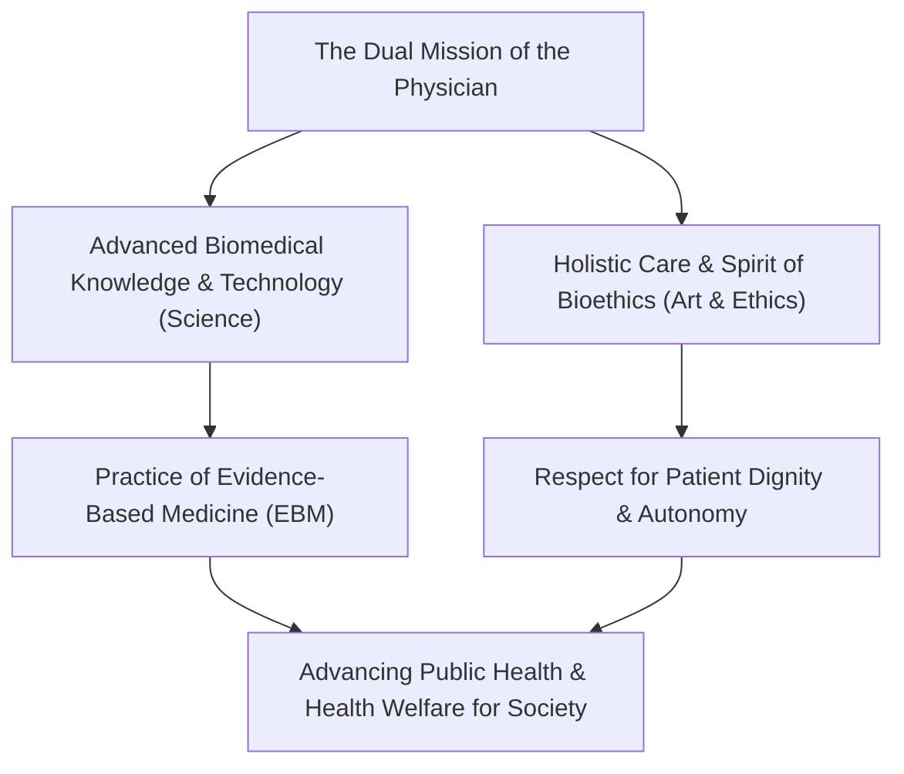
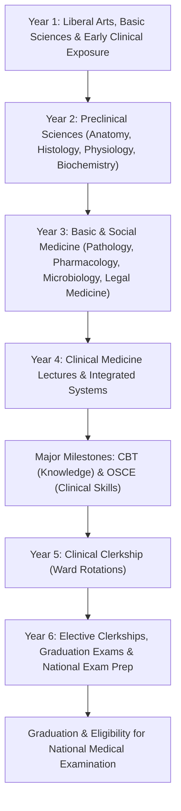
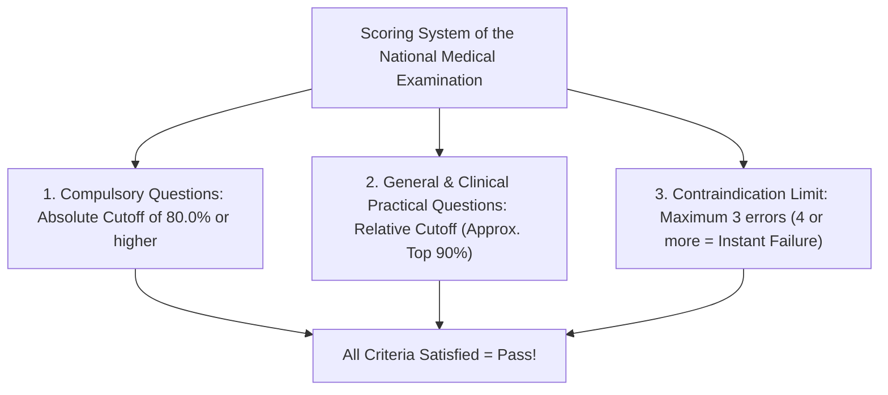
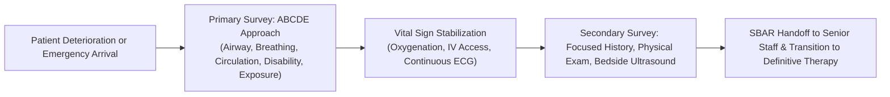
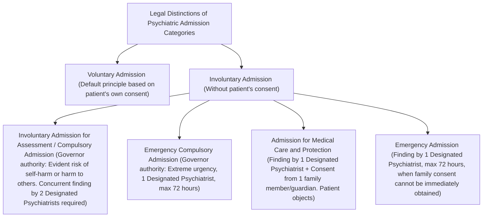
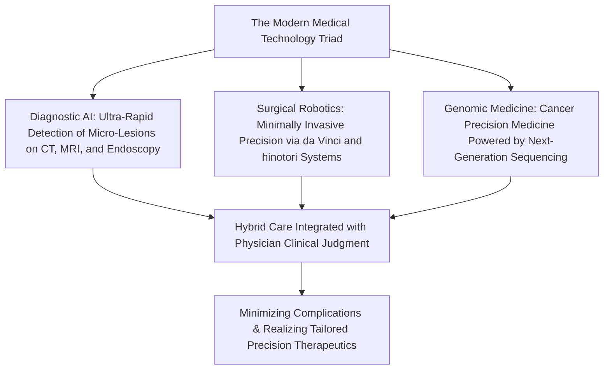

## 1. Introduction: The Sacred Calling and the Crossroads of Science Entrusted with Human Life

### 1.1 The Essence of the Physician's Calling: Integrating the Spirit of "The Art of Medicine" and Modern Natural Science

Throughout human history, the profession of the physician has consistently been regarded with profound reverence and awe. Originating from ancient shamans and spiritual healers, and evolving through the remarkable progress of modern natural science, the contemporary physician bears a dual identity: that of a "technocrat of advanced life sciences" and that of an "ethical being who stands beside the suffering and dying."

When struck by disease and confronted with the terror of mortality, human beings lay bare their most vulnerable, defenseless physical bodies and mental anguish before the physician. When a physician wields a scalpel, administers potent pharmacotherapies, and irreversibly invades the patient's biological interior, such an act technically fulfills the statutory elements of the crime of bodily injury under criminal law. The reason this act is exempted from criminal liability as a legitimate medical procedure (a justifiable act in the conduct of lawful business under Article 35 of the Penal Code) and revered by society rests entirely upon **an absolute fiduciary contract between the State, civil society, and the physician—namely, that "the physician has acquired advanced knowledge and skills, and will faithfully dedicate themselves to saving human lives and advancing health."**

The duty of a physician extends far beyond the mere eradication of disease (biological abnormality). The pursuit of the "Art of Medicine"—healing the whole person who suffers from that disease (illness: the subjective human experience of distress)—is the irreplaceable essence of the physician, an essence that cannot be supplanted no matter how rapidly artificial intelligence or surgical robotics may evolve.



---

### 1.2 Historical Evolution of the Hippocratic Oath, Declaration of Geneva, and Declaration of Lisbon

The origin of medical ethics traces back to the "Hippocratic Oath," drafted in ancient Greece by Hippocrates (c. 460–370 BCE), the "Father of Medicine," and his disciples.
- Swearing by Apollo the Physician, Asclepius, Hygieia, and Panaceia.
- Prescribing regimens for the benefit of the sick according to one's ability and judgment, while keeping them from harm and injustice.
- Refusing to administer lethal drugs even if asked, and never suggesting or performing an abortion.
- Maintaining purity and holiness throughout life and art, while leaving invasive surgical interventions like lithotomy to trained craftsmen.
- Never disclosing the personal secrets of patients learned in the course of clinical practice (strict confidentiality).

Entering modern history, deeply reflecting upon the inhuman human experimentation committed by Nazi physicians (exposed at the Nuremberg Doctors' Trial), the World Medical Association (WMA) adopted the **"Declaration of Geneva"** in 1948 as a contemporary reconstruction of the Hippocratic Oath.
- "I solemnly pledge to consecrate my life to the service of humanity."
- "The health of my patient will be my first consideration."
- "I will not permit considerations of age, disease or disability, creed, ethnic origin, gender, nationality, political affiliation, race, sexual orientation, social standing or any other factor to intervene between my duty and my patient."
- "I will maintain the utmost respect for human life, even under threat, and I will not use my medical knowledge contrary to the laws of humanity."

Furthermore, in 1981, the **"WMA Declaration of Lisbon on the Rights of the Patient"** codified patient rights into international standards, establishing the right to high-quality medical care, the right to information concerning medical records, the right to self-determination through informed consent, provisions for unconscious patients, and the right to die with dignity. This irreversibly solidified the paradigm shift from authoritarian paternalism to a patient-centered partnership.

---

### 1.3 The Noble Duty under Article 1 of Japan's Medical Practitioners Act

In Japanese jurisprudence, the fundamental statute governing the status and obligations of physicians is the "Medical Practitioners Act" (Act No. 201 of 1948). Article 1 proclaims the noble mission of the medical profession:

> **"A physician shall administer medical care and health guidance, thereby contributing to the improvement and promotion of public health, and ensuring healthy living for the citizens."**

This article clearly establishes that a physician's purview is not limited to the microscopic viewpoint of treating individual patients; it encompasses the macroscopic viewpoint of elevating public health through infectious disease control, environmental hygiene, preventive medicine, and national health policy. A medical license is not a personal privilege granted by the State, but an enduring credential of heavy public responsibility entrusted for the preservation of human life.

---

## 2. The Vast Six-Year Medical School Curriculum and Its Gateways

The pathway to becoming a physician is extraordinarily arduous and protracted. To obtain a medical license in Japan, one must complete a rigorous six-year formal program at a university faculty of medicine or medical college. The medical school curriculum is strictly standardized under the Ministry of Education, Culture, Sports, Science and Technology's (MEXT) "Model Core Curriculum for Medical Education."



---

### 2.1 Years 1–2: Liberal Arts Education and the Dawn of Basic Preclinical Sciences

#### Ethics and Medical Significance of Gross Anatomy Dissection
In Year 2, medical students encounter their first and perhaps most psychologically transformative trial: Gross Anatomy Dissection. Over several months, students confront human cadavers generously donated by individuals who dedicated their mortal remains to medical education.
- Amidst the pungent, stinging vapor of formalin preservation, students incise the skin, dissect subcutaneous fat, and meticulously identify every blood vessel, nerve, muscle fascicle, bone landmark, and visceral organ.
- Prior to the initial incision, all students bow their heads in silent prayer, expressing profound gratitude to the donors and their surviving families for their noble sacrifice.
- This passage indelibly imprints the three-dimensional, highly intricate architecture of the human body through all sensory faculties. Simultaneously, it serves as an irreplaceable rite of passage where future doctors directly touch human death, forging the psychological fortitude to carry that existential weight throughout their careers.

#### Physiology, Biochemistry, Histology
- **Physiology**: Students decipher the physicochemical mechanisms underlying vital phenomena, including the generation of cardiac action potentials (Na⁺/K⁺-ATPase pumps, rapid depolarization, plateau, and repolarization phases), glomerular filtration and tubular reabsorption in the nephron, and negative feedback loops governing endocrine axes.
- **Biochemistry**: Students thoroughly memorize and analyze molecular pathways, including the citric acid cycle (TCA cycle), oxidative phosphorylation, gluconeogenesis, fatty acid $\beta$-oxidation, protein synthesis, and DNA replication, transcription, and translation.
- **Histology**: Under light and electron microscopy, students sketch and analyze the microstructures of epithelial, connective, muscular, and nervous tissues, understanding the intimate correlation between morphological architecture and physiological function.

---

### 2.2 Years 3–4: Pathophysiology and the System of Clinical Medicine

From Year 3 through Year 4, education shifts from preclinical mechanisms to clinical medicine—the diagnosis and therapeutic management of diseases across various clinical specialties.

- **Pathology**: Deciphering the essence of diseases through cellular and tissue morphology (inflammation, necrosis, neoplastic atypia and grading, apoptosis).
- **Pharmacology**: Receptor-ligand dynamics, pharmacokinetics (Absorption, Distribution, Metabolism, Excretion: ADME), mechanisms of antimicrobial agents and emergence of drug-resistant pathogens, and molecular-targeted mechanisms of antihypertensive and antineoplastic agents.
- **Internal Medicine Subspecialties**: Cardiology (acute myocardial infarction, arrhythmias, heart failure), Pulmonology (lung cancer, COPD, interstitial lung diseases), Gastroenterology (peptic ulcer disease, liver cirrhosis, colorectal cancer), Nephrology (nephrotic syndrome, chronic kidney disease), Endocrinology & Metabolism (diabetes mellitus, thyroid disorders), Hematology (leukemias, malignant lymphomas), Neurology, and Rheumatology/Clinical Immunology.
- **Surgical Subspecialties**: Gastrointestinal surgery, cardiovascular surgery, thoracic surgery, neurosurgery, orthopedics, covering surgical indications, perioperative critical care, and shock resuscitation.
- **Pediatrics, Obstetrics & Gynecology, Psychiatry**: From neonatal congenital anomalies to pediatric neurodevelopmental disorders; perinatal management (eutocic and dystocic delivery, preeclampsia); pharmacotherapy and psychotherapy for schizophrenia and major depressive disorder.
- **Social Medicine, Forensic Medicine, Public Health**: Epidemiological statistics, the Infectious Disease Control Law, occupational medicine, toxicology, unnatural death investigation, and postmortem identification techniques through judicial and administrative autopsies.

---

### 2.3 The First Major Hurdle: CBT and OSCE (Official Nationalization of Common Achievement Tests)

In the autumn of Year 4, medical students must pass the nationwide Common Achievement Tests to qualify for entry into clinical clerkships in hospital wards. Following amendments to the Medical Practitioners Act enacted in 2023, these common achievement tests were officially nationalized as formal legal assessments.

1. **CBT (Computer-Based Testing)**:
   - An objective multiple-choice computer examination comprising approximately 320 medical knowledge questions.
   - Questions are randomly extracted from an enormous national item pool, and scores are standardized using Item Response Theory (IRT).
   - Covering preclinical, clinical, and social medicine in their entirety, candidates failing to achieve the established pass mark (typically 65–70% or higher) face immediate failure and academic retention (repeating the year).
2. **Pre-CC OSCE (Objective Structured Clinical Examination)**:
   - A practical examination assessing not merely theoretical knowledge, but clinical interviewing skills, physical examination techniques, and professional bedside manners.
   - Students rotate through multiple clinical stations (medical interview, head and neck examination, chest examination, abdominal examination, neurological examination, and basic life support/emergency resuscitation), demonstrating procedural competencies on standardized simulated patients or advanced manikins.
   - External evaluators assess performance using detailed checklists: personal grooming, introductions, empathy, hand hygiene, and accurate auscultation and palpation maneuvers are scrutinized.

Only candidates who pass both CBT and OSCE are bestowed the legal title of **"Student Doctor"**, granting them lawful authorization to participate in clinical bedside rotations.

---

### 2.4 Years 5–6: Clinical Clerkship (Participatory Clinical Training)

Beginning in Year 5, students participate in Clinical Clerkships, rotating through inpatient services and outpatient clinics of university hospitals and affiliated regional medical centers in blocks of 1 to 2 weeks.
Unlike the passive "observational clerkships" of past decades, contemporary clerkships require students to function as active junior members of the healthcare team.
- Under attending physician supervision, students take daily histories, assess vital signs, write student medical records, interpret laboratory and imaging findings, and deliver formal case presentations during clinical conferences.
- In the operating theater, they scrub, don sterile gowns and gloves, and serve as second or third assistants, handling surgical retraction, maintaining operative exposure, and cutting sutures.
- They master fundamental clinical procedures—venipuncture, peripheral intravenous catheterization, arterial blood sampling, and basic wound closure—under rigorous faculty supervision.
- In Year 6, medical schools administer exhausting "Graduation Examinations." To maintain institutional passing rates on the National Medical Examination, many universities rigorously weed out underperforming students through academic retention. Only those surviving this crucible receive an admission ticket to the National Examination.

---

## 3. Structure of the National Medical Examination and the Watershed of Passing

The National Medical Examination for Physicians is administered annually in early February over two consecutive days under the auspices of the Ministry of Health, Labour and Welfare (MHLW).

### 3.1 Examination Structure and Criteria

The examination consists of 400 questions formatted as optical mark recognition (OMR) tests, including multiple-choice, multiple-answer, and numerical calculation items.

| Block | Question Count | Duration | Content Scope |
| :--- | :---: | :---: | :--- |
| **Block A** | 75 questions | 135 min | Specialized & General Topics (Clinical Practical & General Questions) |
| **Block B** | 50 questions | 80 min | **Compulsory Questions (General & Clinical Practical)** |
| **Block C** | 75 questions | 135 min | Specialized & General Topics (Extended Clinical Vignettes, etc.) |
| **Block D** | 75 questions | 135 min | Specialized & General Topics (Preclinical & Social Medicine, etc.) |
| **Block E** | 50 questions | 80 min | **Compulsory Questions (Medical Safety & Public Health)** |
| **Block F** | 75 questions | 135 min | Specialized & General Topics (Comprehensive Clinical Problems) |

---

### 3.2 The Three Passing Criteria and the Dread of the "80% Compulsory Cutoff"

To pass the National Medical Examination, a candidate **must simultaneously satisfy all three of the following criteria**. Failing even a single criterion results in immediate disqualification.



1. **Absolute Cutoff for Compulsory Questions (80.0% Requirement)**:
   - For compulsory questions (100 questions, 200 total points), **achieving an absolute score of 80.0% (160 points or higher) is an inviolable requirement**.
   - Even if a candidate earns a near-perfect score on the general and clinical practical sections, falling short on the compulsory section by just one point results in failure. Candidates fill out their answer sheets under intense, trembling psychological pressure.
2. **Relative Standard for General and Clinical Practical Questions**:
   - The general and clinical practical questions are graded on a relative curve. Based on the standard deviation and national score distribution, a cutoff line is drawn eliminating the bottom ~10% of test-takers (typically falling around 68–72%).
3. **The Trap of Contraindications (禁忌肢: Kinkishi)**:
   - The most feared hurdle is the "Contraindication" item. Choosing an option that would **cause fatal harm to a patient, commit gross medical negligence, violate human rights, or break the law** increments the candidate's contraindication counter.
   - Typically, **selecting 4 or more contraindication options (or 3, depending on the year) causes immediate, unconditional failure**, regardless of whether the candidate's total score far exceeds the passing threshold.
   - Examples: Administering anticoagulants to a patient with suspected acute intracranial hemorrhage; giving corticosteroids alone while withholding intramuscular epinephrine in anaphylactic shock; administering contraindicated drugs in organophosphate poisoning; initiating involuntary psychiatric commitment based solely on family requests without obtaining patient consent or fulfilling statutory procedures.

---

## 4. The Trials of Junior Residency (2 Years): The Super-Rotation System

Even after passing the National Examination and being registered in the Medical Practitioners Registry, a newly minted physician is legally prohibited from practicing independently (Article 16-2 of the Medical Practitioners Act). Every doctor must undergo a mandatory two-year postgraduate clinical residency program.

### 4.1 The Impact of the 2004 Post-Graduate Medical Education Reform

Prior to the 2004 reform, medical graduates immediately entered a specific university medical department (the traditional "ikyo" or medical guild, such as the First Department of Internal Medicine or Second Department of Surgery) and received narrow training exclusively in that subspecialty. Consequently, an alarming blind spot emerged: highly specialized gastroenterologists often lacked the competency to manage basic bone fractures, treat common ophthalmological emergencies, or perform basic initial cardiopulmonary resuscitation.

To eliminate this fragmentation, the "Super-Rotation System (New Clinical Residency System)" was established.
- **Mandatory Generalist Competencies**: Irrespective of future specialization, all residents must rotate through Internal Medicine ($\ge 6$ months), Emergency Medicine ($\ge 3$ months), Community Medicine ($\ge 1$ month), Pediatrics, Obstetrics & Gynecology, Psychiatry, and General Surgery to cultivate foundational primary care competencies.
- **Introduction of the Matching System**: Instead of being assigned by university department chairs, resident placement was democratized through the Japan Residency Matching Program (JRMP), utilizing the Gale-Shapley stable marriage algorithm based on candidate and hospital preference rankings.
- This reform triggered a dramatic exodus of trainees toward renowned community teaching hospitals (e.g., St. Luke's International Hospital, Toranomon Hospital, Kurashiki Central Hospital, Kameda Medical Center) boasting robust clinical training, high emergency case volumes, and competitive night-shift compensation. Consequently, university medical department structures in rural prefectures experienced acute personnel shortages, precipitating regional healthcare crises.

---

### 4.2 The Grueling Daily Life of Junior Residents and Acquisition of Clinical Skills

The two years of junior residency represent the most intense, sleep-deprived, and steep learning curve in a physician's lifespan.



- **Emergency Department Night Shifts**: From walk-in minor illnesses to acute cardiopulmonary arrest (CPA) rushed in by EMS, the flow of critically ill patients is relentless. Under senior emergency physician guidance, residents triage life threats using the **"ABCDE Approach"** (Airway, Breathing, Circulation, Dysfunction/Disability of CNS, Exposure).
- **Mastering Essential Procedures**:
  - Radial arterial blood gas sampling.
  - Bedside point-of-care ultrasound (POCUS) using the FAST protocol (Focused Assessment with Sonography for Trauma) to identify hemoperitoneum and pericardial tamponade.
  - Central venous catheter (CVC) insertion under dynamic ultrasound guidance (internal jugular and femoral approaches).
  - Endotracheal intubation (direct laryngoscopy, video laryngoscopy, vocal cord visualization, and tube placement).
  - Diagnostic lumbar puncture (CSF sampling for suspected central nervous system infections).
  - Tube thoracostomy (chest tube drainage) and diagnostic/therapeutic paracentesis.
- **Pronouncing Death and Breaking Bad News**: The solemn moment of confirming cardiac standstill, pupillary dilation, loss of light reflex, and flatline ECG; writing the death certificate; and notifying grieving families. The weight of human mortality becomes engraved into the resident's core identity.

---

## 5. Overview of the New Board Specialty System: 19 Primary Specialties and Subspecialties

Upon completing the two-year junior residency, physicians advance to senior residency ("Senko-i") and commit to their career specialty. Implemented fully in 2018, the "New Medical Specialist System" is governed by the Japanese Medical Specialty Board under standardized criteria, forming a two-tiered pyramid structure.

```mermaid
flowchart TD
    subgraph Primary Specialties (First Tier: 3 to 5 Years)
        B1["Internal Medicine"]
        B2["Surgery"]
        B3["Pediatrics"]
        B4["Obstetrics & Gynecology"]
        B5["Emergency Medicine"]
        B6["General Practice / Family Medicine"]
        B7["13 Other Fields (Orthopedics, Anesthesiology, Psychiatry, Neurosurgery, Dermatology, Urology, Ophthalmology, ENT, Pathology, Radiology, Plastic Surgery, Rehab, Clinical Lab)"]
    end
    subgraph Subspecialties (Second Tier: Additional 2 to 3 Years)
        B1 --> S1["Cardiology / Gastroenterology / Pulmonology / Hematology / Nephrology / Endocrinology & Metabolism / Neurology"]
        B2 --> S2["Gastrointestinal Surgery / Cardiovascular Surgery / Thoracic Surgery / Pediatric Surgery / Breast Surgery"]
    end
    S1 --> PHD["Supervising Board Certification, PhD in Medical Science, Clinical Research"]
    S2 --> PHD
```

---

### 5.1 The System of 19 Primary Specialties

Senior residents enroll in an accredited specialty training program within one of the **19 primary specialty areas** for 3 to 5 years.

| Primary Specialty | Training Duration | Key Focus and Core Characteristics |
| :--- | :---: | :--- |
| **Internal Medicine** | 3 years | Rigorous case logging: Hundreds of inpatient cases and detailed case summaries logged via the J-OSLER system. Prerequisite for all medical subspecialties. |
| **Surgery** | 3–4 years | Comprehensive foundation across gastrointestinal, cardiovascular, thoracic, and pediatric surgery. Surgical procedures logged into the National Clinical Database (NCD). |
| **Pediatrics** | 3 years | Comprehensive care spanning neonatal intensive care (NICU), pediatric emergencies, infectious diseases, developmental disorders, and allergic conditions. |
| **Obstetrics & Gynecology** | 3 years | Perinatal medicine (eutocic/dystocic labor, cesarean delivery), gynecologic oncology, and reproductive medicine/infertility. |
| **Emergency Medicine** | 3 years | Polytrauma, septic shock, toxicological crises, severe burns, intensive care unit (ICU) management, and prehospital air ambulance (Doctor-Heli) care. |
| **General Practice** | 3 years | Newly codified domain. Comprehensive community care, multimorbidity management in aging populations, and family medicine. |
| **Orthopedic Surgery** | 3–4 years | Fracture osteosynthesis, joint arthroplasty, spinal instrumentation, sports medicine, and functional rehabilitation. |
| **Anesthesiology** | 4 years | General anesthesia, epidural/spinal anesthesia, pain management clinics, critical care management, and perioperative crisis management. |
| **Psychiatry** | 3 years | Linked with statutory Designated Psychiatrist qualification. Pharmacotherapy and psychotherapy for depression, bipolar disorder, schizophrenia, and dementia. |
| **Neurosurgery** | 4 years | Cerebral aneurysm clipping, intracranial tumor resection, endovascular interventional catheterization, and traumatic brain injury neurotrauma. |
| **Radiology** | 3 years | Diagnostic radiology (interpretation of CT, MRI, PET) and interventional radiology (IVR), coupled with clinical radiation oncology. |
| **Pathology** | 3 years | Intraoperative frozen section consultation, surgical biopsy histopathology, and postmortem clinicopathological correlation (CPC autopsies). |
| **Other Specialties** | 3–4 years | Dermatology, Urology, Ophthalmology, Otorhinolaryngology–Head and Neck Surgery, Plastic and Reconstructive Surgery, Rehabilitation Medicine, and Clinical Laboratory Medicine. |

---

### 5.2 Deepening into Subspecialties and the Doctor of Medical Science (PhD)

After securing primary board certification, physicians pursue subspecialty board qualifications (the second tier), such as Board-Certified Cardiologist, Gastroenterologist, Endoscopist, Cardiovascular Surgeon, or Medical Oncologist.

Simultaneously, many physicians matriculate into four-year university graduate medical schools (Doctoral programs). Performing bench-to-bedside research in molecular biology, tumor immunology, single-cell genomics, or large-scale clinical trials, they publish original peer-reviewed papers as first authors in leading international journals to earn their **Doctor of Medical Science (PhD)** degree. They navigate the delicate balance of caring for critically ill patients on the wards while advancing scientific evidence on the frontiers of human disease.

---

---

## 2.5 In-Depth Clinical Pathophysiology and the Mathematics of Pharmacokinetics / Pharmacodynamics (PK/PD Theory)

To move beyond rote memorization of diseases and develop rigorous clinical reasoning based on molecular biology and mathematical pharmacology, medical students must master **"PK/PD Theory (Pharmacokinetics / Pharmacodynamics)."**

### Basic Parameters of Pharmacokinetics (PK)
- **Area Under the Concentration-Time Curve (AUC)**: An index reflecting total systemic exposure to the drug in the circulation over time.
- **Maximum Plasma Concentration (Cmax)**: The peak drug concentration achieved in the bloodstream following administration.
- **Volume of Distribution (Vd)**: A theoretical volume quantifying drug distribution—whether the agent penetrates extensively into tissues (lipophilic) or remains confined primarily to plasma (hydrophilic).

### Three Major Classifications of PK/PD Parameters for Antimicrobial Agents
In antimicrobial therapy, dosing strategies are categorized into three patterns based on the mathematical relationship between the Minimum Inhibitory Concentration (MIC) and drug concentration profiles:

| Parameter | Efficacy Correlate | Representative Antimicrobials | Dosing Design Strategy |
| :--- | :--- | :--- | :--- |
| **Time above MIC ($T > MIC$)** | Percentage of dosing interval where drug concentration exceeds MIC (%) | **Penicillins, Cephalosporins, Carbapenems** ($\beta$-lactams) | Rather than increasing peak single doses, **maximize frequency (3–4 divided doses daily)** or extend infusion times (continuous or extended infusion) to optimize bactericidal activity. |
| **$Cmax / MIC$** | Ratio of peak plasma concentration to MIC | **Aminoglycosides** (Gentamicin, Amikacin) | Avoid divided daily doses; utilize **once-daily high-dose therapy** to produce steep peak concentrations, maximizing concentration-dependent bactericidal killing and the post-antibiotic effect (PAE), while reducing nephrotoxicity and ototoxicity. |
| **$AUC / MIC$** | Ratio of 24-hour total drug exposure to MIC | **Fluoroquinolones, Vancomycin** (Glycopeptides) | Ensure adequate cumulative 24-hour systemic exposure. For vancomycin, perform therapeutic drug monitoring (TDM) to maintain steady-state trough concentrations precisely at $15 \sim 20 \mu g/mL$. |

---

## 3.6 Challenges in the National Medical Examination: Public Health Legislation and Legal Interpretation of the Mental Health and Welfare Act

Among all domains of the National Examination, public health and healthcare jurisprudence represent the most treacherous territory for medical students. Success demands not only biological knowledge, but also exact legal interpretation comparable to statutory bar examinations.

### ① Classification under the Infectious Disease Control Law and Physicians' Notification Duties
Under the "Act on the Prevention of Infectious Diseases and Medical Care for Patients with Infectious Diseases (Infectious Disease Control Law)," pathogens are classified into Categories 1 through 5, designated infectious diseases, and novel influenza-like infections based on virulence and transmissibility.

- **Category 1 Infectious Diseases (Ebola hemorrhagic fever, Plague, Marburg disease, Lassa fever, Crimean-Congo hemorrhagic fever, Smallpox, South American hemorrhagic fevers)**:
  - **Physicians must immediately (without delay) notify the prefectural governor via the local public health center director.**
  - Mandatory administrative actions follow: involuntary admission to Specified or Class 1 Designated Medical Institutions, traffic restrictions within a 72-hour window, and decontamination or destruction of contaminated property.
- **Category 2 Infectious Diseases (Tuberculosis, Severe Acute Respiratory Syndrome [SARS], Middle East Respiratory Syndrome [MERS], Avian Influenza A [H5N1/H7N9], Poliomyelitis)**:
  - Immediate notification. Recommendations and orders for admission to Class 2 Designated Medical Institutions. For tuberculosis, public subsidy programs cover medical expenses for latent tuberculosis infection (LTBI).
- **Category 3 Infectious Diseases (Cholera, Shigellosis, Typhoid fever, Paratyphoid fever, Enterohemorrhagic Escherichia coli [EHEC/O157, etc.])**:
  - Immediate notification. Mandatory hospital admission is not imposed, but statutory employment restrictions are enforced for food-service handlers until stool culture results turn negative.
- **Category 4 Infectious Diseases (Hepatitis E, Hepatitis A, Malaria, Rabies, Dengue fever, Yellow fever, Japanese encephalitis, Legionellosis, Tetanus, etc.)**:
  - Infections transmitted via animal reservoirs, contaminated food/water, or arthropod vectors. Immediate notification. Because human-to-human droplet transmission typically does not occur, no compulsory admission or work restrictions are imposed.
- **Category 5 Infectious Diseases**:
  - **All-Case Notification (Mandatory reporting within 7 days)**: Measles, Rubella, Syphilis, Acute Encephalitis, Tetanus, Invasive Meningococcal Disease, Acquired Immunodeficiency Syndrome (AIDS/HIV). (Measles and Rubella require immediate notification upon diagnosis).
  - **Sentinel Surveillance (Designated sentinel facilities report on a weekly or monthly basis)**: Seasonal influenza, hand-foot-and-mouth disease, RSV infection, infectious gastroenteritis, etc.

### ② Legal Rigor of Admission Categories under the Mental Health and Welfare Act
In psychiatric medicine, balancing the patient's civil liberties with the imperative to prevent self-harm and violence toward others is governed strictly by the "Act on Mental Health and Welfare for the Mentally Disabled (Mental Health and Welfare Act)."



In the National Examination, questions detailing the legal hierarchy of consent providers for "Admission for Medical Care and Protection" (spouse, person with parental authority, person obligated to support, legal guardian, or the municipal mayor in their absence) and the regulatory pipeline of "Compulsory Admission" triggered by police notification (Article 24) or citizen petition (Article 22) represent high-stakes discriminators where a single misplaced option decides pass or fail.

---

## 4.5 The Crucible of the Emergency Department: The Differential Diagnosis Framework "AIUEO TIPS" for Altered Mental Status and Acute Abdomen

A junior resident's pager shrills during the night shift: "70-year-old male with severe altered mental status incoming via ambulance!" At that moment, the resident's mind must immediately execute the global standard diagnostic framework: **"AIUEO TIPS."**

| Mnemonic | Potential Etiologies to Differentiate | Immediate Emergency Action |
| :---: | :--- | :--- |
| **A** | **A**lcohol (acute intoxication) / **A**cidosis | Check breath odor; arterial blood gas analysis for pH, lactate, and calculation of the Anion Gap (AG). |
| **I** | **I**nsulin (hypoglycemia, DKA / HHS) | **Perform immediate point-of-care capillary fingerstick glucose!** (Severe hypoglycemia causes irreversible neuronal death within tens of minutes; administer immediate IV bolus of 50% dextrose). |
| **U** | **U**remia | Serum biochemistry for BUN, creatinine, and potassium; evaluate indications for emergent hemodialysis. |
| **E** | **E**ncephalopathy (hepatic, hypertensive) / **E**lectrolytes / **E**ndocrine (thyroid storm, myxedema coma, adrenal crisis) | Measure serum ammonia; check serum sodium (beware osmotic demyelination syndrome [ODS] caused by over-rapid correction of chronic hyponatremia). |
| **O** | **O**xygen (severe hypoxemia) / **O**verdose / **O**piate intoxication | Continuous pulse oximetry, blood gas; if miosis and respiratory depression are present, administer IV naloxone. |
| **T** | **T**rauma (traumatic brain injury) / **T**emperature (hypothermia, severe heat stroke) | Non-contrast head CT (acute subdural/epidural hematoma); core rectal temperature measurement. |
| **I** | **I**nfection (CNS: meningitis, encephalitis; severe sepsis) | Assess nuchal rigidity, Kernig's sign, jolt accentuation. Draw 2 sets of blood cultures; immediately start empiric antibiotics (Ceftriaxone + Vancomycin + Ampicillin), then perform lumbar puncture. |
| **P** | **P**sychiatric (psychogenic unresponsiveness, conversion disorder) / **P**orphyria | Consider psychiatric etiology only after thoroughly ruling out all organic and metabolic pathologies. |
| **S** | **S**troke (ischemic stroke, ICH, subarachnoid hemorrhage) / **S**eizure (status epilepticus) / **S**hock (hypovolemic, cardiogenic, obstructive, distributive) | Neurological localization exam, emergent non-contrast head CT and diffusion-weighted MRI (DWI). Evaluate eligibility for IV rt-PA (within 4.5 hours of onset) or endovascular mechanical thrombectomy. |

When an unresponsive patient arrives, the instinct to "immediately rush the patient to head CT" is the most dangerous novice error. If profound hypoglycemia or uncorrected hypoxia is overlooked, cardiac arrest will occur inside the scanner. The core tenet—**"Vital signs first, then Glucose, ABCDE stabilization!"**—must be etched into every clinician's instincts.

---

## 5.5 Career Paths of Physicians: Harsh Economic Realities and the Truth of Continuing Medical Education

### Structural Disparities Between Hospital Employees and Private Clinic Practitioners and the Reality of Moonlighting
Society frequently harbors a monolithic perception that "all doctors earn astronomical fortunes." In truth, income and lifestyle vary radically depending on career stage, institutional affiliation, and clinical specialty.

1. **The Economic Reality of University Hospital Physicians**:
   - Junior residents earn an average gross annual income of approximately 3.5 to 4.5 million JPY nationwide.
   - Senior residents affiliated with university departments often receive basic monthly salaries of just 200,000 to 300,000 JPY. Overwhelmed with inpatient ward duties, research, and conference presentations, they rely heavily on 1–2 moonlighting night shifts per week (earning 40,000 to 80,000 JPY per shift covering emergency walk-in clinics or chronic care hospitals) to cover basic living expenses.
   - Even after attaining a PhD in their mid-thirties and being promoted to Assistant Professor or Lecturer, university hospital compensation frequently hovers around 6.0 to 8.0 million JPY annually.
2. **Mid-Career Clinicians in Community Teaching Hospitals**:
   - Clinicians in their late thirties to forties serving as Division Chiefs or Department Directors at regional medical centers earn approximately 12.0 to 18.0 million JPY. However, this is accompanied by intense on-call duties, emergency off-hours callbacks, and frequent overnight shifts.
3. **Private Clinic Owners (Independent Practitioners)**:
   - Physicians who establish private outpatient practices in their forties, financing tens to hundreds of millions of yen through commercial bank loans, can achieve personal revenues of 25.0 to 40.0 million JPY once their clinic matures. However, they assume total managerial liability, managing human resources, capital depreciation, cash flows, and marketing, alongside unlimited personal financial debt risks.

### Medical Malpractice Litigation Risk and Professional Liability Insurance
Physicians practice constantly in the shadow of catastrophic malpractice litigation risks.
- Perinatal intrapartum asphyxia resulting in neonatal cerebral palsy (while cushioned by the Japan Obstetric Compensation System, civil suits may yield damage awards exceeding 100 to 200 million JPY).
- Sudden postoperative death secondary to acute pulmonary thromboembolism, delayed diagnosis of fatal drug reactions during antineoplastic chemotherapy, or diagnostic imaging oversights.
- Enrolling in physician liability insurance through the Japan Medical Association or specialty societies is an indispensable self-defense requirement for every practicing clinician.

---

## 6. Essential Laws, Regulations, Systems, and Medical Ethics for Physicians

A physician's routine practice is regulated by an intricate statutory framework. Disregarding legal statutes exposes clinicians to administrative sanctions (license revocation, suspension of medical practice under Article 7 of the Medical Practitioners Act), criminal prosecution, and multi-million-yen civil damage judgments.

### 6.1 Anatomical Analysis of Key Articles in the Medical Practitioners Act

#### ① Obligation to Provide Medical Care (Article 19, Paragraph 1 of the Medical Practitioners Act)
> "A physician engaged in medical practice shall not refuse any request for medical examination or treatment without justifiable grounds."

Historically construed as an absolute prohibition against turning away any patient, modern interpretations were formally clarified by the Ministry of Health, Labour and Welfare in 2019.
- During scheduled clinical hours, even if an attending specialist is unavailable, physicians must provide emergency first-aid stabilization or facilitate appropriate transfer to a higher-level facility.
- Conversely, outside operating hours, when an institution is not designated as an emergency provider, or when patients display disruptive behavior (drunkenness, violence, repetitive refusal to pay fees), or when severe physician illness or profound sleep deprivation jeopardizes patient safety, refusal of care is legally recognized as possessing "justifiable grounds" to safeguard medical safety.

#### ② Prohibition of Medical Treatment Without Direct Examination (Article 20 of the Medical Practitioners Act)
> "A physician shall not administer medical treatment or issue a prescription without conducting an in-person examination, nor issue a birth certificate or stillbirth certificate without attending the delivery."

Treating patients or prescribing pharmaceuticals without conducting a direct clinical examination is strictly prohibited. The modern expansion of telemedicine is permitted as a statutory exception strictly within the bounds of MHLW's "Guidelines on the Appropriate Implementation of Online Medical Consultations," restricted to specific diagnoses and standardized safety protocols.

#### ③ Obligation to Report Unnatural Deaths (Article 21 of the Medical Practitioners Act)
> "When a physician examines a corpse or a stillborn fetus of four months or more of gestation and finds an abnormality, the physician shall report it to the competent police station within 24 hours."

Whether unexpected hospital deaths or adverse medical errors fall under the definition of "unnatural death" has been fiercely litigated before the Supreme Court of Japan (notably in the Tokyo Women's Medical University case and Tokyo Metropolitan Hiroo Hospital case). Judicial precedent established that if external inspection reveals unnatural signs or where a crime is suspected—even within a healthcare facility—physicians have an inescapable statutory duty to notify police authorities; concealing such events incurs criminal liability.

---

### 6.2 Informed Consent (Explanation and Agreement) and the Legal Doctrines of Medical Malpractice

In civil litigation, allegations of medical negligence (breach of contract or tort liability) rest upon two analytical pillars: "breach of the duty of care" and "breach of the duty of disclosure (informed consent)."

- **Standard of Care (医療水準)**: The benchmark for the duty of care is evaluated objectively against "the standard that a reasonable, conscientious physician in the relevant medical field ought to have practiced under contemporaneous medical science," accounting for institutional resources and regional realities.
- **Informed Consent**: Physicians are mandated to explain to patients in accessible language: ① the clinical diagnosis and current status, ② the nature of proposed interventions, ③ probabilities of risks, complications, and adverse events, ④ alternative therapeutic modalities alongside their risks and benefits, and ⑤ prognosis if left untreated. Valid consent must represent the patient's autonomous, voluntary decision. If a physician performs an invasive operation without adequate disclosure and complications ensue, substantial damages will be awarded for "infringement of personal autonomy," even if the surgical technique was executed flawlessly.

---

---

## 6.5 Decision-Making Processes in End-of-Life Care (ACP) and Rigor of Legal Brain Death Determination

The heaviest ethical burdens confronted by clinicians arise during end-of-life decision-making—withholding or withdrawing life-sustaining therapy—and the formal determination of brain death.

### ① Guidelines on Decision-Making Processes for Medical and Care at the End of Life
Under MHLW guidelines, modern clinical practice centers upon **"ACP (Advance Care Planning, affectionately termed 'Jinsei Kaigi' or Life Meetings)."**
- Unilateral physician decisions to initiate or terminate life-sustaining therapy (mechanical ventilation, vasopressors, cardiopulmonary resuscitation) are unacceptable.
- When the patient's capacity is intact: Thorough, iterative discussions must occur between the patient and a multidisciplinary healthcare team, honoring the patient's preferences as values evolve over time.
- When the patient's capacity is compromised: If an advance directive or presumptive intent can be inferred through family testimony, that intent is honored; if unknown, the family and multidisciplinary team must deliberate collaboratively to determine what serves the patient's best interests.
- **Criminal Exemption Criteria for Withdrawing Life-Sustaining Treatment**: Judicial decisions (the Kawasaki Kyodo Hospital and Imizu Municipal Hospital cases) establish that criminal homicide or abandonment resulting in death is averted only when four criteria are strictly met: ① irreversible terminal condition (death is imminent), ② authentic self-determination by the patient (living wills), ③ maximum palliative symptom control, and ④ meticulous adherence to a multidisciplinary consensus process.

### ② Six Major Legal Criteria for Brain Death Determination under the Organ Transplant Act
Under the "Act on Organ Transplantation (Organ Transplant Act)," brain death is legally recognized as human death exclusively when prospective organ donation is contemplated. Brain death determination demands execution of an uncompromising objective protocol, repeated twice.

1. **Deep Coma (Japan Coma Scale 300 / Glasgow Coma Scale 3)**: Total absence of response to all external verbal and painful stimuli.
2. **Dilated and Fixed Pupils**: Bilateral pupil diameter $\ge 4 mm$, with complete loss of direct and consensual pupillary light reflexes.
3. **Complete Loss of Brainstem Reflexes (Testing of 7 Core Reflexes)**:
   - Pupillary light reflex.
   - Corneal reflex (no blinking upon touching cornea with sterile cotton).
   - Ciliospinal reflex (no pupillary dilation upon pinching neck skin).
   - Oculocephalic reflex (absence of "doll's eye phenomenon" upon rapid passive horizontal and vertical head rotation).
   - Vestibulo-ocular reflex (caloric test: no eye deviation or nystagmus upon irrigating external auditory canal with cold saline).
   - Pharyngeal reflex (gag reflex: no retching when posterior pharyngeal wall is stimulated).
   - Cough reflex (no coughing upon deep suction stimulation through endotracheal tube).
4. **Electrocerebral Silence / Flat EEG**: Using the International 10-20 system on multi-channel electroencephalography at maximum sensitivity ($2 \mu V/mm$) for at least 30 continuous minutes, demonstrating total electrocerebral silence.
5. **Complete Absence of Spontaneous Respiration (Apnea Test)**: Temporarily disconnecting the mechanical ventilator while delivering $100\% O_2$ via endotracheal cannula; observing for the total absence of respiratory movement until arterial carbon dioxide tension ($PaCO_2$) rises to $\ge 60 mmHg$.
6. **Observation Interval**: Following completion of all above criteria, a mandatory observation period of **at least 6 hours** (at least 24 hours for children under 6 years of age) must elapse, followed by a complete re-examination confirming irreversibility.

The exact moment the second assessment confirms full concordance is pronounced as the patient's legal time of death. Physicians stand witness to this moment carrying both the pinnacle of biological science and profound reverence for the mystery of life.

---

## 7. Continuing Medical Education and Contemporary Challenges: Work-Style Reform and the Future of AI Healthcare

### 7.1 The Upheaval of Physician Work-Style Reform (Enacted April 2024)

For decades, Japan's world-leading healthcare access and unparalleled longevity were sustained through the self-sacrificing dedication of physicians working unmetered overtime (routinely exceeding 100 to 200 monthly overtime hours via consecutive night shifts and on-calls).

To dismantle systemic risks of death from overwork (karoshi), statutory overtime caps for physicians were enacted in April 2024.

| Level | Eligible Hospitals and Physicians | Annual Overtime Cap | Monthly Cap and Key Features |
| :---: | :--- | :---: | :--- |
| **Level A** | General employed physicians (majority of hospitals) | **960 hours** (Monthly average $\le 80$ hours) | Regulated strictly within the statutory karoshi threshold line. |
| **Level B** | Regional healthcare preservation provisional exception (designated emergency centers, etc.) | **1,860 hours** (Monthly max 155 hours) | Transitional mitigation measure; requires prefectural government designation. |
| **Level C** | Intensive skill acquisition programs (junior and senior specialty residents) | **1,860 hours** (Monthly max 155 hours) | Training allocation for acquiring vast clinical procedural volume in compressed timeframes. |

While these reforms introduced mandatory rest intervals between consecutive duties to safeguard physician wellness, they have also triggered critical structural disruptions: withdrawal of part-time on-call coverage from rural community hospitals, tighter ambulance diversion rates in emergency departments, and diminished procedural volume for surgical trainees.

---

### 7.2 Medical DX: Symbiosis with Diagnostic AI and Surgical Robotics

Twenty-first-century clinical medicine is undergoing a radical paradigm shift driven by technological convergence.



- **Diagnostic AI**: Deep-learning algorithms identifying micro-nodules in lung cancer, subtle polyps during colonoscopy, and diabetic retinopathy on fundus photography now operate routinely as an indispensable "third eye" for radiologists and endoscopists.
- **Surgical Robotics**: Systems such as the "da Vinci Surgical System" and Japan's domestic "hinotori" eliminate physiological hand tremors, providing articulating instruments with degrees of freedom exceeding human wrists and high-definition 3D stereoscopic visualization, dramatically curtailing intraoperative blood loss during radical prostatectomies, gastrectomies, and low anterior resections.
- **Precision Medicine**: Comprehensive genomic profiling tests (cancer gene panels) interrogating hundreds of genetic alterations via next-generation sequencing allow clinicians to select targeted molecular therapeutics and immune checkpoint inhibitors tailored to an individual patient's unique genomic footprint.

Yet, however sophisticated artificial intelligence becomes, **the final decision on therapeutic strategy, the delivery of difficult prognostic diagnoses, the ethical wrestling over resource allocation, and the heartfelt grief care provided to bereaved families** can only be borne by human physicians endowed with genuine warmth and empathy.

---

## 8. Conclusion: The Essence of Holistic Medicine—Treating Not Just the Disease, but the Patient Who Has It

The journey of becoming and remaining a physician is an unending voyage of rigorous scholarship and relentless self-discipline. It begins at the threshold of medical school, traverses national licensing, the grueling crucible of residency, the acquisition of specialist board certifications, and continues through a lifetime of interpreting ever-evolving clinical trials.

Sir William Osler (1849–1919), the titan of modern clinical medicine, bestowed upon young physicians this timeless aphorism:

> **"The good physician treats the disease; the great physician treats the patient who has the disease."**

To hold within one's mind the labyrinthine metabolic cascades of biochemistry, the mathematical equations of physiology, the receptor kinetics of pharmacology, the intricate anatomical pathways of nerves and vessels, and the exacting statutory articles of medical jurisprudence—and yet, when the examination room door opens, to greet a frightened, suffering human being with a compassionate gaze and sincere words of comfort.

The crystalline intellect of an uncompromising scientist, unified with the warmth of boundless human compassion. Harmonizing these two virtues within oneself to protect human life and well-being over a lifetime represents the ultimate realization and sacred purpose of the physician's calling.
