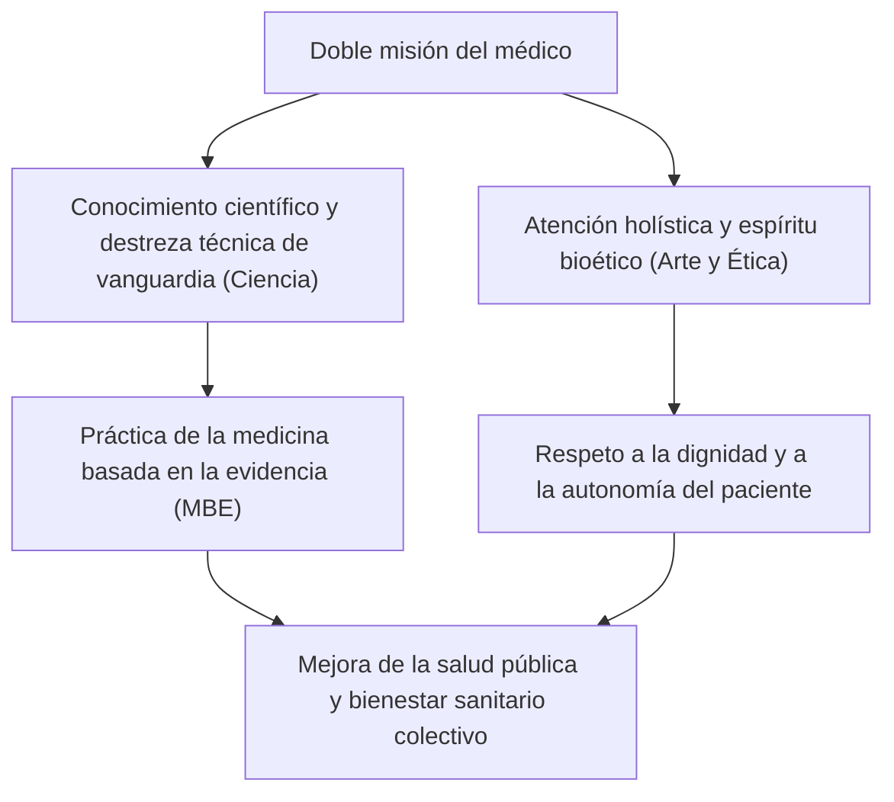
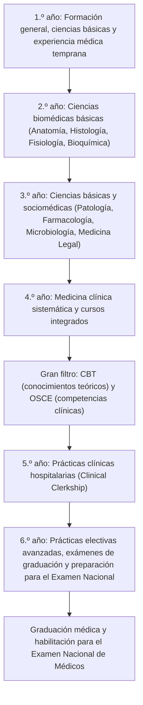
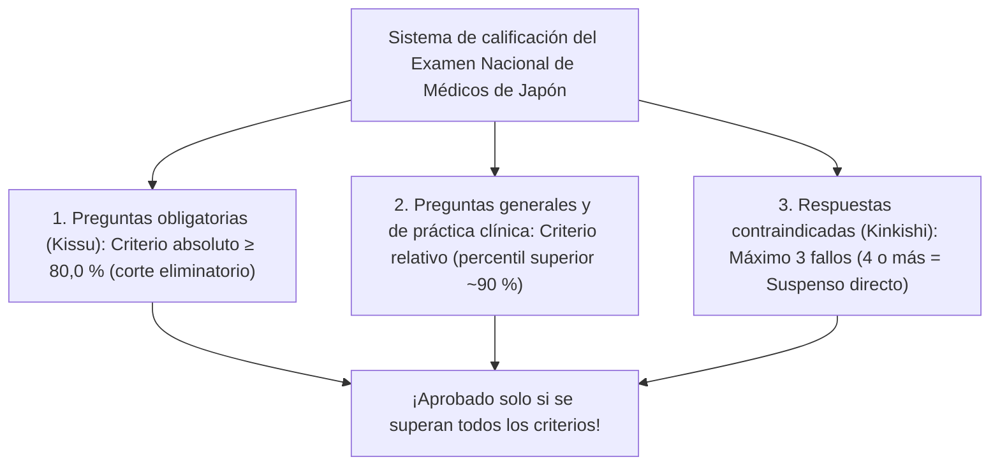
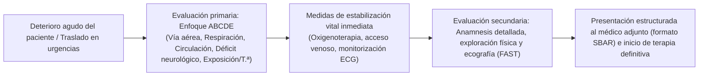
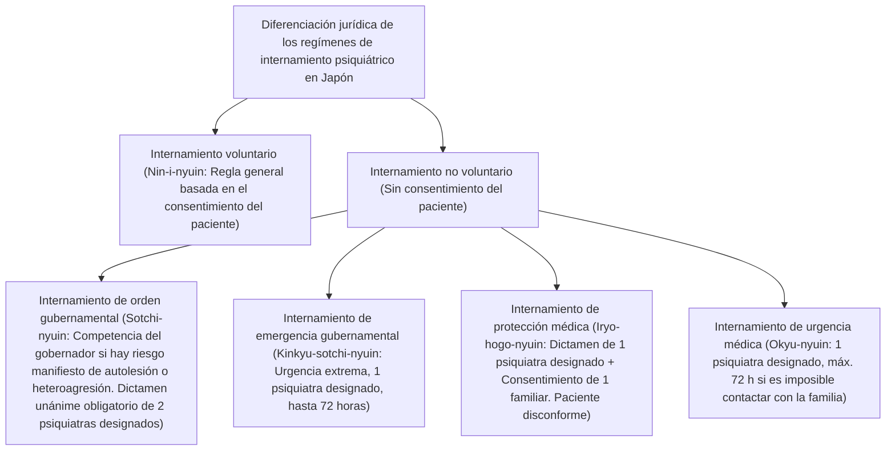
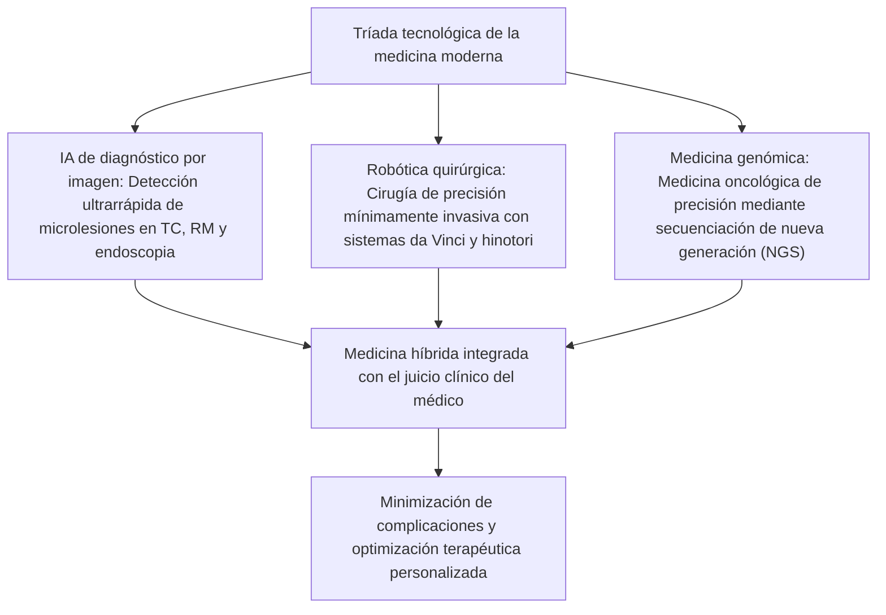

## 1. Introducción: La encrucijada entre el sacerdocio de la vida humana y la ciencia

### 1.1 La esencia de la función médica: Integración del espíritu del «Arte de Curar» con las ciencias naturales modernas

La profesión médica siempre ha sido acogida con una reverencia y un respeto singulares a lo largo de la historia de la humanidad. Desde sus orígenes en los chamanes ancestrales y los sanadores religiosos, y tras el vertiginoso desarrollo de las ciencias naturales modernas, el médico de hoy en día asume una doble misión: es un «tecnócrata de las ciencias de la vida de alta complejidad» y, al mismo tiempo, una «existencia ética que acompaña el dolor y la muerte del prójimo».

El ser humano postrado por la enfermedad y confrontado con el terror de la muerte expone ante el médico su cuerpo y su psique en el estado más vulnerable e indefenso. Cuando un médico empuña el bisturí, administra fármacos potentes y penetra de forma irreversible en el organismo del paciente, su acto encaja formalmente en el tipo penal del delito de lesiones corporales. El fundamento jurídico y social por el cual dicho acto queda plenamente exento de responsabilidad penal como una intervención médica legítima (conforme a los actos profesionales legítimos del artículo 35 del Código Penal japonés) y goza de la máxima consideración social radica pura y exclusivamente en el **contrato fiduciario absoluto entre el Estado, la sociedad civil y el médico: la promesa de que el facultativo domina un conocimiento y una destreza técnica de excelencia, y los consagra con la máxima lealtad y rectitud al salvamento de vidas y a la promoción de la salud**.

La labor del médico no se reduce al mero tratamiento de la afección patológica en su dimensión puramente biológica (*Disease*). La búsqueda del verdadero «Arte de la Medicina» (*The Art of Medicine* o *Idō*), que sana de manera holística e integral a la persona que padece y sufre subjetivamente la vivencia del enfermar (*Illness*), constituye la esencia insustituible del médico, un núcleo humano que jamás podrá ser reemplazado por ningún avance de la inteligencia artificial o de la robótica.



---

### 1.2 Evolución histórica del Juramento Hipocrático, la Declaración de Ginebra y la Declaración de Lisboa

El origen primordial de la ética médica se remonta al «Juramento Hipocrático» (*Hippocratic Oath*), redactado en la antigua Grecia por el llamado padre de la medicina, Hipócrates (circa 460 a. C. – 370 a. C.), y sus discípulos:
- Juramento solemne por los dioses sanadores Apolo y Asclepio.
- Prescripción de regímenes dietéticos y terapéuticos en beneficio del enfermo según la capacidad y el juicio del médico, rechazando todo daño e injusticia.
- Negativa rotunda a administrar fármacos letales aun a petición del paciente, y abstención absoluta de sugerir o inducir abortos.
- Conservación de la pureza y la piedad a lo largo de toda la vida, delegando las intervenciones quirúrgicas de litiasis a operadores especializados.
- Guardar riguroso secreto sobre todo cuanto se vea u oiga en la intimidad de la vida de los enfermos durante la práctica del arte (secreto profesional).

Al adentrarse en la época contemporánea, tras una profunda y dolorosa reflexión sobre los crímenes atroces de experimentación humana no consentida perpetrados por médicos de la Alemania nazi (juzgados en los Juicios de Núremberg), la Asociación Médica Mundial (AMM / WMA) adoptó en 1948 la **«Declaración de Ginebra»**, actualizando el juramento hipocrático a la era moderna:
- «Consagrar solemnemente mi vida al servicio de la humanidad».
- «Hacer de la salud de mi paciente mi primera consideración».
- «No permitir que consideraciones de edad, enfermedad o incapacidad, credo, origen étnico, sexo, nacionalidad, afiliación política, raza, orientación sexual, posición social o cualquier otro factor se interpongan entre mis deberes y mi paciente».
- «No emplear mis conocimientos médicos para violar los derechos humanos y las libertades ciudadanas, ni siquiera bajo amenazas».

Posteriormente, en 1981, se proclamó la **«Declaración de Lisboa de la AMM sobre los Derechos del Paciente»**, estableciendo un estándar universal que consagró el «derecho a una atención médica de alta calidad», el «derecho a la información clínica contenida en su historial», el «derecho a la libre autodeterminación tras recibir una información veraz y suficiente (Consentimiento Informado)», la «representación y consentimiento subrogado para pacientes en estado de inconsciencia» y el «derecho a morir con dignidad». Con ello concluyó de manera irreversible el tránsito desde el paternalismo autoritario tradicional hacia una alianza terapéutica de mutuo respeto centrada plenamente en el paciente.

---

### 1.3 El sublime mandato del artículo 1 de la Ley de Médicos de Japón

En el ordenamiento jurídico japonés, la ley marco fundamental que regula el estatuto jurídico, los deberes y el ejercicio de la profesión es la «Ley de Médicos» (Ley n.º 201 de 1948 / Shōwa 23). En su artículo 1 se define la misión del médico con un tono de excepcional dignidad y solemnidad:

> **«El médico, mediante la administración del tratamiento médico y la orientación sanitaria, contribuirá a la mejora y promoción de la salud pública, asegurando así una vida saludable a los ciudadanos.»**

Este precepto legal estipula con nitidez meridiana que el horizonte profesional del médico no queda circunscrito al tratamiento clínico individual del paciente que tiene frente a sí en consulta (perspectiva micro), sino que abarca de modo ineludible la prevención de enfermedades transmisibles, la higiene ambiental, la medicina preventiva y las políticas sanitarias que redundan en el progreso de la salud pública comunitaria e institucional (perspectiva macro). La licencia médica no constituye en modo alguno un privilegio otorgado a un individuo por el Estado, sino la acreditación fehaciente de una pesada y trascendental responsabilidad pública contraída en aras de la custodia de la vida humana.

---

## 2. Los 6 años de titánica formación académica en la Facultad de Medicina y sus filtros evaluativos

El itinerario formativo exigido para alcanzar la condición de médico es extraordinariamente riguroso y prolongado. En Japón, para acceder a la obtención de la licencia médica es imperativo superar el plan de estudios regular de seis años impartido en una facultad de medicina universitaria o en una universidad médica independiente. El currículo formativo se encuentra minuciosamente homogeneizado y regulado mediante las directrices del «Modelo de Plan de Estudios Núcleo de Educación Médica» (*Model Core Curriculum*) del Ministerio de Educación, Cultura, Deportes, Ciencia y Tecnología (MEXT).



---

### 2.1 Cursos 1.º y 2.º: Educación propedéutica y el albor de las ciencias biomédicas básicas

#### Ética y trascendencia médica de las prácticas de disección anatómica humana
La primera y más trascendental prueba psicológica que aguarda al estudiante durante el segundo año es la práctica de «Anatomía Humana Macroscópica» (*Gross Anatomy*). Durante meses continuados, los alumnos deben enfrentarse y trabajar directamente sobre el cuerpo inerte de personas que, en un gesto de suprema generosidad cívica, decidieron donar su propio cadáver a la ciencia y a la docencia (*Kentai*).
- En medio del penetrante e irritante aroma de la fijación química con formalina, los estudiantes disecan la piel, debridan meticulosamente el tejido celular subcutáneo y van aislando e identificando una a una las arterias, venas, troncos nerviosos, fascias musculares, piezas óseas y órganos viscerales.
- Antes de realizar la primera incisión con el bisturí, todo el alumnado guarda un minuto de riguroso silencio y oración laica en señal de perpetuo agradecimiento hacia el donante cadavérico y sus deudos afligidos.
- Este procedimiento no solo graba a fuego en los sentidos del estudiante la arquitectura tridimensional más minuciosa del organismo humano, sino que funciona como un auténtico rito iniciático en el que el futuro facultativo palpa físicamente la muerte ajena y asume la gravedad existencial que entraña consagrar su destino profesional a intervenir sobre el cuerpo de sus semejantes.

#### Fisiología, Bioquímica e Histología
- **Fisiología**: Estudio de los mecanismos fisicoquímicos fundamentales de la homeostasis vital, tales como la génesis del potencial de acción cardíaco (bombas de sodio-potasio, canales iónicos de despolarización y repolarización), los procesos de filtración glomerular renal y reabsorción tubular, y los complejos sistemas de retroalimentación endocrina y hormonal.
- **Bioquímica**: Asimilación y memorización exhaustiva de las rutas moleculares del ciclo de los ácidos tricarboxílicos (ciclo de Krebs / TCA), la fosforilación oxidativa mitocondrial, la gluconeogénesis, el catabolismo y síntesis lipídica, la biosíntesis de proteínas, así como la replicación del ADN, su transcripción a ARN y su posterior traducción celular.
- **Histología**: Reconocimiento microscópico (óptico y electrónico) de las microestructuras tisulares de los cuatro tejidos primordiales (epitelial, conjuntivo, muscular y nervioso), dibujando sus perfiles para correlacionar la morfología celular íntima con la función fisiológica.

---

### 2.2 Cursos 3.º y 4.º: Fisiopatología y sistemática de la medicina clínica

Durante los cursos tercero y cuarto, el foco docente se desplaza desde los mecanismos etiológicos subyacentes hacia las disciplinas de «Medicina Clínica», donde se aprenden el diagnóstico, la terapéutica y el pronóstico de las afecciones correspondientes a cada especialidad médica.

- **Anatomía Patológica**: Decodificación de la génesis y evolución de la enfermedad mediante el análisis morfológico celular y tisular (fenómenos inflamatorios, necrosis, metaplasia, displasia, neoplasias benignas y malignas, gradación de anaplasia y vías de apoptosis).
- **Farmacología**: Interacciones ligando-receptor, parámetros farmacocinéticos cardinales (Absorción, Distribución, Metabolismo y Excreción: ADME), mecanismos de acción antimicrobiana y selección de resistencias bacterianas, modulación farmacológica cardiovascular mediante antihipertensivos y diuréticos, e inmunoterapias y fármacos de diana molecular en oncología.
- **Patología Médica Sistemática (Medicina Interna)**: Cardiología (síndrome coronario agudo, infarto agudo de miocardio, arritmias complejas, insuficiencia cardíaca aguda y crónica), Neumología (carcinoma broncopulmonar, EPOC, neumopatías intersticiales difusas), Gastroenterología y Hepatología (úlcera péptica, cirrosis hepática, carcinoma colorrectal), Nefrología (síndrome nefrótico, glomerulonefritis, enfermedad renal crónica), Endocrinología y Metabolismo (diabetes mellitus, disfunción tiroidea y suprarrenal), Hematología (leucemias agudas y crónicas, linfomas malignos, mieloma múltiple), Neurología, Reumatología y Enfermedades Autoinmunes Sistémicas.
- **Patología Quirúrgica Sistemática (Cirugía General y del Aparato Digestivo, Cardiovascular, Torácica, Neurocirugía, Cirugía Ortopédica y Traumatología)**: Indicaciones quirúrgicas electivas y urgentes, manejo y profilaxis perioperatoria, balance hidroelectrolítico, reposición volémica y abordaje del shock quirúrgico.
- **Pediatría, Ginecología y Obstetricia, y Psiquiatría**: Desde las anomalías congénitas neonatales y trastornos del neurodesarrollo infantil, pasando por la atención del embarazo de alto riesgo, parto eutócico, distocias y preeclampsia, hasta la farmacoterapia antipsicótica/antidepresiva y psicoterapia de los trastornos psicóticos y del estado de ánimo.
- **Medicina Social, Medicina Legal y Salud Pública**: Bioestadística aplicada, diseño de estudios epidemiológicos, Ley de Prevención de Enfermedades Infecciosas, higiene laboral y del medio ambiente, toxicología forense, data de la muerte y sistemática técnica de las autopsias judiciales (ámbito penal) y autopsias administrativas sanitarias.

---

### 2.3 El primer gran filtro eliminatorio: CBT y OSCE (Oficialización legal de las Pruebas Mancomunadas)

En el otoño del cuarto curso, todos los estudiantes de medicina de Japón deben someterse a las «Pruebas Mancomunadas» (*Kyōyō Shiken*), un examen a escala nacional que evalúa si el aspirante reúne las condiciones mínimas indispensables para acceder a las salas de hospitalización e interactuar con pacientes reales. En virtud de la reforma de la Ley de Médicos implementada en 2023 (Reiwa 5), estas pruebas han adquirido la condición jurídica de exámenes públicos oficiales equivalentes a una precualificación estatal.

1. **CBT (Computer Based Testing)**:
   - Prueba informatizada tipo test con preguntas de opción múltiple que consta de aproximadamente 320 ítems de conocimientos biomédicos y clínicos.
   - Los ítems se extraen de manera pseudoaleatoria de un inmenso banco cerrado de preguntas calibradas científicamente mediante la Teoría de Respuesta al Ítem (TRI / *IRT*).
   - Abarca de manera omnicomprensiva las ciencias básicas, la clínica médica y la medicina social; aquellos alumnos que no alcancen la nota de corte exigida (situada habitualmente entre el 65 % y el 70 % de aciertos ponderados) suspenden de forma inapelable y se ven forzados a repetir curso académico.
2. **Pre-CC OSCE (Objective Structured Clinical Examination: Examen Clínico Objetivo Estructurado)**:
   - Prueba práctica estandarizada que califica no solo la posesión teórica del saber, sino la técnica semiológica, las habilidades de comunicación y la actitud deontológica en la anamnesis y la exploración física reglada.
   - El estudiante rota por múltiples estaciones evaluativas consecutivas (entrevista clínica estructurada, exploración de cabeza y cuello, examen físico torácico y cardiovascular, palpación abdominal, examen neurológico completo y maniobras de reanimación cardiopulmonar y emergencias) interactuando con pacientes simulados estandarizados o simuladores anatómicos avanzados.
   - Evaluadores externos acreditados califican cada maniobra mediante pautas de cotejo milimétricas: pulcritud indumentaria, saludo y presentación, empatía relacional, desinfección hidroalcohólica de manos, y ejecución canónica de la auscultación y palpación.

Únicamente los estudiantes que aprueban de manera simultánea ambas pruebas son investidos formalmente con la titulación académica de **«Student Doctor»** (Estudiante-Médico), lo cual les habilita legalmente para dar comienzo a sus prácticas clínicas con pacientes hospitalizados.

---

### 2.4 Cursos 5.º y 6.º: Rotaciones clínicas hospitalarias (Clinical Clerkship)

A partir del quinto año da comienzo el «Rotatorio Clínico Participativo» (*Clinical Clerkship*), un período formativo en el que los alumnos van rotando por períodos de una o dos semanas por cada uno de los servicios especializados de los hospitales universitarios y centros de tercer nivel de la red regional.
A diferencia de los antiguos modelos basados en la mera observación pasiva, el estudiante contemporáneo se integra formalmente en el equipo asistencial de la sala:
- Bajo la tutoría y supervisión directa de un médico adjunto instructor, realiza el seguimiento diario del paciente ingresado a su cargo, registra las constantes vitales, redacta la evolución clínica escolar (*Student Chart*), analiza e interpreta los análisis de laboratorio y las pruebas radiológicas, y defiende el caso en las sesiones clínicas matutinas.
- En el bloque quirúrgico, realiza el lavado quirúrgico de manos protocolizado, se viste con indumentaria y guantes estériles y actúa en calidad de segundo o tercer ayudante sosteniendo instrumental de separación tisular (retractores y separadores), cortando puntos de sutura y manteniendo despejado el campo operatorio.
- Asimila de forma práctica procedimientos técnicos esenciales: venopunciones, canalización de vías periféricas, sondajes vesicales y suturas cutáneas bajo rigurosa docencia personalizada.
- Finalmente, a lo largo del sexto curso, las facultades aplican los severos «Exámenes de Graduación» (*Sotsushi*). A fin de preservar y blindar las tasas institucionales de éxito en el Examen Estatal, muchas universidades imponen un implacable filtro interno que suspende y retrasa la graduación de todo aquel estudiante con rendimiento dudoso; solo aquellos que logran superar este último tamiz obtienen el derecho a inscribirse en el Examen Nacional de Médicos.

---

## 3. Estructura del Examen Nacional de Médicos y la línea divisoria del aprobado

El Examen Nacional de Médicos es una magna prueba estatal organizada anualmente bajo la tutela del Ministerio de Salud, Trabajo y Bienestar de Japón (MHLW), celebrada a lo largo de dos extenuantes jornadas consecutivas durante los primeros días de febrero.

### 3.1 Estructura del examen y criterios temáticos

El examen consta de 400 preguntas en total, resueltas mediante hoja de lectura óptica estandarizada (incluyendo problemas de cálculo numérico, selección de respuesta única y combinaciones de opciones múltiples).

| Bloque | Número de ítems | Tiempo asignado | Contenido y orientación temática |
| :--- | :---: | :---: | :--- |
| **Bloque A** | 75 preguntas | 135 minutos | Temas clínicos específicos y generales (casos prácticos y conocimientos básicos) |
| **Bloque B** | 50 preguntas | 80 minutos | **Preguntas obligatorias fundamentales (*Hisshū* - generales y casos clínicos)** |
| **Bloque C** | 75 preguntas | 135 minutos | Casos clínicos extensos y viñetas clínicas de alta complejidad |
| **Bloque D** | 75 preguntas | 135 minutos | Ciencias biomédicas básicas integradas, medicina social y salud pública |
| **Bloque E** | 50 preguntas | 80 minutos | **Preguntas obligatorias fundamentales (*Hisshū* - seguridad clínica y bioética)** |
| **Bloque F** | 75 preguntas | 135 minutos | Casos clínicos integrados de síntesis diagnóstica y terapéutica |

---

### 3.2 Los 3 grandes criterios de corte y el terror al umbral del «80 % obligatorio»

La determinación del aprobado en el Examen Nacional de Médicos exige **satisfacer de forma estricta y simultánea los tres criterios descritos a continuación**. La flaqueza en cualquiera de ellos acarrea el suspenso inmediato e irrecurrible.



1. **Corte absoluto inamovible en las preguntas obligatorias (criterio del 80,0 %)**:
   - El bloque de preguntas obligatorias (*Hisshū*, 100 preguntas evaluadas sobre 200 puntos) requiere una **puntuación mínima idéntica o superior al 80,0 % (160 puntos)** sin admitir ningún tipo de modulación estadística.
   - Aunque un aspirante alcance una calificación casi perfecta en el resto de los bloques clínicos y generales, si obtiene 159 puntos en la sección obligatoria queda automáticamente suspendido. Es la causa de que los aspirantes rellenen los alvéolos de las respuestas con manos temblorosas por la insoportable tensión emocional.
2. **Criterio normativo relativo en preguntas generales y de casos clínicos**:
   - Las preguntas teóricas generales y las viñetas clínicas se valoran conjuntamente mediante una escala estadística relativa. Se establece un percentil de corte que elimina al 10 % inferior de los candidatos a escala nacional (lo que suele situar la nota de corte entre el 68 % y el 72 % de aciertos).
3. **La trampa de las opciones contraindicadas (*Kinkishi* - Respuestas Letales)**:
   - Constituye el elemento más temido del examen estatal. Si un aspirante escoge una opción tipificada por el comité de expertos como **«una negligencia médica grave susceptible de causar la muerte inmediata del paciente», «una vulneración flagrante de los derechos humanos» o «una infracción palmaria del marco legal vigente»**, se añade una marca en el casillero de fallos contraindicados.
   - Con carácter general, **incurrir en 4 respuestas contraindicadas (o 3 en determinadas convocatorias anuales) conlleva la anulación y el suspenso automático del examen**, con independencia de que la puntuación global del alumno figure entre las más sobresalientes de todo el país.
   - (Ejemplos prototípicos: administrar anticoagulantes o trombolíticos a un paciente con sospecha de ictus hemorrágico intraparenquimatoso; limitarse a inyectar corticoides aislados en monoterapia ante un shock anafiláctico demorando la administración intramuscular de adrenalina; prescribir fármacos contraindicados en intoxicaciones por organofosforados omitiendo la atropina; o formalizar una orden de internamiento psiquiátrico forzoso basándose únicamente en el testimonio de los familiares sin el consentimiento informado del paciente ni cobertura judicial).

---

## 4. La ordalía de la Residencia Clínica Inicial (2 años): El sistema de rotación troncal obligatoria

Superar con éxito el Examen Nacional, inscribirse en el Registro de Médicos (*Iseki*) y recibir el título expedido por el Ministerio no habilita al médico para ejercer de forma autónoma e independiente ante la ley (artículo 16-2 de la Ley de Médicos). Todo graduado está obligado a completar dos años ininterrumpidos de «formación clínica posgraduada» (*Rinshō Kenshū*).

### 4.1 El impacto de la reforma del Sistema de Residencia Médica de 2004

Con anterioridad al año 2004 (Heisei 16), el graduado se adscribía de inmediato a una cátedra médica universitaria específica (*Ikyoku* o departamento clínico: Primera Cátedra de Medicina Interna, Segunda Cátedra de Cirugía, etc.), enclaustrándose desde el primer día en un estrecho subcampo hiperespecializado. Este modelo generaba una profunda distorsión: médicos que dominaban el cateterismo coronario o la endoscopia digestiva avanzada eran incapaces de diagnosticar una fractura ósea simple, un glaucoma agudo o brindar un soporte vital básico en un paciente politraumatizado.

Para atajar esta fragmentación se promulgó el denominado «Sistema de Super-Rotación» (*Super-Rotate*):
- **Adquisición obligatoria de competencias clínicas transversales**: Todo residente, con independencia de su vocación ulterior, debe rotar de forma imperativa por Medicina Interna (mínimo 6 meses), Medicina de Urgencias y Emergencias (mínimo 3 meses), Medicina Comunitaria y Rural (mínimo 1 mes), así como estancias formativas en Pediatría, Obstetricia y Ginecología, Psiquiatría y Cirugía General, garantizando el dominio de la atención primaria y la visión médica integral.
- **Implementación del sistema informático de emparejamiento (*Matching*)**: Se suprimió la designación arbitraria por parte de los catedráticos universitarios. En su lugar, el Consejo de Emparejamiento de Residencia Médica asigna las plazas cruzando las prioridades de los estudiantes con las de los hospitales docentes mediante un algoritmo matemático automatizado (el algoritmo de emparejamiento estable de Gale-Shapley).
- Como consecuencia, los hospitales generales comarcales y centros urbanos de gran volumen asistencial y excelente docencia práctica (como St. Luke’s International Hospital, Toranomon, Kurashiki Central o Kameda Medical Center) absorbieron la mayor parte de las solicitudes, debilitando el monopolio de las facultades universitarias regionales y desencadenando una redistribución sociológica de recursos humanos médicos conocida mediáticamente como la crisis de escasez médica periférica.

---

### 4.2 La cotidiana exigencia del médico residente novel (*Junior Resident*) y la adquisición de destrezas críticas

Los dos años de la residencia inicial representan la etapa de aprendizaje más intensa, agotadora y transformadora de toda la trayectoria profesional.



- **Guardias en el Servicio de Urgencias**: Recepción continua de pacientes que acuden de forma ambulatoria hasta aquellos trasladados en parada cardiorrespiratoria (PCR). El residente, bajo la supervisión presencial de un médico adjunto de urgencias, aplica en milisegundos el **«Abordaje ABCDE»** (*Airway, Breathing, Circulation, Dysfunction of CNS, Exposure*) para triar y estabilizar la amenaza inminente de muerte.
- **Dominio de técnicas invasivas indispensables**:
  - Punción de la arteria radial para gasometría arterial.
  - Ecografía clínica en el punto de atención (protocolo FAST para la detección de líquido libre peritoneal y hemopericardio en traumatismos).
  - Canalización de accesos venosos centrales (CVC) mediante punción ecoguiada de la vena yugular interna.
  - Intubación orotraqueal (laringoscopia directa o videolaringoscopia, visualización de las cuerdas vocales e inserción del tubo endotraqueal).
  - Punción lumbar diagnóstica para el análisis citoquímico y microbiológico del líquido cefalorraquídeo en sospechas de meningitis.
  - Toracocentesis, colocación de tubos de drenaje torácico y paracentesis evacuadora.
- **La declaración del fallecimiento y la comunicación del duelo**: El sobrecogedor instante en el que el médico novel certifica por primera vez la parada cardíaca, constata la midriasis paralítica bilateral arreactiva, la ausencia de pulsos centrales y el trazado isoeléctrico en el electrocardiograma, debiendo cumplimentar el certificado de defunción y comunicar la fatal noticia a los familiares desconsolados. Una vivencia que impregna el sentido de la responsabilidad profesional hasta la médula.

---

## 5. El Nuevo Sistema de Especialidades Médicas: Las 19 áreas básicas y la subespecialización

Una vez finalizados los dos años de residencia inicial, el facultativo pasa a ostentar la condición de «residente sénior» o especialista en formación (*Senkō-i*) y elige su itinerario de especialización definitivo. Implementado de forma general a partir de 2018 (Heisei 30), el «Nuevo Sistema de Médicos Especialistas» se articula en una estructura piramidal de dos niveles supervisada y certificada bajo criterios unificados por la Organización de Médicos Especialistas de Japón (*JBMBS / Nihon Senmon'i Kikō*).

```mermaid
flowchart TD
    subgraph Áreas Básicas ("Nivel 1: Formación básica de 3 a 5 años")
        B1["Medicina Interna"]
        B2["Cirugía"]
        B3["Pediatría"]
        B4["Obstetricia y Ginecología"]
        B5["Medicina de Urgencias y Emergencias"]
        B6["Medicina General / Familiar"]
        B7["Otras 13 áreas (Traumatología, Anestesiología, Psiquiatría, Neurocirugía, Dermatología, Urología, Oftalmología, Otorrinolaringología, Anatomía Patológica, Radiología, Cirugía Plástica, Rehabilitación, Análisis Clínicos)"]
    end
    subgraph Subespecialidades ("Nivel 2: Especialización avanzada adicional de 2 a 3 años")
        B1 --> S1["Cardiología / Gastroenterología / Neumología / Hematología / Nefrología / Endocrinología y Diabetes / Neurología"]
        B2 --> S2["Cirugía Digestiva / Cirugía Cardiovascular / Cirugía Torácica / Cirugía Pediátrica / Cirugía de Mama"]
    end
    S1 --> PHD["Acreditación como docente / Doctorado en Medicina (PhD) / Publicación de ensayos clínicos"]
    S2 --> PHD
```

---

### 5.1 Estructura sistemática de las 19 áreas troncales fundamentales

El médico en formación avanzada se vincula a un programa acreditado en alguna de las siguientes **19 áreas troncales**, sometiéndose a un período formativo específico de entre 3 y 5 años:

| Área básica | Duración | Competencias y características formativas |
| :--- | :---: | :--- |
| **Medicina Interna** | 3 años | Registro ingente de casuística clínica (mediante la plataforma oficial J-OSLER, donde se exige documentar cientos de pacientes y redactar minuciosas historias clínicas resumidas). Requisito indispensable para acceder a las subespecialidades médicas. |
| **Cirugía** | 3 a 4 años | Formación quirúrgica integral en aparato digestivo, tórax, corazón y pediatría. Registro obligatorio de intervenciones como cirujano principal en la base de datos nacional NCD (*National Clinical Database*). |
| **Pediatría** | 3 años | Cuidados intensivos neonatales (UCIN), urgencias pediátricas, infectología, patología del desarrollo y alergología infantil. |
| **Obstetricia y Ginecología** | 3 años | Medicina perinatal (partos fisiológicos y distócicos, cesáreas de urgencia), cirugía oncológica ginecológica y endocrinología reproductiva / fertilidad. |
| **Medicina de Urgencias** | 3 años | Manejo integral del politraumatizado, shock séptico, intoxicaciones agudas, grandes quemados, medicina intensiva en UCI y soporte médico extrahospitalario (helicópteros sanitarios *Doctor-Heli*). |
| **Medicina General / Familiar** | 3 años | Especialidad de reciente creación. Atención sociosanitaria comunitaria, gestión integral de pacientes con pluripatología y comorbilidad compleja (*Multimorbidity*) y medicina de familia. |
| **Traumatología y Cirugía Ortopédica** | 3 a 4 años | Osteosíntesis de fracturas, artroplastias protésicas articulares, cirugía raquídea, medicina deportiva y rehabilitación funcional. |
| **Anestesiología** | 4 años | Anestesia general, técnicas locorregionales y neuroaxiales, clínica del dolor, cuidados críticos postanestésicos y gestión de crisis intraoperatorias. |
| **Psiquiatría** | 3 años | Directamente coordinada con la acreditación legal estatal de «Psiquiatra Designado de Salud Mental». Manejo psicofarmacológico y psicoterapéutico de la esquizofrenia, trastornos bipolares, depresión mayor y demencias. |
| **Neurocirugía** | 4 años | Clipaje de aneurismas intracraneales, resección microquirúrgica de tumores cerebrales, terapia endovascular cerebral y cirugía del neurotrauma grave. |
| **Radiología** | 3 años | Radiodiagnóstico e informe de imagen médica avanzada (TC multidetector, RM de alto campo, PET/TC), radiología intervencionista guiada por imagen (IVR) y radioterapia oncológica. |
| **Anatomía Patológica** | 3 años | Diagnóstico intraoperatorio por congelación, biopsias tisulares diagnósticas, citopatología y autopsias clínicas con defensa en conferencias anatomoclínicas (CPC). |
| **Otras 7 áreas** | 3 a 4 años | Dermatología, Urología, Oftalmología, Otorrinolaringología, Cirugía Plástica y Reconstructiva, Medicina Física y Rehabilitación, y Análisis Clínicos / Bioquímica Clínica. |

---

### 5.2 Profundización en subespecialidades y la consecución del Doctorado en Medicina (PhD)

Tras obtener el título de especialista en el área básica (primer piso), el médico puede profundizar su capacitación orientándose hacia las «subespecialidades avanzadas» (segundo piso), completando otros 2 a 3 años de entrenamiento específico para titularse como especialista en cardiología intervencionista, gastroenterología y endoscopia digestiva avanzada, cirugía cardiovascular, oncología médica, etc.

De forma complementaria, una proporción considerable de facultativos cursa estudios de posgrado en la Escuela de Doctorado de Medicina (programas de 4 años de duración). Desarrollan proyectos de investigación en laboratorios de ciencias biomédicas básicas o grupos de investigación clínica en ámbitos como la biología celular, la inmunología o la genómica traslacional. Tras publicar sus investigaciones originales como primer autor en revistas científicas internacionales de alto impacto con revisión por pares (*Peer-Reviewed Journals*), defienden su tesis doctoral y obtienen el título de **«Doctor en Medicina» (PhD / *Igaku Hakase*)**. Esta doble condición les permite compaginar la asistencia sanitaria de vanguardia con la labor científica como investigadores académicos que generan nueva evidencia científica para la comunidad médica internacional.

---

---

## 2.5 Fisiopatología clínica avanzada y formulación matemática de la farmacocinética/farmacodinamia (Teoría PK/PD)

En el estudio riguroso de la medicina clínica contemporánea, uno de los paradigmas fundamentales para erradicar la memorización ciega de sintomatologías e instaurar un razonamiento terapéutico basado en la biofísica y la farmacología cuantitativa es la **«Teoría PK/PD (Pharmacokinetics / Pharmacodynamics)»**.

### Parámetros farmacocinéticos (PK) esenciales
- **Área bajo la curva de concentración plasmática en función del tiempo (AUC: *Area Under the Curve*)**: Representa la exposición sistémica total del organismo al principio activo administrado.
- **Concentración plasmática máxima ($C_{max}$)**: Valor máximo de concentración que alcanza el fármaco en sangre tras su administración.
- **Volumen de distribución ($V_d$)**: Volumen aparente en el cual el fármaco se disuelve homogéneamente en el organismo, reflejando su propensión a penetrar en los tejidos diana (liposolubilidad) o permanecer confinado en el torrente vascular (hidrosolubilidad).

### Los 3 patrones biofísicos de correlación PK/PD en antibióticos
En la terapéutica antimicrobiana de las infecciones bacterianas, los antibióticos se clasifican según el parámetro que predice con mayor precisión su eficacia bactericida y erradicación microbiológica en relación con la Concentración Mínima Inhibitoria (CMI o MIC: *Minimum Inhibitory Concentration*):

| Parámetro | Marcador de eficacia terapéutica | Familias antibióticas representativas | Estrategia de optimización posológica |
| :--- | :--- | :--- | :--- |
| **Tiempo sobre la CMI ($T > MIC$)** | Porcentaje de tiempo del intervalo posológico en que la concentración sérica supera la CMI (%) | **Penicilinas, cefalosporinas, carbapenémicos** ($\beta$-lactámicos) | Más que incrementar la dosis individual de forma desmedida, la estrategia óptima consiste en **aumentar la frecuencia de administración (fraccionamiento en 3 o 4 dosis diarias)** o utilizar regímenes de infusión prolongada o continua para mantener los niveles permanentemente por encima de la CMI. |
| **$C_{max} / MIC$** | Razón entre la concentración plasmática máxima alcanzada y la CMI | **Aminoglucósidos** (gentamicina, amikacina) | Se desaconseja el fraccionamiento de la dosis diaria; se emplea una **única dosis diaria elevada** para forzar un pico plasmático sumamente pronunciado, maximizando la velocidad de lisis bacteriana concentración-dependiente y el efecto posantibiótico (PAE), reduciendo paralelamente el riesgo de oto- y nefrotoxicidad. |
| **$AUC / MIC$** | Relación entre la exposición sistémica global durante 24 horas y la CMI | **Fluoroquinolonas, vancomicina** (glucopéptidos) | Se persigue asegurar una exposición diaria global adecuada. En el caso de la vancomicina se monitorizan obligatoriamente los niveles plasmáticos (TDM: Monitorización Terapéutica de Fármacos), manteniendo las concentraciones valle (*trough*) estrictamente controladas en un rango de $15 \sim 20\,\mu\mathrm{g/mL}$. |

---

## 3.6 Escollos críticos del Examen Nacional: Legislación de Salud Pública e interpretación jurídica de la Ley de Salud Mental

Uno de los segmentos que mayor zozobra suscita entre los aspirantes al Examen Nacional de Médicos es el bloque relativo a la «Salud Pública y Derecho Sanitario». En él no basta la intuición clínica: se exige la memorización milimétrica y la interpretación rigurosa de preceptos legales y administrativos con el rigor técnico propio de un jurista.

### ① Clasificación según la Ley de Control de Enfermedades Infecciosas y el deber legal de declaración médica
La «Ley sobre la Prevención de Enfermedades Infecciosas y la Atención Médica para Pacientes con Enfermedades Infecciosas» clasifica los agentes patógenos en cinco categorías (del Grupo 1 al 5), además de categorías especiales como infecciones designadas y nuevas infecciones pandémicas, atendiendo a su letalidad y transmisibilidad epidémica:

- **Enfermedades Infecciosas de Grupo 1 (Fiebre hemorrágica del Ébola, peste, enfermedad por virus de Marburgo, fiebre de Lassa, fiebre hemorrágica de Crimea-Congo, viruela, fiebres hemorrágicas sudamericanas)**:
  - **Obligación de notificación médica inmediata (sin demora) al gobernador de la prefectura a través del director del centro de salud pública (*Hokenjo*) más próximo**.
  - Facultades gubernamentales coercitivas: internamiento obligatorio en centros médicos designados de aislamiento de Nivel 1 o de máxima bioseguridad, limitación forzosa del tránsito y circulación durante un período de hasta 72 horas, y desinfección o destrucción de bienes y enseres contaminados.
- **Enfermedades Infecciosas de Grupo 2 (Tuberculosis, SARS, MERS, gripe aviar H5N1 y H7N9, poliomielitis)**:
  - Notificación inmediata obligatoria. Recomendación y orden legal de internamiento en centros designados de Nivel 2. En el caso de la tuberculosis se aplican programas de financiación sanitaria pública íntegra para la Infección Tuberculosa Latente (ITBL).
- **Enfermedades Infecciosas de Grupo 3 (Cólera, disentería bacilar, fiebre tifoidea, fiebre paratifoidea, infecciones por *Escherichia coli* enterohemorrágica productora de toxina Shiga: STEC/EHEC O157, etc.)**:
  - Notificación médica inmediata. No procede el internamiento forzoso, pero se impone la prohibición estricta de ejercer actividades profesionales relacionadas con la manipulación o servicio de alimentos hasta comprobar la total negativización microbiológica de los coprocultivos.
- **Enfermedades Infecciosas de Grupo 4 (Hepatitis E, hepatitis A, malaria, rabia, dengue, fiebre amarilla, encefalitis japonesa, legionelosis, tétanos, etc.)**:
  - Infecciones transmitidas a través de vectores artrópodos, reservorios animales, agua o alimentos. Notificación médica inmediata obligatoria. Al no existir riesgo habitual de contagio directo interhumano por vía aérea o gotas, no se contemplan medidas de internamiento ni restricción laboral.
- **Enfermedades Infecciosas de Grupo 5**:
  - **Sujetas a declaración nominal de todos los casos (*Zen-sū*, plazo máximo de 7 días)**: Sarampión y rubéola (con obligación de declaración inmediata en 24 horas), sífilis, encefalitis aguda vírica, tétanos, enfermedad meningocócica invasiva, síndrome de inmunodeficiencia adquirida (VIH/SIDA).
  - **Sujetas a vigilancia mediante centros centinela (notificación agrupada periódica semanal o mensual)**: Gripe estacional, enfermedad mano-pie-boca, infección por virus respiratorio sincitial (VRS), gastroenteritis infecciosa aguda, etc.

### ② Rigor garantista de las modalidades de internamiento en la Ley de Salud Mental y Bienestar
En la asistencia psiquiátrica, el ordenamiento busca el equilibrio milimétrico entre la protección de los derechos de autodeterminación del paciente y la prevención del riesgo inminente de autolesión o agresión a terceros mediante la «Ley de Salud Mental y Bienestar de Personas con Trastornos Mentales».



En las preguntas del Examen Estatal se escudriñan con obsesivo detalle la prelación legal de los sujetos legitimados para prestar el consentimiento en el «internamiento de protección médica» (cónyuge, titulares de la patria potestad, parientes con deber de alimentos, tutor legal y, a falta de todos ellos, el alcalde municipal correspondiente), así como el circuito administrativo del «internamiento por orden gubernamental», desde la denuncia policial inicial (artículo 24) o comunicación ciudadana (artículo 22) hasta el recurso de alzada ante la autoridad prefectural. Cualquier confusión conceptual en este punto conduce inexorablemente al fallo de la pregunta.

---

## 4.5 El fragor de la guardia médica de urgencias: Algoritmo diferencial del coma «AIUEO TIPS» y el abdomen agudo

De repente, el buscapersonas o teléfono interno (PHS) del residente rompe el silencio nocturno: «¡Varón de 75 años con deterioro agudo del nivel de consciencia, llega ambulancia con preaviso en 3 minutos!». En ese preciso instante, la mente del médico debe activar de forma automática y secuencial el algoritmo estructurado de diagnóstico diferencial del coma validado internacionalmente: **«AIUEO TIPS»**.

| Letra | Entidades patológicas y etiologías a descartar | Acciones diagnósticas y terapéuticas prioritarias en Urgencias |
| :---: | :--- | :--- |
| **A** | **A**lcohol (intoxicación etílica aguda) / **A**cidosis (metabólica o respiratoria severa) | Comprobar fetor enólico; realizar gasometría arterial inmediata evaluando pH, lactato sérico y cálculo del hiato aniónico (*Anion Gap*). |
| **I** | **I**nsulin (hipoglucemia profunda / cetoacidosis diabética: CAD / síndrome hiperosmolar hiperglucémico: SHH) | **¡Medición instantánea prioritaria de la glucemia capilar mediante punción digital!** La neuroglucopenia mantenida produce muerte neuronal irreversible en cuestión de decenas de minutos; ante hipoglucemia confirmada, infundir inmediatamente 40–50 mL de glucosa hipertónica al 50 % IV. |
| **U** | **U**remia (encefalopatía urémica en insuficiencia renal aguda o crónica avanzada) | Perfil analítico urgente: urea, creatinina plasmática, ionograma y potasio sérico. Valorar necesidad imperativa de hemodiálisis de urgencia. |
| **E** | **E**ncephalopathy (encefalopatía hepática o hipertensiva) / **E**lectrolytes (hipo/hipernatremia severa) / **E**ndocrine (crisis tirotóxica, coma mixedematoso, crisis addisoniana) | Determinación de amonio sérico; corrección rigurosamente controlada del sodio sérico (evitando la corrección demasiado rápida de la hiponatremia por riesgo de desmielinización osmótica / mielinólisis pontina central). |
| **O** | **O**xygen (hipoxia tisular, insuficiencia respiratoria grave) / **O**verdose (intoxicación medicamentosa) / **O**piates (sobredosis por opiáceos) | Pulsioximetría continua y gasometría. Ante la tríada clásica de miosis puntiforme, bradinea y coma, administrar inmediatamente naloxona intravenosa (antagonista puro de receptores opioides). |
| **T** | **T**rauma (traumatismo craneoencefálico, hemorragia intracraneal oculta) / **T**emperature (hipotermia severa accidental, golpe de calor extremo) | Tomografía computarizada (TC) cerebral urgente sin contraste para descartar hematoma subdural o epidural agudo; medición fidedigna de la temperatura corporal central mediante sonda rectal. |
| **I** | **I**nfection (infecciones del sistema nervioso central: meningitis, encefalitis herpética, sepsis con disfunción multiorgánica) | Explorar signos de irritación meníngea: rigidez de nuca, signo de Kernig, signo de Brudzinski y prueba de *jolt accentuation*. Extraer dos tandas de hemocultivos inmediatos e iniciar antibioterapia empírica urgente sin demora (ceftriaxona + vancomicina + ampicilina $\pm$ aciclovir) antes o inmediatamente después de la punción lumbar. |
| **P** | **P**sychiatric (trastornos psicógenos, estupor disociativo o catatónico) / **P**orphyria (porfiria aguda intermitente) | Diagnóstico por estricta exclusión; jamás debe asumirse como causa primaria sin haber descartado categóricamente todas las patologías orgánicas precedentes. |
| **S** | **S**troke (accidente cerebrovascular: ictus isquémico agudo, hematoma parenquimatoso, hemorragia subaracnoidea) / **S**eizure (estado de mal epiléptico no convulsivo) / **S**hock (cardiogénico, hipovolémico, obstructivo o distributivo) | Exploración focal neurológica rápida, TC/RM cerebral urgente de difusión (DWI); determinar elegibilidad para trombolisis intravenosa con rt-PA (dentro de la ventana de 4,5 horas del inicio de los síntomas) o tratamiento endovascular mediante trombectomía mecánica. |

Cuando se recibe a un paciente comatoso, el reflejo irreflexivo de ordenar «hagamos de inmediato un TC de cráneo» constituye el error de principiante más peligroso. Si se traslada al paciente a la sala de radiología ignorando una hipoglucemia o una insuficiencia respiratoria hipóxica crítica, puede entrar en parada cardíaca dentro del escáner. La máxima grabada en el juicio de todo médico es inapelable: **«¡Primero asegurar las constantes vitales, descartar hipoglucemia y estabilizar el ABCDE antes de cualquier prueba complementaria!»**.

---

## 5.5 Trayectorias profesionales, cruda realidad económica del médico y la necesidad ininterrumpida de formación continuada

### Desigualdad estructural entre médicos de plantilla hospitalaria y facultativos titulares de clínicas privadas
En el imaginario colectivo predomina el cliché superficial de que «todo médico percibe de forma automática salarios multimillonarios». Sin embargo, la estructura económica real de la profesión presenta una pronunciada estratificación piramidal condicionada por la modalidad laboral y la etapa formativa.

1. **La precaria realidad económica de los médicos de hospitales universitarios**:
   - Los residentes iniciales perciben un salario medio bruto anual que oscila entre los 3,5 y los 4,5 millones de yenes.
   - Al promocionar a residentes sénior (*Senkō-i*) en un departamento clínico de un hospital universitario, el sueldo base mensual estipulado con frecuencia no supera los 200.000 a 300.000 yenes. Sometidos a una extenuante sobrecarga en planta de hospitalización, preparación de ponencias para congresos y redacción de artículos científicos, se ven obligados a realizar guardias nocturnas de refuerzo (*Arubaito*, percibiendo entre 40.000 y 80.000 yenes por noche en centros de convalecencia o urgencias extrauniversitarias una o dos veces por semana) para cubrir sus costes mínimos de subsistencia.
   - Incluso tras doctorarse (PhD) hacia la mitad de la treintena y ascender a plazas docentes de profesor ayudante o profesor titular interino (*Jokyō* / *Kōshi*), los sueldos percibidos del hospital universitario apenas oscilan entre los 6 y los 8 millones de yenes anuales.
2. **Facultativos especialistas de hospitales comarcales y concertados (*Kin'mui*)**:
   - Entre los 35 y los 50 años, ejerciendo como jefes de sección o directores asistenciales en hospitales comarcales o corporaciones sanitarias privadas, sus ingresos brutos anuales suelen situarse en una horquilla de entre 12 y 18 millones de yenes. Sin embargo, estas retribuciones conllevan una carga desmedida de disponibilidad telefónica continua (*On-Call*), guardias de presencia física y activación para intervenciones urgentes durante los fines de semana.
3. **Médicos propietarios de clínicas privadas de consulta ambulatoria (*Kaigyōi*)**:
   - Aquellos facultativos que, rebasados los 40 años, obtienen créditos bancarios millonarios (con una inversión habitual de entre decenas y cientos de millones de yenes) para fundar su propia policlínica comunitaria, pueden alcanzar, una vez amortizado el negocio, rendimientos netos de entre 25 y más de 40 millones de yenes anuales. No obstante, además de mantener su capacitación clínica, deben asumir la totalidad de las responsabilidades directivas: gestión de recursos humanos y laborales, tesorería, mantenimiento de equipamiento diagnóstico, amortización de deudas mercantiles y riesgo empresarial ilimitado con su propio patrimonio personal.

### El riesgo del litigio médico y el Seguro de Responsabilidad Civil Profesional
La práctica clínica contemporánea convive permanentemente con el riesgo existencial de la demanda civil por mala praxis médica (*Medical Malpractice*).
- Parálisis cerebral o encefalopatía hipóxico-isquémica neonatal secundaria a distocia sobrevenida en el parto (hechos que, aunque gozan de mecanismos de mediación mediante el Sistema de Compensación de Accidentes Obstétricos de Japón, en la vía judicial civil desembocan habitualmente en sentencias indemnizatorias que rondan entre los 100 y 200 millones de yenes).
- Fallecimiento súbito por tromboembolismo pulmonar masivo postoperatorio, retraso en la detección y tratamiento de toxicidades graves por quimioterápicos o errores en el informe e interpretación de hallazgos en estudios radiológicos.
- Por esta razón, la suscripción de pólizas de seguro de responsabilidad civil médica profesional tramitadas por el Colegio Médico de Japón (*Nihon Ishikai*) o por las sociedades científicas pertinentes constituye una exigencia elemental de supervivencia para cualquier médico en activo.

---

## 6. Legislación fundamental, marco regulatorio y bioética imprescindible en el ejercicio médico

La labor cotidiana del médico está constreñida por una densa y rigurosa urdimbre legislativa. Desconocer o infringir estas normas deontológicas y legales expone al facultativo a sanciones disciplinarias de suspensión temporal o inhabilitación y revocación definitiva de la licencia profesional (sanciones administrativas del artículo 7 de la Ley de Médicos), así como al procesamiento en el orden penal y a sentencias indemnizatorias civiles astronómicas.

### 6.1 Radiografía analítica de los artículos rectores de la Ley de Médicos

#### ① El Deber de Asistencia Médica (Artículo 19, apartado 1 de la Ley de Médicos)
> «El médico que se halle en ejercicio de la medicina no podrá rechazar la solicitud de diagnóstico o tratamiento médico efectuada por un paciente a menos que medie justa causa para ello.»

Históricamente este precepto se interpretaba en términos casi absolutos: «un médico jamás puede denegar la atención sanitaria a quien la requiera». Sin embargo, mediante una circular oficial dictada por el Ministerio de Salud, Trabajo y Bienestar en 2019 (Reiwa 1), se delimitaron formalmente los parámetros interpretativos modernos del concepto de «justa causa»:
- Durante el horario regular de consulta, aunque el facultativo esté ausente o la patología no corresponda a su ámbito de especialidad, persiste la obligación ineludible de dispensar medidas de soporte y estabilización inicial o garantizar la derivación formal a un centro adecuado.
- Por el contrario, fuera del horario laboral ordinario, si el centro no se encuentra de guardia médica oficial, o si el solicitante muestra un comportamiento violento, embriaguez agresiva, insultos o reiterado impago fraudulento de honorarios, o bien si el médico padece un agotamiento extremo o enfermedad que le imposibilite garantizar la seguridad del acto clínico, la denegación de la atención se reconoce legalmente justificada, armonizando el deber prestacional con el derecho del médico a la salud y a un régimen laboral digno.

#### ② Prohibición de tratamiento sin reconocimiento previo (Artículo 20 de la Ley de Médicos)
> «Ningún médico podrá prescribir tratamientos ni emitir recetas médicas sin haber examinado personalmente al paciente; ni podrá extender certificados de nacimiento o de defunción fetal sin haber asistido personalmente al alumbramiento.»

Queda tajantemente proscrita la prescripción farmacológica en ausencia de un examen clínico directo y personal. La moderna modalidad de la «Telemedicina y Consulta Online» solo es legalmente admisible en la medida en que se ajuste minuciosamente a las «Directrices para la Adecuada Implementación de Consultas Médicas en Línea» dictadas por el Ministerio, aplicadas bajo protocolos de seguridad previamente homologados y para indicaciones clínicas claramente definidas.

#### ③ El deber de notificación de fallecimientos sospechosos o anómalos (Artículo 21 de la Ley de Médicos)
> «El médico que, al examinar un cadáver o un feto nacido muerto a partir del cuarto mes de gestación, reconozca la existencia de anomalías o signos no naturales, estará obligado a formular la correspondiente denuncia ante la comisaría de policía de su demarcación dentro de las veinticuatro horas siguientes.»

La cuestión de si los óbitos sobrevenidos en el contexto de accidentes médicos intrahospitalarios deben subsumirse dentro del concepto legal de «muerte anómala o sospechosa» (*Ijō-shi*) dio lugar a una intensa confrontación jurídica en las sentencias del Tribunal Supremo de Japón relativas a los resonados casos del Hospital de la Universidad Femenina de Medicina de Tokio y del Hospital Metropolitano Hiroo. La jurisprudencia consolidada concluyó que «incluso tratándose de fallecimientos acontecidos durante la atención médica, si en la inspección física externa concurren signos anómalos, sospechas de violencia o indicios de negligencia delictiva, el médico tiene la ineludible obligación legal de cursar la denuncia policial correspondiente»; los facultativos que omitieron deliberadamente este deber para encubrir fallos asistenciales fueron condenados penalmente.

---

### 6.2 El Consentimiento Informado y los principios doctrinales de la mala praxis médica

En la jurisdicción civil ordinaria, toda demanda de reclamación de responsabilidad patrimonial por negligencia médica (ya sea contractual o extracontractual) se cimienta en dos pilares dogmáticos: la vulneración del deber de cuidado y la infracción del deber de información.

- **El Estándar Asistencial (*Standard of Care* / *Iryō-suijun*)**: El patrón objetivo de diligencia debida que se exige al facultativo no se evalúa a partir de una perfección ideal abstracta ni de la simple pericia personal del demandado, sino a partir de la lex artis: «el nivel de conocimientos y competencias que un médico medio, prudente y responsable de la misma disciplina médica debería haber ejercitado conforme al estado de la ciencia médica en el momento exacto de los hechos», sopesando la naturaleza y recursos del hospital concreto.
- **El Consentimiento Informado (*Informed Consent*)**: El facultativo está obligado a explicar de forma asequible, inteligible y veraz al paciente: 1) el diagnóstico certero y el estadio de su enfermedad; 2) la intervención o tratamiento recomendado; 3) los riesgos, efectos adversos y complicaciones previsibles, junto con su probabilidad estadística estimada; 4) las alternativas diagnósticas y terapéuticas disponibles con sus respectivos pros y contras; y 5) el pronóstico y evolución natural esperable en caso de rehusar la terapia sugerida. Obtenida dicha información, el paciente debe manifestar su decisión libre y consciente. Si un cirujano interviene quirúrgicamente prescindiendo de una adecuada advertencia de riesgos y acaece una complicación grave, aunque el procedimiento quirúrgico se haya ejecutado con una destreza técnica impecable sin fallo manual alguno, el tribunal declarará la vulneración culpable del «derecho a la autodeterminación del enfermo», condenando al pago de indemnizaciones pecuniarias cuantiosas por daño moral.

---

---

## 6.5 La toma de decisiones en la fase final de la vida (ACP) y el rigor formal de la declaración de muerte encefálica

Las coyunturas más desgarradoras y complejas que confrontan a un médico a lo largo de su ejercicio atañen a las decisiones de limitación y adecuación del esfuerzo terapéutico (retirada o no instauración de medidas de soporte vital) y a la certificación formal de la «muerte encefálica».

### ① Directrices asistenciales sobre el proceso de toma de decisiones terapéuticas en el final de la vida
Con arreglo a las guías oficiales aprobadas por el Ministerio de Salud, Trabajo y Bienestar, el pilar vertebrador de la práctica contemporánea radica en la filosofía del **«ACP (Advance Care Planning: Planificación Anticipada de la Atención Médica, conocida institucionalmente en Japón como *Jinsei Kaigi* o "Asamblea de la Vida")»**.
- Queda desterrado el antiguo modelo donde el médico decidía de forma unilateral la instauración o interrupción de medidas invasivas de soporte vital avanzado (ventilación mecánica invasiva, infusión continuada de catecolaminas a dosis techo o maniobras de RCP).
- Cuando el paciente conserva la capacidad de deliberación: Se establece un diálogo exhaustivo y continuado entre el enfermo, su entorno afectivo y el equipo asistencial multidisciplinar, acatando escrupulosamente su voluntad personal. Dado que los deseos y prioridades pueden fluctuar con la evolución vivencial, la confirmación de la voluntad debe reevaluarse periódicamente.
- Cuando el paciente se encuentra incapacitado para comunicarse: Si existen directrices anticipadas, testamento vital o la familia puede reconstruir fidedignamente cuál habría sido su deseo presunto, se acatará dicha voluntad presunta. En caso de no poder deducirse, el equipo multidisciplinar y los allegados consensuarán cuál es el mejor interés integral y objetivo del enfermo.
- **Requisitos de exoneración de reproche penal para la adecuación/retirada del soporte vital**: Para que la retirada o no inicio de tratamientos invasivos en un paciente crítico no sea encausada como homicidio (art. 199 del Código Penal) o auxilio al suicidio, los tribunales japoneses (en especial la jurisprudencia nacida de los casos de los hospitales Kawasaki Kyōdō e Imizu Municipal Hospital) exigen la concurrencia inexcusable de cuatro postulados: 1) situación clínica de enfermedad terminal irreversible e inminencia insoslayable de la muerte; 2) constatación fehaciente de la voluntad de rechazo del paciente o su voluntad presunta homologada; 3) aplicación prioritaria e irrestricta de medidas paliativas integrales orientadas a neutralizar el dolor y el sufrimiento; y 4) respeto escrupuloso de los procedimientos deliberativos consensuados por un comité ético-clínico multidisciplinar.

### ② Los 6 requisitos legales obligatorios para el diagnóstico de muerte encefálica en la Ley de Trasplantes de Órganos
Bajo el imperio de la «Ley de Trasplantes de Órganos» de Japón, a diferencia del concepto tradicional de muerte por parada cardiorrespiratoria, la «muerte encefálica» (*Brain Death*) solo se reconoce como la muerte jurídica y real de la persona humana cuando media la premisa de la donación de órganos con fines de trasplante. El diagnóstico debe seguir un protocolo estandarizado de una minuciosidad biomédica extrema, ejecutado consecutivamente en dos ocasiones independientes:

1. **Coma profundo y arreactivo (nivel 300 en la *Japan Coma Scale* / 3 puntos en la *Glasgow Coma Scale*)**: Inexistencia total de respuesta consciente o motora ante cualquier estímulo exógeno físico, doloroso o auditivo.
2. **Mydriasis fija y arreactiva bilateral**: Pupilas centradas con un diámetro igual o superior a $4\,\mathrm{mm}$, con desaparición y ausencia completa de los reflejos fotomotores pupilares directo y consensual bilateralmente.
3. **Abolición integral de los 7 reflejos troncoencefálicos cardinales**:
   - Reflejo fotomotor.
   - Reflejo corneal (ausencia de parpadeo reflejo al rozar la córnea con una torunda estéril de algodón).
   - Reflejo cilioespinal (ausencia de dilatación pupilar refleja ante la estimulación álgica de la piel cervical).
   - Reflejo oculocefálico (pérdida del fenómeno de los ojos de muñeca: al movilizar velozmente la cabeza en sentido rotacional u horizontal, los globos oculares se mueven solidarios con el cráneo sin movimiento compensatorio alguno).
   - Reflejo oculovestibular (ausencia total de desviación conjugada u oscilaciones nistágmicas tras la instilación de agua helada en el conducto auditivo externo durante la prueba calórica).
   - Reflejo faríngeo o nauseoso (ausencia de respuesta de arcada al estimular la pared posterior de la orofaringe con una sonda o espátula).
   - Reflejo tusígeno o traqueal (ausencia absoluta de accesos de tos al deslizar y aspirar con una sonda a través del tubo endotraqueal hacia la carina).
4. **Electroencefalograma isoeléctrico (silencio bioeléctrico cerebral / *Flat EEG*)**: En un trazado electroencefalográfico multicanal montado según el sistema internacional 10-20, registrar la ausencia absoluta de actividad bioeléctrica cerebral (silencio eléctrico plano) calibrado a la sensibilidad técnica máxima de $2\,\mu\mathrm{V/mm}$ de manera ininterrumpida durante al menos 30 minutos continuados.
5. **Cese irrevocable de la respiración espontánea (Prueba de la apnea)**: Desconexión transitoria del ventilador mecánico tras una preoxigenación con oxígeno al 100 % ($100\%\,\mathrm{O}_2$) a través de un catéter insuflador intratraqueal; comprobar la ausencia categórica de todo esfuerzo respiratorio diafragmático o torácico mientras se constata por gasometría arterial seriada que la presión parcial de dióxido de carbono en sangre arterial ($PaCO_2$) se eleva hasta alcanzar o rebasar los $60\,\mathrm{mmHg}$.
6. **Intervalo temporal de observación obligatoria**: Una vez verificadas de forma exhaustiva las cinco condiciones precitadas, es preceptivo un período de espera en observación de **al menos 6 horas continuadas** (plazo que se amplía a un mínimo de 24 horas en el caso de pacientes pediátricos menores de 6 años), tras el cual deben repetirse y constatarse idénticos resultados de principio a fin para certificar la irreversibilidad biológica del cuadro.

La hora y minuto en que se concluye con idéntico resultado la segunda comprobación evaluativa se declara formal y legalmente como el «momento oficial del fallecimiento» del paciente. El médico que asiste a esta liturgia asume en sus hombros la máxima tensión entre el empirismo de la ciencia experimental y el sobrecogedor respeto ante el enigma de la existencia.

---

## 7. Formación médica continuada y desafíos contemporáneos: La reforma laboral sanitaria y el futuro de la medicina con Inteligencia Artificial

### 7.1 El terremoto organizativo de la «Reforma del Régimen de Trabajo de los Médicos» (abril de 2024)

Durante generaciones, la accesibilidad universal, la inmediatez y los envidiables estándares de longevidad de los que ha disfrutado la población japonesa se sostuvieron sobre el sacrificio silencioso de su clase médica, sometida a jornadas extenuantes con una dedicación vocacional casi sacerdotal que implicaba realizar de 100 a más de 200 horas extraordinarias al mes encadenando guardias de presencia física y disponibilidades domiciliarias.

Para frenar las muertes por exceso de trabajo (*Karōshi*) y dignificar las condiciones laborales de los sanitarios, en abril de 2024 (Reiwa 6) entró en vigor la normativa legal que restringe y sanciona el tiempo de trabajo extraordinario de los profesionales médicos:

| Nivel de catalogación | Centros hospitalarios y perfiles de facultativos diana | Límite anual de horas extraordinarias | Límite mensual y rasgos definitorios |
| :---: | :--- | :---: | :--- |
| **Nivel A** | Médicos de centros generales ordinarios (inmensa mayoría) | **960 horas** (media mensual de hasta 80 horas) | Sujeción estricta al umbral preventivo contra el riesgo de sobreesfuerzo y *Karōshi*. |
| **Nivel B** | Régimen transitorio para centros de salvaguarda asistencial comarcal (hospitales de urgencias vitales) | **1.860 horas** (máximo mensual de 155 horas) | Régimen transitorio de amortiguación asistencial que requiere la acreditación gubernamental de la prefectura. |
| **Nivel C** | Programas intensivos de perfeccionamiento técnico (residentes iniciales, médicos *Senkō-i*, etc.) | **1.860 horas** (máximo mensual de 155 horas) | Vía especial concebida para permitir el aprendizaje de un elevado volumen de procedimientos en fases tempranas. |

Aunque esta regulación ha supuesto una conquista indiscutible en la salvaguarda de la salud de los facultativos y en la fijación de intervalos mínimos de descanso obligatorio tras guardias nocturnas, paralelamente ha detonado una crisis asistencial de enorme calado: la retirada de médicos adjuntos enviados por las universidades a cubrir guardias en zonas periféricas desasistidas, la saturación y rechazo de ambulancias en los servicios de urgencias de tercer nivel y la preocupación de las nuevas promociones de residentes ante la disminución efectiva del tiempo de exposición práctica quirúrgica e intervencionista.

---

### 7.2 Convivencia con la Transformación Digital (DX), la IA en el diagnóstico por imagen y la robótica quirúrgica

En los albores del siglo XXI, la acelerada convergencia entre la medicina y las tecnologías exponenciales está reconfigurando radicalmente los métodos diagnósticos y terapéuticos.



- **Inteligencia Artificial aplicada al radiodiagnóstico**: Redes neuronales de aprendizaje profundo (*Deep Learning*) entrenadas para identificar micronódulos pulmonares malignos incipientes, pólipos colónicos microscópicos durante la videocolonoscopia o retinopatías mediante fondos de ojo operan hoy como el «tercer ojo» analítico y permanente del radiólogo y del endoscopista.
- **Sistemas quirúrgicos robotizados**: El sistema quirúrgico «da Vinci» (*da Vinci Surgical System*) y el nuevo robot japonés «hinotori» neutralizan completamente el temblor fisiológico de la mano humana, proporcionando instrumental multiarticulado que supera en grados de libertad y destreza la muñeca del cirujano en un entorno de visualización estereoscópica tridimensional de alta definición magnificada. Con ello han reducido a cifras testimoniales el sangrado intraoperatorio en prostatectomías radicales y cirugías complejas de cáncer de esófago, gástrico y colorrectal.
- **Medicina de Precisión (*Precision Medicine*)**: Mediante paneles tumorales genómicos de última generación secuenciados por NGS (*Next-Generation Sequencing*), se analizan cientos de genes mutados de una muestra de tejido canceroso para diseñar terapias a la carta mediante inhibidores de puntos de control inmunitario (*Immune Checkpoint Inhibitors*) o moléculas diana personalizadas.

Ahora bien, por formidable que resulte la capacidad de la inteligencia artificial, existen parcelas que ninguna máquina podrá asumir jamás: **«la determinación final del plan terapéutico consensuado con el enfermo», «la difícil comunicación personal del diagnóstico fatal y el pronóstico ominoso», «la deliberación bioética ante el dilema de la futilidad médica» y «el consuelo empático del duelo que alivia la aflicción de los deudos (*Grief Care*)»**. Tales dimensiones exigen inexcusablemente la presencia física, la voz, la calidez humana y la compasión consciente de un médico de carne y hueso.

---

## 8. Conclusión: La esencia de la medicina holística de atender a la «persona que padece» y no a la enfermedad aislada

El camino hacia la profesión médica es una travesía incesante de estudio perseverante y cultivo interior del carácter que no concluye jamás. Da comienzo con la dura preparación para el examen de ingreso en la facultad, atraviesa el maratón del Examen Nacional, supera la exigente forja de los años de residencia, prosigue con la consecución de las especialidades médicas y demanda una actualización autodidacta continua mediante la lectura diaria de las publicaciones científicas internacionales que van transformando la medicina.

Sir William Osler (1849–1919), una de las figuras más insignes y veneradas de la historia de la medicina moderna, legó a las generaciones venideras de facultativos un aforismo imperecedero:

> **«El buen médico trata la enfermedad; el gran médico trata al paciente que tiene la enfermedad» (*The good physician treats the disease; the great physician treats the patient who has the disease*).**

Albergar en los recovecos de la mente la totalidad de las intrincadas rutas bioquímicas del metabolismo celular, las ecuaciones matemáticas de la hemodinámica, las estructuras moleculares de los fármacos, la compleja anatomía de las fascias, vasos y nervios, y los estrictos articulados del derecho sanitario que salvaguardan la seguridad del enfermo, y sin embargo, en el preciso instante en que la puerta de la consulta se abre y penetra un ser humano atemorizado y doliente, ser capaz de acogerlo con una mirada serena, un trato bondadoso y una palabra sincera y reconfortante.

Armonizar en una sola alma la fría y rigurosa perspicacia del científico consagrado con la cálida e incondicional compasión de un ser humano que comprende la fragilidad ajena. Esa fecunda síntesis, puesta al servicio inquebrantable de la salud y la custodia de la vida a lo largo de toda una existencia, constituye el auténtico cenit y el sentido definitivo de la vocación médica.
