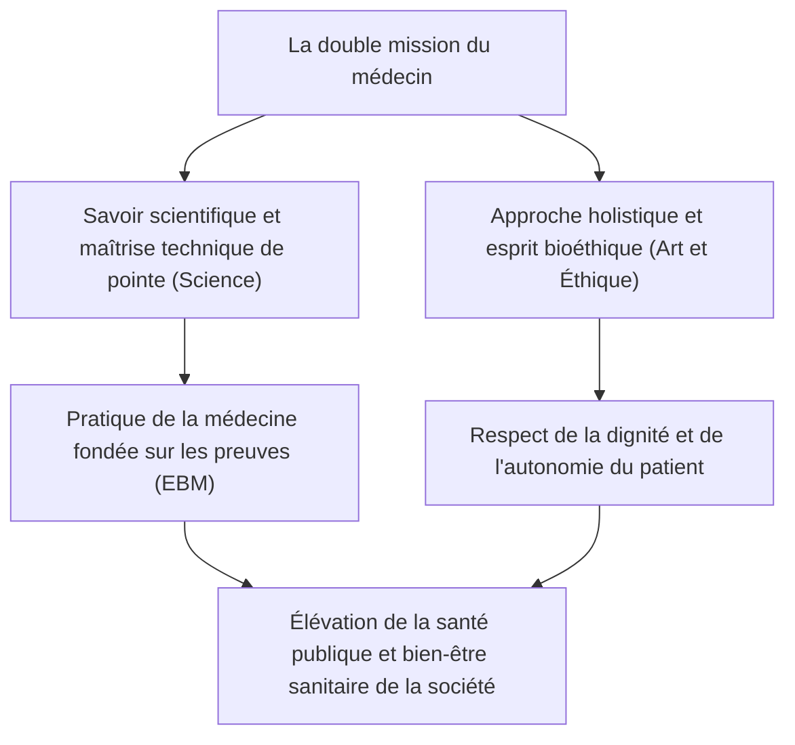
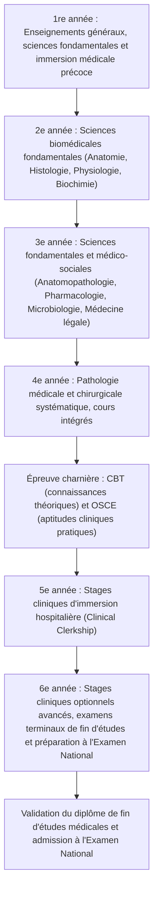
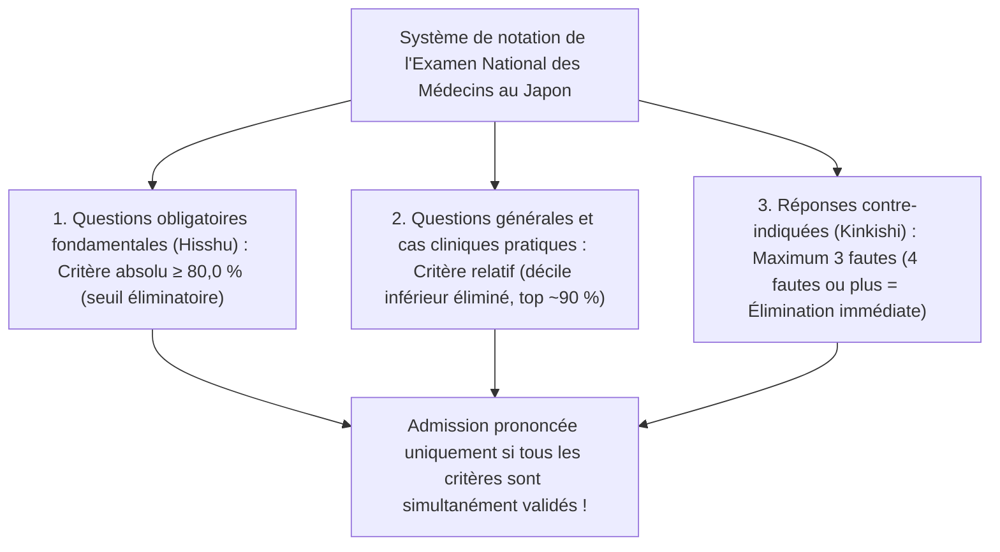
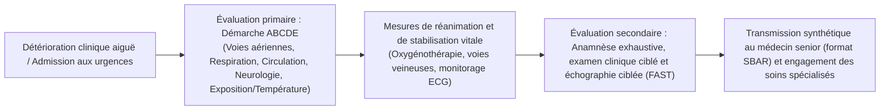
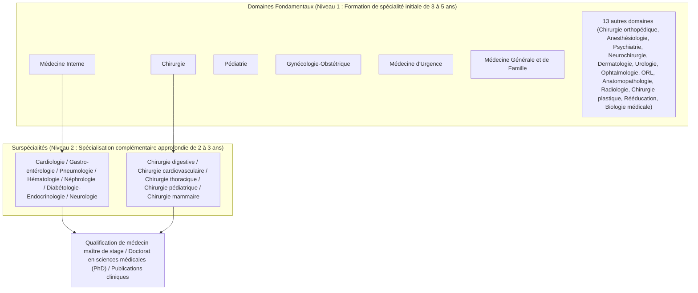
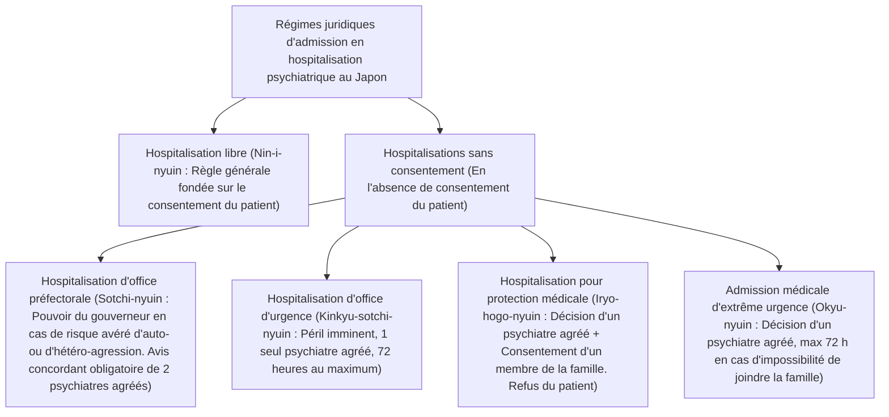
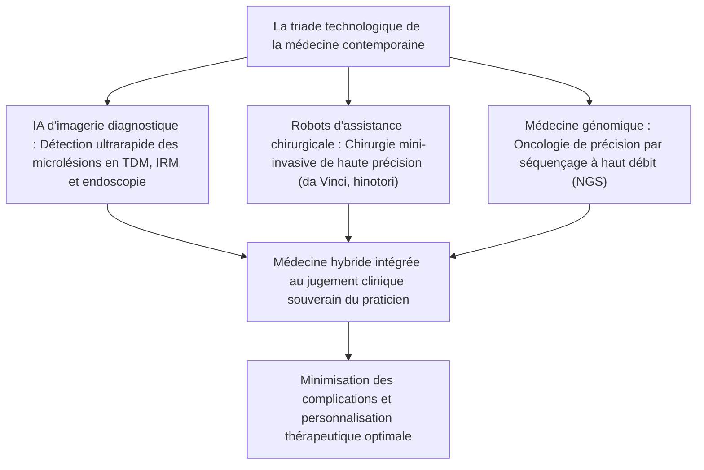

## 1. Introduction : À la croisée du sacerdoce de la vie humaine et de la science

### 1.1 L'essence de la fonction médicale : L'intégration de l'esprit de « l'Art de Guérir » et des sciences naturelles modernes

La profession de médecin a toujours été entourée d'une vénération et d'un respect particuliers tout au long de l'histoire de l'humanité. Depuis ses origines chamaniques et ses guérisseurs religieux archaïques, et à travers le développement spectaculaire des sciences naturelles modernes, le médecin d'aujourd'hui porte une double vocation : il est à la fois un « technocrate des sciences du vivant de haute volée » et une « présence éthique qui partage intimement la souffrance et la mort de ses semblables ».

L'être humain terrassé par la maladie et confronté à l'angoisse de la mort expose devant le médecin son corps et son esprit dans leur état le plus vulnérable et le plus sans défense. Lorsqu'un médecin manie le scalpel, prescrit des médicaments puissants et envahit irréversiblement l'intimité corporelle d'un patient, son acte relève juridiquement des éléments constitutifs de l'infraction pénale de coups et blessures volontaires. La raison fondamentale pour laquelle un tel geste est pleinement exonéré de responsabilité en tant qu'acte médical légitime (justifié par l'exercice d'une profession légitime au titre de l'article 35 du Code pénal japonais) et bénéficie de la plus haute estime de la société réside exclusivement dans le **pacte fiduciaire absolu conclu entre l'État, la société civile et le praticien : l'engagement solennel que le médecin acquiert un savoir et une technicité d'excellence et les voue avec une probité sans faille au sauvetage des vies et à la promotion de la santé**.

La mission du médecin ne se borne pas au simple traitement de l'anomalie biologique constitutive de la maladie (*Disease*). La quête de l'authentique « Art Médical » (*The Art of Medicine* ou *Idō*), qui guérit dans sa globalité holistique la personne humaine éprouvant le désarroi et la détresse subjective de l'état morbide (*Illness*), demeure la quintessence irremplaçable du médecin, un sanctuaire d'humanité qu'aucun progrès de l'intelligence artificielle ou de la robotique ne saurait supplanter.

---

### 1.2 Évolution historique du Serment d'Hippocrate, de la Déclaration de Genève et de la Déclaration de Lisbonne

Le point de départ originel de l'éthique médicale remonte au « Serment d'Hippocrate » (*Hippocratic Oath*), rédigé dans la Grèce antique par le père fondateur de la médecine, Hippocrate (vers 460 av. J.-C. – vers 370 av. J.-C.), et ses disciples :
- Prestation de serment sur les divinités guérisseuses Apollon et Asclépios.
- Détermination du régime de soins au bénéfice des malades selon sa compétence et son jugement, en écartant tout préjudice et toute injustice.
- Refus catégorique d'administrer un poison mortel même sur sollicitation expresse, et rejet de tout moyen abortif.
- Préservation de la pureté morale et de la piété tout au long de l'existence, en abandonnant la taille de la lithiase aux praticiens spécialisés.
- Engagement inviolable de garder le secret le plus absolu sur tout ce qui aura été vu ou entendu dans la vie intime des personnes au cours des soins (secret médical).

À l'époque contemporaine, tirant les leçons accablantes des expérimentations humaines barbares perpétrées sans consentement par les médecins sous le régime nazi en Allemagne (mises au jour lors du procès de Nuremberg), l'Association Médicale Mondiale (AMM / WMA) a adopté en 1948 la **« Déclaration de Genève »**, refondation moderne du serment hippocratique :
- « Je promets solennellement de consacrer ma vie au service de l'humanité ».
- « La santé de mon patient sera ma première préoccupation ».
- « Je ne permettrai pas que des considérations d'âge, de maladie ou d'infirmité, de croyance, d'origine ethnique, de sexe, de nationalité, d'affiliation politique, de race, d'orientation sexuelle, de statut social ou tout autre facteur s'interposent entre mon devoir et mon patient ».
- « Je n'utiliserai pas mes connaissances médicales pour enfreindre les droits humains et les libertés civiques, même sous la contrainte ».

En outre, en 1981, la proclamation de la **« Déclaration de Lisbonne de l'AMM sur les droits du patient »** a codifié les standards universels régissant le statut des malades, affirmant solennellement « le droit à des soins de qualité », « le droit d'accès aux informations figurant dans son dossier médical », « le droit à l'autodétermination après avoir reçu une information complète et loyale (Consentement Éclairé) », « le consentement par représentation pour le patient inconscient » et « le droit de mourir dans la dignité ». La transition historique du paternalisme médical d'autorité vers un partenariat thérapeutique respectueux et centré sur le patient s'est ainsi accomplie de manière irrévocable.

---

### 1.3 Le noble devoir inscrit à l'article 1 de la Loi sur les praticiens médicaux au Japon

Dans l'ordre juridique japonais, le texte fondamental régissant le statut, les obligations et l'exercice des médecins est la « Loi sur les praticiens médicaux » (Loi n° 201 de 1948 / Shōwa 23). En son article 1er, la mission assignée au médecin est énoncée en des termes empreints d'une remarquable solennité :

> **« Le médecin, par la dispensation des soins médicaux et de l’orientation sanitaire, contribue à l’amélioration et à la promotion de la santé publique, assurant ainsi une vie saine à l’ensemble des citoyens. »**

Cette disposition législative consacre avec éclat le fait que l'horizon professionnel du praticien ne se restreint pas à la prise en charge clinique individuelle du malade examiné en consultation (perspective micro), mais englobe obligatoirement la prophylaxie des maladies infectieuses, la salubrité environnementale, la médecine préventive et l'organisation des politiques sanitaires concourant à l'élévation de la santé publique globale (perspective macro). Le diplôme et l'autorisation d'exercer ne constituent nullement un privilège corporatiste conféré à un individu par l'État, mais la sanction formelle d'une lourde et imprescriptible charge d'intérêt général au service de la préservation de la vie humaine.

---

## 2. Le titanesque cursus de six années en faculté de médecine et ses épreuves éliminatoires

Le cheminement requis pour accéder au titre de médecin est d'une rigueur et d'une longueur exceptionnelles. Au Japon, l'obtention de la licence médicale exige la validation intégrale d'un cursus universitaire régulier de six ans au sein d'une faculté de médecine (ou d'une université médicale). L'organisation de ce programme est strictement normalisée par le Ministère de l'Éducation, de la Culture, des Sports, des Sciences et de la Technologie (MEXT) à travers le « Modèle de programme de formation médicale de base » (*Model Core Curriculum*).

---

### 2.1 Années 1 et 2 : Propédeutique, culture générale et l'aube des sciences biomédicales fondamentales

#### Éthique et portée clinique des travaux pratiques de dissection anatomique humaine
La première et la plus marquante des épreuves psychologiques qui attend l'étudiant en deuxième année réside dans les travaux pratiques d'« Anatomie humaine macroscopique » (*Gross Anatomy*). Durant plusieurs mois consécutifs, les carabins travaillent directement sur le corps sans vie de défunts qui, par une démarche altruiste sublime, ont fait don de leur dépouille à l'enseignement et à la recherche scientifique (*Kentai*).
- Imprégnés de l'odeur piquante du formol assurant la conservation des corps, les étudiants incisent la peau, résèquent avec minutie le tissu adipeux sous-cutané et dissèquent, isolent et nomment une à une les artères, les veines, les branches nerveuses, les aponévroses musculaires, les structures ostéoarticulaires et les viscères.
- Avant le tout premier coup de scalpel, l'ensemble des étudiants et des enseignants s'incline pour une minute de recueillement et de prière laïque en hommage à la volonté généreuse du donneur et à la douleur de sa famille.
- Cet enseignement n'a pas seulement pour vocation d'ancrer dans la mémoire sensorielle des étudiants l'agencement tridimensionnel complexe du corps humain ; il constitue un authentique rituel de passage au cours duquel le futur médecin touche de ses mains la réalité brute de la mort et prend la mesure de la responsabilité existentielle d'agir désormais sur la chair de ses semblables.

#### Physiologie, biochimie et histologie
- **Physiologie** : Analyse des mécanismes biophysiques et chimiques préservant l'homéostasie : genèse du potentiel d'action des myocytes cardiaques (pompe sodium-potassium, cinétique ionique de dépolarisation et de repolarisation), hémodynamique rénale, filtration glomérulaire et réabsorption tubulaire, régulation hormonale par rétrocontrôle neuroendocrinien.
- **Biochimie** : Mémorisation et assimilation approfondie des cascades métaboliques cellulaires : cycle de Krebs (cycle de l'acide tricarboxylique), phosphorylation oxydative de la chaîne respiratoire, néoglucogenèse, métabolisme des lipoprotéines, synthèse des protéines, réplication fidèle de l'ADN, transcription en ARN messager et traduction ribosomale.
- **Histologie** : Observation microscopique (optique et électronique) de l'architecture intime des quatre tissus fondamentaux (épithélial, conjonctif, musculaire, nerveux) ; réalisation de croquis morphologiques pour relier rigoureusement microstructure cellulaire et fonction physiologique.

---

### 2.2 Années 3 et 4 : Physiopathologie et enseignement systématique de la médecine clinique

Au cours des troisième et quatrième années, l'enseignement quitte le cadre exclusif des sciences fondamentales pour embrasser la « Médecine clinique », dédiée à l'apprentissage sémiologique, diagnostique et thérapeutique des affections relevant de chaque spécialité.

- **Anatomopathologie** : Décryptage des altérations cytologiques et tissulaires caractérisant les processus pathologiques (réactions inflammatoires, foyers nécrotiques, processus métaplasiques, dysplasies et critères de malignité néoplasique, grading histologique, voies de signalisation de l'apoptose).
- **Pharmacologie** : Liaison ligand-récepteur, pharmacocinétique fondamentale (Absorption, Distribution, Métabolisme, Élimination : ADME), mécanismes moléculaires des antimicrobiens et sélection des résistances bactériennes, pharmacologie cardiovasculaire (antihypertenseurs, diurétiques) et thérapies ciblées antitumorales.
- **Médecine interne systématique** : Cardiologie (syndromes coronariens aigus, infarctus du myocarde, arythmies complexes, décompensation cardiaque aiguë et chronique), Pneumologie (cancers bronchopulmonaires, BPCO, pneumopathies interstitielles diffuses), Gastro-entérologie et hépatologie (ulcère gastroduodénal, cirrhose hépatique, adénocarcinomes colorectaux), Néphrologie (syndrome néphrotique, glomérulonéphrites, insuffisance rénale chronique), Endocrinologie et métabolisme (diabète sucré, pathologies thyroïdiennes et surrénaliennes), Hématologie clinique (leucémies aiguës et chroniques, lymphomes malins, myélome), Neurologie, Rhumatologie et maladies auto-immunes systémiques.
- **Chirurgie générale et spécialisée** : Chirurgie digestive et viscérale, chirurgie cardiovasculaire, chirurgie thoracique, neurochirurgie, chirurgie orthopédique et traumatologie : indications opératoires, gestion périopératoire, réanimation per-opératoire et prise en charge des états de choc.
- **Pédiatrie, Gynécologie-Obstétrique et Psychiatrie** : Prise en charge néonatale des malformations congénitales, troubles du neurodéveloppement pédiatrique, suivi obstétrical des grossesses à haut risque, accouchement et prééclampsie, chimiothérapies psychotropes et approches psychothérapeutiques de la schizophrénie et des dépressions sévères.
- **Médecine sociale, Médecine légale et Santé publique** : Biostatistique épidémiologique, application de la Loi sur les maladies infectieuses, médecine du travail, toxicologie médico-légale, détermination de la cause de la mort et méthodologie comparée des autopsies médico-légales judiciaires et administratives.

---

### 2.3 Le premier grand filtre national : CBT et OSCE (Légalisation des Épreuves Communes)

À l'automne de la quatrième année, les étudiants en médecine doivent affronter les « Épreuves Communes » (*Kyōyō Shiken*), un examen standardisé à l'échelle nationale qui détermine l'aptitude légale de l'étudiant à pénétrer dans les services hospitaliers et à intervenir auprès des patients réels. À la suite d'une réforme de la Loi sur les praticiens médicaux entrée en vigueur en 2023 (Reiwa 5), ces épreuves ont été élevées au rang d'examens publics officiels sanctionnés par l'État.

1. **CBT (Computer Based Testing)** :
   - Épreuve informatisée sous forme de questionnaires à choix multiples comportant environ 320 questions de sciences biomédicales et cliniques.
   - Les questions sont extraites de manière pseudo-aléatoire d'un immense vivier calibré selon la théorie de réponse à l'item (TRI / *IRT*).
   - Couvrant l'ensemble des sciences fondamentales, cliniques et médico-sociales, cette épreuve élimine impitoyablement tout candidat qui n'atteint pas le seuil requis (situé généralement entre 65 % et 70 % de bonnes réponses pondérées), entraînant un redoublement immédiat.
2. **Pre-CC OSCE (Objective Structured Clinical Examination : Examen Clinique Objectif Structuré)** :
   - Épreuve pratique standardisée évaluant non seulement les connaissances, mais aussi la sémiologie clinique, l'aisance technique relationnelle et l'attitude éthique lors de l'interrogatoire et de l'examen physique.
   - L'étudiant progresse à travers plusieurs stations successives (entretien médical structuré, examen de la tête et du cou, examen pulmonaire et cardiovasculaire, palpation abdominale, examen neurologique complet, gestes de réanimation d'urgence) face à des patients simulés standardisés ou des mannequins haute-fidélité.
   - Des évaluateurs extérieurs mandatés notent minutieusement chaque étape à partir d'une grille standardisée : tenue vestimentaire, salutations, empathie, hygiène des mains, rigueur méthodologique des manœuvres de palpation et d'auscultation.

Seuls les candidats déclarés admis à ces deux épreuves reçoivent solennellement le titre officiel d'**« Étudiant-Médecin » (*Student Doctor*)**, leur ouvrant enfin les portes des services cliniques hospitaliers.

---

### 2.4 Années 5 et 6 : Les stages hospitaliers en immersion (Clinical Clerkship)

Dès le début de la cinquième année commence le « Stage clinique hospitalier en responsabilité » (*Clinical Clerkship*), au cours duquel les étudiants tournent toutes les une à deux semaines dans les différents services d'un centre hospitalier universitaire ou d'un grand hôpital régional agréé.
Loin de la simple observation passive d'autrefois, l'étudiant d'aujourd'hui est pleinement intégré à l'équipe soignante :
- Sous la supervision directe d'un praticien senior, il assure le suivi quotidien des patients hospitalisés qui lui sont confiés, relève les paramètres vitaux, rédige l'observation clinique de suivi (*Student Chart*), analyse les bilans biologiques et radiologiques et présente le dossier lors des staffs matinaux.
- Au bloc opératoire, il réalise le lavage chirurgical chirurgical réglementaire, enfile casaque et gants stériles et intervient en tant que deuxième ou troisième aide opératoire, tenant les écarteurs chirurgicaux, coupant les fils et maintenant le champ opératoire exposé.
- Il perfectionne l'exécution des gestes techniques fondamentaux sous tutorat constant : ponctions veineuses, pose de voies veineuses périphériques, sondages vésicaux, sutures cutanées et réfection de pansements.
- Enfin, en sixième année, chaque faculté organise ses redoutables « Examens de fin d'études » (*Sotsushi*). Afin de protéger leur taux de réussite à l'Examen d'État, certaines facultés appliquent un filtre d'une sévérité implacable, ajournant sans hésitation les étudiants dont les résultats semblent incertains ; seuls ceux qui franchissent cette dernière barrière obtiennent leur convocation officielle à l'Examen National des Médecins.

---

## 3. Structure de l'Examen National des Médecins et la frontière de l'admission

Placé sous la tutelle directe du Ministère de la Santé, du Travail et des Affaires sociales (MHLW), l'Examen National des Médecins est une épreuve d'État d'envergure nationale qui se déroule chaque année au début du mois de février sur deux journées consécutives.

### 3.1 Découpage des épreuves et référentiel d'évaluation

L'examen se compose de 400 questions au total, traitées sur grilles de lecture optique (incluant des résolutions de cas numériques et des sélections à choix multiples ou combinés).

| Bloc d'épreuve | Nombre de questions | Durée impartie | Nature et contenu de l'évaluation |
| :--- | :---: | :---: | :--- |
| **Bloc A** | 75 questions | 135 minutes | Pathologie spéciale et générale (cas pratiques et connaissances générales) |
| **Bloc B** | 50 questions | 80 minutes | **Questions obligatoires fondamentales (*Hisshū* - générales et cas cliniques)** |
| **Bloc C** | 75 questions | 135 minutes | Cas cliniques complexes et vignettes cliniques développées |
| **Bloc D** | 75 questions | 135 minutes | Sciences fondamentales intégrées, médecine sociale et santé publique |
| **Bloc E** | 50 questions | 80 minutes | **Questions obligatoires fondamentales (*Hisshū* - sécurité des soins et éthique)** |
| **Bloc F** | 75 questions | 135 minutes | Cas cliniques de synthèse diagnostique et thérapeutique |

---

### 3.2 Les 3 critères majeurs d'admission et l'angoisse du seuil de « 80 % obligatoire »

Pour être déclaré lauréat de l'Examen National des Médecins, **le candidat doit impérativement et simultanément satisfaire aux trois critères d'évaluation suivants**. La moindre défaillance sur l'un d'entre eux entraîne un ajournement immédiat.

1. **Le couperet absolu des questions obligatoires fondamentales (seuil de 80,0 %)** :
   - Le bloc des questions obligatoires (*Hisshū*, 100 questions notées sur un total de 200 points) impose **l'obtention incontournable d'au moins 80,0 % des points (soit 160 points)**, sans la moindre possibilité de compensation.
   - Même si un candidat réalise un score proche de la perfection dans l'ensemble des autres épreuves cliniques et générales, l'absence d'un seul point pour atteindre 160 points dans les questions obligatoires scelle son échec. C'est la raison pour laquelle les candidats noircissent les alvéoles de ces épreuves les mains tremblantes d'angoisse.
2. **Le critère normatif relatif des questions générales et cliniques** :
   - Les questions de connaissances générales et les cas cliniques font l'objet d'une évaluation normative relative. La note de passage est fixée chaque année de manière à éliminer les 10 % de candidats les moins bien classés à l'échelle nationale (seuil se situant généralement autour de 68 % à 72 % de réussite).
3. **Le piège fatal des options contre-indiquées (*Kinkishi* - Réponses léthales)** :
   - C'est l'élément le plus redouté de toute l'épreuve. Lorsqu'un futur médecin sélectionne une proposition caractérisée par la commission d'examen comme **« une erreur médicale majeure de nature à provoquer la mort immédiate du patient », « une violation flagrante des droits de l'homme » ou « une infraction manifeste à la loi »**, un point de contre-indication lui est infligé.
   - En règle générale, **l'accumulation de 4 fautes contre-indiquées (ou 3 selon les sessions d'examen) entraîne l'invalidation pure et simple et l'échec automatique du candidat**, quand bien même sa moyenne globale figurerait parmi les premières du pays.
   - (Exemples caractéristiques : administrer des anticoagulants ou des thrombolytiques à un patient suspect d'hémorragie cérébrale aiguë ; se contenter d'administrer des corticoïdes seuls sans adrénaline face à un choc anaphylactique ; prescrire un médicament formellement contre-indiqué au lieu de l'atropine lors d'une intoxication aux organophosphorés ; ou ordonner l'internement d'office d'un patient en psychiatrie sur la seule demande de sa famille sans respecter le cadre légal du consentement ou de l'urgence médicale).

---

## 4. L'épreuve de l'internat initial (2 ans) : Le système de la rotation polyvalente obligatoire

Réussir l'Examen National, être inscrit au registre de l'Ordre des médecins (*Iseki*) et recevoir son diplôme officiel d'État n'autorise pas encore légalement le praticien à exercer la médecine de manière autonome (article 16-2 de la Loi sur les praticiens médicaux). Tout jeune confrère a l'obligation légale d'accomplir un « internat clinique initial » (*Rinshō Kenshū*) de deux années complètes.

### 4.1 La révolution de la réforme de l'internat médical de 2004

Avant 2004 (Heisei 16), les jeunes diplômés rejoignaient immédiatement une chaire hospitalo-universitaire spécialisée (*Ikyoku* : Premier service de médecine interne, Deuxième service de chirurgie, etc.) et s'enfermaient dès le premier jour dans une hyperspécialisation étroite. Il en résultait une grave lacune : des cardiologues ou des hépatologues de renom étaient devenus incapables de diagnostiquer une fracture simple, de gérer un œil rouge ou de mener les gestes de réanimation d'urgence de base.

Pour briser ce cloisonnement délétère, le gouvernement a instauré le « Système de Super-Rotation » (*Super-Rotate*) :
- **Obligation de validation des compétences fondamentales généralistes** : Quelle que soit son orientation définitive future, tout interne doit obligatoirement effectuer des stages en médecine interne (au moins 6 mois), aux urgences (au moins 3 mois), en médecine communautaire rurale (au moins 1 mois), ainsi qu'en pédiatrie, gynécologie-obstétrique, psychiatrie et chirurgie générale, garantissant la maîtrise de la prise en charge médicale globale et des soins de premier recours.
- **Introduction de la procédure nationale d'appariement (*Matching*)** : L'affectation de l'interne n'est plus soumise au bon vouloir des chefs de service universitaires, mais résulte d'un classement informatisé croisant les vœux des étudiants et des établissements de formation via un algorithme mathématique automatisé (l'algorithme des mariages stables de Gale-Shapley).
- Par conséquent, les grands hôpitaux généraux publics ou de fondation réputés pour leur enseignement clinique intensif (tels que St. Luke's, Toranomon, Kurashiki Central ou Kameda) ont attiré l'élite des étudiants, provoquant l'effondrement des effectifs au sein des facultés de province et alimentant une pénurie médicale locale qui est devenue un enjeu de société majeur.

---

### 4.2 Le quotidien éprouvant de l'interne débutant (*Junior Resident*) et la conquête des gestes techniques

Les deux années d'internat initial représentent la période la plus dense, la plus épuisante et la plus fondatrice de toute la vie d'un médecin.

- **Les gardes aux urgences** : De l'afflux ininterrompu de malades consultants à pied jusqu'à l'admission de polytraumatisés en arrêt cardiorespiratoire (ACR). L'interne, épaulé par son senior urgentiste, met en œuvre en une fraction de seconde la **« démarche ABCDE »** (*Airway, Breathing, Circulation, Dysfunction of CNS, Exposure*) afin de trier et de neutraliser la défaillance vitale immédiate.
- **L'apprentissage des gestes techniques indispensables** :
  - Ponction de l'artère radiale pour analyse des gaz du sang.
  - Échographie clinique au lit du malade (protocole FAST pour le dépistage ultrarapide des épanchements péritonéaux ou péricardiques chez le traumatisé).
  - Cathétérisme veineux central (pose de VVC par ponction de la veine jugulaire interne sous guidage échographique).
  - Intubation orotrachéale (laryngoscopie directe ou vidéolaryngoscopie avec franchissement des cordes vocales et positionnement de la sonde).
  - Ponction lombaire diagnostique avec analyse biochimique et cytologique du LCR dans les suspicions de méningite.
  - Drainage thoracique sous aspiration et ponction d'ascite évacuatrice.
- **Le constat de décès et l'annonce aux familles** : L'instant solennel où le jeune médecin constate pour la première fois l'arrêt cardiaque définitif, note l'absence de réflexes photomoteurs avec mydriase bilatérale fixe, confirme le tracé plat à l'électrocardiogramme, rédige le certificat de décès et annonce le décès aux proches endeuillés. Une expérience humaine indélébile qui grave le sens de la responsabilité médicale au plus profond de l'être.

---

## 5. Le Nouveau Système de Spécialités Médicales : Les 19 filières de base et les surspécialités

À l'issue de ses deux années d'internat initial, le médecin devient « interne senior » (*Senkō-i*) et s'engage dans sa spécialité définitive. Mis en place à compter de 2018 (Heisei 30), le « Nouveau Régime des Spécialités Médicales » est administré et certifié selon des exigences uniformisées par l'Organisation Japonaise des Spécialités Médicales (*JBMBS / Nihon Senmon'i Kikō*), adoptant une architecture pyramidale à deux niveaux.

---

### 5.1 Architecture des 19 spécialités fondamentales de premier niveau

L'interne senior s'inscrit au sein de l'une des **19 filières fondamentales** suivantes pour y accomplir une formation spécialisée de 3 à 5 ans :

| Spécialité de base | Durée | Spécificités et contenu de la formation |
| :--- | :---: | :--- |
| **Médecine Interne** | 3 ans | Enregistrement d'une volumineuse casuistique clinique (via la plateforme officielle J-OSLER, exigeant la saisie de plusieurs centaines de dossiers et résumés d'observations médicales). Voie de passage obligatoire pour l'accès aux surspécialités médicales. |
| **Chirurgie** | 3 à 4 ans | Tronc commun chirurgical : viscéral, cardiovasculaire, thoracique et pédiatrique. Enregistrement obligatoire des interventions opérées en tant que premier opérateur dans la base de données nationale NCD (*National Clinical Database*). |
| **Pédiatrie** | 3 ans | Réanimation néonatale (réanimation et soins intensifs néonatals), urgences pédiatriques, maladies infectieuses, troubles du neurodéveloppement et allergologie. |
| **Gynécologie-Obstétrique** | 3 ans | Médecine périnatale (accouchements physiologiques, dystociques et césariennes d'urgence), oncologie gynécologique et chirurgie pelvienne, médecine de la reproduction et infertilité. |
| **Médecine d'Urgence** | 3 ans | Prise en charge des polytraumatisés graves, choc septique, intoxications aiguës, brûlés sévères, réanimation en service de soins intensifs (USI) et médecine préhospitalière (hélicoptères sanitaires *Doctor-Heli*). |
| **Médecine Générale / Famille** | 3 ans | Nouvelle filière spécialisée. Soins primaires de proximité, gestion transversale de la polymorbidité (*Multimorbidity*) et médecine de famille. |
| **Chirurgie Orthopédique** | 3 à 4 ans | Traumatologie osseuse et ostéosynthèse, arthroplasties prothétiques articulaires, chirurgie du rachis, médecine du sport et réadaptation locomotrice. |
| **Anesthésiologie** | 4 ans | Anesthésie générale, anesthésie locorégionale et périmédullaire, prise en charge de la douleur aiguë et chronique, soins critiques de réanimation et gestion des crises peropératoires. |
| **Psychiatrie** | 3 ans | Étroitement liée à l'obtention de l'agrément légal de « Médecin psychiatre désigné de santé mentale ». Traitement pharmacologique et psychothérapie des troubles schizophréniques, troubles bipolaires, épisodes dépressifs majeurs et démences. |
| **Neurochirurgie** | 4 ans | Clip de anévrismes intracrâniens, exérèse microchirurgicale des tumeurs cérébrales, neuroradiologie interventionnelle endovasculaire et traumatismes crâniens graves. |
| **Radiologie** | 3 ans | Radiodiagnostic et imagerie médicale de pointe (TDM multibarrette, IRM de haut champ, TEP-TDM), radiologie interventionnelle guidée par l'image (IVR) et radiothérapie oncologique. |
| **Anatomopathologie** | 3 ans | Examens extemporanés peropératoires, diagnostics histopathologiques sur biopsies, cytopathologie et autopsies anatomocliniques présentées lors des conférences clinico-pathologiques (CPC). |
| **7 autres filières** | 3 à 4 ans | Dermatologie, Urologie, Ophtalmologie, Oto-rhino-laryngologie (ORL), Chirurgie plastique et reconstructrice, Médecine physique et de réadaptation, Biologie médicale / Biochimie clinique. |

---

### 5.2 Approfondissement vers les surspécialités et obtention du Doctorat en sciences médicales (PhD)

Après avoir validé son diplôme de spécialiste fondamental (premier niveau), le praticien peut poursuivre sa qualification vers les « surspécialités avancées » (deuxième niveau) au terme de 2 à 3 années supplémentaires : rythmologie interventionnelle, gastro-entérologie et hépatologie interventionnelle, chirurgie cardiaque, oncologie médicale, etc.

Parallèlement, une part notable de médecins intègre l'école doctorale universitaire en sciences médicales (cursus doctoral de 4 ans). Ils mènent des recherches expérimentales au sein de laboratoires de sciences biomédicales fondamentales ou d'unités de recherche clinique translationnelle (biologie moléculaire, immunologie, génomique des cancers). Après avoir publié leurs travaux de recherche originaux en qualité de premier auteur dans des revues internationales de premier rang à comité de lecture (*Peer-Reviewed Journals*), ils soutiennent leur thèse et obtiennent le titre universitaire suprême de **« Docteur en sciences médicales » (PhD / *Igaku Hakase*)**. Alliant pratique clinique d'excellence et recherche académique, ils participent ainsi directement à la création des nouvelles connaissances médicales mondiales.

---

---

## 2.5 Physiopathologie clinique avancée et formulation mathématique de la pharmacocinétique/pharmacodynamie (Modèle PK/PD)

Dans l'apprentissage médical de haut niveau, le concept indispensable pour s'affranchir du simple apprentissage par cœur des maladies et développer un raisonnement thérapeutique rationnel assis sur la modélisation mathématique et la biologie quantitative est le **« modèle PK/PD (Pharmacocinétique / Pharmacodynamie) »**.

### Paramètres fondamentaux de la pharmacocinétique (PK)
- **Aire sous la courbe des concentrations plasmatiques en fonction du temps (AUC : *Area Under the Curve*)** : Indice reflétant l'exposition systémique totale de l'organisme à la molécule active.
- **Concentration plasmatique maximale ($C_{max}$)** : Pic sérique le plus élevé atteint après l'administration du produit.
- **Volume de distribution ($V_d$)** : Volume théorique dans lequel le médicament devrait être dissous pour être à la même concentration que dans le plasma, reflétant la propension de la molécule à diffuser dans les tissus cibles (lipophilie) ou à demeurer dans l'espace vasculaire (hydrophilie).

### Les 3 profils pharmacodynamiques prédictifs de l'efficacité des antibiotiques
Dans l'antibiothérapie des infections bactériennes, les principes actifs sont classés selon le paramètre pharmacologique corrélé de manière optimale à la bactéricidie et à la clairance bactérienne par rapport à la Concentration Minimale Inhibitrice (CMI ou MIC : *Minimum Inhibitory Concentration*) :

| Paramètre clé | Critère d'efficacité antibactérienne | Classes d'antibiotiques types | Stratégie posologique d'optimisation |
| :--- | :--- | :--- | :--- |
| **Temps au-dessus de la CMI ($T > MIC$)** | Pourcentage de temps pendant lequel la concentration plasmatique reste supérieure à la CMI au cours de l'intervalle d'administration (%) | **Pénicillines, céphalosporines, carbapénèmes** ($\beta$-lactamines) | Plutôt que d'administrer des doses unitaires massives, la priorité consiste à **multiplier les prises (fractionnement en 3 ou 4 injections quotidiennes)** ou à privilégier la perfusion intraveineuse prolongée ou continue pour maintenir en permanence la concentration au-dessus du seuil de la CMI. |
| **$C_{max} / MIC$** | Rapport entre le pic sérique maximal obtenu et la CMI | **Aminosides** (gentamicine, amikacine) | Il convient de proscrire le fractionnement journalier ; on privilégie **une dose quotidienne unique élevée** afin d'atteindre un pic très prononcé, maximisant ainsi la vitesse de bactéricidie concentration-dépendante et l'effet post-antibiotique (EPA), tout en réduisant significativement la néphrotoxicité et l'ototoxicité. |
| **$AUC / MIC$** | Ratio entre l'exposition systémique globale sur 24 heures et la CMI | **Fluoroquinolones, vancomycine** (glycopeptides) | L'objectif est de garantir une exposition totale journalière adéquate. Pour la vancomycine, un suivi thérapeutique pharmacologique (STP) régulier est obligatoire afin d'ajuster les concentrations résiduelles (*trough*) dans un intervalle cible strict de $15 \sim 20\,\mu\mathrm{g/mL}$. |

---

## 3.6 Les écueils majeurs de l'Examen National : Législation sanitaire et interprétation stricte de la Loi sur la santé mentale

La section qui suscite le plus d'appréhension chez les candidats à l'Examen National des Médecins est le bloc de « Santé publique et législation médicale ». Elle réclame une précision juridique et réglementaire rigoureuse, ne laissant aucune place à l'approximation.

### ① Typologie de la Loi sur les maladies infectieuses et obligation légale de déclaration médicale
La « Loi sur la prévention des maladies infectieuses et la prise en charge médicale des patients infectés » classe les agents pathogènes de la Catégorie 1 à la Catégorie 5, auxquelles s'ajoutent les infections désignées et les nouveaux virus pandémiques, en fonction de leur gravité clinique et de leur potentiel épidémique :

- **Maladies infectieuses de Catégorie 1 (Fièvre hémorragique Ébola, peste, maladie à virus Marburg, fièvre de Lassa, fièvre hémorragique de Crimée-Congo, variole, fièvres hémorragiques sud-américaines)** :
  - **Obligation de déclaration médicale immédiate (sans délai) au gouverneur de préfecture par l'intermédiaire du directeur du centre de santé publique (*Hokenjo*) compétent**.
  - Déclenchement de mesures coercitives d'autorité : hospitalisation d'isolement obligatoire en établissement de santé désigné de Catégorie 1 ou de niveau spécifique, restriction de la liberté de circulation dans un périmètre donné pour une durée maximale de 72 heures, et décontamination ou incinération des objets et locaux souillés.
- **Maladies infectieuses de Catégorie 2 (Tuberculose, SRAS, MERS, grippes aviaires hautement pathogènes H5N1 et H7N9, poliomyélite)** :
  - Déclaration immédiate obligatoire. Recommandation et arrêté d'hospitalisation d'office en établissement de Catégorie 2. Dans le cas de la tuberculose, prise en charge financière publique intégrale pour le traitement de l'infection tuberculeuse latente (ITBL).
- **Maladies infectieuses de Catégorie 3 (Choléra, dysenterie bacillaire, fièvre typhoïde, fièvre paratyphoïde, infections à *Escherichia coli* entérohémorragique sécréteur de shiga-toxines : STEC/EHEC O157, etc.)** :
  - Déclaration immédiate. Aucune mesure d'hospitalisation sous contrainte, mais interdiction légale stricte d'exercer toute activité professionnelle en contact avec les denrées alimentaires jusqu'à obtention de coprocultures attestant de la négativation bactériologique complète.
- **Maladies infectieuses de Catégorie 4 (Hépatite E, hépatite A, paludisme, rage, dengue, fièvre jaune, encéphalite japonaise, légionellose, tétanos, etc.)** :
  - Pathologies transmises par des vecteurs arthropodes, des réservoirs animaux ou la consommation d'eau et d'aliments. Déclaration immédiate obligatoire. En l'absence habituelle de transmission interhumaine directe par voie aérienne, aucune mesure d'isolement ou d'interdiction de travail n'est applicable.
- **Maladies infectieuses de Catégorie 5** :
  - **Soumises à déclaration exhaustive nominative (*Zen-sū*, sous 7 jours)** : Rougeole et rubéole (déclaration impérative et immédiate dans les 24 heures), syphilis, encéphalite aiguë, tétanos, méningococcies invasives, syndrome d'immunodéficience acquise (VIH/SIDA).
  - **Soumises à surveillance sentinelle (recueil statistique périodique hebdomadaire ou mensuel par les structures sentinelles agréées)** : Grippe saisonnière, syndrome pieds-mains-bouche, infections à virus respiratoire syncytial (VRS), gastro-entérites aiguës infectieuses, etc.

### ② Rigueur juridique des régimes d'hospitalisation selon la Loi sur la santé mentale et le bien-être psychiatrique
En psychiatrie, l'équilibre juridique délicat entre le respect du droit à l'autodétermination du patient et la prévention des risques graves de passage à l'acte auto- ou hétéro-agressif est strictement encadré par la « Loi sur la santé mentale et le bien-être des personnes atteintes de troubles mentaux ».

Dans l'Examen National, les questions abordent fréquemment l'ordre de priorité légale des ayants droit autorisés à consentir lors d'une « hospitalisation pour protection médicale » (conjoint, détenteurs de l'autorité parentale, débiteurs d'aliments, tuteur légal, et à défaut de tout proche, le maire de la commune de résidence), ainsi que la procédure d'« hospitalisation d'office préfectorale », depuis le signalement policier (art. 24) ou l'information par un citoyen (art. 22) jusqu'à la saisine du gouverneur. Toute erreur d'interprétation sur ces qualifications juridiques entraîne l'annulation du point.

---

## 4.5 L'épreuve de la garde aux urgences : L'algorithme des comas « AIUEO TIPS » et la prise en charge de l'abdomen aigu

Soudain, la sonnerie du bipeur ou du téléphone interne (PHS) de l'interne retentit : « Homme de 72 ans en coma inexpliqué, arrivée du SMUR annoncée dans 3 minutes ! ». À ce moment précis, l'algorithme diagnostique standardisé d'exploration des troubles de la conscience doit s'enclencher automatiquement dans l'esprit du médecin : **« AIUEO TIPS »**.

| Lettre | Entités étiologiques à évoquer | Prise en charge initiale prioritaire aux Urgences |
| :---: | :--- | :--- |
| **A** | **A**lcohol (intoxication alcoolique aiguë) / **A**cidosis (acidose métabolique ou respiratoire sévère) | Recherche de fétor alcoolique ; gazométrie artérielle immédiate avec dosage du pH, des lactates et calcul du trou anionique (*Anion Gap*). |
| **I** | **I**nsulin (hypoglycémie sévère / acidocétose diabétique : ACD / syndrome d'hyperglycémie hyperosmolaire : SHH) | **Mesure instantanée prioritaire de la glycémie capillaire au bout du doigt !** La neuroglucopénie prolongée provoque des lésions cérébrales irréversibles en quelques dizaines de minutes ; injecter d'emblée 40 à 50 mL de sérum glucosé à 50 % IV en cas d'hypoglycémie avérée. |
| **U** | **U**remia (encéphalopathie urémique sur insuffisance rénale aiguë ou chronique au stade terminal) | Bilan biochimique sanguin en urgence : urée, créatininémie, ionogramme et kaliémie. Évaluation de l'indication d'une hémodialyse d'urgence. |
| **E** | **E**ncephalopathy (encéphalopathie hépatique ou hypertensive) / **E**lectrolytes (troubles ioniques sévères, hyponatrémie) / **E**ndocrine (crise aiguë thyréotoxique, coma myxœdémateux, insuffisance surrénalienne aiguë) | Dosage de l'ammoniémie ; correction méthodique et très prudente de la natrémie (pour écarter le risque mortel de myélinolyse centro-pontine / syndrome de démyélinisation osmotique lors de la remontée trop rapide du sodium). |
| **O** | **O**xygen (hypoxémie profonde, détresse respiratoire aiguë) / **O**verdose (intoxication médicamenteuse polymédicamenteuse) / **O**piates (overdose d'opiacés) | Oxymétrie de pouls continue et gaz du sang. Face à la triade associant myosis serré punctiforme, bradypnée et coma, administrer sans délai de la naloxone IV (antidote compétitif spécifique). |
| **T** | **T**rauma (traumatisme crânien, hématome intracrânien) / **T**emperature (hypothermie accidentelle sévère, coup de chaleur malin) | TDM cérébrale sans injection en urgence pour éliminer un hématome sous-dural ou extradural aigu ; mesure de la température centrale par sonde rectale. |
| **I** | **I**nfection (infections neuroméningées : méningite bactérienne, encéphalite herpétique, sepsis sévère avec défaillance multiviscérale) | Examen des signes d'irritation méningée : raideur de nuque, signe de Kernig, signe de Brudzinski et manœuvre de secousse céphalique axiale (*Jolt accentuation*). Réaliser deux hémocultures et instaurer immédiatement l'antibiothérapie probabiliste d'urgence (ceftriaxone + vancomycine + ampicilline $\pm$ aciclovir) avant ou sans attendre la ponction lombaire. |
| **P** | **P**sychiatric (troubles conversifs, stupeur dissociative ou catatonique) / **P**orphyria (porphyrie aiguë intermittente) | Diagnostic d'élimination formelle ; ne jamais retenir une origine psychiatrique sans avoir écarté méthodiquement toute cause organique sous-jacente. |
| **S** | **S**troke (accident vasculaire cérébral : ischémie cérébrale aiguë, hématome intraparenchymateux, hémorragie méningée) / **S**eizure (état de mal épileptique non convulsif) / **S**hock (choc cardiogénique, hypovolémique, obstructif ou distributif) | Bilan neurologique focalisé, IRM cérébrale avec séquences de diffusion (DWI) ou TDM cérébrale immédiate. Évaluation de l'éligibilité à la thrombolyse intraveineuse par rt-PA (délai de 4,5 heures après le début des symptômes) ou à la thrombectomie mécanique endovasculaire. |

Face à un coma inexpliqué, l'automatisme consistant à déclarer « emmenons-le immédiatement au scanner » constitue la faute de débutant la plus périlleuse. Déplacer en salle de radiologie un patient dont l'hypoglycémie ou l'hypoxie sévère n'a pas été dépistée expose à un arrêt cardiaque en cours de transfert. Le principe absolu de la médecine d'urgence s'impose à tout praticien : **« Constantes vitales d'abord, glycémie capillaire instantanée, stabilisation de la séquence ABCDE avant toute démarche radiologique ! »**.

---

## 5.5 Parcours professionnels, réalités financières méconnues et impératif de formation continue

### Disparités structurelles entre médecins hospitaliers et praticiens libéraux de clinique privée
Dans l'opinion publique prévaut souvent l'image d'Épinal selon laquelle « tout médecin bénéficie automatiquement d'un train de vie opulent ». En réalité, les conditions économiques de la profession sont marquées par une stratification étroite en fonction du mode d'exercice et de l'ancienneté.

1. **La précarité économique relative des praticiens hospitalo-universitaires** :
   - Le traitement brut annuel moyen d'un interne débutant s'établit entre 3,5 et 4,5 millions de yens.
   - Lors du passage au statut d'interne senior (*Senkō-i*) rattaché à une chaire hospitalo-universitaire, le traitement de base mensuel ne dépasse fréquemment pas 200 000 à 300 000 yens. Écrasé par les astreintes hospitalières, la préparation des communications orales en congrès et la rédaction d'articles originaux, le jeune médecin doit effectuer une à deux gardes extérieures complémentaires par semaine (*Arubaito*, rétribuées entre 40 000 et 80 000 yens par garde de nuit dans des établissements de soins de suite ou d'urgence de périphérie) pour subvenir à ses besoins élémentaires.
   - Même après avoir soutenu sa thèse de doctorat (PhD) vers l'âge de 35 ans et accédé aux fonctions de chef de clinique assistant ou de maître de conférences (*Jokyō* / *Kōshi*), la rémunération versée par le CHU plafonne souvent entre 6 et 8 millions de yens annuels.
2. **Médecins spécialistes des hôpitaux régionaux ou mutualistes (*Kin'mui*)** :
   - Entre 35 et 50 ans, occupant des responsabilités de praticien hospitalier titulaire ou de chef de pôle au sein d'établissements généraux régionaux, le niveau de revenu annuel s'échelonne couramment entre 12 et 18 millions de yens. Toutefois, ces émoluments s'accompagnent d'un régime d'astreintes à domicile très contraignant, de rappels nocturnes inopinés et de gardes sur place le week-end.
3. **Médecins libéraux créateurs de cabinet ou de clinique privée (*Kaigyōi*)** :
   - Les praticiens qui, passée la quarantaine, contractent des emprunts bancaires de grande envergure (engageant des investissements initiaux de dizaines à centaines de millions de yens) pour ouvrir leur propre centre de consultations peuvent, une fois l'établissement consolidé, dégager des revenus annuels de 25 à plus de 40 millions de yens. Néanmoins, ils doivent cumuler leur exercice de clinicien avec la charge intégrale d'un chef d'entreprise : gestion des ressources humaines, négociation avec les caisses d'assurance, amortissement des investissements d'imagerie lourde et risque financier personnel indéfini sur leur patrimoine propre.

### Le contentieux médico-légal et l'assurance responsabilité civile professionnelle (RCP)
Le médecin moderne exerce son art avec la conscience permanente du risque dévastateur des procès en responsabilité civile médicale pour faute ou négligence (*Medical Malpractice*).
- Anoxie périnatale sévère lors du travail obstétrical compliquée d'infirmité motrice cérébrale (qui, bien que prise en charge pour partie par le fonds d'indemnisation obstétricale, se traduit en justice par des condamnations indemnitaires civiles s'élevant couramment entre 100 et 200 millions de yens).
- Embolie pulmonaire postopératoire foudroyante, retard au diagnostic ou à la déclaration de toxicité sévère d'une chimiothérapie, lésion passée inaperçue sur un examen radiologique.
- La souscription d'une assurance de responsabilité civile médicale (*Ibai-seki*), souscrite par le biais de l'Ordre des médecins du Japon ou des sociétés savantes spécialisées, constitue un bouclier absolument vital pour la pérennité de l'exercice clinique de tout praticien.

---

## 6. Fondements légaux, obligations réglementaires et bioéthique clinique

L'exercice quotidien de la médecine s'inscrit au cœur d'un maillage juridique d'une grande rigueur. L'ignorance ou la transgression de ces règles expose le praticien à des sanctions disciplinaires telles que la suspension temporaire d'exercice ou la radiation définitive de l'Ordre (sanctions administratives prévues à l'article 7 de la Loi sur les praticiens médicaux), sans préjudice de poursuites pénales et de condamnations pécuniaires civiles considérables.

### 6.1 Analyse juridique des articles pivots de la Loi sur les praticiens médicaux

#### ① L'obligation de prêter son ministère / obligation de soins (Article 19, alinéa 1er de la Loi)
> « Tout médecin exerçant la profession médicale ne peut refuser d'accorder ses soins ou son diagnostic lorsqu'il en est requis par un malade, sauf juste motif. »

Selon la doctrine classique, cette disposition interdisait au médecin de refuser la prise en charge d'un patient en toute circonstance. Toutefois, une directive ministérielle fondamentale publiée en 2019 (Reiwa 1) par le MHLW est venue fixer les critères d'appréciation moderne du « juste motif » :
- Durant les heures régulières d'ouverture, même en cas d'absence du médecin ou de pathologie sortant de sa spécialité, persiste l'obligation incontournable d'assurer les gestes de premiers secours et de réorientation médicale sécurisée du patient vers un établissement adapté.
- En revanche, en dehors des horaires réguliers de consultation, si l'établissement n'est pas désigné de garde ou d'urgence, ou si le patient adopte un comportement insultant, violent, un état d'ébriété hostile, des impayés d'honoraires frauduleux et récurrents, ou encore si l'épuisement physique ou la maladie du praticien compromet la sécurité de l'acte médical, le refus de prise en charge est légalement justifié, garantissant l'équilibre entre l'accès aux soins et la santé au travail du médecin.

#### ② L'interdiction de prescription sans examen préalable (Article 20 de la Loi)
> « Aucun médecin ne peut prescrire de traitement ou délivrer d'ordonnance sans avoir personnellement examiné le patient, ni délivrer de certificat de naissance ou de mortinaissance sans avoir assisté à l'accouchement. »

La prescription d'un traitement sans rencontre clinique directe et examen préalable est rigoureusement interdite par la loi. La « télémédecine et téléconsultation », qui s'est considérablement développée ces dernières années, ne s'exerce de façon licite qu'à titre d'exception rigoureusement encadrée par les « Directives ministérielles relatives aux bonnes pratiques de la téléconsultation », limitées à des pathologies stables et selon des protocoles préalablement définis.

#### ③ L'obligation de déclaration des décès suspects ou anormaux (Article 21 de la Loi)
> « Le médecin qui, lors de l'examen d'un cadavre ou d'un fœtus mort-né d'au moins quatre mois de grossesse, constate une anomalie ou un caractère non naturel, est tenu d'en faire la déclaration au commissariat de police compétent dans un délai de vingt-quatre heures. »

La question de savoir si les décès survenus au décours d'accidents médicaux nosocomiaux relèvent de la notion légale de « décès anormaux » (*Ijō-shi*) a suscité d'intenses débats juridiques, tranchés par la Cour suprême du Japon dans les affaires emblématiques du CHU Féminin de Tokyo et de l'Hôpital Métropolitain de Hiroo. La jurisprudence retient désormais que « même lorsqu'il s'agit d'un décès survenu en cours de soins, dès lors que l'examen externe du corps présente des indices suspects, des traces d'agression ou une présomption d'erreur fautive, le médecin a le devoir impératif d'avertir la police » ; des praticiens ayant tenté de dissimuler des fautes médicales ont été pénalement condamnés pour violation de cette obligation légale.

---

### 6.2 Le Consentement Éclairé et la théorie jurisprudentielle de la responsabilité médicale

Dans les actions en responsabilité civile engagées par les patients (fondées sur la responsabilité contractuelle ou délictuelle), les deux piliers majeurs de l'évaluation judiciaire sont le manquement à l'obligation de soins attentifs et la violation de l'obligation d'information.

- **Le standard de soins requis (*Standard of Care* / *Iryō-suijun*)** : Le niveau de diligence attendu du médecin ne s'évalue pas par rapport à un idéal d'infaillibilité abstraite ni selon les compétences personnelles du praticien en cause, mais par rapport à la lex artis : « la compétence moyenne, prudente et consciencieuse que tout praticien de la même spécialité aurait dû manifester au regard de l'état des connaissances médicales acquises au moment précis des faits », en tenant compte de la nature de la structure de soins.
- **Le Consentement Éclairé (*Informed Consent*)** : Le médecin est tenu d'expliquer en des termes clairs, loyaux et accessibles : 1) le diagnostic précis et le degré d'évolution de l'affection ; 2) la démarche thérapeutique ou chirurgicale préconisée ; 3) les risques inhérents, complications redoutées et effets indésirables potentiels ainsi que leur fréquence estimée ; 4) les thérapeutiques alternatives envisageables avec leurs avantages et inconvénients comparés ; et 5) le pronostic spontané en cas de refus d'intervention. Une fois ces informations délivrées, le consentement libre et éclairé du patient doit être recueilli. Si un chirurgien omet d'informer son patient d'un risque opératoire sérieux et que cette complication se réalise, quand bien même l'intervention chirurgicale aurait été exécutée de manière exemplaire sans la moindre faute technique, le tribunal condamnera le praticien pour « atteinte illicite au droit à l'autodétermination du patient » au versement de dommages et intérêts substantiels en réparation du préjudice moral.

---

---

## 6.5 La prise de décision en phase terminale (ACP) et le protocole légal de constat de mort encéphalique

Les dilemmes éthiques les plus lourds qu'affronte le praticien tout au long de sa carrière concernent la limitation ou l'arrêt des thérapeutiques actives (LATA) chez le patient en phase terminale de la vie et le constat médicolégal de la « mort encéphalique ».

### ① Directrices sur le processus de prise de décision relatif aux soins en fin de vie
Conformément aux recommandations nationales publiées par le Ministère de la Santé, du Travail et des Affaires sociales, la démarche clinique actuelle est articulée autour du concept d'**« ACP (Advance Care Planning : Planification Anticipée des Soins, désignée sous l'appellation officielle de *Jinsei Kaigi* ou "Rencontre de vie") »**.
- La pratique d'autrefois où le médecin décidait de manière solitaire et autoritaire de la mise en œuvre ou de l'arrêt des techniques invasives de maintien artificiel des fonctions vitales (ventilation mécanique, vasopresseurs à doses maximales, réanimation cardio-pulmonaire) est aujourd'hui formellement proscrite.
- Lorsque le patient est en mesure d'exprimer sa volonté : Une concertation approfondie et répétée est menée entre le malade, ses proches et l'équipe soignante interdisciplinaire, sa volonté autonome devant être souverainement respectée. Comme les souhaits du patient peuvent évoluer avec la progression de la maladie, ce dialogue doit être réitéré régulièrement.
- Lorsque le patient n'est plus capable de manifester sa volonté : S'il existe des directives anticipées rédigées ou si la famille peut attester fidèlement de ce qu'auraient été ses souhaits présumés, cette volonté présumée prévaut. En l'absence d'éléments tangibles, l'équipe interdisciplinaire et les proches recherchent collégialement ce qui correspond au meilleur intérêt du malade.
- **Conditions d'exonération de la responsabilité pénale lors de la limitation des traitements actifs** : Pour que l'arrêt de thérapeutiques invasives de suppléance vitale ne soit pas qualifié d'homicide (art. 199 du Code pénal), la jurisprudence japonaise (notamment issue des jugements des affaires du Kawasaki Kyōdō Hospital et de l'Hôpital Municipal d'Imizu) exige la réunion impérative de quatre critères : 1) le caractère terminal et médicalement irréversible de l'état du patient, rendant l'issue fatale inéluctable à très court terme ; 2) la démonstration de la volonté de refus du patient ou de ses volontés présumées attestées ; 3) l'instauration optimale de soins palliatifs visant à soulager toute douleur et toute détresse physique ou psychique ; et 4) le respect rigoureux d'une procédure décisionnelle collégiale multidisciplinaire.

### ② Les 6 critères médicolégaux absolus de diagnostic de mort encéphalique selon la Loi sur les greffes d'organes
Au sens de la « Loi sur la transplantation d'organes » du Japon, à la différence du décès classique par arrêt cardiocirculatoire, la « mort encéphalique » (*Brain Death*) n'est reconnue comme la mort légale de la personne humaine que sous la condition préalable expresse d'un don d'organes à visée thérapeutique. Le diagnostic doit obéir à un protocole standardisé d'une extrême rigueur scientifique, réitéré à deux reprises de manière strictement indépendante :

1. **Coma aréactif profond (Score de 300 sur la *Japan Coma Scale* / Score de 3 sur la *Glasgow Coma Scale*)** : Absence absolue de toute réaction consciente, motrice ou verbale en réponse à n'importe quel stimulus exogène physique ou douloureux.
2. **Mydriase bilatérale fixe et aréactive** : Pupilles dilatées avec un diamètre supérieur ou égal à $4\,\mathrm{mm}$, associées à l'abolition bilatérale et complète des réflexes photomoteurs direct et consensuel.
3. **Abolition intégrale des 7 réflexes du tronc cérébral** :
   - Réflexe photomoteur.
   - Réflexe cornéen (absence de clignement à l'effleurement de la cornée à l'aide d'une compresse stérile).
   - Réflexe ciliospinal (absence de dilatation pupillaire lors de la stimulation algique de la peau cervicale).
   - Réflexe oculo-céphalique (perte du phénomène des « yeux de poupée » : lors des rotations passives rapides de la tête sur le plan horizontal ou vertical, les globes oculaires restent immobiles par rapport à l'orbite).
   - Réflexe oculo-vestibulaire (absence de nystagmus et de déviation conjuguée des yeux après instillation d'eau glacée dans le conduit auditif externe lors de l'épreuve calorique).
   - Réflexe pharyngé / nauséeux (absence de contraction pharyngée à la stimulation de la paroi postérieure du pharynx).
   - Réflexe tussigène / trachéal (absence d'effort de toux lors de l'aspiration bronchique profonde au niveau de l'éperon trachéal).
4. **Tracé d'électroencéphalogramme isoélectrique (silence bioélectrique cérébral / *Flat EEG*)** : Sur un enregistrement EEG multicanal conforme au système international 10-20, confirmation de l'absence totale d'activité électrique cérébrale (tracé plat) à la sensibilité d'enregistrement maximale de $2\,\mu\mathrm{V/mm}$, maintenu sans interruption pendant une durée minimale de 30 minutes.
5. **Abolition définitive de la ventilation spontanée (Épreuve d'apnée)** : Déconnexion temporaire du respirateur mécanique sous oxygénation trachéale continue à 100 % d'oxygène ($100\%\,\mathrm{O}_2$), vérifiant l'absence totale de tout mouvement respiratoire spontané tandis que l'on confirme par gazométrie artérielle que la pression partielle de dioxyde de carbone ($PaCO_2$) s'élève jusqu'à atteindre ou dépasser le seuil critique de $60\,\mathrm{mmHg}$.
6. **Délai d'observation obligatoire entre les épreuves** : Une fois les cinq critères ci-dessus intégralement constatés, une période d'attente minimale de **6 heures consécutives au moins** (délai porté à 24 heures chez l'enfant de moins de 6 ans) doit être respectée, à l'issue de laquelle l'ensemble de la batterie d'examens est intégralement répété pour prouver le caractère irréversible de la destruction cérébrale.

L'heure et la minute de validation de la seconde série d'examens concordants marquent juridiquement « l'heure officielle du décès » du patient. Le médecin qui accomplit ce constat affronte personnellement le point culminant de la certitude scientifique et de la révérence sacrée due à l'existence humaine.

---

## 7. Formation continue et enjeux contemporains : La réforme du temps de travail des praticiens et l'avenir de la médecine à l'ère de l'IA

### 7.1 L'onde de choc de la « Réforme du régime de travail des médecins » (entrée en vigueur en avril 2024)

Pendant des décennies, l'excellence de l'accès aux soins et la longévité record de la société japonaise ont reposé sur le dévouement sacerdotal et les sacrifices personnels immenses des soignants, soumis à des heures supplémentaires astronomiques (dépassant couramment 100 à 200 heures par mois entre gardes sur place et astreintes).

Afin d'enrayer les décès par épuisement au travail (*Karōshi*) et d'humaniser les conditions d'exercice, un plafonnement légal des heures de travail supplémentaires des médecins a été promulgué en avril 2024 (Reiwa 6) :

| Régime de classement | Établissements et médecins ciblés | Plafond annuel d'heures supplémentaires | Limite mensuelle et caractéristiques |
| :--- :---: | :--- | :---: | :--- |
| **Niveau A** | Médecins hospitaliers ordinaires (majorité des hôpitaux) | **960 heures** (moyenne mensuelle de 80 heures max.) | Encadrement strict sous le seuil d'alerte du risque de mort par surmenage (*Karōshi*). |
| **Niveau B** | Dérogation transitoire pour les hôpitaux de premier recours régional (urgences vitales) | **1 860 heures** (plafond de 155 heures par mois) | Mesure de transition territoriale nécessitant un arrêté d'agrément de la préfecture. |
| **Niveau C** | Médecins en formation pratique intensive (internes débutants, internes *Senkō-i*, etc.) | **1 860 heures** (plafond de 155 heures par mois) | Régime dérogatoire destiné à préserver l'apprentissage d'un volume suffisant d'actes cliniques. |

Si cette réforme historique marque une avancée indéniable pour la protection de la santé des médecins et le respect d'intervalles de repos minimaux après les gardes de nuit, elle suscite de graves tensions opérationnelles : retrait des praticiens envoyés en renfort dans les hôpitaux ruraux isolés, fermetures de lits d'urgence dans les centres hospitaliers et réduction du temps effectif de formation technique au bloc opératoire pour les jeunes chirurgiens.

---

### 7.2 Transformation numérique (DX), IA d'imagerie diagnostique et chirurgie robotique assistée

En ce premier quart du XXIe siècle, l'alliance de la médecine et des technologies de rupture redessine de fond en comble la pratique des soins.

- **L'Intelligence Artificielle en imagerie médicale** : Les réseaux neuronaux d'apprentissage profond (*Deep Learning*) conçus pour détecter les micronodules pulmonaires suspects, les polypes colorectaux infracentimétriques au cours de la coloscopie ou les rétinopathies diabétiques précoces fonctionnent désormais comme le « troisième œil » vigilant et infatigable du radiologue et de l'endoscopiste.
- **Les robots d'assistance chirurgicale** : Le système « da Vinci » (*da Vinci Surgical System*) et son homologue japonais « hinotori » éliminent totalement les microtremblements de la main humaine, offrant des instruments articulés dont l'amplitude de mouvement dépasse celle du poignet humain, guidés sous une vision 3D stéréoscopique haute définition agrandie. Ils ont révolutionné la prostatectomie totale et les résections complexes de cancers gastriques et colorectaux, réduisant les saignements opératoires à un niveau minime.
- **La médecine de précision (*Precision Medicine*)** : Grâce aux tests génomiques tumoraux complets par séquençage à haut débit (NGS), l'analyse simultanée de centaines d'altérations géniques permet d'orienter le choix vers des thérapies ciblées sur mesure ou des immunothérapies par inhibiteurs de points de contrôle immunitaire adaptées à la signature moléculaire spécifique de chaque tumeur.

Cependant, quel que soit le degré de sophistication de ces outils technologiques, des dimensions essentielles demeureront à jamais hors de portée des algorithmes : **« l'arbitrage thérapeutique final partagé avec le malade », « la communication délicate de l'annonce d'une maladie incurable et d'un pronostic fatal », « le discernement bioéthique face aux dilemmes de l'obstination déraisonnable » et « l'accompagnement empreint d'empathie lors du travail de deuil des familles (*Grief Care*) »**. Ces actes exigent irremplaçablement la présence incarnée, la parole chaleureuse, l'écoute et l'humanité sensible d'un médecin fait de chair et de cœur.

---

## 8. Conclusion : L'essence de la médecine holistique qui soigne la personne malade et non seulement la maladie

L'engagement dans la vocation médicale est une aventure perpétuelle d'exigence intellectuelle et de perfectionnement moral qui ne s'interrompt jamais. Elle débute par l'effort intense de préparation aux concours de la faculté, se poursuit au cours de l'épreuve de l'Examen d'État, traverse l'austère apprentissage de l'internat, s'épanouit dans la conquête des titres de spécialité et impose la lecture quotidienne des publications scientifiques internationales au fil d'une formation médicale continue.

L'illustre figure de proue de la médecine moderne, Sir William Osler (1849–1919), a laissé à la postérité des générations de soignants cette sentence universelle :

> **« Le bon médecin traite la maladie ; le grand médecin traite le patient qui a la maladie » (*The good physician treats the disease; the great physician treats the patient who has the disease*).**

Avoir l'esprit empli de l'immense somme des connaissances biomédicales objectives — les méandres des voies biochimiques du métabolisme, les formules quantitatives de la physiologie d'organe, la pharmacodynamie moléculaire, la topographie minutieuse des aponévroses et des gaines vasculo-nerveuses, ainsi que les prescriptions du droit sanitaire protégeant le malade — et pourtant, au moment où la porte du cabinet s'ouvre pour laisser entrer un être humain terrifié et souffrant, savoir lui offrir un regard empreint de bienveillance, un geste d'attention et des paroles sincères de réconfort.

Unir dans une même âme la rigueur intellectuelle la plus pénétrante du scientifique d'élite et la compassion la plus humble et la plus chaleureuse envers la fragilité humaine. Réaliser cette harmonie au quotidien et se consacrer jusqu'au bout du chemin à la protection de la santé et de la vie de ses semblables : tel est l'incomparable accomplissement et la grandeur véritable de la vocation de « médecin ».
