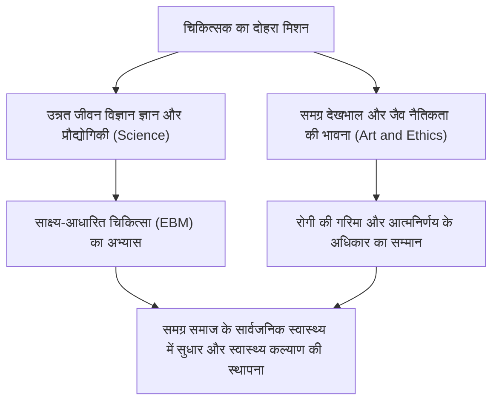
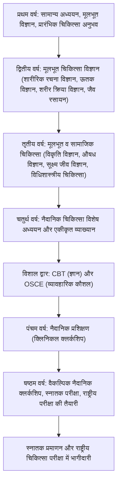
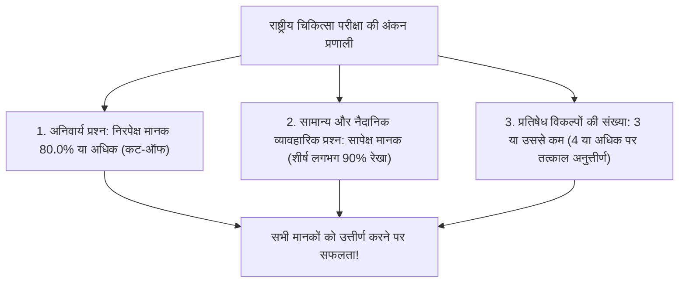
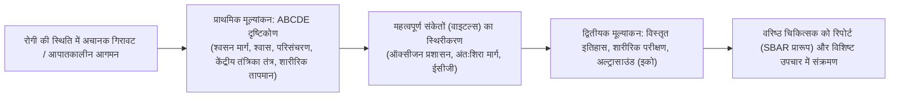
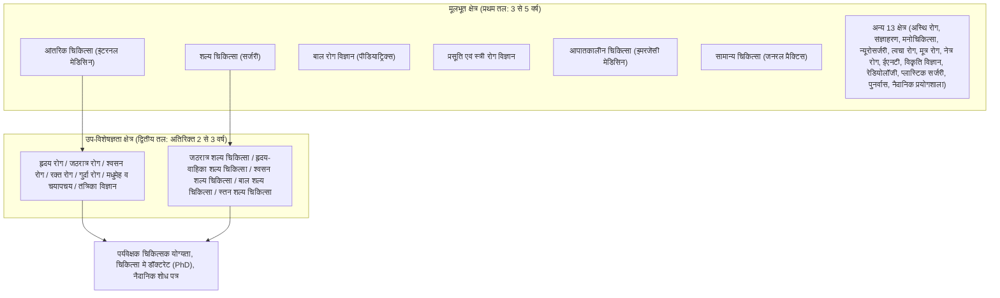
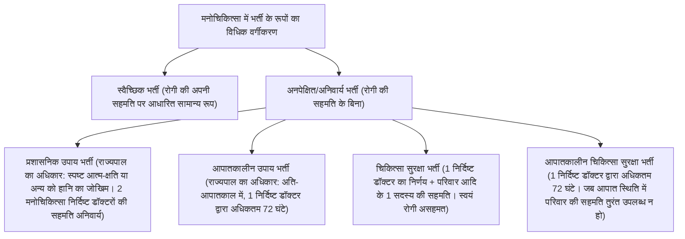
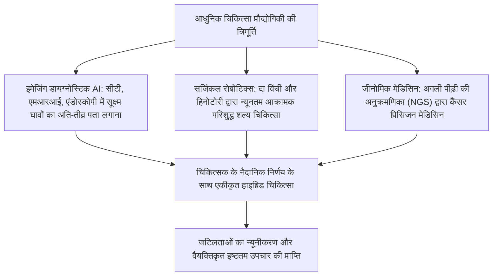

## 1. प्रस्तावना: मानव जीवन की रक्षा करने वाले पुनीत कार्य और विज्ञान का संगम

### 1.1 चिकित्सक के कर्तव्य का सार: "चिकित्सा धर्म (आर्ट ऑफ मेडिसिन)" की भावना और आधुनिक प्राकृतिक विज्ञान का एकीकरण

मानव इतिहास में चिकित्सक के पेशे को सदैव एक विशेष श्रद्धा और विस्मय के साथ देखा गया है। प्राचीन काल के तांत्रिकों और धार्मिक उपचारकों से आरंभ होकर, आधुनिक प्राकृतिक विज्ञान के अभूतपूर्व विकास के माध्यम से, आज का चिकित्सक एक ओर जहां "उन्नत जीवन विज्ञान का टेक्नोक्रेट" है, वहीं दूसरी ओर वह "दूसरों के कष्टों और मृत्यु के समीप रहने वाला एक नैतिक अस्तित्व" भी है—वह इन दोहरे दायित्वों का निर्वहन करता है।

रोगग्रस्त होकर मृत्यु के भय का सामना करने वाला मनुष्य अपने सबसे दुर्बल, असहाय शरीर और मन को चिकित्सक के सम्मुख समर्पित कर देता है। जब एक चिकित्सक शल्य-क्रिया की छुरी (स्कैल्पल) उठाता है, तीक्ष्ण औषधियां देता है, और रोगी के आंतरिक शरीर में अपरिवर्तनीय चीर-फाड़ (इनवेसिव प्रक्रिया) करता है, तो यह कृत्य आपराधिक कानून के तहत शारीरिक क्षति (चोट पहुंचाने) के अपराध के घटकों को पूरा करता है। इसके बावजूद इसे एक वैध चिकित्सा कार्य (जापानी दंड संहिता की धारा 35 के तहत वैध व्यावसायिक कृत्य) मानकर दायित्व से छूट दी जाती है और समाज में इसे अत्यंत सम्मानीय स्थान प्राप्त है। इसका एकमात्र आधार राज्य और नागरिक समाज के बीच का वह पूर्ण विश्वास और आस्था का अनुबंध है, जिसके अनुसार: **"चिकित्सक ने गहन ज्ञान और कौशल अर्जित किया है, और वह मानव जीवन की रक्षा तथा स्वास्थ्य संवर्धन के लिए निष्ठापूर्वक समर्पित रहेगा।"**

एक चिकित्सक का कर्तव्य केवल रोग (Disease: जैविक असामान्यता) का उपचार करने तक सीमित नहीं है। उस रोग के कारण पीड़ित मनुष्य (Illness: व्यक्तिपरक पीड़ा का अनुभव) को संपूर्णता में स्वस्थ करने वाले "चिकित्सा धर्म (The Art of Medicine)" का अनुसरण ही चिकित्सक का वास्तविक सार है, जिसे कृत्रिम बुद्धिमत्ता (AI) या रोबोटिक्स चाहे कितना भी विकसित क्यों न हो जाए, कभी प्रतिस्थापित नहीं कर सकते।

---

### 1.2 हिप्पोक्रेट्स की शपथ, जिनेवा घोषणा और लिस्बन घोषणा का ऐतिहासिक विकास

चिकित्सा नैतिकता का उद्गम प्राचीन यूनान के "चिकित्सा के जनक" हिप्पोक्रेट्स (लगभग 460 ईसा पूर्व – 370 ईसा पूर्व) और उनके शिष्यों द्वारा तैयार की गई "हिप्पोक्रेट्स की शपथ (Hippocratic Oath)" में निहित है:
- चिकित्सा के देवता अपोलो और एस्क्लेपियस के सम्मुख शपथ लेना।
- अपनी क्षमता और विवेक के अनुसार रोगी के हित में उपचार निर्धारित करना, तथा किसी भी प्रकार की हानि व अन्याय से दूर रहना।
- मांगे जाने पर भी किसी को प्राणघातक विष न देना, और न ही गर्भपात की सलाह देना।
- आजीवन पवित्रता और निष्ठा बनाए रखना, तथा पथरी के शल्य-कर्म को इस कार्य के विशेषज्ञ शल्य-चिकित्सकों के लिए छोड़ देना।
- उपचार के दौरान रोगी के व्यक्तिगत रहस्यों को सदैव गोपनीय रखना (गोपनीयता का कर्तव्य)।

आधुनिक युग में, नाज़ी जर्मनी के चिकित्सकों द्वारा किए गए अमानवीय मानव प्रयोगों (न्यूरेमबर्ग परीक्षणों में उजागर) के गंभीर पश्चाताप के रूप में, विश्व चिकित्सा संघ (WMA) ने 1948 में हिप्पोक्रेट्स की शपथ का आधुनिक संस्करण स्वीकार किया, जिसे **"जिनेवा घोषणा (Declaration of Geneva)"** कहा जाता है:
- "मैं पूरी निष्ठा से मानवता की सेवा के लिए अपना जीवन समर्पित करने की प्रतिज्ञा करता हूँ।"
- "मेरे रोगी का स्वास्थ्य ही मेरा प्रथम विचार होगा।"
- "मैं जाति, धर्म, राष्ट्रीयता, राजनीतिक दल या सामाजिक स्थिति के आधार पर रोगियों में कोई भेद नहीं करूँगा।"
- "धमकी या दबाव के अधीन होने पर भी, मैं अपने चिकित्सीय ज्ञान का उपयोग मानवता के विरुद्ध कदापि नहीं करूँगा।"

इसके उपरांत, 1981 में रोगियों के अधिकारों को वैश्विक मानक के रूप में संहिताबद्ध करने वाली **"लिस्बन घोषणा (WMA Declaration of Lisbon on the Rights of the Patient)"** को अपनाया गया। इसने "गुणवत्तापूर्ण चिकित्सा सेवा प्राप्त करने का अधिकार," "अपने चिकित्सीय रिकॉर्ड की जानकारी प्राप्त करने का अधिकार," "पर्याप्त जानकारी के आधार पर आत्मनिर्णय का अधिकार (सूचित सहमति / Informed Consent)," "अचेतन रोगियों के लिए प्रतिनिधि की सहमति," तथा "गरिमापूर्ण मृत्यु का अधिकार" स्थापित किया। इस प्रकार, चिकित्सकों के सत्तावादी पितृसत्तात्मक दृष्टिकोण (पैटरनेलिज्म) से रोगी-केंद्रित साझेदारी (पार्टनरशिप) की ओर एक अपरिवर्तनीय परिवर्तन पूर्ण हुआ।

---

### 1.3 जापान में चिकित्सक अधिनियम की धारा 1 का उदात्त कर्तव्य

जापानी कानून में, चिकित्सकों की विधिक स्थिति और कर्तव्यों को निर्धारित करने वाला मूल कानून "चिकित्सक अधिनियम (1948 का कानून संख्या 201)" है। इसकी धारा 1 में चिकित्सक के मिशन को अत्यंत उदात्त शब्दों में परिभाषित किया गया है:

> **"चिकित्सक, चिकित्सा उपचार और स्वास्थ्य मार्गदर्शन का दायित्व संभालकर, सार्वजनिक स्वास्थ्य के सुधार और संवर्धन में योगदान देंगे, और इस प्रकार नागरिकों के स्वस्थ जीवन को सुनिश्चित करेंगे।"**

यह कानूनी प्रावधान स्पष्ट रूप से इंगित करता है कि एक चिकित्सक का दृष्टिकोण केवल अपने सामने उपस्थित व्यक्तिगत रोगी के उपचार (सूक्ष्म दृष्टिकोण) तक सीमित नहीं है, बल्कि संपूर्ण समाज के संक्रामक रोग नियंत्रण, पर्यावरणीय स्वच्छता, निवारक चिकित्सा और स्वास्थ्य नीतियों जैसे सार्वजनिक स्वास्थ्य के संवर्धन (व्यापक दृष्टिकोण) तक विस्तृत है। चिकित्सा लाइसेंस राज्य द्वारा किसी व्यक्ति को दिया गया विशेषाधिकार नहीं है, बल्कि नागरिकों के जीवन की रक्षा के लिए सौंपा गया एक अत्यंत गंभीर सार्वजनिक दायित्व का प्रमाण पत्र है।

---

## 2. चिकित्सा संकाय के 6 वर्षों का विस्तृत पाठ्यक्रम और प्रमुख बाधाएं

चिकित्सक बनने का मार्ग अत्यंत कठोर और लंबा है। जापान में चिकित्सा लाइसेंस प्राप्त करने के लिए, किसी विश्वविद्यालय के चिकित्सा संकाय (या मेडिकल कॉलेज) के 6-वर्षीय नियमित पाठ्यक्रम को पूरा करना अनिवार्य है। चिकित्सा संकाय का पाठ्यक्रम शिक्षा, संस्कृति, खेल, विज्ञान और प्रौद्योगिकी मंत्रालय के "चिकित्सा शिक्षा मॉडल कोर पाठ्यक्रम" द्वारा कड़ाई से मानकीकृत है।

---

### 2.1 प्रथम एवं द्वितीय वर्ष: सामान्य शिक्षा और मूलभूत चिकित्सा विज्ञान का आरंभ

#### मानव शव विच्छेदन अभ्यास की नैतिकता और चिकित्सीय महत्व
द्वितीय वर्ष में छात्रों के सम्मुख आने वाली पहली और सबसे बड़ी मानसिक परीक्षा "मानव शव विच्छेदन अभ्यास (Gross Anatomy)" है। छात्र कई महीनों तक उन दिवंगत व्यक्तियों के पार्थिव शरीरों के सम्मुख बैठते हैं जिन्होंने विज्ञान की प्रगति के लिए स्वेच्छा से अपना देहदान (केंताई) किया था।
- फॉर्मेलिन में संरक्षित शवों की तीखी गंध के बीच, छात्र त्वचा को काटते हैं, उपत्वचीय वसा (सबक्यूटेनियस फैट) को अलग करते हैं, और रक्त वाहिकाओं, तंत्रिकाओं, मांसपेशियों, अस्थियों तथा आंतरिक अंगों की एक-एक करके सूक्ष्म पहचान करते हैं।
- स्कैल्पल चलाने से पूर्व सभी छात्र मौन रखकर प्रार्थना करते हैं और देहदानी तथा उनके शोकाकुल परिवार के उदात्त संकल्प के प्रति अपनी गहरी कृतज्ञता व्यक्त करते हैं।
- यह अभ्यास त्रि-आयामी (3D) अंतरिक्ष में मानव शरीर की अत्यंत जटिल संरचना को पंचेंद्रियों के माध्यम से मस्तिष्क में अंकित करता है। साथ ही, यह चिकित्सा शिक्षा का एक दीक्षा-संस्कार (rite of passage) है, जहां छात्र पहली बार "किसी अन्य की मृत्यु" का स्पर्श करते हैं और उसके भारी उत्तरदायित्व को जीवन भर वहन करने का संकल्प लेते हैं।

#### शरीर क्रिया विज्ञान, जैव रसायन और ऊतक विज्ञान
- **शरीर क्रिया विज्ञान (Physiology)**: छात्र हृदय में क्रियात्मक विभव (एक्शन पोटेंशियल) उत्पन्न होने के तंत्र (सोडियम-पोटेशियम पंप, विभव का विध्रुवण और पुनर्ध्रुवण), वृक्क (किडनी) में ग्लोमेरुलर निस्पंदन और नलिकाकार पुनरावशोषण, तथा अंतःस्रावी हार्मोन के फीडबैक तंत्र जैसी जीवन प्रक्रियाओं के भौतिक-रासायनिक तंत्रों का अध्ययन करते हैं।
- **जैव रसायन (Biochemistry)**: साइट्रिक एसिड चक्र (TCA चक्र), ऑक्सीडेटिव फॉस्फारिलीकरण, ग्लूकोनियोजेनेसिस, लिपिड चयापचय, प्रोटीन संश्लेषण, डीएनए प्रतिकृति तथा प्रतिलेखन व अनुवाद के आणविक स्तर के मार्गों को कंठस्थ और आत्मसात किया जाता है।
- **ऊतक विज्ञान (Histology)**: प्रकाश सूक्ष्मदर्शी और इलेक्ट्रॉन सूक्ष्मदर्शी के अंतर्गत उपकला ऊतक, संयोजी ऊतक, पेशी ऊतक और तंत्रिका ऊतक की सूक्ष्म संरचनाओं के रेखाचित्र बनाकर उनकी आकृति और कार्य के पारस्परिक संबंधों को समझा जाता है।

---

### 2.2 तृतीय एवं चतुर्थ वर्ष: पैथोफिज़ियोलॉजी और नैदानिक चिकित्सा की व्यवस्था

तृतीय और चतुर्थ वर्ष में छात्र रोगों के तंत्र (मूलभूत चिकित्सा के नैदानिक अनुप्रयोग) और विभिन्न विशेषज्ञ विभागों के रोगों के निदान व उपचार पद्धतियों का अध्ययन करने के लिए "नैदानिक चिकित्सा (Clinical Medicine)" की ओर अग्रसर होते हैं।

- **विकृति विज्ञान (Pathology)**: कोशिकाओं और ऊतकों के रूपात्मक परिवर्तनों (सूजन, परिगलन/नेक्रोसिस, ट्यूमर निर्माण/एटिपिया, एपोप्टोसिस) के आधार पर रोग के मूल स्वरूप का विश्लेषण करना।
- **औषध विज्ञान (Pharmacology)**: औषधियों का रिसेप्टर बंधन, फार्माकोकाइनेटिक्स (अवशोषण, वितरण, चयापचय, उत्सर्जन: ADME), एंटीबायोटिक्स की क्रियाविधि और प्रतिरोधी जीवाणुओं का उद्भव, एंटीहाइपरटेंसिव औषधियां, तथा एंटीकैंसर दवाओं के आणविक लक्षित तंत्र।
- **आंतरिक चिकित्सा के विभिन्न प्रभाग (Internal Medicine Specialties)**: हृदय रोग विज्ञान (तीव्र मायोकार्डियल इन्फ्रक्शन, अतालता, दिल का दौरा), श्वसन रोग विज्ञान (फेफड़ों का कैंसर, सीओपीडी, इंटरस्टिशियल न्यूमोनिया), जठरांत्र रोग विज्ञान (गैस्ट्रिक अल्सर, लिवर सिरोसिस, कोलोरेक्टल कैंसर), वृक्क रोग विज्ञान (नेफ्रोटिक सिंड्रोम, क्रोनिक किडनी डिजीज), अंतःस्रावी व चयापचय रोग (मधुमेह, थायरॉयड असामान्यताएं), रक्त विज्ञान (ल्यूकेमिया, घातक लिंफोमा), न्यूरोलॉजी, तथा संयोजी ऊतक रोग व एलर्जी।
- **शल्य चिकित्सा के विभिन्न प्रभाग (Surgery Specialties)**: जठरांत्र शल्य चिकित्सा, हृदय-वाहिका शल्य चिकित्सा, श्वसन शल्य चिकित्सा, न्यूरोसर्जरी, अस्थि शल्य चिकित्सा आदि में ऑपरेशन के संकेत, पूर्व-शल्य व शल्य-उपरांत प्रबंधन, तथा शॉक की स्थिति का मुकाबला।
- **बाल रोग विज्ञान, प्रसूति एवं स्त्री रोग विज्ञान, मनोचिकित्सा**: नवजात शिशुओं की जन्मजात विसंगतियों से लेकर विकासात्मक विकार, प्रसवकालीन प्रबंधन (प्रसव, गर्भावस्था जनित उच्च रक्तचाप सिंड्रोम), तथा सिज़ोफ्रेनिया व अवसाद के औषधीय व मनोचिकित्सीय उपचार।
- **सामाजिक चिकित्सा, विधिशास्त्रीय चिकित्सा और सार्वजनिक स्वास्थ्य**: महामारी विज्ञान सांख्यिकी, संक्रामक रोग नियंत्रण कानून, व्यावसायिक स्वास्थ्य, विष विज्ञान, असामान्य मृत्यु के कारणों की जांच, तथा न्यायिक व प्रशासनिक शव परीक्षण की फॉरेंसिक तकनीकें।

---

### 2.3 प्रथम विशाल द्वार: CBT और OSCE (साझा परीक्षाओं का वैधानिक दर्जा)

चतुर्थ वर्ष के शरद ऋतु में, मेडिकल छात्र नैदानिक क्षेत्र (अस्पताल के वार्डों) में प्रवेश की पात्रता का मूल्यांकन करने वाली देशव्यापी एकीकृत "साझा परीक्षा (कॉमन अचीवमेंट टेस्ट)" में सम्मिलित होते हैं। 2023 (रेइवा 5) में चिकित्सक अधिनियम में किए गए संशोधन के माध्यम से, इस साझा परीक्षा को राष्ट्रीय योग्यता के समकक्ष एक "सार्वजनिक परीक्षा" के रूप में वैधानिक मान्यता प्रदान की गई है।

1. **CBT (Computer Based Testing)**:
   - यह कंप्यूटर पर लगभग 320 बहुविकल्पीय प्रश्नों को हल करने वाली वस्तुनिष्ठ परीक्षा है।
   - प्रश्नों के एक विशाल पूल से यादृच्छिक (रैंडम) रूप से प्रश्न पूछे जाते हैं, और कठिनाई स्तर का मूल्यांकन आइटम रिस्पांस थ्योरी (IRT) के आधार पर अत्यंत कड़ाई से किया जाता है।
   - यह मूलभूत चिकित्सा, नैदानिक चिकित्सा और सामाजिक चिकित्सा के सभी क्षेत्रों को कवर करती है। एक निश्चित उत्तीर्ण प्रतिशत (सामान्यतः 65 से 70% या अधिक) प्राप्त न करने वाले छात्रों को बिना किसी रियायत के अनुत्तीर्ण कर दिया जाता है और उनका वर्ष दोहराना पड़ता है।
2. **Pre-CC OSCE (Objective Structured Clinical Examination: वस्तुनिष्ठ संरचित नैदानिक परीक्षा)**:
   - यह न केवल ज्ञान का, बल्कि वास्तविक चिकित्सीय साक्षात्कार (इतिहास लेना/पूछताछ) और शारीरिक परीक्षण के व्यावहारिक कौशल व दृष्टिकोण का मूल्यांकन करने वाली व्यावहारिक परीक्षा है।
   - छात्र विभिन्न स्टेशनों (चिकित्सीय साक्षात्कार, सिर व गर्दन की जांच, वक्ष की जांच, उदर की जांच, तंत्रिका संबंधी जांच, आपातकालीन जीवन रक्षक प्रक्रियाएं) से क्रमिक रूप से गुजरते हैं और सिम्युलेटेड रोगियों या पुतलों पर अपने नैदानिक कौशल का प्रदर्शन करते हैं।
   - बाहर से प्रतिनियुक्त परीक्षक चेकलिस्ट के आधार पर अंकन करते हैं। छात्रों की वेशभूषा, अभिवादन, रोगी के प्रति सहानुभूति, हाथ धोने की प्रक्रिया, तथा स्टेथोस्कोप से सुनने व स्पर्श परीक्षण की सटीक प्रक्रियाओं की कड़ी निगरानी की जाती है।

इन दोनों परीक्षाओं में उत्तीर्ण होने वाले छात्रों को ही **"स्टूडेंट डॉक्टर (Student Doctor)"** की उपाधि प्रदान की जाती है, जिसके बाद ही वे अस्पताल के वार्डों में व्यावहारिक नैदानिक प्रशिक्षण प्राप्त करने के पात्र बनते हैं।

---

### 2.4 पंचम एवं षष्ठम वर्ष: नैदानिक प्रशिक्षण (क्लिनिकल क्लर्कशिप)

पंचम वर्ष से छात्र विश्वविद्यालय अस्पताल या क्षेत्रीय प्रमुख अस्पतालों के विभिन्न विभागों में 1 से 2 सप्ताह के चक्र में "नैदानिक प्रशिक्षण (Clinical Clerkship: अभ्यास-सहभागिता प्रशिक्षण)" प्रारंभ करते हैं।
पारंपरिक "केवल देखने वाले प्रशिक्षण" के विपरीत, आधुनिक क्लर्कशिप में मेडिकल छात्रों को स्वास्थ्य सेवा टीम के एक सक्रिय सदस्य के रूप में वार्ड में नियुक्त किया जाता है।
- वे पर्यवेक्षक चिकित्सक (सुपरवाइजिंग फिजिशियन) की देखरेख में अपने आवंटित रोगियों का दैनिक साक्षात्कार लेते हैं, वाइटल संकेत मापते हैं, मेडिकल रिकॉर्ड लिखते हैं (छात्र चार्ट), परीक्षण परिणामों का विश्लेषण करते हैं, और नैदानिक सम्मेलनों में मामलों की प्रस्तुति देते हैं।
- ऑपरेशन थियेटर में वे शल्य-हाथ धोते हैं (सर्जिकल स्क्रब), जीवाणुरहित गाउन पहनते हैं, और द्वितीय या तृतीय सहायक के रूप में सर्जिकल फील्ड में रिट्रेक्टर पकड़ने और धागे काटने (सूट्योर कटिंग) का दायित्व संभालते हैं।
- रक्त नमूना लेना, परिधीय अंतःशिरा कैथेटर लगाना (आईवी लाइन डालना), और घाव सिलने व गांठ बांधने जैसी बुनियादी प्रक्रियाओं को पर्यवेक्षक चिकित्सक के सीधे मार्गदर्शन में सीखा जाता है।
- इसके बाद षष्ठम वर्ष में, प्रत्येक विश्वविद्यालय द्वारा अत्यंत कठिन "स्नातक परीक्षा" आयोजित की जाती है। राष्ट्रीय परीक्षा में अपने संस्थान के उत्तीर्ण प्रतिशत को बनाए रखने के लिए, कई विश्वविद्यालय अकादमिक रूप से कमजोर छात्रों को बिना किसी संकोच के रोक लेते हैं (वर्ष दोहराने पर विवश करते हैं)। इस कठोर फिल्टर को पार करने वाले छात्र ही अंततः राष्ट्रीय चिकित्सा परीक्षा का प्रवेश पत्र प्राप्त कर पाते हैं।

---

## 3. राष्ट्रीय चिकित्सा परीक्षा की संरचना और सफलता के निर्णायक मानक

राष्ट्रीय चिकित्सा परीक्षा स्वास्थ्य, श्रम और कल्याण मंत्रालय के तत्वावधान में प्रत्येक वर्ष फरवरी के प्रारंभ में 2 दिनों की अवधि में आयोजित की जाने वाली एक विशाल राष्ट्रीय स्तर की परीक्षा है।

### 3.1 परीक्षा की संरचना और प्रश्न मानक

यह परीक्षा कुल 400 प्रश्नों से युक्त होती है और ओएमआर मार्कशीट पद्धति (जिसमें कुछ गणनात्मक प्रश्न और एकाधिक विकल्प भी शामिल होते हैं) द्वारा आयोजित की जाती है।

| ब्लॉक | प्रश्नों की संख्या | परीक्षा का समय | विषय-वस्तु |
| :--- | :---: | :---: | :--- |
| **A ब्लॉक** | 75 प्रश्न | 135 मिनट | विशेष एवं सामान्य विषय (नैदानिक व्यावहारिक व सामान्य प्रश्न) |
| **B ब्लॉक** | 50 प्रश्न | 80 मिनट | **अनिवार्य प्रश्न (सामान्य व नैदानिक व्यावहारिक)** |
| **C ब्लॉक** | 75 प्रश्न | 135 मिनट | विशेष एवं सामान्य विषय (दीर्घ केस आधारित प्रश्न आदि) |
| **D ब्लॉक** | 75 प्रश्न | 135 मिनट | विशेष एवं सामान्य विषय (मूलभूत व सामाजिक चिकित्सा आदि) |
| **E ब्लॉक** | 50 प्रश्न | 80 मिनट | **अनिवार्य प्रश्न (चिकित्सा सुरक्षा व सार्वजनिक स्वास्थ्य)** |
| **F ब्लॉक** | 75 प्रश्न | 135 मिनट | विशेष एवं सामान्य विषय (नैदानिक व्यापक प्रश्न) |

---

### 3.2 तीन प्रमुख उत्तीर्ण मानदंड और "अनिवार्य 80%" का भय

राष्ट्रीय चिकित्सा परीक्षा में उत्तीर्ण होने के लिए निम्नलिखित **तीनों मानदंडों को एक साथ पूरा करना अनिवार्य है**। यदि कोई अभ्यर्थी एक भी मानदंड में असफल रहता है, तो उसे तुरंत अनुत्तीर्ण घोषित कर दिया जाता है।

1. **अनिवार्य प्रश्नों का निरपेक्ष कट-ऑफ (80.0% का मानक)**:
   - अनिवार्य प्रश्नों (100 प्रश्न, कुल 200 अंक) में **80.0% अंक (160 अंक या अधिक) प्राप्त करना एक निरपेक्ष शर्त** है।
   - भले ही किसी छात्र ने सामान्य और नैदानिक व्यावहारिक प्रश्नों में शत-प्रतिशत के करीब अंक प्राप्त किए हों, यदि अनिवार्य प्रश्नों में उसका 1 अंक भी कम रह जाता है, तो वह अनुत्तीर्ण हो जाता है। इस भारी मानसिक दबाव के कारण परीक्षार्थी कांपते हाथों से अपनी ओएमआर शीट भरते हैं।
2. **सामान्य और नैदानिक व्यावहारिक प्रश्नों का सापेक्ष मानक**:
   - सामान्य प्रश्नों और नैदानिक व्यावहारिक प्रश्नों का मूल्यांकन सापेक्ष (रिलेटिव) होता है। उस वर्ष के सभी परीक्षार्थियों के प्राप्तांकों के मानक विचलन (डेविएशन) के आधार पर निचली 10% आबादी को छांटने वाली कट-ऑफ रेखा (सामान्यतः लगभग 68 से 72% अंक) निर्धारित की जाती है।
3. **प्रतिषेध विकल्पों (Contraindications) का जाल**:
   - सबसे अधिक भयभीत करने वाला तत्व "प्रतिषेध विकल्प" है। यदि कोई अभ्यर्थी एक चिकित्सक के रूप में ऐसे विकल्पों का चयन करता है जो **"रोगी की मृत्यु का कारण बनने वाली गंभीर चिकित्सीय लापरवाही," "मानवाधिकारों का घोर उल्लंघन," या "कानून का उल्लंघन"** की श्रेणी में आते हैं, तो प्रत्येक ऐसे चयन पर प्रतिषेध गणना जुड़ती जाती है।
   - सामान्यतः, **यदि किसी अभ्यर्थी ने 4 (कुछ वर्षों में 3) या अधिक प्रतिषेध विकल्प चुन लिए, तो कुल अंक उत्तीर्ण सीमा से बहुत अधिक होने के बावजूद उसे बिना शर्त तुरंत अनुत्तीर्ण कर दिया जाता है**।
   - (उदाहरण: मस्तिष्क रक्तस्राव के संदिग्ध रोगी को एंटीकोआगुलेंट देना, एनाफिलेक्टिक शॉक के रोगी को एड्रेनालाईन के बिना केवल स्टेरॉयड देकर छोड़ देना, ऑर्गेनोफॉस्फेट विषाक्तता में एट्रोपिन के स्थान पर निषिद्ध दवा का प्रयोग करना, अथवा स्वयं रोगी की सहमति के बिना केवल परिवार के कहने पर जबरन मनोरोग वार्ड में भर्ती करना आदि)।

---

## 4. प्रारंभिक नैदानिक रेज़ीडेंसी (2 वर्ष) की अग्निपरीक्षा: सुपर-रोटेशन प्रणाली

राष्ट्रीय परीक्षा उत्तीर्ण करने और चिकित्सा पंजिका में नाम दर्ज होकर लाइसेंस प्राप्त हो जाने के बाद भी, कानूनन किसी चिकित्सक को तुरंत स्वतंत्र रूप से चिकित्सा अभ्यास करने की अनुमति नहीं होती है (चिकित्सक अधिनियम की धारा 16-2)। प्रत्येक नए चिकित्सक के लिए 2 वर्षों का "नैदानिक रेज़ीडेंसी प्रशिक्षण" पूर्ण करना वैधानिक रूप से अनिवार्य है।

### 4.1 वर्ष 2004 के नए रेज़ीडेंसी सुधार का क्रांतिकारी प्रभाव

वर्ष 2004 (हेइसी 16) से पूर्व की पुरानी प्रणाली में, मेडिकल स्कूल से स्नातक होने वाले छात्र तुरंत अपने विश्वविद्यालय अस्पताल के किसी विशिष्ट मेडिकल ब्यूरो (इश्याकू: जैसे प्रथम आंतरिक चिकित्सा, द्वितीय सर्जरी आदि) में प्रवेश ले लेते थे और केवल उसी विभाग के संकीर्ण विशेषज्ञ क्षेत्र में प्रशिक्षण प्राप्त करते थे। इसके परिणामस्वरूप एक गंभीर विसंगति उत्पन्न हो गई: "एक चिकित्सक पाचन तंत्र का उच्च विशेषज्ञ तो है, परंतु वह किसी सामान्य अस्थि-भंग, आंख के रोग या प्रारंभिक आपातकालीन स्थिति को संभालने में पूरी तरह असमर्थ है।"

इस विशेषज्ञता असंतुलन को समाप्त करने के लिए "सुपर-रोटेशन प्रणाली (नई नैदानिक प्रशिक्षण प्रणाली)" लागू की गई:
- **बुनियादी नैदानिक क्षमता का अनिवार्यीकरण**: भावी विशेषज्ञता चाहे जो भी हो, सभी चिकित्सकों के लिए आंतरिक चिकित्सा (कम से कम 6 माह), आपातकालीन चिकित्सा (कम से कम 3 माह), सामुदायिक स्वास्थ्य (कम से कम 1 माह), बाल रोग, प्रसूति एवं स्त्री रोग, मनोचिकित्सा और सर्जरी का व्यापक रोटेशन करना अनिवार्य कर दिया गया ताकि वे प्राथमिक स्वास्थ्य देखभाल (प्राइमरी केयर) की संपूर्ण क्षमता विकसित कर सकें।
- **मैचिंग प्रणाली की शुरुआत**: रेज़ीडेंसी अस्पताल का आवंटन अब विश्वविद्यालय के विभागाध्यक्षों के आदेश पर नहीं, बल्कि मेडिकल छात्रों और अस्पतालों द्वारा अपनी प्राथमिकताओं को पंजीकृत कर एक विशेष एल्गोरिदम (गेल-शshapley स्थिर विवाह एल्गोरिदम) द्वारा स्वचालित रूप से तय करने वाली "चिकित्सा रेज़ीडेंसी मैचिंग काउंसिल" प्रणाली द्वारा किया जाने लगा।
- इसके परिणामस्वरूप, बेहतर ऑन-कॉल भत्ते और उत्कृष्ट व्यावहारिक मार्गदर्शन देने वाले प्रसिद्ध गैर-शैक्षणिक शहरी अस्पतालों (जैसे सेंट ल्यूक, तोरानोमोन, कुराशिकी सेंट्रल, कामेडा आदि) में आवेदनों की बाढ़ आ गई। वहीं दूसरी ओर, प्रांतीय विश्वविद्यालयों के विभागों से जूनियर डॉक्टरों का पलायन हुआ, जिसने ग्रामीण क्षेत्रों में डॉक्टरों की भारी कमी और क्षेत्रीय चिकित्सा संकट को जन्म दिया।

---

### 4.2 जूनियर रेज़ीडेंट का कठोर दैनिक जीवन और नैदानिक कौशलों का अर्जन

प्रारंभिक रेज़ीडेंसी के दो वर्ष किसी भी चिकित्सक के जीवन की सबसे सघन और शारीरिक व मानसिक रूप से अत्यंत कठिन अवधि होती है।

- **आपातकालीन कक्ष में ऑन-कॉल नाइट ड्यूटी**: सामान्य ओपीडी में पैदल चलकर आने वाले हल्के रोगियों से लेकर कार्डियोपल्मोनरी अरेस्ट (CPA) की अवस्था में एम्बुलेंस द्वारा लाए जाने वाले मरणासन्न रोगियों का अनवरत तांता लगा रहता है। रेज़ीडेंट वरिष्ठ आपातकालीन डॉक्टरों की निगरानी में **"ABCDE दृष्टिकोण"** (Airway, Breathing, Circulation, Dysfunction of CNS, Exposure) के आधार पर पलक झपकते ही जीवन के संकट का प्राथमिकता-निर्धारण (ट्राइएज) करते हैं।
- **अनिवार्य नैदानिक प्रक्रियाओं में दक्षता**:
  - धमनी रक्त गैस नमूनाकरण (रेडियल धमनी पंचर)
  - अल्ट्रासाउंड (सोनोग्राफी) परीक्षण (उदर में आंतरिक रक्तस्राव की त्वरित पहचान के लिए FAST प्रोटोकॉल)
  - केंद्रीय शिरापरक कैथेटर (CVC) प्रविष्टि (अल्ट्रासाउंड मार्गदर्शन में आंतरिक जुगुलर शिरा पंचर)
  - एंडोट्रैचियल इंट्यूबेशन (लैरींगोस्कोप द्वारा वोकल कॉर्ड्स देखकर श्वासनली में ट्यूब डालना)
  - लम्बर पंचर (मेनिन्जाइटिस के निदान हेतु मस्तिष्क-मेरुद्रव / CSF एकत्र करना)
  - वक्षीय ड्रेनेज (चेस्ट ट्यूब इन्सर्शन) और पेट से तरल निकालना (पैरासेंटेसिस)
- **मृत्यु की घोषणा और परिजनों को सूचित करना**: जब पहली बार किसी रोगी के हृदय की गति रुकने की पुष्टि की जाती है, पुतलियों का फैलना, प्रकाश प्रतिक्रिया का अभाव और ईसीजी पर सीधी सपाट रेखा देखकर मृत्यु प्रमाण पत्र लिखा जाता है, और शोकाकुल परिवार के सम्मुख जाकर मृत्यु की आधिकारिक सूचना दी जाती है—वह क्षण एक चिकित्सक के अस्तित्व में जिम्मेदारी और भारी दबाव की गहरी छाप छोड़ जाता है।

---

## 5. नई विशेषज्ञ प्रणाली का संपूर्ण परिदृश्य: 19 मूलभूत क्षेत्र और उप-विशेषज्ञताएं

दो वर्षों की प्रारंभिक रेज़ीडेंसी सफलतापूर्वक पूर्ण करने के उपरांत, चिकित्सक "सीनियर रेज़ीडेंट (स्पेशलिटी ट्रेनी)" बन जाते हैं और अपने जीवन भर के लिए एक विशिष्ट चिकित्सा क्षेत्र का चयन करते हैं। वर्ष 2018 (हेइसी 30) से पूर्ण रूप से लागू की गई "नई विशेषज्ञ प्रणाली" का संचालन और प्रमाणीकरण 'जापान मेडिकल स्पेशलिटी बोर्ड' द्वारा एकीकृत मानकों के तहत एक द्वि-स्तरीय पिरामिड संरचना के रूप में किया जाता है।

---

### 5.1 मूलभूत 19 क्षेत्रों की संरचना

सीनियर रेज़ीडेंट निम्नलिखित **19 मूलभूत क्षेत्रों** में से किसी एक प्रशिक्षण कार्यक्रम में शामिल होते हैं और 3 से 5 वर्षों का गहन विशेषज्ञता प्रशिक्षण प्राप्त करते हैं।

| मूलभूत क्षेत्र | प्रशिक्षण अवधि | प्रमुख विशेषज्ञता एवं विशेषताएं |
| :--- | :---: | :--- |
| **आंतरिक चिकित्सा** | 3 वर्ष | विशाल केस पंजीकरण (J-OSLER प्रणाली में सैकड़ों केस और विस्तृत मेडिकल हिस्ट्री समरी जमा करना अनिवार्य)। उप-विशेषज्ञता आंतरिक चिकित्सा का अनिवार्य प्रवेश द्वार। |
| **शल्य चिकित्सा** | 3〜4 वर्ष | जठरांत्र, हृदय, श्वसन और बाल चिकित्सा सर्जरी का व्यापक आधार। NCD (नेशनल क्लिनिकल डेटाबेस) में मुख्य सर्जन के रूप में मामलों का पंजीकरण। |
| **बाल रोग विज्ञान** | 3 वर्ष | नवजात शिशु गहन चिकित्सा (NICU), बाल आपातकाल, संक्रामक रोग, विकासात्मक विकार और एलर्जी का समग्र प्रबंधन। |
| **प्रसूति एवं स्त्री रोग** | 3 वर्ष | प्रसवकालीन चिकित्सा (सामान्य व जटिल प्रसव, सिजेरियन सेक्शन), स्त्री रोग संबंधी ट्यूमर सर्जरी, बांझपन व प्रजनन चिकित्सा। |
| **आपातकालीन चिकित्सा** | 3 वर्ष | एकाधिक आघात (पॉलीट्रॉमा), सेप्टिक शॉक, विषाक्तता, गंभीर जलन, आईसीयू प्रबंधन, अस्पताल-पूर्व आपातकालीन देखभाल (डॉक्टर हेलीकॉप्टर)। |
| **सामान्य चिकित्सा** | 3 वर्ष | नवस्थापित क्षेत्र। व्यापक क्षेत्रीय स्वास्थ्य देखभाल, एकाधिक समवर्ती रोगों (मल्टीमॉर्बिडिटी) से ग्रस्त रोगियों का प्रबंधन, पारिवारिक चिकित्सा। |
| **अस्थि शल्य चिकित्सा** | 3〜4 वर्ष | अस्थि-भंग, कृत्रिम जोड़ प्रत्यारोपण, रीढ़ की हड्डी की सर्जरी, खेल चिकित्सा, पुनर्वास। |
| **संज्ञाहरण (एनेस्थिसियोलॉजी)** | 4 वर्ष | सामान्य संज्ञाहरण, एपिड्यूरल एनेस्थीसिया, दर्द निवारण क्लिनिक (पेन क्लिनिक), गहन चिकित्सा प्रबंधन, पेरी-ऑपरेटिव संकट प्रबंधन। |
| **मनोचिकित्सा** | 3 वर्ष | मानसिक स्वास्थ्य नामित चिकित्सक (मेंटल हेल्थ डेजिग्नेटेड फिजिशियन) की योग्यता से संबद्ध। अवसाद, द्विध्रुवी विकार, सिज़ोफ्रेनिया, डिमेंशिया का औषधीय व मनोचिकित्सीय उपचार। |
| **न्यूरोसर्जरी** | 4 वर्ष | सेरेब्रल एन्यूरिज्म क्लिपिंग, ब्रेन ट्यूमर निष्कासन, एंडोवैस्कुलर कैथेटर उपचार, सिर की गंभीर चोटों की सर्जरी। |
| **रेडियोलॉजी** | 3 वर्ष | नैदानिक इमेजिंग (CT, MRI, PET का पठन) तथा इंटरवेंशनल रेडियोलॉजी (IVR), विकिरण चिकित्सा (रेडियोथेरेपी)। |
| **विकृति विज्ञान (पैथोलॉजी)** | 3 वर्ष | इंट्रा-ऑपरेटिव त्वरित बायोप्सी निदान, हिस्टोपैथोलॉजिकल बायोप्सी, पैथोलॉजिकल ऑटोप्सी (CPC: क्लिनिकोपैथोलॉजिकल कॉन्फ्रेंस)। |
| **अन्य 7 क्षेत्र** | 3〜4 वर्ष | त्वचा रोग, मूत्र रोग, नेत्र रोग, कान-नाक-गला (ENT), प्लास्टिक सर्जरी, पुनर्वास चिकित्सा, नैदानिक प्रयोगशाला चिकित्सा। |

---

### 5.2 उप-विशेषज्ञता क्षेत्रों में गहनता और चिकित्सा में डॉक्टरेट (PhD)

मूलभूत क्षेत्र में विशेषज्ञता प्रमाणन प्राप्त करने के पश्चात, चिकित्सक और अधिक उन्नत तथा सूक्ष्म "उप-विशेषज्ञता क्षेत्रों (द्वितीय तल)" के विशेषज्ञ (जैसे कार्डियोलॉजिस्ट, गैस्ट्रोएंटेरोलॉजिस्ट, गैस्ट्रोइंटेस्टाइनल एंडोस्कोपिस्ट, कार्डियोवैस्कुलर सर्जन, मेडिकल ऑन्कोलॉजिस्ट आदि) बनने के लिए निरंतर अध्ययन और अभ्यास करते हैं।

इसके अतिरिक्त, अनेक चिकित्सक मेडिकल ग्रेजुएट स्कूल (4-वर्षीय डॉक्टरेट कार्यक्रम) में प्रवेश लेते हैं। वे मूलभूत चिकित्सा अनुसंधान संस्थानों या नैदानिक प्रयोगशालाओं में आणविक जीव विज्ञान, प्रतिरक्षा विज्ञान और जीनोम अनुक्रमण जैसे प्रयोग करते हैं। अंतरराष्ट्रीय स्तर पर प्रतिष्ठित सहकर्मी-समीक्षित अंग्रेजी पत्रिकाओं (Peer-Reviewed Journals) में प्रथम लेखक के रूप में अपने मूल शोध पत्र प्रकाशित करके वे **"चिकित्सा में डॉक्टरेट (PhD)"** की उपाधि अर्जित करते हैं। इस प्रकार वे एक ओर नैदानिक मोर्चे पर रोगियों का उपचार करते हैं, तो दूसरी ओर वैश्विक स्तर पर अज्ञात रोगों के विरुद्ध वैज्ञानिक साक्ष्य उत्पन्न करने वाले अकादमिक शोधकर्ता की दोहरी भूमिका निभाते हैं।

---

## 2.5 नैदानिक चिकित्सा की गहन विकृति और फार्माकोकाइनेटिक्स (PK/PD सिद्धांत) का गणित

चिकित्सा छात्रों के लिए नैदानिक चिकित्सा का अध्ययन करते समय केवल रोगों के नाम और लक्षणों को रटने से बचकर, आणविक जीव विज्ञान और गणितीय औषध विज्ञान पर आधारित वैज्ञानिक निर्णय क्षमता विकसित करने हेतु **"PK/PD सिद्धांत (फार्माकोकाइनेटिक्स / फार्माकोडायनामिक्स)"** एक अत्यंत महत्वपूर्ण अवधारणा है।

### फार्माकोकाइनेटिक्स (PK) के मूलभूत पैरामीटर्स
- **सांद्रता-समय वक्र के अंतर्गत क्षेत्र (AUC: Area Under the Curve)**: शरीर में प्रशासित औषधि के प्रणालीगत रक्त परिसंचरण में कुल संपर्क (एक्सपोजर) की मात्रा को दर्शाने वाला सूचकांक।
- **अधिकतम रक्त सांद्रता (Cmax)**: औषधि देने के उपरांत रक्त में प्राप्त होने वाली उच्चतम सांद्रता।
- **वितरण आयतन (Vd)**: यह दर्शाने वाला आयतन कि औषधि ऊतकों में कितनी आसानी से प्रवेश करती है (लिपिड-घुलनशील) अथवा केवल रक्त प्लाज्मा में ही सीमित रहती है (जल-घुलनशील)।

### एंटीबायोटिक्स के PK/PD पैरामीटर्स के तीन प्रमुख वर्गीकरण
जीवाणु संक्रमण के उपचार में, एंटीबायोटिक्स को न्यूनतम निरोधात्मक सांद्रता (MIC: Minimum Inhibitory Concentration) और औषधि सांद्रता के पारस्परिक संबंध के आधार पर निम्नलिखित तीन श्रेणियों में विभाजित किया जाता है:

| पैरामीटर | प्रभावकारिता का सूचक | प्रमुख एंटीबायोटिक्स | खुराक निर्धारण की रणनीति |
| :--- | :--- | :--- | :--- |
| **Time above MIC ($T > MIC$)** | रक्त सांद्रता द्वारा MIC से ऊपर रहने के समय का प्रतिशत (%) | **पेनिसिलिन, सेफलोस्पोरिन, कार्बापेनेम** ($\beta$-लैक्टम औषधियां) | एकल खुराक को अत्यधिक बढ़ाने के बजाय, **खुराक की आवृत्ति बढ़ाकर (दिन में 3 से 4 बार विभाजित खुराक)** अथवा जलसेक (ड्रिप) का समय बढ़ाकर (लगातार दीर्घकालिक ड्रिप) प्रभावकारिता को अधिकतम किया जाता है। |
| **$Cmax / MIC$** | अधिकतम रक्त सांद्रता MIC से कितने गुना अधिक पहुंचती है | **अमीनोग्लाइकोसाइड्स** (जेंटामाइसिन, अमिकासिन) | विभाजित खुराक से बचते हुए, **दिन में एक बार उच्च खुराक** देकर एक तीक्ष्ण शिखर सांद्रता (पीक) बनाई जाती है, जिससे सांद्रता-निर्भर जीवाणुनाशक क्षमता और पोस्ट-एंटीबायोटिक प्रभाव (PAE) अधिकतम होता है (यह गुर्दे और श्रवण विषाक्तता को कम करने में भी सहायक है)। |
| **$AUC / MIC$** | 24 घंटे के कुल संपर्क और MIC का अनुपात | **फ्लोरोक्विनोलोन, वैनकोमाइसिन** (ग्लाइकोपेप्टाइड्स) | दैनिक कुल खुराक सुनिश्चित करते हुए, वैनकोमाइसिन के मामले में चिकित्सीय औषधि निगरानी (TDM) की जाती है ताकि ट्रफ सांद्रता (अगली खुराक से ठीक पहले की सांद्रता) को $15 \sim 20 \mu g/mL$ पर कड़ाई से नियंत्रित रखा जा सके। |

---

## 3.6 राष्ट्रीय चिकित्सा परीक्षा के कठिन बिंदु: सार्वजनिक स्वास्थ्य कानून और मानसिक स्वास्थ्य कल्याण कानून का विधिक विश्लेषण

राष्ट्रीय चिकित्सा परीक्षा में परीक्षार्थियों को सबसे अधिक परेशान करने वाला क्षेत्र "सार्वजनिक स्वास्थ्य और चिकित्सा विधिक नियम" है। इसमें न केवल चिकित्सा ज्ञान, बल्कि वकीलों के समान सख्त कानूनी शर्तों और प्रावधानों को याद रखने तथा उनकी व्याख्या करने की आवश्यकता होती है।

### ① संक्रामक रोग कानून का वर्गीकरण और चिकित्सकों का अनिवार्य रिपोर्टिंग दायित्व
"संक्रामक रोगों की रोकथाम और संक्रामक रोगों के रोगियों के लिए चिकित्सा देखभाल संबंधी अधिनियम (संक्रामक रोग नियंत्रण कानून)" के अंतर्गत संक्रामक रोगों को उनके खतरे और संक्रामकता के स्तर के अनुसार वर्ग 1 से वर्ग 5, तथा नामित संक्रामक रोग और नए इन्फ्लूएंजा आदि में वर्गीकृत किया गया है।

- **वर्ग 1 संक्रामक रोग (इबोला रक्तस्रावी बुखार, प्लेग, मारबर्ग वायरस रोग, लासा बुखार, क्रीमियन-कांगो रक्तस्रावी बुखार, चेचक/स्मालपॉक्स, दक्षिण अमेरिकी रक्तस्रावी बुखार)**:
  - चिकित्सक पर **निकटतम सार्वजनिक स्वास्थ्य केंद्र (पब्लिक हेल्थ सेंटर) के निदेशक के माध्यम से प्रीफेक्चरल गवर्नर को तत्काल (बिना किसी विलंब के) रिपोर्ट करने का अनिवार्य दायित्व** होता है।
  - निर्दिष्ट श्रेणी 1 संक्रामक रोग चिकित्सा संस्थानों में अनिवार्य भर्ती, 72 घंटे के भीतर आवागमन पर प्रतिबंध, तथा दूषित वस्तुओं के कीटाणुशोधन या विनाश जैसे कड़े प्रशासनिक उपाय लागू किए जाते हैं।
- **वर्ग 2 संक्रामक रोग (तपेदिक/टीबी, सार्स: SARS, मर्स: MERS, एवियन इन्फ्लूएंजा H5N1/H7N9, पोलियो)**:
  - तत्काल रिपोर्टिंग अनिवार्य। श्रेणी 2 निर्दिष्ट चिकित्सा संस्थानों में भर्ती की सिफारिश अथवा आदेश। तपेदिक के मामले में गुप्त तपेदिक संक्रमण (LTBI) के लिए सार्वजनिक व्यय पर चिकित्सा सहायता लागू होती है।
- **वर्ग 3 संक्रामक रोग (हैजा, बैसिलरी पेचिश, टाइफाइड, पैराटाइफाइड, एंटरोहेमोरेजिक ई. कोलाई संक्रमण: O157 आदि)**:
  - तत्काल रिपोर्टिंग अनिवार्य। अनिवार्य अस्पताल भर्ती नहीं होती, परंतु खाद्य पदार्थों से जुड़े कर्मचारियों के लिए विशिष्ट कार्यों पर प्रतिबंध (जब तक कि मल परीक्षण में परिणाम नकारात्मक न आ जाए) लगाया जाता है।
- **वर्ग 4 संक्रामक रोग (हेपेटाइटिस ई, हेपेटाइटिस ए, मलेरिया, रेबीज, डेंगू बुखार, पीला बुखार, जापानी एन्सेफलाइटिस, लीजियोनेलोसिस, टेटनस आदि)**:
  - पशुओं, खाद्य-पेय पदार्थों अथवा मच्छरों द्वारा फैलने वाले रोग। तत्काल रिपोर्टिंग अनिवार्य। चूंकि इनमें सामान्यतः मानव-से-मानव में बूंदों (ड्रॉपलेट्स) द्वारा प्रसार नहीं होता, इसलिए अस्पताल में भर्ती या कार्य प्रतिबंध लागू नहीं होते।
- **वर्ग 5 संक्रामक रोग**:
  - **सभी मामलों की अनिवार्य रिपोर्टिंग (7 दिनों के भीतर रिपोर्टिंग)**: खसरा (मीसल्स), रूबेला, सिफलिस, एक्यूट एन्सेफलाइटिस, टेटनस, आक्रामक मेनिंगोकोकल रोग, अधिग्रहित इम्यूनोडेफिशिएंसी सिंड्रोम (एड्स/एचआईवी)। खसरा और रूबेला के लिए तत्काल संपूर्ण रिपोर्टिंग अनिवार्य है।
  - **सेंटिनल निगरानी (निर्दिष्ट सेंटिनल चिकित्सा संस्थानों द्वारा साप्ताहिक/मासिक रिपोर्टिंग)**: इन्फ्लूएंजा, हैंड-फुट-एंड-माउथ डिजीज, आरएस वायरस संक्रमण, संक्रामक गैस्ट्रोएंटेराइटिस आदि।

### ② मानसिक स्वास्थ्य और कल्याण कानून के तहत विभिन्न भर्ती रूपों की कानूनी कठोरता
मनोचिकित्सा में, मानसिक विकार से ग्रस्त व्यक्ति के आत्मनिर्णय के अधिकार और स्वयं को या समाज को होने वाली क्षति की रोकथाम के बीच संतुलन स्थापित करने वाला कानून "मानसिक स्वास्थ्य और मानसिक विकार से ग्रस्त व्यक्तियों के कल्याण संबंधी अधिनियम (मानसिक स्वास्थ्य कल्याण कानून)" है।

राष्ट्रीय परीक्षा में, विशेष रूप से "चिकित्सा सुरक्षा भर्ती" के लिए सहमति देने के पात्र व्यक्तियों की प्राथमिकता (पति/पत्नी, माता-पिता/अभिभावक, भरण-पोषण के लिए जिम्मेदार व्यक्ति, संरक्षक आदि, और यदि कोई न हो तो नगर पालिका प्रमुख) तथा "प्रशासनिक उपाय भर्ती" में पुलिस अधिकारी की सूचना (धारा 24) या आम नागरिक की सूचना (धारा 22) से लेकर प्रीफेक्चरल गवर्नर के समक्ष समीक्षा की प्रक्रिया ऐसे विषय हैं जहां एक छोटी सी चूक भी अनुत्तीर्ण होने का कारण बन सकती है।

---

## 4.5 आपातकालीन ड्यूटी की कठिन परिस्थितियां: चेतना विकार का विभेदक उपकरण "AIUEO TIPS" और एक्यूट एब्डोमेन

जब ऑन-कॉल जूनियर रेज़ीडेंट का फोन बजता है: "70 वर्षीय पुरुष, चेतना विकार की स्थिति में एम्बुलेंस द्वारा लाए जा रहे हैं!"—उस क्षण रेज़ीडेंट के मस्तिष्क में विश्व-मानक चेतना विकार विभेदक एल्गोरिदम **"AIUEO TIPS"** तुरंत सक्रिय हो जाना चाहिए।

| अक्षर | विभेदक निदान हेतु रोग व स्थितियां | आपातकालीन विभाग में तत्काल प्रारंभिक कदम |
| :---: | :--- | :--- |
| **A** | **A**lcohol (तीव्र शराब विषाक्तता) / **A**cidosis (एसिडोसिस) | सांस की गंध की जांच, रक्त गैस विश्लेषण द्वारा pH, लैक्टेट और आयन गैप (AG) की गणना। |
| **I** | **I**nsulin (हाइपोग्लाइसीमिया / डायबिटिक कीटोएसिडोसिस: DKA / HHS) | **सबसे पहले अंगुली में सुई चुभोकर तुरंत ब्लड ग्लूकोज की त्वरित जांच!** (हाइपोग्लाइसीमिया कुछ ही मिनटों में अपरिवर्तनीय ब्रेन डेथ का कारण बन सकता है, अतः तुरंत 50% ग्लूकोज इंजेक्शन दें)। |
| **U** | **U**remia (यूरेमिया / गुर्दे की विफलता) | रक्त जैव रसायन में BUN, क्रिएटिनिन, पोटेशियम की जांच। आपातकालीन हेमोडायलिसिस की आवश्यकता का मूल्यांकन। |
| **E** | **E**ncephalopathy (यकृत या उच्च रक्तचाप जनित एन्सेफैलोपैथी) / **E**lectrolytes (इलेक्ट्रोलाइट असंतुलन) / **E**ndocrine (थायरॉयड क्राइसिस, मिक्सिडीमा कोमा, अधिवृक्क विफलता) | रक्त अमोनिया स्तर का मापन, सीरम सोडियम स्तर (हाइपोनेट्रेमिया के अत्यधिक तीव्र सुधार से ऑस्मोटिक डिमाइलिनेशन सिंड्रोम: ODS के जोखिम से बचाव)। |
| **O** | **O**xygen (हाइपोक्सिया) / **O**verdose (तीव्र दवा विषाक्तता) / **O**piate (ओपिओइड विषाक्तता) | पल्स ऑक्सीमीटर, रक्त गैस विश्लेषण। यदि पुतलियां सिकुड़ी हों (मायोसिस) और श्वसन धीमा हो, तो तुरंत नैलॉक्सन (प्रतिपक्षी दवा) दें। |
| **T** | **T**rauma (सिर की चोट) / **T**emperature (हाइपोथर्मिया / गंभीर हीटस्ट्रोक) | सिर का आपातकालीन सीटी स्कैन (तीव्र सबड्यूरल या एपिड्यूरल हेमेटोमा की पहचान), मलाशय (रेक्टल) तापमान का मापन। |
| **I** | **I**nfection (केंद्रीय तंत्रिका तंत्र संक्रमण: मेनिन्जाइटिस, एन्सेफलाइटिस, गंभीर सेप्सिस) | गर्दन की अकड़न (नेक रिजिडिटी), कर्निंग संकेत, जॉल्ट एक्सेंटुएशन। रक्त संवर्धन (ब्लड कल्चर) के 2 सेट लेने के तुरंत बाद अनुभवजन्य (एम्पीरिक) एंटीबायोटिक्स (सेफ्ट्रियाक्सोन + वैनकोमाइसिन + एम्पीसिलीन) देना और लम्बर पंचर करना। |
| **P** | **P**sychiatric (मनोजन्य / विघटनकारी विकार) / **P**orphyria (पोर्फिरिया) | केवल तभी विचार करें जब सभी कार्बनिक और शारीरिक रोगों को पूर्णतः खारिज कर दिया गया हो। |
| **S** | **S**troke (स्ट्रोक: मस्तिष्क रोधगलन, रक्तस्राव, सबएरेकनॉइड रक्तस्राव) / **S**eizure (मिर्गी का दौरा / स्टेटस एपिलेप्टिकस) / **S**hock (हाइपोवोलेमिक, कार्डियोजेनिक, ऑब्सट्रक्टिव, डिस्ट्रीब्यूटिव शॉक) | तंत्रिका संबंधी स्थानीय लक्षणों की जांच, तत्काल हेड एमआरआई (DWI) अथवा सीटी। लक्षणों की शुरुआत के 4.5 घंटे के भीतर rt-PA अंतःशिरा थेरेपी अथवा थ्रोम्बेक्टोमी की पात्रता का निर्धारण। |

चेतना विकार के रोगी के आने पर बिना सोचे-समझे "सीधे सिर का सीटी स्कैन कराने ले जाना" नए डॉक्टरों द्वारा की जाने वाली सबसे घातक प्रारंभिक गलती है। यदि गंभीर हाइपोग्लाइसीमिया या गंभीर हाइपोक्सिया को अनदेखा करके रोगी को सीटी रूम भेजा गया, तो रास्ते में ही उसका हृदय रुक सकता है। **"वाइटल संकेत पहले, फिर ग्लूकोज, और ABCDE का स्थिरीकरण!"** का स्वर्णिम नियम प्रत्येक चिकित्सक के अंतर्मन में समाया होना चाहिए।

---

## 5.5 चिकित्सकों का करियर मार्ग, कठोर आर्थिक वास्तविकताएं और आजीवन शिक्षा

### अस्पताल के कार्यरत डॉक्टरों और निजी क्लीनिक चिकित्सकों में संरचनात्मक अंतर तथा नाइट ड्यूटी की वास्तविकता
समाज में प्रायः "डॉक्टर = अत्यधिक उच्च आय" की एक समान छवि बनी रहती है, परंतु वास्तविकता यह है कि करियर के चरण और कार्य के स्वरूप के आधार पर इसमें बहुत भारी विषमता पाई जाती है।

1. **विश्वविद्यालय अस्पताल के डॉक्टरों की विकट आर्थिक स्थिति**:
   - प्रारंभिक रेज़ीडेंट की वार्षिक आय राष्ट्रीय औसत के अनुसार लगभग 35 लाख से 45 लाख येन के आसपास होती है।
   - जब कोई डॉक्टर सीनियर रेज़ीडेंट (स्पेशलिटी ट्रेनी) के रूप में विश्वविद्यालय अस्पताल के विभाग में कार्यरत होता है, तो उसका मूल मासिक वेतन 2 लाख से 3 लाख येन के बीच ही रहता है। वार्ड के अत्यधिक कार्यभार, अकादमिक सम्मेलनों की तैयारी और नैदानिक शोध पत्र लिखने की व्यस्तता के बीच, वे सप्ताह में 1 से 2 बार किसी बाहरी आपातकालीन अस्पताल या दीर्घकालिक देखभाल अस्पताल में नाइट ड्यूटी (प्रति ड्यूटी लगभग 40,000 से 80,000 येन) करके ही अपने दैनिक जीवन-यापन के खर्च पूरे कर पाते हैं।
   - 30 वर्ष की आयु के मध्य में डॉक्टरेट (PhD) की उपाधि प्राप्त करने और सहायक प्रोफेसर (असिस्टेंट प्रोफेसर या लेक्चरर) बनने के बाद भी, विश्वविद्यालय अस्पताल से मिलने वाला वेतन प्रायः 60 लाख से 80 लाख येन वार्षिक तक ही सीमित रहता है।
2. **शहरी प्रमुख अस्पतालों के कार्यरत डॉक्टर (मध्यम स्तर के चिकित्सक)**:
   - 30 वर्ष के उत्तरार्ध से 40 वर्ष की आयु में, जब वे किसी क्षेत्रीय सामान्य अस्पताल या बड़े निजी अस्पताल में विभागाध्यक्ष या वरिष्ठ विशेषज्ञ के रूप में कार्य करते हैं, तो उनकी वार्षिक आय 1.2 करोड़ से 1.8 करोड़ येन के बीच होती है। यद्यपि, यह आय निरंतर ऑन-कॉल उपलब्धता, सप्ताहांत में आपातकालीन कॉल्स और रात्रिकालीन ड्यूटी के भारी तनाव के बदले प्राप्त होती है।
3. **निजी क्लीनिक खोलने वाले चिकित्सक (प्राइवेट प्रैक्टिस)**:
   - 40 वर्ष की आयु के बाद यदि कोई डॉक्टर अपनी स्वयं की पूंजी और भारी बैंक ऋण (करोड़ों येन) लेकर अपना निजी क्लीनिक खोलता है, और यदि वह सफल रहता है, तो वह 2.5 करोड़ से 4 करोड़ येन या उससे अधिक की वार्षिक आय अर्जित कर सकता है। परंतु इसके साथ ही, एक उत्कृष्ट चिकित्सक होने के अलावा, उसे मानव संसाधन प्रबंधन, वित्तीय तरलता, उपकरणों में भारी निवेश और विज्ञापन रणनीतियों जैसी "एक उद्यमी की संपूर्ण जिम्मेदारियां" तथा "असीमित व्यक्तिगत ऋण जोखिम" वहन करने पड़ते हैं।

### चिकित्सा मुकदमों का जोखिम और चिकित्सक देयता बीमा
चिकित्सक सदैव "चिकित्सा लापरवाही के मुकदमों (मेडिकल मैलप्रैक्टिस लिटिगेशन)" के विनाशकारी जोखिम के साए में कार्य करते हैं।
- प्रसव के समय नवजात शिशु के दम घुटने (एस्फिक्सिया) से होने वाला सेरेब्रल पाल्सी (यद्यपि यह प्रसूति चिकित्सा मुआवजा प्रणाली के अंतर्गत आता है, परंतु दीवानी मुकदमा होने पर 10 करोड़ से 20 करोड़ येन तक का भारी मुआवजा देने का आदेश हो सकता है)।
- ऑपरेशन के बाद पल्मोनरी एम्बोलिज्म (इकोनॉमी क्लास सिंड्रोम) से अचानक मृत्यु, कीमोथेरेपी के दुष्प्रभावों के प्रबंधन में देरी, अथवा इमेजिंग रिपोर्ट में किसी ट्यूमर को पढ़ने में चूक।
- अतः जापान मेडिकल एसोसिएशन या विभिन्न विशेषज्ञ सोसायटियों द्वारा प्रदान किए जाने वाले "चिकित्सक व्यावसायिक देयता बीमा" में शामिल होना प्रत्येक सक्रिय चिकित्सक के लिए आत्मरक्षा की अनिवार्य शर्त बन चुका है।

---

## 6. चिकित्सकों के लिए अनिवार्य कानून, विनियम और चिकित्सा नैतिकता

एक चिकित्सक का दैनिक कार्य अत्यंत कड़े कानूनी नियमों के जाल से बंधा होता है। कानूनी मानकों की अवहेलना करने वाले चिकित्सक को लाइसेंस रद्दीकरण या अभ्यास पर निलंबन (चिकित्सक अधिनियम की धारा 7 के तहत प्रशासनिक दंड), आपराधिक अभियोजन, और करोड़ों येन के दीवानी मुकदमों का सामना करना पड़ता है।

### 6.1 चिकित्सक अधिनियम की प्रमुख धाराओं का विश्लेषण

#### ① चिकित्सा प्रदान करने का दायित्व (चिकित्सक अधिनियम की धारा 19, उपधारा 1)
> "चिकित्सा कार्य में संलग्न चिकित्सक, जब किसी परीक्षा या उपचार की मांग की जाती है, तो वैध कारण के बिना इसे अस्वीकार नहीं कर सकता।"

पारंपरिक रूप से इसकी व्याख्या इस प्रकार की जाती थी कि "डॉक्टर किसी भी परिस्थिति में रोगी का इलाज करने से मना नहीं कर सकता।" परंतु 2019 (रेइवा 1) में स्वास्थ्य, श्रम और कल्याण मंत्रालय द्वारा जारी अधिसूचना के माध्यम से इसकी आधुनिक व्याख्या स्पष्ट की गई:
- नियमित ओपीडी समय के दौरान, भले ही विशेषज्ञ चिकित्सक अनुपस्थित हो या मामला डॉक्टर के अपने विशिष्ट क्षेत्र से बाहर का हो, प्राथमिक उपचार प्रदान करने अथवा किसी अन्य उपयुक्त अस्पताल में रेफर करने का वैधानिक दायित्व बना रहता है।
- दूसरी ओर, ओपीडी समय के बाद, यदि अस्पताल कोई आपातकालीन नामित सुविधा नहीं है, या यदि रोगी अत्यधिक नशे में है, हिंसा पर आमादा है, बार-बार बिलों का भुगतान नहीं करता है, अथवा यदि डॉक्टर अत्यधिक थकान या बीमारी के कारण सुरक्षित चिकित्सा देने की स्थिति में नहीं है, तो इसे चिकित्सा से इनकार करने का "वैध कारण" माना गया है (डॉक्टरों के कामकाजी माहौल और स्वास्थ्य की सुरक्षा के साथ संतुलन)।

#### ② बिना प्रत्यक्ष जांच के उपचार का निषेध (चिकित्सक अधिनियम की धारा 20)
> "कोई भी चिकित्सक स्वयं प्रत्यक्ष रूप से रोगी की जांच किए बिना उपचार नहीं करेगा, नुस्खा (प्रिस्क्रिप्शन) जारी नहीं करेगा, अथवा स्वयं प्रसव में उपस्थित हुए बिना जन्म प्रमाण पत्र या मृत-जन्म प्रमाण पत्र जारी नहीं करेगा।"

रोगी से व्यक्तिगत रूप से मिले बिना दवाएं लिखना सख्त वर्जित है। हाल के वर्षों में तेजी से प्रचलित हो रही "ऑनलाइन चिकित्सा सेवा (टेलीमेडिसिन)" को स्वास्थ्य मंत्रालय के "उचित ऑनलाइन चिकित्सा अभ्यास संबंधी दिशानिर्देशों" का कड़ाई से पालन करने और सुरक्षा व प्रभावकारिता की गारंटी वाले विशिष्ट रोगों और प्रोटोकॉल के अंतर्गत ही इस धारा के अपवाद के रूप में कानूनी मान्यता दी गई है।

#### ③ असामान्य शव की सूचना देने का दायित्व (चिकित्सक अधिनियम की धारा 21)
> "जब कोई चिकित्सक किसी शव अथवा चार माह से अधिक के मृत-जन्म शिशु की जांच करता है और उसमें असामान्यता पाता है, तो उसे चौबीस घंटे के भीतर संबंधित पुलिस थाने को इसकी सूचना देनी होगी।"

चिकित्सा त्रुटियों या अस्पताल में अप्रत्याशित अचानक मौतों को "असामान्य मृत्यु" माना जाए या नहीं, इस विषय पर टोक्यो विमेंस मेडिकल यूनिवर्सिटी केस और टोक्यो मेट्रोपॉलिटन हिरोओ हॉस्पिटल केस जैसे मामलों में सुप्रीम कोर्ट में तीव्र कानूनी बहसें हुईं। न्यायिक दृष्टांतों ने स्थापित किया है कि "यदि मृत्यु चिकित्सा प्रक्रिया से जुड़ी हो, लेकिन बाह्य शरीर पर असामान्यताएं हों या किसी अपराध का संदेह हो, तो पुलिस को सूचित करना अनिवार्य है।" इस नियम का उल्लंघन कर साक्ष्य छिपाने का प्रयास करने वाले डॉक्टरों पर आपराधिक मुकदमे चलाए गए हैं।

---

### 6.2 सूचित सहमति (इनफॉर्म्ड कंसेंट) और चिकित्सा लापरवाही का न्यायशास्त्र

दीवानी मुकदमों में, चिकित्सा कार्यों में लापरवाही (अनुबंध उल्लंघन या अपकृत्य/टॉर्ट दायित्व) स्थापित करने के दो मुख्य स्तंभ हैं: "देखभाल के कर्तव्य का उल्लंघन (ड्यूटी ऑफ केयर)" और "सूचित करने के कर्तव्य का उल्लंघन (ड्यूटी टू इन्फॉर्म)"।

- **चिकित्सा मानक (Standard of Care)**: किसी चिकित्सक के देखभाल के कर्तव्य का पैमाना, संबंधित संस्थान की प्रकृति (विश्वविद्यालय अस्पताल या छोटा क्लीनिक) और क्षेत्रीय वास्तविकताओं को ध्यान में रखते हुए भी, इस आधार पर वस्तुनिष्ठ रूप से आंका जाता है कि "उस समय के औसत, प्रबुद्ध और विवेकशील चिकित्सक को क्या मानक अपनाना चाहिए था।"
- **सूचित सहमति (Informed Consent)**: चिकित्सक को रोगी को सरल और स्पष्ट भाषा में समझाना अनिवार्य है: ① वर्तमान रोग का नाम और उसकी स्थिति, ② प्रस्तावित उपचार की प्रकृति, ③ उस उपचार से जुड़े जोखिमों, जटिलताओं और दुष्प्रभावों की संभावना, ④ अन्य वैकल्पिक उपचार पद्धतियां और उनके गुण-दोष, तथा ⑤ उपचार न लेने की स्थिति में रोग का परिणाम। इसके पश्चात रोगी की स्वतंत्र और सच्ची सहमति प्राप्त करनी होगी। यदि डॉक्टर पर्याप्त जानकारी दिए बिना ऑपरेशन करता है और कोई जटिलता उत्पन्न होती है, तो भले ही सर्जिकल प्रक्रिया में कोई भी तकनीकी त्रुटि न रही हो, "रोगी के आत्मनिर्णय के अधिकार के उल्लंघन" के लिए न्यायालय करोड़ों येन का हर्जाना देने का आदेश दे सकता है।

---

## 6.5 जीवन के अंतिम चरण की चिकित्सा में निर्णय प्रक्रिया (ACP) और विधिक ब्रेन डेथ निर्धारण की कठोरता

एक चिकित्सक को अपने पूरे करियर में सबसे गंभीर नैतिक द्वंद्व का सामना तब करना पड़ता है जब उसे "जीवन के अंतिम चरण (टर्मिनल स्टेज)" में जीवन रक्षक उपचारों को रोकने या वापस लेने, तथा "ब्रेन डेथ के निर्धारण" का निर्णय लेना होता है।

### ① जीवन के अंतिम चरण में चिकित्सा और देखभाल निर्णय प्रक्रिया संबंधी दिशानिर्देश
स्वास्थ्य, श्रम और कल्याण मंत्रालय द्वारा तैयार किए गए दिशानिर्देशों के तहत, आधुनिक चिकित्सा में **"ACP (Advance Care Planning: अग्रिम देखभाल योजना, जिसे जापान में 'जीवन बैठक / जिनसेई कैगी' कहा जाता है)"** को केंद्र में रखा गया है।
- अतीत की भांति एक चिकित्सक द्वारा अकेले दम पर जीवन-रक्षक उपचारों (जैसे वेंटिलेटर लगाना, निरंतर वैसोप्रेसर्स देना, सीपीआर करना) को शुरू करने या रोकने का निर्णय लेना सर्वथा अनुचित और निषिद्ध है।
- यदि रोगी स्वयं अपनी इच्छा व्यक्त करने में सक्षम है: तो रोगी और विभिन्न स्वास्थ्य पेशेवरों से बनी बहुविषयक टीम गहन विचार-विमर्श करेगी और रोगी के अपने निर्णय का सर्वोच्च सम्मान किया जाएगा। समय बीतने और मनोस्थिति बदलने के साथ इस सहमति की बार-बार पुष्टि की जानी चाहिए।
- यदि रोगी अपनी इच्छा व्यक्त करने में असमर्थ है: यदि परिवार रोगी की संभावित इच्छा का अनुमान लगा सकता है, तो उस अनुमानित इच्छा का सम्मान किया जाता है। यदि अनुमान लगाना भी संभव न हो, तो परिवार और मेडिकल टीम मिलकर रोगी के सर्वोत्तम हित में सर्वसम्मति से निर्णय लेते हैं।
- **"जीवन रक्षक उपचार रोकने (विथहोल्ड/विथड्रॉ करने)" के आपराधिक दायित्व से छूट की शर्तें**: अपरिवर्तनीय अंतिम चरण (मृत्यु का अपरिहार्य होना), रोगी के सच्चे इरादे पर आधारित आत्मनिर्णय (लिविंग विल आदि), दर्द और पीड़ा का अधिकतम निवारण, तथा बहुविषयक विचार-विमर्श की प्रक्रिया का कड़ाई से पालन—इन चार शर्तों के पूरा होने पर ही हत्या या उपेक्षा द्वारा मृत्यु कारित करने के आपराधिक आरोपों से मुक्ति मिलती है (कावासाकी क्योडो अस्पताल और इमिज़ु म्यूनिसिपल अस्पताल के न्यायिक निर्णय)।

### ② अंग प्रत्यारोपण कानून के तहत विधिक ब्रेन डेथ निर्धारण की 6 अनिवार्य शर्तें
"अंग प्रत्यारोपण अधिनियम" के अंतर्गत, पारंपरिक हृदय गति रुकने से मृत्यु के अतिरिक्त "ब्रेन डेथ (मस्तिष्क मृत्यु)" को कानूनी रूप से व्यक्ति की मृत्यु तभी माना जाता है जब अंगदान का स्पष्ट आधार मौजूद हो। इसका निर्धारण अत्यंत कठोर और वस्तुनिष्ठ प्रोटोकॉल के अनुसार कम से कम 2 बार किया जाता है।

1. **गहरा कोमा (Japan Coma Scale 300 / Glasgow Coma Scale 3)**: बाहरी जगत के किसी भी प्रकार के दर्दनाक या संवेदी उद्दीपन के प्रति पूरी तरह से कोई प्रतिक्रिया न होना।
2. **पुतलियों का फैलना और स्थिर होना**: दोनों आंखों की पुतलियों का व्यास $4mm$ या उससे अधिक हो जाना, और प्रकाश प्रतिक्रिया (प्रत्यक्ष और अप्रत्यक्ष) का पूरी तरह समाप्त होना।
3. **ब्रेनस्टेम रिफ्लेक्सिस (मस्तिष्क स्तंभ के 7 प्रमुख प्रतिवर्तों) की पूर्ण अनुपस्थिति**:
   - प्रकाश प्रतिवर्त (प्यूपिलरी लाइट रिफ्लेक्स)
   - कॉर्नियल रिफ्लेक्स (रुई से कॉर्निया को छूने पर भी पलकें न झपकना)
   - सिलियोस्पाइनल रिफ्लेक्स (गर्दन की त्वचा को चुटकी काटने पर पुतली का न फैलना)
   - ओकुलोसेफेलिक रिफ्लेक्स (सिर को तेजी से घुमाने पर आंखों का न हिलना / 'डॉल्स आई' रिफ्लेक्स का अभाव)
   - वेस्टिबुलर रिफ्लेक्स (कान में ठंडा पानी डालने पर आंखों का विचलन या निस्टैग्मस न होना / 'कैलोरिक टेस्ट')
   - ग्रसनी प्रतिवर्त / गैग रिफ्लेक्स (लैरींगोस्कोप या सक्शन ट्यूब से ग्रसनी की पिछली दीवार को छूने पर उल्टी जैसी प्रतिक्रिया न होना)
   - कफ रिफ्लेक्स (श्वासनली की ट्यूब के भीतर गहराई में सक्शन करने पर भी खांसी का दौरा न आना)
4. **सपाट ईईजी (Flat EEG)**: अंतरराष्ट्रीय 10-20 प्रणाली पर आधारित मल्टी-चैनल ईईजी रिकॉर्डिंग में, उच्चतम संवेदनशीलता ($2\mu V/mm$) पर कम से कम 30 मिनट तक मस्तिष्क की विद्युत गतिविधि का पूरी तरह सपाट (विद्युतीय मौन) होना।
5. **स्वैच्छिक श्वसन की पूर्ण समाप्ति (एपनिया परीक्षण)**: वेंटिलेटर को अस्थायी रूप से हटाकर, फेफड़ों में 100% शुद्ध ऑक्सीजन ($100\% O_2$) की आपूर्ति करते हुए तब तक निरीक्षण करना जब तक कि धमनी रक्त में कार्बन डाइऑक्साइड का दबाव ($PaCO_2$) $60 mmHg$ या उससे अधिक न पहुंच जाए; इस दौरान सांस लेने का कोई भी स्वतः प्रयास न दिखाई देने की पुष्टि करना।
6. **निर्धारण के बीच का अंतराल**: उपर्युक्त सभी शर्तों के पूरा होने के बाद, **कम से कम 6 घंटे** (6 वर्ष से कम उम्र के बच्चों में 24 घंटे) तक प्रतीक्षा की जाती है, और फिर से ठीक वही परीक्षण दोहराकर स्थिति की अपरिवर्तनीयता की पुष्टि की जाती है।

जब इन दोनों परीक्षणों के परिणाम शत-प्रतिशत एक समान आते हैं, तभी उस विशिष्ट समय को रोगी की "आधिकारिक कानूनी मृत्यु का समय" घोषित किया जाता है। इस क्षण में खड़ा चिकित्सक वैज्ञानिक सटीकता की चरम सीमा और जीवन की गरिमा के प्रति परम विस्मय व सम्मान का एक साथ अनुभव करता है।

---

## 7. आजीवन शिक्षा और आधुनिक चुनौतियां: कार्यशैली सुधार और एआई चिकित्सा का भविष्य

### 7.1 चिकित्सकों के कार्यशैली सुधार (अप्रैल 2024 से प्रभावी) की उथल-पुथल

दशकों से जापान की विश्व स्तरीय स्वास्थ्य सेवा तक आसान पहुंच और दीर्घायु समाज का आधार चिकित्सकों का "निःस्वार्थ आत्म-बलिदान" और "असीमित ओवरटाइम कार्य (प्रति माह 100 से 200 घंटे से अधिक की नाइट ड्यूटी और ऑन-कॉल ड्यूटी)" रहा है।

इस संरचनात्मक 'करोशी' (अत्यधिक काम से मृत्यु) के जोखिम को समाप्त करने के लिए, अप्रैल 2024 (रेइवा 6) से "चिकित्सकों के ओवरटाइम काम की कानूनी सीमाएं" लागू कर दी गई हैं।

| स्तर | लक्षित अस्पताल एवं चिकित्सक | वार्षिक ओवरटाइम सीमा | मासिक सीमा एवं विशेषताएं |
| :---: | :--- | :---: | :--- |
| **A स्तर** | सामान्य अस्पताल के कार्यरत डॉक्टर (अधिकांश अस्पताल) | **960 घंटे** (मासिक औसत 80 घंटे से कम) | सैद्धांतिक रूप से करोशी रेखा के भीतर कड़ाई से विनियमित। |
| **B स्तर** | क्षेत्रीय चिकित्सा सुरक्षा हेतु अंतरिम विशेष प्रावधान (आपातकालीन नामित अस्पताल आदि) | **1,860 घंटे** (मासिक अधिकतम 155 घंटे) | स्थिति को संभालने हेतु संक्रमणकालीन छूट। प्रीफेक्चरल अनुमति आवश्यक। |
| **C स्तर** | कौशल संवर्धन गहन प्रशिक्षण (प्रारंभिक रेज़ीडेंट, सीनियर रेज़ीडेंट आदि) | **1,860 घंटे** (मासिक अधिकतम 155 घंटे) | अल्पकालिक अवधि में बड़ी संख्या में केस अनुभव करने वाले प्रशिक्षुओं के लिए। |

इस ऐतिहासिक सुधार से जहां डॉक्टरों के स्वास्थ्य की सुरक्षा और नाइट ड्यूटी के बाद अनिवार्य विश्राम (इंटरवल नियम) की दिशा में प्रगति हुई है, वहीं ग्रामीण अस्पतालों से डॉक्टरों की प्रतिनियुक्ति वापस बुलाए जाने, आपातकालीन मरीजों को स्वीकार करने में कठिनाई, और जूनियर डॉक्टरों के व्यावहारिक केस अनुभवों में कमी जैसी स्वास्थ्य सेवाओं की आपूर्ति में नई चुनौतियां भी उभर कर सामने आई हैं।

---

### 7.2 मेडिकल डीएक्स, इमेजिंग डायग्नोस्टिक एआई और सर्जिकल रोबोटिक्स के साथ सह-अस्तित्व

21वीं सदी की चिकित्सा प्रौद्योगिकी के तीव्र एकीकरण के कारण क्रांतिकारी रूप से बदल रही है।

- **इमेजिंग डायग्नोस्टिक AI**: फेफड़ों के कैंसर के सूक्ष्म नोड्यूल्स, कोलोन पॉलीप्स, और रेटिना की तस्वीरों से डायबिटिक रेटिनोपैथी का पता लगाने में डीप लर्निंग पर आधारित एआई रेडियोलॉजिस्ट और एंडोस्कोपिस्ट की "तीसरी आंख" के रूप में नियमित रूप से उपयोग की जा रही है।
- **सर्जिकल रोबोट**: "दा विंची (da Vinci Surgical System)" और जापान में विकसित "हिनोटोरी (hinotori)" सर्जन के हाथों के प्राकृतिक कंपन को पूरी तरह समाप्त कर देते हैं। मानव कलाई की गति सीमा से परे घूमने वाले मल्टी-जॉइंट संदंश और उच्च-रिज़ॉल्यूशन 3D आवर्धित दृश्य के माध्यम से प्रोस्टेट कैंसर, पेट के कैंसर और रेक्टल कैंसर की सर्जरी में रक्तस्राव को चमत्कारी रूप से कम कर रहे हैं।
- **प्रिसिजन मेडिसिन (परिशुद्ध चिकित्सा)**: रोगी के कैंसर ऊतक से सैकड़ों प्रकार के जीन उत्परिवर्तनों का व्यापक विश्लेषण करने वाले "कैंसर जीन पैनल परीक्षण" के माध्यम से, उस रोगी की विशिष्ट आनुवंशिक असामान्यता पर सटीक वार करने वाली लक्षित दवाओं (टारगेटेड थेरेपी) और इम्यून चेकपॉइंट इनहिबिटर्स का चयन अब मानक उपचार बन चुका है।

परंतु, एआई चाहे कितना भी परिष्कृत क्यों न हो जाए, **"उपचार की दिशा का अंतिम निर्णय लेना," "रोगी को उसके गंभीर रोग की सूचना देना," "जीवन के चयन का नैतिक द्वंद्व सुलझाना," और "शोक संतप्त परिवार के आंसुओं को पोंछने वाली संवेदनात्मक देखभाल (ग्रीफ केयर)"**—ये दायित्व केवल एक संवेदनशील, जीवित हाड़-मांस का मानवीय चिकित्सक ही निभा सकता है।

---

## 8. निष्कर्ष: केवल रोग को नहीं, बल्कि "रोगी व्यक्ति" को देखने वाली समग्र चिकित्सा का सार

चिकित्सक बनने का मार्ग विद्या और आत्म-अनुशासन की एक अंतहीन यात्रा है। मेडिकल स्कूल में प्रवेश से आरंभ होकर, राष्ट्रीय परीक्षा, रेज़ीडेंसी के थका देने वाले वर्ष, विशेषज्ञता की प्राप्ति, और निरंतर प्रकाशित होने वाले नए शोध पत्रों का आजीवन अध्ययन।

आधुनिक चिकित्सा के महान स्तंभ सर विलियम ओस्लर (Sir William Osler, 1849–1919) ने युवा चिकित्सकों के लिए यह अमर संदेश छोड़ा था:

> **"एक अच्छा चिकित्सक बीमारी का इलाज करता है; एक महान चिकित्सक उस मरीज का इलाज करता है जिसे बीमारी है (The good physician treats the disease; the great physician treats the patient who has the disease)।"**

जैव रसायन के चयापचय मार्ग, शरीर क्रिया विज्ञान के समीकरण, औषध विज्ञान की आणविक संरचनाएं, शारीरिक रचना विज्ञान में मांसपेशियों और तंत्रिकाओं के मार्ग, और चिकित्सीय त्रुटियों से बचाने वाले कानूनों की कठोर धाराएं—इन सभी विशाल वस्तुनिष्ठ ज्ञान को अपने मस्तिष्क में पूरी तरह संजोए रखते हुए, जब कोई भयभीत और व्याकुल इंसान क्लिनिक का दरवाजा खोलकर अंदर आता है, तो उसकी ओर स्नेह भरी दृष्टि से देखना और उसे सांत्वना के सच्चे शब्द कहना।

एक उच्च वैज्ञानिक की शीतल, स्पष्ट बुद्धि और एक संवेदनशील मनुष्य का करुणामय, तप्त हृदय। इन दोनों का अपने अंतःकरण में सुंदर सामंजस्य स्थापित करके, लोगों के स्वास्थ्य और जीवन की रक्षा के लिए अपना संपूर्ण जीवन समर्पित कर देना ही "चिकित्सक" कहलाने वाले इस पावन कर्तव्य की सर्वोच्च सिद्धि है।
