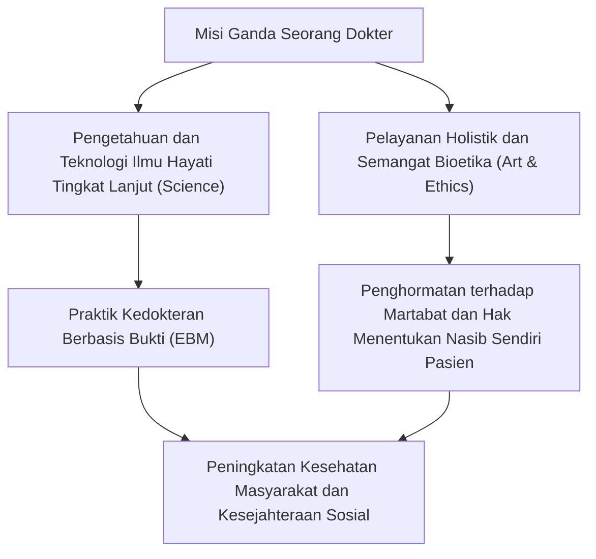
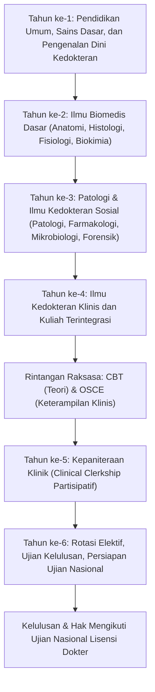
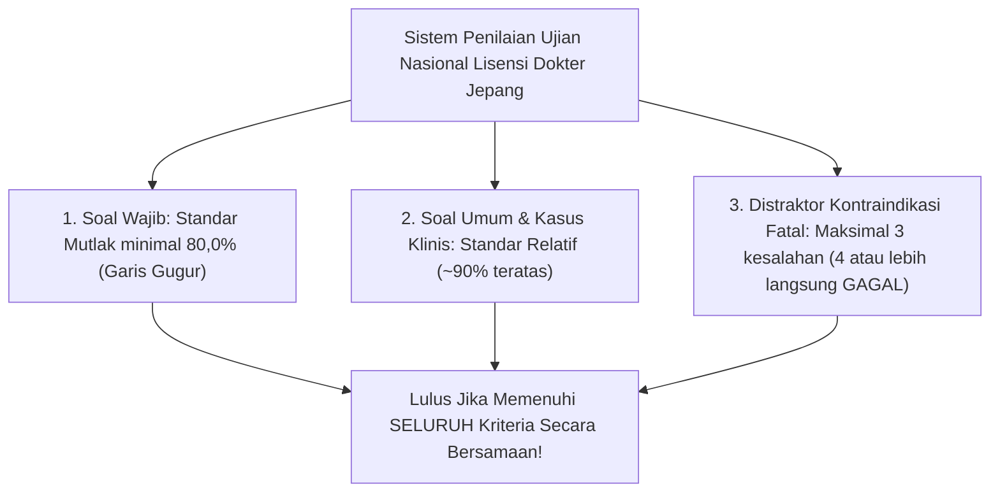
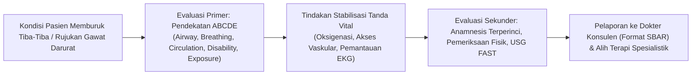
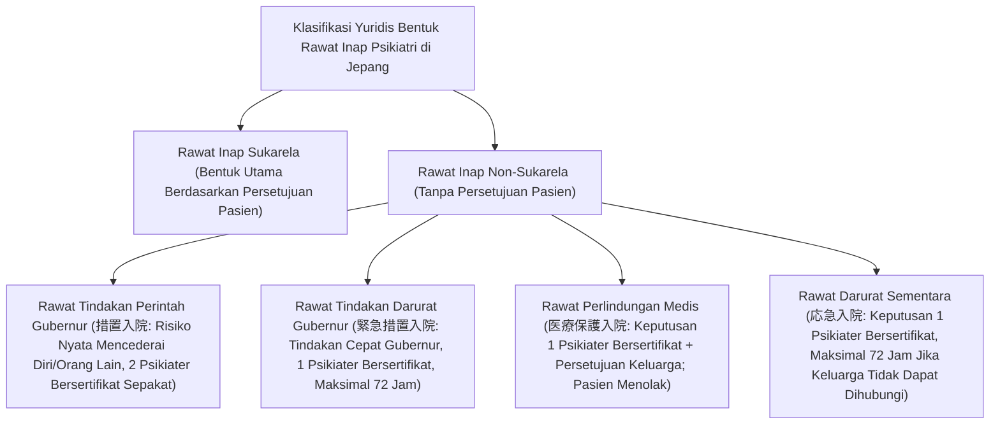
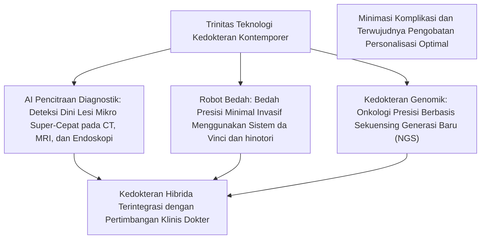

## 1. Pendahuluan: Titik Temu Antara Panggilan Suci Penyelamatan Jiwa dan Ilmu Pengetahuan

### 1.1 Hakikat Profesi Dokter: Integrasi Semangat «Seni Kedokteran» (医道) dan Ilmu Alam Modern

Profesi dokter sepanjang sejarah peradaban manusia selalu disambut dengan rasa hormat dan takzim yang mendalam. Bermula dari dukun kuno dan penyembuh religius, melintasi evolusi sains alam modern yang luar biasa, dokter masa kini memikul misi ganda: mereka adalah «teknokrat sains kehidupan tingkat tinggi» sekaligus «eksistensi etis yang mendampingi penderitaan dan kematian sesama manusia».

Seseorang yang jatuh sakit dan berhadapan langsung dengan teror kematian akan memperlihatkan tubuh dan jiwanya yang paling rapuh serta rentan di hadapan seorang dokter. Tindakan dokter saat memegang pisau bedah, memberikan obat-obatan keras berkekuatan tinggi, dan melakukan invasi fisik yang bersifat ireversibel ke dalam tubuh pasien secara formal memenuhi unsur tindak pidana penyerangan fisik/penganiayaan dalam hukum pidana. Landasan mendasar yang membuat tindakan invasif tersebut dikecualikan dari sanksi pidana sebagai tindakan profesi yang sah menurut hukum (Pasal 35 Kitab Undang-Undang Hukum Pidana Jepang) serta dihormati secara sosial bersumber semata-mata dari **kontrak fidusia (kepercayaan mutlak) antara negara dan masyarakat sipil: «Dokter menguasai pengetahuan serta keterampilan tingkat tinggi, dan mendedikasikan dirinya dengan tulus ikhlas demi menyelamatkan nyawa serta meningkatkan kesehatan manusia»**.

Tugas dokter tidak berhenti pada sekadar pengobatan penyakit (Disease: kelainan biologis objektif). Pengejaran seni luhur kedokteran («The Art of Medicine» / 医道) yang menyembuhkan penderitaan manusia seutuhnya (Illness: pengalaman penderitaan subjektif pasien) merupakan hakikat sejati seorang dokter yang tidak akan pernah bisa digantikan oleh kecerdasan buatan (AI) ataupun robotika, secanggih apa pun teknologi tersebut berkembang.



---

### 1.2 Transformasi Sejarah: Sumpah Hipokrates, Deklarasi Jenewa, dan Deklarasi Lisboa

Titik tolak etika kedokteran berakar pada «Sumpah Hipokrates» (Hippocratic Oath) yang dirumuskan oleh «Bapak Kedokteran» dari Yunani Kuno, Hipokrates (sekitar 460–370 SM), beserta murid-muridnya:
- Bersumpah demi Dewa Pengobatan Apollo, Asklepios, Higieia, dan Panakeia;
- Menetapkan rejimen pengobatan demi manfaat pasien sesuai kemampuan dan penilaian terbaik, serta menolak keras segala bentuk bahaya dan ketidakadilan;
- Menolak memberikan racun mematikan kepada siapa pun meskipun diminta, dan tidak menyarankan aborsi;
- Menjaga kesucian dan kemurnian hidup serta seni pengobatan, dan menyerahkan tindakan bedah pemotongan batu kepada praktisi bedah khusus;
- Menjaga kerahasiaan mutlak atas apa pun yang dilihat atau didengar mengenai kehidupan pribadi pasien selama maupun di luar proses pengobatan (rahasia medis).

Memasuki era modern, setelah refleksi mendalam atas eksperimen manusia yang sangat tidak manusiawi oleh dokter-dokter Nazi Jerman (yang diadili dalam Peradilan Dokter di Nuremberg), Asosiasi Medis Dunia (WMA) pada tahun 1948 mengadopsi **«Deklarasi Jenewa» (Declaration of Geneva)** sebagai wujud rekonstruksi kontemporer dari Sumpah Hipokrates:
- «Saya berikrar dengan khidmat untuk membaktikan hidup saya demi pelayanan kemanusiaan»;
- «Kesehatan pasien saya akan menjadi pertimbangan pertama dan utama saya»;
- «Saya tidak akan membiarkan pertimbangan usia, penyakit atau disabilitas, keyakinan agama, asal etnis, jenis kelamin, kebangsaan, afiliasi politik, ras, orientasi seksual, atau status sosial menghalangi kewajiban saya kepada pasien»;
- «Bahkan di bawah ancaman sekalipun, saya tidak akan menggunakan pengetahuan medis saya untuk melanggar hak asasi manusia dan kebebasan sipil».

Lebih lanjut, pada tahun 1981 diadopsi **«Deklarasi Lisboa tentang Hak-Hak Pasien» (WMA Declaration of Lisbon on the Rights of the Patient)**, yang memformalkan hak-hak pasien dalam standar global: «hak atas pelayanan medis berkualitas tinggi», «hak atas kebebasan memilih dokter», «hak untuk mengetahui informasi rekam medis pribadi», «hak menentukan nasib sendiri setelah menerima penjelasan yang memadai (Informed Consent)», «penunjukan perwakilan bagi pasien yang tidak sadar», dan «hak menghadapi kematian dengan bermartabat». Era paternalisme medis otoriter telah berakhir secara ireversibel, bertransformasi menjadi kemitraan terapeutik yang menempatkan pasien sebagai pusat pelayanan.

---

### 1.3 Kewajiban Luhur Berdasarkan Pasal 1 Undang-Undang Praktik Kedokteran Jepang

Dalam tata hukum Jepang, undang-undang dasar yang mengatur status, wewenang, dan kewajiban dokter adalah «Undang-Undang Praktik Kedokteran» (Undang-Undang Nomor 201 Tahun 1948). Pada Pasal 1 undang-undang tersebut, misi suci seorang dokter dinyatakan dengan kalimat yang sangat agung:

> **«Dokter bertanggung jawab memimpin pelayanan medis dan bimbingan kesehatan, berkontribusi pada peningkatan dan pemajuan kesehatan masyarakat, serta dengan demikian memastikan kehidupan yang sehat bagi seluruh warga negara.»**

Pasal ini secara eksplisit menegaskan bahwa cakrawala pandang seorang dokter tidak boleh terbatas pada penanganan pasien individu di hadapannya (perspektif mikro klinis), melainkan wajib menjangkau penanggulangan penyakit menular, sanitasi lingkungan, kedokteran pencegahan, dan kebijakan kesehatan di masyarakat secara keseluruhan (perspektif makro kesehatan masyarakat). Surat izin praktik dokter bukanlah hak istimewa pribadi yang diberikan oleh negara kepada seorang individu, melainkan bukti penyerahan mandat publik yang sangat berat untuk melindungi kelangsungan hidup segenap warga bangsa.

---

## 2. Kurikulum Raksasa Pendidikan Kedokteran 6 Tahun dan Rintangan-Rintangannya

Perjalanan untuk menjadi seorang dokter sangat berat, terjal, dan memakan waktu panjang. Di Jepang, untuk memperoleh lisensi dokter, seseorang wajib menyelesaikan kurikulum reguler selama 6 tahun di fakultas kedokteran universitas (atau universitas kedokteran). Kurikulum ini distandarisasi secara ketat oleh Kementerian Pendidikan, Kebudayaan, Olahraga, Sains, dan Teknologi (MEXT) berdasarkan «Model Kurikulum Inti Pendidikan Kedokteran» (Medical Education Model Core Curriculum).



---

### 2.1 Tahun ke-1 hingga ke-2: Pendidikan Umum dan Fajar Ilmu Biomedis Dasar

#### Etika dan Makna Medis Praktikum Diseksi Anatomi Tubuh Manusia
Ujian mental pertama dan terbesar yang menanti mahasiswa di tahun ke-2 adalah «Praktikum Diseksi Anatomi Tubuh Manusia» (Gross Anatomy). Selama beberapa bulan berturut-turut, mahasiswa berhadapan langsung dengan jenazah para almarhum yang semasa hidupnya mendonasikan tubuh mereka demi kemajuan ilmu kedokteran (program donor kadaver «Kentai»).
- Di tengah bau menyengat uap formalin pengawet jaringan, mahasiswa menyayat kulit lapis demi lapis, memisahkan lemak subkutan, dan mengidentifikasi pembuluh darah, saraf, otot, tulang, serta organ dalam satu per satu secara teliti.
- Sebelum pisau bedah pertama menyentuh tubuh kadaver, seluruh mahasiswa mengheningkan cipta dalam doa bersama, menghaturkan rasa terima kasih yang tak terhingga kepada pendonor kadaver dan keluarga mereka yang mulia.
- Praktikum ini menanamkan struktur tiga dimensi tubuh manusia yang sangat rumit melalui panca indera secara langsung, sekaligus menjadi ritual inisiasi di mana mahasiswa bersentuhan fisik dengan kematian orang lain dan menumbuhkan kesadaran untuk memikul beban kefanaan hidup manusia.

#### Fisiologi, Biokimia, dan Histologi
- **Fisiologi**: Mempelajari mekanisme fisikokimiawi fenomena kehidupan — seperti pembentukan potensial aksi jantung (pompa natrium-kalium, depolarisasi dan repolarisasi), filtrasi glomerulus dan reabsorpsi tubulus pada ginjal, serta mekanisme umpan balik hormon endokrin.
- **Biokimia**: Menghafal dan memahami secara mendalam jalur metabolisme pada tingkat molekuler: siklus asam sitrat (Siklus Krebs / TCA cycle), fosforilasi oksidatif, glukoneogenesis, $\beta$-oksidasi asam lemak, biosintesis protein, serta replikasi, transkripsi, dan translasi DNA/RNA.
- **Histologi**: Membuat sketsa mikrostruktur jaringan epitel, jaringan ikat, jaringan otot, dan jaringan saraf di bawah mikroskop cahaya dan mikroskop elektron transmisi, guna menganalisis korelasi erat antara bentuk morfologis dan fungsi jaringan.

---

### 2.2 Tahun ke-3 hingga ke-4: Patofisiologi dan Sistematika Kedokteran Klinis

Dari tahun ke-3 hingga ke-4, fokus berpindah ke mekanisme penyakit (aplikasi klinis ilmu dasar) dan metode diagnosis serta penatalaksanaan penyakit di setiap departemen klinis dalam «Ilmu Kedokteran Klinis».

- **Patologi**: Mengurai hakikat penyakit dari perubahan morfologi sel dan jaringan (radang, nekrosis, derajat atipia tumor, displasia, apoptosis).
- **Farmakologi**: Ikatan ligan-reseptor obat, farmakokinetika (absorpsi, distribusi, metabolisme, ekskresi: ADME), mekanisme kerja bakterisidal/bakteriostatik antibiotik dan munculnya resistensi mikroba, obat antihipertensi, serta mekanisme molekuler agen antikanker terarah.
- **Ilmu Penyakit Dalam**: Kardiologi (infark miokard akut, aritmia, gagal jantung kongestif), pulmonologi (kanker paru, PPOK, fibrosis paru idiopatik), gastroenterologi-hepatologi (ulkus peptikum, sirosis hati, kanker kolorektal), nefrologi (sindrom nefrotik, penyakit ginjal kronis), endokrinologi-metabolik (diabetes melitus, disfungsi tiroid), hematologi (leukemia, limfoma maligna), neurologi, serta penyakit autoimun dan alergi.
- **Ilmu Bedah**: Bedah digestif, bedah kardiovaskular, bedah toraks, bedah saraf, bedah ortopedi — indikasi operasi, manajemen perioperatif (pre- dan post-operasi), serta tatalaksana syok.
- **Pediatri, Obstetri & Ginekologi, Psikiatri**: Mulai dari anomali kongenital neonatus hingga gangguan tumbuh kembang; manajemen perinatal (persalinan normal/patologis, preeklamsia); farmakoterapi dan psikoterapi pada skizofrenia, gangguan bipolar, dan depresi mayor.
- **Kedokteran Sosial, Forensik, dan Kesehatan Masyarakat**: Biostatistik epidemiologi, undang-undang pengendalian penyakit menular, kesehatan kerja, toksikologi forensik, penyelidikan penyebab kematian tidak wajar melalui otopsi medikolegal dan otopsi klinis.

---

### 2.3 Rintangan Raksasa Pertama: CBT dan OSCE (Status Ujian Resmi Negara)

Pada musim gugur tahun ke-4, mahasiswa kedokteran menghadapi «Ujian Bersama Terpadu» (Common Achievement Tests / 共用試験) tingkat nasional untuk menentukan kelayakan mereka memasuki bangsal rumah sakit. Sejak revisi Undang-Undang Praktik Kedokteran pada tahun 2023 (Tahun ke-5 era Reiwa), ujian ini secara resmi berstatus sebagai ujian kualifikasi publik negara.

1. **CBT (Computer Based Testing)**:
   - Ujian berbasis komputer dengan format pilihan ganda objektif sekitar 320 soal yang menguji penguasaan pengetahuan medis komprehensif.
   - Soal dipilih secara acak dari bank soal raksasa dan diskor menggunakan Item Response Theory (IRT).
   - Mencakup biomedis dasar, kedokteran klinis, dan kedokteran sosial; mahasiswa yang gagal mencapai persentase kelulusan standar (umumnya sekitar 65–70%) akan dinyatakan tidak lulus dan wajib mengulang tahun akademik (tinggal kelas).
2. **Pre-CC OSCE (Objective Structured Clinical Examination)**:
   - Ujian keterampilan praktis yang mengevaluasi teknik anamnesis (wawancara medis), pemeriksaan fisik langsung, dan sikap etis profesional.
   - Kandidat berotasi melalui beberapa stasiun (stasiun wawancara medis, pemeriksaan kepala-leher, pemeriksaan toraks kardiopulmoner, pemeriksaan abdomen, pemeriksaan neurologis dasar, tindakan resusitasi jantung paru) menggunakan pasien simulasi (SP) atau manekin simulator canggih.
   - Penguji eksternal menilai berdasarkan lembar tilang (checklist) yang sangat ketat: kerapian, etika salam, empati terhadap pasien, kebersihan cuci tangan, serta urutan auskultasi dan palpasi yang tepat.

Hanya mahasiswa yang lulus kedua ujian ini yang dianugerahi gelar resmi **«Student Doctor» (Dokter Mahasiswa)** dan diperbolehkan melangkah ke fase praktik klinis di bangsal rumah sakit.

---

### 2.4 Tahun ke-5 hingga ke-6: Kepaniteraan Klinik Partisipatif (Clinical Clerkship)

Mulai tahun ke-5, mahasiswa menjalani «Kepaniteraan Klinik» (Clinical Clerkship: rotasi klinik partisipasi aktif) di rumah sakit pendidikan universitas dan rumah sakit rujukan daerah dengan siklus rotasi 1–2 minggu di setiap departemen.
Berbeda dengan model lama yang hanya bersifat observasional (melihat-lihat), kepaniteraan modern menuntut mahasiswa bergabung sebagai anggota tim pelayanan medis aktif di bangsal:
- Di bawah supervisi dokter konsulen pembimbing, mahasiswa bertugas melakukan visite harian pada pasien kelolaan, memeriksa tanda vital, menulis rekam medis mahasiswa, menginterpretasikan data laboratorium dan radiologi, serta mempresentasikan kasus dalam konferensi klinis.
- Di kamar operasi, mahasiswa melakukan cuci tangan bedah steril, mengenakan gaun steril, dan bertindak sebagai asisten bedah kedua atau ketiga — membantu memegang retraktor bedah untuk memperluas lapang pandang operasi dan menggunting benang ligasi.
- Mempelajari dan menguasai keterampilan invasif dasar: flebotomi (pengambilan darah vena), pemasangan kanula intravena perifer (jalur infus), penjahitan luka sederhana, dan pengangkatan jahitan operasi.
- Pada tahun ke-6, ujian kelulusan universitas («Sotsushi» / 卒試) yang sangat kejam menanti. Demi menjaga angka kelulusan Ujian Nasional universitas yang prestisius, beberapa universitas menerapkan seleksi internal yang tanpa ampun menahan mahasiswa yang dinilai kurang mampu untuk mengulang tahun. Hanya mereka yang lolos dari seleksi ketat ini yang berhak memegang kartu peserta Ujian Nasional Lisensi Dokter.

---

## 3. Struktur Ujian Nasional Lisensi Dokter dan Garis Pemisah Kelulusan

Ujian Nasional Lisensi Dokter (医師国家試験) diselenggarakan oleh Kementerian Kesehatan, Tenaga Kerja, dan Kesejahteraan Jepang (MHLW) setiap awal Februari selama dua hari penuh yang menguras energi mental dan fisik.

### 3.1 Komposisi dan Standar Soal Ujian

Terdiri dari total 400 butir soal dengan sistem lembar jawab komputer (LJK) pilihan ganda (termasuk soal perhitungan numerik dan pilihan jamak).

| Blok Ujian | Jumlah Soal | Durasi Waktu | Ruang Lingkup Materi |
| :--- | :---: | :---: | :--- |
| **Blok A** | 75 soal | 135 menit | Soal Khusus & Umum (Praktik Klinis & Teori Umum) |
| **Blok B** | 50 soal | 80 menit | **Soal Wajib Komprehensif (Umum & Praktik Klinis)** |
| **Blok C** | 75 soal | 135 menit | Kasus Klinis Panjang Terintegrasi |
| **Blok D** | 75 soal | 135 menit | Soal Umum (Biomedis Dasar & Kesehatan Masyarakat) |
| **Blok E** | 50 soal | 80 menit | **Soal Wajib Komprehensif (Keselamatan Pasien & Etika/Hukum)** |
| **Blok F** | 75 soal | 135 menit | Soal Integratif Klinis Komprehensif |

---

### 3.2 Tiga Kriteria Kelulusan Utama dan Teror «Batas Mutlak 80% Soal Wajib»

Penetapan kelulusan Ujian Nasional Lisensi Dokter mewajibkan peserta untuk **memenuhi ketiga kriteria berikut secara simultan**. Kegagalan pada salah satu kriteria saja akan langsung mengakibatkan ketidaklulusan seketika.



1. **Batas Gugur Mutlak Soal Wajib (Standar 80,0%)**:
   - Untuk kelompok soal wajib (Blok B dan Blok E: total 100 soal bernilai 200 poin), peserta **wajib mencapai skor minimal 80,0% (minimal 160 poin) tanpa kompromi**.
   - Sekalipun nilai soal umum dan klinis peserta hampir sempurna, jika nilai soal wajib kurang 1 poin saja (misalnya 159 dari 200), peserta otomatis dinyatakan gugur. Oleh karena itu, para peserta ujian mengisi LJK soal wajib dengan tangan bergetar hebat di bawah tekanan mental yang luar biasa.
2. **Standar Relatif Soal Umum dan Kasus Klinis**:
   - Kelompok soal umum dan kasus klinis dinilai berdasarkan distribusi relatif skor peserta pada tahun tersebut, di mana garis batas kelulusan ditetapkan untuk menyaring sekitar 10–11% peserta terbawah (ambang batas dinamis biasanya berkisar antara 68–72%).
3. **Jebakan Distraktor Kontraindikasi Fatal (禁忌肢 / Contraindications)**:
   - Elemen yang paling ditakuti adalah pilihan jawaban kontraindikasi fatal. Jika peserta memilih opsi yang mencerminkan **«malpraktik berat yang berakibat kematian pasien», «pelanggaran hak asasi manusia berat», atau «pelanggaran hukum terang-terangan»**, skor pelanggaran kontraindikasi akan bertambah satu per soal.
   - Biasanya, **jika seorang peserta memilih 4 butir (pada tahun tertentu 3 butir) distraktor kontraindikasi fatal, ia akan langsung digugurkan seketika tanpa syarat**, kendati total nilainya melampaui batas nilai kelulusan umum.
   - *(Contoh kontraindikasi fatal: Memberikan obat antikoagulan/trombolisis pada pasien yang dicurigai mengalami perdarahan intraserebral; hanya memberikan kortikosteroid tunggal tanpa menyuntikkan epinefrin/adrenalin intramuskular segera pada syok anafilaksis; memberikan obat kontraindikasi sedatif alih-alih atropin pada keracunan organofosfat; memutuskan rawat paksa psikiatri hanya atas kehendak keluarga tanpa persetujuan pasien yang kompeten dan tanpa indikasi medis).*

---

## 4. Ujian Pelatihan Klinis Awal (2 Tahun): Sistem Super-Rotasi Multidisiplin

Setelah lulus ujian nasional, terdaftar dalam registri dokter, dan menerima surat izin praktik (lisensi), seorang dokter secara hukum tetap dilarang untuk berpraktik mandiri secara independen (Pasal 16-2 UU Praktik Kedokteran). Dokter diwajibkan menjalani masa pelatihan klinis residensi awal selama minimal 2 tahun.

### 4.1 Reformasi Sistem Pelatihan Klinis Pascasarjana Kedokteran Tahun 2004

Sebelum tahun 2004 (Tahun ke-16 era Heisei), lulusan kedokteran langsung bergabung ke salah satu departemen spesialis universitas («Ikyoku» / 医局 — misalnya Bagian Ilmu Penyakit Dalam I atau Bagian Ilmu Bedah II) dan hanya dilatih dalam cakupan subspesialis yang sempit. Akibatnya terjadi anomali klinis serius: «seorang dokter ahli gastroenterologi tingkat tinggi ternyata sama sekali tidak bisa menangani fraktur sederhana, trauma mata, atau penanganan awal henti jantung di instalasi gawat darurat».

Untuk mendobrak isolasi spesialisasi dini tersebut, diperkenalkanlah «Sistem Super-Rotasi» (Sistem Pelatihan Klinis Baru):
- **Kewajiban Penguasaan Kompetensi Dasar Klinis**: Tanpa memandang spesialisasi masa depannya, setiap dokter wajib menjalani rotasi komprehensif di bagian Ilmu Penyakit Dalam (minimal 6 bulan), Kedokteran Emergensi (minimal 3 bulan), Kedokteran Komunitas/Primer (minimal 1 bulan), serta Ilmu Kesehatan Anak, Obstetri & Ginekologi, Psikiatri, dan Ilmu Bedah guna menguasai kompetensi pelayanan kesehatan primer (Primary Care).
- **Penerapan Sistem Matching Komputerisasi**: Penempatan dokter magang tidak lagi ditentukan oleh titah profesor fakultas, melainkan melalui Dewan Pencocokan Residensi Medis (Japan Resident Matching Program) yang mempertemukan preferensi mahasiswa dan rumah sakit dengan algoritma perkawinan stabil Gale-Shapley secara otomatis.
- Kebijakan ini memicu gelombang besar di mana para lulusan berbondong-bondong memilih rumah sakit umum daerah dan swasta bereputasi tinggi yang menawarkan pelatihan klinis mandiri dan insentif jaga malam memadai (seperti RS St. Luke's Tokyo, Toranomon, Kurashiki Central, Kameda), yang pada gilirannya melemahkan sistem hierarki departemen universitas dan memicu kelangkaan dokter di daerah pelosok.

---

### 4.2 Keseharian Berat Residen Junior dan Penguasaan Keterampilan Prosedural Invasif

Dua tahun masa residensi klinis awal (Junior Resident) adalah periode pembelajaran paling intensif, padat, dan menguras fisik serta emosi dalam kehidupan seorang dokter.



- **Jaga Malam Instalasi Gawat Darurat (IGD)**: Arus pasien yang tidak pernah berhenti — mulai dari pasien jalan dengan keluhan demam hingga pasien henti jantung-paru (Cardiopulmonary Arrest / CPA) yang dibawa ambulans. Di bawah bimbingan dokter konsulen IGD, residen menerapkan protokol **«Pendekatan ABCDE»** (Airway, Breathing, Circulation, Dysfunction of CNS, Exposure) untuk melakukan triase kegawatdaruratan secara instan.
- **Penguasaan Prosedur Medis Esensial**:
  - Analisis gas darah arteri (pungsi arteri radialis);
  - Ultrasonografi bedside darurat dengan protokol FAST (Focused Assessment with Sonography for Trauma) untuk mendeteksi cairan bebas dan perdarahan intraabdomen;
  - Pemasangan kateter vena sentral (Central Venous Catheter / CVC) dengan panduan USG (pungsi vena jugularis interna);
  - Intubasi endotrakeal menggunakan laringoskop dan verifikasi fiksasi pipa napas;
  - Pungsi lumbal untuk pengambilan cairan serebrospinal pada kecurigaan meningitis;
  - Pemasangan selang drainase toraks (WSD / chest tube) dan parasentesis abdomen.
- **Pemberitahuan dan Deklarasi Kematian**: Momen ketika dokter muda untuk pertama kalinya mengonfirmasi berhentinya sirkulasi jantung pasien, memeriksa dilatasi pupil, hilangnya refleks cahaya, garis datar pada monitor EKG, dan menuliskan surat kematian resmi. Menghadapi keluarga yang berduka dan menyampaikan kabar duka dengan penuh empati dan keteguhan. Beban eksistensial profesi dokter terpatri kuat hingga ke sumsum tulang pada momen-momen ini.

---

## 5. Lanskap Sistem Dokter Spesialis Baru: 19 Bidang Spesialis Dasar dan Subspesialis

Setelah menyelesaikan 2 tahun residensi klinis awal, dokter melangkah menjadi «Residen Senior / Trainee Spesialis» (Senior Resident / 専攻医) dan menentukan bidang keahlian definitif seumur hidup mereka. «Sistem Dokter Spesialis Baru» yang mulai berlaku penuh pada tahun 2018 (Tahun ke-30 era Heisei) menerapkan struktur piramida dua tingkat yang dikelola dan diakreditasi secara terpusat oleh Japan Medical Specialty Board (JMSB / 一般社団法人日本専門医機構).

```mermaid
flowchart TD
    subgraph Bidang Spesialis Dasar (Lantai 1: 3-5 Tahun)
        B1["Ilmu Penyakit Dalam"]
        B2["Ilmu Bedah"]
        B3["Ilmu Kesehatan Anak"]
        B4["Obstetri dan Ginekologi"]
        B5["Kedokteran Emergensi"]
        B6["Kedokteran Umum & Keluarga"]
        B7["13 Bidang Lainnya (Ortopedi, Anestesiologi, Psikiatri, Bedah Saraf, Dermatologi, Urologi, Mata, THT, Patologi, Radiologi, Bedah Plastik, Rehabilitasi Medis, Patologi Klinik)"]
    end
    subgraph Bidang Subspesialis (Lantai 2: Tambahan 2-3 Tahun)
        B1 --> S1["Kardiologi / Gastroenterologi / Pulmonologi / Hematologi / Nefrologi / Endokrinologi & Metabolik / Neurologi"]
        B2 --> S2["Bedah Digestif / Bedah Toraks Kardiovaskular / Bedah Toraks / Bedah Anak / Bedah Onkologi Payudara"]
    end
    S1 --> PHD["Kualifikasi Supervisi / Konsultan, Gelar Doktor (PhD), Publikasi Riset Klinis"]
    S2 --> PHD
```

---

### 5.1 Taksonomi 19 Bidang Spesialis Dasar

Residen senior bergabung dengan salah satu program pelatihan terakreditasi pada **19 bidang dasar** dengan masa studi 3 hingga 5 tahun.

| Bidang Spesialis Dasar | Durasi Pelatihan | Karakteristik dan Fokus Utama |
| :--- | :---: | :--- |
| **Ilmu Penyakit Dalam** | 3 tahun | Kewajiban registrasi portofolio kasus raksasa (ratusan ringkasan kasus mendalam di sistem J-OSLER). Pintu gerbang utama menuju seluruh subspesialis penyakit dalam. |
| **Ilmu Bedah** | 3–4 tahun | Fondasi komprehensif bedah digestif, bedah vaskular, bedah toraks, dan bedah anak. Wajib mencatatkan kasus bedah primer ke dalam National Clinical Database (NCD). |
| **Ilmu Kesehatan Anak** | 3 tahun | Perawatan intensif neonatus (NICU), kegawatdaruratan anak, infeksi pediatrik, gangguan tumbuh kembang, dan alergi-imunologi anak. |
| **Obstetri & Ginekologi** | 3 tahun | Pelayanan perinatal (persalinan fisiologis/patologis, seksio sesarea darurat), bedah onkologi ginekologi, dan endokrinologi reproduksi / fertilisasi berbantu. |
| **Kedokteran Emergensi** | 3 tahun | Politrauma berat, syok septik, keracunan akut, luka bakar masif, manajemen ICU, dan pelayanan pra-rumah sakit (helikopter medis / Doctor-Heli). |
| **Kedokteran Umum & Keluarga** | 3 tahun | Bidang baru. Pengelolaan pasien multimorbiditas kronis di fasilitas primer, koordinasi perawatan terintegrasi masyarakat, kedokteran keluarga, dan perawatan rumah (home care). |
| **Ortopedi & Traumatologi** | 3–4 tahun | Reduksi dan fiksasi fraktur, artroplasti penggantian sendi panggul/lutut, bedah tulang belakang, kedokteran olahraga, dan rehabilitasi motorik. |
| **Anestesiologi** | 4 tahun | Anestesi umum inhalasi/intravena, anestesi epidural dan spinal, klinik penanganan nyeri kronis, manajemen ICU, dan penanganan krisis perioperatif. |
| **Psikiatri** | 3 tahun | Terintegrasi dengan persyaratan penunjukan Psikiater Bersertifikat Perlindungan Jiwa. Terapi psikofarmakologi dan psikoterapi skizofrenia, depresi, gangguan bipolar, dan demensia. |
| **Bedah Saraf** | 4 tahun | Pemasangan klip aneurisma serebral mikroskopis, reseksi tumor otak, terapi kateter endovaskular intervensi serebrovaskular, serta bedah kraniotomi trauma kapitis. |
| **Radiologi** | 3 tahun | Interpretasi pencitraan lanjutan (CT, MRI, PET), radiologi intervensi terapeutik (IVR), dan radioterapi onkologi terarah. |
| **Patologi Anatomi** | 3 tahun | Pemeriksaan potong beku intraoperatif (frozen section), biopsi histopatologi dan imunohistokimia, konferensi klinikopatologi (CPC), dan otopsi anatomi. |
| **7 Bidang Lainnya** | 3–4 tahun | Dermatologi, Urologi, Oftalmologi, Otorinolaringologi, Bedah Plastik & Rekonstruksi, Kedokteran Fisik & Rehabilitasi, serta Patologi Klinik (Laboratorium). |

---

### 5.2 Pendalaman ke Subspesialis dan Gelar Doktor Ilmu Kedokteran (PhD)

Setelah meraih sertifikasi spesialis dasar, seorang dokter dapat melanjutkan ke jenjang subspesialis tingkat dua (seperti konsultan kardiologi intervensi, gastroenterologi-hepatologi, konsultan bedah kardiovaskular, onkologi medis, dsb.) yang memerlukan waktu pendalaman tambahan 2–3 tahun.

Selain itu, banyak dokter menempuh program pascasarjana doktoral kedokteran (Program PhD selama 4 tahun) di universitas terkemuka. Mereka melakukan eksperimen biologi molekuler, imunologi seluler, dan analisis bioinformatika genom di laboratorium, menulis naskah ilmiah sebagai penulis pertama di jurnal internasional bereputasi (Q1/Q2), dan meraih gelar **Doktor Ilmu Kedokteran (PhD / 医学博士)**. Hal ini membentuk figur klinisi-peneliti (Physician-Scientists) yang mampu menangani pasien di garis depan sekaligus memproduksi bukti ilmiah baru bagi dunia kedokteran internasional.

---

## 2.5 Patofisiologi Mendalam dan Pemodelan Matematika Farmakokinetika (Teori PK/PD)

Untuk mencegah mahasiswa kedokteran hanya menghafal nama obat dan gejalanya secara dogmatis, konsep analitis kuantitatif **«Teori PK/PD (Farmakokinetika / Farmakodinamika)»** dijadikan pilar utama dalam pembelajaran kedokteran modern berbasis sains molekuler.

### Parameter Dasar Farmakokinetika (PK)
- **Area Under the Curve (AUC)**: Area di bawah kurva konsentrasi obat terhadap waktu dalam sirkulasi darah; mencerminkan total paparan sistemik tubuh terhadap obat.
- **Konsentrasi Maksimum ($Cmax$)**: Kadar puncak tertinggi obat dalam serum darah yang dicapai setelah pemberian dosis.
- **Volume Distribusi ($Vd$)**: Parameter teoritis volume cairan yang dibutuhkan untuk melarutkan sejumlah dosis obat hingga mencapai konsentrasi plasma; mencerminkan apakah obat bersifat hidrofilik (terbatas di ruang intravaskular/ekstraselular) atau lipofilik (terdistribusi luas ke dalam jaringan dan sel).

### Tiga Klasifikasi Pola Parameter PK/PD Antibiotik
Dalam terapi infeksi bakteri, efektivitas antimikroba dikelompokkan ke dalam tiga pola berdasarkan relasi konsentrasi obat dengan Konsentrasi Hambat Minimum (Minimum Inhibitory Concentration / MIC):

| Parameter PK/PD | Indikator Efektivitas | Contoh Golongan Antibiotik | Strategi Perancangan Dosis |
| :--- | :--- | :--- | :--- |
| **Time above MIC ($T > MIC$)** | Persentase durasi waktu kadar obat dalam darah berada di atas nilai MIC (%) | **Penisislin, Sefalosporin, Karbapenem** (Golongan $\beta$-laktam) | Menambah dosis tunggal secara berlebihan tidak efektif; efektivitas dimaksimalkan dengan **meningkatkan frekuensi pemberian (3–4 kali sehari)** atau menggunakan infus kontinu berdurasi panjang. |
| **$Cmax / MIC$** | Rasio kelipatan kadar konsentrasi puncak darah terhadap nilai MIC | **Aminoglikosida** (Gentamisin, Amikasin) | Menghindari dosis terbagi berkala; menerapkan **pemberian dosis tinggi sekali sehari (Once Daily Dosing)** untuk menghasilkan lonjakan kadar puncak tinggi guna memaksimalkan daya bakterisidal konsentrasi dan Post-Antibiotic Effect (PAE), sekaligus mengurangi toksisitas ginjal dan telinga. |
| **$AUC / MIC$** | Rasio total paparan sistemik selama 24 jam terhadap nilai MIC | **Fluorokuinolon, Vankomisin** (Glikopeptida) | Menjaga kecukupan dosis harian kumulatif. Pada vankomisin, wajib dilakukan Therapeutic Drug Monitoring (TDM) untuk memantau kadar palung (trough level) secara ketat pada kisaran $15 \sim 20 \;\mu g/mL$. |

---

## 3.6 Titik Krusial Ujian Nasional: Hukum Kesehatan Masyarakat dan Penafsiran UU Kesehatan Mental

Salah satu materi yang paling banyak menyita energi peserta dalam Ujian Nasional Lisensi Dokter adalah aspek hukum kesehatan masyarakat dan peraturan perundang-undangan medikolegal, yang menuntut ketelitian setara ahli hukum.

### ① Klasifikasi UU Pengendalian Penyakit Menular dan Kewajiban Pelaporan Dokter
Berdasarkan «Undang-Undang Pencegahan Penyakit Menular dan Pelayanan Medis bagi Pasien Penyakit Menular Jepang», patogen dikelompokkan ke dalam Kategori 1 hingga 5 berdasarkan tingkat bahaya dan penularannya:

- **Penyakit Menular Kategori 1 (Penyakit Virus Ebola, Pes, Virus Marburg, Demam Lassa, Demam Berdarah Krimea-Kongo, Cacar/Variola, Demam Berdarah Amerika Selatan)**:
  - Dokter wajib **seketika (tanpa penundaan) melapor kepada gubernur prefektur melalui kepala dinas kesehatan masyarakat setempat (Hokenjo)**.
  - Otoritas memiliki wewenang administratif tegas: isolasi rawat inap wajib di rumah sakit rujukan infeksi Kelas Khusus/Kelas 1, pembatasan lalu lintas dalam radius tertentu hingga 72 jam, serta dekontaminasi dan pemusnahan barang yang terkontaminasi.
- **Penyakit Menular Kategori 2 (Tuberkulosis, SARS, MERS, Flu Burung H5N1/H7N9, Poliomielitis)**:
  - Pelaporan segera. Rujukan rawat inap ke fasilitas isolasi Kelas 2. Pada tuberkulosis, biaya pengobatan dijamin oleh dana publik negara bahkan untuk Infeksi Tuberkulosis Laten (LTBI).
- **Penyakit Menular Kategori 3 (Kolera, Disentri Basiler, Demam Tifoid, Paratifoid, Infeksi E. coli Enterohemoragik seperti EHEC O157)**:
  - Pelaporan segera. Tidak ada isolasi rawat paksa, namun diberlakukan larangan bekerja di industri makanan atau penyediaan air bersih hingga hasil kultur feses terbukti negatif.
- **Penyakit Menular Kategori 4 (Hepatitis E, Hepatitis A, Malaria, Rabies, Demam Berdarah Dengue, Demam Kuning, Ensefalitis Jepang, Legionelosis, Tetanus, dll.)**:
  - Penyakit menular bersumber binatang, vektor nyamuk, atau makanan/minuman. Pelaporan segera. Tidak menular langsung antar-manusia lewat udara, sehingga tidak ada isolasi rawat inap.
- **Penyakit Menular Kategori 5**:
  - **Kewajiban Pelaporan Total Semua Kasus (dalam 7 hari)**: Campak (measles), Rubela, Sifilis, Ensefalitis Akut, Tetanus, Infeksi Meningokokus Invasif, AIDS/HIV (campak dan rubela wajib dilaporkan segera).
  - **Sistem Pengawasan Rumah Sakit Sentinel (laporan mingguan/bulanan dari faskes sentinel tertentu)**: Influenza musiman, Penyakit Tangan Kaki Mulut (HFMD), Infeksi RSV, Gastroenteritis Menular.

### ② Ketelitian Yuridis Berbagai Bentuk Rawat Inap dalam UU Kesehatan Jiwa
«Undang-Undang Kesehatan Mental dan Kesejahteraan Orang dengan Gangguan Jiwa Jepang» menyeimbangkan secara presisi antara perlindungan hak asasi pasien dan pencegahan bahaya melukai diri sendiri atau orang lain.



Dalam ujian nasional, urutan prioritas wali keluarga yang berwenang memberikan persetujuan pada «Rawat Perlindungan Medis» (pasangan, orang tua/wali hukum, pihak penanggung nafkah, wali yang ditunjuk pengadilan, atau wali kota jika tidak ada keluarga) serta alur laporan kepolisian (Pasal 24) pada «Rawat Tindakan Perintah Gubernur» merupakan poin krusial penentu kelulusan.

---

## 4.5 Medan Pertempuran Jaga Malam IGD: Algoritma Gangguan Kesadaran «AIUEO TIPS»

Telepon PHS genggam residen jaga malam berdering nyaring: «Ambulans membawa laki-laki usia 70-an tahun dengan penurunan kesadaran akut!». Dalam hitungan detik, kerangka berpikir terstruktur standar global untuk diagnosis banding koma, yaitu mnemonik **«AIUEO TIPS»**, harus langsung aktif di dalam benak residen.

| Huruf | Patologi yang Harus Dipertimbangkan | Tindakan Penanganan Awal di Ruang Resusitasi |
| :---: | :--- | :--- |
| **A** | **A**lcohol (Intoksikasi alkohol akut) / **A**cidosis (Asidosis metabolik/respiratorik) | Memeriksa aroma napas, analisis gas darah untuk mengukur pH, laktat, dan menghitung Anion Gap (AG). |
| **I** | **I**nsulin (**Hipoglikemia**, Ketoasidosis Diabetik: KAD / Status Hiperosmolar Hiperglikemik: HHS) | **Periksa gula darah sewaktu (GDS) tusuk jari sesegera mungkin di tempat!** (Hipoglikemia berat dapat memicu kerusakan otak permanen dalam hitungan puluhan menit; berikan injeksi dekstrosa 40–50% bolus intravena segera jika rendah). |
| **U** | **U**remia (Koma uremikum akibat gagal ginjal) | Pemeriksaan biokimia darah: ureum (BUN), kreatinin serum, kalium. Pertimbangkan indikasi hemodialisis darurat. |
| **E** | **E**ncephalopathy (Ensefalopati hepatikum/hipertensif) / **E**lectrolytes (Gangguan elektrolit) / **E**ndocrine (Krisis tiroid, koma miksedema, krisis adrenal) | Periksa amonia darah, natrium serum (peringatan: koreksi hiponatremia yang terlalu cepat berisiko fatal memicu Osmotic Demyelination Syndrome: ODS). |
| **O** | **O**xygen (Hipoksemia berat) / **O**verdose (Overdosis obat-obatan) / **O**piate (Intoksikasi opioid) | Pemantauan saturasi oksigen (SpO2), gas darah. Jika ditemukan trias koma, miosis pinpoint, dan bradipnea, segera berikan injeksi antidotum nalokson. |
| **T** | **T**rauma (Cedera kepala berat) / **T**emperature (Hipotermia atau heat stroke parah) | CT scan kepala darurat (evaluasi hematoma epidural/subdural akut), ukur suhu rektal pasien secara akurat. |
| **I** | **I**nfection (Infeksi SSP: meningitis/ensefalitis, sepsis berat) | Periksa kaku kuduk, tanda Kernig, tanda jolt accentuation. Ambil 2 set kultur darah, segera berikan antibiotik empiris (seftriakson + vankomisin + ampisilin), lalu lakukan pungsi lumbal. |
| **P** | **P**sychiatric (Gangguan psikogenik/konversi disosiatif) / **P**orphyria (Porfiria intermiten akut) | Merupakan diagnosis eksklusi murni: hanya boleh dipertimbangkan setelah seluruh penyakit organik disingkirkan secara tuntas. |
| **S** | **S**troke (Stroke iskemik, perdarahan intraserebral, SAH) / **S**eizure (Status epileptikus non-konvulsif) / **S**hock (Syok hipovolemik, kardiogenik, obstruktif, distributif) | Evaluasi tanda lateralisasi neurologis fokal, CT/MRI otak darurat (DWI). Penilaian jendela terapi untuk trombolisis rt-PA intravena (dalam 4,5 jam) atau trombektomi mekanik. |

Kesalahan fatal yang paling sering diperbuat oleh dokter junior adalah terburu-buru membawa pasien koma langsung ke ruang CT scan tanpa stabilisasi. Jika pasien ternyata mengalami hipoglikemia berat atau hipoksemia kritis, pasien bisa mengalami henti jantung tepat di dalam tabung CT scan. Aturan emas gawat darurat yang harus dipegang teguh: **«Vital signs first, then Glucose, ABCDE stabilization!»** (Amankan tanda vital terlebih dahulu, periksa glukosa, stabilkan ABCDE, baru kemudian lakukan pemeriksaan penunjang lanjutan).

---

## 5.5 Jalur Karier Dokter, Realitas Ekonomi, dan Hakikat Pembelajaran Seumur Hidup

### Kesenjangan Struktural: Dokter Rumah Sakit Pendidikan, Rumah Sakit Umum, dan Dokter Praktik Mandiri
Masyarakat awam kerap memiliki persepsi umum bahwa semua dokter otomatis berpenghasilan fantastis. Pada kenyataannya, terdapat diferensiasi hierarkis yang sangat tajam tergantung pada jenjang karier dan tempat bertugas.

1. **Kondisi Finansial Berat Dokter Rumah Sakit Universitas**:
   - Penghasilan tahunan residen junior berkisar antara 3,5 hingga 4,5 juta yen.
   - Saat melanjutkan sebagai residen senior di departemen universitas, gaji pokok bulanan sering kali hanya sekitar 200.000 hingga 300.000 yen. Di tengah beban kerja bangsal yang luar biasa berat, penulisan artikel ilmiah, dan presentasi seminar, mereka terpaksa bekerja sambilan jaga malam 1–2 kali seminggu («Arbeit» jaga malam di RS darurat lokal atau bangsal kronis dengan upah 40.000–80.000 yen per sif) demi menutupi biaya hidup keluarga.
   - Bahkan setelah meraih gelar doktor (PhD) di usia pertengahan 30-an dan diangkat menjadi lektor universitas, pendapatan dari pihak universitas sering kali masih berada di kisaran 6 hingga 8 juta yen per tahun.
2. **Dokter Rumah Sakit Rujukan Umum (Klinisi Senior)**:
   - Memasuki usia akhir 30-an hingga 40-an tahun, menjabat sebagai kepala divisi atau konsulen di rumah sakit umum daerah atau rumah sakit swasta besar, penghasilan dapat mencapai 12 hingga 18 juta yen per tahun. Namun, kompensasi ini diiringi beban panggilan darurat sewaktu-waktu (on-call), operasi mendesak tengah malam, dan tugas jaga berisiko tinggi.
3. **Dokter Pemilik Klinik Praktik Mandiri (Private Practice)**:
   - Jika mendirikan klinik swasta sendiri di usia 40-an dengan modal pribadi dan pinjaman perbankan (berkisar puluhan hingga ratusan juta yen), pendapatan tahunan dapat mencapai 25 hingga 40 juta yen atau lebih jika klinik berjalan sukses. Kendati demikian, dokter harus memikul seluruh tanggung jawab manajemen ketenagakerjaan, arus kas operasional, investasi fasilitas alat kesehatan, dan risiko utang tak terbatas sebagai seorang wirausahawan.

### Risiko Gugatan Malpraktik dan Asuransi Tanggung Gugat Profesi
Setiap dokter klinis selalu berdampingan dengan risiko kehancuran reputasi dan finansial akibat tuntutan hukum malpraktik:
- Asfiksia neonatus saat persalinan yang berujung pada cerebral palsy (meskipun terdapat sistem asuransi ganti rugi obstetri, gugatan perdata di pengadilan dapat menghasilkan putusan ganti rugi berkisar 100 hingga 200 juta yen);
- Kematian mendadak akibat tromboemboli paru (PE) pascaoperasi, keterlambatan penanganan efek samping kemoterapi toksik, atau terlewatnya pembacaan nodul kanker pada foto rontgen;
- Menjadi anggota Asosiasi Medis Jepang (JMA) dan memiliki polis Asuransi Tanggung Gugat Profesi Dokter (医賠責) merupakan syarat proteksi mutlak yang tidak dapat ditawar bagi setiap praktisi klinis.

---

## 6. Aspek Hukum Medis, Regulasi, dan Etika Biomedis yang Esensial

Praktik klinis dokter sehari-hari dibatasi oleh jaring regulasi hukum yang sangat ketat. Pengabaian terhadap hukum dapat berakibat pada pencabutan lisensi praktik atau penangguhan izin (sanksi administratif berdasarkan Pasal 7 UU Praktik Kedokteran), tuntutan pidana, hingga gugatan perdata bernilai ratusan juta yen.

### 6.1 Bedah Pasal-Pasal Krusial Undang-Undang Praktik Kedokteran

#### ① Kewajiban Melayani Panggilan Pengobatan (Pasal 19 Ayat 1 UU Praktik Kedokteran — 応召義務)
> «Dokter yang menjalankan praktik medis tidak boleh menolak permohonan pemeriksaan atau pengobatan tanpa adanya alasan yang sah menurut hukum.»

Secara historis pasal ini ditafsirkan bahwa dokter dilarang menolak pasien dalam situasi apa pun. Namun, edaran Kementerian Kesehatan Jepang pada tahun 2019 telah menetapkan standar interpretasi modern yang seimbang:
- Pada jam kerja reguler, jika dokter tidak berada di tempat atau kondisi pasien di luar kompetensinya, dokter tetap berkewajiban memberikan pertolongan pertama darurat atau merujuk secara aman ke rumah sakit lain yang kompeten.
- Sebaliknya, di luar jam kerja, jika fasilitas kesehatan bukan rumah sakit siaga darurat, atau jika pasien melakukan kekerasan fisik, mengamuk di bawah pengaruh alkohol, menolak membayar biaya medis secara sengaja dan berulang kali, atau jika dokter mengalami kelelahan fisik ekstrem/sakit yang dapat membahayakan keselamatan tindakan medis, kondisi-kondisi tersebut diakui secara hukum sebagai «alasan yang sah» untuk menolak pelayanan (harmonisasi dengan perlindungan hak tenaga kerja dokter).

#### ② Larangan Pengobatan Tanpa Pemeriksaan Langsung (Pasal 20 UU Praktik Kedokteran — 無診察治療の禁止)
> «Dokter dilarang memberikan pengobatan atau menerbitkan resep obat tanpa melakukan pemeriksaan langsung terhadap pasien, dan dilarang menerbitkan surat keterangan lahir atau surat kematian tanpa menghadiri persalinan atau memeriksa jenazah secara langsung.»

Memberikan resep obat secara buta tanpa pemeriksaan tatap muka dilarang keras. Pelayanan telemedicine daring («Online Medical Care») yang marak akhir-akhir ini hanya sah di mata hukum apabila memenuhi panduan ketat kementerian untuk penyakit tertentu dan telah melalui protokol keselamatan yang terverifikasi.

#### ③ Kewajiban Pelaporan Kematian Tidak Wajar (Pasal 21 UU Praktik Kedokteran — 異状死体の届出義務)
> «Dokter yang memeriksa jenazah atau bayi lahir mati usia kehamilan 4 bulan ke atas dan menemukan adanya ketidakwajaran, wajib melaporkannya kepada kantor kepolisian yurisdiksi setempat dalam waktu 24 jam.»

Perdebatan sengit mengenai apakah kematian mendadak atau insiden medis di rumah sakit tergolong sebagai «kematian tidak wajar» sempat menjadi sengketa besar di Mahkamah Agung Jepang (Kasus RS Universitas Medis Wanita Tokyo dan Kasus RS Metropolitan Hiroo). Preseden yurisprudensi menetapkan bahwa kematian terkait tindakan medis yang menunjukkan kejanggalan fisik eksternal atau kecurigaan kelalaian pidana wajib dilaporkan ke kepolisian; dokter yang berusaha menutupi insiden tersebut akan dikenai tuntutan pidana.

---

### 6.2 Persetujuan Tindakan Medis (Informed Consent) dan Doktrin Kelalaian Medis

Dalam sengketa perdata, penuntutan tanggung jawab atas kesalahan tindakan medis (wanprestasi atau perbuatan melawan hukum) bertumpu pada dua pilar: «pelanggaran kewajiban kehati-hatian (Standar Pelayanan / Standard of Care)» dan «pelanggaran kewajiban penjelasan (Informed Consent)».

- **Standar Pelayanan Medis (Standard of Care)**: Tolok ukur kehati-hatian dokter dinilai secara objektif di pengadilan berdasarkan «standar mutu yang seharusnya dipraktikkan oleh dokter rata-rata yang berintelektual dan beriktikad baik pada masa itu», dengan mempertimbangkan tingkatan fasilitas (rumah sakit universitas vs klinik) dan situasi darurat yang dihadapi.
- **Informed Consent (Persetujuan Tindakan Medis)**: Dokter wajib menjelaskan kepada pasien dengan bahasa yang mudah dimengerti: 1) nama dan stadium penyakit; 2) rencana terapi yang diusulkan; 3) risiko, komplikasi, dan kemungkinan efek samping; 4) alternatif terapi lain beserta untung-ruginya; 5) prognosis jika tidak dilakukan pengobatan. Jika dokter melakukan tindakan tanpa penjelasan memadai dan timbul komplikasi, meskipun tindakan teknis operasinya sempurna tanpa cacat, pengadilan tetap dapat menghukum dokter membayar ganti rugi immaterial bernilai puluhan juta yen atas dasar «pelanggaran hak pasien untuk menentukan nasibnya sendiri».

---

## 6.5 Pengambilan Keputusan Perawatan Akhir Hayat (ACP) dan Kriteria Ketat Mati Batang Otak Menurut Hukum

Tantangan moral-etis paling mendalam yang dihadapi seorang dokter sepanjang hayatnya adalah saat mendampingi fase terminal kehidupan manusia (akhir hayat) serta penetapan mati batang otak.

### ① Panduan Proses Pengambilan Keputusan Pelayanan Medis pada Tahap Akhir Kehidupan
Berdasarkan panduan Kementerian Kesehatan Jepang, konsep **«ACP (Advance Care Planning / Perencanaan Perawatan Lanjutan, yang dikenal sebagai Jinsei Kaigi / 人生会議)»** menjadi landasan utama perawatan paliatif.
- Dokter dilarang keras memutuskan sendiri secara sepihak untuk memulai atau menghentikan terapi penunjang kehidupan (pemasangan ventilator, inotropik kontinu, atau resusitasi kardiopulmoner).
- Jika kehendak pasien dapat dikonfirmasi: Tim perawatan multidisiplin (dokter, perawat, pekerja sosial) berdiskusi secara mendalam dengan pasien dan menghormati keputusan pribadinya, yang harus dikonfirmasi ulang secara berkala seiring berjalannya waktu.
- Jika kehendak pasien tidak dapat dikonfirmasi: Kehendak diperkirakan melalui diskusi dengan pihak keluarga; jika tetap tidak diketahui, keputusan diambil secara mufakat kolegial demi kepentingan terbaik pasien.
- **Syarat Pengecualian Sanksi Pidana Penghentian Terapi Penunjang**: Terpenuhinya 4 syarat: 1) kondisi terminal penyakit yang tidak dapat disembuhkan dan kematian tidak terelakkan; 2) adanya kehendak sejati pasien (misalnya surat wasiat medis / Living Will); 3) memaksimalkan tata laksana pereda nyeri dan penderitaan; 4) kepatuhan ketat pada musyawarah tim medis multidisiplin (berdasarkan putusan peradilan Kasus RS Kawasaki Kyodo dan RS Imizu Shimin).

### ② 6 Syarat Utama Penetapan Kematian Batang Otak Menurut UU Transplantasi Organ
Berdasarkan «Undang-Undang Transplantasi Organ Jepang», konsep «Mati Batang Otak» (Brain Death) diakui secara sah sebagai kematian biologis seseorang menurut hukum hanya apabila memenuhi prasyarat donasi organ tubuh. Penetapannya wajib dilakukan sebanyak minimal dua kali pemeriksaan berjarak dengan protokol objektif yang sangat ketat:

1. **Koma Dalam (Japan Coma Scale 300 / Glasgow Coma Scale 3)**: Tidak ada respons motorik atau verbal sama sekali terhadap rangsangan eksternal terkuat sekalipun.
2. **Dilatasi dan Fiksasi Pupil Bilateral**: Diameter pupil kedua belah mata melebar $\ge 4\text{ mm}$, dan refleks cahaya langsung maupun tidak langsung telah hilang total.
3. **Hilangnya 7 Refleks Batang Otak Secara Lengkap**:
   - Refleks cahaya pupil;
   - Refleks kornea (tidak berkedip saat kornea disentuh kapas steril);
   - Refleks siliospinal (pupil tidak berdilatasi saat kulit leher dicubit);
   - Refleks okulosefalik (fenomena mata boneka / doll's eye sign negatif saat kepala digerakkan cepat);
   - Refleks okulovestibular (tes kalori air es ke liang telinga luar tidak menimbulkan deviasi mata atau nistagmus);
   - Refleks faring/muntah (tidak timbul refleks muntah saat dinding posterior faring distimulasi);
   - Refleks batuk (tidak timbul refleks batuk saat selang endotrakeal dihisap secara mendalam).
4. **Elektroensefalogram Datar (Flat EEG)**: Rekaman EEG multichannel berdasarkan sistem 10-20 internasional pada sensitivitas maksimum ($2 \;\mu V/\text{mm}$) selama minimal 30 menit menunjukkan keheningan elektrik serebral total (tidak ada aktivitas bioelektrik otak sama sekali).
5. **Henti Napas Spontan Total (Apnea Test)**: Melepaskan ventilator sementara dengan tetap memberikan suplementasi oksigen murni ($100\%\; O_2$) melalui kateter intratrakeal hingga tekanan parsial karbondioksida darah arteri ($PaCO_2$) mencapai $\ge 60\text{ mmHg}$, dan dipastikan tidak ada sedikit pun upaya napas spontan dari pasien.
6. **Interval Pengamatan Ulang**: Setelah seluruh kondisi di atas terpenuhi, dilakukan observasi berkala selama **minimal 6 jam** (minimal 24 jam untuk anak di bawah usia 6 tahun), kemudian seluruh rangkaian pemeriksaan diulangi dengan hasil yang identik untuk memastikan sifat ireversibilitasnya.

Waktu selesainya konfirmasi kedua secara resmi ditetapkan sebagai «waktu kematian yuridis» pasien. Di hadapan ranjang ini, seorang dokter berdiri memadukan puncak ketelitian sains kedokteran dengan rasa takzim terdalam terhadap kesucian hidup manusia.

---

## 7. Pembelajaran Sepanjang Hayat dan Tantangan Kontemporer: Reformasi Jam Kerja dan Masa Depan AI

### 7.1 Pergolakan Reformasi Jam Kerja Dokter (Mulai Berlaku April 2024)

Selama puluhan tahun, rekor umur panjang masyarakat Jepang dan sistem akses kesehatan terbaik di dunia bertumpu pada pengorbanan tanpa batas para dokternya — jam kerja lembur ekstrem yang mencapai lebih dari 100 hingga 200 jam per bulan dengan jadwal jaga malam beruntun.

Untuk mencegah risiko kematian akibat kelelahan kerja ekstrem (karoshi), mulai April 2024 (Tahun ke-6 era Reiwa), regulasi batas atas lembur jam kerja dokter resmi diberlakukan.

| Tingkat Standar | Sasaran Rumah Sakit & Dokter | Batas Maksimum Lembur Tahunan | Batas Bulanan & Karakteristik |
| :---: | :--- | :---: | :--- |
| **Tingkat A** | Dokter rumah sakit umum pada umumnya | **960 jam** (rata-rata $\le 80$ jam/bulan) | Dibatasi secara ketat dalam koridor aman di bawah garis bahaya karoshi. |
| **Tingkat B** | Rumah sakit rujukan gawat darurat daerah | **1.860 jam** (maksimal 155 jam/bulan) | Masa transisi mitigasi gejolak dengan izin khusus dari pemerintah prefektur. |
| **Tingkat C** | Program intensif peningkatan keterampilan (residen) | **1.860 jam** (maksimal 155 jam/bulan) | Kuota percepatan pembelajaran yang membutuhkan jam terbang kasus tinggi. |
|

Reformasi ini berhasil melindungi kesehatan dokter melalui kewajiban jeda istirahat antarsif kerja minimal 9 jam, namun di sisi lain memicu persoalan baru: penarikan dokter jaga dari rumah sakit daerah terpencil, pembatasan penerimaan ambulans darurat di malam hari, dan berkurangnya pengalaman kasus langsung bagi dokter magang muda.

---

### 7.2 Simbiosis dengan Transformasi Digital (DX), AI Radiologi, dan Robot Bedah

Kedokteran abad ke-21 tengah mengalami metamorfosis radikal melalui perpaduan teknologi canggih.



- **Kecerdasan Buatan (AI) Diagnostik**: Algoritma deep learning kini menjadi «mata ketiga» bagi dokter radiologi dan endoskopi untuk mendeteksi nodul kanker paru mikro, polip usus besar, dan retinopati diabetik dengan presisi ultra-tinggi dalam hitungan detik.
- **Robot Bedah**: Sistem bedah robotik «da Vinci» dan robot buatan Jepang «hinotori» mengeliminasi tremor fisiologis tangan operator bedah secara sempurna. Dengan instrumen artikulasi multi-sendi yang melampaui rentang gerak pergelangan tangan manusia dan visualisasi 3D definisi tinggi, perdarahan pada operasi prostatektomi radikal dan reseksi kanker lambung/rektum dapat ditekan hingga ke titik minimal.
- **Kedokteran Presisi (Precision Medicine)**: Pemeriksaan panel profil genomik kanker dengan sekuensing generasi baru (Next-Generation Sequencing / NGS) menganalisis ratusan mutasi genetik tumor sekaligus, memungkinkan pemilihan obat target molekuler dan imunoterapi checkpoint inhibitor yang dirancang secara khusus untuk profil unik setiap pasien.

Akan tetapi, secanggih apa pun sistem kecerdasan buatan berkembang, **«pengambilan keputusan akhir terapi», «penyampaian kabar diagnosis yang berat kepada pasien», «pergumulan etis di ambang batas kehidupan», dan «pelayanan kedukaan (grief care) yang tulus kepada keluarga yang berduka»** selamanya hanya dapat diemban oleh seorang dokter manusia yang memiliki kehangatan jiwa dan empati nyata.

---

## 8. Kesimpulan: Hakikat Kedokteran Holistik yang Menyembuhkan «Manusia yang Menderita», Bukan Sekadar Penyakitnya

Menjadi seorang dokter adalah sebuah perjalanan pembelajaran dan penempaan jiwa yang tidak akan pernah mengenal garis akhir. Dimulai dari tekad saat memasuki gerbang fakultas kedokteran, melewati teror ujian nasional, hari-hari berat di bangsal residensi, meraih pengakuan dokter spesialis, hingga kewajiban membaca publikasi jurnal medis internasional yang terus berkembang tiada henti sepanjang hayat.

Salah satu raksasa kedokteran modern, Sir William Osler (1849–1919), mewariskan sebuah mutiara hikmah abadi kepada para tunas dokter muda:

> **«Dokter yang baik mengobati penyakit. Dokter yang luar biasa mengobati pasien yang menderita penyakit tersebut» (The good physician treats the disease; the great physician treats the patient who has the disease).**

Menyimpan seluruh pengetahuan objektif di dalam benak — jalur metabolisme biokimia, rumus kinetika fisiologi, struktur molekuler farmakologi, topografi percabangan saraf dan pembuluh darah anatomi, hingga pasal-pasal hukum medis pencegah malpraktik — namun ketika pintu ruang praktik diketuk dan seorang manusia yang cemas melangkah masuk, dokter menyambutnya dengan tatapan penuh kehangatan serta tutur kata yang menenangkan.

Kecerdasan rasional yang dingin dan tajam dari seorang ilmuwan sejati, berpadu harmonis dengan cinta kasih serta kemanusiaan yang hangat dari seorang sahabat kehidupan. Menyatukan kedua kutub ini di dalam sanubari dan membaktikan seluruh hidup demi melindungi kesehatan serta nyawa sesama manusia — itulah pencapaian tertinggi dari sebuah panggilan takdir luhur yang bernama «Dokter».
