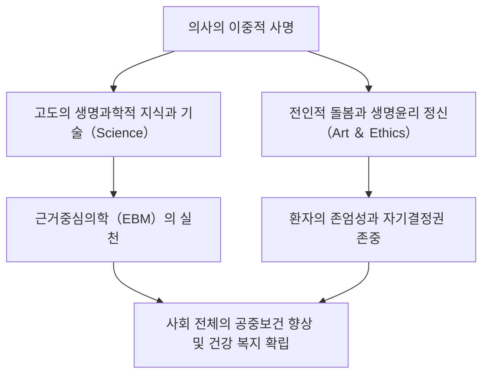
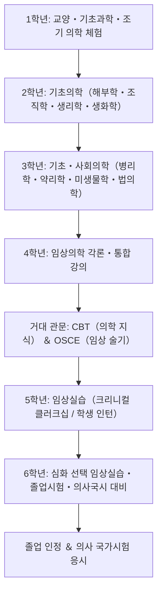
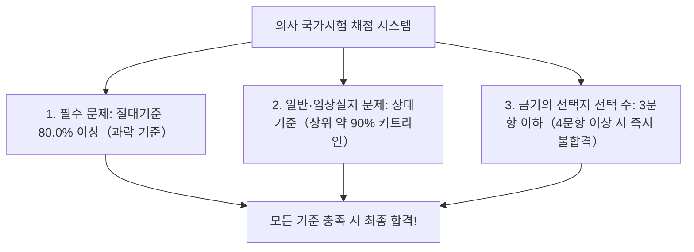
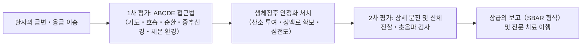
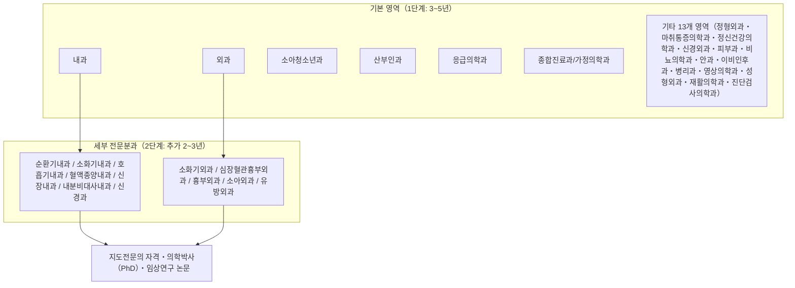
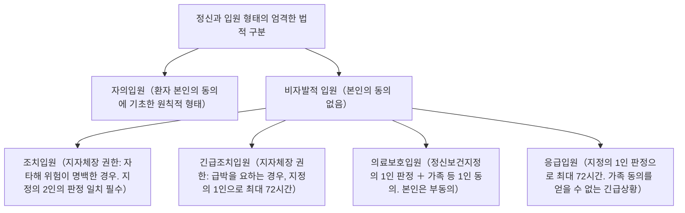
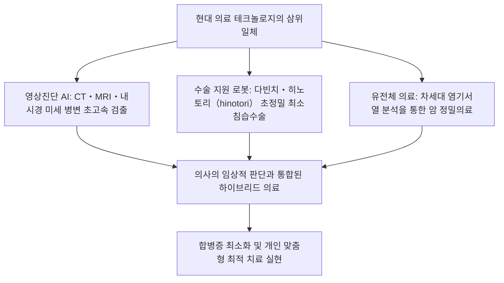

## 1. 서론: 인간의 생명을 다루는 성직과 과학의 교차점

### 1.1 의사 직무의 본질: '의도(醫道)'의 정신과 근대 자연과학의 통합

의사라는 직업은 인류 역사 속에서 언제나 각별한 경외의 대상이었다. 태고의 주술사나 종교적 치유자에서 태동하여, 근대 자연과학의 눈부신 발전을 거치며 오늘날의 의사는 '고도의 생명과학을 다루는 테크노크라트(Technocrat)'인 동시에, '타인의 고통과 죽음 곁을 지키는 윤리적 실존'이라는 이중적 사명을 짊어지고 있다.

질병에 쓰러져 죽음의 공포와 직면한 인간은, 자신의 가장 취약하고 무방비한 육체와 정신을 의사 앞에 온전히 드러낸다. 의사가 메스를 쥐고 살을 가르며, 극약을 투여하고, 환자의 신체 내부를 비가역적으로 침습하는 행위는 형법상 상해죄의 구성요건에 해당한다. 그럼에도 이것이 정당한 의료행위(형법 제35조의 정당업무행위)로서 위법성이 조각되고 사회적으로 숭고한 존경을 받는 근거는, 오로지 **"의사가 고도의 지식과 술기를 연마하여 오직 인명 구조와 건강 증진을 위해 성실히 헌신한다"는 국가 및 시민사회와의 절대적인 신탁 계약** 에 기초한다.

의사의 직무는 단순한 질병(Disease: 생물학적·병리학적 이상)의 치료에만 머무르지 않는다. 그 질병으로 인해 고뇌하고 절망하는 인간(Illness: 주관적 고통의 총체적 체험)을 전인적으로 치유하는 '의도(醫道, The Art of Medicine)'의 추구야말로, 인공지능(AI)이나 로봇공학이 아무리 눈부시게 발전하더라도 결코 대체할 수 없는 의사의 고유한 본질이다.

---

### 1.2 히포크라테스 선서, 제네바 선언, 리스본 선언의 역사적 변천

의료윤리의 원점은 고대 그리스 '의학의 아버지' 히포크라테스(기원전 460년경–370년경)와 그의 제자들이 기초한 '히포크라테스 선서(Hippocratic Oath)'로 거슬러 올라간다.
- 의신 아폴론, 아스클레피오스에 대한 맹세
- 자신의 능력과 판단에 따라 환자에게 유익한 치료법을 베풀고, 위해와 부정을 배제할 것
- 간청을 받더라도 결코 치사약을 주지 않으며, 낙태를 권하지 않을 것
- 평생 순결과 경건을 유지하며, 칼을 사용하는 결석 수술은 숙련된 전문 술자에게 맡길 것
- 진료 현장에서 알게 된 환자의 사적인 비밀을 결코 누설하지 않을 것(비밀유지 의무)

근대에 접어들어 나치 독일 의사들이 자행한 반인도적 생체실험(뉘른베르크 재판의 준엄한 고발)을 뼈저리게 반성한 세계의사회(WMA)는, 1948년 히포크라테스 선서를 현대적 시각에서 재구축한 **'제네바 선언(Declaration of Geneva)'** 을 채택하였다.
- "인류에 대한 봉사에 나의 생애를 바칠 것을 엄숙히 서약한다"
- "환자의 건강을 나의 첫 번째 배려로 삼을 것"
- "인종, 종교, 국적, 정당, 사회적 신분으로 인해 환자를 차별하지 않을 것"
- "위협을 받더라도 인도주의에 반하여 나의 의학 지식을 사용하지 않을 것"

나아가 1981년, 환자의 권리를 세계 표준으로 명문화한 **'리스본 선언(WMA Declaration of Lisbon on the Rights of the Patient)'** 이 채택되어, '양질의 의료를 받을 권리', '자신의 진료기록 정보를 알 권리', '충분한 사전 설명에 기반한 자기결정권(Informed Consent)', '의식불명 환자에 대한 대리동의권', 그리고 '존엄하게 죽음을 맞이할 권리'가 확립되었다. 의사의 권위주의적 온정주의(가부장적 지배, Paternalism)로부터 환자 중심의 동반자적 파트너십으로의 패러다임 전환이 비가역적으로 완성된 것이다.

---

### 1.3 일본 의사법 제1조의 숭고한 의무

일본 법체계에서 의사의 신분과 의무를 규정한 기본법률은 바로 '의사법(쇼와 23년 법률 제201호)'이다. 그 제1조에는 의사의 숭고한 사명이 극히 장중한 필치로 명시되어 있다.

> **"의사는 의료 및 보건지도를 장악함으로써 공중보건의 향상 및 증진에 기여하고, 이로써 국민의 건강한 생활을 확보하는 것을 사명으로 한다."**

이 조항은 의사의 시야가 눈앞의 개별 환자를 치료하는 일(미시적 관점)에만 머무르는 것이 아니라, 사회 전체의 감염병 대책, 환경위생, 예방의학, 보건의료 정책이라는 공중보건의 전반적 향상(거시적 관점)에까지 뻗쳐 있음을 명확히 규정한다. 의사 면허란 국가가 개인에게 부여하는 특권이 아니라, 국민의 생명을 수호하기 위해 짊어지워진 막중하고 숭고한 공적 책무의 징표인 것이다.

---

## 2. 의대 6년간의 방대한 교육과정과 관문

의사가 되는 길은 극도로 험난하고 장대하다. 일본에서 의사 면허를 취득하기 위해서는 대학 의학부(또는 의과대학)의 6년 정규 과정을 반드시 수료해야 한다. 의대의 커리큘럼은 문부과학성이 제정한 '의학교육 모델 코어 커리큘럼'에 의해 엄격하게 표준화되어 있다.

---

### 2.1 1~2학년: 교양교육과 기초의학의 여명

#### 인체 해부학 실습의 윤리와 의학적 의의
2학년에 마주하는 최초이자 가장 심대한 정신적 시련은 바로 '인체 해부학 실습(Gross Anatomy)'이다. 학생들은 수개월에 걸쳐, 오직 의학 발전을 위해 자신의 육신을 헌체(獻體)한 고인의 시신과 마주하게 된다.
- 포르말린 방부액의 코를 찌르는 자극적인 냄새 속에서 피부를 절개하고, 피하지방을 박리하며, 혈관, 신경, 근육, 뼈, 내장 장기를 하나하나 정밀하게 동정해 나간다.
- 메스를 대기 전, 전 학생이 고개 숙여 묵념을 올리고 헌체자와 유가족의 숭고한 결단에 깊은 감사를 표한다.
- 3차원 공간 속 인체의 정교무비한 구조를 오감을 통해 뇌리에 각인하는 동시에, 의학도로서 '타인의 죽음'을 직접 손으로 접하고 그 무거운 생명의 무게를 평생 짊어지겠다는 각오를 다지는 의학교육 최고의 통과의례이다.

#### 생리학, 생화학, 조직학
- **생리학**: 심장 활동전위의 발생 기전(나트륨-칼륨 펌프, 탈분극과 재분극), 신장의 사구체 여과와 세뇨관 재흡수, 내분비 호르몬의 피드백 메커니즘 등 생명 현상의 물리화학적 원리를 체계적으로 학습한다.
- **생화학**: 구연산 회로(TCA 회로), 산화적 인산화, 포도당 신생합성, 지질 대사, 단백질 합성, DNA 복제와 전사·번역 등 분자 수준의 복잡한 대사 경로를 완벽히 이해하고 암기한다.
- **조직학**: 광학현미경 및 전자현미경 하에서 상피조직, 결합조직, 근육조직, 신경조직의 미세구조를 세밀히 스케치하며, 형태학적 구조와 생체 기능 간의 유기적 상관관계를 체득한다.

---

### 2.2 3~4학년: 병태생리와 임상의학의 체계

3학년부터 4학년에 걸쳐서는 질병의 발생 기전(기초의학의 임상적 응용)과 각 임상 분과별 질환의 진단 및 치료법을 배우는 '임상의학' 단계로 본격 진입한다.

- **병리학**: 세포와 조직의 형태학적 변화(염증, 괴사, 종양화, 이형도, 세포자멸사/아포토시스)를 통해 질병의 본질을 병리학적으로 해독한다.
- **약리학**: 약물의 수용체 결합 메커니즘, 약동학(흡수, 분포, 대사, 배설: ADME), 항균제의 작용 기전과 내성균 발생, 항고혈압제 및 항암제의 표적 치료 메커니즘을 규명한다.
- **내과학 각론**: 순환기내과(급성 심근경색, 부정맥, 심부전), 호흡기내과(폐암, 만성폐쇄성폐질환 COPD, 간질성 폐질환), 소화기내과(위궤양, 간경변증, 대장암), 신장내과(신증후군, 만성콩팥병 CKD), 내분비대사내과(당뇨병, 갑상선 질환), 혈액종양내과(백혈병, 악성 림프종), 신경과, 류마티스 알레르기내과.
- **외과학 각론**: 소화기외과, 심장혈관외과, 흉부외과, 신경외과, 정형외과 등의 수술 적응증, 수술 전후 집중 관리, 쇼크에 대한 응급 소생술.
- **소아청소년과·산부인과·정신건강의학과**: 신생아의 선천성 기형부터 발달장애, 주산기 관리(분만, 임신중독증/임신성 고혈압), 조현병과 우울증의 약물치료 및 정신치료.
- **사회의학·법의학·공중보건학**: 역학 통계, 감염병예방법, 산업보건, 독성학, 변사 사건의 사인 규명과 사법부검·행정부검의 법의학적 감식 기술.

---

### 2.3 제1의 거대 관문: CBT와 OSCE(공용시험의 공적화)

4학년 가을, 의대생들은 병원 임상실습(병동)에 나갈 자격을 검증받는 전국 공통의 '공용시험'을 치른다. 2023년(레이와 5년)부터는 개정 의사법에 따라 공용시험이 국가자격에 준하는 '공적 시험'으로 법제화되었다.

1. **CBT(Computer Based Testing, 컴퓨터 기반 시험)**:
   - 컴퓨터 화면을 통해 약 320문항의 방대한 의학 지식 문제를 푸는 객관식 다지선다 시험.
   - 방대한 문제 은행에서 무작위로 추출되며, 문항반응이론(IRT)을 적용해 정밀하게 난이도를 보정하여 평가한다.
   - 기초의학, 임상의학, 사회의학의 전 영역을 포괄하며, 일정 정답률(통상 약 65~70% 이상)에 미달하면 가차 없이 불합격 처리되어 유급(유급 처분)된다.
2. **Pre-CC OSCE(Objective Structured Clinical Examination, 객관구조화진료시험)**:
   - 지식뿐만 아니라 실제 환자 면담(병력 청취)과 신체진찰의 술기 및 태도를 종합적으로 평가하는 실기시험.
   - 복수의 시험 스테이션(의료 면담, 두경부 진찰, 흉부 진찰, 복부 진찰, 신경학적 진찰, 응급 소생술 등)을 차례로 돌며 모의 환자(표준화 환자)나 마네킹을 상대로 술기를 시연한다.
   - 외부에서 파견된 채점관이 세밀한 체크리스트에 따라 엄격히 채점하며, 복장과 태도, 인사 예절, 환자에 대한 공감, 손 위생, 정확한 청진 및 촉진 절차를 꼼꼼히 검증한다.

두 시험에 모두 합격한 학생만이 비로소 **'학생 의사(Student Doctor)'** 칭호를 수여받고 병동 임상실습으로 나아갈 수 있다.

---

### 2.4 5~6학년: 임상실습(크리니컬 클러크십 / Clinical Clerkship)

5학년부터는 대학병원 및 지역 거점 수련병원의 각 임상 진료과를 1~2주 단위로 순회하는 '크리니컬 클러크십(진료참여형 임상실습)'이 본격화된다.
단순히 어깨너머로 지켜보던 과거의 '참관형 실습'과 달리, 현대 실습에서는 의대생이 실제 의료팀의 일원으로 병동에 정식 배치된다.
- 지도전문의의 감독 하에 담당 환자의 매일 병력 청취, 생체징후 측정, 의무기록 작성(학생 차트), 검사 결과 판독, 콘퍼런스 증례 발표(Case Presentation)를 수행한다.
- 수술실에서는 철저한 외과적 손 씻기를 마친 뒤 멸균 가운을 착용하고 제2·제3조수로서 수술 시야 확보를 위한 견인기 견인(鉤引き)과 봉합사 절단 등을 맡는다.
- 채혈, 말초정맥로 확보(수액 라인 거치), 외과적 봉합 및 매듭 묶기 등 기본 술기를 지도전문의의 엄격한 지도 아래 체득한다.
- 6학년에 이르면 각 의과대학별로 가혹한 '졸업종합시험(졸시)'이 실시된다. 의사 국가시험 합격률을 일정 수준 이상으로 유지하기 위해, 학력이 부족한 학생을 가차 없이 유급시키는 필터링 제도가 존재하며, 이를 돌파한 자만이 의사 국가시험 응시표를 손에 쥘 수 있다.

---

## 3. 의사 국가시험의 구조와 합격의 분수령

의사 국가시험은 후생노동성이 주관하며, 매년 2월 초 이틀에 걸쳐 치러지는 초대형 국가시험이다.

### 3.1 시험의 구성과 출제 기준

총 400문항으로 구성되며, OMR 마킹 방식(일부 계산 문제 및 복수 정답 선택)으로 출제된다.

| 시험 블록 | 문항 수 | 시험 시간 | 출제 내용 |
| :--- | :---: | :---: | :--- |
| **A문제** | 75문항 | 135분 | 각론·총론（임상실지·일반 문제） |
| **B문제** | 50문항 | 80분 | **필수 문제（일반·임상실지）** |
| **C문제** | 75문항 | 135분 | 각론·총론（장문 증례 문제 등） |
| **D문제** | 75문항 | 135분 | 각론·총론（기초·사회의학 등） |
| **E문제** | 50문항 | 80분 | **필수 문제（의료안전·공중보건）** |
| **F문제** | 75문항 | 135분 | 각론·총론（임상종합 문제） |

---

### 3.2 3대 합격 기준과 '필수 80%'의 공포

의사 국가시험의 합격 판정은 아래의 **3가지 기준을 동시에 모두 충족해야만 한다**. 단 하나라도 미달하면 즉시 불합격 처리된다.

1. **필수 문제의 절대 과락 기준(80.0% 기준)**:
   - 필수 문제(총 100문항, 200점 만점)는 **득점률 80.0%(160점 이상)가 절대 조건** 이다.
   - 일반 및 임상실지 문제에서 만점에 가까운 고득점을 기록하더라도, 필수 문제에서 단 1점이 부족하면 가차 없이 불합격 처리된다. 이 때문에 수험생들은 극도의 중압감으로 떨리는 손을 쥐어가며 OMR 카드를 채워나간다.
2. **일반 문제·임상실지 문제의 상대평가 기준**:
   - 일반 문제와 임상실지 문제는 상대평가로 판정되며, 당해 연도 전체 수험생의 점수 분포에 따라 하위 약 10%를 탈락시키는 커트라인(대략 득점률 68~72% 선)이 결정된다.
3. **금기의 선택지(Contraindication)의 함정**:
   - 수험생들이 가장 두려워하는 것이 바로 '금기의 선택지(금기지)'이다. 의사로서 결코 해서는 안 될 **'환자를 사망에 이르게 할 수 있는 중대한 의료과오', '인권을 침해하는 행위', '명백한 실정법 위반'** 에 해당하는 선택지를 고를 때마다 금기 카운트가 1회씩 누적된다.
   - 통상적으로 **금기의 선택지를 4문항(연도에 따라 3문항) 이상 밟았을 경우, 총점이 합격선을 아득히 상회하더라도 무조건 일발 불합격** 처리된다.
   - (예: 뇌출혈 의심 환자에게 항응고제를 투여하는 행위, 아나필락시스 쇼크에 에피네프린 대신 스테로이드만 단독 투여하고 지켜보는 행위, 유기인 중독 환자에게 아트로핀 대신 금기 약제를 쓰는 행위, 환자 본인의 동의 없이 오직 가족의 요구만으로 비자의적 정신과 강제입원을 결정하는 행위 등).

---

## 4. 초기 임상연수(2년)의 시련: 수퍼 로테이션 제도

국가시험에 합격하고 의적(醫籍)에 등록되어 의사 면허증을 교부받더라도, 곧바로 단독 개원하거나 독립하여 환자를 진료하는 것은 법률상 엄격히 금지되어 있다(의사법 제16조의2). 의사는 반드시 2년간의 '임상연수(수련의 과정)'를 이수해야만 한다.

### 4.1 2004년 신의사 임상연수제도 개혁의 충격

2004년(헤이세이 16년) 이전의 구 제도에서는, 의대 졸업생들이 졸업 직후 모교 대학병원의 특정 '의국'(제1내과, 제2외과 등)에 직행하여 평생 좁은 세부 영역의 수련만을 받았다. 그 결과 "소화기 분야의 권위자이지만 단순 골절이나 안과 질환, 초기 심폐소생술은 전혀 손대지 못한다"는 전문 분야 편중의 심각한 폐해가 발생했다.

이를 타파하기 위해 도입된 제도가 바로 '수퍼 로테이션 제도(신임상연수제도)'이다.
- **기본 진료 능력 습득의 의무화**: 지망 분과와 상관없이 모든 수련의가 내과(6개월 이상), 응급의학과(3개월 이상), 지역의료(1개월 이상)를 필수로 이수하고, 소아청소년과, 산부인과, 정신건강의학과, 외과를 폭넓게 순환 근무함으로써 일차의료(Primary Care) 및 전인적 진료 역량을 갖추도록 의무화했다.
- **인턴 매칭 시스템 도입**: 수련의 배치가 대학 의국 교수의 일방적 명령이 아니라, 의대생과 수련병원이 각각 희망 순위를 등록하면 알고리즘(게일-섀플리 안정 결혼 알고리즘, Gale-Shapley Algorithm)을 통해 자동으로 매칭되는 '의사 임상연수 매칭 협의회' 시스템이 도입되었다.
- 이로 인해 우수한 당직 수당과 충실한 임상 지도 체계를 갖춘 도심의 유명 민간 거점 수련병원(세인트루크/성루카, 도라노몬, 구라시키 중앙, 가메다 종합병원 등)으로 지원자가 집중되었고, 반면 지방 대학병원의 의국이 붕괴하여 지방의 심각한 의사 부족(지역의료 붕괴)을 초래하는 구조적 사회 문제를 낳기도 했다.

---

### 4.2 주니어 레지던트(수련의)의 혹독한 일상과 임상 술기 습득

초기 연수의(주니어 레지던트)로서의 2년은, 의사의 전 생애에서 가장 밀도 높고 혹독한 배움의 시기이다.

- **응급실 당직의 격무**: 제 발로 걸어 들어오는 경증 환자부터 심정지(CPA/OHCA) 상태로 응급 이송되는 위중증 환자까지 쉴 새 없이 밀려든다. 수련의는 응급의학과 상급의의 지도 아래 **'ABCDE 접근법'**(Airway 기도, Breathing 호흡, Circulation 순환, Dysfunction of CNS 중추신경 기능장애, Exposure 체온 및 환경 노출)에 근거하여 찰나의 순간에 중증도를 신속히 분류(트리아지)한다.
- **필수 침습적 술기의 체득**:
  - 동맥혈 가스 분석 채혈(요골동맥 천자)
  - 외상 초음파 검사(FAST 프로토콜을 이용한 복강 내 급성 출혈 신속 확인)
  - 중심정맥관(CVC) 삽입술(초음파 유도하 내경정맥 천자 및 관 삽입)
  - 기관 내 삽관(후두경을 통한 성문 시야 확보 및 튜브 거치)
  - 요추천자(뇌수막염 진단을 위한 뇌척수액 채취)
  - 흉관 삽관술, 복수 천자술
- **사망 선고와 임종 고지**: 처음으로 환자의 심정지를 확인하고, 동공 산대, 대광반사 소실, 평탄한 심전도를 직접 확인하며 사망진단서를 작성하는 순간; 복도로 걸어 나가 오열하는 유가족에게 환자의 임종을 전하는 그 비통한 순간을 통해, 의사로서 짊어져야 할 생명의 무게와 무한한 책임감이 뼈 속 깊이 아로새겨진다.

---

## 5. 신전문의 제도의 전모: 기본 19개 영역과 세부 전문분과

2년간의 초기 임상연수를 성공적으로 마치면, 의사는 '후기 연수의(전공의 / 시니어 레지던트)'가 되어 자신의 평생 전문 분야를 최종 선택한다. 2018년(헤이세이 30년)부터 본격 가동된 '신전문의 제도'는 일반사단법인 일본전문의기구가 통일된 기준 아래 심사 및 인증을 관할하는 2단계 피라미드 구조로 구축되어 있다.

---

### 5.1 기본 19개 영역의 체계

전공의는 아래의 **19개 기본 영역** 프로그램 중 하나에 소속되어 3~5년간 고강도의 전문의 수련을 받는다.

| 기본 전문영역 | 연수 기간 | 주요 전문성 및 특징 |
| :--- | :---: | :--- |
| **내과** | 3년 | 방대한 증례 등록（J-OSLER 시스템을 통해 수백 개 증례 및 병력 요약 제출 의무화）. 세부 내과 진입을 위한 필수 관문. |
| **외과** | 3~4년 | 소화기, 심장, 흉부, 소아외과의 종합 기초. NCD（National Clinical Database）에 집도 수술 증례 등록 의무화. |
| **소아청소년과** | 3년 | 신생아 집중치료（NICU）, 소아 응급, 감염병, 발달장애, 알레르기 질환의 포괄적 진료. |
| **산부인과** | 3년 | 주산기 의료（정상·이상 분만, 제왕절개）, 부인과 종양 수술, 난임 및 생식의학. |
| **응급의학과** | 3년 | 다발성 외상, 패혈성 쇼크, 중독, 중증 화상, 중환자실（ICU） 집중치료, 병원 전 처치（닥터헬기）. |
| **종합진료과** | 3년 | 신설 분과. 지역사회 통합 케어, 복합 만성질환（Multimorbidity） 환자 관리, 일차의료/가정의학. |
| **정형외과** | 3~4년 | 골절, 인공관절 치환술, 척추 수술, 스포츠 의학, 근골격계 재활. |
| **마취통증의학과** | 4년 | 전신마취, 경막외마취, 통증클리닉, 중환자 관리, 수술기 위기관리. |
| **정신건강의학과** | 3년 | 정신보건지정의 자격 취득 요건과 연동. 우울증, 양극성 장애, 조현병, 치매의 약물 및 정신치료. |
| **신경외과** | 4년 | 뇌동맥류 결찰술, 뇌종양 적출술, 뇌혈관 내 카테터 중재시술, 중증 두부외상 수술. |
| **영상의학과** | 3년 | 영상진단（CT, MRI, PET 판독） 및 인터벤션 시술（IVR, 영상유도 중재시술）, 방사선 치료. |
| **병리과** | 3년 | 수술 중 신속동결절편 진단, 생검 조직병리 진단, 병리부검（CPC: 임상병리 콘퍼런스）. |
| **기타 영역** | 3~4년 | 피부과, 비뇨의학과, 안과, 이비인후과, 성형외과, 재활의학과, 진단검사의학과. |

---

### 5.2 세부 전문분과(서브스페셜티)로의 심화와 의학박사(PhD)

기본 영역 전문의 자격을 취득한 후, 의사는 더욱 고도화되고 세분화된 '세부 전문분과(2단계 영역)' 전문의(순환기내과 전문의, 소화기병 전문의, 소화기내시경 전문의, 심장혈관외과 전문의, 종양내과 전문의 등)를 향해 수련을 이어간다.

아울러 대다수의 의사는 대학원 의학연구과(박사과정 4년)에 진학하여, 기초의학연구소나 임상연구실에서 분자생물학, 종양면역학, 차세대 유전체 분석 등의 첨단 실험 연구를 수행한다. 그리고 국제 저명 동료평가(Peer-Reviewed) SCI 영문 학술지에 제1저자로 원저 논문을 게재함으로써 **'의학박사(PhD)'** 학위를 취득한다. 임상 최전선에서 환자를 진료하면서도, 학계에서 전 세계의 미정복 질환에 맞서 새로운 에비던스(의학적 근거)를 창출하는 학술 연구자로서의 면모를 겸비하는 것이다.

---

---

## 2.5 임상의학의 심층 병태와 약동학/약력학(PK/PD 이론)의 수리

의대생이 임상의학을 공부할 때, 단순한 질병명과 증상의 기계적 암기를 지양하고 분자생물학 및 수리약리학에 입각한 과학적 치료 방침을 수립하기 위해 반드시 정복해야 할 핵심 개념이 바로 **'PK/PD 이론(Pharmacokinetics / Pharmacodynamics, 약동학/약력학 이론)'** 이다.

### 약동학(PK)의 핵심 파라미터
- **혈중농도-시간 곡선하면적(AUC: Area Under the Curve)**: 체내에 투여된 약물이 전신 순환 혈액 내로 유입된 총 생체 노출량을 나타내는 지표.
- **최고혈중농도(Cmax)**: 약물 투여 후 혈중에서 도달하는 농도의 최댓값(피크치).
- **분포용적(Vd)**: 약물이 체내 조직으로 쉽게 이행하는지(지용성), 혹은 혈장 내에 주로 머무르는지(수용성)를 나타내는 가상 용적.

### 항균제 PK/PD 파라미터의 3대 분류
세균 감염증 치료에서 항생제는 최소발육억제농도(MIC: Minimum Inhibitory Concentration)와 혈중 약물 농도의 상관관계에 따라 아래의 3가지 패턴으로 엄격히 분류된다.

| 파라미터 | 약효 지표 | 대표적 항생제 | 투약 설계 전략 |
| :--- | :--- | :--- | :--- |
| **Time above MIC ($T > MIC$)** | 혈중 농도가 MIC를 초과하는 시간의 비율(%) | **페니실린계, 세펨계, 카바페넴계**($\beta$-락탐계 항생제) | 1회 투여량을 무리하게 늘리기보다, **투여 횟수를 늘리거나(1일 3~4회 분할 투여)** 점적 정맥주사 시간을 연장(장시간 지속 투여)하여 살균 효과를 극대화한다. |
| **$Cmax / MIC$** | 최고 혈중 농도가 MIC의 몇 배에 도달하는가 | **아미노글리코사이드계**(겐타마이신, 아미카신) | 분할 투여를 피하고, **1일 1회 대량 투여** 를 통해 급격한 피크 농도를 형성시켜 농도 의존적 살균력과 항생제 투여 후 효과(PAE)를 극대화한다(신독성 및 이독성 저감에도 기여). |
| **$AUC / MIC$** | 24시간 총 약물 노출량과 MIC의 비율 | **뉴퀴놀론계, 반코마이신**(글리코펩타이드계) | 1일 총 투여량을 확보하면서, 반코마이신의 경우 치료약물농도감시(TDM)를 시행하여 최저혈중농도(트러프 농도, 다음 투여 직전 농도)를 $15 \sim 20 \mu g/mL$ 로 엄격히 제어한다. |

---

## 3.6 의사 국가시험의 난관: 공중보건 법규와 정신보건복지법의 법적 해석

의사 국가시험에서 가장 많은 수험생들을 고뇌에 빠뜨리는 영역이 바로 '공중보건학 및 의료관계법규' 단원이다. 단순한 의학적 임상 지식뿐만 아니라, 법률 전문가 못지않은 엄격한 실정법 요건의 암기와 법리적 해석 능력이 요구된다.

### ① 감염병예방법상 분류 체계와 의사의 법적 신고의무
일본의 '감염병 예방 및 감염병 환자에 대한 의료에 관한 법률(감염병법)'에서 감염병의 유형은 질환의 위험도, 치명률, 전파력에 따라 1류부터 5류, 그리고 지정감염병과 신종인플루엔자등감염병으로 엄밀히 구분된다.

- **1류 감염병(에볼라출혈열, 페스트, 마르부르크병, 라싸열, 크리미안-콩고출혈열, 두창, 남미출혈열)**:
  - 의사는 진단 즉시 **지체 없이 관할 보건소장을 거쳐 도도부현 지사에게 신고할 법적 절대 의무** 가 있다.
  - 특정 및 제1종 감염병 지정의료기관으로의 원칙적 강제 격리입원, 72시간 이내의 교통 차단, 오염 물건 소독 및 폐기 처분 등 막강한 공권력적 행정처분이 즉각 발동된다.
- **2류 감염병(결핵, 중증급성호흡기증후군: SARS, 중동호흡기증후군: MERS, 조류인플루엔자 H5N1/H7N9, 폴리오/소아마비)**:
  - 진단 즉시 신고. 제2종 감염병 지정의료기관으로의 입원 권고 및 조치. 결핵의 경우 잠복결핵감염(LTBI)에 대한 전액 공비부담 의료제도가 적용된다.
- **3류 감염병(콜레라, 세균성이질, 장티푸스, 파라티푸스, 장출혈성대장균감염증: O157 등)**:
  - 진단 즉시 신고. 강제 입원 조치는 없으나, 식품위생 종사자 등에 대해 대변 검사에서 음성이 확인될 때까지 특정 업무 취업 제한 처분이 부과된다.
- **4류 감염병(E형간염, A형간염, 말라리아, 광견병, 뎅기열, 황열, 일본뇌염, 레지오넬라증, 파상풍 등)**:
  - 동물, 오염된 음식물, 모기 등 매개체를 통해 전파되는 질환. 진단 즉시 신고. 인간 대 인간 비말 전파는 통상 일어나지 않으므로 강제입원이나 취업제한 조치는 없다.
- **5류 감염병**:
  - **전수 신고 대상(진단 후 7일 이내 신고)**: 홍역, 풍진, 매독, 급성뇌염, 파상풍, 침습성수막구균감염증, 후천성면역결핍증(AIDS/HIV). 단, 홍역과 풍진은 즉시 전수 신고 대상이다.
  - **표본 감시 대상(지정된 표본 의료기관이 주간·월간 단위로 보고)**: 인플루엔자, 수족구병, RS바이러스 감염증, 감염성 위장관염 등.

### ② 정신보건복지법상 다양한 입원 형태의 법적 엄격성
정신과 임상 현장에서 정신장애인의 자기결정권 보장과 자타해 위험 방지라는 상충하는 가치 사이의 엄격한 법적 균형을 규율하는 법률이 바로 '정신보건 및 정신장애자 복지에 관한 법률(정신보건복지법)'이다.

국가시험에서는 특히 '의료보호입원' 시의 법정 동의권자(배우자, 친권자, 부양의무자, 후견인 등, 및 이들이 없는 경우 기초지자체장인 시정촌장)의 우선순위와, '조치입원' 시 경찰관 통보(제24조) 및 일반인 통보(제22조)로부터 도도부현 지사의 심사 개시로 이어지는 일련의 행정 절차가 당락을 가르는 결정적인 핵심 빈출 문항이다.

---

## 4.5 응급실 당직의 수라장: 의식장애 감별 진단 도구 'AIUEO TIPS'와 급성 복증

야심한 시각 응급실 당직실에서 울리는 원내 PHS 전화. "70대 남성, 급성 의식장애, 구급차로 이송 중입니다!". 이 순간, 당직 수련의의 머릿속에서 번개처럼 구동되어야 하는 세계 표준의 의식장애 감별 진단 알고리즘이 바로 **'AIUEO TIPS'** 이다.

| 두문자 | 감별해야 할 병태 및 질환 | 응급실에서의 초기 핵심 처치 |
| :---: | :--- | :--- |
| **A** | **A**lcohol(급성 알코올 중독) / **A**cidosis(산증) | 호기 냄새 확인, 동맥혈 가스 분석(ABGA)으로 pH, 젖산 수치 확인 및 음이온 차(AG) 계산. |
| **I** | **I**nsulin(저혈당·당뇨병성 케토산증: DKA / HHS) | **가장 먼저 손가락 끝 천자로 신속 간이 혈당 측정!**(저혈당은 수십 분 내에 비가역적 뇌 손상을 초래하므로 저혈당 확인 즉시 50% 포도당 주사액 정주). |
| **U** | **U**remia(요독증) | 혈액 생화학 검사로 BUN, 크레아티닌, 칼륨 수치 확인. 응급 혈액투석 적응증 검토. |
| **E** | **E**ncephalopathy(간성뇌증·고혈압성 뇌증) / **E**lectrolytes(전해질 이상) / **E**ndocrine(갑상선 발작, 점액수종 혼수, 부신피질기능부전) | 혈중 암모니아 수치 측정, 혈청 나트륨 수치 평가(저나트륨혈증 급격한 교정 시 삼투성 탈수초 증후군: ODS 위험 경계). |
| **O** | **O**xygen(저산소혈증) / **O**verdose(급성 약물 중독) / **O**piate(오피오이드 중독) | 맥박산소포화도, 동맥혈 가스 분석. 축동 및 호흡 억제 확인 시 날록손(Naloxone, 길항제) 즉각 투여. |
| **T** | **T**rauma(두부 외상) / **T**emperature(저체온증·중증 열사병) | 응급 뇌 CT(급성 경막하혈종·경막외혈종 배제), 직장 체온(심부체온) 측정. |
| **I** | **I**nfection(중추신경계 감염: 뇌수막염·뇌염, 중증 패혈증) | 경부 경직, 커닉 징후, 죨트 악화 징후. 혈액배양 2세트 채취 후 즉시 경험적 항생제(세프트리악손＋반코마이신＋암피실린) 투여 및 요추천자. |
| **P** | **P**sychiatric(심인성·해리성 장애) / **P**orphyria(포르피린증) | 모든 기질적 및 대사성 질환을 철저히 배제한 후에야 비로소 신중히 고려. |
| **S** | **S**troke(뇌졸중: 뇌경색·뇌출혈·지주막하출혈) / **S**eizure(뇌전증 지속상태) / **S**hock(저혈량성·심인성·폐쇄성·분포성 쇼크) | 신경학적 국소 징후 확인, 신속 뇌 MRI(확산강조영상 DWI) 및 뇌 CT. rt-PA 정맥주사 요법(발병 4.5시간 이내) 또는 동맥 내 혈전제거술 적응증 신속 판정. |

의식불명 환자가 이송되었을 때 "일단 머리 CT부터 찍어보자"고 서두르는 것은 신참 수련의가 가장 저지르기 쉬운 치명적 오류이다. 저혈당이나 중증 저산소혈증을 간과한 채 환자를 CT실로 이동시켰다가는, 검사대 위에서 심정지를 초래하게 된다. **"Vital signs first, then Glucose, ABCDE stabilization!(생체징후 우선, 혈당 즉시 측정, ABCDE 안정화 먼저!)"** 라는 이 절대 철칙은 수많은 환자의 생명과 맞바꿔 체득된, 모든 응급의의 골수에 새겨진 황금률이다.

---

## 5.5 의사의 커리어 패스, 가혹한 경제적 현실과 평생교육의 진실

### 봉직의와 개원의의 구조적 격차와 야간 당직 아르바이트의 실상
일반 사회에서는 흔히 '의사＝막대한 고소득자'라는 단편적인 고정관념을 가지기 쉽지만, 현실의 세계에서는 의사의 경력 단계와 근무 형태에 따라 극심한 계층 분화와 경제적 격차가 존재한다.

1. **대학병원 봉직의의 가혹한 경제적 현실**:
   - 2년 차 초기 연수의의 연봉은 일본 전국 평균 약 350만~450만 엔 수준에 불과하다.
   - 후기 전공의로서 대학병원 의국에 소속될 경우, 기본급여는 월 20만~30만 엔 전후에 머무는 경우도 흔하다. 살인적인 병동 당직, 학회 발표 준비, 임상연구 논문 집필에 쫓기면서도, 주 1~2회 외곽지역 응급병원이나 만성기 요양병원으로 야간 당직 아르바이트(1회 당직당 약 4만~8만 엔 수령)를 뜀으로써 겨우 생계비를 보전하는 것이 엄연한 현실이다.
   - 30대 중반에 의학박사 학위를 취득하고 조교수나 강사로 승진하더라도, 대학병원에서 지급하는 기본 연봉은 600만~800만 엔대에 머무는 경우가 부지기수이다.
2. **지역 거점 수련병원 봉직의(중견 임상의)**:
   - 30대 후반에서 40대에 이르러 지역 종합병원이나 유력 민간 거점병원의 과장·부장급으로 재직하는 경우, 연봉은 대략 1,200만~1,800만 엔 선을 형성한다. 그러나 이 소득에는 끝없는 온콜(대기 호출), 휴일 응급 수술 호출, 밤샘 당직이라는 극심한 육체적 혹사가 전제되어 있다.
3. **클리닉 개원의(개인 의원 개원)**:
   - 40대 이후 자기 자본과 수천만~수억 엔대의 막대한 은행 대출을 끌어안고 단독 개원하여 경영이 궤도에 오를 경우, 연간 순소득 2,500만~4,000만 엔 이상을 달성하는 것도 가능하다. 그러나 이는 의사 본연의 임상 진료 외에도 노무·인사 관리, 자금 조달 및 현금 흐름, 고가 의료장비 감가상각 투자, 마케팅 홍보 등 '사업 경영자로서의 무거운 전방위적 책임'과 '무한책임의 도산 위험'을 고스란히 떠안는 대가이다.

### 의료소송 리스크와 의사배상책임보험
모든 임상의사는 언제 터질지 모를 '의료과오 소송'이라는 삶을 파멸시킬 수 있는 거대한 리스크와 마주하며 매일 진료에 임한다.
- 분만 과정에서 신생아 가사로 인한 뇌성마비(산과의료보상제도가 마련되어 있으나, 민사 손해배상 소송으로 비화될 경우 1억~2억 엔대의 천문학적 배상 판결이 내려지기도 한다).
- 수술 후 심부정맥혈전증에 기인한 치명적 폐색전증(이코노미클래스 증후군) 급사, 항암치료 중 급성 부작용 대처 지연, 영상 판독에서의 미세 조기 악성종양 누락.
- 이에 따라 일본의사회나 각 전문학회가 주관하는 '의사배상책임보험' 가입은, 모든 임상의사에게 있어 스스로를 지키기 위한 절대적 필수 생존 조건이 되었다.

## 6. 의사에게 필수적인 법규·제도·의료윤리

의사의 일상적인 진료 행위는 촘촘한 법률의 그물망에 의해 엄격히 규율된다. 법규범을 가볍게 여긴 의사는 면허 취소, 의업 정지(의사법 제7조에 근거한 행정처분), 형사 기소, 나아가 수천만 엔에서 수억 엔에 달하는 민사 손해배상 청구의 파멸적 파국에 직면한다.

### 6.1 의사법 중요 조문의 해부

#### ① 응소의무(진료거부 금지 의무, 의사법 제19조 제1항)
> "진료에 종사하는 의사는 진찰이나 치료의 요구가 있을 때에는, 정당한 사유가 없으면 이를 거부하지 못한다."

전통적 법리에서는 "의사는 어떤 상황에서도 환자의 진료를 거부할 수 없다"고 절대적으로 해석되었으나, 2019년(레이와 원년) 후생노동성 통달을 통해 현대적 해석 기준이 명확히 확립되었다.
- 정규 진료시간 내에는 의사가 부재중이거나 자신의 전문 과목이 아닐지라도, 응급 처치를 시행하거나 즉시 적절한 타 의료기관으로 전원 및 의뢰할 법적 의무가 있다.
- 반면 진료시간 외의 경우, 당해 의료기관이 응급의료 지정병원이 아니거나, 환자가 만취 난동, 폭언·폭행, 악의적 진료비 미납 등 현저한 방해 행위를 일삼는 경우, 또는 의사가 극도의 과로 및 질병으로 객관적 의료 안전을 담보할 수 없는 상황에서는 '정당한 사유'에 해당하여 합법적으로 진료를 거부할 수 있다(의사의 노동권 보장과 의료 안전성 간의 균형 확보).

#### ② 무진찰 치료 금지(의사법 제20조)
> "의사는 스스로 진찰하지 아니하고 치료를 하거나 처방전을 교부하여서는 아니 되며, 스스로 출산에 입회하지 아니하고 출생증명서 또는 사산증명서를 교부하여서는 아니 된다."

환자를 직접 대면하여 진찰하지 않은 채 임의로 약을 처방하는 것은 엄격히 금지된다. 근래 급속히 확산된 '비대면 원격진료(온라인 진료)'는, 후생노동성의 '온라인 진료의 적절한 실시에 관한 지침'을 철저히 준수하고 안전성과 유효성이 입증된 특정 만성질환 및 프로토콜에 의거하는 경우에 한해서만 본 조항의 합법적 예외로서 인정된다.

#### ③ 이상사체 신고의무(의사법 제21조)
> "의사는 사체 또는 임신 4개월 이상의 사산아를 검안하여 이상이 있다고 인정할 때에는, 24시간 이내에 관할 경찰서에 신고하여야 한다."

의료사고나 원내에서의 예기치 못한 돌연사가 '이상사체'에 포함되는지 여부를 둘러싸고, 도쿄여자의대 사건, 도립 히로오병원 사건 등 최고재판소 판례를 거치며 격렬한 법리 공방이 벌어졌다. 판례는 "진료 관련 사망이라 할지라도 사체 외표에 외상 등 이상이 있거나 범죄 혐의가 의심되는 경우에는 의사에게 경찰 신고의무가 발생한다"고 판시하였으며, 이를 위반하여 은폐를 시도한 의사들에게 무거운 형사책임이 부과되었다.

---

### 6.2 사전설명동의(설명과 동의, Informed Consent)와 의료과오의 법리

민사 손해배상 소송에서 의료행위의 과실 책임(채무불이행 또는 불법행위 책임)을 묻는 양대 핵심 법리적 기둥은 바로 '주의의무 위반'과 '설명의무 위반'이다.

- **의료수준(Standard of Care)**: 의사가 준수해야 할 주의의무의 기준은, 당해 의료기관의 성격(상급종합병원인가 의원인가)이나 지역의 객관적 의료 실태를 고려하면서도, 근본적으로 "행위 당시 의학계의 평균적 양식을 가진 의사가 실천했어야 할 객관적 수준"에 의해 엄격히 판정된다.
- **사전설명동의(Informed Consent)**: 의사는 환자에게 ① 현재의 확정 진단명과 병태, ② 제안하는 치료법 및 수술의 구체적 내용, ③ 해당 치료에 수반되는 위험성, 합병증, 부작용의 발생 확률, ④ 대체 가능한 다른 치료법과 그 득실 비교, ⑤ 치료를 받지 않을 경우의 자연 경과 및 예후에 대하여 알기 쉬운 언어로 충실히 설명하고, 환자의 자유로운 진의에 기초한 동의를 받아야만 한다. 설명을 소홀히 한 채 수술을 시행하여 합병증이 발생한 경우, 설령 집도 수술 술기 자체에는 일체의 과실이 없었다 하더라도 법원은 '환자의 자기결정권 침해'를 인정하여 수천만 엔에 달하는 위자료 지급을 명령한다.

---

---

## 6.5 연명의료 결정 프로세스(ACP)와 법적 뇌사 판정의 엄격성

의사가 평생의 진료 과정에서 마주하는 가장 무겁고 심원한 윤리적 결단의 순간은 바로 '인생의 마지막 단계(임종기)'에서의 연명의료 보류 및 중단, 그리고 '법적 뇌사 판정'의 엄숙한 현장이다.

### ① 인생의 마지막 단계에서의 의료·돌봄 결정 프로세스 가이드라인
후생노동성이 제정한 가이드라인에 따라, 현대 의료에서는 **'ACP(Advance Care Planning, 사전돌봄계획; 일본 공식 애칭: 인생회의)'** 의 실천이 가장 핵심적인 원칙으로 자리 잡았다.
- 과거처럼 주치의 한 사람이 독단적으로 무의미한 연명의료(인공호흡기 부착, 승압제 지속 투여, 심폐소생술 CPR)의 시작이나 중단을 결정하는 것은 엄격히 금지된다.
- 환자 본인의 의사 확인이 가능한 경우: 환자 본인과 다학제 의료·돌봄 전문팀(주치의, 간호사, 의료사회복지사 등)이 충분한 대화를 나누며 환자의 자기결정을 최우선으로 존중한다. 시간의 흐름과 심경 변화에 따라 의사 확인은 거듭 반복되어야 한다.
- 환자 본인의 의사 확인이 불가능한 경우: 가족 등이 환자의 평소 신념이나 가치관에 비추어 진의를 추정할 수 있다면 그 추정 의사를 최대한 존중하며, 추정조차 불가능할 경우 가족과 의료팀이 다각도로 협의하여 환자에게 가장 최선의 이익이 되는 방향으로 합의 결정한다.
- **'연명의료 중단(보류)'의 형법상 위법성 조각 4요건**: 회복 불가능한 임종기 상태(죽음이 불가피함), 환자 본인의 진정한 의사에 입각한 자기결정(사전연명의료의향서 Living Will 등), 신체적·정신적 고통 완화의 극대화, 다학제 다직종 의료팀의 엄격한 합의 절차 준수라는 4대 요건을 모두 충족해야만 형법상 살인죄나 보호책임자유기치사죄의 성립이 부정된다(가와사키 협동병원 사건, 이미즈 시민병원 사건의 대법원 사법 판단).

### ② 장기이식법에 따른 법적 뇌사 판정의 6대 절대 요건
'장기의 이식에 관한 법률(장기이식법)'에서, 심장사 외에 '뇌사(Brain Death)'를 법률상 인간의 사망으로 인정하는 것은 오직 장기 기증을 전제로 하는 특수 상황에 국한된다. 그 뇌사 판정은 극도로 엄격하고 객관적인 프로토콜에 따라 2회 이상 연속으로 시행된다.

1. **심혼수(Japan Coma Scale 300 / Glasgow Coma Scale 3점)**: 외부의 그 어떤 통증이나 소리, 빛 자극에도 전혀 자발적 반응이나 반사 운동이 없는 상태.
2. **동공 산대 및 대광반사 완전 고정**: 양측 동공 직경이 $4mm$ 이상으로 확대되어 있고, 직접 및 간접 대광반사가 완전히 소실되어 있을 것.
3. **뇌간반사의 완전 소실(7대 뇌간반사 정밀 검사)**:
   - 대광반사 소실
   - 각막반사 소실(멸균 면봉으로 각막을 건드려도 전혀 눈을 깜빡이지 않음)
   - 모양체척수반사 소실(목 피부를 강하게 꼬집어도 동공이 산대되지 않음)
   - 안구두부반사 소실(머리를 좌우 상하로 빠르게 회전시켜도 안구가 전혀 움직이지 않는 '인형의 눈 현상'의 완전 소실)
   - 전정반사 소실(외이도에 얼음물을 주입하는 칼로릭 검사에서도 안구 편위나 안진이 전혀 일어나지 않음)
   - 인두반사 소실(압설자나 흡인 튜브로 인두 후벽을 강하게 자극해도 구역 반응이 없음)
   - 해소반사/기침반사 소실(기관 내 튜브 깊숙이 흡인 튜브를 넣어 자극해도 기침 발작이 일어나지 않음)
4. **평탄 뇌파(Flat EEG, 전기적 침묵)**: 국제 10-20 전극 배치법에 기초한 다채널 뇌파 기록에서, 최고 감도($2\mu V/mm$)로 최소 30분 이상 연속 기록하여 대뇌피질의 자발적 전기 활동이 완전히 편평한 일직선(전기적 정지)임을 확인.
5. **자발호흡의 완전 소실(무호흡 검사 / Apnea Test)**: 인공호흡기를 일시 분리하고 기관 튜브 내로 순산소($100\% O_2$)를 공급하면서, 동맥혈 탄산가스 분압($PaCO_2$)이 $60 mmHg$ 이상으로 상승할 때까지 관찰하여도 환자의 흉복부에서 그 어떤 자발호흡 운동도 나타나지 않음을 확인.
6. **판정 간격**: 상기 5대 조건을 완전히 충족한 후, **최소 6시간 이상**(대뇌 회복력이 강한 6세 미만 소아는 24시간 이상) 엄격한 경과 관찰을 지속한 뒤, 2인 이상의 전문의가 처음부터 완전히 동일한 검사를 재시행하여 비가역성을 최종 확증한다.

이 2회의 판정 결과가 완벽하게 일치한 시각을 기준으로, 환자의 '법적 사망 시각'이 비로소 선고된다. 의사는 의학적 과학성의 극한과, 생명의 존엄에 대한 한없는 외경심을 두 어깨에 동시에 짊어지고 이 숭고한 순간을 지키는 것이다.

## 7. 평생교육과 현대적 과제: 일하는 방식 개혁과 AI 의료의 미래

### 7.1 의사 근무방식 개혁(2024년 4월 시행)의 격동

오랜 세월 동안 일본의 세계 최고 수준의 의료 접근성과 독보적인 장수 사회는, 의사들의 '멸사봉공에 가까운 헌신적 자기희생'과 '한도 없는 시간외 야간 노동(월 100~200시간을 초과하는 당직과 온콜 대기)'이라는 가혹한 희생 위에 유지되어 온 기적이었다.

이러한 구조적인 의사 과로사 비극을 근본적으로 바로잡기 위해, 2024년(레이와 6년) 4월부터 '의사 시간외근무 상한 규제'가 역사상 처음으로 전면 시행되었다.

| 구분 수준 | 대상 병원 및 의사 | 연간 시간외근무 상한 | 월간 상한 및 제도적 특징 |
| :---: | :--- | :---: | :--- |
| **A수준** | 일반 봉직의(대부분의 병원) | **960시간** (월평균 80시간 이내) | 원칙적으로 과로사 기준선 이내로 엄격 규제. |
| **B수준** | 지역의료 확보 잠정특례(응급의료 지정병원 등) | **1,860시간** (월 최대 155시간) | 급변 완화 조치. 광역지자체(도도부현)의 특별 지정 필요. |
| **C수준** | 수련·술기 집중 연수(초기 인턴·전공의 등) | **1,860시간** (월 최대 155시간) | 단기간에 방대한 증례 경험이 필요한 집중 육성 쿼터. |

이 개혁을 통해 의사의 건강권 확보와 야간 당직 후 연속근무 제한(인터벌 규제) 측면에서는 커다란 진전을 이루었으나, 동시에 지방 중소병원으로의 파견의 철수, 야간 응급의료 수용 제한, 젊은 전공의들의 수술 집도 및 증례 경험 축소라는 새로운 차원의 의료 공급 위기가 수면 위로 대두되고 있다.

---

### 7.2 의료 DX·영상진단 AI·수술 지원 로봇과의 공존

21세기의 현대 의학은 최첨단 디지털 테크놀로지와의 급진적 융합을 통해 그 패러다임을 근본적으로 혁신하고 있다.

- **영상진단 AI**: 흉부 CT의 미세 폐암 결절, 대장내시경의 조기 용종 검출, 당뇨망막병증 판독 등에서 딥러닝 기반의 진단 보조 AI가 영상의학과 및 내시경 전문의의 '제3의 눈'으로서 일상 진료에 표준적으로 운용되고 있다.
- **수술 지원 로봇**: '다빈치(da Vinci Surgical System)' 및 일본 순수 기술로 개발된 '히노토리(hinotori)'는 술자의 손 떨림을 완전히 보정하고, 인간 손목의 한계를 뛰어넘는 다관절 기구와 초고해상도 3D 입체 확대 시야를 제공함으로써 전립선암, 위암, 직장암 로봇수술에서의 출혈량과 합병증 발생률을 획기적으로 낮추고 있다.
- **정밀의료(Precision Medicine)**: 환자의 암 조직에서 수백 종의 유전자 변이를 차세대 염기서열 분석(NGS)으로 일괄 분석하는 '차세대 암 유전자 패널 검사'를 통해, 환자 고유의 암 유전자 이상에 정확히 적중하는 분자표적치료제와 면역관문억제제를 맞춤 설계하는 오더메이드 암 치료가 현대 의학의 표준으로 자리매김했다.

그러나 인공지능과 기계공학이 아무리 신의 경지에 도달한다 할지라도, **'치료 방침의 최종 결단과 책임', '환자와 가족에 대한 가혹한 진단 고지', '삶과 죽음의 기로에서 겪는 숭고한 윤리적 갈등', 그리고 '사별 유가족의 찢어지는 비탄을 보듬는 그리프 케어(Grief Care)'** 는, 오직 온기와 영혼을 지닌 살아 숨 쉬는 의사만이 감당할 수 있는 성역이다.

---

## 8. 결론: 질병이 아닌 '아픈 사람'을 진료하는 전인적 의료의 본질

의사가 되는 길이란 끝없는 학문 탐구와 자기 수양의 대장정이다. 의대 입학에서 시작하여 국가시험, 암야의 고통을 견뎌내는 전공의 수련 시절, 전문의 취득, 그리고 날마다 쏟아져 나오는 전 세계의 최신 의학 논문을 평생 동안 탐독하는 쉼 없는 평생학습의 여정이다.

근대의학의 거성 윌리엄 오슬러 경(Sir William Osler, 1849–1919)은 후세의 젊은 의학도들에게 다음과 같은 영원불멸의 격언을 남겼다.

> **"평범한 의사는 질병을 치료한다. 위대한 의사는 질병을 가진 환자를 치료한다(The good physician treats the disease; the great physician treats the patient who has the disease)."**

생화학의 복잡다단한 대사 회로, 생리학의 엄밀한 수식, 약리학의 미세 분자구조, 해부학의 교차하는 근육과 혈관·신경 주행, 나아가 의료과오를 방지하기 위한 엄격한 실정법 조문들――그 방대한 객관적 지식을 두뇌 속에 온전히 내재화하면서도, 진료실 문을 열고 공포와 절망에 떨며 들어서는 단 한 사람의 나약한 인간을 향해, 가장 따뜻한 눈빛과 진심 어린 치유의 말을 건넬 수 있는 사람.

최정상 과학자로서의 냉철한 이성과, 같은 인간으로서의 뜨거운 온정과 자비심. 이 둘을 한 몸에 조화롭게 녹여내어 인류의 생명과 건강을 평생에 걸쳐 수호하는 것만이, '의사'라는 거룩한 소명이 가리키는 참된 도달점인 것이다.
