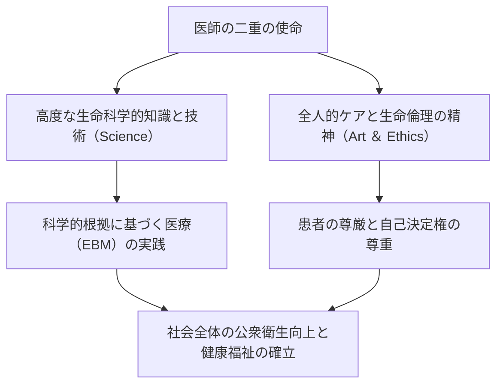
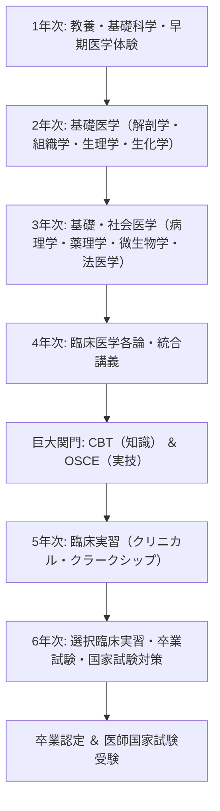
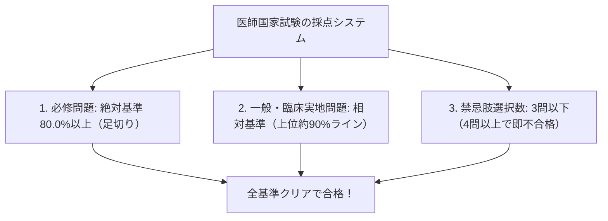
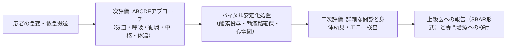
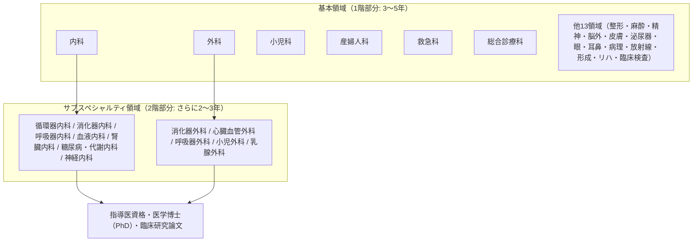
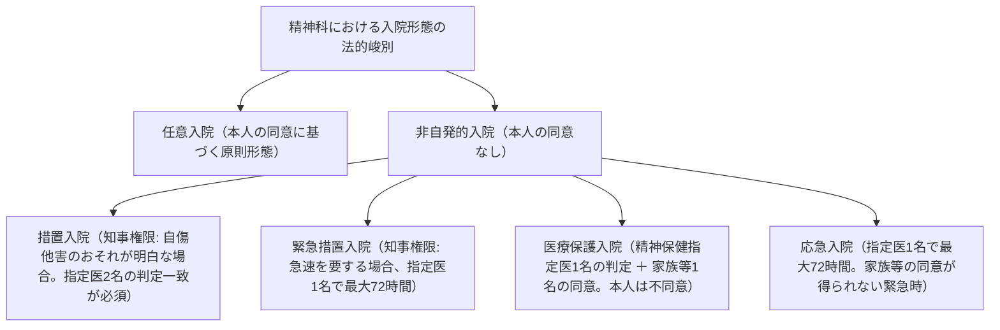
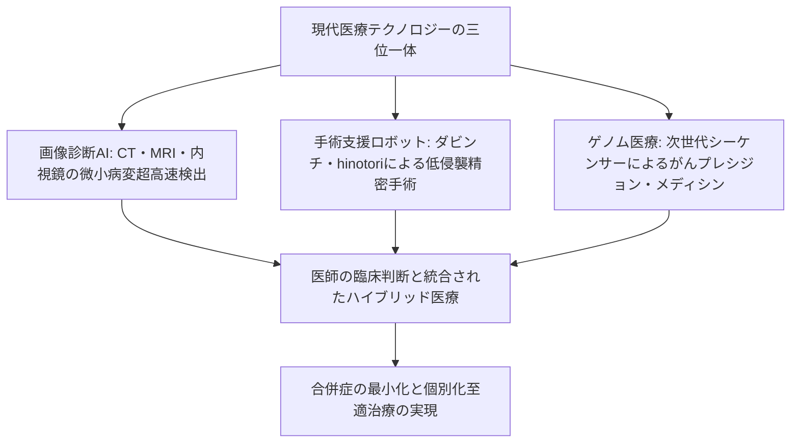

## 1. 序論：人命を預かる聖職と科学の交差点

### 1.1 医師の職務の本質：「医道」の精神と近代自然科学の統合

医師という職業は、人類の歴史において常に特別な敬畏の念をもって迎えられてきた。太古の呪術師や宗教的治癒者に端を発し、近代自然科学の目覚ましい発展を経て、今日の医師は「高度な生命科学のテクノクラート」であると同時に、「他者の苦痛や死に寄り添う倫理的実存」という二重の使命を背負っている。

病に倒れ、死の恐怖に直面した人間は、自らの最も脆弱で無防備な肉体と精神を医師の前に晒す。医師がメスを執り、劇薬を投与し、患者の身体内部を不可逆的に侵襲する行為は、刑法上の傷害罪の構成要件に該当する。それが正当な医療行為（刑法第35条の正当業務行為）として免責され、社会的に尊崇される根拠は、ひとえに **「医師が高度な知識と技能を修め、人命の救助と健康の増進のために誠実に尽くす」という国家と市民社会との間の絶対的な信託契約** にある。

医師の職務は、単なる病気（Disease: 生物学的異常）の治療にとどまらない。その病によって苦悩する人間（Illness: 主観的苦痛の体験）を全人的に癒やす「医道（The Art of Medicine）」の追求こそが、AIやロボティクスがどれほど進化しようとも代替できない医師の本質である。

---

### 1.2 ヒポクラテスの誓い、ジュネーブ宣言、リスボン宣言の歴史的変遷

医療倫理の原点は、古代ギリシャの「医学の父」ヒポクラテス（紀元前460年頃–370年頃）とその弟子たちによって起草された「ヒポクラテスの誓い（Hippocratic Oath）」に遡る。
- 医神アポロン、アスクレピオスへの宣誓
- 自らの能力と判断に従い、患者を利するよう治療法を定め、害悪と不正を排除すること
- 求められても致死薬を与えず、中絶を勧めないこと
- 生涯を通じて清浄と敬虔を保ち、メスによる結石手術は専門の術者に委ねること
- 治療の現場で知った患者の個人的秘密を決して漏らさないこと（守秘義務）

近代に入り、ナチス・ドイツの医師たちによる非人道的な人体実験（ニュルンベルク裁判の告発）を深く反省した世界医師会（WMA）は、1948年にヒポクラテスの誓いを現代版に再構築した **「ジュネーブ宣言（Declaration of Geneva）」** を採択した。
- 「人類への奉仕に自らの生涯を捧げることを厳粛に誓う」
- 「患者の健康を私の第一の考慮とすること」
- 「人種、宗教、国籍、政党、社会的位置によって患者を差別しないこと」
- 「脅迫の下にあっても、人道に反して自らの医学的知識を用いないこと」

さらに1981年、患者の権利を世界基準として明文化した **「リスボン宣言（WMA Declaration of Lisbon on the Rights of the Patient）」** が採択され、「良質な医療を受ける権利」「自らの診療記録に関する情報を知る権利」「十分な情報開示を受けた上での自己決定権（Informed Consent）」「無意識の患者に対する代理同意」「尊厳ある死を迎える権利」が確立された。医師の権威主義的パターナリズム（父権的支配）から、患者中心のパートナーシップへの転換が不可逆的に完了したのである。

---

### 1.3 日本における医師法第1条の崇高な義務

日本法において、医師の身分と義務を定めた基本法が「医師法（昭和23年法律第201号）」である。その第1条には、医師の使命が極めて格調高く謳われている。

> **「医師は、医療及び保健指導を掌ることによつて、公衆衛生の向上及び増進に寄与し、もつて国民の健康な生活を確保するものとする。」**

この条文は、医師の視野が目の前の個別患者の治療（ミクロ的視点）にとどまらず、社会全体の感染症対策、環境衛生、予防医学、健康政策という公衆衛生の向上（マクロ的視点）にまで及んでいることを明確に規定している。医師免許とは、国家が個人に与える特権ではなく、国民の生命を守るために課せられた重甚な公的責務の証書なのである。

---

## 2. 医学部6年間の膨大なる教育課程と関門

医師になるための道のりは、極めて過酷かつ長大である。日本において医師免許を取得するためには、大学医学部（または医科大学）の6年間の正規課程を修了しなければならない。医学部のカリキュラムは、文部科学省の「医学教育モデル・コア・カリキュラム」によって厳格に標準化されている。

---

### 2.1 1〜2年次：教養教育と基礎医学の黎明

#### 人体解剖学実習の倫理と医学的意義
2年次に待ち受ける最初の、そして最大の精神的試練が「人体解剖学実習（Gross Anatomy）」である。学生たちは数ヶ月間にわたり、自らの身体を学問のために献体（けんたい）された故人の遺体と向き合う。
- 遺体の防腐処理（ホルマリン浸漬）の刺激臭の中、皮膚を切開し、皮下脂肪を剥離し、血管、神経、筋肉、骨、内臓を一つひとつ丁寧に同定していく。
- メスを入れる前、学生全員が黙祷を捧げ、献体者とその遺族の崇高な意思に感謝する。
- 3次元空間における人体の精緻極まりない構造を五感を通じて叩き込むと同時に、自らが「他人の死」に触れ、その重みを背負って生きる覚悟を形成する医学教育の通過儀礼である。

#### 生理学、生化学、組織学
- **生理学**: 心臓の活動電位の発生機序（ナトリウム・カリウムポンプ、活動電位の脱分極と再分極）、腎臓における糸球体濾過と尿細管再吸収、内分泌ホルモンのフィードバック機構など、生命現象の物理化学的メカニズムを学ぶ。
- **生化学**: クエン酸回路（TCA回路）、酸化的リン酸化、糖新生、脂質代謝、タンパク質合成、DNA複製と転写・翻訳の分子レベルの経路を徹底的に暗記・理解する。
- **組織学**: 光学顕微鏡および電子顕微鏡下で、上皮組織、結合組織、筋組織、神経組織の微細構造をスケッチし、形態と機能の相関を学ぶ。

---

### 2.2 3〜4年次：病態生理と臨床医学の体系

3年次から4年次にかけては、病気のメカニズム（基礎医学の臨床応用）と、各診療科の疾患の診断・治療法を学ぶ「臨床医学」へと進む。

- **病理学**: 細胞や組織の形態学的変化（炎症、壊死、腫瘍化・異型度、アポトーシス）から病気の本質を解読する。
- **薬理学**: 薬物の受容体結合、薬物動態学（吸収・分布・代謝・排泄：ADME）、抗菌薬の作用機序と耐性菌の発生、降圧薬、抗がん剤の分子標的メカニズム。
- **内科学各論**: 循環器（急性心筋梗塞、不整脈、心不全）、呼吸器（肺がん、COPD、間質性肺炎）、消化器（胃潰瘍、肝硬変、大腸がん）、腎臓（ネフローゼ症候群、慢性腎臓病）、内分泌代謝（糖尿病、甲状腺機能異常）、血液（白血病、悪性リンパ腫）、神経内科、膠原病・アレルギー。
- **外科学各論**: 消化器外科、心臓血管外科、呼吸器外科、脳神経外科、整形外科等の手術適応、術前・術後管理、ショックへの対処。
- **小児科学・産婦人科・精神医学**: 新生児の先天性異常から発達障害、周産期管理（分娩・妊娠高血圧症候群）、統合失調症やうつ病の薬物療法・精神療法。
- **社会医学・法医学・公衆衛生**: 疫学統計、感染症法、労働衛生、中毒学、異状死因の究明と司法解剖・行政解剖の鑑識技術。

---

### 2.3 第1の巨大関門：CBTとOSCE（共用試験の公的化）

4年次の秋、医学生は臨床現場（病棟）に出る資格を問う全国統一の「共用試験」を受験する。2023年（令和5年）からは医師法改正により、共用試験は国家資格に準ずる「公的試験」として位置づけられた。

1. **CBT（Computer Based Testing）**:
   - コンピュータ上で約320問の医学知識問題を解く客観多肢選択式試験。
   - 膨大な問題プールからランダムに出題され、難易度（IRT: 項目反応理論）によって厳密に評価される。
   - 基礎医学、臨床医学、社会医学の全領域を網羅し、一定の正答率（概ね65〜70%以上）に達しない者は容赦なく不合格・留年となる。
2. **Pre-CC OSCE（Objective Structured Clinical Examination: 客観的臨床能力試験）**:
   - 知識だけでなく、実際の医療面接（問診）や身体診察の技能と態度を評価する実技試験。
   - 複数のステーション（医療面接、頭頸部診察、胸部診察、腹部診察、神経診察、救急救命処置）を順に回り、模擬患者や人形を相手に診察手技を披露する。
   - 外部から派遣された評価員がチェックリストに基づいて採点し、身だしなみ、挨拶、患者への共感、手洗い、正確な聴診・触診手順が厳格にチェックされる。

両試験に合格した者のみが **「Student Doctor」** の称号を授与され、晴れて病棟実習へと進むことができる。

---

### 2.4 5〜6年次：臨床実習（クリニカル・クラークシップ）

5年次からは、大学病院や地域の基幹病院の各診療科を1〜2週間ごとに回る「臨床実習（Clinical Clerkship: 診療参加型実習）」が始まる。
かつての「見学型実習」とは異なり、現代の実習では医学生は医療チームの一員として病棟に配属される。
- 指導医の監督下で、担当患者の毎日の問診、バイタル測定、カルテ記載（学生カルテ）、検査結果の解釈、カンファレンスでの症例プレゼンテーションを行う。
- 手術室では手洗いを行い、清潔ガウンを着用して第二・第三助手として術野の鉤引き（鈎引き）や糸切りを担当する。
- 採血、末梢静脈路確保（点滴ライン留置）、縫合結紮などの基本的手技を指導医の徹底指導のもとで習得する。
- そして6年次には、各大学で過酷な「卒業試験（卒試）」が行われる。国家試験の合格率を維持するため、大学によっては学力不足の学生を容赦なく卒業延期（留年）とするフィルターが存在し、これを突破した者だけが医師国家試験の受験票を手にすることができる。

---

## 3. 医師国家試験の構造と合格への分水嶺

医師国家試験は、厚生労働省が所管し、毎年2月上旬に2日間にわたって実施される超国家試験である。

### 3.1 試験の構成と出題基準

全400問で構成され、マークシート方式（一部計算問題や複数選択）で出題される。

| ブロック | 問題数 | 試験時間 | 内容 |
| :--- | :---: | :---: | :--- |
| **A問題** | 75問 | 135分 | 各論・総論（臨床実地・一般問題） |
| **B問題** | 50問 | 80分 | **必修問題（一般・臨床実地）** |
| **C問題** | 75問 | 135分 | 各論・総論（長文症例問題等） |
| **D問題** | 75問 | 135分 | 各論・総論（基礎・社会医学等） |
| **E問題** | 50問 | 80分 | **必修問題（医療安全・公衆衛生）** |
| **F問題** | 75問 | 135分 | 各論・総論（臨床総合問題） |

---

### 3.2 3大合格基準と「必修80%」の恐怖

医師国家試験の合否判定は、以下の **3つの基準をすべて同時に満たさなければならない** 。1つでも下回れば即座に不合格となる。

1. **必修問題の絶対足切り（80.0%基準）**:
   - 必修問題（100問・200点満点）は、 **得点率80.0%（160点以上）が絶対条件** である。
   - 一般・臨床実地問題が満点に近かったとしても、必修問題が1点でも足りなければ不合格となる。このため、受験生は重圧で手の震えと戦いながらマークシートを塗り潰す。
2. **一般問題・臨床実地問題の相対基準**:
   - 一般問題と臨床実地問題は相対評価であり、その年の受験生全体の偏差値に基づき、下位約10%が足切りされるライン（概ね得点率68〜72%前後）が設定される。
3. **禁忌肢（きんきし: Contraindication）の罠**:
   - 最も恐れられているのが「禁忌選択肢」である。医師として **「患者を死に至らしめるような重大な医療過誤」「人権を侵害する行為」「法律違反」** に該当する選択肢を選ぶと、1問ごとに禁忌肢カウントが加算される。
   - 通常、 **禁忌肢を4問（年度によっては3問）以上踏んだ場合、総得点が合格ラインを遥かに超えていても無条件で一発不合格** となる。
   - （例：脳出血の疑いがある患者に抗凝固薬を投与する、アナフィラキシーショックに対してアドレナリンではなくステロイド単独で様子を見る、有機リン中毒に対してアトロピンではなく禁忌薬を使う、家族の意向だけで本人の同意なく精神科強制入院を決定する、など）。

---

## 4. 初期臨床研修（2年間）の試練：スーパーローテート制度

国家試験に合格し、医籍に登録されて医師免許が交付されても、直ちに一人前の医師として独立して診療を行うことは法律上禁止されている（医師法第16条の2）。医師は必ず2年間の「臨床研修」を受けなければならない。

### 4.1 2004年新医師臨床研修制度改革の衝撃

2004年（平成16年）以前の旧制度では、医学部卒業生は直ちに大学病院の特定の医局（第一内科、第二外科など）に入局し、その診療科の狭い専門領域の研修だけを受けていた。その結果、「消化器の専門家だが簡単な骨折や眼の疾患、初期の救急救命が全く診られない」という専門偏重の弊害が生じていた。

これを打破するために導入されたのが「スーパーローテート制度（新臨床研修制度）」である。
- **基本診療能力の義務付け**: 診療科を問わず、すべての医師が内科（6ヶ月以上）、救急（3ヶ月以上）、地域医療（1ヶ月以上）、小児科、産婦人科、精神科、外科を幅広くローテーションし、プライマリ・ケア（初期総合診療能力）を身につけることが義務化された。
- **マッチング制度の導入**: 研修医の配属先が大学医局の命令ではなく、医学生と病院が希望順位を登録してアルゴリズム（ゲール・シャプレーの安定結婚アルゴリズム）で自動決定される「医師臨床研修マッチング協議会」の仕組みが導入された。
- これにより、当直手当や指導体制が手厚い臨床重視の市中有名病院（聖路加、虎の門、倉敷中央、亀田など）に人気が殺到し、地方大学の医局が崩壊して地方の医師不足（医療崩壊）を引き起こすという副次的な社会問題も生んだ。

---

### 4.2 ジュニアレジデント（研修医）の過酷な日常と臨床技術の獲得

初期研修医（レジデント）の2年間は、人生で最も濃密かつ過酷な学習期間である。

- **救急外来当直**: ウォークインの軽症患者から、心肺停止（CPA）で救急搬送される重篤患者までが絶え間なく押し寄せる。研修医は救急科上級医の指導の下、 **「ABCDEアプローチ」** （Airway, Breathing, Circulation, Dysfunction of CNS, Exposure）に基づいて瞬時に命の危機をトリアージする。
- **必須手技の体得**:
  - 動脈血液ガス採取（橈骨動脈穿刺）
  - 超音波（エコー）検査（FASTプロトコルによる腹腔内出血の迅速同定）
  - 中心静脈カテーテル（CVC）挿入（エコーガイド下での内頸静脈穿刺）
  - 気管挿管（喉頭鏡による声門視認とチューブ留置）
  - 腰椎穿刺（髄膜炎診断のための脳脊髄液採取）
  - 胸腔ドレナージ、腹腔穿刺
- **死の宣告と告知**: 初めて患者の心停止を確認し、瞳孔散大・対光反射消失・平坦心電図を確認して死亡診断書を書く瞬間。遺族への看取りの告知。医師としての重圧と責任感が細胞の芯まで刻み込まれる。

---

## 5. 新専門医制度の全貌：基本19領域とサブスペシャルティ

2年間の初期研修を修了すると、医師は「後期研修医（専攻医: Senior Resident）」となり、自らの生涯の専門分野を決定する。2018年（平成30年）から本格運用が始まった「新専門医制度」は、一般社団法人日本専門医機構が統一的な基準で管理・認定を行う二段構えのピラミッド構造となっている。

---

### 5.1 基本19領域の体系

専攻医は、以下の **19の基本領域** のいずれかのプログラムに所属し、3〜5年間の専門研修を受ける。

| 基本領域 | 研修期間 | 主な専門性・特徴 |
| :--- | :---: | :--- |
| **内科** | 3年 | 膨大な症例登録（J-OSLERシステムで数百症例・病歴要約の提出が義務）。サブスペ内科への必須登竜門。 |
| **外科** | 3〜4年 | 消化器、心臓、呼吸器、小児外科の総合基礎。NCD（National Clinical Database）への手術執刀症例登録。 |
| **小児科** | 3年 | 新生児医療（NICU）、小児救急、感染症、発達障害、アレルギーの包括的診療。 |
| **産婦人科** | 3年 | 周産期医療（正常・異常分娩、帝王切開）、婦人科腫瘍外科、不妊症・生殖医療。 |
| **救急科** | 3年 | 多発外傷、敗血症性ショック、中毒、熱傷、集中治療室（ICU）管理、プレホスピタル（ドクターヘリ）。 |
| **総合診療科** | 3年 | 新設領域。地域包括ケア、多疾患併存（Multimorbidity）患者のマネジメント、家庭医療。 |
| **整形外科** | 3〜4年 | 骨折、人工関節置換術、脊椎手術、スポーツ医学、リハビリテーション。 |
| **麻酔科** | 4年 | 全身麻酔、硬膜外麻酔、ペインクリニック、集中治療管理、周術期危機管理。 |
| **精神科** | 3年 | 精神保健指定医の取得要件と連動。うつ病、双極性障害、統合失調症、認知症の薬物・精神療法。 |
| **脳神経外科** | 4年 | 脳動脈瘤クリッピング、脳腫瘍摘出、脳血管内カテーテル治療、頭部外傷手術。 |
| **放射線科** | 3年 | 画像診断（CT, MRI, PETの読影）およびIVR（画像下インターベンション治療）、放射線治療。 |
| **病理** | 3年 | 術中迅速診断、生検組織診断、病理解剖（CPC: 臨床病理カンファレンス）。 |
| **他領域** | 3〜4年 | 皮膚科、泌尿器科、眼科、耳鼻咽喉科、形成外科、リハビリテーション科、臨床検査科。 |

---

### 5.2 サブスペシャルティ領域への深化と医学博士（PhD）

基本領域の専門医を取得した後、医師はさらに高度で細分化された「サブスペシャルティ領域（2階部分）」の専門医（循環器専門医、消化器病専門医、内視鏡専門医、心臓血管外科専門医、がん薬物療法専門医など）を目指して研鑽を積む。

また、多くの医師は大学院医学研究科（博士課程4年間）に進学し、基礎医学研究所や臨床研究室で分子生物学、免疫学、ゲノム解析などの実験を行い、国際的英文査読誌（Peer-Reviewed Journal）に筆頭著者として原著論文を発表して **「医学博士（PhD）」** の学位を取得する。臨床の最前線で患者を診ながら、世界中の未知の疾患に対するエビデンスを創出するアカデミアの研究者としての顔も併せ持つのだ。

---

---

## 2.5 臨床医学の深層病態と薬物動態学（PK/PD理論）の数理

医学生が臨床医学を学ぶ上で、単なる病名と症状の丸暗記を排し、分子生物学および数理薬理学に基づいた科学的判断力を涵養するための重要概念が **「PK/PD理論（Pharmacokinetics / Pharmacodynamics）」** である。

### 薬物動態学（PK）の基本パラメータ
- **体内薬物濃度推移曲線下面積（AUC: Area Under the Curve）**: 投与された薬物が全身循環血中に移行した総曝露量を示す指標。
- **最高血中濃度（Cmax）**: 薬物投与後に到達する血中濃度の最高値。
- **分布容積（Vd）**: 薬物が組織へ移行しやすいか（脂溶性）、あるいは血漿中にとどまりやすいか（水溶性）を示す容積。

### 抗菌薬のPK/PDパラメータの3大分類
細菌感染症の治療において、抗菌薬は最小発育阻止濃度（MIC: Minimum Inhibitory Concentration）と薬物濃度の関係から以下の3パターンに分類される。

| パラメータ | 薬効の指標 | 代表的な抗菌薬 | 投与設計の戦略 |
| :--- | :--- | :--- | :--- |
| **Time above MIC ($T > MIC$)** | 血中濃度がMICを超えている時間の割合（%） | **ペニシリン系、セフェム系、カルバペネム系** （$eta$-ラクタム薬） | 1回の投与量を極端に増やすよりも、 **投与回数を増やす（1日3〜4回分割投与）** または点滴時間を延長（長時間持続点滴）することで効果を最大化する。 |
| **$Cmax / MIC$** | 最高血中濃度がMICの何倍に達しているか | **アミノグリコシド系** （ゲンタマイシン、アミカシン） | 分割投与を避け、 **1日1回大量投与** によって急峻なピーク濃度を形成させ、濃度依存性の殺菌力と抗生物質後効果（PAE）を最大化する（腎毒性・聴覚毒性の低減にも寄与）。 |
| **$AUC / MIC$** | 24時間の総曝露量とMICの比率 | **ニューキノロン系、バンコマイシン** （グリコペプチド系） | 1日の総投与量を確保しつつ、バンコマイシンではTDM（治療薬物モニタリング）を行ってトラフ濃度（次回投与直前濃度）を $15 \sim 20 \mu g/mL$ に厳密に制御する。 |

---

## 3.6 医師国家試験の難所：公衆衛生法規と精神保健福祉法の法解釈

医師国家試験で最も多くの受験生を悩ませるのが「公衆衛生・医療関係法規」の領域である。医学的な知識だけでなく、弁護士顔負けの厳格な法律要件の暗記と解釈が求められる。

### ① 感染症法の分類と医師の届出義務
「感染症の予防及び感染症の患者に対する医療に関する法律（感染症法）」における感染症の類型は、その危険度と感染力に応じて1類から5類、そして指定感染症・新型インフルエンザ等感染症に分類されている。

- **1類感染症（エボラ出血熱、ペスト、マールブルグ病、ラッサ熱、クリミア・コンゴ出血熱、痘そう、南米出血熱）**:
  - **直ちに（遅滞なく）最寄りの保健所長を経て都道府県知事に届け出る義務** がある。
  - 特定・第1種感染症指定医療機関への原則強制入院、72時間以内の交通制限、物件の消毒・破棄などの強権的行政処分が発動される。
- **2類感染症（結核、重症急性呼吸器症候群: SARS、中東呼吸器症候群: MERS、鳥インフルエンザH5N1/H7N9、ポリオ）**:
  - 直ちに届出。第2種感染症指定医療機関への入院勧告・措置。結核では潜在性結核感染症（LTBI）に対する公費負担医療制度が適用。
- **3類感染症（コレラ、細菌性赤痢、腸チフス、パラチフス、腸管出血性大腸菌感染症: O157等）**:
  - 直ちに届出。入院措置はないが、食品関係者等に対する特定業務への就業制限（検便で陰性が確認されるまで）が課される。
- **4類感染症（E型肝炎、A型肝炎、マラリア、狂犬病、デング熱、黄熱、日本脳炎、レジオネラ症、破傷風等）**:
  - 動物・飲食物・蚊などを媒介とする感染症。直ちに届出。人から人への飛沫感染は通常ないため、入院や就業制限はない。
- **5類感染症**:
  - **全数届出対象（7日以内に届出）**: 麻疹（はしか）、風疹、梅毒、急性脳炎、破傷風、侵襲性髄膜炎菌感染症、後天性免疫不全症候群（AIDS/HIV）。麻疹・風疹は即時全数届出。
  - **定点把握対象（指定された定点医療機関が週単位・月単位で報告）**: インフルエンザ、手足口病、RSウイルス感染症、感染性胃腸炎など。

### ② 精神保健福祉法における各種入院形態の法的厳密性
精神科医療において、精神障害者の自己決定権と自傷他害の防止との極限の法的均衡を図るのが「精神保健及び精神障害者福祉に関する法律（精神保健福祉法）」である。

国家試験において、特に「医療保護入院」の同意権者（配偶者、親権者、扶養義務者、後見人等、およびこれらがいない場合の市町村長）の順位や、「措置入院」における警察官通報（第24条）・一般人通報（第22条）から都道府県知事への審査請求の流れは、一問のミスが合否を分ける超重要論点である。

---

## 4.5 救急外来当直の修羅場：意識障害の鑑別ツール「AIUEO TIPS」と急性腹症

当直中の初期研修医の携帯電話（PHS）が鳴り響く。「意識障害の70代男性、救急搬送されます！」。この瞬間、研修医の頭の中で瞬時に展開されなければならない思考フレームワークが、世界標準の意識障害鑑別アルゴリズム **「AIUEO TIPS」** である。

| 頭文字 | 鑑別すべき病態・疾患 | 救急外来での初期アクション |
| :---: | :--- | :--- |
| **A** | **A**lcohol（急性アルコール中毒） / **A**cidosis（アシドーシス） | 呼気臭の確認、血液ガス分析でpHと乳酸値、アニオンギャップ（AG）を計算。 |
| **I** | **I**nsulin（低血糖・糖尿病性ケトアシドーシス: DKA / HHS） | **真っ先に指先穿刺で迅速簡易血糖測定！** （低血糖は数十分で不可逆的脳死を招くため、50%ブドウ糖注射液を即時投与）。 |
| **U** | **U**remia（尿毒症） | 血液生化学でBUN、クレアチニン、カリウム値の確認。緊急血液透析の適応検討。 |
| **E** | **E**ncephalopathy（肝性脳症・高血圧性脳症） / **E**lectrolytes（電解質異常） / **E**ndocrine（甲状腺クリーゼ、粘液水腫性昏睡、副腎不全） | アンモニア値測定、血清ナトリウム値（低Na血症時の急激な補正による浸透圧性脱髄症候群: ODSのリスク警戒）。 |
| **O** | **O**xygen（低酸素血症） / **O**verdose（急性薬物中毒） / **O**piate（オピオイド中毒） | パルスオキシメーター、血液ガス。縮瞳・呼吸抑制があればナロキソン（拮抗薬）投与。 |
| **T** | **T**rauma（頭部外傷） / **T**emperature（低体温症・重症熱中症） | 頭部CT（急性硬膜下血腫・硬膜外血腫）、直腸温測定。 |
| **I** | **I**nfection（中枢神経感染症: 髄膜炎・脳炎、重症敗血症） | 頸部硬直、Kernig徴候、Jolt accentuation。血液培養2セット採取後、即座にempiric抗菌薬（セフトリアキソン＋バンコマイシン＋アンピシリン）投与、腰椎穿刺。 |
| **P** | **P**sychiatric（心因性・解離性障害） / **P**orphyria（ポルフィリン症） | 器質的疾患をすべて完全に除外した後に初めて考慮する。 |
| **S** | **S**troke（脳卒中: 脳梗塞・脳出血・くも膜下出血） / **S**eizure（てんかん重積状態） / **S**hock（循環血液量減少性・心原性・閉塞性・血液分布異常性ショック） | 神経学的局在徴候の確認、迅速頭部MRI（DWI）・頭部CT。rt-PA静注療法（発症4.5時間以内）または血栓回収術の適応判定。 |

意識障害の患者が搬送された際、「とりあえず頭部CTを撮る」というのは研修医が最も犯しやすい初歩的過誤である。低血糖や重症低酸素血症を見逃してCT室に送れば、搬送中に心停止に至る。 **「Vital signs first, then Glucose, ABCDE stabilization!」** という鉄則が、医師の骨髄に叩き込まれるのである。

---

## 5.5 医師のキャリアパス、過酷な経済実態と生涯教育の真実

### 勤務医と開業医の構造的格差と当直アルバイトの現実
一般社会からは「医師＝莫大な高年収」という一律のイメージを持たれがちであるが、その実態はキャリアステージと勤務形態によって劇的な階層分化が存在する。

1. **大学病院勤務医の過酷な経済状況**:
   - 初期研修医の年収は全国平均で約350万〜450万円程度。
   - 後期研修医（専攻医）として大学病院の医局に所属する場合、基本給は月額20万〜30万円前後にとどまることも珍しくない。過酷な病棟業務、学会発表の準備、臨床研究論文の執筆に追われながら、週1〜2回の当直アルバイト（当直1回あたり4万〜8万円程度で救急病院や療養病床に赴く）をこなすことで、ようやく生活費を補填しているのが実態である。
   - 30代半ばで学位（医学博士）を取得し、助教や講師に昇進しても、大学病院からの給与は年収600万〜800万円程度にとどまるケースが多い。
2. **市中基幹病院勤務医（中堅臨床医）**:
   - 30代後半から40代にかけて、地域の総合病院や民間基幹病院の部長・医長クラスとして勤務する場合、年収は1,200万〜1,800万円程度となる。しかし、これには過酷なオンコール待機、休日緊急呼び出し、当直業務が上乗せされている。
3. **クリニック開業医（プライベート・プラクティス）**:
   - 40代以降に自己資金および銀行借入（数千万円〜数億円）を行ってクリニックを開業した場合、経営が軌道に乗れば年収2,500万〜4,000万円以上を得ることも可能である。しかし、医師としての臨床力に加え、人事労務管理、資金繰り、設備投資、広告戦略といった「経営者としての全責任」と「無限責任の負債リスク」を背負うことになる。

### 医療訴訟リスクと医師賠償責任保険
医師は常に「医療過誤訴訟」という壊滅的リスクと隣り合わせで業務を行っている。
- 分娩時の新生児仮死による脳性麻痺（産科医療補償制度の対象となるが、民事訴訟に発展した場合は1億〜2億円規模の損害賠償判決が下されることがある）。
- 術後の肺血栓塞栓症（エコノミークラス症候群）による急死、抗がん剤投与時の副作用管理の遅れ、画像読影の見落とし。
- 日本医師会や各学会が斡旋する「医師賠償責任保険（医賠責）」への加入は、すべての臨床医にとって自己防衛のための絶対条件となっている。

## 6. 医師に不可欠な法規・制度・医療倫理

医師の日常業務は、極めて厳格な法律の網の目によって規律されている。法規範を軽視した医師は、免許取消・医業停止（医師法第7条に基づく行政処分）や刑事訴追、数千万円から数億円に及ぶ民事損害賠償請求に直面する。

### 6.1 医師法の重要条文の解剖

#### ① 応召義務（医師法第19条第1項）
> 「診療に従事する医師は、診察治療の求があつた場合には、正当な事由がなければ、これを拒んではならない。」

古典的には「医師はいかなる場合も患者の診療を拒否できない」と解釈されていたが、2019年（令和元年）の厚生労働省通知により、現代的な解釈基準が明確化された。
- 診療時間内において、医師の不在や専門外であっても、応急処置や他院への適切な紹介を行う義務がある。
- 一方、診療時間外において、自院が救急指定病院でない場合や、患者が泥酔・暴力・診療費の不払いを繰り返すような悪質な迷惑行為を行う場合、あるいは医師が極度の過労・病気により医療安全が担保できない場合は「正当な事由」として診療を断ることが法的に認められた（医師の労働環境保護との調和）。

#### ② 無診察治療の禁止（医師法第20条）
> 「医師は、自ら診察しないで治療をし、若しくは処方せんを交付し、又は自ら出産に立ち会わないで出生証明書若しくは死産証書を交付してはならない。」

患者を直接対面で診察せずに薬を処方することは厳禁である。近年急速に普及している「オンライン診療」は、厚生労働省の「オンライン診療の適切な実施に関する指針」を遵守し、安全性と有効性が担保された特定の疾患・プロトコルに従う場合にのみ、本条の例外として適法に運用されている。

#### ③ 異状死体の届出義務（医師法第21条）
> 「医師は、死体又は妊娠四月以上の死産児を検案して異状があると認めたときは、二十四時間以内に所轄警察署に届け出なければならない。」

医療過誤や病院内での予期せぬ急死が「異状死」に含まれるか否かを巡っては、東京女子医大事件や都立広尾病院事件など最高裁判所の判例で激しい法論争が繰り広げられた。判例は「診療関連死であっても、外表に異状がある場合や犯罪の疑いがある場合は届出義務がある」とし、これに違反して隠蔽工作を行った医師は刑事責任を問われた。

---

### 6.2 インフォームド・コンセント（説明と同意）と医療過誤の法理

民事訴訟において、医療行為の過失（債務不履行または不法行為責任）を問う根拠の二本柱が「注意義務違反」と「説明義務違反」である。

- **医療水準（Standard of Care）**: 医師が負う注意義務の基準は、当該医療機関の性格（大学病院か診療所か）や地域の医療実態を考慮しつつも、「当時の医学の平均的良識ある医師が実践すべき水準」によって客観的に判断される。
- **インフォームド・コンセント**: 医師は患者に対し、①現在の病名と病状、②提案する治療法の内容、③その治療法に伴う危険性・合併症・副作用の確率、④代替可能な他の治療法とその利害得失、⑤治療を受けない場合の予後、について平易な言葉で説明し、患者の真意に基づく自由な同意を得なければならない。説明を怠って手術を行い合併症が生じた場合、たとえ手術手技自体に一切のミスがなかったとしても、「自己決定権の侵害」として数千万円の慰謝料支払いが命じられる。

---

---

## 6.5 終末期医療の意思決定プロセス（ACP）と法的脳死判定の厳密性

医師が生涯を通じて最も重い倫理的判断を迫られるのが、「人生の最終段階（終末期）」における医療行為の差し控え・中止、および「脳死判定」の現場である。

### ① 人生の最終段階における医療・ケアの決定プロセスに関するガイドライン
厚生労働省が策定したガイドラインに基づき、現代医療では **「ACP（Advance Care Planning: アドバンス・ケア・プランニング、愛称：人生会議）」** の概念が中核に据えられている。
- かつてのように医師が独断で延命治療（人工呼吸器装着、持続的昇圧薬投与、心肺蘇生）の開始や中止を決めることは厳禁である。
- 本人の意思が確認できる場合：本人と多専門職種からなる医療・ケアチームが十分に話し合い、本人の意思決定を尊重する。時間の経過や心境の変化に応じて、意思確認は繰り返し行われなければならない。
- 本人の意思が確認できない場合：家族等が本人の意思を推定できる場合はその推定意思を尊重し、推定できない場合であっても家族等と医療チームが話し合い、本人にとって最善の方針を合議決定する。
- **「延命治療の中止（差し控え）」の刑法上の免責要件**: 回復不能な終末期（死が不可避であること）、本人の真意に基づく自己決定（リビングウィル等）、苦痛緩和の最大化、多職種合議プロセスの厳格な遵守という4要件を満たすことで、刑法上の殺人罪や保護責任者遺棄致死罪の成立が否定される（川崎協同病院事件、射水市民病院事件の司法判断）。

### ② 臓器移植法に基づく法的脳死判定の6大要件
「臓器の移植に関する法律（臓器移植法）」において、心臓死とは別に「脳死（Brain Death）」が法的な人の死として認められるのは、臓器提供を前提とする場合に限られる。その脳死判定は、極めて厳格な客観的プロトコルに従って2回以上行われる。

1. **深昏睡（Japan Coma Scale 300 / Glasgow Coma Scale 3）**: 外界からのいかなる刺激に対しても全く反応がない状態。
2. **瞳孔の散大と固定**: 両側の瞳孔径が $4mm$ 以上に拡大し、対光反射（直接・間接）が完全に消失していること。
3. **脳幹反射の完全消失（7大反射の検査）**:
   - 対光反射
   - 角膜反射（綿棒で角膜に触れても瞬目しない）
   - 毛様体脊髄反射（頸部皮膚をつねっても瞳孔が散大しない）
   - 眼球頭反射（頭部を急速に左右上下に回転させても眼球が動かない「人形の眼現象」の消失）
   - 前庭反射（外耳道に冷水を注入しても眼球偏位や眼振が起きない「カロリックテスト」）
   - 咽頭反射（喉頭鏡や吸引チューブで咽頭後壁を刺激しても嘔吐様運動が起きない）
   - 咳反射（気管内チューブ深部を吸引刺激しても咳嗽発作が起きない）
4. **平坦脳波（Flat EEG）**: 国際10-20法に基づく多チャンネル脳波記録において、最高感度（$2\mu V/mm$）で最低30分間以上にわたり、脳電気活動が完全にフラット（電気的静止）であること。
5. **自発呼吸の完全消失（無呼吸テスト）**: 人工呼吸器を一時的に外し、純酸素（$100\% O_2$）を気管内に供給しながら、$PaCO_2$（動脈血炭酸ガス分圧）が $60 mmHg$ 以上に上昇するまで観察しても、自発呼吸運動が一切出現しないことを確認する。
6. **判定の間隔**: 上記の全条件を満たした後、 **最低6時間以上** （6歳未満の小児では24時間以上）の経過観察を行い、再度全く同じ検査を実施して不可逆性を確認する。

この2回の判定が完全に一致した時刻をもって、患者の「法的な死亡時刻」が宣告される。医師は、医学的科学性の極限と、生命の尊厳に対する畏怖を同時に背負ってこの瞬間に立ち会うのである。

## 7. 生涯教育と現代の課題：働き方改革とAI医療の未来

### 7.1 医師の働き方改革（2024年4月施行）の激動

長年にわたり、日本の世界最高水準の医療アクセスと長寿社会は、医師たちの「滅私奉公的な自己犠牲」と「青天井の時間外労働（月100〜200時間超の当直とオンコール）」によって支えられてきた。

この構造的過労死リスクを是正するため、2024年（令和6年）4月より「医師の時間外労働上限規制」が施行された。

| 水準 | 対象病院・医師 | 年間時間外労働上限 | 月間上限・特徴 |
| :---: | :--- | :---: | :--- |
| **A水準** | 一般の勤務医（大部分の病院） | **960時間** （月平均80時間以内） | 原則として過労死ライン以内に厳格規制。 |
| **B水準** | 地域医療確保暫定特例（救急告示病院等） | **1,860時間** （月最大155時間） | 激変緩和措置。都道府県の指定が必要。 |
| **C水準** | 技能向上集中研修（初期研修医・専攻医等） | **1,860時間** （月最大155時間） | 短期間で膨大な症例経験を要する育成枠。 |

この改革により、医師の健康確保と当直明けの連続勤務制限（インターバル規制）が前進した一方で、地方病院の当直医派遣の引き揚げ、救急医療の受け入れ制限、研修医の症例経験数の減少といった新たな医療供給の危機が顕在化している。

---

### 7.2 医療DX・画像診断AI・手術支援ロボットとの共生

21世紀の医療は、テクノロジーの急激な融合によってその姿を劇的に変貌させている。

- **画像診断AI**: 肺がんの微小結節や大腸ポリープ、眼底写真からの網膜症検出において、ディープラーニングを用いた診断補助AIが放射線科医や内視鏡医の「第3の眼」としてルーチン運用されている。
- **手術ロボット**: 「ダビンチ（da Vinci Surgical System）」や国産の「hinotori」は、術者の手振れを完全に除去し、人間の手首の可動域を超える多関節鉗子と高解像度3D拡大視野によって、前立腺全摘除術や胃がん・直腸がん手術の出血量を劇的に低減させている。
- **プレシジョン・メディシン（精密化医療）**: 患者のがん組織から数百種類の遺伝子変異を網羅的に解析する「がん遺伝子パネル検査」により、その患者特有の遺伝子異常にピンポイントで効く分子標的薬や免疫チェックポイント阻害薬を選択するオーダーメイド医療が標準となった。

しかし、どれほどAIが高度化しても、 **「治療方針の最終決定」「患者への病状告知」「命の選別の倫理的葛藤」「心を通わせるグリーフケア（遺族の哀嘆の癒やし）」** は、生身の人間の温もりを持つ医師にしか担うことはできない。

---

## 8. 結論：病気ではなく「病む人」を診る全人的医療の本質

医師への道のりは、終わりのない学問と自己鍛錬の旅である。医学部入学から始まり、国家試験、過酷な研修医時代、専門医の取得、そして日進月歩の医学論文を読み続ける生涯学習。

近代医学の巨星ウィリアム・オスラー（Sir William Osler, 1849–1919）は、若き医徒たちに次のような永遠の格言を遺した。

> **「良き医師は病気を治す。偉大な医師は病気を持った患者を治す（The good physician treats the disease; the great physician treats the patient who has the disease）。」**

生化学の代謝経路、生理学の数式、薬理学の分子構造、解剖学の筋肉と神経の走行、そして医療過誤を防ぐ厳格な法律の条文――それら膨大な客観的知識を完全に脳内に内包しながら、診察室のドアを開けて入ってきた一人の怯える人間に対して、温かい眼差しと誠実な言葉をかけること。

高度な科学者としての冷徹な理知と、一人の人間としての温かい慈愛。この二つを一身に調和させ、人々の健康と命を生涯をかけて守り抜くことこそが、「医師」という尊き天命の真の到達点なのである。
