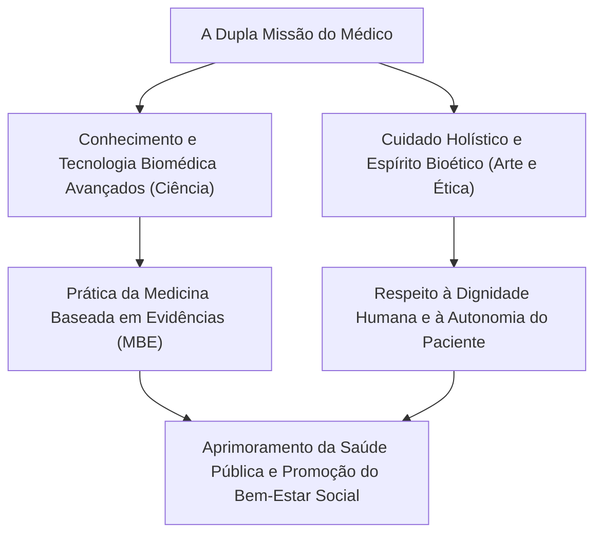
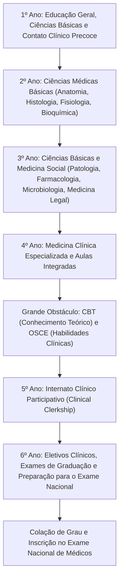
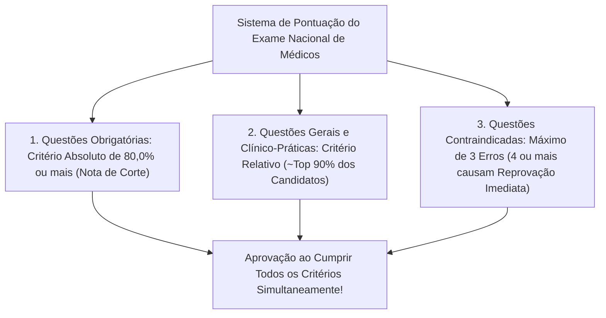
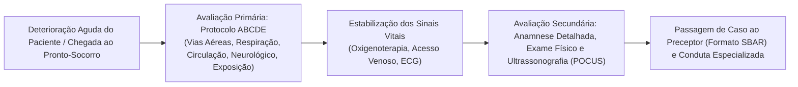
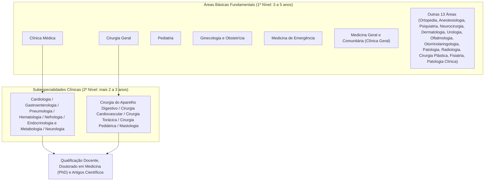
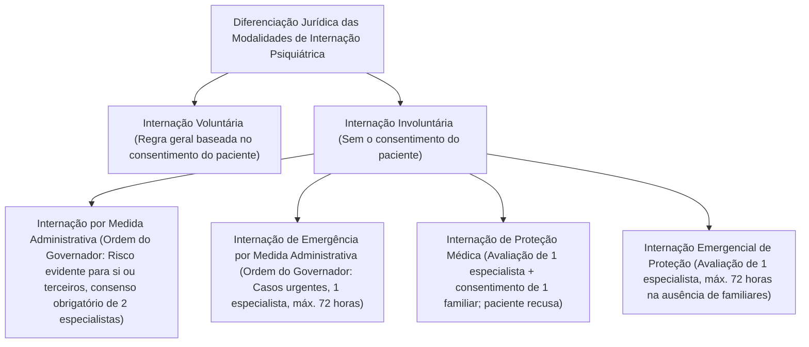
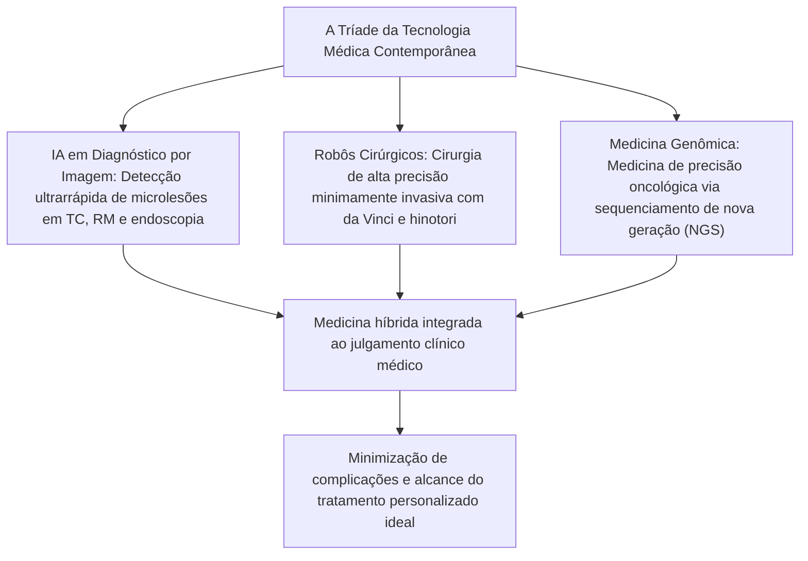

## 1. Introdução: O Cruzamento entre o Sacerdócio de Salvar Vidas e a Ciência

### 1.1 A Essência da Vocação Médica: A Integração do Espírito da „Ars Medica“ com as Ciências Naturais Modernas

Ao longo da história da humanidade, a profissão de médico sempre foi acolhida com um sentimento de profunda reverência e respeito sagrado. Tendo suas origens nos xamãs e curandeiros religiosos da Antiguidade, e passando pelo avanço exponencial das ciências naturais contemporâneas, o médico de hoje carrega uma missão dupla indissociável: ele é, simultaneamente, um „tecnocrata de ponta das ciências biológicas“ e uma „existência ética dedicada a acolher o sofrimento e a finitude de seus semelhantes“.

Quando acometido pela doença e colocado face a face com o pavor da morte, o ser humano expõe diante do médico sua dimensão mais vulnerável, frágil e desprovida de defesas, tanto física quanto emocionalmente. O ato de um médico empunhar o bisturi, administrar medicamentos altamente potentes e intervir de forma invasiva e irreversível no corpo do paciente preenche objetivamente os elementos constitutivos do crime de lesão corporal previsto no Código Penal. O fato de tal conduta ser isenta de ilicitude como ato médico legítimo (causa de justificação por exercício regular de direito e estrito cumprimento de dever profissional, segundo o Artigo 35 do Código Penal japonês) e reverenciada pela sociedade fundamenta-se única e exclusivamente no **pacto fiduciário absoluto firmado entre o Estado e a sociedade civil: „o médico adquire conhecimentos e habilidades de excelência para devotar-se com total retidão ao salvamento de vidas humanas e à promoção da saúde“.**

A função médica não se restringe ao mero tratamento da doença em sua dimensão puramente biológica (*Disease*: a anomalia biológica objetiva). A busca pela „arte de curar (*The Art of Medicine*)“, capaz de acolher e sanar integralmente o ser humano que padece por essa enfermidade (*Illness*: a experiência subjetiva do sofrimento), constitui a essência insubstituível do médico, algo que jamais poderá ser suplantado pelo avanço da inteligência artificial ou da robótica.

---

### 1.2 A Trajetória Histórica: Do Juramento de Hipócrates à Declaração de Genebra e Declaração de Lisboa

A gênese da ética médica remonta ao „Juramento de Hipócrates (*Hippocratic Oath*)“, redigido na Grécia Antiga pelo „Pai da Medicina“, Hipócrates (c. 460 a.C. – c. 370 a.C.), e por seus discípulos.
- Juramento solene por Apolo Médico, Asclépio, Hígia e Panaceia.
- Prescrever o regime e o tratamento conforme a capacidade e o julgamento pessoal para benefício dos enfermos, abstendo-se de todo dano e injustiça.
- Não administrar veneno mortal a ninguém, mesmo que instigado, nem aconselhar ou prescrever abortivos a mulheres.
- Conservar a pureza e a santidade tanto na vida quanto na prática da arte, deixando a litotomia (cirurgia de cálculo) aos praticantes especializados dessa intervenção.
- Guardar rigoroso segredo sobre tudo o que vir ou ouvir a respeito da vida dos homens durante ou fora do exercício profissional (sigilo médico).

Na era contemporânea, diante do choque profundo provocado pelos hediondos experimentos humanos perpetrados por médicos da Alemanha nazista (revelados e condenados no Julgamento dos Médicos de Nuremberg), a Associação Médica Mundial (WMA) promulgou em 1948 a **„Declaração de Genebra (Declaration of Geneva)“**, reestruturando o Juramento Hipocrático para os tempos modernos:
- „Prometo solenemente consagrar a minha vida ao serviço da humanidade.“
- „A saúde e o bem-estar do meu doente serão as minhas primeiras preocupações.“
- „Não permitirei que considerações sobre idade, doença ou incapacidade, credo, origem étnica, gênero, nacionalidade, filiação política, raça, orientação sexual ou estatuto social se interponham entre o meu dever e o meu doente.“
- „Mesmo sob ameaça, não utilizarei os meus conhecimentos médicos contra os direitos humanos e as liberdades cívicas.“

Posteriormente, em 1981, foi adotada a **„Declaração de Lisboa sobre os Direitos do Paciente (WMA Declaration of Lisbon on the Rights of the Patient)“**, estabelecendo como padrões mundiais: o direito a cuidados médicos de qualidade; o direito de ter acesso às informações de seu prontuário clínico; o direito à autodeterminação após esclarecimento amplo (*Informed Consent*); o consentimento por representação legal em caso de pacientes inconscientes; e o direito a uma morte com dignidade. Consolidou-se, dessa forma, a transição irreversível do paternalismo autoritário tradicional para uma relação de parceria horizontal centrada no paciente.

---

### 1.3 A Nobre Missão Consagrada no Artigo 1º da Lei dos Médicos do Japão

No ordenamento jurídico japonês, o estatuto profissional e as obrigações fundamentais do médico são regidos pela „Lei dos Médicos (Lei nº 201 de 1948)“. O Artigo 1º dessa lei define a nobre missão da profissão médica com extrema solenidade:

> **„O médico, ao incumbir-se dos cuidados médicos e da orientação sanitária, deve contribuir para a elevação e promoção da saúde pública, assegurando, dessa forma, uma vida saudável a todos os cidadãos da nação.“**

Este artigo deixa claro que o horizonte de atuação do médico não se restringe ao cuidado clínico individual do paciente sob seus cuidados imediatos (perspectiva micro), abrangendo também o controle de doenças infectocontagiosas, o saneamento ambiental, a medicina preventiva e as políticas de saúde de toda a coletividade (perspectiva macro). A licença médica não é um privilégio individual outorgado pelo Estado, mas um compromisso público solene e de imensa responsabilidade civil para com a salvaguarda da vida humana de toda a sociedade.

---

## 2. A Jornada dos 6 Anos da Graduação em Medicina: Estrutura Curricular e Seletivas Rigorosas

A trajetória para se tornar médico é marcada por exigências hercúleas e longa duração. No Japão, a obtenção do registro profissional exige a conclusão integral de 6 anos de graduação em uma Faculdade de Medicina (ou Universidade Médica). A grade curricular é estritamente padronizada pelas diretrizes do „Currículo Básico Modelo para a Educação Médica“, estabelecido pelo Ministério da Educação, Cultura, Esportes, Ciência e Tecnologia (MEXT).

---

### 2.1 Do 1º ao 2º Ano: Educação Humanística e os Primeiros Passos nas Ciências Básicas

#### O Significado Ético e Clínico da Dissecação Anatômica Humana
No 2º ano, os estudantes enfrentam o primeiro e mais marcante rito de passagem existencial: a disciplina prática de „Anatomia Humana Macroscópica (*Gross Anatomy*)“. Ao longo de vários meses, os alunos trabalham diretamente com cadáveres de pessoas que doaram voluntariamente seus próprios corpos à ciência médica.
- Sob o odor pungente do formol utilizado na conservação dos tecidos, os estudantes realizam a incisão da pele, rebatem o tecido celular subcutâneo e identificam, camada por camada, vasos sanguíneos, trajetos nervosos, feixes musculares, ossos e vísceras.
- Antes do primeiro corte com o bisturi, todos os estudantes prestam um minuto de silêncio solene em reverência e gratidão à nobre decisão do doador de corpo e de seus familiares enlutados.
- Trata-se de uma experiência que vai além de memorizar a anatomia tridimensional do corpo humano por meio dos sentidos: é o momento fundante em que o futuro médico toca a realidade da morte e assume a responsabilidade de conviver diariamente com a finitude do outro.

#### Fisiologia, Bioquímica e Histologia
- **Fisiologia**: Compreensão detalhada dos mecanismos físico-químicos vitais, incluindo a gênese do potencial de ação cardíaco (bomba de sódio e potássio, despolarização e repolarização), filtração glomerular e reabsorção tubular renal, além dos circuitos de retroalimentação hormonal no sistema endócrino.
- **Bioquímica**: Assimilação exaustiva das vias moleculares do ciclo do ácido cítrico (Ciclo de Krebs / TCA), fosforilação oxidativa, gliconeogênese, metabolismo lipídico, síntese proteica, além da replicação, transcrição e tradução do DNA.
- **Histologia**: Desenho e observação microscópica de tecidos epiteliais, conjuntivos, musculares e nervosos sob microscopia óptica e eletrônica, compreendendo a correlação direta entre microarquitetura celular e função biológica.

---

### 2.2 Do 3º ao 4º Ano: Fisiopatologia e Sistematização da Medicina Clínica

Do 3º para o 4º ano, os estudantes migram para a fisiopatologia (aplicação clínica das ciências básicas) e para as disciplinas clínicas especializadas, estudando o diagnóstico e a terapêutica de cada ramo médico:

- **Patologia**: Decodificação das alterações morfológicas de células e tecidos frente a agressões (inflamação, necrose, neoplasia, atipia e apoptose).
- **Farmacologia**: Cinética e dinâmica da ligação fármaco-receptor, farmacocinética (absorção, distribuição, metabolismo e excreção: ADME), mecanismos de ação de antibióticos e surgimento de bactérias multirresistentes, mecanismos moleculares de anti-hipertensivos e agentes quimioterápicos.
- **Clínica Médica Especializada**: Cardiologia (infarto agudo do miocárdio, arritmias, insuficiência cardíaca), Pneumologia (câncer de pulmão, DPOC, pneumopatias intersticiais), Gastroenterologia (úlcera péptica, cirrose hepática, neoplasias colorretais), Nefrologia (síndrome nefrótica, insuficiência renal crônica), Endocrinologia e Metabologia (diabetes mellitus, disfunções tiroidianas), Hematologia (leucemias, linfomas), Neurologia Clínica, Reumatologia e Imunologia Clínica.
- **Clínica Cirúrgica Especializada**: Cirurgia do aparelho digestivo, cardiovascular, torácica, neurocirurgia, ortopedia e traumatologia; indicações operatórias, cuidados pré e pós-operatórios e manejo do choque.
- **Pediatria, Ginecologia/Obstetrícia e Psiquiatria**: De malformações congênitas neonatais e distúrbios do neurodesenvolvimento até a condução do parto, pré-eclâmpsia e o tratamento farmacológico e psicoterápico de transtornos depressivos e esquizofrenia.
- **Medicina Social, Medicina Legal e Saúde Pública**: Bioestatística epidemiológica, Lei de Controle de Doenças Infecciosas, saúde ocupacional, toxicologia, determinação da causa da morte e técnicas periciais em autópsias médico-legais e anatomopatológicas.

---

### 2.3 O Primeiro Grande Funil: CBT e OSCE (Oficialização dos Exames de Avaliação Comum)

No outono do 4º ano, os estudantes prestam os Exames Nacionais de Avaliação Comum (*Common Achievement Tests*), que atestam a aptidão técnica e ética para ingressar nos cenários de prática clínica hospitalar (enfermarias). Desde a reforma da Lei dos Médicos em 2023, esses exames passaram a ter valor oficial conferido por lei.

1. **CBT (Computer Based Testing)**:
   - Exame computadorizado de múltipla escolha com cerca de 320 questões de conhecimento médico abrangente.
   - As questões são sorteadas aleatoriamente a partir de um imenso banco de dados nacional, com nível de dificuldade calibrado pela Teoria de Resposta ao Item (TRI / IRT).
   - Abrange ciências básicas, medicina clínica e saúde coletiva. Estudantes que não alcançam a pontuação mínima de corte (geralmente entre 65% e 70%) são sumariamente reprovados e retidos no ano letivo.
2. **Pre-CC OSCE (Objective Structured Clinical Examination)**:
   - Exame prático objetivo estruturado para avaliar habilidades de anamnese, exame físico e atitudes ético-profissionais.
   - O estudante percorre estações práticas consecutivas (entrevista médica, propedêutica de cabeça e pescoço, exame físico torácico, exame abdominal, exame neurológico e manobras de suporte básico de vida), atuando diante de pacientes simulados e manequins de treinamento.
   - Avaliadores externos pontuam minuciosamente critérios como postura profissional, cordialidade, empatia, higienização rigorosa das mãos e técnica correta de palpação e ausculta.

Apenas os alunos aprovados em ambas as etapas recebem a insígnia oficial de **„Student Doctor“**, sendo então autorizados a iniciar o internato hospitalar.

---

### 2.4 Do 5º ao 6º Ano: Internato Clínico Participativo (Clinical Clerkship)

A partir do 5º ano, inicia-se o internato clínico (*Clinical Clerkship*), no qual os estudantes realizam estágios rotatórios de 1 a 2 semanas em cada departamento do hospital universitário e de hospitais parceiros de referência regional.
Diferente dos antigos modelos puramente observacionais, o modelo moderno integra o interno como membro ativo da equipe assistencial:
- Sob a tutela de preceptores, realiza a anamnese e o exame diário dos pacientes sob sua responsabilidade, afere sinais vitais, redige a evolução clínica no prontuário de ensino, interpreta achados laboratoriais e de imagem e apresenta os casos clínicos em reuniões multidisciplinares.
- No centro cirúrgico, realiza a antissepsia e a degermação cirúrgica, veste o capote estéril e atua como segundo ou terceiro auxiliar em campo operatório, realizando hemostasia, tração com afastadores e corte de fios cirúrgicos.
- Executa procedimentos básicos como punção venosa periférica, coleta de sangue venoso e suturas simples de pele, sob supervisão direta e atenta do corpo clínico.
- No 6º ano, realizam-se os temidos exames finais de graduação (*Sotsugyo Shiken*). Para assegurar índices elevados de aprovação no Exame Nacional, muitas universidades adotam filtros extremamente rigorosos, retendo estudantes de menor rendimento e impedindo-os de se inscreverem no exame federal até que atinjam o nível de excelência exigido.

---

## 3. A Estrutura do Exame Nacional de Médicos e as Regras Críticas de Aprovação

O Exame Nacional de Habilitação Médica (*National Medical Examination*) é administrado pelo Ministério da Saúde, Trabalho e Bem-Estar (MHLW) do Japão e ocorre anualmente no início de fevereiro, distribuído ao longo de 2 dias intensos.

### 3.1 Composição e Critérios de Conteúdo do Exame

A prova é composta por 400 questões objetivas, resolvidas em cartão de respostas (com questões de múltipla escolha simples, múltipla escolha combinada e problemas de cálculo clínico).

| Bloco | Questões | Tempo de Prova | Conteúdo |
| :--- | :---: | :---: | :--- |
| **Bloco A** | 75 questões | 135 min | Medicina Geral e Especialidades (Prática clínica e questões gerais) |
| **Bloco B** | 50 questões | 80 min | **Questões Obrigatórias / Fundamentais (Gerais e Prática Clínica)** |
| **Bloco C** | 75 questões | 135 min | Medicina Geral e Especialidades (Casos clínicos longos e complexos) |
| **Bloco D** | 75 questões | 135 min | Medicina Geral e Especialidades (Ciências básicas, saúde pública) |
| **Bloco E** | 50 questões | 80 min | **Questões Obrigatórias (Segurança do paciente e saúde pública)** |
| **Bloco F** | 75 questões | 135 min | Medicina Geral e Especialidades (Integração clínica e condutas globais) |

---

### 3.2 A Tríade de Critérios de Aprovação e o Pavor do Corte de 80%

Para obter a aprovação no Exame Nacional, o candidato deve satisfazer **cumulativamente e simultaneamente aos três critérios abaixo**. Caso falhe em apenas um deles, será reprovado de forma automática e implacável.

1. **Corte Absoluto nas Questões Obrigatórias (*Hisshū*, nota mínima de 80,0%)**:
   - No bloco de questões obrigatórias (100 questões, valendo 200 pontos no total), **o acerto mínimo exigido é de rigorosos 80,0% (160 pontos)**.
   - Ainda que o candidato alcance pontuação quase perfeita em todas as questões gerais e clínicas especializadas, se errar uma única questão obrigatória e ficar abaixo dos 80,0%, estará inapelavelmente reprovado. A tensão psicológica faz com que os vestibulandos preencham o gabarito sob mãos trêmulas.
2. **Critério Relativo para Questões Gerais e Clínico-Práticas**:
   - A pontuação das questões gerais e dos casos práticos é avaliada de modo relativo: a linha de corte é calculada com base na curva de desvio padrão do ano, excluindo os cerca de 10% de menor desempenho (o corte gira tipicamente em torno de 68% a 72%).
3. **A Armadilha das Questões Contraindicadas (*Kinkishi* / Contraindications)**:
   - O aspecto mais temido de todo o certame é a existência de alternativas contraindicadas. Trata-se de opções de conduta médica que, na vida real, configurariam **„erro médico crasso causador de óbito direto do paciente“, „grave violação dos direitos humanos“ ou „flagrante ilícito penal“**.
   - Geralmente, se o candidato assinalar **4 ou mais alternativas contraindicadas (em alguns anos, o limite é de 3), ele é sumariamente reprovado de imediato**, ainda que sua nota global esteja entre as mais altas do país!
   - (Exemplos reais: administrar anticoagulante em suspeita clínica de hemorragia intracraniana aguda; prescrever apenas corticoterapia e aguardar evolução em choque anafilático sem aplicar adrenalina intramuscular imediata; utilizar droga bloqueadora neuromuscular incorreta ou fármaco proibido em intoxicação por organofosforados em vez de atropina; internar compulsoriamente um paciente em hospital psiquiátrico apenas por solicitação da família, sem consentimento do paciente nem respaldo legal formal).

---

## 4. O Desafio da Residência Clínica Inicial (2 Anos): O Sistema Rotatório Geral (Super-Rotate)

Mesmo após a aprovação no Exame Nacional, a inscrição no Conselho e a expedição do diploma de médico, o profissional recém-formado é legalmente proibido de exercer a medicina de forma autônoma e desassistida (Artigo 16-2 da Lei dos Médicos). Todo médico deve cumprir obrigatoriamente um programa de 2 anos de „Residência Clínica Inicial (*Junior Residency*)“.

### 4.1 A Ruptura Histórica da Reforma do Treinamento Médico de 2004

Antes do ano de 2004, o médico recém-formado vinculava-se imediatamente ao departamento universitário (*Ikyoku*, cátedra de uma especialidade específica, como Primeira Clínica Médica ou Segunda Clínica Cirúrgica), onde recebia formação quase exclusiva naquele nicho restrito. Isso gerava distorções graves: especialistas altamente gabaritados em vias biliares eram completamente incapazes de imobilizar uma fratura simples, diagnosticar conjuntivite ou conduzir uma emergência clínica primária.

Com o objetivo de sanar essa hiperespecialização precoce, instituiu-se o regime rotatório obrigatório (*Super-Rotate*):
- **Obrigatoriedade de Habilidades Clínicas Fundamentais**: Independentemente da especialidade futura, todos os residentes são obrigados a estagiar em Clínica Médica (pelo menos 6 meses), Medicina de Urgência e Emergência (pelo menos 3 meses), Saúde Comunitária e Medicina da Família (pelo menos 1 mês), além de Pediatria, Ginecologia/Obstetrícia, Psiquiatria e Cirurgia Geral, garantindo competência resolutiva em cuidados primários (*Primary Care*).
- **Instituição do Algoritmo de Matching**: O ingresso no hospital de residência deixou de ser uma indicação compulsória dos chefes de cátedra universitária e passou a ser gerenciado pelo Conselho Nacional de Matching de Residência Médica, que utiliza o algoritmo matemático de Gale-Shapley (emparelhamento estável de preferências mútuas entre candidatos e hospitais).
- Essa mudança transferiu os melhores talentos para hospitais gerais públicos e filantrópicos urbanos, reconhecidos pelo alto volume de procedimentos e preceptoria de ponta (como o St. Luke’s International Hospital, Toranomon, Kurashiki Central, Kameda Medical Center), esvaziando temporariamente os quadros das universidades de províncias e intensificando debates sobre a escassez de médicos em áreas remotas.

---

### 4.2 A Rotina Cansativa do Médico Residente e o Domínio das Habilidades Clínicas de Ponta

Os 2 anos como residente inicial constituem a fase de aprendizado prático mais densa, extenuante e transformadora de toda a carreira médica.

- **Plantões no Pronto-Socorro**: Desde pacientes com queixas ambulatoriais leves que procuram o serviço por demanda espontânea até paradas cardiorrespiratórias (PCR / CPA) e politraumatizados graves trazidos pelo resgate. Sob supervisão direta de preceptores de emergência, o residente aplica a abordagem sistematizada **„ABCDE“** (*Airway, Breathing, Circulation, Disability, Exposure*) para triagem e estabilização imediata.
- **Domínio de Procedimentos Invasivos Críticos**:
  - Coleta de gasometria arterial (punção da artéria radial)
  - Ultrassonografia à beira do leito (*Point-of-Care Ultrasound* - protocolo FAST para pesquisa rápida de líquido livre intra-abdominal e pericárdico)
  - Acesso venoso central (punção guiada por ultrassom da veia jugular interna ou subclávia)
  - Intubação orotraqueal (visualização da fenda glótica via laringoscopia direta ou videolaringoscópio e passagem do tubo endotraqueal)
  - Punção lombar (coleta de líquor para investigação de meningite e hemorragia subaracnóidea)
  - Drenagem torácica em selo d'água e paracentese diagnóstica e de alívio
- **A Constatação do Óbito e o Diálogo com os Familiares**: O instante indelével em que o jovem médico confirma pela primeira vez a cessação das funções cardíacas, documenta as pupilas midriáticas e fotorreagentes ausentes, confirma o traçado elétrico reto no monitor e preenche o atestado de óbito. Em seguida, a comunicação da perda aos familiares em prantos imprime na alma do profissional o peso insondável da responsabilidade médica.

---

## 5. O Panorama do Novo Sistema de Médicos Especialistas: 19 Áreas Básicas e Subespecialidades

Após a conclusão dos 2 anos de residência inicial, o médico ingressa na condição de „residente avançado / especializando (*Senior Resident / Senkō-i*)“ e escolhe o ramo definitivo que guiará sua carreira. O „Novo Sistema de Médicos Especialistas“, plenamente implementado em 2018 sob a gestão do Conselho Japonês de Especialidades Médicas (*Japan Medical Specialty Board*), adota uma estrutura em pirâmide de dois andares com padrões nacionais de excelência.

---

### 5.1 O Sistema das 19 Áreas Básicas Fundamentais

O residente avançado vincula-se a um programa credenciado em uma das **19 áreas básicas fundamentais**, completando de 3 a 5 anos de treinamento prático e teórico.

| Área Básica | Duração | Competências Centrais e Características |
| :--- | :---: | :--- |
| **Clínica Médica** | 3 anos | Registro massivo de prontuários (sistema eletrônico J-OSLER, com centenas de casos e sumários detalhados obrigatórios). Etapa prévia indispensável para qualquer subespecialidade clínica. |
| **Cirurgia Geral** | 3 a 4 anos | Base formativa ampla em cirurgia digestiva, cardiovascular, torácica e pediátrica. Registro de cirurgias no banco de dados nacional *National Clinical Database* (NCD). |
| **Pediatria** | 3 anos | Atenção pediátrica ampla: UTI neonatal (UTIN), urgências pediátricas, infectologia, genética clínica, neurodesenvolvimento e alergologia infantil. |
| **Ginecologia e Obstetrícia** | 3 anos | Medicina perinatal (partos normais e de alto risco, cesarianas), oncologia ginecológica cirúrgica e reprodução humana assistida. |
| **Medicina de Emergência** | 3 anos | Manejo de politrauma grave, choque séptico, grandes queimados, intoxicações exógenas, medicina intensiva (UTI) e resgate pré-hospitalar aéreo (*Doctor Heli*). |
| **Medicina Geral e Comunitária** | 3 anos | Nova especialidade estruturada. Atenção primária integrada, assistência domiciliar, manejo de pacientes multimórbidos e medicina de família. |
| **Ortopedia e Traumatologia** | 3 a 4 anos | Tratamento cirúrgico de fraturas, artroplastias totais (quadril e joelho), cirurgia da coluna vertebral, medicina esportiva e reabilitação musculoesquelética. |
| **Anestesiologia** | 4 anos | Anestesia geral e locorregional (raquianestesia, peridural), tratamento da dor crônica, medicina intensiva e controle de crises operatórias. |
| **Psiquiatria** | 3 anos | Alinhada à titulação pericial de Médico Designado de Saúde Mental (*Seishin Hoken Shitei-i*). Farmacoterapia e psicoterapia para depressão, esquizofrenia e demências. |
| **Neurocirurgia** | 4 anos | Clipagem de aneurismas cerebrais, ressecção de neoplasias do SNC, cirurgia endovascular cerebral e conduta no traumatismo cranioencefálico grave. |
| **Radiologia** | 3 anos | Diagnóstico por imagem (laudos de TC, RM e PET-CT), radiologia intervencionista (angiografia terapêutica / IVR) e radioterapia oncológica. |
| **Patologia** | 3 anos | Diagnóstico intraoperatório por congelação, biópsias histopatológicas e autópsias clínicas com reuniões anátomo-clínicas (CPC). |
| **Outras Áreas** | 3 a 4 anos | Dermatologia, Urologia, Oftalmologia, Otorrinolaringologia, Cirurgia Plástica, Fisiatria e Reabilitação, e Patologia Clínica (Medicina Laboratorial). |

---

### 5.2 Aprofundamento em Subespecialidades e o Doutorado em Medicina (PhD)

Após consolidar a titulação de especialista na área básica, o médico ingressa na formação de „segundo nível“ (subespecialidades), aperfeiçoando-se em áreas de alta diferenciação técnica, tais como cardiologia intervencionista, endoscopia digestiva terapêutica, cirurgia cardiovascular de ponta ou oncologia clínica.

Simultaneamente, muitos médicos matriculam-se na pós-graduação acadêmica (*Doutorado em Ciências Médicas / PhD*, com duração média de 4 anos). Desenvolvem pesquisas avançadas em laboratórios de bancada ou em ensaios clínicos nos campos da biologia molecular, imunoterapia e sequenciamento genômico, publicando artigos originais como primeiro autor em periódicos internacionais revisados por pares. Assim, consolidam uma dupla identidade profissional: a do clínico resolutivo na assistência direta ao paciente e a do cientista que gera evidências inéditas para a medicina global.

---

---

## 2.5 Fisiopatologia Avançada e Modelagem Matemática da Farmacocinética/Farmacodinâmica (Teoria PK/PD)

Para que a prática médica transcenda a mera memorização de sinais e sintomas e se estruture como ciência fundamentada na biologia molecular e na farmacologia quantitativa, é imperioso dominar a **„Teoria PK/PD (Farmacocinética / Farmacodinâmica)“**.

### Parâmetros Fundamentais da Farmacocinética (PK)
- **Área Sob a Curva de Concentração Plasmática-Tempo (AUC: *Area Under the Curve*)**: Expressa a exposição sistêmica total do organismo ao princípio ativo ao longo do tempo.
- **Concentração Plasmática Máxima ($C_{max}$)**: O valor de pico sérico atingido após a administração do fármaco.
- **Volume de Distribuição ($V_d$)**: Parâmetro volumétrico que indica se o fármaco se distribui predominantemente pelos tecidos periféricos (compostos lipofílicos) ou permanece retido no espaço intravascular (compostos hidrofílicos).

### As Três Grandes Classes de Parâmetros PK/PD dos Antimicrobianos
No tratamento das infecções bacterianas, os antimicrobianos são categorizados em três perfis farmacodinâmicos em função da Concentração Inibitória Mínima (CIM / *MIC: Minimum Inhibitory Concentration*):

| Parâmetro | Índice Preditor de Eficácia | Classes de Antimicrobianos | Estratégia de Posologia e Administração |
| :--- | :--- | :--- | :--- |
| **Tempo acima da CIM ($T > MIC$)** | Porcentagem do intervalo entre doses em que a concentração plasmática excede a CIM (%) | **Penicilinas, Cefalosporinas, Carbapenêmicos** (antibióticos $\beta$-lactâmicos) | Em vez de doses únicas gigantescas, a eficácia é maximizada por meio do **aumento da frequência de administração (3 a 4 tomadas diárias fracionadas)** ou pelo prolongamento do tempo de infusão intravenosa (infusão estendida ou contínua). |
| **$C_{max} / MIC$** | Razão entre o pico plasmático máximo e o valor da CIM | **Aminoglicosídeos** (gentamicina, amicacina) | Evita-se o fracionamento em favor de **dose única diária elevada (*Once-daily dosing*)**, produzindo picos séricos acentuados para potencializar a atividade bactericida concentração-dependente e o efeito pós-antibiótico (PAE), minimizando simultaneamente a ototoxicidade e a nefrotoxicidade. |
| **$AUC / MIC$** | Razão entre a exposição total em 24 horas e o valor da CIM | **Fluoroquinolonas, Vancomicina** (glicopeptídeos) | Garante-se o aporte cumulativo de dose em 24 horas. No caso da vancomicina, realiza-se rotineiramente a monitorização terapêutica de fármacos (TDM) para manter o nível de vale (*Trough*) estritamente entre $15 \sim 20\,\mu\mathrm{g/mL}$. |

---

## 3.6 Pontos Críticos do Exame Nacional: Legislação Sanitária e Interpretação da Lei de Saúde Mental

Uma das áreas que mais impõe desafios e reprovações aos candidatos no Exame Nacional de Médicos é a disciplina de „Saúde Coletiva e Legislação Médica e Sanitária“. Ela exige não apenas conhecimento biológico, mas um domínio técnico e interpretativo de dispositivos jurídicos digno de juristas especializados.

### ① Classificação da Lei de Doenças Infecciosas e o Dever de Notificação Médica
A „Lei sobre a Prevenção de Doenças Infecciosas e Assistência Médica a Pacientes Portadores (Lei de Doenças Infecciosas)“ categoriza os patógenos em classes de 1 a 5 de acordo com a letalidade, gravidade clínica e potencial epidêmico de contágio:

- **Doenças Infecciosas de Categoria 1 (Febre hemorrágica Ebola, Peste, Febre de Marburg, Febre de Lassa, Febre hemorrágica Crimeia-Congo, Varíola, Febres hemorrágicas sul-americanas)**:
  - **Dever legal de notificação imediata (sem demora)** ao governador da província por meio do diretor da autoridade de saúde pública local (*Hokensho*).
  - Determina o isolamento compulsório em hospitais especializados de isolamento de Classe 1, restrições à locomoção por até 72 horas e desinfecção ou descarte obrigatório de bens contaminados.
- **Doenças Infecciosas de Categoria 2 (Tuberculose, SARS, MERS, Gripe Aviária H5N1/H7N9, Poliomielite)**:
  - Notificação compulsória imediata. Medidas de recomendação e internação compulsória em leitos designados de Categoria 2. Para a tuberculose, aplica-se o custeio médico integral pelo Estado, inclusive para o tratamento da Infecção Latente por Tuberculose (ILTB).
- **Doenças Infecciosas de Categoria 3 (Cólera, Disenteria bacilar, Febre tifoide, Febre paratifoide, Infecções por E. coli entero-hemorrágica como O157)**:
  - Notificação compulsória imediata. Não há internação compulsória, mas há impedimento legal temporário do exercício de atividades profissionais em serviços de manipulação de alimentos até confirmação laboratorial de coproculturas negativas.
- **Doenças Infecciosas de Categoria 4 (Hepatite E, Hepatite A, Malária, Raiva, Febre Dengue, Febre Amarela, Encefalite Japonesa, Legionelose, Tétano etc.)**:
  - Doenças transmitidas por vetores animais, insetos, água ou alimentos. Notificação imediata. Como regra geral, não há transmissão inter-humana respiratória, não sendo aplicadas quarentenas hospitalares compulsórias nem impedimentos de trabalho.
- **Doenças Infecciosas de Categoria 5**:
  - **Notificação Universal Compulsória (notificação nominal em até 7 dias)**: Sarampo, Rubéola, Sífilis, Encefalite aguda, Doença meningocócica invasiva, Síndrome da Imunodeficiência Adquirida (AIDS/HIV). Sarampo e rubéola exigem envio de notificação nominal imediata.
  - **Notificação Sentinela (reportada semanal ou mensalmente por postos médicos sentinelas credenciados)**: Influenza sazonal, Doença mão-pé-boca, infecção pelo Vírus Sincicial Respiratório (VSR) e gastroenterite infecciosa.

### ② Rigor Jurídico das Modalidades de Internação na Lei de Saúde Mental e Bem-Estar
No contexto psiquiátrico, a harmonização entre os direitos individuais fundamentais do paciente e a imperiosa contenção de condutas autodestrutivas ou lesivas a terceiros é regida pela „Lei de Saúde Mental e Bem-Estar das Pessoas com Transtornos Mentais“:

No Exame Nacional, detalhes precisos costumam determinar a aprovação: por exemplo, a escala de prioridade dos familiares aptos a conceder a anuência na „Internação de Proteção Médica“ (cônjuge, pais detentores do poder familiar, dependentes legais, curadores e, na ausência de todos estes, o prefeito municipal), bem como o trâmite processual que vincula a notificação policial (Artigo 24) ou de cidadãos comuns (Artigo 22) à expedição do mandado administrativo pelo governador provincial.

---

## 4.5 Plantão Crítico na Emergência: O Mnemônico de Rebaixamento da Consciência „AIUEO TIPS“ e o Abdome Agudo

O bipe hospitalar do médico residente toca em plena madrugada: „Paciente masculino de 70 anos em coma profundo sendo trazido pelo resgate!“. Diante desse chamado, o médico deve resgatar de forma instantânea o algoritmo mnemônico internacional **„AIUEO TIPS“**.

| Letra | Etiologias e Enfermidades Críticas | Ação Inicial Imediata na Sala de Emergência |
| :---: | :--- | :--- |
| **A** | **A**lcohol (intoxicação alcoólica aguda) / **A**cidosis (acidose metabólica/lática) | Avaliar hálito etílico; gasometria arterial imediata para checar pH, lactato e cálculo do *Anion Gap*. |
| **I** | **I**nsulin (hipoglicemia severa / cetoacidose diabética: CAD / EHH) | **Glicemia capilar imediata na ponta do dedo!** (A hipoglicemia causa dano neuronal irreversível em questão de minutos; em caso de confirmação, infundir prontamente glicose hipertônica a 50% EV). |
| **U** | **U**remia (encefalopatia urêmica terminal) | Dosagem sérica de ureia (BUN), creatinina e potássio; avaliar indicação de hemodiálise de urgência. |
| **E** | **E**ncephalopathy (encefalopatia hepática/hipertensiva) / **E**lectrolytes (distúrbios hidroeletrolíticos) / **E**ndocrine (crise tireotóxica, coma mixedematoso, insuficiência adrenal) | Dosagem de amônia sérica e sódio plasmático (alerta máximo para o risco de mielinólise pontina central / síndrome de desmielinização osmótica por correção rápida de hiponatremia). |
| **O** | **O**xygen (hipóxia severa) / **O**verdose (intoxicação medicamentosa aguda) / **O**piate (overdose por opioides) | Monitorização com oximetria de pulso e gasometria; diante de miose puntiforme e bradipneia, administrar imediatamente o antagonista naloxona EV. |
| **T** | **T**rauma (traumatismo cranioencefálico) / **T**emperature (hipotermia severa / insolação grave) | Tomografia computadorizada de crânio sem contraste (pesquisa de hematoma subdural ou epidural agudo); mensuração de temperatura retal. |
| **I** | **I**nfection (infecções do SNC: meningite, encefalite; sepse grave) | Avaliar rigidez de nuca, sinais de Kernig e Brudzinski, manobra de *Jolt accentuation*; colher 2 pares de hemoculturas e iniciar de pronto antibioticoterapia empírica (ceftriaxona + vancomicina + ampicilina) e punção lombar. |
| **P** | **P**sychiatric (transtorno conversivo/dissociativo) / **P**orphyria (porfiria aguda intermitente) | Diagnósticos exclusivamente de exclusão; só devem ser cogitados após o descarte cabal de causas orgânicas. |
| **S** | **S**troke (acidente vascular cerebral: isquêmico, hemorrágico, HSA) / **S**eizure (estado de mal epiléptico) / **S**hock (choque hipovolêmico, cardiogênico, obstrutivo ou distributivo) | Exame neurológico detalhado com sinais focais; TC ou RM de crânio (difusão / DWI); avaliação célere para trombólise química com rt-PA (janela de até 4,5 h) ou trombectomia mecânica. |

Um dos erros mais crassos de um médico inexperiente é enviar um paciente com rebaixamento da consciência imediatamente para a sala de tomografia sem antes estabilizar suas funções vitais. Encaminhar um paciente com hipoglicemia grave ou hipóxia severa para a máquina de TC resulta frequentemente em parada cardíaca durante o deslocamento. A máxima **„Vital signs first, then Glucose, ABCDE stabilization!“** é uma regra de ouro que deve ser gravada na memória de todo médico.

---

## 5.5 Plano de Carreira, Realidade Financeira e Formação Continuada

### O Abismo Estrutural entre Médicos de Hospital e Médicos de Consultório Privado
A sociedade leiga com frequência nutre o mito de que „todo médico possui rendimentos astronômicos“. No entanto, a realidade financeira dos profissionais da saúde exibe uma estratificação acentuada, atrelada à modalidade de contratação e ao estágio da carreira:

1. **A Realidade Econômica Vulnerável dos Médicos Universitários**:
   - O salário anual de um residente inicial gira nacionalmente em torno de 3,5 a 4,5 milhões de ienes.
   - Ao ingressar na residência avançada (*Senkō-i*) de um hospital universitário, o salário-base mensal situa-se frequentemente entre modestos 200.000 e 300.000 ienes. Para fazer frente às despesas de subsistência, à rotina pesada das enfermarias e à produção acadêmica, esses jovens profissionais realizam de 1 a 2 plantões noturnos extras semanais (*Arubaito*) em hospitais gerais ou clínicas de retaguarda (recebendo entre 40.000 e 80.000 ienes por plantão).
   - Por volta dos 35 anos, mesmo após obter o título de Doutor em Medicina (*PhD*) e alcançar os postos de professor assistente (*Jokyo*) ou conferencista (*Kōshi*), os rendimentos fixos pagos pelas universidades situam-se com frequência na faixa de apenas 6 a 8 milhões de ienes ao ano.
2. **Médicos de Corpo Clínico em Grandes Hospitais Gerais**:
   - Entre o final dos 30 e os 40 anos, atuando como chefes de departamento clínico ou cirúrgico em hospitais gerais regionais, os rendimentos anuais atingem entre 12 e 18 milhões de ienes. Essa remuneração, contudo, é acompanhada por frequentes plantões de sobreaviso (*On-call*), chamadas noturnas imprevistas e atendimento contínuo a emergências.
3. **Médicos Proprietários de Clínicas Privadas (*Private Practice*)**:
   - Ao inaugurar seu próprio consultório a partir dos 40 anos, investindo recursos próprios e captando empréstimos bancários expressivos (de dezenas a centenas de milhões de ienes), um médico cuja gestão alcance sucesso financeiro pode auferir rendimentos anuais na faixa de 25 a mais de 40 milhões de ienes. Todavia, esse profissional assume integralmente a responsabilidade patronal, o fluxo de caixa, o passivo trabalhista, o endividamento e os riscos civis inerentes ao negócio.

### Riscos de Litígio Médico e Seguro de Responsabilidade Civil Profissional
O médico atua cotidianamente sob a iminência de processos judiciais por erro médico com indenizações vultosas:
- Complicações perinatais severas com asfixia neonatal e paralisia cerebral infantil (embora exista o Sistema de Compensação de Danos Obstétricos, processos cíveis resultam frequentemente em condenações da ordem de 100 a 200 milhões de ienes).
- Tromboembolismo pulmonar fulminante pós-operatório, reações adversas medicamentosas fatais não diagnosticadas a tempo ou lesões despercebidas em exames de imagem.
- A contratação de apólices robustas de seguro de responsabilidade civil médica por intermédio da Associação Médica do Japão (JMA) ou sociedades de especialidade constitui uma exigência elementar de proteção profissional para todo médico assistencial.

---

## 6. Normas Jurídicas, Sistemas e Bioética Fundamentais na Medicina

A rotina assistencial do médico é balizada por uma intrincada malha de disposições legais. Descumprir esses preceitos sujeita o profissional à cassação da licença, à suspensão do exercício profissional por penalidade administrativa (Artigo 7º da Lei dos Médicos), à responsabilização penal privativa de liberdade e a pesadas indenizações por danos materiais e morais na esfera civil.

### 6.1 Análise Pormenorizada dos Artigos Essenciais da Lei dos Médicos

#### ① O Dever de Atendimento (Artigo 19, Parágrafo 1º da Lei dos Médicos)
> „O médico que estiver engajado na prática da medicina não pode recusar a solicitação de exame e tratamento, a menos que haja justa causa para tal recusa.“

Tradicionalmente interpretado como a proibição absoluta de qualquer negativa de atendimento, o Ministério da Saúde esclareceu a norma por meio de parecer técnico emitido em 2019:
- Durante o horário normal de atendimento, mesmo na ausência de especialistas, o médico é obrigado a prestar os primeiros socorros de emergência ou providenciar a transferência segura do paciente para um centro qualificado.
- Fora do horário habitual e em unidades que não atuam como pronto-socorro de retaguarda, condutas abusivas como agressões físicas, violência verbal, estado de embriaguez tumultuária, inadimplemento intencional e reiterado de honorários, bem como exaustão extrema ou enfermidade do próprio médico que comprometa a segurança da assistência, passam a constituir legalmente „justa causa“ para recusa (compatibilizando o dever de socorro com a higidez física do profissional).

#### ② Vedação à Prática Médica Sem Consulta Presencial (Artigo 20 da Lei dos Médicos)
> „Nenhum médico poderá prescrever medicamentos ou ministrar tratamentos sem examinar pessoalmente o paciente; tampouco poderá emitir certidões de nascimento ou declarações de óbito sem haver assistido pessoalmente ao parto ou inspecionado o cadáver.“

A prescrição medicamentosa sem contato direto com o paciente é rigorosamente proibida. O moderno avanço da telemedicina e das consultas remotas constitui exceção pontual admitida exclusivamente quando executada em estrita conformidade com as diretrizes ministeriais para condições clínicas previamente diagnosticadas e sob protocolos técnicos com garantia de eficácia e segurança.

#### ③ Dever de Comunicação Policial de Mortes Suspeitas (Artigo 21 da Lei dos Médicos)
> „Se o médico, ao inspecionar um cadáver ou examinar um feto natimorto com quatro meses ou mais de gestação, constatar anomalia ou suspeita de morte não natural, deverá notificar a autoridade policial competente no prazo máximo de 24 horas.“

A incidência deste artigo sobre óbitos associados a eventos adversos cirúrgicos e acidentes hospitalares foi objeto de acirradas disputas jurídicas perante a Suprema Corte do Japão (como nos rumorosos precedentes do Hospital Universitário Feminino de Tóquio e do Hospital Metropolitano Hiroo). A jurisprudência consolidou que a constatação de sinais externos anômalos ou a mínima suspeita de ilícito criminal impõe a obrigação compulsória de notificação imediata à polícia; médicos que tentaram omitir erros assistenciais sonegando essa notificação foram condenados criminalmente.

---

### 6.2 O Consentimento Informado e os Fundamentos Jurídicos da Responsabilidade Médica

Em sede de responsabilidade civil (por inadimplemento contratual ou ato ilícito extracontratual), a imputação de culpa profissional ancora-se sobre dois pilares: a violação do dever de cuidado e a violação do dever de esclarecimento.

- **Padrão de Cuidado Médico (*Standard of Care*)**: A obrigação de prudência e perícia não é julgada por expectativas ideais abstratas, mas pelo padrão técnico médio praticado por um médico diligente de mesma qualificação à época do fato, levando em conta o contexto e os recursos da instituição de saúde.
- **Consentimento Informado (*Informed Consent*)**: O médico tem o dever indeclinável de esclarecer o paciente em linguagem clara e acessível acerca de: ① diagnóstico e estágio atual da doença; ② plano terapêutico proposto; ③ riscos típicos e raros, efeitos colaterais e complicações prováveis; ④ opções terapêuticas alternativas existentes com suas respectivas vantagens e desvantagens; e ⑤ o prognóstico esperado caso nenhuma intervenção seja adotada. Somente após essa elucidação manifesta-se o consentimento livre e esclarecido. Caso o médico negligencie esse dever e sobrevenha uma complicação, ainda que a cirurgia tenha sido impecável do ponto de vista técnico, o profissional poderá ser condenado ao pagamento de pesadas indenizações por violação do direito à autodeterminação do paciente.

---

---

## 6.5 O Processo Decisório na Terminalidade da Vida (ACP) e os Critérios Legais de Morte Encefálica

O ápice dos dilemas éticos enfrentados ao longo da existência médica manifesta-se na fase final da vida: a abstenção ou suspensão de medidas de suporte vital e a condução do protocolo formal de morte encefálica.

### ① Diretrizes sobre o Processo de Decisão em Cuidados e Tratamentos no Fim da Vida
Com base nas diretrizes do Ministério da Saúde, a prática clínica moderna apoia-se no conceito de **„ACP (Advance Care Planning / Planejamento Antecipado de Cuidados, denominado nacionalmente de ‚Jinsei Kaigi‘ / Reunião da Vida)“**:
- Decisões unilaterais e arbitrárias do médico quanto à instituição ou interrupção de medidas invasivas de suporte de vida (ventilação mecânica, aminas vasoativas em doses crescentes, reanimação cardiopulmonar) são inadmissíveis.
- Quando o paciente expressa sua vontade: o diálogo contínuo entre o paciente e a equipe multidisciplinar de saúde prevalece soberanamente, devendo a intenção ser revista periodicamente conforme a progressão da enfermidade.
- Quando o paciente não consegue mais manifestar sua vontade: busca-se reconstituir sua vontade presumida por meio de diálogos com os familiares; não sendo possível inferi-la, a equipe e a família devem definir consensualmente o que representa o melhor interesse para o paciente.
- **Requisitos de Excludente de Ilicitude Penal na Suspensão de Suporte Vital**: Conforme a jurisprudência fixada nos casos dos hospitais municipais de Kawasaki e Imizu, a suspensão de terapias invasivas não configura homicídio ou abandono de incapaz com resultado morte desde que preenchidos cumulativamente 4 requisitos: quadro terminal irreversível atestado formalmente; manifestação de vontade autêntica do paciente (diretivas antecipadas de vontade); emprego prioritário e máximo de alívio e cuidados paliativos; e estrita observância de deliberação multidisciplinar consensual.

### ② Os Seis Critérios Legais de Determinação da Morte Encefálica
Pela legislação japonesa („Lei de Transplante de Órgãos“), o diagnóstico de morte encefálica como o fim jurídico da personalidade humana é admitido exclusivamente no contexto de doação de órgãos para transplante. O diagnóstico exige a aplicação de um protocolo pericial rigoroso, conduzido de modo independente e repetido por médicos especialistas:

1. **Coma Profundo (Escala de Coma de Glasgow 3 / Japan Coma Scale 300)**: Ausência absoluta de qualquer resposta motora ou verbal a estímulos externos intensos.
2. **Pupilas Midriáticas e Fixo-Paralisadas**: Diâmetro pupilar bilateral $\ge 4\,\mathrm{mm}$, com perda completa do reflexo fotomotor direto e consensual.
3. **Ausência Completa dos Sete Reflexos do Tronco Encefálico**:
   - Reflexo fotomotor
   - Reflexo corneopalpebral (ausência de piscamento ao toque da córnea com mecha de algodão)
   - Reflexo cilioespinhal (ausência de dilatação pupilar ao estímulo álgico cutâneo na região cervical)
   - Reflexo oculocefálico (ausência de desvio conjugado dos olhos ao giro súbito da cabeça: perda do fenômeno dos „olhos de boneca“)
   - Reflexo vestíbulo-ocular (prova calórica com injeção de água gelada no conduto auditivo externo sem desvio ou nistagmo)
   - Reflexo faríngeo / nauseoso (ausência de contração ao estímulo da parede posterior da faringe com espátula)
   - Reflexo traqueobrônquico / de tosse (ausência de tosse à aspiração profunda da cânula traqueal)
4. **Eletroencefalograma Inativo (Linha Isoelétrica / Flat EEG)**: Confirmação de silêncio eletrocerebral durante pelo menos 30 minutos em gravação multicanal calibrada no sistema internacional 10-20, na sensibilidade máxima de $2\,\mu\mathrm{V/mm}$.
5. **Apneia Completa (Teste da Apneia)**: Desconexão monitorada do ventilador sob oxigenação intratraqueal com $100\%\,\mathrm{O_2}$, confirmando ausência total de movimentos respiratórios autônomos até a elevação da pressão parcial de dióxido de carbono no sangue arterial ($PaCO_2$) a um valor igual ou superior a $60\,\mathrm{mmHg}$.
6. **Intervalo Mínimo de Observação**: Cumpridos todos os itens, aguarda-se um intervalo de **no mínimo 6 horas** (no mínimo 24 horas em crianças com idade inferior a 6 anos) para reaplicar rigorosamente todo o protocolo e atestar a irreversibilidade completa do quadro.

O exato momento em que o segundo ciclo de exames é concluído com idêntico resultado marca a data e hora oficiais do falecimento perante a lei. É nesse instante que o médico se posiciona no limiar supremo entre a objetividade científica inflexível e a mais profunda comoção diante do mistério da vida.

---

## 7. Formação Permanente e Desafios Contemporâneos: A Reforma Trabalhista e o Futuro da Medicina com IA

### 7.1 O Impacto da Reforma da Jornada de Trabalho dos Médicos (Vigência a partir de Abril de 2024)

Por décadas, a excelência e a acessibilidade universal do sistema de saúde do Japão repousaram sobre a abnegação e o sacrifício pessoal dos médicos, submetidos a jornadas exaustivas que ultrapassavam com frequência 100 a 200 horas extras mensais de plantões e sobreavisos ininterruptos.

Com vistas a coibir esse risco estrutural de morte por excesso de trabalho (*Karōshi*), entraram formalmente em vigor em abril de 2024 as restrições aos limites máximos de horas extras para a classe médica:

| Nível | Hospitais e Médicos Elegíveis | Teto Anual de Horas Extras | Limite Mensal e Características |
| :---: | :--- | :---: | :--- |
| **Nível A** | Médicos assistenciais gerais (maioria dos hospitais) | **960 horas** (média de até 80 h/mês) | Limite padrão estrito ajustado à linha oficial de risco de morte por excesso de trabalho. |
| **Nível B** | Hospitais de emergência e atendimento regional crítico | **1.860 horas** (máximo de 155 h/mês) | Medida transitória para resguardar a rede pública de urgência, dependente de autorização do governo provincial. |
| **Nível C** | Programas de treinamento intensivo (médicos residentes e especializandos) | **1.860 horas** (máximo de 155 h/mês) | Cota especial para aquisição de proficiência e alto volume de cirurgias e procedimentos clínicos. |

Embora essa reforma represente um marco civilizatório na salvaguarda da saúde física e mental dos profissionais e na garantia de descanso entre jornadas, ela desencadeou efeitos colaterais sensíveis: hospitais universitários retiraram médicos de postos do interior, serviços de pronto-atendimento passaram a restringir admissões e os residentes viram reduzidas suas oportunidades de prática cirúrgica.

---

### 7.2 A Simbiose entre Transformação Digital, IA Diagnóstica e Robótica Cirúrgica

No século XXI, a medicina vivencia uma metamorfose vertiginosa proporcionada pela convergência tecnológica.

- **IA em Diagnóstico por Imagem**: Na detecção de micronódulos pulmonares, pólipos colorretais milimétricos e retinopatias diabéticas incipientes, algoritmos de aprendizado profundo (*Deep Learning*) operam rotineiramente como um „terceiro olho“ analítico de radiologistas e endoscopistas.
- **Robôs Cirúrgicos**: Plataformas como o robô cirúrgico „da Vinci“ e o nacional japonês „hinotori“ filtram inteiramente o tremor manual dos cirurgiões e amplificam a destreza humana por meio de pinças multiarticuladas e imagens tridimensionais de alta definição, minimizando dramaticamente a perda de sangue em prostatectomias e ressecções de tumores gástricos e retais.
- **Medicina de Precisão (*Precision Medicine*)**: O uso dos chamados painéis genéticos oncológicos por sequenciamento de nova geração (*NGS*) permite analisar centenas de mutações genéticas simultâneas a partir da biópsia tumoral, viabilizando o desenho de terapias-alvo moleculares e imunoterapias específicas concebidas sob medida para o perfil biológico singular daquele indivíduo.

A despeito de toda essa sofisticação algorítmica, **a deliberação final sobre o rumo terapêutico, a comunicação compassiva de um prognóstico reservado, a angústia ética diante do limite da vida e o acolhimento ao luto dos familiares enlutados (*Grief Care*)** continuam sendo atribuições intransferíveis que somente o calor da presença humana de um médico pode oferecer.

---

## 8. Conclusão: O Princípio Fundamental da Medicina Holística – Cuidar do Enfermo, e Não Apenas da Enfermidade

O caminho da medicina é uma caminhada interminável de erudição científica e lapidação interior. Inicia-se no vestibular médico, perpassa o exame de estado, os anos de provação da residência médica, a conquista da titulação de especialista e estende-se pela vida afora na leitura constante de periódicos científicos diante de uma ciência que não cessa de avançar.

O grande ícone da medicina moderna, Sir William Osler (1849–1919), legou aos pósteros uma máxima imperecível:

> **„O bom médico trata a doença; o grande médico trata o paciente que tem a doença (*The good physician treats the disease; the great physician treats the patient who has the disease*).“**

Conter na mente o mapa das rotas metabólicas da bioquímica, as equações complexas da fisiologia, as estruturas moleculares da farmacologia, o trajeto fino de vasos e nervos da anatomia e o aparato jurídico rigoroso destinado a prevenir desvios na assistência — e, mesmo sob o peso desse imenso cabedal teórico, saber abrir a porta do consultório e fitar aquele ser humano fragilizado com um olhar repleto de empatia e palavras de acolhimento sincero.

A razão límpida e rigorosa do cientista aliada à mais calorosa compaixão humana: manter essas duas vertentes em perfeito equilíbrio pelo bem da vida e da dignidade do próximo é o verdadeiro e sublime ápice da vocação médica.
