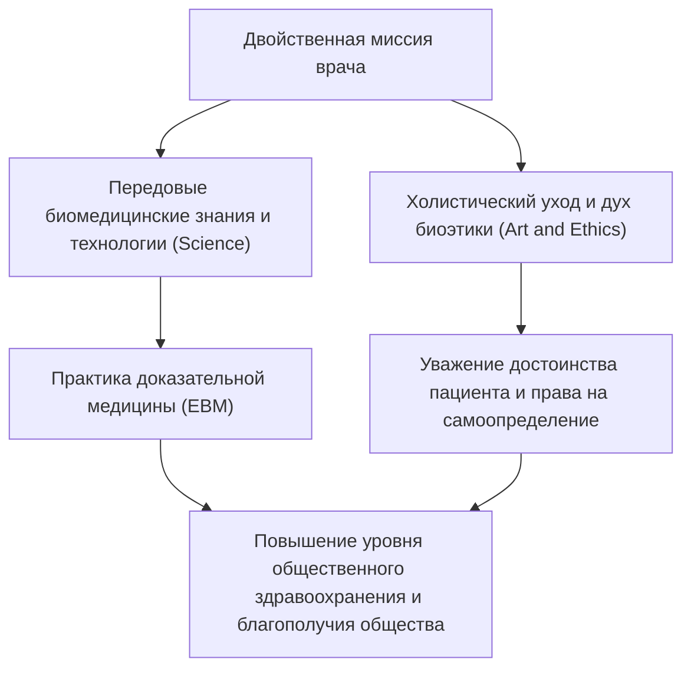
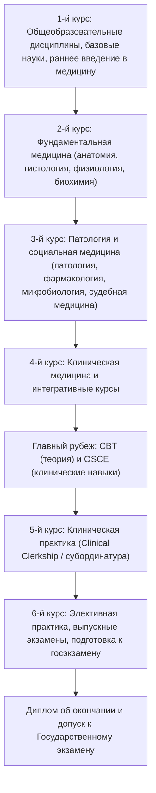
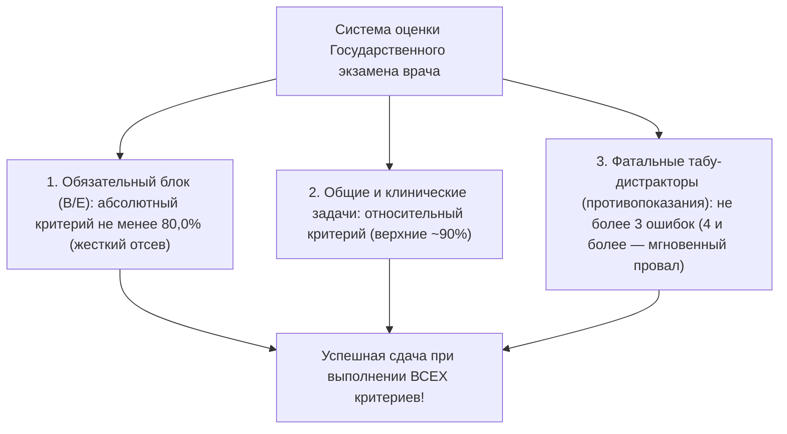
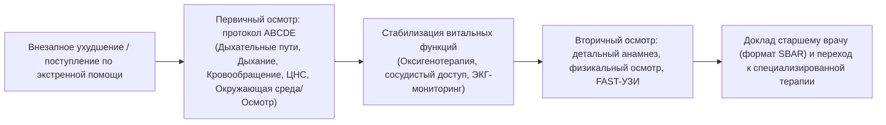
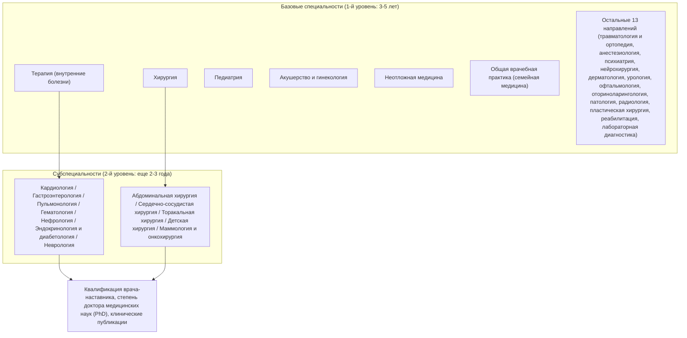
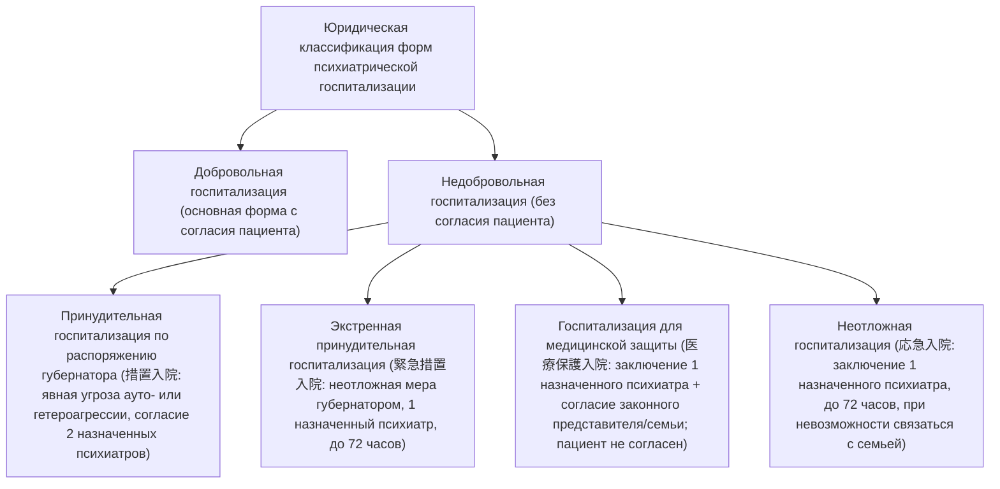
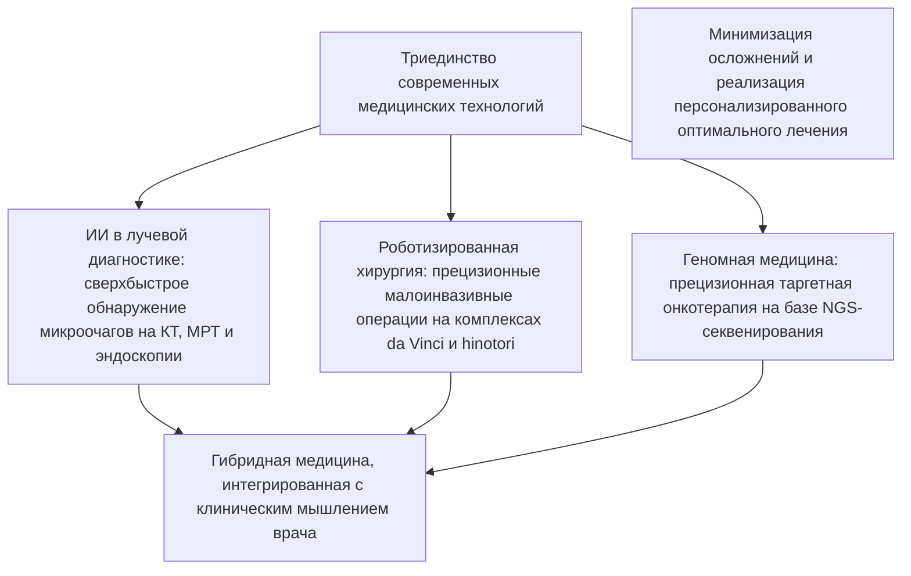

## 1. Введение: Пересечение священного долга спасения жизни и науки

### 1.1 Сущность врачебной профессии: Интеграция духа «врачебного пути» (医道) и современного естествознания

Профессия врача на протяжении всей истории человечества неизменно встречалась с особым благоговением и глубочайшим почтением. Зародившись в образах первобытных шаманов и религиозных целителей и пройдя через стремительное, грандиозное развитие современного естествознания, современный врач несет в себе двойную миссию: он одновременно является «технократом передовых наук о жизни» и «этическим стражем, разделяющим сострадание, боль и смерть другого человека».

Человек, сраженный недугом и столкнувшийся лицом к лицу со страхом небытия, обнажает перед врачом свою самую уязвимую и беззащитную телесную и духовную сущность. Действия врача, когда он берет в руки скальпель, вводит сильнодействующие фармакологические препараты и производит необратимое инвазивное вмешательство во внутренние структуры человеческого тела, формально подпадают под юридический состав преступления умышленного причинения вреда здоровью в уголовном праве. То фундаментальное основание, в силу которого эти манипуляции освобождаются от уголовной ответственности как законная профессиональная деятельность (ст. 35 Уголовного кодекса Японии) и окружаются непререкаемым общественным уважением, целиком зиждется на **абсолютном доверительном договоре (фидуциарном соглашении) между государством и гражданским обществом, гласящем: «Врач овладевает глубочайшими знаниями и безупречными навыками и искренне посвящает себя спасению человеческих жизней и преумножению здоровья»**.

Профессиональный долг врача не исчерпывается банальной терапией болезни (Disease: биологической аномалии). Неустанное следование «врачебному искусству» (The Art of Medicine / 医道), исцеляющему страдающую личность во всей ее целостности (Illness: субъективный экзистенциальный опыт страдания), представляет собой непреходящую сущность клинического призвания, которую невозможно заменить никакими алгоритмами искусственного интеллекта и роботизированными системами, сколь бы совершенными они ни стали.

---

### 1.2 Историческая эволюция: Клятва Гиппократа, Женевская и Лиссабонская декларации

Истоки медицинской деонтологии и этики восходят к древнегреческому «отцу медицины» Гиппократу (ок. 460–370 гг. до н. э.) и его ученикам, составившим бессмертную «Клятву Гиппократа» (Hippocratic Oath):
- Клятва перед лицом Аполлона Врачевателя, Асклепия, Гигиеи и Панакеи;
- Определение режима и терапевтических мер исключительно к выгоде и пользе больного сообразно своим силам и разумению, категорически воздерживаясь от причинения всякого вреда и несправедливости;
- Не давать никому просимого смертельного средства и не указывать пути к таковой цели, равно как и не вручать абортивного пессария женщине;
- Чисто и непорочно проводить свою жизнь и свое искусство, предоставляя оперативное сечение камней тем, кто занимается этим ремеслом профессионально;
- Хранить в абсолютной тайне все то, что придется увидеть или услышать в процессе лечения или вне его касательно частной жизни людей (врачебная тайна).

В Новейшее время, глубоко отрефлексировав чудовищные бесчеловечные эксперименты на людях, проводившиеся врачами нацистской Германии (разоблаченные и осужденные на Нюрнбергском процессе по делу врачей), Всемирная медицинская ассоциация (WMA) в 1948 году приняла **«Женевскую декларацию» (Declaration of Geneva)** — модернизированную версию Клятвы Гиппократа:
- «Торжественно клянусь посвятить свою жизнь служению человечеству»;
- «Здоровье моего пациента будет моей первой и главной заботой»;
- «Я не позволю соображениям возраста, болезни или немощи, вероисповедания, этнического происхождения, пола, национальности, политических убеждений, расы, сексуальной ориентации или социального положения встать между моим долгом и моим пациентом»;
- «Даже под угрозой я не буду использовать свои медицинские знания в нарушение прав человека и гражданских свобод».

Далее, в 1981 году была принята **«Лиссабонская декларация о правах пациента» (WMA Declaration of Lisbon on the Rights of the Patient)**, закрепившая на международном уровне права больного: «право на медицинскую помощь наивысшего качества», «право на свободу выбора врача и клиники», «право на полную информацию о состоянии своего здоровья», «право на информированное добровольное согласие и самоопределение (Informed Consent)», «право пациента в бессознательном состоянии на назначение законного представителя», «право на паллиативную помощь и достойное завершение жизни в терминальной стадии». Это ознаменовало необратимый переход от патриархального врачебного патернализма к эгалитарному партнерству, в центре которого стоит суверенная личность пациента.

---

### 1.3 Высочайший долг по Статье 1 Закона Японии о врачах

В японском правопорядке фундаментальным законодательным актом, определяющим правовой статус, полномочия и профессиональные обязанности доктора, выступает «Закон о медицинских работниках / Закон о врачах» (Закон № 201 от 1948 года). В Статье 1 данного закона миссия врача сформулирована с поразительным торжественным лаконизмом:

> **«Врач призван руководить лечебной деятельностью и санитарно-просветительским наставничеством, вносить действенный вклад в развитие и укрепление общественного здравоохранения и тем самым обеспечивать здоровую жизнь всего народа».**

Данная законодательная норма недвусмысленно предписывает, что профессиональный горизонт врача не ограничивается лечением конкретного больного, сидящего перед ним в кабинете (микроскопический клинический уровень), а в обязательном порядке простирается на общегосударственный уровень: борьбу с пандемиями, гигиену окружающей среды, профилактическую превентивную медицину и санитарную политику (макроскопический уровень общественного здравоохранения). Врачебная лицензия — это вовсе не личная привилегия, даруемая государством индивиду, а свидетельство возложения на него колоссальной публично-правовой ответственности за защиту священного дара жизни сограждан.

---

## 2. Грандиозная 6-летняя образовательная программа медицинского факультета и ключевые рубежи

Путь к получению звания врача невероятно суров, тернист и продолжителен. В Японии для допуска к государственному лицензированию необходимо успешно завершить полный 6-летний курс очного обучения на медицинском факультете университета (или в самостоятельном медицинском институте). Учебные планы всех 82 медицинских вузов страны жестко стандартизированы Министерством образования, культуры, спорта, науки и технологий (MEXT) на основе «Модельного базового учебного плана медицинского образования» (Medical Education Model Core Curriculum).

---

### 2.1 1–2-й курсы: Общегуманитарная подготовка и рассвет фундаментальной биомедицины

#### Этика и непреходящее медицинское значение анатомического препарирования
Первым и самым сокрушительным духовным испытанием, поджидающим студента на 2-м курсе, становится «Практикум по макроскопической / топографической анатомии человека» (Gross Anatomy). На протяжении нескольких месяцев будущие врачи ежедневно соприкасаются с телами умерших людей, которые при жизни добровольно завещали свои бренные останки медицинской науке (программа анатомического донорства «Кэнтай»).
- В едкой атмосфере паров формалина, которым консервируются ткани, студенты послойно рассекают эпидермис, аккуратно отсепаровывают подкожно-жировую клетчатку, с ювелирной точностью идентифицируя каждую вену, артерию, нервный ствол, мышечное брюшко, фасцию и внутренний орган.
- Перед первым разрезом скальпеля весь курс замирает в минуте благоговейного молчания, вознося благодарность донорам и их скорбящим родственникам за их величайший альтруистический дар.
- Этот практикум не только впечатывает во все органы чувств трехмерную топографическую архитектонику человеческого организма, но и служит инициатическим обрядом перехода: студент физически касается чужой смерти и принимает на свои плечи груз неизбежной ответственности за человеческую бренность.

#### Нормальная физиология, биологическая химия, гистология
- **Физиология**: постижение физико-химических основ жизнедеятельности — от механизма генерации потенциала действия в кардиомиоцитах (работа натрий-калиевой АТФазы, фазы деполяризации и реполяризации), процессов клубочковой фильтрации и канальцевой реабсорбции в нефронах почек до сложнейших контуров нейрогуморальной обратной связи эндокринных желез.
- **Биохимия**: детальное заучивание и глубокое осмысление метаболических путей на молекулярном уровне: цикла трикарбоновых кислот Кребса (TCA cycle), окислительного фосфорилирования в митохондриях, глюконеогенеза, $\beta$-окисления жирных кислот, биосинтеза белков, репликации, транскрипции и трансляции генетического кода ДНК/РНК.
- **Гистология**: микроскопическое изучение препаратов под световым и трансмиссионным электронным микроскопом, зарисовка тонкого строения эпителиальных, соединительных, мышечных и нервных тканей, анализ неразрывной корреляции между гистоархитектоникой и функцией.

---

### 2.2 3–4-й курсы: Патофизиология и систематическая клиническая медицина

Начиная с 3-го курса, фокус обучения смещается от физиологической нормы к механизмам патологии (клиническое приложение фундаментальных наук) и нозологическим формам заболеваний, их диагностике и фармакотерапии в рамках «Клинической медицины».

- **Патологическая анатомия и патофизиология**: дешифровка сущности заболеваний на основе морфологических перестроек клеток и тканей (альтерация, экссудация, пролиферация, коагуляционный и колликвационный некроз, степени клеточного атипизма, метаплазия, дисплазия, апоптоз).
- **Фармакология**: молекулярные механизмы лиганд-рецепторного связывания, основы фармакокинетики (всасывание, распределение, метаболизм, выведение: ADME), механизмы бактерицидного и бактериостатического действия антибиотиков, пути формирования микробной резистентности, механизм действия гипотензивных средств, ингибиторов контрольных точек и молекулярно-таргетных противоопухолевых агентов.
- **Частная внутренняя медицина (терапия)**: кардиология (острый инфаркт миокарда, нарушения ритма сердца, застойная сердечная недостаточность), пульмонология (рак легкого, ХОБЛ, идиопатический легочный фиброз), гастроэнтерология и гепатология (пептическая язва желудка, цирроз печени, колоректальный рак), нефрология (нефротический синдром, хроническая болезнь почек), эндокринология и метаболизм (сахарный диабет 1 и 2 типов, патология щитовидной железы), гематология (острые и хронические лейкозы, злокачественные лимфомы), неврология, системные коллагенозы и клиническая иммунология.
- **Частная хирургия**: хирургия органов брюшной полости, сердечно-сосудистая хирургия, торакальная хирургия, нейрохирургия, травматология и ортопедия — показания к операциям, предоперационная подготовка, ведение раннего послеоперационного периода, протоколы борьбы с шоковыми состояниями.
- **Педиатрия, акушерство и гинекология, психиатрия**: от врожденных аномалий развития и реанимации новорожденных до расстройств аутистического спектра; перинатальное ведение (физиологические и патологические роды, преэклампсия/эклампсия); современные протоколы фармакотерапии и психотерапии при шизофрении, биполярном аффективном расстройстве и тяжелой депрессии.
- **Социальная медицина, судебная медицина и общественное здравоохранение**: основы эпидемиологии и биостатистики, законодательство об инфекционных болезнях, гигиена труда и профпатология, клиническая токсикология, дифференциальная диагностика признаков насильственной смерти, процессуальные основы судебно-медицинской и патологоанатомической аутопсии.

---

### 2.3 Первый грандиозный рубеж: Экзамены CBT и OSCE (придание статуса государственного экзамена)

Осенью 4-го курса каждый студент-медик в Японии обязан сдать общенациональный квалификационный экзамен («Общий экзамен» / 共用試験), дающий право переступить порог университетских клиник. В соответствии с поправками к Закону о врачах, вступившими в силу в 2023 году (5-й год эпохи Рэйва), эти испытания получили официальный статус государственного квалификационного тестирования.

1. **CBT (Computer Based Testing)**:
   - Компьютерный стандартизированный экзамен, состоящий примерно из 320 тестовых заданий с множественным выбором ответа, охватывающих фундаментальные и клинические дисциплины.
   - Вопросы формируются динамически из огромного закрытого пула вопросов, а индивидуальный результат нормализуется с применением теории моделирования и параметризации педагогических тестов (IRT: Item Response Theory).
   - Охватывает фундаментальную, клиническую и социальную медицину; лица, не набравшие установленный нормативный балл (как правило, не менее 65–70%), безжалостно отчисляются или отправляются на повторный год обучения.
2. **Pre-CC OSCE (Objective Structured Clinical Examination — Объективный структурированный клинический экзамен)**:
   - Практический экзамен, призванный оценить не теоретические абстракции, а навыки сбора анамнеза (медицинского интервью), технику физикального обследования и деонтологическую манеру общения с пациентом.
   - Кандидат проходит череду специализированных станций (станция сбора анамнеза, обследование органов головы и шеи, кардиопульмональное обследование грудной клетки, пальпация/перкуссия живота, базовый неврологический статус, протокол сердечно-легочной реанимации), демонстрируя приемы на стандартизированных актерах-пациентах (SP) или высокоточных манекенах.
   - Независимые внешние экзаменаторы оценивают кандидата по жестким чек-листам: безупречность опрятности, приветствие, проявление эмпатии, дезинфекция рук, строгое соблюдение регламента аускультации и пальпации.

Лишь кандидаты, успешно преодолевшие оба этих жестких фильтра, удостаиваются почетного официального статуса **«Student Doctor» (Студент-врач)** и допускаются в больничные палаты к реальным пациентам.

---

### 2.4 5–6-й курсы: Клиническая субординатура (Clinical Clerkship)

На 5-м курсе стартует «Клиническая субординатура» (Clinical Clerkship: модель практического участия в лечебном процессе), в ходе которой студенты ротируются по различным профильным отделениям университетской клиники и базовых региональных больниц циклами по 1–2 недели.
В отличие от архаичной модели пассивного созерцания («экскурсионной практики»), современный клеркшип интегрирует студента в медицинскую бригаду на правах младшего коллеги:
- Под строгим надзором врачей-кураторов студент проводит ежедневные утренние курации закрепленных за ним больных, отслеживает витальные показатели, оформляет учебную медицинскую карту, анализирует данные лабораторно-инструментальных исследований и докладывает клинические случаи на общеклинических врачебных конференциях.
- В операционном блоке студент осуществляет хирургическую обработку рук по всем правилам асептики, облачается в стерильный халат и ассистирует хирургу в качестве второго или третьего ассистента — разводит края операционной раны пластинчатыми крючками (ретракторами) и отсекает лигатуры.
- Осваивает базовые инвазивные манипуляции: забор венозной крови, установку периферических венозных катетеров для инфузий, наложение простых узловых швов и снятие послеоперационных лигатур.
- На 6-м курсе во всех японских медицинских университетах наступает пора жестоких выпускных экзаменов («Соцуси» / 卒試). Ради поддержания высокого процента сдачи общегосударственного экзамена вузы применяют жесткую внутриуниверситетскую фильтрацию: неуспевающие студенты безапелляционно не допускаются к выпуску и остаются на второй год. Только победители этой беспощадной академической селекции получают допуск к Государственному экзамену на получение лицензии врача.

---

## 3. Архитектоника Государственного экзамена врача и водораздел успеха

Японский государственный экзамен врача (医師国家試験) находится в ведении Министерства здравоохранения, труда и социального обеспечения (MHLW) и проводится ежегодно в начале февраля на протяжении двух изнурительных дней.

### 3.1 Структура и регламент тестирования

Экзамен включает в себя ровно 400 вопросов, предъявляемых в формате бланкового тестирования с оптическим считыванием (с отдельными блоками расчетных задач и множественного выбора вариантов).

| Экзаменационный блок | Количество заданий | Время на выполнение | Профиль содержания |
| :--- | :---: | :---: | :--- |
| **Блок A** | 75 вопросов | 135 минут | Частные и общие разделы (клинические и общетеоретические задачи) |
| **Блок B** | 50 вопросов | 80 минут | **Обязательный блок вопросов (Must-Know: теория и клиника)** |
| **Блок C** | 75 вопросов | 135 минут | Клинические ситуационные кейсы высокой сложности (длинные фабулы) |
| **Блок D** | 75 вопросов | 135 минут | Общие разделы (фундаментальная медицина, общественное здоровье) |
| **Блок E** | 50 вопросов | 80 минут | **Обязательный блок вопросов (безопасность медицины, законы)** |
| **Блок F** | 75 вопросов | 135 минут | Интегративные клинические задачи комплексного профиля |

---

### 3.2 Три ключевых критерия отбора и ужас «80% в обязательном блоке»

Окончательное решение о сдаче Государственного экзамена врача выносится на основе **одновременного выполнения всех трех независимых критериев**. Падение ниже порогового уровня хотя бы по одному показателю влечет за собой немедленный и безоговорочный провал.

1. **Абсолютный порог обязательного блока (строгий критерий 80,0%)**:
   - По обязательному блоку вопросов (блоки B и E: суммарно 100 вопросов, оцениваемых в 200 баллов) соискатель **обязан набрать не менее 80,0% правильных ответов (минимум 160 баллов)**.
   - Даже если кандидат решил блок общеклинических задач практически на 100%, нехватка хотя бы одного-единственного балла в обязательном блоке (например, результат 159 из 200) автоматически влечет за собой аннулирование экзамена и несдачу. По этой причине будущие врачи заполняют бланки обязательного блока в состоянии запредельного стресса и дрожи в руках.
2. **Относительный порог по общетеоретическим и клиническим заданиям**:
   - Оценка за общие теоретические и клинические ситуационные задачи является относительной. Проходной балл вычисляется на основе статистического распределения результатов всех выпускников года, отсекая нижние 10–11% сдававших (обычно плавающий порог колеблется в районе 68–72% правильных ответов).
3. **Ловушка фатальных противопоказаний (табу-дистракторы: 禁忌肢 / Contraindications)**:
   - Самый психологически давящий элемент японского экзамена — так называемые «вопросы-табу». Если выпускник выбирает вариант ответа, который в реальной клинической практике расценивается как **«грубейшая врачебная ошибка, ведущая к неминуемой гибели больного», «грубое попрание фундаментальных прав человека» или «прямое уголовное правонарушение»**, ему начисляется штрафное табу-очко.
   - Как правило, **выбор 4 (в отдельные годы — 3) фатальных табу-ответов приводит к автоматическому провалу экзамена**, даже если по всем остальным шкалам соискатель показал феноменально высокие результаты.
   - *(Клинические примеры табу-ошибок: назначение тромболитиков или прямых антикоагулянтов больному с подозрением на геморрагический инсульт; выжидательная тактика с изолированным введением глюкокортикоидов вместо немедленной внутримышечной инъекции адреналина при анафилактическом шоке; назначение противопоказанных седативных препаратов вместо атропина при остром отравлении фосфорорганическими соединениями; оформление недобровольной госпитализации в психиатрический стационар исключительно по желанию родственников при отсутствии показаний и согласия дееспособного пациента).*

---

## 4. Испытание первичной клинической резидентуры (2 года): Система всесторонней суперротации

Сдача государственного экзамена, внесение записи в государственный реестр врачей и вручение долгожданной лицензии вовсе не дают права сразу же открыть частную практику или единолично лечить пациентов (ст. 16-2 Закона о врачах). Закон обязывает каждого новоиспеченного доктора пройти непрерывную двухгодичную программу последипломной клинической интернатуры/ординатуры (residency).

### 4.1 Революция системы последипломного медицинского образования 2004 года

До 2004 года (16-й год эпохи Хэйсэй) выпускники японских медицинских институтов сразу после студенческой скамьи поступали в распоряжение конкретной университетской кафедры («Икёку» / 医局 — например, 1-я кафедра терапии или 2-я кафедра хирургии). Молодой врач сразу же замыкался в сверхсверхузких рамках специальности своей кафедры. В итоге система порождала абсурдные деформации: «высококлассный специалист по гастроинтестинальной эндоскопии оказывался совершенно беспомощен при простом переломе костей предплечья, офтальмологической травме или купировании кардиогенного отека легких на этапе скорой помощи».

Чтобы сломать эту порочную цеховую изолированность, была внедрена общегосударственная обязательная система многопрофильной интернатуры («Суперротация» / スーパーローテート):
- **Обязательное освоение навыков первичной медико-санитарной помощи**: вне зависимости от будущей узкой специализации каждый врач обязан пройти циклы по внутренней медицине (терапии — не менее 6 месяцев), неотложной помощи и реанимации (не менее 3 месяцев), общей врачебной практике в первичном звене здравоохранения / сельской медицине (не менее 1 месяца), а также педиатрии, акушерству и гинекологии, психиатрии и хирургии, приобретая устойчивые навыки врача общей практики (Primary Care).
- **Внедрение системы клинического матчинга (Matching)**: назначение интерна в больницу перестало быть феодальным решением профессора кафедры. Была создана Японская ассоциация содействия клиническому распределению врачей, где студенты и аккредитованные клинические центры составляют рейтинговые списки предпочтений, а окончательное бесконфликтное распределение осуществляет математический алгоритм Гейла — Шепли (алгоритм устойчивого паросочетания).
- Это нововведение вызвало колоссальный тектонический сдвиг: выпускники ринулись в передовые муниципальные и частные многопрофильные клиники с мощнейшей клинической базой и достойной оплатой дежурств (госпиталь Св. Луки в Токио, больницы Тораномон, Курасики Тюо, Камеда и др.), что повлекло за собой отток кадров из университетских кафедр и обострило проблему нехватки врачей в отдаленных префектурах.

---

### 4.2 Суровые будни врача-интерна (Junior Resident) и овладение инвазивной техникой

Два года клинической интернатуры становятся самым эмоционально насыщенным, изнурительным и трансформирующим этапом в жизни доктора.

- **Ночные дежурства в блоке неотложной помощи**: поток пациентов не прекращается ни на минуту — от амбулаторных больных с лихорадкой до тяжелейших пострадавших с политравмой и доставленных бригадами скорой помощи в состоянии клинической смерти (CPA: Cardiopulmonary Arrest). Под руководством опытного реаниматолога интерн реализует международный протокол **ABCDE-подхода** (Airway, Breathing, Circulation, Dysfunction of CNS, Exposure), мгновенно проводя медицинскую сортировку.
- **Отработка обязательных манипуляций**:
  - Пункция лучевой артерии для анализа газов крови;
  - Ультразвуковое исследование у постели больного по протоколу FAST (Focus Assessed Sonography for Trauma) для экстренной визуализации свободной жидкости и гемоперитонеума;
  - Катетеризация центральных вен (CVC) под ультразвуковой навигацией (пункция внутренней яремной или подключичной вены);
  - Интубация трахеи с прямой ларингоскопией и верификацией положения эндотрахеальной трубки;
  - Люмбальная пункция с забором ликвора и манометрией ликворного давления при подозрении на менингит;
  - Дренирование плевральной полости по Бюлау, лапароцентез.
- **Констатация биологической смерти и сообщение скорбных вестей**: момент, когда молодой врач впервые самостоятельно констатирует остановку эффективного кровообращения, фиксирует расширение зрачков, отсутствие фотореакций, изолинию на кардиомониторе и заполняет медицинское свидетельство о смерти. Выход к оцепеневшим родственникам, подбор бережных, но твердых слов соболезнования. В эти минуты колоссальная экзистенциальная тяжесть профессии проникает в самое сердце врача.

---

## 5. Новая система аккредитации врачей-специалистов: 19 базовых дисциплин и субспециальности

После завершения 2-летней первичной резидентуры врач переходит в статус «врача-ординатора / старшего резидента» (Senior Resident / 専攻医) и окончательно определяет профиль своего жизненного призвания. Запущенная в полномасштабном режиме в 2018 году (30-й год эпохи Хэйсэй) «Новая система врачей-специалистов» представляет собой централизованную двухступенчатую пирамиду, управляемую и сертифицируемую Японским советом медицинских специальностей (Japanese Medical Specialty Board / 日本専門医機構).

---

### 5.1 Структура 19 базовых направлений специализации

Ординатор зачисляется в утвержденную программу по одному из **19 базовых направлений** сроком от 3 до 5 лет.

| Базовое направление | Срок обучения | Ключевые клинические характеристики и требования |
| :--- | :---: | :--- |
| **Терапия (Внутренние болезни)** | 3 года | Колоссальный реестр клинических историй: обязательная защита сотен детализированных эпикризов в системе J-OSLER. Фундамент для всех терапевтических субспециальностей. |
| **Хирургия** | 3–4 года | Базовая подготовка по абдоминальной, кардиоваскулярной, торакальной и детской хирургии. Обязательное внесение лично выполненных операций в базу National Clinical Database (NCD). |
| **Педиатрия** | 3 года | Неонатология и интенсивная терапия новорожденных (ОРИТН / NICU), неотложные состояния детского возраста, вакцинопрофилактика, аллергология и пороки развития. |
| **Акушерство и гинекология** | 3 года | Перинатальная медицина (ведение родов, экстренное кесарево сечение), онкогинекологические операции, вспомогательные репродуктивные технологии (ВРТ). |
| **Неотложная медицина** | 3 года | Тяжелая сочетанная политравма, септический шок, острые экзогенные отравления, комбустиология, работа в реанимации (ОРИТ) и на санитарных вертолетах (Doctor-Heli). |
| **Общая врачебная практика** | 3 года | Новое направление. Интегрированное ведение полиморбидных больных в первичном звене, семейная медицина, паллиативная помощь на дому. |
| **Травматология и ортопедия** | 3–4 года | Металлоостеосинтез переломов, эндопротезирование крупных суставов, вертебрология, спортивная травма, реабилитация опорно-двигательного аппарата. |
| **Анестезиология** | 4 года | Тотальная внутривенная и ингаляционная анестезия, эпидуральная и спинальная блокады, терапия острой боли, периоперационный менеджмент критических инцидентов. |
| **Психиатрия** | 3 года | Синхронизировано с получением статуса «Назначенного врача по охране психического здоровья». Лечение эндогенных психозов, аффективных расстройств и когнитивных нарушений. |
| **Нейрохирургия** | 4 года | Микрохирургическое клипирование аневризм головного мозга, краниотомия и удаление глиом, эндоваскулярная эмболизация, хирургия черепно-мозговой травмы. |
| **Рентгенология и радиология** | 3 года | Экспертная расшифровка КТ, МРТ, ПЭТ-КТ; эндоваскулярные интервенционные вмешательства под рентген-контролем (IVR), радиотерапия злокачественных опухолей. |
| **Патологическая анатомия** | 3 года | Интраоперационные срочные биопсии, гистологическая и иммуногистохимическая верификация опухолей, клинико-анатомические конференции (КПК) и аутопсии. |
| **Другие 7 направлений** | 3–4 года | Дерматология, урология, офтальмология, оториноларингология, пластическая хирургия, реабилитационная медицина, клиническая лабораторная диагностика. |

---

### 5.2 Углубление в субспециальности и степень доктора медицинских наук (PhD)

Успешно сдав строгий экзамен базового уровня, специалист поднимается на второй этаж системы — к узким субспециальностям (кардиолог, эндоскопист, интервенционный аритмолог, кардиохирург, клинический онколог и т. д.), требующим еще 2–3 лет упорного труда.

Параллельно значительная часть врачей поступает в четырехлетнюю аспирантуру (Graduate School of Medicine) при ведущих университетах. Проводя ночи в лабораториях молекулярной генетики, проточной цитометрии и биоинформатики, они синтезируют фундаментальные исследования с клинической практикой, публикуют научные статьи в качестве первого автора в ведущих международных реферируемых журналах (Q1/Q2) и защищают диссертацию на соискание ученой степени **доктора медицинских наук (PhD / 医学博士)**. Так формируется элита современной академической медицины — врачи-исследователи (Physician-Scientists), способные генерировать новые знания мирового уровня.

---

## 2.5 Глубокая патофизиология и математические модели фармакокинетики (теория PK/PD)

Для того чтобы клиническое мышление будущего врача не скатывалось к слепому эмпирическому запоминанию торговых названий лекарств, в современное медицинское образование внедрена математическая и молекулярно-фармакологическая концепция **«Теории PK/PD (Фармакокинетика / Фармакодинамика)»**.

### Фундаментальные параметры фармакокинетики (PK)
- **Площадь под фармакокинетической кривой «концентрация–время» (AUC: Area Under the Curve)**: интегральный показатель суммарного системного воздействия лекарственного средства на организм.
- **Максимальная концентрация в сыворотке крови ($Cmax$)**: пиковый уровень концентрации действующего вещества после введения.
- **Объем распределения ($Vd$)**: гипотетический объем жидкости, необходимый для равномерного распределения введенной дозы до концентрации, равной сывороточной; отражает гидрофильность (преимущественно внеклеточное распределение) или липофильность (глубокое проникновение в ткани и клетки).

### Три фундаментальных паттерна параметров PK/PD для антибактериальных препаратов
В антибактериальной химиотерапии клиническая эффективность определяется соотношением сывороточной концентрации антибиотика и минимальной подавляющей концентрации (MIC: Minimum Inhibitory Concentration) в отношении возбудителя:

| Параметр PK/PD | Индикатор клинической эффективности | Репрезентативные классы антибиотиков | Стратегия оптимизации режима дозирования |
| :--- | :--- | :--- | :--- |
| **Time above MIC ($T > MIC$)** | Процент времени межинтервального периода, в течение которого концентрация превышает MIC (%) | **Пенициллины, цефалоспорины, карбапенемы** ($\beta$-лактамные антибиотики) | Бесполезно чрезмерно увеличивать разовую дозу; максимальный бактерицидный эффект достигается **увеличением кратности введений (3–4 раза в сутки)** либо переходом на продленную / постоянную инфузию. |
| **$Cmax / MIC$** | Кратность превышения максимальной пиковой концентрацией величины MIC | **Аминогликозиды** (гентамицин, амикацин) | Избегают частого дробного введения; практикуется **введение всей суточной дозы однократно**, создающее высокий пик, что максимизирует концентрационно-зависимый киллинг и длительный постантибиотический эффект (PAE), одновременно снижая нефро- и ототоксичность. |
| **$AUC / MIC$** | Отношение суммарной суточной экспозиции препарата к значению MIC | **Фторхинолоны, ванкомицин** (гликопептиды) | Обеспечение целевой суммарной суточной дозы. При применении ванкомицина обязателен терапевтический лекарственный мониторинг (TDM) с поддержанием остаточной концентрации (trough level) в диапазоне $15 \sim 20 \;\mu g/mL$. |

---

## 3.6 Сложные рубежи экзамена: Законодательство об инфекционных болезнях и Закон о психическом здоровье

Одним из самых сложных разделов Государственного экзамена врача традиционно выступает судебно-медицинское и санитарное право. Ошибки здесь недопустимы: экзаменаторы требуют точнейшего знания юридических формулировок.

### ① Классификация инфекций по Закону об инфекционных болезнях и обязанность врача по уведомлению
«Закон о профилактике инфекционных заболеваний и медицинской помощи больным инфекционными заболеваниями» дифференцирует патогены по степени их контагиозности и тяжести течения от I до V категории:

- **Инфекции I категории (геморрагическая лихорадка Эбола, чума, болезнь Марбург, лихорадка Ласса, Крым-Конго геморрагическая лихорадка, натуральная оспа, южноамериканские геморрагические лихорадки)**:
  - Врач обязан **незамедлительно (без малейшего промедления) уведомить губернатора префектуры через директора местного центра общественного здравоохранения (Хокэндзё)**.
  - Активируются чрезвычайные государственные меры: принудительная госпитализация в боксированные палаты инфекционных клиник 1-го типа, ограничение передвижения в очаге на срок до 72 часов, изъятие и уничтожение контаминированного имущества.
- **Инфекции II категории (туберкулез, SARS, MERS, высокопатогенный грипп птиц H5N1/H7N9, полиомиелит)**:
  - Незамедлительное уведомление. Помещение в стационары 2-го типа. При туберкулезе применяется государственная система льготного лекарственного обеспечения даже для латентной туберкулезной инфекции (LTBI).
- **Инфекции III категории (холера, бактериальная дизентерия, брюшной тиф, паратиф, энтерогеморрагический эшерихиоз EHEC O157 и др.)**:
  - Незамедлительное уведомление. Принудительной госпитализации нет, но вводится жесткий запрет на профессиональную деятельность для работников общепита и водоснабжения до получения отрицательных результатов бактериологических посевов.
- **Инфекции IV категории (гепатит E, гепатит A, малярия, бешенство, лихорадка денге, желтая лихорадка, японский энцефалит, легионеллез, столбняк и др.)**:
  - Зоонозы и трансмиссивные инфекции. Незамедлительное уведомление. Межличностная передача воздушно-капельным путем отсутствует, поэтому изоляция пациентов не применяется.
- **Инфекции V категории**:
  - **Сплошная регистрация всех случаев (в течение 7 дней)**: корь, краснуха, сифилис, острые энцефалиты, столбняк, инвазивная менингококковая инфекция, СПИД/ВИЧ (при кори и краснухе — немедленная экстренная подача извещения).
  - **Мониторинг по дозорным медицинским организациям (еженедельные и ежемесячные отчеты опорных клиник)**: сезонный грипп, энтеровирусный везикулярный стоматит, RS-вирусная инфекция, инфекционные гастроэнтериты.

### ② Юридическая прецизионность форм госпитализации в Законе о психическом здоровье
«Закон о психическом здоровье и благополучии лиц с психическими расстройствами» устанавливает филигранный баланс между защитой гражданских прав пациента и предотвращением опасности для него самого и общества.

На экзамене особое внимание уделяется структуре «Госпитализации для медицинской защиты» (очередность лиц, имеющих право давать согласие: супруг, лицо с родительскими правами, лица, обязанные по закону содержать пациента, опекуны, а при их отсутствии — мэр муниципалитета), а также процедуре «Принудительной госпитализации по решению губернатора» на основании уведомления полиции (ст. 24) или граждан (ст. 22).

---

## 4.5 Поле битвы в приемном покое: Алгоритм дифференциальной диагностики нарушений сознания «AIUEO TIPS»

В ординаторской раздается звонок дежурного телефона PHS: «Скорая помощь везет мужчину 70 лет с глубоким нарушением сознания!». В эту же секунду в сознании дежурного врача должен мгновенно развернуться мировой стандарт дифференциальной диагностики комы — мнемонический алгоритм **«AIUEO TIPS»**.

| Литера | Дифференцируемая патология | Первоочередное действие в блоке реанимации |
| :---: | :--- | :--- |
| **A** | **A**lcohol (острая алкогольная интоксикация) / **A**cidosis (метаболический ацидоз) | Оценка запаха выдыхаемого воздуха, исследование газов артериальной крови, расчет анионного промежутка (AG) и уровня лактата. |
| **I** | **I**nsulin (гипогликемия, диабетический кетоацидоз: DKA / гиперосмолярное гипергликемическое состояние: HHS) | **Экстренная глюкометрия капиллярной крови из пальца у постели больного!** (Тяжелая гипогликемия за десятки минут приводит к необратимой гибели коры головного мозга — немедленное болюсное струйное введение 40–50% раствора глюкозы). |
| **U** | **U**remia (уремическая кома) | Биохимический анализ крови: азот мочевины (BUN), сывороточный креатинин, калий. Оценка показаний к экстренному гемодиализу. |
| **E** | **E**ncephalopathy (печеночная / гипертоническая энцефалопатия) / **E**lectrolytes (электролитные нарушения) / **E**ndocrine (тиреотоксический криз, микседематозная кома, надпочечниковая недостаточность) | Исследование уровня аммиака плазмы, электролитов (осторожность: риск синдрома осмотической демиелинизации при слишком быстрой коррекции гипонатриемии!). |
| **O** | **O**xygen (тяжелая гипоксия) / **O**verdose (острое медикаментозное отравление) / **O**piate (передозировка опиоидов) | Пульсоксиметрия, газы крови. При наличии триады (кома, точечные зрачки, брадипноэ) — немедленное введение налоксона. |
| **T** | **T**rauma (черепно-мозговая травма) / **T**emperature (глубокая гипотермия или злокачественная гипертермия/тепловой удар) | Компьютерная томография (КТ) головного мозга (эпидуральная / субдуральная гематома), измерение истинной ректальной температуры. |
| **I** | **I**nfection (нейроинфекции: менингит, менингоэнцефалит, тяжелый уросепсис/пневмосепсис) | Проверка ригидности затылочных мышц, симптома Кернига, феномена Jolt accentuation. Забор двух раздельных наборов гемокультур, немедленная эмпирическая антибиотикотерапия (цефтриаксон + ванкомицин + ампициллин), люмбальная пункция. |
| **P** | **P**sychiatric (психогенная ареактивность, диссоциативные расстройства) / **P**orphyria (острая перемежающаяся порфирия) | Диагноз исключения: устанавливается только после абсолютного исключения всей соматической и неврологической органической патологии. |
| **S** | **S**troke (ОНМК: ишемический инсульт, внутримозговое или субарахноидальное кровоизлияние) / **S**eizure (бессудорожный эпилептический статус) / **S**hock (гиповолемический, кардиогенный, обструктивный или дистрибутивный шок) | Неврологический осмотр (очаговый дефицит), экстренная КТ/МРТ головного мозга (DWI). Определение терапевтического окна для тромболизиса (rt-PA до 4,5 часов) или эндоваскулярной тромбэкстракции. |

Самая грубая и непростительная ошибка начинающего врача — отправлять пациента в коме на КТ со словами «Сначала снимем голову». Если у пациента критическая гипогликемия или гипоксия, он остановится прямо на столе томографа. Железная заповедь экстренной медицины: **«Сначала витальные функции, затем глюкоза, полная стабилизация по ABCDE, и лишь потом — диагностическая визуализация!»**.

---

## 5.5 Карьерный путь врача, экономические реалии и непрерывное образование

### Структурный разрыв доходов: Врачи университетских клиник, городских больниц и частная практика
В массовом сознании укоренен стереотип о баснословном богатстве любого человека в белом халате. В действительности распределение доходов среди врачей носит ярко выраженный ступенчатый характер.

1. **Тяжелые финансовые реалии врачей университетских клиник**:
   - Среднегодовой доход интерна первых двух лет составляет скромные 3,5–4,5 миллиона иен.
   - В период старшей ординатуры в университетской больнице базовый оклад может составлять всего 200–300 тысяч иен в месяц. Отрабатывая тяжелейшие смены в палатах, готовя научные публикации и доклады на съездах, молодые врачи вынуждены брать 1–2 раза в неделю ночные дежурства на стороне («байт» / 当直アルバイト в хосписах или районных дежурных стационарах за 40–80 тысяч иен за смену), чтобы банально свести концы с концами.
   - Даже защитив кандидатскую диссертацию (PhD) к 35 годам и став доцентом кафедры, доход в стенах альма-матер часто не превышает 6–8 миллионов иен в год.
2. **Врачи опорных многопрофильных стационаров (клинические специалисты среднего звена)**:
   - В возрасте от 35 до 45 лет, занимая позицию заведующего отделением или старшего ординатора в крупной городской или ведомственной больнице, врач выходит на уровень дохода 12–18 миллионов иен в год. Однако за этим стоят непрерывный груз дежурств по экстренной помощи, ночные вызовы на ургентные операции и изнурительный режим «на связи 24/7».
3. **Владельцы частных клиник (Private Practice)**:
   - Открыв собственную амбулаторную клинику после 40 лет, взяв в банке многомиллионные кредиты на покупку помещений и томографов, успешный врач-предприниматель может зарабатывать 25–40 миллионов иен в год и выше. Но в этом статусе он принимает на себя неограниченные финансовые риски, бремя налогов, управление персоналом и ответственность за маркетинг.

### Риски медицинских судебных исков и профессиональное страхование
Каждый практикующий врач ежедневно балансирует на грани риска сокрушительных гражданских исков о возмещении вреда:
- Родовая травма с развитием детского церебрального паралича при асфиксии плода (покрывается государственной системой компенсаций акушерских осложнений, но в случае судебного разбирательства суммы исков достигают 100–200 миллионов иен);
- Тромбоэмболия легочной артерии (ТЭЛА) в послеоперационном периоде, токсический эпидермальный некролиз при химиотерапии, пропущенное злокачественное новообразование на рентгенограмме;
- Членство во Врачебной ассоциации Японии и обязательное оформление полиса индивидуального страхования профессиональной ответственности врача (医賠責) является безальтернативным условием выживания в профессии.

---

## 6. Законодательство, институты и медицинская биоэтика

Ежедневный труд клинициста оплетен тончайшей юридической тканью правовых норм. Игнорирование законов грозит не только аннулированием лицензии или приостановлением права на медицинскую практику (административное наказание по ст. 7 Закона о врачах), но и уголовным преследованием и астрономическими исками.

### 6.1 Анализ ключевых статей Закона о врачах

#### ① Обязанность оказания медицинской помощи (ст. 19 п. 1 Закона о врачах — 応召義務)
> «Врач, занимающийся лечебной практикой, при поступлении требования о медицинском осмотре или лечении не имеет права отказать в нем без уважительных на то причин».

Исторически эта норма трактовалась как абсолютный запрет на отказ больному ни при каких обстоятельствах. Однако циркуляр Министерства здравоохранения от 2019 года установил современные правовые рамки:
- В часы приема врач обязан принять экстренные меры либо обеспечить перевод пациента, даже если случай выходит за рамки его узкой специальности.
- В нерабочие часы, если клиника не является дежурным ургентным стационаром, а также в ситуациях алкогольного дебоша, насилия в отношении персонала, систематической злостной неуплаты медицинских счетов либо крайнего физического истощения самого врача, создающего прямую угрозу безопасности лечения, закон официально признает отказ правомочным («наличие уважительной причины»).

#### ② Запрет лечения без личного осмотра (ст. 20 Закона о врачах — 無診察治療の禁止)
> «Врач не имеет права назначать лечение, выписывать рецепты без проведения непосредственного личного осмотра пациента, равно как и выдавать медицинское свидетельство о рождении или мертворождении, не присутствовав лично при родах».

Категорически запрещена дистанционная выписка препаратов вслепую. Бурно развивающаяся в последние годы телемедицина («онлайн-консультации») допускается законом лишь как строго регламентированное исключение при соблюдении руководящих принципов Министерства здравоохранения для определенных нозологий и при условии первичного очного контакта.

#### ③ Обязанность сообщения о подозрительных смертях (ст. 21 Закона о врачах — 異状死体の届出義務)
> «Врач, проводивший освидетельствование мертвого тела или мертворожденного плода сроком от 4 месяцев и обнаруживший признаки неестественной смерти, обязан в течение 24 часов уведомить об этом подследственный орган полиции».

Вопрос о том, подпадают ли внезапные неблагоприятные исходы операций и внутрибольничные ятрогенные смерти под понятие «неестественной смерти» (異状死), породил драматические судебные баталии в Верховном суде Японии (дела Токийского женского медицинского университета и Токийской муниципальной больницы Хироо). Судебная практика постановила: если смерть связана с медицинским инцидентом и имеются подозрения на внешние механические повреждения или преступную халатность, врач обязан уведомить полицию; попытки сокрытия данных фактов караются в уголовном порядке.

---

### 6.2 Информированное согласие и деликтная ответственность за врачебную ошибку

В гражданском судопроизводстве иски к медицинским учреждениям опираются на две несущие опоры: «нарушение обязанности проявления должной заботливости (врачебная халатность)» и «нарушение обязанности разъяснения (дефект информированного согласия)».

- **Стандарт медицинской помощи (Standard of Care)**: мера должной осмотрительности врача оценивается судом не абстрактно, а объективно — на основании того, «как обязан был поступить среднестатистический добросовестный врач соответствующей квалификации в аналогичных клинических условиях на момент инцидента».
- **Информированное согласие (Informed Consent)**: клиницист обязан доступным языком разъяснить больному: 1) точный диагноз и стадию болезни; 2) сущность предлагаемого вмешательства; 3) вероятные риски, спектр осложнений и частоту побочных реакций; 4) альтернативные терапевтические опции с их плюсами и минусами; 5) прогноз при отказе от терапии. Если операция выполнена безупречно с технической точки зрения, но развилось редкое осложнение, о вероятности которого больной не был предупрежден, суд взыскивает компенсацию морального вреда за нарушение фундаментального «права пациента на самоопределение».

---

## 6.5 Принятие решений в терминальной медицине (ACP) и юридическая констатация смерти мозга

Самые мучительные морально-этические решения в жизни врача связаны с паллиативным уходом в финале человеческой жизни и процедурой установления смерти мозга.

### ① Руководство по принятию решений о медицинской помощи на завершающем этапе жизни
На основе клинических руководств Министерства здравоохранения Японии фундаментом паллиативного ухода стала концепция **ACP (Advance Care Planning — Предварительное планирование медицинской помощи, так называемый «Жизненный совет» / 人生会議)**.
- Врачу категорически запрещено единолично принимать решение о начале или прекращении мер жизнеобеспечения (ИВЛ, вазопрессоры, реанимационные мероприятия).
- Если воля пациента ясна: многопрофильная команда врачей, медсестер и социальных работников выстраивает уход в строгом соответствии с его волеизъявлением, регулярно актуализируя его по мере течения болезни.
- Если пациент недееспособен: воля реконструируется со слов родственников, а при невозможности — коллегиально принимается решение, максимально отвечающее наилучшим интересам больного.
- **Условия освобождения от уголовной ответственности при отказе от жизнеобеспечения**: 1) терминальная стадия неизлечимого заболевания; 2) явно выраженная воля больного (прижизненное завещание — Living Will); 3) исчерпывающее купирование страданий; 4) строжайшее соблюдение коллегиального мультидисциплинарного консилиума (прецеденты больницы Кавасаки Кёдо и больницы Симин города Имидзу).

### ② 6 юридических критериев установления смерти мозга по Закону о трансплантации органов
В соответствии с японским «Законом о трансплантации органов» концепция «смерти мозга» (Brain Death) признается эквивалентом юридической и биологической смерти человека исключительно в контексте последующего донорства органов. Протокол констатации требует двукратного независимого подтверждения по строжайшему регламенту:

1. **Глубокая запредельная кома**: III степень по шкале комы Глазго (GCS 3) или 300 баллов по шкале Japan Coma Scale (полное отсутствие реакций на внешние раздражители).
2. **Двусторонний стойкий мидриаз и арефлексия зрачков**: диаметр зрачков обоих глаз $\ge 4 \text{ мм}$, абсолютное отсутствие прямой и содружественной реакции на свет.
3. **Полное угасание всех 7 стволовых рефлексов**:
   - зрачковый (фотореакция);
   - роговичный (отсутствие моргания при касании роговицы ватным фитилем);
   - окулоцефалический (феномен «глаз куклы» — глазные яблоки неподвижны при форсированном повороте головы);
   - вестибулоокулярный (холодовая калорическая проба: отсутствие нистагма и девиации глаз при введении ледяной воды в слуховой проход);
   - цилиоспинальный (зрачки не расширяются при щипке кожи шеи);
   - глоточный (отсутствие рвотных движений при раздражении задней стенки глотки);
   - трахеобронхиальный кашлевой (отсутствие кашля при глубокой аспирации из интубационной трубки).
4. **Электрическое молчание коры на ЭЭГ (Flat EEG)**: непрерывная многоканальная запись по международной системе «10-20» при максимальной чувствительности ($2 \;\mu V/\text{мм}$) в течение не менее 30 минут без единого признака биоэлектрической активности мозга.
5. **Полное апноэ (апноэтический тест)**: отключение аппарата ИВЛ с подачей $100\% \; O_2$ через эндотрахеальный катетер до тех пор, пока парциальное давление углекислого газа в артериальной крови ($PaCO_2$) не достигнет $\ge 60 \text{ мм рт. ст.}$, подтверждающее полное отсутствие дыхательных движений.
6. **Временной интервал повторного подтверждения**: проведение повторного идентичного обследования спустя **не менее 6 часов** (для детей в возрасте до 6 лет — не менее 24 часов) для подтверждения необратимости гибели ствола и полушарий мозга.

Моментом юридической смерти человека признается время завершения второго консилиума. Врач стоит у этой постели, совмещая предельную естественнонаучную строгость с трепетом перед величием тайны угасания жизни.

---

## 7. Непрерывное образование и вызовы XXI века: Реформа условий труда и искусственный интеллект

### 7.1 Тектонические сдвиги реформы условий труда врачей (с апреля 2024 года)

На протяжении многих десятилетий непревзойденная японская продолжительность жизни и всеобщая доступность медицины покоились на молчаливом самопожертвовании медицинского корпуса — фактически безлимитной сверхурочной работе (100–200 часов переработок в месяц с непрерывными дежурствами).

С целью ликвидации эпидемии профессионального выгорания и смертей от переутомления (кароси) с апреля 2024 года (6-й год эпохи Рэйва) вступил в силу закон об ограничении предельной сверхурочной занятости врачей.

| Категория норматива | Целевая группа врачей и медицинских организаций | Годовой лимит сверхурочной работы | Месячный лимит и характерные черты |
| :--- :--- | :--- | :---: | :--- |
| **Уровень A** | Врачи общего профиля большинства стационаров | **960 часов** (в среднем не более 80 часов в месяц) | Жесткое ограничение в пределах официального порога риска кароси. |
| **Уровень B** | Экстренные и специализированные региональные клиники | **1 860 часов** (максимум до 155 часов в месяц) | Временный адаптационный режим, требующий специального статуса от префектуры. |
| **Уровень C** | Программы интенсивного обучения (интерны, ординаторы) | **1 860 часов** (максимум до 155 часов в месяц) | Квота профессионального роста, где требуется накопление огромного числа манипуляций. |

Эта реформа принесла долгожданные гарантии отдыха и обязательные 9-часовые интервалы между сменами, однако вызвала острую нехватку дежурного персонала в провинции, вынужденные отказы в приеме экстренных больных и дискуссии о снижении практического опыта у молодого поколения врачей.

---

### 7.2 Симбиоз с медицинским DX, искусственным интеллектом и робототехникой

В XXI веке конвергенция цифровых технологий преображает клинический ландшафт.

- **ИИ в медицинской визуализации**: глубокие сверточные нейросети выступают в роли «третьего глаза» врача-рентгенолога и эндоскописта, с поразительной точностью детектируя субсантиметровые узлы в легких, полипы толстой кишки и диабетическую ретинопатию.
- **Хирургическая робототехника**: хирургические платформы «da Vinci» и японская система «hinotori» фильтруют физиологический тремор рук хирурга, обеспечивая 7 степеней свободы инструментов и великолепный трехмерный 3D-обзор операционного поля, снижая интраоперационную кровопотерю при простатэктомии и резекциях ЖКТ до считанных миллилитров.
- **Прецизионная медицина (онкогеномика)**: панорамное секвенирование сотен генов опухоли методами NGS позволяет подобрать таргетные блокаторы сигнальных путей и ингибиторы контрольных точек иммунитета персонально под генетический профиль опухоли конкретного пациента.

Тем не менее, сколь бы совершенным ни становился искусственный интеллект, **«окончательное принятие ответственности за клинический выбор», «сообщение тяжелого диагноза», «мучительный этический выбор у постели умирающего» и «искреннее человеческое сострадание и поддержка родственников в их безутешном горе»** навсегда останутся суверенной миссией живого человека — врача.

---

## 8. Заключение: Лечить не болезнь, а страдающего человека

Путь в медицину — это бесконечное странствие длиною в жизнь, непрерывное самопожертвование, познание и огранка собственного духа. От волнений при поступлении в институт, тяжелейшего госэкзамена, бессонных ночей в приемном покое до получения сертификата специалиста и постоянного чтения свежих международных медицинских журналов.

Один из титанов современной клинической медицины, сэр Уильям Ослер (Sir William Osler, 1849–1919), оставил поколениям молодых коллег бессмертный афоризм:

> **«Посредственный врач лечит болезнь. Великий врач лечит пациента, который страдает этой болезнью» (The good physician treats the disease; the great physician treats the patient who has the disease).**

Удерживать в памяти бесконечные каскады метаболических циклов, кинетические уравнения клиренса, химические формулы лекарств, микроскопическую топографию сосудисто-нервных пучков и параграфы строгого законодательства — и при всем этом, когда в дверь кабинета робко стучится испуганный, страдающий человек, встретить его открытым, исполненным доброты взглядом и твердым, согревающим словом надежды.

Холодный, безупречный интеллект выдающегося естествоиспытателя и пламенное, бесконечно милосердное человеческое сердце. Соединить в себе эти две противоположности и до последнего вздоха преданно стоять на страже человеческой жизни — в этом и заключается истинное величие призвания Врача.
