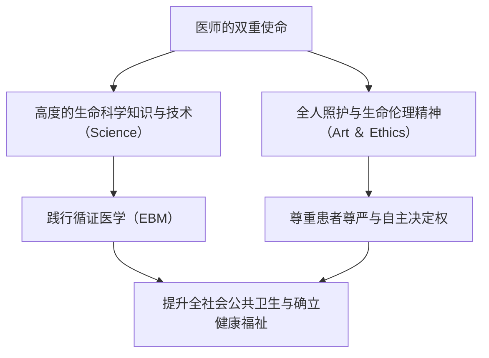
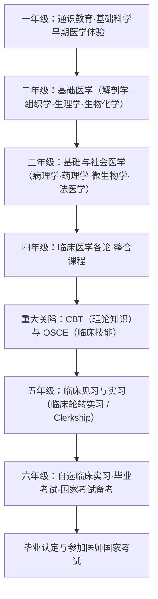
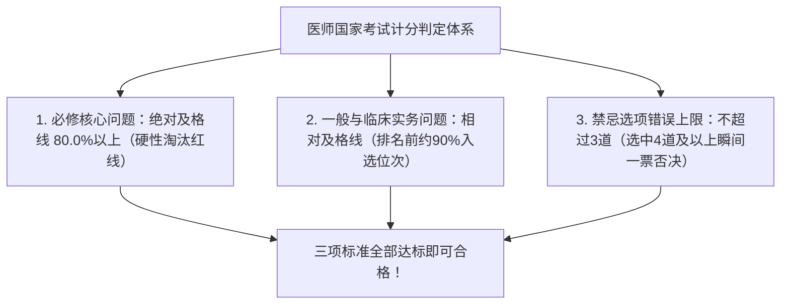
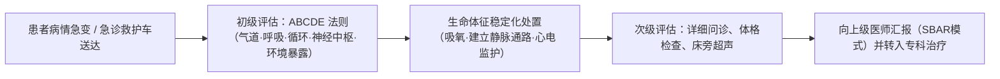
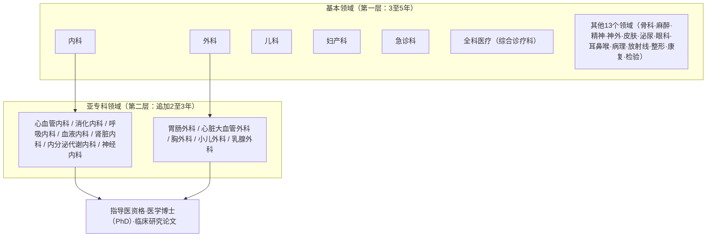
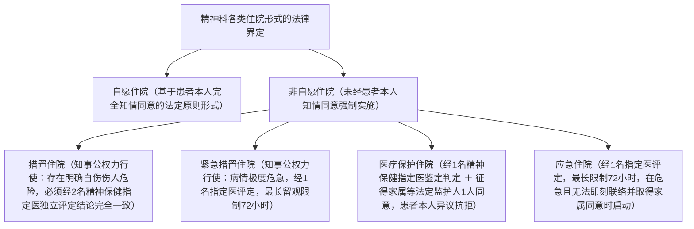
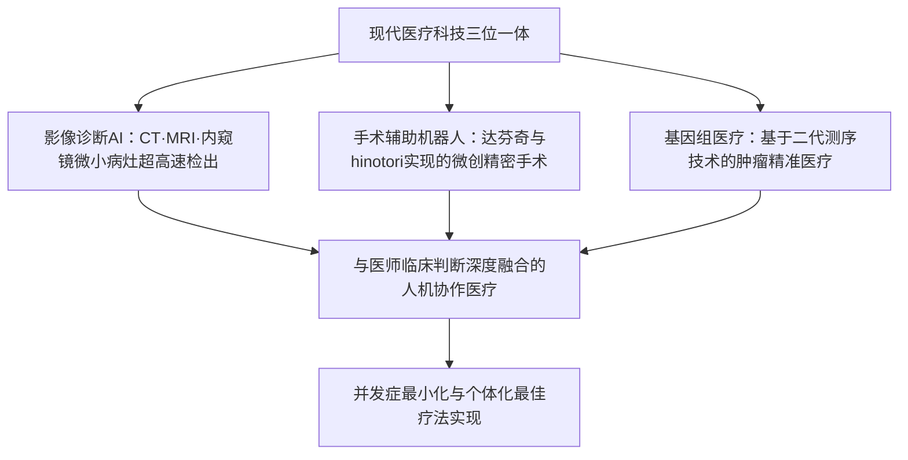

## 1. 序论：托付人命的圣职与科学的交汇点

### 1.1 医师职责的本质：“医道”精神与近代自然科学的融合

在人类漫长的历史长河中，医师这一职业始终被赋予至高无上的敬畏与崇敬。从远古时期的巫医与宗教疗愈者肇始，经历近代自然科学突飞猛进的洗礼，当今的医师既是“掌握高度生命科学的技术精英”，同时又承担着“直面他人苦难与死亡的伦理实存”这一双重神圣使命。

当罹患重疾、直面死亡恐惧之时，人类会将自身最为脆弱无助的肉体与灵魂袒露在医师面前。医师手执手术刀、开具剧毒药品、对患者机体实施不可逆的侵入性医疗行为，在刑法法理上原本已完全符合故意伤害罪的构成要件。然而，医疗行为之所以能够作为正当业务行为（日本刑法第35条规定的正当业务行为）阻却违法性而免于刑事追责，并享有崇高的社会声望，其根本基石在于 **国家、市民社会与医师之间达成的一项绝对信托契约——即“医师通过修习深奥广博的医学知识与高超技能，必将竭诚尽瘁于拯救人命与促进人类健康”** 。

医师的职责绝非仅限于对“疾病（Disease：生物学异常）”本身的切除与消解。追求对饱受病痛折磨的“患病之人（Illness：痛苦的主观体验）”进行全人维度的身心治愈，即追求“医道（The Art of Medicine）”的最高境界，正是无论人工智能与手术机器人如何迭代演进，也永远无法替代的医师之核心本质。

---

### 1.2 希波克拉底誓言、日内瓦宣言与里斯本宣言的历史演变

医疗伦理的原初起点，可追溯至古希腊“医学之父”希波克拉底（约公元前460年–前370年）及其学派弟子起草的《希波克拉底誓言》（Hippocratic Oath）：
- 敬奉阿波罗、阿斯克勒庇俄斯、许癸厄亚与珀那刻亚等众神；
- 依己之能力与判断，制定有益于患者的治疗方案，遏绝一切危害与不端行为；
- 纵受央求亦决不给予致死药物，决不劝导或实施人工流产；
- 终生恪守纯洁与虔诚，对尿路结石等切开术交由专业手术工匠施行；
- 凡在诊疗实践中所见所闻之患者个人隐私，决不泄露分毫（严格保密义务）。

步入近代，针对纳粹德国医师犯下的泯灭人性的残酷人体实验（纽伦堡审判中的医师审判），世界医学会（WMA）进行了深刻的历史反思，于1948年通过了对希波克拉底誓言进行现代性重构的 **《日内瓦宣言》（Declaration of Geneva）** ：
- “我庄严宣誓将我的一生奉献给人类服务”；
- “患者的健康将是我首要顾念”；
- “我不允许任何年龄、疾病或残疾、信仰、民族、性别、国籍、政治立场、种族、性取向、社会地位等因素介于我的职责与患者之间”；
- “即使遭受威胁，我也决不运用我的医学知识违背人道法理”。

此后于1981年，世界医学会正式通过确立患者权利国际准则的 **《里斯本宣言》（WMA Declaration of Lisbon on the Rights of the Patient）** ，全面确立了“享受高质量医疗的权利”、“知晓个人诊疗记录信息的权利”、“在充分知情下的自主决定权（知情同意 Informed Consent）”、“无意识患者的代理同意机制”以及“有尊严离世的权利”。这一系列法理与伦理文件的演进，标志着医疗模式彻底且不可逆地从专制武断的父权主义（Paternalism，父权支配）跨越到了以患者为中心的伙伴协作关系。

---

### 1.3 日本《医师法》第1条的崇高职责

在日本法律体系中，规制医师身份法定地位与法定职责的根本大法是《医师法》（昭和23年法律第201号）。其第1条开宗明义，以极为庄严典雅的法律语言宣告了医师的神圣天职：

> **“医师掌管医疗与保健指导，以此为公共卫生的提高及增进做出贡献，从而确保国民健康之生活。”**

该法定条款深刻表明：医师的专业视野决不仅局限于病榻前个别患者的诊疗施治（微观视角），更必须宏阔地延伸至阻断全社会传染病蔓延、环境卫生监督、预防医学推进以及国家健康政策构筑等提升公共卫生水准的宏图伟业（宏观视角）。医师执照绝非国家授予个人的特权勋章，而是一纸为了守护全体国民生命安全而必须承担沉重公共责任的庄严契约。

---

## 2. 医学院六年的浩瀚教育课程与重大关卡

通向执业医师的征途极其艰辛而漫长。在日本，取得医师资格的前提是必须完整修毕综合大学医学部（或医科大学）严格设立的六年正规学制。医学院的课程体系由文部科学省制定的《医学教育核心课程模型》进行极为严苛的全国标准化规范。

---

### 2.1 1〜2年级：通识教育与基础医学的启蒙

#### 人体解剖学实习的伦理洗礼与医学意义
二年级迎接医学生的最初也是最具精神冲击力的考验，正是“大体解剖学实习（Gross Anatomy）”。在长达数月的教学周期内，医学生必须每天直面为医学科学进步而崇高捐献遗体（日本称“献体”）的逝者。
- 在浸润甲醛防腐液所散发的刺鼻催泪蒸气中，学生们小心翼翼地切开皮肤，剥离皮下浅深筋膜与脂肪组织，将错综复杂的血管、外周神经、肌肉肌束、骨骼骨性标志以及内脏器官逐一精确分离并辨识。
- 动刀解剖之前，全体师生垂首肃立默哀，向遗体捐献者及其家属的无私大爱致以最深切的谢意与敬意。
- 这一教学过程不仅将人体三维空间中精妙绝伦的解剖构造通过视觉、触觉全方位铭刻进大脑，更是医学生初次直接触碰他人的死亡、体会生命重托并完成心理蜕变的必经成年礼。

#### 生理学、生物化学与组织学
- **生理学** ：深入探究维持机体生命活动的物理与生物化学运行机制，包括心肌动作电位的产生与传导（钠钾泵机制、动作电位0期快速去极化、平台期及复极化机制）、肾单位中肾小球滤过率与肾小管重吸收分泌动力学、下丘脑-垂体-靶腺内分泌轴的负反馈调节回路等。
- **生物化学** ：系统背诵与推导三羧酸循环（TCA循环）、线粒体氧化磷酸化电子传递链、糖异生途径、脂肪酸 $\beta$-氧化代谢、蛋白质翻译后修饰以及DNA复制、转录与核糖体翻译等微观分子通路。
- **组织学** ：在光学显微镜与透射电子显微镜下细致绘制上皮组织、结缔组织、肌组织与神经组织的超微切片结构，深刻领会细胞形态与生理功能之间的辩证统一。

---

### 2.2 3〜4年级：病态生理学与临床医学体系

进入三至四年级，教学重心从基础生理机制过渡至疾病的发生机理（基础医学向临床转化）以及各大临床科室疾病的鉴别诊断与治疗学——“临床医学各论”。

- **病理学** ：通过显微镜下细胞异型性与组织形态学异变（变性、炎症、坏死、肿瘤细胞分级与浸润、细胞凋亡），破译各类疾病演进的病理学本质。
- **药理学** ：药物受体动力学、体内药代动力学过程（吸收、分布、代谢、排泄：ADME）、抗菌药物作用机制及耐药菌突变选择、降压药物靶点及抗肿瘤分子靶向药物的分子生物学机制。
- **内科学各论** ：心血管系统（急性心肌梗死、恶性心律失常、心力衰竭）、呼吸系统（原发性支气管肺癌、慢性阻塞性肺疾病 COPD、间质性肺炎）、消化系统（消化性溃疡、肝硬化失代偿期、结直肠癌）、肾脏系统（肾病综合征、慢性肾脏病 CKD）、内分泌代谢系统（糖尿病急性与慢性并发症、甲状腺功能亢进/减退症）、血液系统（急性白血病、恶性淋巴瘤）、神经内科以及风湿免疫与变态反应系统疾病。
- **外科学各论** ：胃肠外科、心脏大血管外科、胸外科、神经外科、骨科等各大专科的手术适应证评估、围手术期监护、术后水电解质平衡以及外科创伤性休克的急救复苏。
- **儿科学、妇产科学与精神医学** ：从新生儿先天畸形筛选到儿童神经发育障碍；围产期母婴全程管理（顺产监护、难产处置、妊娠高血压综合征）；精神分裂症与双相情感障碍及重度抑郁症的精神药物治疗与心理干预。
- **社会医学、法医学与公共卫生学** ：流行病学统计方法、传染病预防控制法规、职业卫生安全、法医毒理学、非正常死亡死因鉴定以及司法解剖与行政解剖的尸检技术。

---

### 2.3 第一道重大关卡：CBT 与 OSCE（共用考试的法定国家化）

在四年级的深秋，医学生必须参加全国统一的“医学生临床能力共用考试”，这是衡量其是否具备进入医院病房进行床旁实习资格的决定性考核。自2023年（令和5年）起根据修正后的日本《医师法》，共用考试正式升格为具有国家执业准入性质的法定考核。

1. **CBT（Computer-Based Testing 计算机化考试）** ：
   - 在计算机终端完成约320道医学综合客观多项选择题。
   - 试题从全国海量题库中随机抽取，运用项目反应理论（IRT）进行难度等值与标准化评分。
   - 考核内容全方位覆盖基础医学、临床医学与社会医学。未能达到规定及格线（通常设定在65%至70%以上）的学生，将直接面临挂科并无情留级。
2. **Pre-CC OSCE（Objective Structured Clinical Examination 客观结构化临床考试）** ：
   - 旨在超越书面知识，实战考核医学生临床问诊沟通、体格检查规范手法以及医德素养的技能实操考试。
   - 考生依次轮转多个独立考站（医疗问诊与病史采集站、头颈部检查站、胸部心肺检查站、腹部检查站、神经系统检查站、急救心肺复苏技术站），在标准化模拟病人（SP）或高仿真医学模拟人身上展现规范查体。
   - 考官由外校抽调专家担任，依据标准化细则严厉核查着装仪容、患者问候、共情沟通、手卫生消毒以及视触叩听的规范度与准确度。

唯有两项考核均顺利通过的学生，方能被国家正式授予 **“学生医师（Student Doctor）”** 的法定荣誉称号，获准步入临床病房开展实习。

---

### 2.4 5〜6年级：临床轮转实习（Clinical Clerkship: 诊疗参与型实习）

五年级伊始，医学生开启了在大学附属医院及区域核心教学医院各临床科室轮转的“临床轮转实习（Clinical Clerkship：诊疗参与型实习）”，每科轮转周期为1至2周。
与往昔旁观式“见习观摩”彻底决裂，现代临床实习要求医学生以医疗团队初级准医师身份真正嵌入病房工作。
- 在上级带教医师指导下，学生每日独立进行管床患者的问诊随访、生命体征监测、书写实习医生病历、研判检验与影像学检查结果，并在科室晨会与病例讨论会上进行规范的病例汇报（Case Presentation）。
- 在外科手术室，学生规范进行外科刷手，穿戴无菌手术衣与手套，作为第二或第三手术助手登台，承担手术视野拉钩牵引暴露及切口剪线等操作。
- 在上级医师严密督导下，熟练掌握静脉采血、外周静脉留置针置管、切口无菌换药与基础皮肤缝合打结等临床操作。
- 进入六年级后，各医学院校将组织极为严酷的“毕业考试”。为了维护国家医师考试的官方通过率，部分医学院校会设立高淘汰率的筛选门槛，学力不足者将被坚决延期毕业（留级）。唯有历经重重考验的幸存者，方能最终换取医师国家考试的准考证。

---

## 3. 医师国家考试的架构与合格的分水岭

日本医师国家考试由厚生劳动省统筹主管，于每年2月上旬分两天在全国统一举行，是医学界的终极国家级考核。

### 3.1 考试构成与出题标准

全卷由400道试题构成，采取客观标准化答题卡阅卷方式（涵盖单选题、多选题及计算简答题）。

| 考试模块 | 试题数量 | 考试时长 | 考查范围与内容 |
| :--- | :---: | :---: | :--- |
| **模块 A** | 75题 | 135分钟 | 临床各论与总论（临床实务题·基础常规题） |
| **模块 B** | 50题 | 80分钟 | **必修核心问题（一般理论·临床实务案例）** |
| **模块 C** | 75题 | 135分钟 | 临床各论与总论（长篇连环病例分析题等） |
| **模块 D** | 75题 | 135分钟 | 临床各论与总论（基础医学·社会医学·卫生法规等） |
| **模块 E** | 50题 | 80分钟 | **必修核心问题（医疗安全·医院感染·公共卫生）** |
| **模块 F** | 75题 | 135分钟 | 临床各论与总论（综合性高难度临床病例题） |

---

### 3.2 三大合格标准与“必修80%”的恐怖威慑

医师国家考试的合格评定采取极度严苛的综合准入机制， **考生必须同时完全跨越以下三条合格基准线** 。只要有一条不达标，总成绩再高亦瞬间判定为不及格。

1. **必修核心问题的绝对及格线（80.0%硬性红线）** ：
   - 必修核心考题（共100题，满分200分）， **得分率达到80.0%（即160分以上）是不可动摇的绝对及格门槛** 。
   - 哪怕考生在一般问题和临床实务问题上近乎斩获满分，只要必修题微差1分（如得159分），系统也将毫不留情地判定为落榜。正因如此，广大考生在填涂必修答题卡时无不承受着指尖颤抖的巨大心理压力。
2. **一般与临床实务问题的相对合格线** ：
   - 一般问题与临床实务问题采用常模相对评价机制。根据当年全国全体考生的标准分正态分布，划定淘汰得分位于后10%左右考生的基准线（及格线通常落在总得分率68%至72%之间）。
3. **致命的“禁忌选项（禁忌肢：Contraindication）”陷阱** ：
   - 整个考试中最为令人生畏的莫过于“禁忌选项”。如果考生勾选了在临床上被判定为 **“会导致患者致命性伤害的严重医疗过失”、“严重侵犯公民基本人权”或“公然触犯法律法规”** 的选项，禁忌计数器将自动加一。
   - 通常情况下， **一旦勾选禁忌选项达到4道（部分年份设定为3道）及以上，即便考生的考试总分远超录取线，也将毫无悬念地被直接判定为一票否决、全盘落榜** 。
   - 典型案例包括：对疑似急性脑出血患者擅自给予抗凝血药物；对突发过敏性休克患者未立即肌注肾上腺素而仅单纯静滴糖皮质激素观察；对急性有机磷农药中毒患者误用禁忌药物而未给阿托品；仅凭家属意愿而未经本人知情同意或未履行法定程序即决定对精神疾病患者实施强制住院等。

---

## 4. 初期临床研修（两年）的洗礼：超级轮转制度

通过国家统一考试并正式在医师名册注册获得医师执照后，法律严厉禁止新晋医师立即独立挂牌执业（日本《医师法》第16条之2）。所有初级医师必须强制接受为期两年的“初期临床研修”。

### 4.1 2004年新医师临床研修制度改革的体制风暴

在2004年（平成16年）改革之前，旧体制下的医学院毕业生在毕业后立即加入大学医院特定的专科教研室医局（如第一内科、第二外科等），并在随后的岁月里仅接受极为狭窄局限的单一亚专科培养。这导致了极为严重的专科割裂与偏科弊端——许多顶级消化道专家甚至无法规范处理简单的四肢骨折或眼科急症，更完全丧失了开展急救心肺复苏的通科全科急救能力。

为了彻底扭转这一医疗弊端，日本厚生劳动省推行了“超级轮转制度（新临床研修制度）”：
- **全面夯实通科基本诊疗能力** ：不分未来专科意向，所有初级住院医师必须在内科（6个月以上）、急诊科（3个月以上）、社区医疗（1个月以上）、儿科、妇产科、精神科及普外科进行广泛轮转，全面掌握以患者为中心的初级卫生保健与全科首诊能力（Primary Care）。
- **引入全国住院医师配对系统（JRMP）** ：彻底打破由大学医局教授单向指派调度的封建制人事关系，医学生与各大医院在“医师临床研修配对协议会”系统中双向填报排序志愿，依托计算机“盖尔-沙普利稳定婚姻匹配算法”实现透明自动配对录取。
- 这一改革瞬间引发了医学青年的“大择校潮”。临床实战机会多、急诊病例丰富且值班津贴优厚的城市顶尖综合性教学医院（如圣路加国际医院、虎之门医院、仓敷中央医院、龟田综合医疗中心等）受到全日本尖子医学生的热烈追捧。这客观上导致地方大学医局权威弱化，诱发了偏远地区医院骨干医师回撤与医生荒（即日本社会广泛讨论的“地域医疗崩溃”）等结构性社会矛盾。

---

### 4.2 初级住院医（Junior Resident）的高压日常与临床技术习得

初期研修的两年，堪称一名医师职业生涯中密度最高、负荷最重、成长最迅猛的蜕变时期。

- **急诊值班连轴转** ：从急诊门诊步行就诊的轻症患者，到由救护车呼啸送达的心跳呼吸骤停（CPA）危重患者，急诊大厅昼夜不息。在急诊专科上级医师指导下，住院医师依托世界通用的 **“ABCDE 法则”** （Airway 气道、Breathing 呼吸、Circulation 循环、Disability 神经中枢功能障碍、Exposure 环境暴露与体温控制），在数秒内分秒必争地完成伤情危重度分诊与复苏。
- **高难度核心临床操作的全面掌握** ：
  - 桡动脉穿刺行动脉血气分析采集；
  - 床旁重症超声快速评估（创伤超声重点评估 FAST 方案，快速识别腹腔积血与心包填塞）；
  - 动态超声引导下深静脉置管术（CVC：经内颈静脉或股静脉穿刺）；
  - 紧急经口直接喉镜/可视喉镜下声门暴露与气管插管术；
  - 诊断性腰椎穿刺术（留取脑脊液以鉴别中枢神经系统感染或蛛网膜下腔出血）；
  - 胸腔闭式引流管置入术及腹腔穿刺引流术。
- **死亡宣告与临终哀伤告知** ：当首次由自己面对并确认患者心脏停搏、双侧瞳孔散大固定、对光反射消失、心电监护呈完全水平直线，并郑重签发《死亡诊断书》的那一刹那；当走出抢救室向泪流满面的家属宣告死亡的那一刻——作为一名治病救人的医师所必须承担的生命重负与职业敬畏，便彻底烙印进灵魂深处。

---

## 5. 新专科医师制度全貌：十九大基本领域与亚专科深化

完成两年的初期临床研修后，医师晋升为“专科规培医师（专攻医：Senior Resident）”，正式选定终生耕耘的专业学科。自2018年（平成30年）起全面启动运行的“新专科医师制度”，由一般社团法人日本专科医师机构依据全国统一标准实施认证管理，构筑起清晰的两层金字塔式成长架构。

---

### 5.1 十九大基本领域的体系

专攻医必须注册挂靠在以下 **19个基本领域** 中的某一认证规培基地，接受为期3至5年的规范化专科培训。

| 基本专业领域 | 培训年限 | 核心专业内涵与培养特色 |
| :--- | :---: | :--- |
| **内科** | 3年 | 极其繁重的病例登录考核：必须在 J-OSLER 官方系统中录入数百例详尽的住院病例与严格格式化的病历摘要。这是通向所有内科亚专科的法定必经台阶。 |
| **外科** | 3〜4年 | 涵盖普外胃肠、心胸血管、小儿外科的大外科综合基础。所有主刀及一助手术病例必须全部实时录入日本国家临床数据库（NCD）。 |
| **儿科** | 3年 | 涵盖新生儿重症监护（NICU）、小儿急救、儿童传染病、神经心理发育障碍及过敏性疾病的综合性诊治。 |
| **妇产科** | 3年 | 围产医学（正常分娩、病理难产助产、剖宫产手术）、妇科良恶性肿瘤根治切除、生殖内分泌及不孕不育治疗。 |
| **急诊科** | 3年 | 严重多发性创伤复苏、脓毒症休克、危重中毒洗胃解毒、重度烧伤救治、重症监护病房（ICU）生命支持及直升机院前急救（Doctor-Heli）。 |
| **全科医疗（综合诊疗科）** | 3年 | 新设基本学科。聚焦社区整合照护体系、老年共病（Multimorbidity）一体化综合管理以及家庭医学实践。 |
| **骨科** | 3〜4年 | 复杂骨折内固定术、人工髋/膝关节置换术、脊柱退行性病变减压融合术、运动医学损伤关节镜治疗及功能康复。 |
| **麻醉科** | 4年 | 全身麻醉气道与血流动力学管控、椎管内神经阻滞、疼痛门诊微创介入、ICU重症监护与围手术期危机资源管理。 |
| **精神科** | 3年 | 培养过程与国家“精神保健指定医”资格获取法定挂钩。涵盖抑郁症、双相情感障碍、精神分裂症及阿尔茨海默病等认知症的心理治疗与药物治疗。 |
| **神经外科** | 4年 | 颅内动脉瘤开颅夹闭术、脑肿瘤显微切除术、急性脑血管闭塞神经介入机械取栓术及闭合性/开放性重型颅脑创伤急救手术。 |
| **放射科** | 3年 | 影像学诊断（高分辨CT、多模态MRI、PET-CT多学科综合读影）以及介入放射治疗（IVR血管栓塞/再通）、肿瘤立体定向放射治疗。 |
| **病理科** | 3年 | 术中冰冻快速切片诊断、手术切除标本组织病理活检、疑难细胞学诊断及病理解剖尸检（CPC临床病理讨论会主导）。 |
| **其他专业领域** | 3〜4年 | 皮肤科、泌尿外科、眼科、耳鼻咽喉头颈外科、整形外科（修复重建外科学）、康复医学科、临床检验科。 |

---

### 5.2 亚专科领域的深化与医学博士（PhD）

在斩获基本领域专科医师执照后，医师将向更高阶梯、专业分工更为精细化的“第二层亚专科（Subspecialty）”发起冲锋，进修获取如心血管介入专科医师、消化内镜专科医师、心脏大血管外科专科医师、肿瘤化疗专科医师等顶级专业认证。

与此同时，大批追求学术卓越的青年医师会选择考入大学院医学研究科（攻读四年制医学博士研究生课程）。他们在基础医学研究所或高水平转化临床实验室中浸润于分子生物学、肿瘤免疫学、单细胞全基因组测序分析等前沿实验研究，以第一作者身份在国际权威英文同行评议期刊（Peer-Reviewed Journal）上发表高水平原创学术论著，最终答辩取得 **“医学博士（PhD）”** 最高学位。他们一手执听诊器在病房救死扶伤，一手在显微镜与生物芯片前破译疑难重症机制，兼具临床大夫与生命科学学者双重身份。

---

---

## 2.5 临床医学深层病态与药代动力学/药效学（PK/PD理论）数学原理

在医学生迈入临床医学殿堂的过程中，彻底摆脱死记硬背疾病症状与药物名称的初级思维，树立基于分子生物学机制与数理药理学逻辑的科学临床思维，核心理论便是 **“PK/PD理论（药代动力学 Pharmacokinetics / 药效学 Pharmacodynamics）”** 。

### 药代动力学（PK）的核心数理参数
- **血药浓度-时间曲线下面积（AUC: Area Under the Curve）** ：表征药物导入人体循环后机体所接受的药物总全身暴露量的金标准参数。
- **血药峰浓度（Cmax）** ：药物单次或稳态给药后在体内血液循环中达到的最高浓度极限。
- **表观分布容积（Vd）** ：表征药物在体内组织器官分布特性的假想容积参数（容积大提示药物高度亲脂并向外周组织深部广泛蓄积分布；容积小提示药物高度水溶并主要局限在血浆循环中）。

### 抗菌药物 PK/PD 参数的三大黄金分类
在现代感染病精准抗感染治疗中，依据药物在体内的消除动力学与病原菌最低抑菌浓度（MIC: Minimum Inhibitory Concentration）的数理关系，抗菌药物严格划分为以下三大投药优化模式：

| PK/PD 参数指标 | 临床疗效决定因子 | 代表性抗菌药物类别 | 精准临床投药设计策略 |
| :--- | :--- | :--- | :--- |
| **$T > MIC$（超MIC时间百分比）** | 在一个给药间隔周期内，游离血药浓度超过MIC的持续时间占整个间隔的百分比（%） | **青霉素类、头孢菌素类、碳青霉烯类** （$\beta$-内酰胺类抗菌药） | 单次盲目加大注射剂量对杀菌效能提升甚微，核心在于 **增加给药频次（如每日分3〜4次给药）** ，或采取延长单次静脉滴注时间（如3〜4小时延长输注或持续微泵泵入），使 $T > MIC$ 最大化维持在40%〜70%以上。 |
| **$Cmax / MIC$（峰浓度比值）** | 血药峰浓度达到病原菌MIC的几何倍数 | **氨基糖苷类** （庆大霉素、阿米卡星等） | 坚决摒弃传统小剂量分次给药旧习，推行 **每日单次超大剂量冲击输注** ，以瞬时形成陡峭极高的血药峰浓度，最大化激发浓度依赖性杀菌活性及显著的抗生素后效应（PAE），同时大幅减轻对肾小管上皮及听神经毛细胞的持续蓄积毒性。 |
| **$AUC / MIC$（总暴露量比值）** | 24小时内药物总全身暴露量与MIC的绝对比值 | **氟喹诺酮类、万古霉素** （糖肽类） | 核心在于保障全天24小时内机体总药物暴露量。对于万古霉素等安全治疗窗狭窄的药物，必须常规开展治疗药物浓度监测（TDM），严密将稳态血药谷浓度（下一次给药前即刻浓度）精准调控在 $15 \sim 20 \mu g/mL$ 黄金窗口。 |

---

## 3.6 医师国家考试难关：公共卫生法规与精神保健福祉法的法律解释

在医师国家考试各科目中，最令广大医学生如履薄冰的莫过于“公共卫生与医疗卫生法规”板块。该学科绝不仅考查生物医学常识，更要求考生具备媲美法官与执业律师的法条严谨解释与适用能力。

### ① 《传染病法》分类等级与医师法定报告义务
在日本《传染病预防及传染病患者医疗法》（简称《传染病法》）框架下，依据病原体危害程度、传播力烈度与临床致死风险，将法定传染病严密划分为1类至5类、指定传染病以及新型流感等感染症。

- **1类传染病（埃博拉出血热、鼠疫、马尔堡病毒病、拉沙热、克里米亚-刚果出血热、天花、南美出血热）** ：
  - 医师一旦确诊，负有 **立即（不得迟延）经由辖区保健所长向都道府县知事具名书面报告的法定绝对义务** 。
  - 行政主管机关将启动最高级别管控处置：强制收治于特定或第一类传染病指定医疗机构负压病房隔离治疗、实施最长72小时的交通封锁限制、对污染场所与物品进行强制消毒或直接销毁。
- **2类传染病（肺结核、严重急性呼吸综合征: SARS、中东呼吸综合征: MERS、人感染高致病性禽流感H5N1及H7N9亚型、脊髓灰质炎）** ：
  - 医师必须立即法定报告。实施收治于第二类传染病指定医疗机构的劝告住院与行政隔离措施。对于肺结核患者，国家对潜伏性结核感染（LTBI）全面实施公费医疗全额兜底政策。
- **3类传染病（霍乱、细菌性痢疾、伤寒、副伤寒、肠出血性大肠杆菌感染症: O157等）** ：
  - 医师必须立即法定报告。该类疾病虽不实施强制住院隔离，但依法对从事餐饮服务、供水作业等高危食品行业人员施加严苛的从业限制（严禁返岗，直至连续便培养阴性）。
- **4类传染病（戊型肝炎、甲型肝炎、疟疾、狂犬病、登革热、黄热病、日本脑炎、军团菌病、破伤风等）** ：
  - 经由动物源性、污染水土或蚊媒昆虫叮咬传播的传染病。医师必须立即报告。由于通常不发生人际飞沫传播，故依法不设强制隔离住院与停工限制。
- **5类传染病** ：
  - **全数报告病种（诊断后7日内必须逐例法定网络直报）** ：麻疹、风疹、梅毒、急性脑炎、破伤风、侵袭性脑膜炎球菌感染症、获得性免疫缺陷综合征（AIDS/HIV）。其中麻疹与风疹因传播力极强，被特别规定必须在诊断后即刻全数报告。
  - **定点哨点监测病种（由卫生部门指定的定点医疗机构按周或按月汇总报告）** ：季节性流感、手足口病、呼吸道合胞病毒（RSV）感染症、感染性胃肠炎等。

### ② 《精神保健福祉法》各种住院形态的法律严谨性
在精神科临床诊疗中，如何在保障精神障碍患者基本公民人身自由与有效防范自伤、伤人公共危险之间寻求极致的法治平衡，其最高行为准则是《精神保健及精神障碍者福祉法》（简称《精神保健福祉法》）。

在历年医师国家考试中，关于“医疗保护住院”的法定同意权人法定顺位阶梯（配偶、行使亲权的父母、法定扶养义务直系亲属、法定意定监护人，以及上述主体均不存在时由患者户籍所在地市町村长代行同意权），以及“措置住院”由警察官依职权通报（第24条）或一般公民通报（第22条）启动后都道府县知事行使强制羁束权力的复核程序，属于错答一个选项便直接决定及格或名落孙山的兵家必争之地。

---

## 4.5 急诊值班的炼狱：意识障碍鉴别诊断工具“AIUEO TIPS”与急腹症

深夜值班室的住院医师专线电话刺耳响起：“急救中心送达一名70多岁突发重度昏迷男性！”在这一极度危急的瞬间，一名合格医师的大脑神经反射必须立即调动全球急诊通用的意识障碍极速鉴别诊断法则——**“AIUEO TIPS”** 。

| 记忆首字母 | 必须鉴别排查的病态与危急病症 | 急诊抢救室第一现场的标准化处置行动 |
| :---: | :--- | :--- |
| **A** | **A**lcohol（急性酒精中毒） / **A**cidosis（重度代谢性/呼吸性酸中毒） | 贴近口鼻确认是否存在酒味或烂苹果味挥发气体；急查床旁动脉血气分析，研判 pH 值、血乳酸浓度，严密计算阴离子间隙（AG）。 |
| **I** | **I**nsulin（重度低血糖昏迷·糖尿病酮症酸中毒: DKA / 高渗高血糖状态: HHS） | **第一优先行动：瞬间完成指尖微量快速毛细血管血糖测定！** （重度低血糖仅需数十分钟便可导致皮层大脑神经元发生不可逆坏死与脑死亡；一旦确认低血糖，立即全速静脉推注50%高浓度葡萄糖注射液）。 |
| **U** | **U**remia（尿毒症脑病） | 抽血急查生化指标中的血尿素氮（BUN）、血清肌酐及血清电解质钾离子浓度；紧急评估急诊床旁血液透析（CRRT）指征。 |
| **E** | **E**ncephalopathy（肝性脑病·高血压脑病） / **E**lectrolytes（严重电解质紊乱） / **E**ndocrine（甲状腺危象、黏液性水肿昏迷、急性肾上腺皮质危象） | 急查血氨浓度；检测血清钠离子浓度（警惕在重度慢性低钠血症纠正过程中，因补钠过快引发致死性的脑桥中央髓鞘溶解症/渗透性脱髓鞘综合征: ODS）。 |
| **O** | **O**xygen（严重低氧血症·窒息） / **O**verdose（急性药物过量中毒） / **O**piate（急性阿片类药物中毒） | 连续脉搏血氧监测、动态血气分析；体检若发现针尖样瞳孔缩小合并严重呼吸节律抑制，立即静脉注射特异性受体拮抗剂纳洛酮。 |
| **T** | **T**rauma（严重闭合性颅脑创伤） / **T**emperature（极重度意外失温·热射病重症中暑） | 急诊无造影剂头颅平扫CT（迅速排查急性硬膜下血肿、硬膜外血肿及脑挫裂伤）；精密直肠温度计探查核心深部体温。 |
| **I** | **I**nfection（中枢神经系统感染: 化脓性脑膜炎·脑炎、脓毒性休克脑病） | 快速查体评估颈项强直、克尼格征（Kernig）、摇头加重试验（Jolt accentuation）；双侧双套抽取血培养标本后，立即争分夺秒经验性静脉滴注广谱抗感染方案（头孢曲松联合万古霉素联合氨苄西林），随后安全评估下行急诊腰椎穿刺。 |
| **P** | **P**sychiatric（精神源性假昏迷·癔症分离性障碍） / **P**orphyria（急性卟啉病） | **唯有在彻底排查并百分之百排除全部器质性、代谢性、中毒性病因之后，方可慎重考虑精神源性诊断** 。 |
| **S** | **S**troke（急性脑卒中: 缺血性脑梗死、脑实质出血、蛛网膜下腔出血） / **S**eizure（癫痫持续状态） / **S**hock（低血容量性、心源性、梗阻性及分布性休克） | 快速进行神经系统定位查体；开辟绿色通道急查头颅多模式CT或弥散加权磁共振（DWI）；在发病4.5小时黄金时间窗内判定静脉阿替普酶（rt-PA）溶栓或急诊介入机械取栓指征。 |

面对深度昏迷患者被急救平车推入的一刻，“不由分说盲目先推去CT室扫个头”是低年资住院医师最易犯下的致命级临床过失。如果在没有纠正低血糖或未解除气道窒息低氧血症的情况下将危重患者推入CT机房，极易在密闭扫描检查台上突发不可挽回的心跳骤停。 **“Vital signs first, then Glucose, ABCDE stabilization!（生命体征居首，即刻测定血糖，稳固维持ABCDE生命通道！）”** ，这是深深烙印在每一位成熟医师骨髓深处的血泪铁律。

---

## 5.5 医师职业路径、严酷经济现状与终身医学教育

### 受雇医师与独立开业医的结构性差距及值班走穴的残酷真相
社会公众往往笼统地抱有“医师即等于极度高薪富豪”的刻板印象，然而撕开温情脉脉的面纱，日本医师在真实的职业发展阶梯与执业形态中，存在着触目惊心的层级分化与经济现实。

1. **大学医院体系受雇医师的严峻经济困境** ：
   - 初期研修医师的全国平均年收入税前仅约350万至450万日元左右（折合人民币约17万至22万元）。
   - 晋升为专攻医（高年资住院医）并归属于大学医学部各专科教研室时，大学医院所支付的基本月薪往往仅在区区20万至30万日元左右徘徊。医护人员在日夜被沉重的临床病房救治、学会交流汇报准备、高强度临床实验科研论著撰写层层压榨的同时，必须完全依赖每周1至2次利用业余休息时间前往外院“走穴兼职值班”（在急诊夜班诊所或慢性康复养老疗养院兼职，一整夜值班费约4万至8万日元），才能勉强贴补家用、维持在大城市的体面生存。
   - 哪怕到了30多岁历经千辛万苦拿到医学博士学位（PhD），并晋升为大学医院的助教甚至讲师，大学医院发放的年薪在绝大多数情况下也仅在600万至800万日元区间封顶。
2. **市级核心综合性医院骨干医师（中坚临床主力）** ：
   - 在30多岁后期至40多岁期间，脱离大学医局走向地方公共综合医院或大型民营核心教学医院担任科室医长、科主任级别的骨干医师，其税前年薪通常可达1200万至1800万日元。然而，这份收入背后是以全年无休高强度的待命呼叫（On-call 待命）、公休日紧急召回以及高频次救治急危重症夜班为代价换来的血汗补偿。
3. **私人诊所开业医（独立开业医师 Private Practice）** ：
   - 在步入40岁以后，部分医师选择通过自筹资金并向商业银行抵押借贷巨额贷款（负债数千万至数亿日元）自立门户开设私人专科诊所。一旦经营步入良性轨道，年净利润达到2500万至4000万日元甚至更高并不罕见。然而，这要求开业医不仅要有过硬的临床诊疗实力，更必须亲自独立承担劳动人事管理、流动资金周转、昂贵医疗设备折旧摊销、医疗广告营销等“企业法人经营者的全部沉重包袱”，并背负无限连带清偿债务的破产风险。

### 医疗诉讼风暴与医师职业责任保险
医师在每一次施行侵入性诊疗时，无时无刻不在与“医疗过失民事侵权诉讼”这一灭顶之灾般的法律风险擦肩而过。
- 妇产科分娩进程中因急性胎儿宫内窘迫缺氧导致的新生儿窒息性脑瘫（尽管日本设立了专门的产科医疗补偿制度，但一旦转入民事过错侵权诉讼，司法判赔金额往往高达1亿至2亿日元之巨）。
- 术后卧床突发急性致死性肺动脉血栓栓塞症（经济舱综合征）、化疗药物严重不良反应毒性迟滞发现、放射科影像读片肿瘤微小结节漏诊等。
- 因此，全员投保由日本医师会或各专科学会统一统筹承保的“医师赔偿责任保险（医赔责）”，已成为当代每一位一线临床执业医师构筑职业法律防线的必备护身符。

---

## 6. 医师不可或缺的法律法规、制度与医学伦理

医师每天从清晨到日暮的诊疗执业行为，无不受制于一张精密而刚性的法律法规巨网的严格规制。任何轻视漠视法律准则的医务人员，都将面临医师执照被吊销或勒令暂停执业（依据日本《医师法》第7条行政处分）、承担严重刑事责任追诉，以及面临数千万至数亿日元的民事巨额损害赔偿判决。

### 6.1 《医师法》关键法条深度剖析

#### ① 诊疗义务 / 应召义务（日本《医师法》第19条第1款）
> “从事诊疗之医师，凡遇诊察治疗之请求，非有正当理由，不得拒绝。”

在传统法理学阐释中，该法条曾被片面教条化地理解为“医师在任何极端情况下均绝对不得拒绝患者的就诊要求”。然而，2019年（令和元年）厚生劳动省正式发布官方行政通知，从现代劳动法与医疗安全体系维度全面厘清了客观法理边界：
- 在医疗机构正常对外接诊时间内，即便当班医师并非对应亚专科专家，医师亦负有先行实施应急稳定处置或立即规范转诊至上级医院的法定义务。
- 与此相对，在非对外营业的深夜或节假日，如果本院并非法定急救定点医院，或者患者伴随严重醉酒滋事、暴力施暴破坏、恶意长期恶意拖欠拒付巨额诊疗费等恶性扰乱医疗秩序行为，亦或是当班医师因极度过劳、疾病突发已完全丧失确保医疗安全的认知生理状态时，在法律上均被正当确认为拒绝诊疗的“正当理由”，从而兼顾了对医务人员基本身心劳动权益的法治保护。

#### ② 禁止无诊察治疗（日本《医师法》第20条）
> “医师非亲自诊察，不得施行治疗或交付处方；非亲自接生，不得交付出生证明书或死产证明书。”

严禁任何未亲自开展直接面诊而擅自隔空开具药物处方的违法行径。近年来呈爆发式扩张的“互联网在线诊疗”，必须在严格遵循厚生劳动省颁布的《在线诊疗规范实施指引》的前提下，针对确保安全性与有效性的特定慢性病病种，严格依据既定安全协议方可作为本条的例外合法推行。

#### ③ 异常尸体报告义务（日本《医师法》第21条）
> “医师检验尸体或妊娠四月以上之死产儿，认定有异常时，须于二十四小时内向所辖警察署报告。”

针对医院内部发生的严重医疗事故或术后难以解释的猝死事件是否属于法定“异常死亡”范畴，日本最高裁判所通过“东京女子医科大学医疗事故案”以及“东京都立广尾医院静脉错注消毒液致死案”等轰动全国的里程碑判例，确立了极其明确的司法裁量准则：司法判例裁定“即使是发生在医疗机构内的诊疗相关死亡，只要尸体外表呈现肉眼可辨的异常体征，或具有涉嫌刑事业务过失致死等犯罪嫌疑时，医师就负有无可推卸的法定报警义务”；任何企图在医院内部隐匿掩盖医疗过失致死真相的医师与管理者，均被依法追究了毁灭证据或业务过失致死等严厉的刑事附带民事责任。

---

### 6.2 知情同意（Informed Consent）与医疗过失司法理论

在民事损害赔偿诉讼中，起诉指控医师医疗行为构成民事侵权或债务不履行（医疗违约）的核心法律基石，主要建立在两大审判支柱之上：“注意义务违反（即医疗技术过错）”与“说明义务违反（即侵害知情同意权）”。

- **医疗水准（Standard of Care）** ：判定医师在实施诊疗时是否尽到高度审慎注意义务的法定基准，在综合考量涉案医疗机构性质层级（大学顶级附属医院与简陋乡村诊所之合理技术差异）及区域医疗资源现实的同时，以“事发当时医学界一名具有平均良知的同专业医师理应达到的客观实践水准”进行极其严格的司法客观拟制判定。
- **知情同意（Informed Consent）** ：医师负有法定说明义务，必须用通俗易懂的母语平实语言向患者本人详尽释明：①现阶段的确诊疾病名称与病情进展分期；②拟施行的手术或治疗方案的具体内容及操作机理；③该治疗手段所伴随的各种固有风险、严重并发症及不良反应的发生概率；④医学上可供选择的其他替代疗法方案及其各自利弊得失；⑤若拒绝接受任何医疗干预后的预后自然转归。医师必须确保患者在完全知情透彻理解的前提下，基于其自由意志签署知情同意书。如果在未尽充分说明义务的情况下盲目施行了高风险手术，哪怕手术室中主刀医师的操作手艺无可挑剔、无任何技术纰漏，一旦发生了致残并发症，法院亦将以“严重侵害患者人格自主决定权”为由，判令医方承担数千万日元的巨额精神损害抚慰金赔偿。

---

---

## 6.5 临终医疗决策机制（ACP）与法定脑死亡判定的严谨准则

医师在其漫长的执业生涯中，所面临的最为沉重、震撼灵魂的伦理抉择十字路口，莫过于在“生命的最后阶段（临终期）”实施医疗支持的暂缓与撤除，以及在抢救室中进行极为肃穆严峻的“脑死亡法定判定”。

### ① 关于人生最后阶段医疗与照护决策过程指南
依据日本厚生劳动省主导制定的国家官方指南，现代终末期医疗的核心基石全面聚焦于 **“ACP（Advance Care Planning 预先医疗照护计划，在日本社会被亲切地命名为‘人生会议’）”** 。
- 彻底废除以往完全由主治医师独断专行决定是否开启或撤除生命维持治疗（如气管插管呼吸机辅助通气、大剂量升压药持续泵入、体外心肺复苏除颤等）的陈旧模式。
- 当患者本人意识清晰具备完全民事行为能力时：必须由患者本人与由主管医师、责任护士、医疗社工等构成的多专业跨学科团队开展充分、深入的面对面协商探讨，完全尊重患者本人的内心自主选择。伴随病情的动态推移以及心境的起伏变化，该意志确认程序必须反复多次进行。
- 当患者已丧失意识或陷入认知障碍时：若家属能依据患者生前言行推断出其真实意愿，应当高度尊重该推定意思；若完全无从推定，亦必须由全体家属与跨专业医疗团队在穷尽伦理讨论的前提下，共同合议达成最符合患者最大生命利益的方案。
- **撤除或暂缓生命维持治疗在刑法上的阻却违法（免责）四要件** ：依据“川崎协同医院事件”与“射水市民医院事件”的日本最高司法终审裁决，唯有同时完全满足以下四项严苛的构成要件，方能彻底免除刑法上故意杀人罪或遗弃致死罪的刑事归责：①患者已处于不可逆转的终末期（死亡不可避免且迫在眉睫）；②存在基于患者真实意思表示的自主决定（如清晰的书面生前预嘱 Living Will 等）；③必须最大限度施行姑息镇痛镇静以消除患者痛苦；④必须严格恪守多专业医疗团队全员参与并合议一致的决策流程。

### ② 基于《器官移植法》的法定脑死亡判定六大要件
在日本《人体器官移植法》框架下，与传统心脏呼吸停止的“心死亡”并行，将“脑死亡（Brain Death）”在法律层面上等同确认为自然人之死亡，其适用前提严格限定在“拟进行器官捐献”的排他性法律场景之下。对脑死亡的法定临床确认，必须由两名以上资深资格医师，依据以下近乎苛刻的客观临床程序严格重复施行两次以上。

1. **深昏迷状态（日本昏迷量表 JCS 300分 / 格拉斯哥昏迷评分 GCS 3分）** ：对来自外界环境施加的任何声音、语言指令、强光及深度剧烈疼痛刺激完全丧失任何感知与肢体运动反应。
2. **双侧瞳孔散大且位置完全固定** ：双侧瞳孔直径必须均达到 $4mm$ 以上，双侧直接对光反射与间接对光反射完全消失。
3. **脑干反射完全丧失（涵盖七大关键脑干反射的绝对阴性测试）** ：
   - 瞳孔对光反射完全消失；
   - 角膜反射完全消失（使用无菌棉签轻触双侧角膜，眼轮匝肌完全无任何瞬目闭眼反应）；
   - 睫状脊髓反射完全消失（重度钳夹刺激颈部皮肤，双侧瞳孔完全无散大反应）；
   - 头眼反射完全消失（快速被动水平及上下转动患者头部，“玩偶眼现象”彻底消失，眼球随头部转动无任何逆向代偿运动）；
   - 前庭反射完全消失（冷热水试验：向双侧外耳道内分别灌注冰生理盐水，眼球完全无任何偏斜运动或眼球震颤）；
   - 咽反射完全消失（使用压舌板或吸痰管强烈刺激咽后壁黏膜，完全无恶心呕吐运动反射）；
   - 咳嗽反射完全消失（将吸痰管深入气管插管深部隆突分叉处施加负压抽吸刺激，完全无任何呛咳排痰动作）。
4. **脑电活动完全平坦（Flat EEG / 脑电静息）** ：依据国际10-20标准电极放置法进行多导联脑电图持续描记，在最高增益灵敏度（$2\mu V/mm$）条件下持续监测至少30分钟以上，证实全脑皮层生物电活动呈现绝对的电气学静息（平坦等电位线）。
5. **自主呼吸完全丧失（呼吸暂停试验 / 无呼吸激发测试）** ：暂时脱开有创机械呼吸机管道，通过细导管向气管导管隆突部持续输入纯氧（$100\% O_2$）；在严密心电与血气监护下，耐受并观察机体内蓄积的动脉血二氧化碳分压（$PaCO_2$）显著攀升至 $60 mmHg$ 以上的高碳酸血症阈值，在此期间严密肉眼及仪器监测证实无任何一丝自主呼吸胸腹起伏动作。
6. **判定观察的法定时限间隔** ：在初次完整完成上述所有严密检测并确认无误后，必须经历 **至少6小时以上** （对于6岁以下小儿，因神经系统代偿耐受特性，法律强制规定必须历经至少24小时以上）的持续观察期；在此期限届满后，必须完全重复施行一套一模一样的严苛检测，彻底证实全脑功能丧失的不可逆性。

唯有当这两次完全独立的判定结果呈现毫无二致的完全一致之时，当场记录的时钟读数，方被依法宣告为该名患者受法律保护的“法定死亡时刻”。此时此刻，伫立在病床前的医师不仅背负着现代自然科学实证主义的极致理性，更深切体会着面对生命终结时无比崇高的敬畏与悲悯。

---

## 7. 终身医学教育与当代时代命题：工作方式改革与AI医疗未来

### 7.1 医师工作方式改革（2024年4月落地施行）的激荡

在长达半个多世纪的岁月里，日本之所以能够以较低的国民医疗费支出维系世界顶级的全民医疗可及性与全球第一的长寿国度，其底层不可告人的基石，实质上是由千千万万临床医师“不计回报的牺牲奉献”以及“无上限的极度超时加班（月均加班100至200小时以上的密集夜班与全天候待命）”在暗中苦苦支撑。

为了从国家体制上破除导致医务人员过劳死与心身崩溃的恶性循环，自2024年（令和6年）4月起，日本正式全面依法推行“医师加班时间上限规制”的标志性工作方式改革。

| 法律规制水准 | 适用的医院机构与医师类别 | 法定年度加班工时上限 | 月度加班上限及核心规制特征 |
| :--- :--- | :---: | :--- |
| **A水准** | 一般全职受雇临床医师（全日本绝大多数综合医院） | **960小时** （月均严格控制在80小时以内） | 原则上全面卡死在国家法定的“过劳死警戒线”之内。 |
| **B水准** | 确保特定地域急救医疗暂定特例（急救定点中心、偏远海岛公立医院等） | **1,860小时** （单月峰值不得超过155小时） | 激进改革下的过渡性软着陆缓冲特例；必须取得都道府县知事的专门行政审批。 |
| **C水准** | 临床技能集中提升强化专区（初期研修医、专攻医规培生等） | **1,860小时** （单月峰值不得超过155小时） | 专门针对在年轻阶段必须在极短时间内积累天量临床主刀病例的青年英才培养通道。 |

这一划时代的法治改革，虽然有力地推动了保障医师身心健康以及实行夜班值班后必须强制休息的连班间隔制度（Shift Interval 规制），但与此同时，也引发了意料之外的严重次生危机：大批城市医院不得不从偏远下级公立医院抽回兼职支援的急诊医师，导致偏远县立医院急诊室频频关闭、救护车被拒收率飙升，以及外科青年住院医师可实际上台主刀的手术病例数呈现锐减。

---

### 7.2 医疗数字化转型（DX）、影像AI与手术机器人共生

21世纪的临床医学，正在被前沿计算机信息科技的跨界渗透全面重构底层逻辑。

- **影像诊断AI** ：在肺结节早期筛查、结肠镜检查中隐匿性平坦息肉的实时边界勾勒，以及眼底彩色照片中早期糖尿病视网膜病变的自动识别中，基于深度学习算法的辅助诊断AI已经成为放射科医师与消化内镜医师不可或缺的“全天候第三只眼”。
- **手术辅助机器人** ：以美国“达芬奇手术系统（da Vinci Surgical System）”以及日本自主研发的“hinotori 手术机器人”为代表的高科技设备，彻底滤除了外科术者生理性的手部微细震颤，赋予了远超人类腕关节旋转自由度的多轴微型机械关节，配合超高清真3D双目放大视野，将前列腺癌根治术、进展期胃癌以及低位直肠癌根治术中的术中失血量降低至近乎微不可察的水平。
- **精准医疗（Precision Medicine）** ：通过“癌症全基因组图谱检测（Cancer Gene Panel Testing）”，利用高通量二代测序技术全面扫描患者肿瘤切片中的数百种突变基因靶点，从而为每一位独特的患者精准量身定制分子靶向药物与免疫检查点抑制剂联合治疗方案，实现了肿瘤个体化治疗的伟大飞跃。

然而，任凭人工智能与算法模型演进得何等精湛深奥， **“治疗策略的最终终审决断”、“向患者及其家属宣告恶性预后的艰难沟通”、“面对资源枯竭时命悬一线的伦理取舍”，以及“在死神降临后给予撕心裂肺家属以人性关怀的丧亲抚慰（Grief Care）”** ，依然且永远只能由有血有肉、具备真正人性温度的人类医师独力承担。

---

## 8. 结论：不单是治病，更是医治“患病之人”的全人医疗真谛

选择成为一名医师，意味着自愿踏上一场永无休止的求知苦旅与自我心智磨砺的无尽远征。从医学院校入门宣誓的那一刻起，穿越执业国考的硝烟，熬过住院规培的漫漫长夜，登顶专科医师的高峰，并在此后的数十年岁月里，日复一日地追踪着全球各大顶级医学期刊所发布的最新循证医学进展。

近代临床医学的泰山北斗威廉·奥斯勒爵士（Sir William Osler, 1849–1919）曾为所有行医后辈留下了一句响彻世纪的永恒箴言：

> **“医术尚浅者治病，医术精湛者治患病之人（The good physician treats the disease; the great physician treats the patient who has the disease）。”**

将复杂的生物化学代谢分支、深奥的生理学数理方程、微观的受体药效学动力学模型、精密交织的外周神经肌束走行，以及防范医疗事故风险的刚性法律条文全数融会贯通内化于心的大脑——当诊室的大门被轻轻推开，面对那位步履蹒跚、目光中满是惊恐绝望的患者时，所流露出的，却是一抹饱含人道关怀的温暖目光与一句抚平创伤的至诚宽慰。

一位顶尖自然科学家的极度冷静理知，与一位悲天悯人的行医者博大深沉的仁爱慈悲。将这两种迥异的至高品格融于一身，并将有限的一生毫无保留地奉献给人类生命与健康的守护事业——这，才是“医师”这一崇高天职无可替代的真谛与终极归宿。
