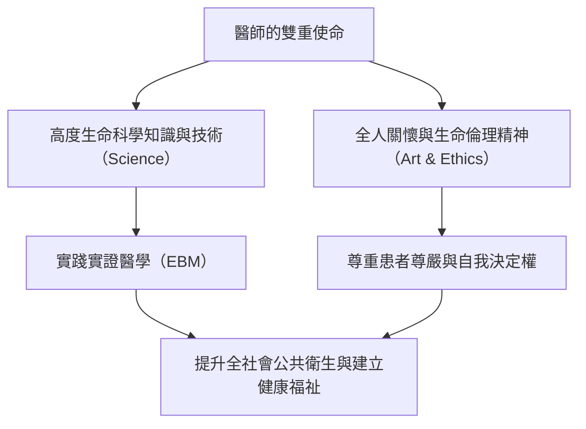
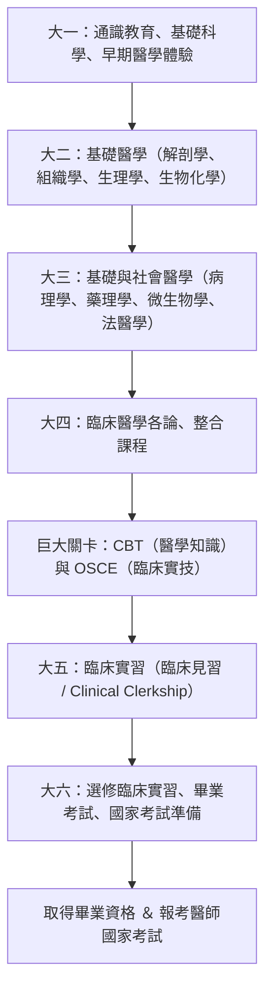
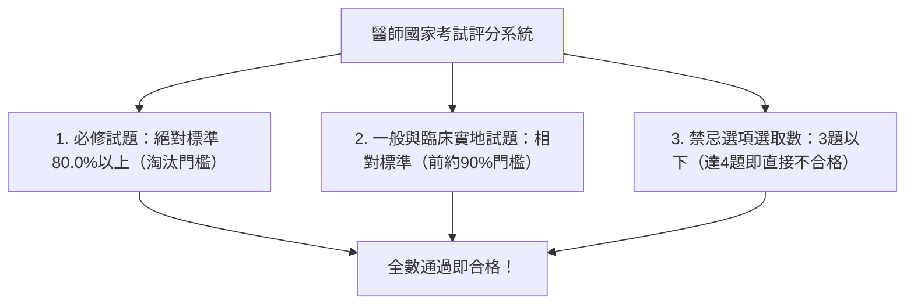
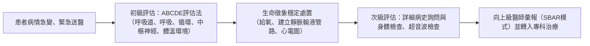
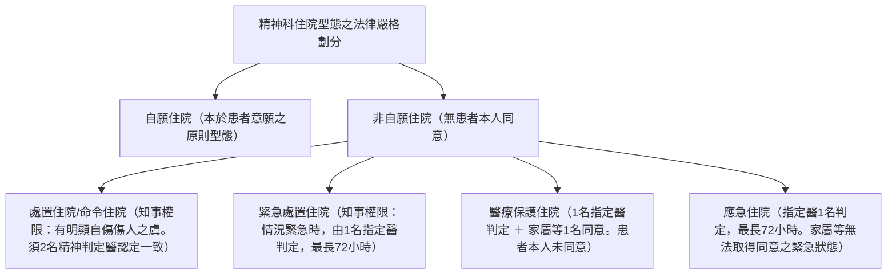
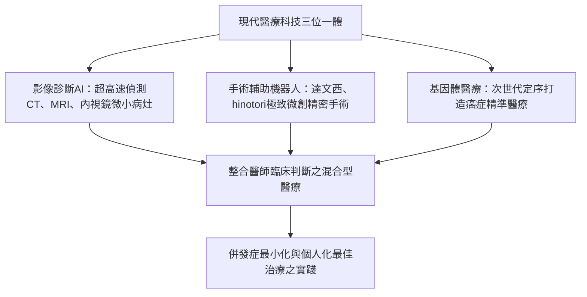

## 1. 導論：承擔人命的聖職與科學的交會點

### 1.1 醫師職責的本質：「醫道」精神與近代自然科學的融合

醫師這個職業，在人類歷史長河中始終被寄予格外深沉的敬畏。從遠古時代的巫醫與宗教療癒者發端，經歷近代自然科學的突飛猛進，當代的醫師既是「精準掌握生命科學的技術專家（Technocrat）」，更是「陪伴他人痛苦與死亡的倫理實存」，肩負著雙重神聖使命。

當人類遭逢疾病襲擊、直面死亡恐懼之際，會將自己最脆弱、最毫無防備的肉體與心靈坦露在醫師面前。醫師執刀切開皮肉、施注強效藥物、對病患身體內部進行不可逆的侵入性處置，在刑法學理上本質上符合傷害罪的客觀構成要件。然而，此等行為之所以被認定為正當醫療行為（依刑法第35條正當業務行為）而免除刑事責任，並受到全社會的崇敬，其根本基石全然在於**國家、市民社會與醫師之間所建立的絕對信託契約——「深信醫師必恪遵高度知識與純熟技能，全心全意致力於挽救生命與增進健康」**。

醫師的職責絕非僅止於治療單純的「疾病」（Disease：生物學與病理學層面的異常）。全方位撫慰因疾病而受苦的「人」（Illness：患者主觀感受的痛苦體驗），追求「醫道（The Art of Medicine）」的至高境界，才是無論人工智慧（AI）或機器人如何進步皆永遠無法取代的醫師本質。



---

### 1.2 希波克拉底誓詞、日內瓦宣言與里斯本宣言的歷史沿革

醫療倫理的原點，可追溯至古希臘「醫學之父」希波克拉底（約西元前460年－前370年）與其門徒所起草的《希波克拉底誓詞（Hippocratic Oath）》：
- 向醫神阿波羅、阿斯克勒庇俄斯宣誓
- 憑藉自身能力與判斷，為患者謀求福利制定治療方針，杜絕一切傷害與不義
- 縱遇請求，亦絕不給予致死藥物，亦不向婦女推薦墮胎之法
- 終生保持純潔與虔敬，刀斧切除結石之手術悉數交由專門術者施行
- 於診療現場獲悉病人之私密，誓守隱私，絕不外洩（醫師保密義務）

進入近代，世界醫學會（WMA）深刻反省納粹德國醫師所犯下之泯滅人性的活體實驗暴行（紐倫堡審判之嚴厲控訴），於1948年將希波克拉底誓詞重新構築為現代版本的**《日內瓦宣言（Declaration of Geneva）》**：
- 「謹莊嚴宣誓：將我之一生奉獻於為人類服務」
- 「患者的健康為我首要之顧念」
- 「絕不容許年齡、疾病、殘疾、信仰、族群、性別、國籍、政治立場、種族或社會地位等因素介於我的職責與病人之間」
- 「縱在威脅之下，亦絕不違背人道精神運用我的醫學知識」

此外，1981年世界醫學會更通過了將患者權利明文化為世界準則的**《里斯本宣言（WMA Declaration of Lisbon on the Rights of the Patient）》**，確立了「接受優質醫療的權利」、「知悉自身診療紀錄資訊的權利」、「在充分資訊揭露下的自我決定權（Informed Consent，知情同意）」、「無意識患者的代理同意權」以及「尊嚴死亡的權利」。醫療體系從過去威權主義式的「父權專斷模式（Medical Paternalism）」轉向「以患者為中心的夥伴關係」，此項歷史變革已不可逆轉地確立。

---

### 1.3 日本醫師法第1條的崇高義務

在日本法規中，規範醫師身分與義務的根本大法即為《醫師法（昭和23年法律第201號）》。該法第1條以極為莊嚴之筆調闡明了醫師的崇高使命：

> **「醫師以掌理醫療及保健指導，致力於公共衛生之提升與增進，藉以確保國民健康生活為職志。」**

本條文清晰界定了醫師的視界絕不能僅局限於眼前個別病患的治療（微觀視角），更必須延伸至綜觀整體社會的傳染病防治、環境衛生、預防醫學與衛生政策等公共衛生層面的全面提升（宏觀視角）。醫師執照絕非國家賦予個人的特權，而是為捍衛全體國民生命而課予醫師的一紙沉重且崇高的公共責任契約。

---

## 2. 醫學系6年的龐大教育體系與嚴峻關卡

成為醫師的征途極其艱辛且漫長。在日本若欲考取醫師執照，必須修畢大學醫學系（或醫科大學）六年的正規學業。醫學系的課程規劃受到文部科學省頒布之「醫學教育核心示範課程（Model Core Curriculum）」極為嚴格的標準化規範。



---

### 2.1 大一至大二：通識教育與基礎醫學的啟蒙

#### 人體解剖學實習的倫理與醫學意義
二年級等待著醫學生的是醫學旅途上最初、亦是精神衝擊最劇烈的考驗——「人體解剖學實習（Gross Anatomy）」。在長達數月的時光裡，學生必須直面那些為了醫學進步而將自身軀體無私捐獻（大體解剖獻體）的故人遺體。
- 在福馬林防腐液（浸泡保存）強烈刺鼻的氣味中，學生們切開皮膚、剝離皮下脂肪，逐一細緻地辨識、分離每條血管、神經、肌肉、骨骼與內臟器官。
- 在下第一刀前，全體學生肅立默哀，向大體老師及其家屬所展現的崇高奉獻情操致上最深切的感激。
- 這不僅僅是透過五官將三度空間內極致精密的解剖構造銘刻於腦海，更是一場讓醫學生親手觸碰「他人的死亡」、領悟生命重量並確立承擔重責覺悟的醫學教育成年禮。

#### 生理學、生物化學、組織學
- **生理學**：探討心臟動作電位的產生機制（鈉鉀幫浦、動作電位之去極化與再極化）、腎臟腎小球濾過與腎小管再吸收、內分泌荷爾蒙的回饋調控等生命現象背後的物理化學機制。
- **生物化學**：徹底記憶並融會貫通檸檬酸循環（三羧酸循環/TCA循環）、氧化磷酸化、糖質新生、脂質代謝、蛋白質合成，以及DNA複製、轉錄與轉譯等分子層級的代謝途徑。
- **組織學**：於光學顯微鏡與電子顯微鏡下精確描繪上皮組織、結締組織、肌肉組織與神經組織的微細結構，深刻掌握微觀形態與生理機能之關聯。

---

### 2.2 大三至大四：病理生理學與臨床醫學體系

從三年級至四年級，學習重心轉向探索疾病發生機轉（基礎醫學在臨床之應用）以及各臨床專科疾病之診斷與治療方針的「臨床醫學」階段。

- **病理學**：從細胞與組織的形態學變化（發炎、壞死、腫瘤化、異型度、細胞凋亡）中解讀疾病之本質。
- **藥理學**：藥物之受體結合機制、藥物動力學（吸收、分布、代謝、排泄：ADME）、抗生素之作用機轉與抗藥性菌種之演變、降血壓藥與抗癌藥之分子標靶機制。
- **內科學各論**：心臟血管內科（急性心肌梗塞、心律不整、心臟衰竭）、胸腔內科（肺癌、慢性阻塞性肺病COPD、間質性肺炎）、胃腸肝膽科（胃潰瘍、肝硬化、大腸癌）、腎臟內科（腎病症候群、慢性腎臟病CKD）、新陳代謝內分泌科（糖尿病、甲狀腺機能異常）、血液科（白血病、惡性淋巴瘤）、神經內科、風濕免疫過敏科。
- **外科學各論**：消化系外科、心臟血管外科、胸腔外科、神經外科、骨科等手術適應症、手術前後照護管理、休克急救復甦。
- **小兒科學、婦產科學、精神醫學**：從新生兒先天性異常至發育障礙；周產期醫學管理（分娩、妊娠高血壓綜合徵）；思覺失調症、憂鬱症之藥物治療與心理治療。
- **社會醫學、法醫學、公共衛生**：流行病學統計、傳染病防治法、職業衛生、毒理學、異常死亡原因之調查，以及司法解剖、行政解剖之法醫鑑識技術。

---

### 2.3 第一道巨大關卡：CBT與OSCE（共用考試的公定化）

在四年級秋季，醫學生必須迎戰檢驗其是否具備步入臨床場域（病房）資格的全國統一「醫學共用考試」。自2023年（令和5年）起，因應醫師法修正，共用考試已被法規正式定位為比照國家資格的「公定考試」。

1. **CBT（Computer Based Testing，電腦化測驗）**：
   - 於電腦終端上作答約320題醫學知識測驗的客觀多選題考試。
   - 題目自龐大試題庫中隨機抽取，並依據項目反應理論（IRT）進行精準難度校正與評分。
   - 範圍全面涵蓋基礎醫學、臨床醫學與社會醫學，答對率若未達法定門檻（通常約為65%〜70%以上）者，將毫不留情地被判定不及格並面臨留級命運。
2. **Pre-CC OSCE（Objective Structured Clinical Examination，客觀結構化臨床考試）**：
   - 不僅考驗知識，更是全面評估實際問診溝通、理學檢查技能與醫療態度的實作評量。
   - 考生需依序輪轉多個測驗站（病史詢問、頭頸部檢查、胸部檢查、腹部檢查、神經學檢查、急救甦醒處置），在標準化病人（模擬病人）或高階模型上展現診察技術。
   - 由外部指派之評分考官依據極其詳盡的檢核表評分，儀容態度、開場問候、同理心展現、洗手消毒、標準聽診觸診程序均受到嚴密檢驗。

唯有雙雙通過兩項試驗者，始得獲頒**「學生醫師（Student Doctor）」**稱號，正式邁入病房臨床實習階段。

---

### 2.4 大五至大六：臨床實習（臨床見習 / Clinical Clerkship）

自五年級起，學生將在大學附設醫院或區域核心教學醫院各專科展開每輪為期1〜2週的「臨床實習（Clinical Clerkship：診療參與型臨床實習）」。
與昔日走馬看花式的「參觀型見習」迥然不同，現代實習制度要求醫學生作為醫療照護團隊的正式一員進駐病房。
- 在主治醫師及指導醫師監督下，每日負責指定病患之問診、生命徵象監測、撰寫病歷（學生病歷）、判讀檢驗數據，並於晨會或跨科會議上進行病例報告（Case Presentation）。
- 進入手術室前落實外科刷手消毒，穿戴無菌手術衣，擔任第二或第三助手，負責術野拉鉤牽引與剪線止血等核心輔助工作。
- 於指導醫師的嚴密指導下，熟練掌握抽血、建立周邊靜脈管路（打點滴留置針）、外科縫合與打結等基本臨床侵入性處置。
- 邁入六年級後，各大學醫學院將舉辦極其嚴苛的「畢業綜合考試（卒試）」。為確保該校在國家醫師考試中的及格率排名，許多大學會無情地將成績未達標準的學生擋下延畢（留級），形成一道極具淘汰性的篩選濾網。唯有衝破這道關卡的強者，才能領取醫師國家考試的准考證。

---

## 3. 醫師國家考試的架構與及格分水嶺

醫師國家考試由厚生勞動省主辦，每年2月上旬連續舉行兩天，是一場決定醫學生一生命運的全國性大考。

### 3.1 考試結構與命題標準

全卷共計400題，採電腦畫卡答案卷（含部分計算題與多選題）作答。

| 試卷區塊 | 題數 | 測驗時間 | 內容 |
| :--- | :---: | :---: | :--- |
| **A卷** | 75題 | 135分鐘 | 各論、總論（臨床實地、一般試題） |
| **B卷** | 50題 | 80分鐘 | **必修試題（一般、臨床實地）** |
| **C卷** | 75題 | 135分鐘 | 各論、總論（長篇病例題等） |
| **D卷** | 75題 | 135分鐘 | 各論、總論（基礎、社會醫學等） |
| **E卷** | 50題 | 80分鐘 | **必修試題（醫療安全、公共衛生）** |
| **F卷** | 75題 | 135分鐘 | 各論、總論（臨床綜合試題） |

---

### 3.2 三大及格標準與「必修80%」的嚴酷門檻

醫師國考的及格判定，必須**同時無條件滿足以下三大獨立標準**。只要任一項未達標準，即刻判定為不合格。



1. **必修試題之絕對淘汰門檻（80.0%基準）**：
   - 必修試題（共100題、總分200分）以**得分率達80.0%（160分以上）為絕對門檻**。
   - 即便考生在一般與臨床實地試題拿下接近滿分的驚人成績，只要必修試題差0.5分或1分，亦難逃落榜命運。因此，考生無不在龐大心理重壓下，雙手顫抖著塗填答案卡。
2. **一般試題與臨床實地試題之相對及格標準**：
   - 一般試題與臨床實地試題採取相對常態評分機制，每年依全體考生之常態分佈，劃定淘汰後段約10%考生的及格門檻線（各年度及格標準大致落於總得分率68%〜72%左右）。
3. **禁忌選項（Contraindication）之致命陷阱**：
   - 令全體考生聞風喪膽的莫過於「禁忌選項（禁忌肢）」。若考生勾選了身為醫師絕不能犯的**「足以致病患於死地的重大醫療過失選項」、「嚴重侵害人權的違法處置」或「明確違反法規之行為」**，每踩中一題即累計一次禁忌次數。
   - 通常而言，**若踩中4題（依年度不同有時為3題）以上禁忌選項，縱使考試總分遙遙領先榜首，亦會遭到無條件直接淘汰判定不合格**。
   - （實例：對疑似腦出血患者給予抗凝血劑；面對過敏性休克未第一時間注射腎上腺素而僅單獨給予類固醇觀察；對有機磷中毒使用禁忌藥物而非阿托品；僅憑家屬意願未獲患者本人同意便強制安排非自願精神科住院等）。

---

## 4. 初期臨床研修（兩年）的試練：全面輪調制度（Super-Rotate）

縱使順利考取國考、登錄醫籍並獲頒醫師證書，依法規明定（醫師法第16條之2），新進醫師亦絕對嚴禁立即獨立從事診療工作。全體新科醫師必須強制接受為期兩年的「臨床研修（住院醫師訓練）」。

### 4.1 2004年新醫師臨床研修制度改革的衝擊

2004年（平成16年）以前的舊體制下，醫學院畢業生於畢業當下即直接進入大學醫院特定「醫局」（如第一內科、第二外科等），並終生被綁定在極度狹隘的專科次領域內進行學徒式訓練。這導致了嚴重的專科偏狹弊端——「身為消化專科權威，卻連常見的閉鎖性骨折、眼科疾病或初期心肺復甦術都毫無處置能力」。

為打破此種專業藩籬，日本全面推行「大輪調制度（Super-Rotate，新臨床研修制度）」：
- **強化基本診療能力**：無論未來志向為何，全體受訓醫師強制輪調內科（6個月以上）、急診醫學（3個月以上）、社區醫療（1個月以上），並兼顧小兒科、婦產科、精神科與外科等全方位輪訓，全面建立基層全人照護（Primary Care）與初步急重症處置能力。
- **引進配對系統（Matching System）**：受訓醫院的派任不再任由大學醫局教授獨斷命令，而是改由醫學生與各家教學醫院各自填寫志願序，透過演算法（蓋爾－沙普利穩定婚姻演算法，Gale-Shapley Algorithm）自動媒合的「醫師臨床研修配對評議會」體系。
- 此項改革讓臨床訓練扎實、值班津貼合理且指導體系完善的都會型非大學市立/公私立名門核心醫院（如聖路加、虎之門、倉敷中央、龜田綜合病院等）成為兵家必爭之地，卻也導致地方大學醫局急速萎縮、醫師人才大量流失，引發地方偏鄉醫療資源匱乏（醫療崩壞）等結構性社會後遺症。

---

### 4.2 初級住院醫師（實習/研修醫師）的嚴酷日常與臨床技能養成

兩年的初級住院醫師（Junior Resident）生涯，是每一位醫師一生中學習密度最高、身心最為煎熬的淬鍊期。



- **急診外傷值班夜**：從自行步入檢傷的輕症患者，到到院前心肺功能停止（OHCA/CPA）的垂死病患，源源不絕湧入急診檢傷區。住院醫師在上級急診主治醫師指導下，嚴格遵循**「ABCDE評估法」**（Airway 呼吸道, Breathing 呼吸, Circulation 循環, Dysfunction of CNS 中樞神經功能障礙, Exposure 體溫與暴露環境），於數秒至數分鐘內迅速完成重症檢傷分級。
- **核心侵入性技術之掌握**：
  - 動脈血液氣體分析採檢（橈動脈穿刺取血）
  - 超音波快速評估創傷（FAST Protocol，腹腔內活動性出血快速超音波檢查）
  - 中心靜脈導管（CVC）置入（超音波導引下內頸靜脈穿刺置管）
  - 氣管內管插管（喉頭鏡直視聲門暴露與氣管導管置入）
  - 腰椎穿刺術（抽取腦脊髓液以診斷中樞神經感染與蜘蛛膜下腔出血）
  - 胸管引流術、腹腔穿刺術
- **宣告死亡與病情告知**：第一次親手確認患者心跳停止、瞳孔放大、對光反射消失與心電圖平坦呈現電氣靜止，簽署生平第一張死亡證明書的那一刻；走出病房向慟哭的家屬宣告病人離世的沉痛瞬間——身為醫師那份承載生死的沉甸重量與終極責任，自此深深刻印進每位醫師的靈魂深處。

---

## 5. 新專科醫師制度的全貌：基本19領域與次專科

圓滿完成兩年初期研修後，醫師晉升為「資深住院醫師（專攻醫 / Senior Resident）」，在此階段正式決定其終生鑽研的專業學科領域。2018年（平成30年）起正式全面施行的「新專科醫師制度」，由一般社團法人日本專科醫師機構統籌制定全國一致之培訓標準與審核認證，形成階層分明的兩階段金字塔結構。

```mermaid
flowchart TD
    subgraph 基本領域（第一層：3〜5年）
        B1["內科"]
        B2["外科"]
        B3["小兒科"]
        B4["婦產科"]
        B5["急診醫學科"]
        B6["家庭醫學科/全科醫學"]
        B7["其餘13個領域（骨科、麻醉、精神、神經外科、皮膚、泌尿、眼科、耳鼻喉、病理、放射線、整外、復健、檢驗醫學）"]
    end
    subgraph 次專科領域（第二層：額外2〜3年）
        B1 --> S1["心臟內科 / 胃腸肝膽科 / 胸腔內科 / 血液科 / 腎臟內科 / 新陳代謝科 / 神經內科"]
        B2 --> S2["一般外科 / 心臟血管外科 / 胸腔外科 / 小兒外科 / 乳房外科"]
    end
    S1 --> PHD["指導醫師資格、醫學博士（PhD）、臨床研究論文"]
    S2 --> PHD
```

---

### 5.1 19個基本專科領域的架構

專攻醫必須投身於以下**19個基本領域**之專科培訓計畫，接受為期3〜5年的嚴格專科臨床訓練。

| 基本領域 | 培訓期間 | 主要專業特徵 |
| :--- | :---: | :--- |
| **內科** | 3年 | 登錄龐大病例（強制於J-OSLER系統提交數百例詳細病歷與病歷摘要）。邁向次專科內科的必經門檻。 |
| **外科** | 3〜4年 | 消化系、心臟、胸腔、小兒外科之全方位基礎。強制於NCD（National Clinical Database）登錄執刀手術病例。 |
| **小兒科** | 3年 | 新生兒加護醫療（NICU）、小兒急救、感染症、兒童身心發展障礙、過敏性疾病之全人診療。 |
| **婦產科** | 3年 | 周產期醫學（正常與高危險分娩、剖腹產）、婦科腫瘤手術、不孕症與生殖醫學。 |
| **急診醫學科** | 3年 | 重度多重外傷、敗血性休克、急性中毒、嚴重燒燙傷、重症加護病房（ICU）管理、到院前空中醫療救援（救護直升機 Doctor-Heli）。 |
| **整合醫療科（總合診療科）** | 3年 | 新設領域。社區全人整合照護、多重慢性疾病共病（Multimorbidity）病患之整合管理、家庭醫學。 |
| **骨科** | 3〜4年 | 骨折外傷、人工關節置換手術、脊椎微創手術、運動醫學、骨骼肌肉復健。 |
| **麻醉科** | 4年 | 全身麻醉、硬脊膜外麻醉、疼痛控制門診、重症加護照護、手術期危機管理。 |
| **精神科** | 3年 | 與取得精神保健指定醫資格緊密扣連。憂鬱症、雙極性情感障礙、思覺失調症、失智症之藥物與精神動力治療。 |
| **神經外科** | 4年 | 腦動脈瘤夾除術、顱內腫瘤切除、腦血管內導管介入治療、嚴重頭部外傷開顱減壓手術。 |
| **放射線科** | 3年 | 影像診斷判讀（CT、MRI、PET影像精讀）以及放射線介入治療（IVR）、惡性腫瘤放射線治療。 |
| **病理專科** | 3年 | 術中冷凍切片快速診斷、切片組織病理學診斷、病理解剖（CPC：臨床病理討論會）。 |
| **其餘領域** | 3〜4年 | 皮膚科、泌尿科、眼科、耳鼻喉頭頸外科、整形外科、復健醫學科、臨床檢驗醫學科。 |

---

### 5.2 邁向次專科領域的深化與醫學博士（PhD）

在考取基本領域專科醫師認證後，醫師將進一步向更加尖端微觀的「次專科領域（Subspecialty，第二層結構）」挺進，爭取次專科專科醫師認證（如心臟血管內科專科、消化內科專科、消化內視鏡專科、心臟血管外科專科、癌症化學藥物治療專科等）。

與此同時，多數醫師會選擇報考大學醫學研究所博士班（修業年限4年），於基礎醫學研究所或臨床研究室投身分子生物學、腫瘤免疫學、次世代基因定序等前瞻實驗，並在具有國際聲譽的同行評審SCI英文期刊（Peer-Reviewed Journal）以第一作者身分發表原創研究論文，以獲取**「醫學博士（PhD）」**學位。這賦予了現代醫師雙重身分——一方面在臨床第一線守護病患，另一方面在學術殿堂為攻克全球未知疾病持續貢獻實證醫學的新知。

---

---

## 2.5 臨床醫學的深層病理與藥物動力學（PK/PD理論）之數學原理

醫學生於學習臨床醫學時，為摒棄死記硬背疾病名稱與症狀的傳統窠臼，涵養基於分子生物學與數理藥理學的科學決策思維，其不可或缺之核心概念即為**「PK/PD理論（Pharmacokinetics / Pharmacodynamics，藥物動力學/藥效學理論）」**。

### 藥物動力學（PK）的核心參數
- **體內藥物濃度時間曲線下面積（AUC: Area Under the Curve）**：投予藥物後進入全身血液循環之總曝露量指標。
- **最高血中濃度（Cmax）**：藥物給藥後在體內達到的最高血中濃度峰值。
- **分佈體積（Vd）**：反映藥物容易向周邊組織分佈（高脂溶性）或是主要滯留於血漿中（水溶性）之假想體積數值。

### 抗菌藥PK/PD參數之三大核心分類
在細菌感染症之治療戰略中，抗菌藥物依據其血中藥物濃度與最小抑菌濃度（MIC: Minimum Inhibitory Concentration）之動態數學關係，嚴密劃分為以下三大作用型態：

| 參數 | 藥效指標 | 代表性抗生素 | 給藥設計策略 |
| :--- | :--- | :--- | :--- |
| **Time above MIC ($T > MIC$)** | 血中濃度高於MIC的時間比例（%） | **青黴素類、頭孢菌素類、碳青黴烯類**（$\beta$-內醯胺類抗生素） | 與其盲目拉高單次給藥劑量，更應**增加給藥頻率（一日分3〜4次給藥）**或延長靜脈滴注輸注時間（長時間持續輸注），藉以使藥效達到最大化。 |
| **$Cmax / MIC$** | 最高血中峰值濃度達到MIC的倍數 | **胺基糖苷類**（Gentamicin、Amikacin） | 避免多次分割給藥，採取**每日單次大劑量投予**，促使血中濃度產生陡峭之極高尖峰，藉以發揮濃度依賴性殺菌力並最大化抗生素後效應（PAE），同時亦顯著降低蓄積性腎毒性與耳毒性風險。 |
| **$AUC / MIC$** | 24小時總體曝露量與MIC的比值 | **氟喹諾酮類、萬古黴素**（醣肽類） | 在確保每日總投藥劑量的前提下，針對萬古黴素實施嚴密的治療藥物監測（TDM），將谷值血中濃度（下次給藥前即刻採血濃度）精確控制於 $15 \sim 20 \mu g/mL$ 之間。 |

---

## 3.6 醫師國家考試的艱深考點：公共衛生法規與精神保健福利法的法律解釋

在醫師國家考試的各科領域中，令最多頂尖醫學生跌跤失分的莫過於「公共衛生與醫療法規」單元。考生不僅需要掌握臨床醫學知識，更必須具備堪比法律專家的嚴謹法規要件理解力與法理詮釋能力。

### ① 傳染病防治法規之分類與醫師強制通報義務
在日本《傳染病預防及傳染病患者醫療法（傳染病法）》中，傳染病依其致死危險度、傳染傳播力及社會衝擊性，嚴謹劃分為第一類至第五類，以及指定傳染病與新型流感等傳染病。

- **第一類傳染病（伊波拉出血熱、鼠疫、馬堡病毒出血熱、拉薩熱、克里米亞-剛果出血熱、天花、南美出血熱）**：
  - 醫師具有**立即（不得延遲）經由管轄保健所長向都道府縣知事報告通報之法定絕對義務**。
  - 啟動特定或第一類傳染病指定醫療機構之強制隔離住院、72小時內交通管制封鎖、污染物消毒乃至強制銷毀等公權力強制行政處分。
- **第二類傳染病（結核病、嚴重急性呼吸道症候群: SARS、中東呼吸症候群: MERS、H5N1/H7N9新型禽流感、小兒麻痺症）**：
  - 確診後立即通報。實施移送至第二類傳染病指定醫療機構之住院勸告或強制措施。對於潛伏性結核感染（LTBI）適用公費全額補助醫療制度。
- **第三類傳染病（霍亂、細菌性痢疾、傷寒、副傷寒、腸道出血性大腸桿菌感染症: 如O157等）**：
  - 確診後立即通報。雖無強制隔離住院手段，但對餐飲從業人員等特定工作者施予定期糞便採檢，於檢驗轉陰前強制禁止從事相關業務（就業限制）。
- **第四類傳染病（E型肝炎、A型肝炎、瘧疾、狂犬病、登革熱、黃熱病、日本腦炎、退伍軍人病、破傷風等）**：
  - 經由動物、受污染飲食或病媒蚊蟲叮咬媒介傳播之疾病。確診後立即通報。因通常不具人傳人之飛沫或接觸傳播性，故不採取強制住院或就業限制處分。
- **第五類傳染病**：
  - **全數通報對象（確診後7日內通報）**：麻疹、風疹（德國麻疹）、梅毒、急性腦炎、破傷風、侵襲性腦膜炎雙球菌感染症、後天免疫缺乏症候群（AIDS/HIV）。其中麻疹與風疹依法必須即時通報。
  - **定點監測對象（由指定定點醫療機構按週或按月呈報病例數）**：季節性流感、腸病毒手足口病、呼吸道融合病毒（RSV）感染症、感染性腸胃炎等。

### ② 精神保健福利法中各類住院型態之法律嚴謹性
在精神科臨床實務中，精神障礙病患之自我決定權與防止自傷傷人公共安全利益之間的終極法律衡量，均繫於《精神保健及精神障礙者福祉法（精神保健福利法）》之嚴格規範。



於國家考試中，特別是「醫療保護住院」之合法同意權人（配偶、監護人、法定撫養義務人等，以及若無上述親屬時由市町村長代行）之法定順位，以及「處置住院」中由警察官依法通報（第24條）或一般民眾通報（第22條）送達都道府縣知事啟動強制鑑定審查之完整程序，均是決定考生及格與否的兵家必爭核心考題。

---

## 4.5 急診室值班的修羅場：意識障礙鑑別診斷工具「AIUEO TIPS」與急腹症

急診深夜，值班初級住院醫師的手機突然響起急促刺耳的鈴聲：「急診室通報，70多歲男性，急性昏迷、意識不清，救護車即將抵達！」。在此千鈞一髮之際，住院醫師大腦必須如閃電般迅速運轉的思考邏輯框架，正是名震國際醫學界的急診意識障礙鑑別診斷黃金準則——**「AIUEO TIPS」**。

| 首字母 | 鑑別之病態與疾病 | 急診室初期關鍵處置 |
| :---: | :--- | :--- |
| **A** | **A**lcohol（急性酒精中毒） / **A**cidosis（酸中毒） | 評估呼氣酒精氣味，進行動脈血液氣體分析評估pH值、乳酸數值，計算陰離子間隙（Anion Gap, AG）。 |
| **I** | **I**nsulin（低血糖、糖尿病酮酸血症: DKA / HHS） | **第一步必須立即實施指尖採血進行床邊快速血糖檢測！**（低血糖數十分鐘即可造成不可逆腦死，一旦確認立即靜脈推注50%葡萄糖注射液）。 |
| **U** | **U**remia（尿毒症） | 血液生化檢驗迅速確認BUN、肌酸酐、血鉀濃度。評估緊急血液透析之適應症。 |
| **E** | **E**ncephalopathy（肝性腦病變、高血壓腦病變） / **E**lectrolytes（電解質紊亂） / **E**ndocrine（甲狀腺風暴、黏液水腫性昏迷、急性腎上腺皮質功能不全） | 檢測血氨濃度；評估血鈉數值（嚴加防範低血鈉症快速校正所誘發之滲透性脫髓鞘症候群: ODS）。 |
| **O** | **O**xygen（低氧血症） / **O**verdose（急性藥物中毒） / **O**piate（鴉片類藥物中毒） | 監測血氧飽和度、動脈血液氣體。若出現針尖樣瞳孔合併呼吸抑制，立即靜脈注射納洛酮（Naloxone）解毒劑。 |
| **T** | **T**rauma（頭部外傷） / **T**emperature（低體溫症、重度中暑熱衰竭） | 緊急實施頭部電腦斷層（排除急性硬腦膜下血腫、硬腦膜外血腫），測量直腸深層核心體溫。 |
| **I** | **I**nfection（中樞神經感染: 腦膜炎、腦炎；嚴重敗血症） | 檢查頸部僵直、Kernig氏徵象、Jolt accentuation。採集兩套血液培養後，立即經驗性投予廣效抗生素（Ceftriaxone＋Vancomycin＋Ampicillin），評估腰椎穿刺。 |
| **P** | **P**sychiatric（心因性昏厥、解離性疾患） / **P**orphyria（紫質症） | 唯有在徹底排除所有器質性與代謝性病因之後，始得最後審慎考慮心因性可能。 |
| **S** | **S**troke（腦中風: 腦梗塞、腦出血、蜘蛛膜下腔出血） / **S**eizure（癲癇重積狀態） / **S**hock（低血容量性、心因性、阻塞性、分佈性休克） | 評估神經學局部定位病徵，緊急安排頭部MRI（擴散加權影像DWI）或頭部CT。迅速評估靜脈注射rt-PA血栓溶解劑（發病4.5小時內）或動脈機械取栓術之適應症。 |

當昏迷患者被推進急診大門時，「不管三七二十一先推去照頭部CT」是新進住院醫師最常犯下的致命低級錯誤。若忽略了低血糖或重度缺氧，直接將患者送入電腦斷層室，病患極可能在斷層掃描檢查台上當場心跳停止暴斃。**「Vital signs first, then Glucose, ABCDE stabilization!（生命徵象優先，首測血糖，落實ABCDE生命穩定！）」** 這句金科玉律，是用無數血淚寫成、深植於每位急診醫師骨髓中的最高準則。

---

## 5.5 醫師的職涯發展路徑、嚴酷的經濟現狀與終身教育之真相

### 受雇醫師與基層開業醫師的結構性收入差距及值班兼職真相
社會大眾往往對醫師抱持著「全體坐享極端優渥高薪」的單一片面印象，然而在真實世界中，伴隨醫師職涯階段與執業型態的不同，存在著令人咋舌的階層分化與殘酷落差。

1. **大學醫院受雇醫師之嚴苛經濟窘境**：
   - 兩年初期住院醫師的全國平均年薪僅約350萬至450萬日圓左右。
   - 進入專攻醫階段若選擇留在大學醫院醫局，本俸月薪僅約20萬至30萬日圓者絕非罕見。在面對繁重如山的病房臨床工作、準備醫學會口頭報告及撰寫臨床研究論文的蠟燭多頭燃燒下，醫師必須依靠每週1〜2次前往偏鄉急診醫院或慢性病療養病房兼差值夜班（每次兼職值班約領取4萬至8萬日圓報酬），方能勉強維持基本家庭生計。
   - 縱使熬到30歲中旬取得醫學博士學位，獲聘為大學助理教授或講師，大學醫院核發的本職年薪往往亦僅在600萬至800萬日圓上下盤旋。
2. **區域中大型核心醫院受雇主治醫師（中堅臨床醫師）**：
   - 年齡屆滿30歲後半至40歲，升任區域綜合醫院或民間大型核心教學醫院之科主任或資深主治醫師時，年薪約可達1,200萬至1,800萬日圓。然而，這筆收入的背後代價是無止盡的On-call待命、假日突發緊急召回急救手術以及徹夜值班的嚴苛體力透支。
3. **基層診所開業醫師（私人基層執業）**：
   - 40歲之後投入個人積蓄並向銀行鉅額融資借貸（數千萬乃至數億日圓）自行開業設立基層診所者，若經營得當、客源穩固，年收入突破2,500萬至4,000萬日圓以上者大有人在。然而，開業醫除了本身的臨床醫術外，還必須獨自承擔人事勞資管理、資金週轉調度、高昂醫療儀器折舊投資、市場行銷規劃等「身為經營者的全面責任」，更必須背負「無限責任之債務倒閉風險」。

### 醫療訴訟巨災風險與醫師業務過失責任保險
每一位執業醫師終其一生，無時無刻不與「醫療過失訴訟」這項足以摧毀人生的毀滅性風險比鄰而居。
- 產科分娩時新生兒窒息導致重度腦性麻痺（雖設有產科醫療補償制度，但若進入民事損害賠償訴訟，往往判賠高達1億至2億日圓之巨額賠償金）。
- 術後下肢深層靜脈血栓引發致死性肺栓塞（經濟艙症候群）猝死、抗癌化療給藥時急性骨髓抑制併發感染之處置延誤、放射線影像判讀之早期微小惡性腫瘤漏判。
- 投保由日本醫師會或各專科學會出面承保之「醫師責任保險（醫賠責）」，已成為當代所有臨床醫師不可或缺的自衛盾牌。

## 6. 醫師必備的法規、制度與醫療倫理

醫師的日常診療行為，無時無刻不受到嚴密法網的嚴格規管。任何輕忽法律規範的醫師，將面臨撤銷醫師執照、停業處分（依醫師法第7條規定之行政懲戒處分）、刑事起訴判刑，以及高達數千萬乃至數億日圓之民事侵權損害賠償判決。

### 6.1 醫師法重要條文剖析

#### ① 應召義務（醫師法第19條第1項）
> 「從事診療之醫師，於遇有診察治療之請求時，非有正當理由，不得拒絕。」

傳統法理上一度被嚴格解釋為「醫師於任何情況下皆無權拒絕病人求診」。然而，厚生勞動省於2019年（令和元年）發布最新行政解釋通達，明確釐清了現代醫療環境下的法理裁量基準：
- 於正常診療時間內，即使醫師暫時不在或非自身專科領域，醫師仍負有提供急救處置或立即協助轉診至適當醫療機構之義務。
- 另一方面，於非診療時間內，若本院非屬急診指定醫療院所，或者病患涉及嚴重酒醉鬧事、暴力威脅醫護人員、惡意長期拒繳醫療費用等重大滋擾行徑，抑或醫師因極度過勞、罹患重病導致客觀上已完全無法確保醫療安全品質時，法律均正式認可其構成「正當理由」，醫師得依法拒絕接診（兼顧醫師勞動權益保護與醫療品質安全之均衡）。

#### ② 禁止無診察治療（醫師法第20條）
> 「醫師未親自診察，不得進行治療或開立處方箋；未親自接生，不得交付出生證明書或死產證明書。」

未經親自面對面診察即逕行開立處方藥物乃法所嚴禁。近年快速崛起之「遠距通訊診療（線上看診）」，必須在嚴格遵守厚生勞動省頒布之《線上診療適正實施指針》規範，且僅限於安全性與療效均獲充分醫學實證之特定慢性病與既定治療計畫之前提下，始作為本條例外而具備合法性。

#### ③ 異常死體通報義務（醫師法第21條）
> 「醫師檢驗屍體或四個月以上之死產兒，認有異常者，應於二十四小時內向管轄警察署通報。」

關於醫療過失事故或住院期間突發非預期猝死是否歸屬於「異常死體」之範疇，歷經東京女子醫大事件、都立廣尾病院事件等最高裁判所指標性判例之激烈攻防與法理交鋒。判例最終確立裁判基準：「縱屬診療相關死亡，凡死者外表具有外傷異常或具有犯罪嫌疑可能者，醫師即負有法定義務向警察機關通報」。凡違反本條義務並蓄意隱匿掩蓋事實之涉案醫師，均遭依法追究嚴厲之刑事責任。

---

### 6.2 告知後同意（說明與同意）與醫療過失法理

在醫療民事損害賠償訴訟中，追究醫療行為過失責任（債務不履行責任或侵權行為責任）的兩大核心支柱即為「注意義務違反」與「說明義務違反」。

- **醫療水準（Standard of Care）**：衡量醫師是否善盡注意義務的法律標準，雖會審酌該醫療機構之層級性質（醫學中心抑或基層診所）及所處地域之客觀醫療實況，但根本上係以「行為當時醫學界具備平均良識之合格醫師所應具備並實踐之水準」作為客觀衡量尺度。
- **告知後同意（Informed Consent）**：醫師對病患負有以通俗易懂之言語詳盡說明以下核心事項之義務：①當前確診病名與病況演變；②擬實施之治療方針與手術內容；③該項處置伴隨之危險性、可能併發症與藥物副作用發生機率；④其他可供替代之醫療方案及其優缺點利弊分析；⑤若拒絕接受治療時之自然病程預後。醫師必須在完成上述說明後，取得病患本於自由意志之真摯同意。若醫師怠於履行說明義務而逕行手術，即使手術過程在技術上完美無瑕、未出現任何操作疏失，法院仍得以「侵害病患之醫療自我決定權」為由，重判醫師與醫院賠償數千萬日圓之巨額精神慰撫金。

---

---

## 6.5 末期醫療決策程序（ACP）與法定腦死判定之嚴謹性

醫師在行醫生涯中所面臨最為沉痛且複雜的倫理考驗，莫過於「生命終末期（安寧療護）」階段醫療處置之不予施行或撤除，以及「腦死判定」之法理實務現場。

### ① 生命末期醫療照護決策指引之核心準則
依據日本厚生勞動省所研訂之醫療決策指引，當代醫療全面以**「ACP（Advance Care Planning，預立醫療照護諮商；日本推廣暱稱：人生會議）」**作為實踐核心。
- 嚴格禁止過往由主治醫師一人擅自專斷決定延命醫療（如插管使用呼吸器、連續施打升壓強心劑、施行心肺復甦術CPR）之啟動或撤除。
- 病患意識清楚且具表達能力時：由病患本人與由跨領域醫療照護專業團隊（主治醫師、護理師、社工師等）進行充分且多次溝通對話，至誠尊重病患本人的自主意願。隨著病情演變或病患心境起伏，必須反覆確認其真實意願。
- 病患意識不清且無法表達時：若家屬能具體推定病患本人生前之真實心願，應優先尊重該推定意願；縱使家屬無法推知病患意願，亦必須由家屬與醫療團隊共同展開跨領域反覆會商，秉持病患之最佳利益合議決定。
- **「中止（撤除/不給予）延命醫療」之刑法免責四要件**：病患處於現代醫學客觀上不可逆之瀕死末期狀態（死亡無可避免）；具備病患本於真實意願之自我決定（如預立安寧醫療預警意向書 Living Will）；最大極限落實安寧緩和醫療以緩解痛苦；嚴格踐行多領域團隊共識合議審查程序。唯有在同時嚴格滿足此四大客觀要件下，始得阻卻刑法上殺人罪或有義務者遺棄致死罪之違法性（依川崎協同病院事件、射水市民病院事件之司法實務終局判決）。

### ② 依據人體器官移植法之法定腦死判定六大絕對要件
依據《人體器官移植法（器官移植法）》之特別明文規定，不同於傳統心跳停止的「心臟死」，「腦死（Brain Death）」在法律上被正式視為人之死亡，其適用前提嚴格局限於「以進行器官捐贈移植為目的」之特殊情境。法定腦死判定必須遵循極為嚴苛之客觀標準作業指引，連續進行兩次嚴密獨立檢驗。

1. **深昏睡狀態（Japan Coma Scale 300 / Glasgow Coma Scale 3分）**：對外界一切強烈疼痛與聲光刺激均毫無任何自主運動或神經反應。
2. **瞳孔擴大且光反射完全固定**：兩側瞳孔直徑擴大達 $4mm$ 以上，且直接與間接光反射完全消失。
3. **腦幹反射完全消失（七大反射之嚴格測試）**：
   - 對光反射
   - 角膜反射（以無菌棉棒輕觸兩眼角膜均無任何眨眼瞬目反應）
   - 睫狀脊髓反射（用力捏掐頸部兩側皮膚時瞳孔均無任何擴大反應）
   - 頭眼反射（快速向左右上下旋轉病患頭部時，眼球完全隨頭部固定轉動，「洋娃娃眼現象」完全消失）
   - 前庭反射（將冰水注入外耳道實施冷熱試驗，眼球完全無任何偏向或眼球震顫現象）
   - 咽反射（以壓舌板或抽痰管強烈刺激咽喉後壁無任何作嘔噁心反應）
   - 咳反射（將抽痰管深插至氣管內管隆突部位進行深部抽吸，無任何咳嗽反射動作）
4. **腦波平坦（Flat EEG，電氣靜止）**：依據國際10-20電極配置法進行多頻道腦波監測，於最高敏感度（$2\mu V/mm$）下持續記錄至少30分鐘以上，確認大腦皮質電氣生理活動完全呈一直線（電氣靜止狀態）。
5. **自主呼吸完全消失（無呼吸試驗 / Apnea Test）**：暫時脫離呼吸器，經由氣管導管持續供應純氧（$100\% O_2$），持續觀察至動脈血二氧化碳分壓（$PaCO_2$）飆升至 $60 mmHg$ 以上，在此極端高碳酸血症呼吸中樞驅動刺激下，確認病患仍未出現任何自主呼吸驅動胸腹運動。
6. **判定間隔時間**：在初次判定全數符合上述五大要件後，必須強制維持**至少6小時以上**（6歲以下幼兒因大腦代償修復力強，依法強制間隔24小時以上）之嚴密觀察，隨後由兩位以上具備合格資質之專科醫師再次從頭到尾重複實施完全相同之各項檢驗，確認所有反射與生理反應均具不可逆性。

唯有在兩次獨立判定結果完全吻合時，醫師始得莊嚴宣告病人之「法定死亡時間」。在這一刻，醫師以科學求真的極致嚴謹，懷抱著對生命尊嚴的無上敬畏，守護人世間最後的界線。

## 7. 終身教育與現代挑戰：醫師工時改革與AI智慧醫療的未來

### 7.1 醫師工時改革（2024年4月實施）的劇烈變革

長年以來，日本傲視全球的超高水準醫療普及率與世界第一的長壽社會，背後實質上是由全體醫師「燃燒自我的滅私奉公犧牲奉獻精神」與「毫無上限的超時加班勞動（每月值班與On-call待命加班動輒突破100至200小時）」所硬性支撐起來的奇蹟。

為從體制上根絕結構性的醫師過勞死悲劇，自2024年（令和6年）4月起，「醫師加班時數法定上限管制新制」正式上路。

| 水準類別 | 適用對象醫院與醫師 | 年度超時加班上限 | 月度上限與制度特徵 |
| :---: | :--- | :---: | :--- |
| **A水準** | 一般受雇醫師（絕大部分醫院） | **960小時** （月平均80小時以內） | 原則上嚴格限制於過勞死警戒線之內。 |
| **B水準** | 確保地方社區醫療暫定特例（急救責任醫院等） | **1,860小時** （月最高155小時） | 劇變緩和過渡措施。需經都道府縣知事專案指定。 |
| **C水準** | 技能提升集中研修（初期研修醫、專攻醫等住院醫師培訓群） | **1,860小時** （月最高155小時） | 為確保於短期間內累積大量病例經驗所設之培育名額。 |

這項劃時代的勞動改革，在保障醫師身心健康與明定夜間值班後強制連續休息間隔（Interval管制）方面邁出歷史性一步；然而與此同時，地方中小型醫院因支援醫師被迫撤回、急診夜間收治量能銳減，以及年輕住院醫師手術病例累積量大幅縮減等嶄新的醫療供給危機，亦隨之浮上檯面。

---

### 7.2 醫療數位轉型（DX）、影像診斷AI與手術輔助機器人的共生

邁入21世紀，現代醫學因與尖端科技的深度融合，正在掀起顛覆性的演進風暴。



- **影像診斷AI**：在胸部CT微小肺癌結節偵測、大腸內視鏡早期瘜肉辨識、糖尿病眼底鏡網膜病變篩檢等領域，奠基於深度學習的輔助診斷AI已成為放射線科與內視鏡專科醫師不可或缺的「第三隻眼」，全面進入日常常態臨床實務。
- **手術輔助機器人**：以「達文西手術系統（da Vinci Surgical System）」與日本國產的「hinotori」為代表之手術輔助機器人，能夠徹底濾除外科醫師雙手之微細生理顫抖，憑藉突破人體手腕極限的多關節自由度器械與高解析3D立體放大視野，讓攝護腺全切除術、胃癌、直腸癌微創根除手術的術中出血量與手術併發症風險呈現斷崖式下降。
- **精準醫療（Precision Medicine）**：透過次世代定序技術一次性全面定序患者腫瘤組織數百個基因突變的「癌症全基因體檢測（Cancer Gene Panel Testing）」，讓臨床醫師能夠精準針對該名病患專屬的致癌驅動基因異常，量身訂製最適切之分子標靶藥物或免疫檢查點抑制劑，使個人化癌症精準醫療成為現代標準指引。

然而，無論人工智慧技術如何登峰造極，**「重大治療方針之終極抉擇與承擔」、「親口向病患與家屬告知殘酷惡性診斷」、「面對生死抉擇的崇高倫理掙扎」以及「撫慰喪親家屬哀傷創傷的悲傷撫慰（Grief Care）」**，永遠只有具備血肉之軀與真實心靈溫度的醫師，才能承載此等神聖之重。

---

## 8. 結論：非僅診斷疾病，而是醫治「受苦之人」——全人醫療的本質

成為醫師的道路，是一場永無休止的求知之旅與心性修煉。從踏入醫學系大門的那一刻起，歷經國家考試、暗夜煎熬的住院醫師淬煉、取得專科醫師資格，乃至終生沉浸於日新月異的醫學期刊文獻海中進行持續不輟的終身學習。

近代醫學巨擘威廉、奧斯勒爵士（Sir William Osler, 1849–1919）曾留給後世年輕醫者一句跨越世紀的永恆箴言：

> **「平庸的醫師治療疾病；偉大的醫師醫治患病的病人（The good physician treats the disease; the great physician treats the patient who has the disease）。」**

將生物化學繁複的代謝網絡、生理學嚴密的物理公式、藥理學精細的分子結構、解剖學交錯穿行的肌肉血管與神經走向，乃至防範醫療過失的嚴峻法規條文——將這所有浩瀚無垠的客觀知識全然融會於腦海之中，卻在診察室大門開啟、看見那位懷抱著無助與恐懼走進來的受苦之人時，能以最溫柔專注的眼神迎上前去，送上誠摯且溫暖的撫慰與引領。

身為頂尖科學家的冷靜理智，與身為同理之人的滾燙慈悲。唯有將這兩者於一身熔鑄至臻化境，將自身的一生無悔奉獻給守護全人類的生命與健康，方能抵達「醫師」這項神聖天職的終極之境。

