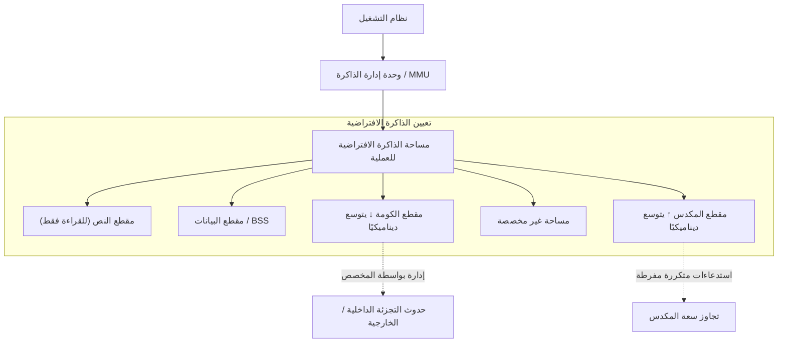
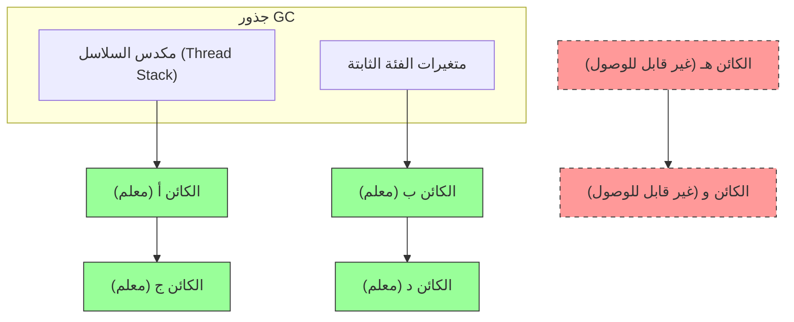
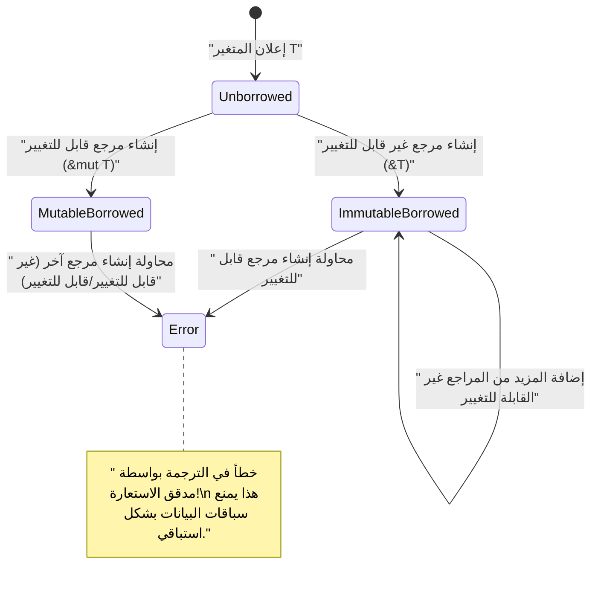

# مرحبًا بك في حقيقة إدارة الذاكرة: كشف الأعماق من خلال C، [Java](https://kenji.blog/ar/p/programming-languages-history-paradigm-evolution/)، و [Rust](https://kenji.blog/ar/p/webassembly-wasm-current-future/)

في تطوير البرمجيات، تعد إدارة الذاكرة موضوعًا أبديًا لا يمكن تجنبه، وهي من أهم العوامل التي تحدد أداء واستقرار النظام. في هذه المقالة، ومن خلال تعمق هائل يعادل حوالي 20,000 حرف، سنغطي بشكل شامل كل شيء بدءًا من النظريات الأساسية لإدارة الذاكرة وحتى تقنيات التحسين في البنيات المعمارية الحديثة.

الحرية والمسؤولية في **الإدارة اليدوية** التي جلبتها لغة C، والأتمتة الآمنة من خلال **جمع القمامة** (GC) التي نشرتها [Java](https://kenji.blog/ar/p/programming-languages-history-paradigm-evolution/)، ونموذج التحقق في وقت الترجمة المتمثل في **الملكية** (Ownership) الذي قدمته [Rust](https://kenji.blog/ar/p/programming-languages-history-paradigm-evolution/). من خلال مقارنة وتحليل هذه المقاربات الثلاثة المختلفة تمامًا، سنقترب من جوهر **تاريخ وتطور** كيفية تعامل لغات البرمجة مع المورد المحدود المسمى بالذاكرة.

---

## 1. البنية الأساسية للذاكرة: المكدس ([Stack](https://kenji.blog/ar/p/c-language-pointers-memory-management-stack-heap/))، الكومة ([Heap](https://kenji.blog/ar/p/c-language-pointers-memory-management-stack-heap/))، والذاكرة الافتراضية

عند تنفيذ برنامج، يقوم نظام التشغيل (OS) بتخصيص منطقة ذاكرة مجردة تسمى "مساحة الذاكرة الافتراضية" للعملية. من وجهة نظر البرنامج، تبدو هذه المساحة كمساحة ذاكرة ضخمة ومتجاورة، ولكن في الخلفية، يتم تعيينها إلى الذاكرة المادية (RAM) أو مساحة التبديل بواسطة آلية الترحيل (paging) في نظام التشغيل.

تنقسم مساحة الذاكرة الافتراضية منطقيًا بشكل رئيسي إلى المقاطع التالية بناءً على دورها:

1. **مقطع النص (Text Segment)** : المنطقة التي يتم فيها تخزين أوامر لغة الآلة المجمعة (الكود القابل للتنفيذ). عادةً ما يتم تعيينها للقراءة فقط لمنع التلاعب.
2. **مقطع البيانات (Data Segment)** : المنطقة التي يتم فيها وضع المتغيرات العامة والثابتة (static) المهيأة.
3. **مقطع BSS (BSS Segment)** : يتم فيها وضع المتغيرات العامة والثابتة غير المهيأة، ويتم تصفيرها عند بدء التنفيذ.
4. **مقطع المكدس (Stack Segment)** : المنطقة التي يتم فيها تكديس المتغيرات المحلية وسياق استدعاء الدالة (عنوان العودة، الوسائط، إلخ).
5. **مقطع الكومة (Heap Segment)** : منطقة لتخصيص الذاكرة ديناميكيًا أثناء تنفيذ البرنامج.

### 1.1 خصائص وحدود ذاكرة المكدس

يتمتع المكدس ببينية بيانات LIFO (ما يدخل أخيرًا يخرج أولاً)، حيث يتم حجز الذاكرة تلقائيًا كإطار مكدس عند استدعاء الدالة، ويتم تحريرها تلقائيًا في نفس وقت الخروج من الدالة.
نظرًا لأن التخصيص يكتمل ببساطة عن طريق تحريك مؤشر المكدس، فهو **سريع للغاية**.

ومع ذلك، للمكدس حدود حاسمة. حجم المكدس مقيد بواسطة نظام التشغيل (على سبيل المثال: عادةً 8 ميجابايت في Linux)، ومحاولة تخصيص مصفوفة ضخمة على المكدس، أو إجراء استدعاءات متكررة (recursive) عميقة جدًا ستؤدي إلى حدوث **تجاوز سعة المكدس (Stack Overflow)**، مما يؤدي إلى انهيار البرنامج.

### 1.2 خصائص وتعقيد ذاكرة الكومة

الكومة هي مساحة واسعة لتخصيص الذاكرة ديناميكيًا. يتم استخدامها لتخزين البيانات التي يتحدد حجمها في وقت التنفيذ، أو البيانات التي تستمر في الوجود خارج نطاق الدالة.

إدارة الكومة معقدة، وتتطلب من المبرمج أو وقت التشغيل (runtime) إجراء التخصيص والتحرير في الوقت المناسب. الإدارة غير السليمة للكومة تسبب تسرب الذاكرة أو التجزئة (Fragmentation) التي سيتم شرحها لاحقًا.



---

## 2. لغة C: الحرية المطلقة والمسؤولية الذاتية

أتاحت لغة C تحكمًا منخفض المستوى قريبًا من الأجهزة، ومنحت المطورين **صلاحية كاملة** في إدارة الذاكرة. في حين أن هذا يسمح باستخراج أقصى أداء، فإنه يعني أن خطأ بسيطًا يمكن أن يؤدي مباشرة إلى أخطاء قاتلة وثغرات أمنية.

### 2.1 آلية malloc و free

يتم التخصيص الديناميكي لذاكرة الكومة في لغة C يدويًا من خلال دوال المكتبة القياسية `malloc` و `calloc`، ويتم التحرير بواسطة `free`. في الخلفية، تعمل مخصصات (allocators) مثل `ptmalloc` أو `jemalloc`، وتطلب الذاكرة من نظام التشغيل عبر استدعاءات النظام (`brk` أو `mmap`).

```c
#include <stdio.h>
#include <stdlib.h>
#include <string.h>

typedef struct {
    int id;
    char name[50];
} User;

int main() {
    // تخصيص الذاكرة ديناميكيًا لبنية User في منطقة الكومة
    User *user_ptr = (User*)malloc(sizeof(User));
    
    if (user_ptr == NULL) {
        fprintf(stderr, "فشل تخصيص الذاكرة.\n");
        return 1;
    }
    
    // كتابة البيانات
    user_ptr->id = 1;
    strncpy(user_ptr->name, "Alice", sizeof(user_ptr->name) - 1);
    user_ptr->name[sizeof(user_ptr->name) - 1] = '\0';
    
    printf("User ID: %d, Name: %s\n", user_ptr->id, user_ptr->name);
    
    // تأكد من تحرير الذاكرة يدويًا عند الانتهاء من الاستخدام
    free(user_ptr);
    
    // يصبح المؤشر بعد التحرير مؤشرًا متدليًا (Dangling Pointer)، لذا يتم تعيينه إلى NULL لضمان الأمان
    user_ptr = NULL;
    
    return 0;
}
```

### 2.2 الكابوس الذي تسببه إدارة الذاكرة اليدوية

تولد إدارة الذاكرة في لغة C بسهولة الأخطاء النموذجية التالية (ثغرات الذاكرة).

1. **تسرب الذاكرة (Memory Leak)** : ظاهرة تبقى فيها الذاكرة غير المستخدمة دون تحرير بسبب نسيان استدعاء `free`. إذا حدث هذا في خوادم تعمل لفترات طويلة، فإنه سيستهلك الذاكرة الكلية للنظام في النهاية، وسيتم إنهاؤه قسريًا بواسطة قاتل OOM (Out Of Memory).
2. **المؤشر المتدلي (Dangling [Pointer](https://kenji.blog/ar/p/c-language-pointers-memory-management-stack-heap/))** : مؤشر يستمر في الإشارة إلى منطقة ذاكرة تم تحريرها بالفعل بواسطة `free`. تؤدي محاولة الوصول إلى الذاكرة عبر هذا المؤشر إلى سلوك غير محدد (مثل خطأ تجزئة Segmentation Fault).
3. **التحرير المزدوج (Double Free)** : خطأ استدعاء `free` مرتين لنفس مؤشر الكومة. يؤدي ذلك إلى تدمير البنية الداخلية للمخصص (مثل القائمة الحرة للكومة)، ويصبح ثغرة أمنية.
4. **تجاوز سعة المخزن المؤقت (Buffer Overflow)** : ظاهرة كتابة بيانات تتجاوز منطقة الذاكرة المخصصة. من خلال إعادة كتابة البيانات المهمة المجاورة أو عنوان الإرجاع، يصبح هذا نقطة انطلاق لهجمات تنفيذ كود ضار (مثل تحطيم المكدس).

دعونا نصوغها رياضيًا. بافتراض أن إجمالي كمية التخصيص في الكومة في الوقت $ t $ هو $ A(t) $، وإجمالي كمية التحرير هو $ F(t) $. يتم تمثيل استخدام الذاكرة النشط $ M(t) $ في النظام بالتكامل التالي:

$ M(t) = \int_0^t (A(\tau) - F(\tau)) d\tau $

من الناحية المنطقية، في الوقت $ T $ الذي ينتهي فيه البرنامج بشكل طبيعي، يُفضل أن يكون $ M(T) = 0 $. ومع ذلك، إذا استمرت حالة $ A(t) > F(t) $ بشكل ثابت، فسيستمر $ M(t) $ في الزيادة بشكل رتيب، وسيتجاوز الحد الأقصى للذاكرة المادية للنظام $ M_{max} $. هذا هو التعريف الرياضي لـ **تسرب الذاكرة**.

---

## 3. [Java](https://kenji.blog/ar/p/programming-languages-history-paradigm-evolution/): الثورة التي أحدثها جمع القمامة

الشيء الذي أحدث نقلة نوعية كبيرة في صناعة البرمجيات التي كانت تعاني من أخطاء الذاكرة المتكررة في C/C++ هو لغة Java. أزالت Java تعقيد إدارة الذاكرة من المبرمجين، وأوكلته إلى **جمع القمامة** (GC) المدمج في آلة Java الافتراضية (JVM). أصبح بإمكان المطورين التركيز فقط على كتابة منطق الأعمال وإنشاء الكائنات.

### 3.1 أساسيات GC: قابلية الوصول و Mark-and-Sweep

يعتمد GC في Java على مفهوم "قابلية الوصول (Reachability)". يتم تعريف المتغيرات المحلية على المكدس أو المتغيرات الثابتة كـ "جذور GC (GC Roots)"، وتُعتبر الكائنات التي يمكن تتبع المراجع منها **حية** (Alive)، والكائنات التي لا يمكن تتبعها تُعتبر **قمامة** (Garbage).

الخوارزمية الأكثر كلاسيكية وأساسية هي "Mark-and-Sweep".

1. **مرحلة العلامة (Mark Phase)** : تبدأ من جذور GC وتعبر (traverse) رسم بياني المراجع للكائنات. تضع "علامة حياة" على جميع الكائنات التي يمكن الوصول إليها.
2. **مرحلة المسح (Sweep Phase)** : تفحص الكومة بأكملها، وتسترد مناطق الذاكرة للكائنات التي لم يتم تمييزها بعلامة وتضعها في "قائمة المساحات الفارغة (Free List)".



في الرسم البياني أعلاه، يتم تمييز الكائنات الخضراء كقابلة للوصول ومحمية. من ناحية أخرى، المجموعة من الكائنات المشار إليها بخطوط متقطعة حمراء لا يشار إليها من أي مكان، لذلك يتم استرداد ذاكرتها تلقائيًا في مرحلة المسح.

### 3.2 سلوك الذاكرة في كود [Java](https://kenji.blog/ar/p/programming-languages-history-paradigm-evolution/)

في Java، يتم تخصيص الكائنات على الكومة باستخدام الكلمة الأساسية `new`، ولكن لا توجد تعليمة تحرير مكافئة لـ `free` في لغة C.

```java
import java.util.ArrayList;
import java.util.List;

public class GcExample {
    public static void main(String[] args) {
        // إنشاء كائن على الكومة، وربط المرجع بمتغير محلي
        List<String> activeList = new ArrayList<>();
        activeList.add("Important Data");
        
        // إنشاء عدد كبير من الكائنات قصيرة العمر داخل النطاق
        for (int i = 0; i < 10000; i++) {
            // يصبح كائن temp غير قابل للوصول عند نهاية كل تكرار للحلقة
            String temp = new String("Temporary Data " + i);
        }
        
        // عند الوصول إلى هنا، تصبح الكائنات الـ 10,000 من نوع String أهدافًا لجمع القمامة (GC)
        // يمكن الوصول إلى activeList من جذر GC حتى نهاية دالة main
        
        // طلب صريح لتنفيذ GC (ومع ذلك، ليس مضمونًا أن يقوم JVM بتنفيذه فعليًا)
        System.gc();
        
        System.out.println("نهاية البرنامج");
    }
}
```

### 3.3 GC حسب الجيل (Generational GC) و Stop-The-World

تقوم أجهزة JVM الحديثة (مثل HotSpot VM) بتقسيم الكومة عبر الأجيال (Generation) من أجل الكفاءة. يعتمد هذا على القاعدة التجريبية **"معظم الكائنات تصبح غير ضرورية بمجرد إنشائها (فرضية الجيل الضعيف)"**.

تنقسم الكومة بشكل أساسي إلى "الجيل الشاب (مساحة Eden، مساحة Survivor)" و"الجيل القديم (مساحة Tenured)".

- **Minor GC** : يتم تشغيله عندما يمتلئ الجيل الشاب. يسترد الكائنات قصيرة العمر بسرعة.
- **Major GC / Full GC** : يتم ترقية (Promote) الكائنات التي نجت من عدة Minor GC إلى الجيل القديم. عندما يمتلئ الجيل القديم، يتم تشغيل Full GC الذي يستغرق وقتًا أطول وهو على نطاق أوسع.

عند تنفيذ GC، تتوقف جميع سلاسل رسائل (threads) التطبيق مؤقتًا للحفاظ على تناسق الذاكرة. يُطلق على هذا اسم إيقاف **Stop-The-World (STW)**. نظرًا لأن STW يمثل مشكلة قاتلة في أنظمة الوقت الفعلي والأنظمة المالية التي تتطلب زمن انتقال منخفض، يتم تعزيز البحث واعتماد أحدث خوارزميات GC، مثل G1GC و ZGC، لتقصير STW قدر الإمكان.

---

## 4. [Rust](https://kenji.blog/ar/p/webassembly-wasm-current-future/): المسار الثالث الذي توفره الملكية والاستعارة

"الأداء الأقصى من خلال الإدارة اليدوية" في C، و"أمان الذاكرة من خلال الإدارة التلقائية" في [Java](https://kenji.blog/ar/p/programming-languages-history-paradigm-evolution/). لفترة طويلة، كان يُعتقد أن هذين الأمرين يمثلان علاقة مقايضة. ومع ذلك، من خلال تقديم النموذج الرائد لـ **"الملكية (Ownership)"**، حققت لغة [Rust](https://kenji.blog/ar/p/programming-languages-history-paradigm-evolution/) إنجازًا يتمثل في ضمان أمان الذاكرة بنسبة 100% في وقت الترجمة، مع القضاء على جمع القمامة.

### 4.1 المبادئ الثلاثة للملكية (Ownership)

يتكون نظام الملكية، وهو أساس إدارة الذاكرة في Rust، من القواعد الصارمة الثلاثة التالية.

1. كل قيمة في Rust مرتبطة بمتغير يسمى **المالك (owner)**.
2. في أي وقت، لا يمكن أن يكون هناك سوى **مالك واحد** للقيمة.
3. عندما **يخرج المالك من النطاق (scope)**، يتم تدمير (إسقاط drop) القيمة على الفور.

من خلال هذه القواعد، تسمح Rust باستدعاء الدالة `drop` تلقائيًا لتحرير الذاكرة في اللحظة التي يخرج فيها المتغير من النطاق، دون مطالبة المطورين بكتابة `malloc` أو `free`. لا توجد سلسلة رسائل (thread) مراقبة لوقت التشغيل مثل GC.

### 4.2 نقل الملكية (Move)

في [Rust](https://kenji.blog/ar/p/webassembly-wasm-current-future/)، عندما تقوم بتعيين متغير إلى متغير آخر، أو تمرير قيمة إلى دالة، "تنتقل (Move)" الملكية. لا يمكن الوصول إلى المتغير المصدر بعد ذلك (سيؤدي إلى خطأ في الترجمة). وهذا يجعل التحرير المزدوج (Double Free) مستحيلًا هيكليًا.

```rust
fn main() {
    // تخصيص سلسلة نصية على الكومة. يصبح s1 هو المالك.
    let s1 = String::from("hello, rust");
    
    // تنتقل (تتحرك) الملكية من s1 إلى s2.
    // من هذه اللحظة، يصبح s1 غير صالح. إنه نسخ سطحي (shallow copy)، ولكن لمنع التحرير المزدوج، يتم إبطال المتغير الأصلي.
    let s2 = s1; 
    
    // println!("{}", s1); // خطأ في الترجمة! (تم استعارة القيمة هنا بعد النقل)
    println!("s2 يمتلك البيانات: {}", s2);
    
} // انتهاء النطاق. يتم إسقاط s2، ويتم تحرير الذاكرة على الكومة بأمان.
```

### 4.3 الاستعارة (Borrowing) ووقت الحياة (Lifetime)

إذا تم نقل الملكية في كل عملية، فستصبح البرمجة غير مريحة للغاية. للوصول إلى البيانات دون أخذ الملكية، تمتلك [Rust](https://kenji.blog/ar/p/webassembly-wasm-current-future/) مفاهيم **المرجع (Reference)** و **الاستعارة (Borrowing)**.

علاوة على ذلك، يفرض **مدقق الاستعارة (Borrow Checker)** المدمج في مترجم [Rust](https://kenji.blog/ar/p/programming-languages-history-paradigm-evolution/) القواعد الصارمة التالية في وقت الترجمة.

- في أي وقت، يمكنك أن تمتلك إما **مرجعًا قابلاً للتغيير واحدًا (`&mut T`)**، أو **أي عدد من المراجع غير القابلة للتغيير (`&T`)** (لا يمكن أن يوجدا معًا في نفس الوقت. لمنع سباق البيانات Data Race).
- يجب ألا يتجاوز وقت حياة المرجع (فترة الصلاحية) وقت حياة البيانات الأصلية (منع كامل للمؤشرات المتدلية).

```rust
fn main() {
    let mut data = String::from("Memory");
    
    // استعارة غير قابلة للتغيير (يمكن إنشاء العديد منها)
    let r1 = &data;
    let r2 = &data;
    println!("مراجع غير قابلة للتغيير: {} و {}", r1, r2);
    // ينتهي وقت حياة r1 و r2 هنا (لأنه لن يتم استخدامهما لاحقًا)
    
    // استعارة قابلة للتغيير (يمكن إنشاء واحدة فقط)
    let r3 = &mut data;
    r3.push_str(" Management");
    println!("بعد التغيير بمرجع قابل للتغيير: {}", r3);
    
    // إذا حاولت استخدام r1 و r3 في نفس الوقت، فسيصدر مدقق الاستعارة خطأ في الترجمة
    // println!("{}, {}", r1, r3); // خطأ!
}
```



---

## 5. التحسينات المتطورة: محلية البيانات وذاكرة التخزين المؤقت لوحدة المعالجة المركزية (CPU Cache)

لإتقان إدارة الذاكرة، من المهم تجاوز إطار "التخصيص والتحرير" البسيط، ومواءمة البنى المعمارية للأجهزة الحديثة. هذا هو مفهوم **محلية البيانات (Data Locality)**.

وحدات المعالجة المركزية الحديثة سريعة جدًا، ولكن الوصول إلى الذاكرة الرئيسية (RAM) ينطوي على تأخير يصل إلى مئات من دورات الساعة. لإخفاء ذلك، تم تجهيز وحدات المعالجة المركزية بـ **ذاكرة تخزين مؤقت (CPU Cache)** هرمية مثل L1 و L2 و L3.

عندما تقرأ وحدة المعالجة المركزية البيانات من الذاكرة، فإنها لا تقوم بتحميل تلك البيانات فقط، بل تقوم أيضًا بتحميل كتلة ذاكرة مجاورة بحجم معين (خط ذاكرة التخزين المؤقت، عادة 64 بايت) بالكامل في ذاكرة التخزين المؤقت. يُطلق على هذا اسم "المحلية المكانية (Spatial Locality)".

### 5.1 اختلافات كفاءة التخزين المؤقت حسب اللغة

- **C / C++ / [Rust](https://kenji.blog/ar/p/webassembly-wasm-current-future/)** : عند إنشاء مصفوفة من البنيات (`struct Array[100]` أو `Vec<MyStruct>`)، يتم وضع البيانات بشكل متجاور دون فجوات في الذاكرة. عند معالجة المصفوفة في حلقة، تعمل آلية الجلب المسبق (prefetcher) للأجهزة في وحدة المعالجة المركزية بشكل مثالي، ويزداد معدل إصابة ذاكرة التخزين المؤقت (cache hit rate) بشكل كبير.
- **[Java](https://kenji.blog/ar/p/programming-languages-history-paradigm-evolution/)** : مصفوفات كائنات Java (`MyObject[]`) ليست كيانات فعلية ولكنها مصفوفات من "المراجع (المؤشرات) إلى الكائنات". نظرًا لأنه يتم تخصيص كل كائن فعلي في أماكن متفرقة على الكومة، فإن كل تكرار للحلقة سيتتبع المؤشر ويصل إلى عنوان ذاكرة عشوائي، مما يتسبب في توالي أخطاء ذاكرة التخزين المؤقت (Cache Miss) الخطيرة.

يتم التعبير عن متوسط الوقت الفعلي للوصول إلى الذاكرة $ T_{avg} $ على النحو التالي:

$ T_{avg} = h \cdot T_{cache} + (1 - h) \cdot T_{memory} $

هنا، $ h $ هو معدل إصابة التخزين المؤقت ($ 0 \le h \le 1 $)، $ T_{cache} $ هو وقت الوصول إلى ذاكرة التخزين المؤقت (حوالي 1 إلى 4 نانوثانية)، و $ T_{memory} $ هو وقت الوصول إلى الذاكرة الرئيسية (حوالي 100 نانوثانية).
يؤدي جعل $ h $ 0.99 (نهج C/[Rust](https://kenji.blog/ar/p/webassembly-wasm-current-future/)) أو إسقاطه إلى 0.5 (تتبع المؤشرات في [Java](https://kenji.blog/ar/p/programming-languages-history-paradigm-evolution/)) إلى خلق فرق يصل إلى عشرات الأضعاف في سرعة تنفيذ الحلقة للتطبيق. هذا هو السبب الحقيقي وراء اختيار C++ و [Rust](https://kenji.blog/ar/p/programming-languages-history-paradigm-evolution/) لمحركات الألعاب وأنظمة التداول عالي التردد.

---

## 6. الخلاصة: نحو اختيار تقني مناسب للمكان المناسب

في هذه المقالة، تعمقنا في ثلاثة نماذج مختلفة تمامًا لإدارة الذاكرة.

| اللغة | المقاربة | المزايا | العيوب/التحديات |
|:---:|:---|:---|:---|
| **C** | الإدارة اليدوية بواسطة `malloc/free` | سرعة قصوى، أقصى كفاءة لذاكرة التخزين المؤقت، خفيفة الوزن | مرتع للثغرات (تسرب، تحرير مزدوج)، تكلفة تطوير عالية |
| **[Java](https://kenji.blog/ar/p/programming-languages-history-paradigm-evolution/)** | GC (جمع القمامة) | تحسين سرعة التطوير، ضمان أمان الذاكرة | تذبذب زمن الوصول بسبب STW، تدهور كفاءة التخزين المؤقت |
| **[Rust](https://kenji.blog/ar/p/webassembly-wasm-current-future/)** | الملكية ومدقق الاستعارة | أمان بدون تكلفة وقت التشغيل، سريعة | منحنى تعليمي حاد، صعوبة تصميم وقت الحياة |

كان تاريخ **إدارة الذاكرة** عبارة عن لعبة تأرجح بين الأداء والأمان. لمنع الكوارث الناجمة عن الإدارة اليدوية، وُلد GC، ولتجنب عقوبات الأداء لـ GC، تم اختراع نموذج الملكية.

عندما نقوم بتصميم أنظمة، لا ينبغي اتخاذ قرارات متسرعة مثل "استخدم [Rust](https://kenji.blog/ar/p/programming-languages-history-paradigm-evolution/) لأنها الأسرع" أو "استخدم [Java](https://kenji.blog/ar/p/programming-languages-history-paradigm-evolution/) لأنها آمنة"، بل يجب أن يكون مسار المهندس من الدرجة الأولى هو اختيار التكنولوجيا المثلى بعد مقارنة متطلبات النظام (الصرامة تجاه زمن الوصول، موارد التطوير، قابلية الصيانة) مع **حقيقة** إدارة الذاكرة الكامنة وراءها.
