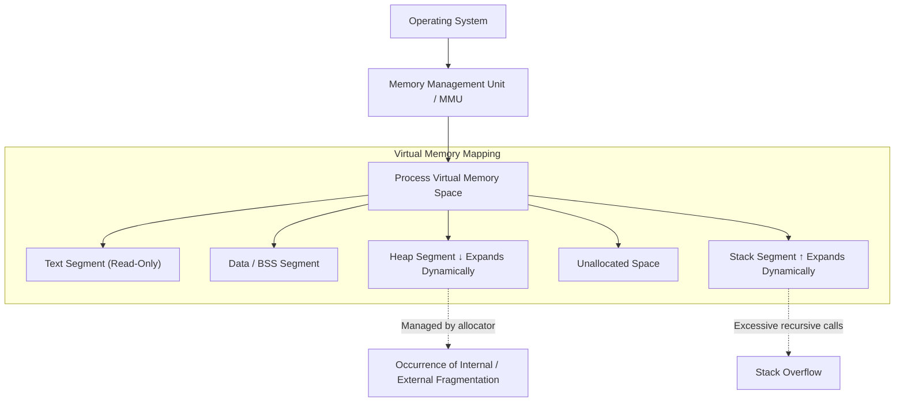
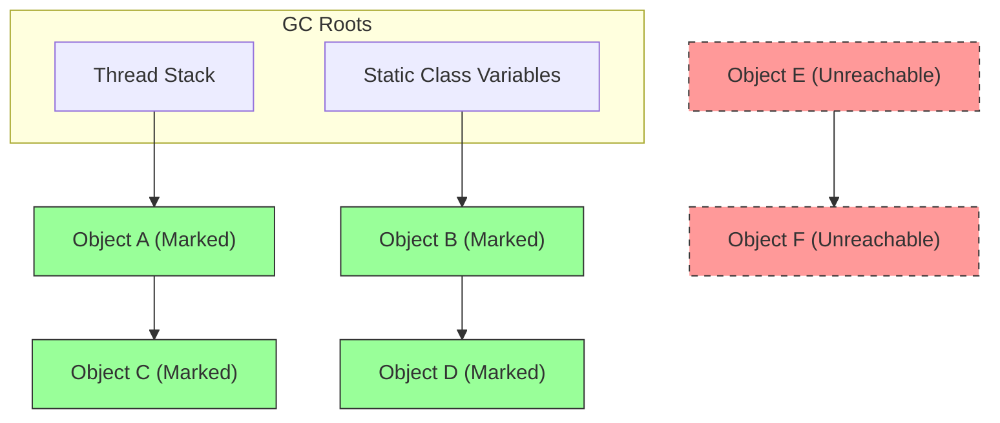
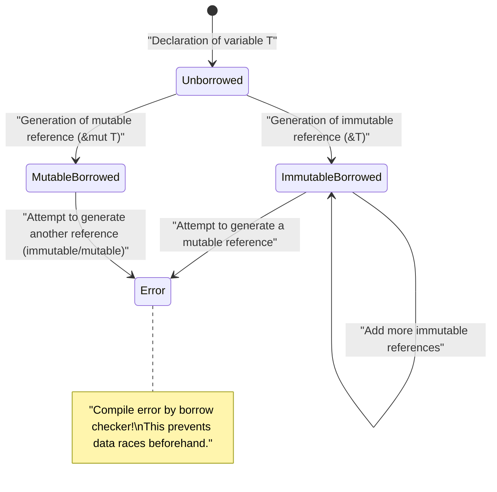

# Welcome to the Truth of [Memory Management](https://kenji.blog/en/p/c-language-pointers-memory-management-stack-heap/): Unraveling the Abyss from C, Java, and [Rust](https://kenji.blog/en/p/webassembly-wasm-current-future/)

In software development, memory management is an eternal theme that cannot be avoided, and is one of the most important factors determining the performance and stability of a system. In this article, through an overwhelming deep dive comparable to a 20,000-character scale, we comprehensively cover everything from the basic theory of memory management to optimization techniques in modern architectures.

The freedom and responsibility of **manual management** brought by the C language, the safe automation through **garbage collection** (GC) popularized by [Java](https://kenji.blog/en/p/programming-languages-history-paradigm-evolution/), and the paradigm of compile-time verification called **Ownership** presented by [Rust](https://kenji.blog/en/p/programming-languages-history-paradigm-evolution/). By comparing and analyzing these three completely different approaches, we approach the essence of its **history and evolution**, and how programming languages have faced the limited resource of memory.

---

## 1. Basic Structure of Memory: [Stack](https://kenji.blog/en/p/c-language-pointers-memory-management-stack-heap/), [Heap](https://kenji.blog/en/p/c-language-pointers-memory-management-stack-heap/), and Virtual Memory

When a program is executed, the operating system (OS) allocates an abstracted memory area called "virtual memory space" to the process. From the program's perspective, this space appears as a continuous, massive memory space, but behind the scenes, it is mapped to physical memory (RAM) or swap space by the OS's paging mechanism.

The virtual memory space is logically divided mainly into the following segments according to their roles:

1. **Text Segment**: The area where compiled machine language instructions (executable code) are stored. It is usually set to read-only to prevent tampering.
2. **Data Segment**: The area where initialized global variables and static variables are placed.
3. **BSS Segment**: The area where uninitialized global variables and static variables are placed, and zero-cleared at the start of execution.
4. **Stack Segment**: The area where local variables and the context upon function calls (return address, arguments, etc.) are pushed.
5. **Heap Segment**: The area for dynamically allocating memory during program execution.

### 1.1 Characteristics and Limitations of Stack Memory

The stack has a LIFO (Last In, First Out) data structure, where memory is automatically allocated as a stack frame when a function is called, and is automatically freed at the same time the function is exited.
Allocation is completed just by moving the stack pointer, making it extremely **fast**.

However, the stack has a definitive limitation. The stack size is limited by the OS (e.g., typically 8MB on Linux), and attempting to allocate a huge array on the stack or making too deep recursive calls will cause a **stack overflow**, and the program will crash.

### 1.2 Characteristics and Complexity of Heap Memory

The heap is a vast area for dynamically allocating memory. It is used to store data whose size is determined at runtime, or data that continues to live beyond the scope of a function.

Heap management is complex, and the programmer or runtime needs to perform allocation and freeing at the appropriate timing. Improper heap management is a cause of memory leaks and fragmentation, which will be discussed later.



---

## 2. C Language: Ultimate Freedom and Self-Responsibility

The C language enables low-level control close to the hardware and has given developers **complete authority** over memory management. While this draws out the best performance, it means that a slight mistake directly leads to fatal bugs or security holes.

### 2.1 The Mechanism of malloc and free

Dynamic allocation of heap memory in C is done manually by standard library functions `malloc` or `calloc`, and freeing by `free`. Behind the scenes, allocators like `ptmalloc` or `jemalloc` work, requesting memory from the OS through system calls (`brk` or `mmap`).

```c
#include <stdio.h>
#include <stdlib.h>
#include <string.h>

typedef struct {
    int id;
    char name[50];
} User;

int main() {
    // Dynamically allocate memory for the User struct on the heap
    User *user_ptr = (User*)malloc(sizeof(User));
    
    if (user_ptr == NULL) {
        fprintf(stderr, "Failed to allocate memory.\n");
        return 1;
    }
    
    // Write data
    user_ptr->id = 1;
    strncpy(user_ptr->name, "Alice", sizeof(user_ptr->name) - 1);
    user_ptr->name[sizeof(user_ptr->name) - 1] = '\0';
    
    printf("User ID: %d, Name: %s\n", user_ptr->id, user_ptr->name);
    
    // Always manually free the memory after use
    free(user_ptr);
    
    // The pointer becomes a dangling pointer after freeing, so assign NULL to ensure safety
    user_ptr = NULL;
    
    return 0;
}
```

### 2.2 The Nightmare Caused by Manual [Memory Management](https://kenji.blog/en/p/c-language-pointers-memory-management-stack-heap/)

Memory management in C easily creates typical bugs (memory vulnerabilities) like the following.

1. **Memory Leak**: A phenomenon where unused memory remains un-freed by forgetting to call `free`. If it occurs on a long-running server, it eventually consumes all the system memory and is force-killed by the OOM (Out Of Memory) killer.
2. **Dangling [Pointer](https://kenji.blog/en/p/c-language-pointers-memory-management-stack-heap/)**: A pointer that continues to point to a memory area that has already been freed by `free`. Attempting to access memory through this pointer causes undefined behavior (such as segmentation faults).
3. **Double Free**: An error where `free` is called twice on the same heap area pointer. It destroys the internal structure of the allocator (like the heap's free list) and becomes a security vulnerability.
4. **Buffer Overflow**: A phenomenon of writing data beyond the allocated memory area. By overwriting adjacent important data or return addresses, it becomes a foothold for attacks executing malicious code (like stack smashing).

Let's model this with a formula. Let the total allocated heap amount at a certain point $ t $ be $ A(t) $, and the total freed amount be $ F(t) $. The active memory usage in the system $ M(t) $ is represented by the following integral.

$ M(t) = \int_0^t (A(\tau) - F(\tau)) d\tau $

Ideally, at the point $ T $ when the program terminates normally, logically $ M(T) = 0 $. However, if the state where $ A(t) > F(t) $ continues steadily, $ M(t) $ keeps monotonically increasing and breaks through the system's physical memory limit $ M_{max} $. This is the mathematical definition of a **memory leak**.

---

## 3. [Java](https://kenji.blog/en/p/programming-languages-history-paradigm-evolution/): The Revolution Brought by Garbage Collection

Java brought a major paradigm shift to the software industry, which had suffered from frequent memory bugs in C/C++. Java took away the complexity of memory management from programmers and entrusted it to the **garbage collection** (GC) embedded in the Java Virtual Machine (JVM). Developers could now focus only on describing business logic and generating objects.

### 3.1 The Basics of GC: Reachability and Mark-and-Sweep

Java's GC is based on the concept of "Reachability". Local variables on the stack or static variables are defined as "GC Roots", and objects whose references can be traced from there are judged as **Alive**, while objects that can no longer be traced are judged as **Garbage**.

The most classic and fundamental algorithm is "Mark-and-Sweep".

1. **Mark Phase**: Starts from the GC Roots and traverses the reference graph of objects. It attaches an "alive mark" to all reachable objects.
2. **Sweep Phase**: Scans the entire heap and collects the memory areas of objects without a mark into an "empty area list (free list)".



In the above diagram, the green objects are marked as reachable and protected. On the other hand, the set of objects indicated by the red dotted lines are no longer referenced from anywhere, so their memory is automatically collected in the sweep phase.

### 3.2 Memory Behavior in [Java](https://kenji.blog/en/p/programming-languages-history-paradigm-evolution/) Code

In Java, objects are allocated on the heap with the `new` keyword, but there is no free command corresponding to C's `free`.

```java
import java.util.ArrayList;
import java.util.List;

public class GcExample {
    public static void main(String[] args) {
        // Allocate an object on the heap and bind the reference to a local variable
        List<String> activeList = new ArrayList<>();
        activeList.add("Important Data");
        
        // Generate a large number of short-lived objects within the scope
        for (int i = 0; i < 10000; i++) {
            // The temp object becomes unreachable at the end of each iteration of the loop
            String temp = new String("Temporary Data " + i);
        }
        
        // By the time it reaches here, the 10,000 String objects are targets for GC collection
        // activeList is reachable from the GC roots until the end of the main method
        
        // Explicit GC execution request (however, it is not guaranteed that the JVM will actually execute it)
        System.gc();
        
        System.out.println("Program finished");
    }
}
```

### 3.3 Generational GC and Stop-The-World

Modern JVMs (like HotSpot VM) divide the heap into generations for efficiency. This is based on the empirical rule called the **"Weak Generational Hypothesis: most objects become unreachable quickly"**.

The heap is broadly divided into the "Young Generation (Eden space, Survivor space)" and the "Old Generation (Tenured space)".

- **Minor GC**: Triggered when the Young generation is full. It quickly collects short-lived objects.
- **Major GC / Full GC**: Objects that survive several Minor GCs are promoted to the Old generation. When the Old generation is full, a larger and more time-consuming Full GC is triggered.

When GC is executed, all threads of the application pause to maintain memory consistency. This is called a **Stop-The-World (STW)** pause. In real-time systems or financial systems where low latency is required, this STW becomes a fatal problem, so the research and adoption of the latest GC algorithms like G1GC and ZGC, which minimize STW as much as possible, are advancing.

---

## 4. [Rust](https://kenji.blog/en/p/webassembly-wasm-current-future/): The Third Path Brought by Ownership and Borrowing

"Ultimate performance through manual management" in C and "memory safety through automatic management" in [Java](https://kenji.blog/en/p/programming-languages-history-paradigm-evolution/). These two have long been considered a trade-off relationship. However, the [Rust](https://kenji.blog/en/p/programming-languages-history-paradigm-evolution/) language achieved the feat of guaranteeing 100% memory safety at compile time while eliminating garbage collection by introducing the groundbreaking model of **"Ownership"**.

### 4.1 The 3 Principles of Ownership

The ownership system, which is the foundation of Rust's memory management, consists of the following three strict rules.

1. Each value in Rust has a variable called its **owner**.
2. There can only be **one owner** at a time.
3. When the owner **goes out of scope**, the value is immediately dropped (discarded).

Due to these rules, Rust automatically calls the `drop` function and frees memory the moment a variable leaves its scope, without forcing developers to write `malloc` or `free`. There is no runtime monitoring thread like GC.

### 4.2 Moving Ownership

In [Rust](https://kenji.blog/en/p/webassembly-wasm-current-future/), when a variable is assigned to another variable or passed by value to a function, the ownership is "Moved". The source variable can no longer be accessed after that (it results in a compile error). This structurally makes a Double Free impossible.

```rust
fn main() {
    // Allocate a string on the heap. s1 becomes the owner.
    let s1 = String::from("hello, rust");
    
    // Ownership is moved from s1 to s2.
    // From this moment, s1 is invalidated. It is a shallow copy, but the original variable is invalidated to prevent double free.
    let s2 = s1; 
    
    // println!("{}", s1); // Compile error! (value borrowed here after move)
    println!("s2 owns the data: {}", s2);
    
} // End of scope. s2 is dropped, and the memory on the heap is safely freed.
```

### 4.3 Borrowing and Lifetimes

If ownership is moved in every operation, programming becomes extremely inconvenient. To access data without taking ownership, [Rust](https://kenji.blog/en/p/webassembly-wasm-current-future/) has concepts of **References** and **Borrowing**.

Furthermore, the **Borrow Checker** built into the [Rust](https://kenji.blog/en/p/programming-languages-history-paradigm-evolution/) compiler enforces the following strict rules at compile time:

- At any given time, you can have either **one mutable reference (`&mut T`)** or **any number of immutable references (`&T`)** (simultaneous coexistence is not allowed. Prevention of Data Races).
- The lifetime (valid period) of a reference must not exceed the lifetime of the original data (complete prevention of dangling pointers).

```rust
fn main() {
    let mut data = String::from("Memory");
    
    // Immutable borrowing (multiple can be created)
    let r1 = &data;
    let r2 = &data;
    println!("Immutable references: {} and {}", r1, r2);
    // The lifetimes of r1, r2 end here (because they are not used hereafter)
    
    // Mutable borrowing (only one can be created)
    let r3 = &mut data;
    r3.push_str(" Management");
    println!("After modification with mutable reference: {}", r3);
    
    // Attempting to use r1 and r3 at the same time will cause the borrow checker to throw a compile error
    // println!("{}, {}", r1, r3); // Error!
}
```



---

## 5. Cutting-Edge Optimization: Data Locality and CPU Cache

To master memory management, it is important to go beyond the framework of simple "allocation and freeing" and align with modern hardware architectures. That is the concept of **Data Locality**.

Modern CPUs are extremely fast, but accessing main memory (RAM) incurs a latency of hundreds of clock cycles. To hide this, CPUs are equipped with hierarchical **CPU Caches** like L1, L2, and L3.

When a CPU reads data from memory, it loads not just that data but an entire adjacent memory block of a certain size (a cache line, usually 64 bytes) into the cache. This is called "Spatial Locality".

### 5.1 Differences in Cache Efficiency by Language

- **C / C++ / [Rust](https://kenji.blog/en/p/webassembly-wasm-current-future/)**: When you create an array of structures (`struct Array[100]` or `Vec<MyStruct>`), the data is arranged continuously in memory without gaps. When looping through the array, the CPU's hardware prefetcher functions perfectly, dramatically increasing the cache hit rate.
- **[Java](https://kenji.blog/en/p/programming-languages-history-paradigm-evolution/)**: Java's object arrays (`MyObject[]`) are not arrays of entities, but arrays of "references (pointers) to objects". Since each entity object is allocated in scattered locations on the heap, you trace pointers and access random memory addresses at each loop iteration, repeatedly causing severe Cache Misses.

The effective average time $ T_{avg} $ of memory access is expressed as follows:

$ T_{avg} = h \cdot T_{cache} + (1 - h) \cdot T_{memory} $

Here, $ h $ is the cache hit rate ($ 0 \le h \le 1 $), $ T_{cache} $ is the cache access time (about 1-4 ns), and $ T_{memory} $ is the main memory access time (about 100 ns).
Whether you make $ h $ 0.99 (the C/[Rust](https://kenji.blog/en/p/webassembly-wasm-current-future/) approach) or drop it to 0.5 (Java's pointer chasing), creates a difference of tens of times in the loop execution speed of the application. This is the true reason why C++ and [Rust](https://kenji.blog/en/p/programming-languages-history-paradigm-evolution/) are chosen for game engines and high-frequency trading systems.

---

## 6. Conclusion: Towards the Right Technology Selection in the Right Place

In this article, we dived deep into three completely different memory management paradigms.

| Language | Approach | Merits | Demerits / Challenges |
|:---:|:---|:---|:---|
| **C** | Manual management via `malloc/free` | Ultimate speed, maximum cache efficiency, lightweight | Hotbed for vulnerabilities (leaks, double free), high development cost |
| **[Java](https://kenji.blog/en/p/programming-languages-history-paradigm-evolution/)** | GC (Garbage Collection) | Improved development speed, guaranteed memory safety | Latency fluctuation due to STW, deterioration of cache efficiency |
| **[Rust](https://kenji.blog/en/p/webassembly-wasm-current-future/)** | Ownership / Borrow Checker | Zero-cost runtime safety, fast | Steep learning curve, difficulty in lifetime design |

The history of **memory management** has been a seesaw game oscillating between performance and safety. GC was born to prevent tragedies caused by manual management, and the ownership model was invented to avoid the performance penalty of GC.

When we design a system, rather than short-circuited decisions like "use [Rust](https://kenji.blog/en/p/programming-languages-history-paradigm-evolution/) because it's the fastest" or "use [Java](https://kenji.blog/en/p/programming-languages-history-paradigm-evolution/) because it's safe", it can be said that the path to becoming a top-tier engineer is to select the optimal technology after comparing the system requirements (strictness regarding latency, development resources, maintainability) with the **truth** of memory management behind them.
